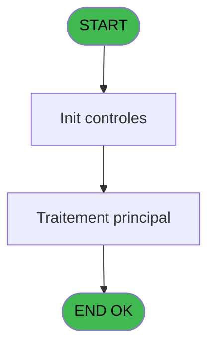

# PBP IDE 113 - Selection tranches

> **Analyse**: Phases 1-4 2026-02-03 09:28 -> 09:28 (20s) | Assemblage 09:28
> **Pipeline**: V7.2 Enrichi
> **Structure**: 4 onglets (Resume | Ecrans | Donnees | Connexions)

<!-- TAB:Resume -->

## 1. FICHE D'IDENTITE

| Attribut | Valeur |
|----------|--------|
| Projet | PBP |
| IDE Position | 113 |
| Nom Programme | Selection tranches |
| Fichier source | `Prg_113.xml` |
| Domaine metier | Consultation |
| Taches | 1 (1 ecrans visibles) |
| Tables modifiees | 0 |
| Programmes appeles | 0 |

## 2. DESCRIPTION FONCTIONNELLE

**Selection tranches** assure la gestion complete de ce processus, accessible depuis [Edition Forfait Ski (IDE 108)](PBP-IDE-108.md).

Le flux de traitement s'organise en **1 blocs fonctionnels** :

- **Consultation** (1 tache) : ecrans de recherche, selection et consultation

## 3. BLOCS FONCTIONNELS

### 3.1 Consultation (1 tache)

Ecrans de recherche et consultation.

---

#### 113 - Selection Tranches d'âge [[ECRAN]](#ecran-t1)

**Role** : Selection par l'operateur : Selection Tranches d'âge.
**Ecran** : 419 x 174 DLU (MDI) | [Voir mockup](#ecran-t1)
**Variables liees** : D (bouton selectionner)

## 5. REGLES METIER

*(Aucune regle metier identifiee)*

## 6. CONTEXTE

- **Appele par**: [Edition Forfait Ski (IDE 108)](PBP-IDE-108.md)
- **Appelle**: 0 programmes | **Tables**: 1 (W:0 R:1 L:0) | **Taches**: 1 | **Expressions**: 6

<!-- TAB:Ecrans -->

## 8. ECRANS

### 8.1 Forms visibles (1 / 1)

| # | Position | Tache | Nom | Type | Largeur | Hauteur | Bloc |
|---|----------|-------|-----|------|---------|---------|------|
| 1 | 113 | 113 | Selection Tranches d'âge | MDI | 419 | 174 | Consultation |

### 8.2 Mockups Ecrans

---

#### 113 - Selection Tranches d'âge
**Tache** : [113](#t1) | **Type** : MDI | **Dimensions** : 419 x 174 DLU
**Bloc** : Consultation | **Titre IDE** : Selection Tranches d'âge

<!-- FORM-DATA:
{
    "width":  419,
    "vFactor":  8,
    "type":  "MDI",
    "hFactor":  8,
    "controls":  [
                     {
                         "x":  88,
                         "type":  "table",
                         "var":  "",
                         "name":  "",
                         "titleH":  12,
                         "color":  "196",
                         "w":  242,
                         "y":  5,
                         "fmt":  "",
                         "parent":  null,
                         "text":  "",
                         "rowH":  13,
                         "h":  116,
                         "cols":  [
                                      {
                                          "title":  "Age début",
                                          "layer":  1,
                                          "w":  105
                                      },
                                      {
                                          "title":  "Age fin",
                                          "layer":  2,
                                          "w":  102
                                      }
                                  ],
                         "rows":  2
                     },
                     {
                         "x":  2,
                         "type":  "label",
                         "var":  "",
                         "y":  153,
                         "w":  414,
                         "fmt":  "",
                         "name":  "",
                         "h":  19,
                         "color":  "",
                         "text":  "",
                         "parent":  null
                     },
                     {
                         "x":  94,
                         "type":  "edit",
                         "var":  "",
                         "y":  19,
                         "w":  93,
                         "fmt":  "3Z",
                         "name":  "Age_debut",
                         "h":  10,
                         "color":  "196",
                         "text":  "",
                         "parent":  1
                     },
                     {
                         "x":  205,
                         "type":  "edit",
                         "var":  "",
                         "y":  19,
                         "w":  87,
                         "fmt":  "3Z",
                         "name":  "Age_fin",
                         "h":  10,
                         "color":  "196",
                         "text":  "",
                         "parent":  1
                     },
                     {
                         "x":  28,
                         "type":  "button",
                         "var":  "",
                         "y":  156,
                         "w":  154,
                         "fmt":  "\u0026Sélectionner",
                         "name":  "bouton selectionner",
                         "h":  14,
                         "color":  "",
                         "text":  "",
                         "parent":  7
                     },
                     {
                         "x":  232,
                         "type":  "button",
                         "var":  "",
                         "y":  156,
                         "w":  154,
                         "fmt":  "\u0026Quitter",
                         "name":  "bouton quitter",
                         "h":  14,
                         "color":  "",
                         "text":  "",
                         "parent":  7
                     },
                     {
                         "x":  180,
                         "type":  "image",
                         "var":  "",
                         "y":  126,
                         "w":  58,
                         "fmt":  "",
                         "name":  "",
                         "h":  18,
                         "color":  "",
                         "text":  "",
                         "parent":  null
                     }
                 ],
    "taskId":  "113",
    "height":  174
}
-->

<strong>Champs : 2 champs</strong>

| Pos (x,y) | Nom | Variable | Type |
|-----------|-----|----------|------|
| 94,19 | Age_debut | - | edit |
| 205,19 | Age_fin | - | edit |

<strong>Boutons : 2 boutons</strong>

| Bouton | Pos (x,y) | Action |
|--------|-----------|--------|
| Sélectionner | 28,156 | Bouton fonctionnel |
| Quitter | 232,156 | Quitte le programme |

## 9. NAVIGATION

Ecran unique: **Selection Tranches d'âge**

### 9.3 Structure hierarchique (1 tache)

| Position | Tache | Type | Dimensions | Bloc |
|----------|-------|------|------------|------|
| **113.1** | [**Selection Tranches d'âge** (113)](#t1) [mockup](#ecran-t1) | MDI | 419x174 | Consultation |

### 9.4 Algorigramme

> **Legende**: Vert = START/END OK | Rouge = END KO | Bleu = Decisions
> *Algorigramme auto-genere. Utiliser `/algorigramme` pour une synthese metier detaillee.*

<!-- TAB:Donnees -->

## 10. TABLES

### Tables utilisees (1)

| ID | Nom | Description | Type | R | W | L | Usages |
|----|-----|-------------|------|---|---|---|--------|
| 797 | log_effectif_envoi |  | DB | R |   |   | 1 |

### Colonnes par table (1 / 1 tables avec colonnes identifiees)

Table 797 - log_effectif_envoi (R) - 1 usages

| Lettre | Variable | Acces | Type |
|--------|----------|-------|------|
| A | P.Tranche mini | R | Numeric |
| B | P.Tranche maxi | R | Numeric |
| C | w0_AutoriseQuitter | R | Logical |
| D | bouton selectionner | R | Alpha |
| E | bouton quitter | R | Alpha |

## 11. VARIABLES

### 11.1 Parametres entrants (2)

Variables recues du programme appelant ([Edition Forfait Ski (IDE 108)](PBP-IDE-108.md)).

| Lettre | Nom | Type | Usage dans |
|--------|-----|------|-----------|
| A | P.Tranche mini | Numeric | 1x parametre entrant |
| B | P.Tranche maxi | Numeric | - |

### 11.2 Autres (3)

Variables diverses.

| Lettre | Nom | Type | Usage dans |
|--------|-----|------|-----------|
| C | w0_AutoriseQuitter | Logical | 1x refs |
| D | bouton selectionner | Alpha | 1x refs |
| E | bouton quitter | Alpha | - |

## 12. EXPRESSIONS

**6 / 6 expressions decodees (100%)**

### 12.1 Repartition par type

| Type | Expressions | Regles |
|------|-------------|--------|
| CONSTANTE | 1 | 0 |
| OTHER | 4 | 0 |
| CAST_LOGIQUE | 1 | 0 |

### 12.2 Expressions cles par type

#### CONSTANTE (1 expressions)

| Type | IDE | Expression | Regle |
|------|-----|------------|-------|
| CONSTANTE | 5 | `0` | - |

#### OTHER (4 expressions)

| Type | IDE | Expression | Regle |
|------|-----|------------|-------|
| OTHER | 3 | `P.Tranche mini [A]` | - |
| OTHER | 6 | `[G]` | - |
| OTHER | 1 | `bouton selectionner [D]` | - |
| OTHER | 2 | `w0_AutoriseQuitter [C]` | - |

#### CAST_LOGIQUE (1 expressions)

| Type | IDE | Expression | Regle |
|------|-----|------------|-------|
| CAST_LOGIQUE | 4 | `'TRUE'LOG` | - |

<!-- TAB:Connexions -->

## 13. GRAPHE D'APPELS

### 13.1 Chaine depuis Main (Callers)

Main -> ... -> [Edition Forfait Ski (IDE 108)](PBP-IDE-108.md) -> **Selection tranches (IDE 113)**

### 13.2 Callers

| IDE | Nom Programme | Nb Appels |
|-----|---------------|-----------|
| [108](PBP-IDE-108.md) | Edition Forfait Ski | 2 |

### 13.3 Callees (programmes appeles)

### 13.4 Detail Callees avec contexte

| IDE | Nom Programme | Appels | Contexte |
|-----|---------------|--------|----------|
| - | (aucun) | - | - |

## 14. RECOMMANDATIONS MIGRATION

### 14.1 Profil du programme

| Metrique | Valeur | Impact migration |
|----------|--------|-----------------|
| Lignes de logique | 20 | Programme compact |
| Expressions | 6 | Peu de logique |
| Tables WRITE | 0 | Impact faible |
| Sous-programmes | 0 | Peu de dependances |
| Ecrans visibles | 1 | Ecran unique ou traitement batch |
| Code desactive | 0% (0 / 20) | Code sain |
| Regles metier | 0 | Pas de regle identifiee |

### 14.2 Plan de migration par bloc

#### Consultation (1 tache: 1 ecran, 0 traitement)

- **Strategie** : Composants de recherche/selection en modales.
- 1 ecran : Selection Tranches d'âge

### 14.3 Dependances critiques

| Dependance | Type | Appels | Impact |
|------------|------|--------|--------|

---
*Spec DETAILED generee par Pipeline V7.2 - 2026-02-03 09:29*
