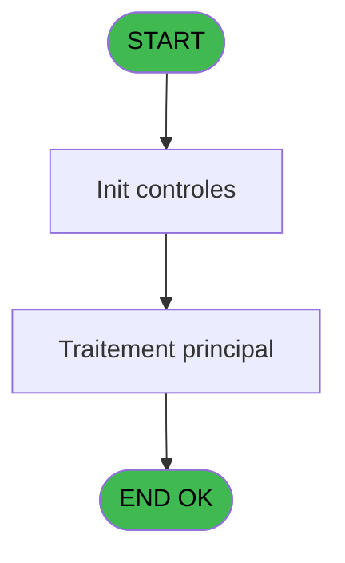
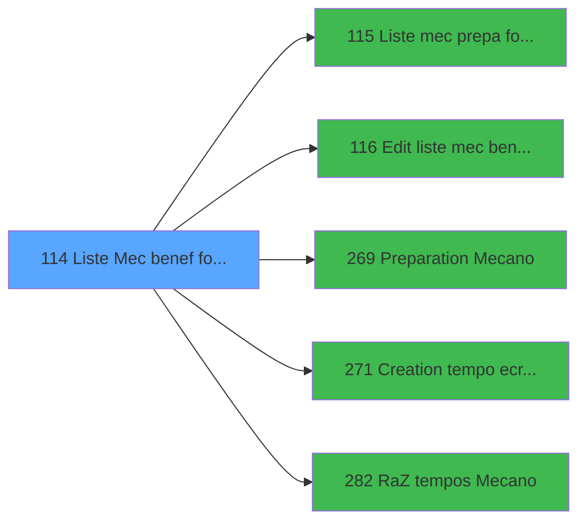

# PBP IDE 114 - Liste Mec benef forfait ski

> **Analyse**: Phases 1-4 2026-02-03 09:29 -> 09:29 (19s) | Assemblage 09:29
> **Pipeline**: V7.2 Enrichi
> **Structure**: 4 onglets (Resume | Ecrans | Donnees | Connexions)

<!-- TAB:Resume -->

## 1. FICHE D'IDENTITE

| Attribut | Valeur |
|----------|--------|
| Projet | PBP |
| IDE Position | 114 |
| Nom Programme | Liste Mec benef forfait ski |
| Fichier source | `Prg_114.xml` |
| Domaine metier | General |
| Taches | 1 (0 ecrans visibles) |
| Tables modifiees | 0 |
| Programmes appeles | 5 |

## 2. DESCRIPTION FONCTIONNELLE

**Liste Mec benef forfait ski** assure la gestion complete de ce processus, accessible depuis [Edition Forfait Ski (IDE 108)](PBP-IDE-108.md).

Le flux de traitement s'organise en **1 blocs fonctionnels** :

- **Traitement** (1 tache) : traitements metier divers

## 3. BLOCS FONCTIONNELS

### 3.1 Traitement (1 tache)

Traitements internes.

---

#### 114 - Liste Mec benef forfait ski [[ECRAN]](#ecran-t1)

**Role** : Traitement : Liste Mec benef forfait ski.
**Ecran** : 72 x 40 DLU (MDI) | [Voir mockup](#ecran-t1)
**Delegue a** : [Liste mec prepa forfait ski (IDE 115)](PBP-IDE-115.md), [Edit liste mec benef forf ski (IDE 116)](PBP-IDE-116.md), [Preparation Mecano (IDE 269)](PBP-IDE-269.md)

## 5. REGLES METIER

*(Aucune regle metier identifiee)*

## 6. CONTEXTE

- **Appele par**: [Edition Forfait Ski (IDE 108)](PBP-IDE-108.md)
- **Appelle**: 5 programmes | **Tables**: 0 (W:0 R:0 L:0) | **Taches**: 1 | **Expressions**: 1

<!-- TAB:Ecrans -->

## 8. ECRANS

*(Programme sans ecran visible)*

## 9. NAVIGATION

### 9.3 Structure hierarchique (1 tache)

| Position | Tache | Type | Dimensions | Bloc |
|----------|-------|------|------------|------|
| **114.1** | [**Liste Mec benef forfait ski** (114)](#t1) [mockup](#ecran-t1) | MDI | 72x40 | Traitement |

### 9.4 Algorigramme

> **Legende**: Vert = START/END OK | Rouge = END KO | Bleu = Decisions
> *Algorigramme auto-genere. Utiliser `/algorigramme` pour une synthese metier detaillee.*

<!-- TAB:Donnees -->

## 10. TABLES

### Tables utilisees (0)

| ID | Nom | Description | Type | R | W | L | Usages |
|----|-----|-------------|------|---|---|---|--------|

### Colonnes par table (0 / 0 tables avec colonnes identifiees)

## 11. VARIABLES

### 11.1 Parametres entrants (2)

Variables recues du programme appelant ([Edition Forfait Ski (IDE 108)](PBP-IDE-108.md)).

| Lettre | Nom | Type | Usage dans |
|--------|-----|------|-----------|
| A | P.Date | Date | - |
| B | P.Type commentaire | Alpha | - |

### 11.2 Variables de session (2)

Variables persistantes pendant toute la session.

| Lettre | Nom | Type | Usage dans |
|--------|-----|------|-----------|
| C | V.Total | Numeric | - |
| D | V.Nb select | Numeric | - |

## 12. EXPRESSIONS

**1 / 1 expressions decodees (100%)**

### 12.1 Repartition par type

| Type | Expressions | Regles |
|------|-------------|--------|
| OTHER | 1 | 0 |

### 12.2 Expressions cles par type

#### OTHER (1 expressions)

| Type | IDE | Expression | Regle |
|------|-----|------------|-------|
| OTHER | 1 | `DbDel ('{637,2}'DSOURCE,'')` | - |

<!-- TAB:Connexions -->

## 13. GRAPHE D'APPELS

### 13.1 Chaine depuis Main (Callers)

Main -> ... -> [Edition Forfait Ski (IDE 108)](PBP-IDE-108.md) -> **Liste Mec benef forfait ski (IDE 114)**

### 13.2 Callers

| IDE | Nom Programme | Nb Appels |
|-----|---------------|-----------|
| [108](PBP-IDE-108.md) | Edition Forfait Ski | 1 |

### 13.3 Callees (programmes appeles)

### 13.4 Detail Callees avec contexte

| IDE | Nom Programme | Appels | Contexte |
|-----|---------------|--------|----------|
| [115](PBP-IDE-115.md) | Liste mec prepa forfait ski | 1 | Configuration impression |
| [116](PBP-IDE-116.md) | Edit liste mec benef forf ski | 1 | Configuration impression |
| [269](PBP-IDE-269.md) | Preparation Mecano | 1 | Sous-programme |
| [271](PBP-IDE-271.md) | Creation tempo ecran par doss | 1 | Sous-programme |
| [282](PBP-IDE-282.md) | RaZ tempos Mecano | 1 | Reinitialisation |

## 14. RECOMMANDATIONS MIGRATION

### 14.1 Profil du programme

| Metrique | Valeur | Impact migration |
|----------|--------|-----------------|
| Lignes de logique | 11 | Programme compact |
| Expressions | 1 | Peu de logique |
| Tables WRITE | 0 | Impact faible |
| Sous-programmes | 5 | Peu de dependances |
| Ecrans visibles | 0 | Ecran unique ou traitement batch |
| Code desactive | 0% (0 / 11) | Code sain |
| Regles metier | 0 | Pas de regle identifiee |

### 14.2 Plan de migration par bloc

#### Traitement (1 tache: 1 ecran, 0 traitement)

- **Strategie** : 1 composant(s) UI (Razor/React) avec formulaires et validation.
- 5 sous-programme(s) a migrer ou a reutiliser depuis les services existants.
- Decomposer les taches en services unitaires testables.

### 14.3 Dependances critiques

| Dependance | Type | Appels | Impact |
|------------|------|--------|--------|
| [Creation tempo ecran par doss (IDE 271)](PBP-IDE-271.md) | Sous-programme | 1x | Normale - Sous-programme |
| [RaZ tempos Mecano (IDE 282)](PBP-IDE-282.md) | Sous-programme | 1x | Normale - Reinitialisation |
| [Preparation Mecano (IDE 269)](PBP-IDE-269.md) | Sous-programme | 1x | Normale - Sous-programme |
| [Liste mec prepa forfait ski (IDE 115)](PBP-IDE-115.md) | Sous-programme | 1x | Normale - Configuration impression |
| [Edit liste mec benef forf ski (IDE 116)](PBP-IDE-116.md) | Sous-programme | 1x | Normale - Configuration impression |

---
*Spec DETAILED generee par Pipeline V7.2 - 2026-02-03 09:29*
