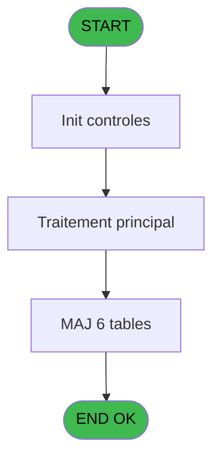

# PBP IDE 115 - Liste mec prepa forfait ski

> **Analyse**: Phases 1-4 2026-02-03 09:29 -> 09:29 (20s) | Assemblage 09:29
> **Pipeline**: V7.2 Enrichi
> **Structure**: 4 onglets (Resume | Ecrans | Donnees | Connexions)

<!-- TAB:Resume -->

## 1. FICHE D'IDENTITE

| Attribut | Valeur |
|----------|--------|
| Projet | PBP |
| IDE Position | 115 |
| Nom Programme | Liste mec prepa forfait ski |
| Fichier source | `Prg_115.xml` |
| Domaine metier | General |
| Taches | 9 (1 ecrans visibles) |
| Tables modifiees | 6 |
| Programmes appeles | 0 |

## 2. DESCRIPTION FONCTIONNELLE

**Liste mec prepa forfait ski** assure la gestion complete de ce processus, accessible depuis [Liste Mec benef forfait ski (IDE 114)](PBP-IDE-114.md).

Le flux de traitement s'organise en **3 blocs fonctionnels** :

- **Traitement** (4 taches) : traitements metier divers
- **Creation** (3 taches) : insertion d'enregistrements en base (mouvements, prestations)
- **Initialisation** (2 taches) : reinitialisation d'etats et de variables de travail

**Donnees modifiees** : 6 tables en ecriture (tempo_present_excel, tempo_zone_secteur, tempo_facturation, tempo_livre_de_porte_bresil, tempo_livre_de_porte, fichier_fictif_blocage_import).

**Logique metier** : 1 regles identifiees couvrant conditions metier.

Detail : phases du traitement

#### Phase 1 : Traitement (4 taches)

- **115** - Veuillez patienter ... **[[ECRAN]](#ecran-t1)**
- **115.1** - eff mecano 1
- **115.2** - eff mecano 2
- **115.4** - eff nombre

#### Phase 2 : Initialisation (2 taches)

- **115.3** - RaZ 161
- **115.5** - RaZ Tempo ecran

#### Phase 3 : Creation (3 taches)

- **115.6** - creation mecano 1
- **115.7** - creation mecano 1
- **115.8** - creation mecano 2

#### Tables impactees

| Table | Operations | Role metier |
|-------|-----------|-------------|
| tempo_facturation | **W** (2 usages) | Table temporaire ecran |
| tempo_zone_secteur | **W** (2 usages) | Table temporaire ecran |
| tempo_livre_de_porte | **W**/L (2 usages) | Table temporaire ecran |
| tempo_livre_de_porte_bresil | **W** (1 usages) | Table temporaire ecran |
| tempo_present_excel | **W** (1 usages) | Table temporaire ecran |
| fichier_fictif_blocage_import | **W** (1 usages) |  |

## 3. BLOCS FONCTIONNELS

### 3.1 Traitement (4 taches)

Traitements internes.

---

#### 115 - Veuillez patienter ... [[ECRAN]](#ecran-t1)

**Role** : Traitement : Veuillez patienter ....
**Ecran** : 427 x 58 DLU (MDI) | [Voir mockup](#ecran-t1)

3 sous-taches directes

| Tache | Nom | Bloc |
|-------|-----|------|
| [115.1](#t2) | eff mecano 1 | Traitement |
| [115.2](#t3) | eff mecano 2 | Traitement |
| [115.4](#t5) | eff nombre | Traitement |

---

#### 115.1 - eff mecano 1

**Role** : Traitement : eff mecano 1.

---

#### 115.2 - eff mecano 2

**Role** : Traitement : eff mecano 2.

---

#### 115.4 - eff nombre

**Role** : Calcul : eff nombre.

### 3.2 Initialisation (2 taches)

Reinitialisation d'etats et variables de travail.

---

#### 115.3 - RaZ 161

**Role** : Reinitialisation : RaZ 161.

---

#### 115.5 - RaZ Tempo ecran

**Role** : Reinitialisation : RaZ Tempo ecran.

### 3.3 Creation (3 taches)

Insertion de nouveaux enregistrements en base.

---

#### 115.6 - creation mecano 1

**Role** : Creation d'enregistrement : creation mecano 1.

---

#### 115.7 - creation mecano 1

**Role** : Creation d'enregistrement : creation mecano 1.

---

#### 115.8 - creation mecano 2

**Role** : Creation d'enregistrement : creation mecano 2.

## 5. REGLES METIER

1 regles identifiees:

### Autres (1 regles)

#### [RM-001] Condition toujours vraie (flag actif)

| Element | Detail |
|---------|--------|
| **Condition** | `[BO]='TRUE'LOG` |
| **Si vrai** | '> Heb' |
| **Si faux** | IF ([BH]='TRUE'LOG,'> '&[BN],'')) |
| **Expression source** | Expression 1 : `IF ([BO]='TRUE'LOG,'> Heb',IF ([BH]='TRUE'LOG,'> '&[BN],''))` |
| **Exemple** | Si [BO]='TRUE'LOG → '> Heb'. Sinon → IF ([BH]='TRUE'LOG,'> '&[BN],'')) |

## 6. CONTEXTE

- **Appele par**: [Liste Mec benef forfait ski (IDE 114)](PBP-IDE-114.md)
- **Appelle**: 0 programmes | **Tables**: 11 (W:6 R:1 L:5) | **Taches**: 9 | **Expressions**: 20

<!-- TAB:Ecrans -->

## 8. ECRANS

### 8.1 Forms visibles (1 / 9)

| # | Position | Tache | Nom | Type | Largeur | Hauteur | Bloc |
|---|----------|-------|-----|------|---------|---------|------|
| 1 | 115 | 115 | Veuillez patienter ... | MDI | 427 | 58 | Traitement |

### 8.2 Mockups Ecrans

---

#### 115 - Veuillez patienter ...
**Tache** : [115](#t1) | **Type** : MDI | **Dimensions** : 427 x 58 DLU
**Bloc** : Traitement | **Titre IDE** : Veuillez patienter ...

<!-- FORM-DATA:
{
    "width":  427,
    "vFactor":  8,
    "type":  "MDI",
    "hFactor":  8,
    "controls":  [
                     {
                         "x":  0,
                         "type":  "label",
                         "var":  "",
                         "y":  0,
                         "w":  423,
                         "fmt":  "",
                         "name":  "",
                         "h":  29,
                         "color":  "",
                         "text":  "",
                         "parent":  null
                     },
                     {
                         "x":  120,
                         "type":  "label",
                         "var":  "",
                         "y":  10,
                         "w":  221,
                         "fmt":  "",
                         "name":  "",
                         "h":  8,
                         "color":  "7",
                         "text":  "Traitement en cours ...",
                         "parent":  null
                     },
                     {
                         "x":  0,
                         "type":  "label",
                         "var":  "",
                         "y":  29,
                         "w":  423,
                         "fmt":  "",
                         "name":  "",
                         "h":  27,
                         "color":  "",
                         "text":  "",
                         "parent":  null
                     },
                     {
                         "x":  110,
                         "type":  "label",
                         "var":  "",
                         "y":  32,
                         "w":  114,
                         "fmt":  "",
                         "name":  "",
                         "h":  8,
                         "color":  "",
                         "text":  "Analyses :",
                         "parent":  4
                     },
                     {
                         "x":  110,
                         "type":  "label",
                         "var":  "",
                         "y":  44,
                         "w":  139,
                         "fmt":  "",
                         "name":  "",
                         "h":  8,
                         "color":  "",
                         "text":  "Selectiones :",
                         "parent":  4
                     },
                     {
                         "x":  4,
                         "type":  "image",
                         "var":  "",
                         "y":  2,
                         "w":  72,
                         "fmt":  "",
                         "name":  "",
                         "h":  25,
                         "color":  "",
                         "text":  "",
                         "parent":  null
                     },
                     {
                         "x":  259,
                         "type":  "edit",
                         "var":  "",
                         "y":  32,
                         "w":  56,
                         "fmt":  "",
                         "name":  "",
                         "h":  9,
                         "color":  "",
                         "text":  "",
                         "parent":  4
                     },
                     {
                         "x":  259,
                         "type":  "edit",
                         "var":  "",
                         "y":  44,
                         "w":  56,
                         "fmt":  "",
                         "name":  "",
                         "h":  9,
                         "color":  "",
                         "text":  "",
                         "parent":  4
                     }
                 ],
    "taskId":  "115",
    "height":  58
}
-->

<strong>Champs : 2 champs</strong>

| Pos (x,y) | Nom | Variable | Type |
|-----------|-----|----------|------|
| 259,32 | (sans nom) | - | edit |
| 259,44 | (sans nom) | - | edit |

## 9. NAVIGATION

Ecran unique: **Veuillez patienter ...**

### 9.3 Structure hierarchique (9 taches)

| Position | Tache | Type | Dimensions | Bloc |
|----------|-------|------|------------|------|
| **115.1** | [**Veuillez patienter ...** (115)](#t1) [mockup](#ecran-t1) | MDI | 427x58 | Traitement |
| 115.1.1 | [eff mecano 1 (115.1)](#t2) | MDI | - | |
| 115.1.2 | [eff mecano 2 (115.2)](#t3) | MDI | - | |
| 115.1.3 | [eff nombre (115.4)](#t5) | MDI | - | |
| **115.2** | [**RaZ 161** (115.3)](#t4) | MDI | - | Initialisation |
| 115.2.1 | [RaZ Tempo ecran (115.5)](#t6) | MDI | - | |
| **115.3** | [**creation mecano 1** (115.6)](#t7) | MDI | - | Creation |
| 115.3.1 | [creation mecano 1 (115.7)](#t8) | MDI | - | |
| 115.3.2 | [creation mecano 2 (115.8)](#t9) | MDI | - | |

### 9.4 Algorigramme

> **Legende**: Vert = START/END OK | Rouge = END KO | Bleu = Decisions
> *Algorigramme auto-genere. Utiliser `/algorigramme` pour une synthese metier detaillee.*

<!-- TAB:Donnees -->

## 10. TABLES

### Tables utilisees (11)

| ID | Nom | Description | Type | R | W | L | Usages |
|----|-----|-------------|------|---|---|---|--------|
| 30 | gm-recherche_____gmr | Index de recherche | DB | R |   |   | 1 |
| 31 | gm-complet_______gmc |  | DB |   |   | L | 1 |
| 34 | hebergement______heb | Hebergement (chambres) | DB |   |   | L | 1 |
| 36 | client_gm |  | DB |   |   | L | 1 |
| 612 | tempo_present_excel | Table temporaire ecran | TMP |   | **W** |   | 1 |
| 622 | tempo_zone_secteur | Table temporaire ecran | TMP |   | **W** |   | 2 |
| 623 | tempo_facturation | Table temporaire ecran | TMP |   | **W** |   | 2 |
| 624 | tempo_livre_de_porte_bresil | Table temporaire ecran | TMP |   | **W** |   | 1 |
| 625 | tempo_livre_de_porte | Table temporaire ecran | TMP |   | **W** | L | 2 |
| 628 | fichier_fictif_blocage_import |  | DB |   | **W** |   | 1 |
| 798 | type_article | Articles et stock | DB |   |   | L | 1 |

### Colonnes par table (1 / 7 tables avec colonnes identifiees)

Table 30 - gm-recherche_____gmr (R) - 1 usages

| Lettre | Variable | Acces | Type |
|--------|----------|-------|------|
| A | <Total | R | Numeric |
| B | <NbSelect | R | Numeric |
| C | w0_Circuit | R | Alpha |
| D | w0_PackA----------------------- | R | Alpha |
| E | w0_RetCirApres----------------- | R | Logical |
| F | w0_RetHebApres----------------- | R | Logical |
| G | V.Existe forfait ski ? | R | Logical |

Table 612 - tempo_present_excel (**W**) - 1 usages

*Table utilisee uniquement en Link ou aucune colonne Real identifiee dans le DataView.*

Table 622 - tempo_zone_secteur (**W**) - 2 usages

*Table utilisee uniquement en Link ou aucune colonne Real identifiee dans le DataView.*

Table 623 - tempo_facturation (**W**) - 2 usages

*Table utilisee uniquement en Link ou aucune colonne Real identifiee dans le DataView.*

Table 624 - tempo_livre_de_porte_bresil (**W**) - 1 usages

*Table utilisee uniquement en Link ou aucune colonne Real identifiee dans le DataView.*

Table 625 - tempo_livre_de_porte (**W**/L) - 2 usages

*Table utilisee uniquement en Link ou aucune colonne Real identifiee dans le DataView.*

Table 628 - fichier_fictif_blocage_import (**W**) - 1 usages

*Table utilisee uniquement en Link ou aucune colonne Real identifiee dans le DataView.*

## 11. VARIABLES

### 11.1 Variables de session (1)

Variables persistantes pendant toute la session.

| Lettre | Nom | Type | Usage dans |
|--------|-----|------|-----------|
| G | V.Existe forfait ski ? | Logical | - |

### 11.2 Autres (6)

Variables diverses.

| Lettre | Nom | Type | Usage dans |
|--------|-----|------|-----------|
| A | <Total | Numeric | - |
| B | <NbSelect | Numeric | - |
| C | w0_Circuit | Alpha | - |
| D | w0_PackA----------------------- | Alpha | - |
| E | w0_RetCirApres----------------- | Logical | - |
| F | w0_RetHebApres----------------- | Logical | - |

## 12. EXPRESSIONS

**20 / 20 expressions decodees (100%)**

### 12.1 Repartition par type

| Type | Expressions | Regles |
|------|-------------|--------|
| CALCULATION | 2 | 0 |
| CAST_LOGIQUE | 1 | 5 |
| CONSTANTE | 4 | 0 |
| OTHER | 13 | 0 |

### 12.2 Expressions cles par type

#### CALCULATION (2 expressions)

| Type | IDE | Expression | Regle |
|------|-----|------------|-------|
| CALCULATION | 12 | `w0_RetCirApres--------... [E]+1` | - |
| CALCULATION | 11 | `w0_PackA--------------... [D]+1` | - |

#### CAST_LOGIQUE (1 expressions)

| Type | IDE | Expression | Regle |
|------|-----|------------|-------|
| CAST_LOGIQUE | 1 | `IF ([BO]='TRUE'LOG,'> Heb',IF ([BH]='TRUE'LOG,'> '&[BN],''))` | [RM-001](#rm-RM-001) |

#### CONSTANTE (4 expressions)

| Type | IDE | Expression | Regle |
|------|-----|------------|-------|
| CONSTANTE | 7 | `'H'` | - |
| CONSTANTE | 19 | `'B'` | - |
| CONSTANTE | 2 | `'A'` | - |
| CONSTANTE | 3 | `'C'` | - |

#### OTHER (13 expressions)

| Type | IDE | Expression | Regle |
|------|-----|------------|-------|
| OTHER | 16 | `[GB]` | - |
| OTHER | 15 | `DbDel ('{627,2}'DSOURCE,'')` | - |
| OTHER | 14 | `DbDel ('{626,2}'DSOURCE,'')` | - |
| OTHER | 20 | `[GZ]` | - |
| OTHER | 18 | `[FW]` | - |
| ... | | *+8 autres* | |

<!-- TAB:Connexions -->

## 13. GRAPHE D'APPELS

### 13.1 Chaine depuis Main (Callers)

Main -> ... -> [Liste Mec benef forfait ski (IDE 114)](PBP-IDE-114.md) -> **Liste mec prepa forfait ski (IDE 115)**

### 13.2 Callers

| IDE | Nom Programme | Nb Appels |
|-----|---------------|-----------|
| [114](PBP-IDE-114.md) | Liste Mec benef forfait ski | 1 |

### 13.3 Callees (programmes appeles)

### 13.4 Detail Callees avec contexte

| IDE | Nom Programme | Appels | Contexte |
|-----|---------------|--------|----------|
| - | (aucun) | - | - |

## 14. RECOMMANDATIONS MIGRATION

### 14.1 Profil du programme

| Metrique | Valeur | Impact migration |
|----------|--------|-----------------|
| Lignes de logique | 189 | Programme compact |
| Expressions | 20 | Peu de logique |
| Tables WRITE | 6 | Fort impact donnees |
| Sous-programmes | 0 | Peu de dependances |
| Ecrans visibles | 1 | Ecran unique ou traitement batch |
| Code desactive | 0% (0 / 189) | Code sain |
| Regles metier | 1 | Quelques regles a preserver |

### 14.2 Plan de migration par bloc

#### Traitement (4 taches: 1 ecran, 3 traitements)

- **Strategie** : Orchestrateur avec 1 ecrans (Razor/React) et 3 traitements backend (services).
- Les ecrans deviennent des composants UI, les traitements invisibles deviennent des services injectables.
- Decomposer les taches en services unitaires testables.

#### Initialisation (2 taches: 0 ecran, 2 traitements)

- **Strategie** : Constructeur/methode `InitAsync()` dans l'orchestrateur.

#### Creation (3 taches: 0 ecran, 3 traitements)

- **Strategie** : Repository pattern avec Entity Framework Core.
- Insertion via `IRepository<T>.CreateAsync()`

### 14.3 Dependances critiques

| Dependance | Type | Appels | Impact |
|------------|------|--------|--------|
| tempo_present_excel | Table WRITE (Temp) | 1x | Schema + repository |
| tempo_zone_secteur | Table WRITE (Temp) | 2x | Schema + repository |
| tempo_facturation | Table WRITE (Temp) | 2x | Schema + repository |
| tempo_livre_de_porte_bresil | Table WRITE (Temp) | 1x | Schema + repository |
| tempo_livre_de_porte | Table WRITE (Temp) | 1x | Schema + repository |
| fichier_fictif_blocage_import | Table WRITE (Database) | 1x | Schema + repository |

---
*Spec DETAILED generee par Pipeline V7.2 - 2026-02-03 09:29*
