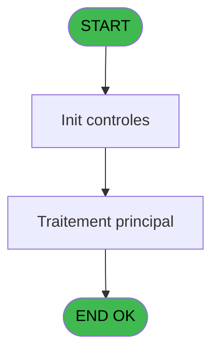
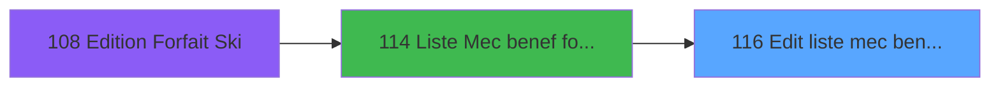

# PBP IDE 116 - Edit liste mec benef forf ski

> **Analyse**: Phases 1-4 2026-02-03 09:30 -> 09:30 (20s) | Assemblage 09:30
> **Pipeline**: V7.2 Enrichi
> **Structure**: 4 onglets (Resume | Ecrans | Donnees | Connexions)

<!-- TAB:Resume -->

## 1. FICHE D'IDENTITE

| Attribut | Valeur |
|----------|--------|
| Projet | PBP |
| IDE Position | 116 |
| Nom Programme | Edit liste mec benef forf ski |
| Fichier source | `Prg_116.xml` |
| Domaine metier | General |
| Taches | 4 (1 ecrans visibles) |
| Tables modifiees | 0 |
| Programmes appeles | 1 |

## 2. DESCRIPTION FONCTIONNELLE

**Edit liste mec benef forf ski** assure la gestion complete de ce processus, accessible depuis [Liste Mec benef forfait ski (IDE 114)](PBP-IDE-114.md).

Le flux de traitement s'organise en **2 blocs fonctionnels** :

- **Traitement** (3 taches) : traitements metier divers
- **Calcul** (1 tache) : calculs de montants, stocks ou compteurs

**Logique metier** : 3 regles identifiees couvrant conditions metier.

Detail : phases du traitement

#### Phase 1 : Traitement (3 taches)

- **116** - Veuillez patienter... **[[ECRAN]](#ecran-t1)**
- **116.1** - statistiques
- **116.3** - Lecture du code ZIP

#### Phase 2 : Calcul (1 tache)

- **116.2** - calcul lignes

## 3. BLOCS FONCTIONNELS

### 3.1 Traitement (3 taches)

Traitements internes.

---

#### 116 - Veuillez patienter... [[ECRAN]](#ecran-t1)

**Role** : Traitement : Veuillez patienter....
**Ecran** : 426 x 58 DLU (MDI) | [Voir mockup](#ecran-t1)

---

#### 116.1 - statistiques

**Role** : Traitement : statistiques.

---

#### 116.3 - Lecture du code ZIP

**Role** : Traitement : Lecture du code ZIP.
**Variables liees** : J (W0 Code ZIP)

### 3.2 Calcul (1 tache)

Calculs metier : montants, stocks, compteurs.

---

#### 116.2 - calcul lignes

**Role** : Calcul : calcul lignes.

## 5. REGLES METIER

3 regles identifiees:

### Autres (3 regles)

#### [RM-001] Si [BL] alors 'Z' sinon '')

| Element | Detail |
|---------|--------|
| **Condition** | `[BL]` |
| **Si vrai** | 'Z' |
| **Si faux** | '') |
| **Expression source** | Expression 25 : `IF ([BL],'Z','')` |
| **Exemple** | Si [BL] → 'Z'. Sinon → '') |

#### [RM-002] Si >Type commentaire [B]='N' alors IF([Z] sinon [AE],[Y]),IF([U],[Y],[AE]))

| Element | Detail |
|---------|--------|
| **Condition** | `>Type commentaire [B]='N'` |
| **Si vrai** | IF([Z] |
| **Si faux** | [AE],[Y]),IF([U],[Y],[AE])) |
| **Variables** | B (>Type commentaire) |
| **Expression source** | Expression 37 : `IF(>Type commentaire [B]='N',IF([Z],[AE],[Y]),IF([U],[Y],[AE` |
| **Exemple** | Si >Type commentaire [B]='N' → IF([Z]. Sinon → [AE],[Y]),IF([U],[Y],[AE])) |

#### [RM-003] Traitement si Trim([AH]) est renseigne

| Element | Detail |
|---------|--------|
| **Condition** | `Trim([AH])<>''` |
| **Si vrai** | [AJ] |
| **Si faux** | '') |
| **Expression source** | Expression 38 : `IF(Trim([AH])<>'',[AJ],'')` |
| **Exemple** | Si Trim([AH])<>'' → [AJ]. Sinon → '') |

## 6. CONTEXTE

- **Appele par**: [Liste Mec benef forfait ski (IDE 114)](PBP-IDE-114.md)
- **Appelle**: 1 programmes | **Tables**: 10 (W:0 R:3 L:7) | **Taches**: 4 | **Expressions**: 39

<!-- TAB:Ecrans -->

## 8. ECRANS

### 8.1 Forms visibles (1 / 4)

| # | Position | Tache | Nom | Type | Largeur | Hauteur | Bloc |
|---|----------|-------|-----|------|---------|---------|------|
| 1 | 116 | 116 | Veuillez patienter... | MDI | 426 | 58 | Traitement |

### 8.2 Mockups Ecrans

---

#### 116 - Veuillez patienter...
**Tache** : [116](#t1) | **Type** : MDI | **Dimensions** : 426 x 58 DLU
**Bloc** : Traitement | **Titre IDE** : Veuillez patienter...

<!-- FORM-DATA:
{
    "width":  426,
    "vFactor":  8,
    "type":  "MDI",
    "hFactor":  8,
    "controls":  [
                     {
                         "x":  0,
                         "type":  "label",
                         "var":  "",
                         "y":  0,
                         "w":  423,
                         "fmt":  "",
                         "name":  "",
                         "h":  29,
                         "color":  "",
                         "text":  "",
                         "parent":  null
                     },
                     {
                         "x":  120,
                         "type":  "label",
                         "var":  "",
                         "y":  10,
                         "w":  221,
                         "fmt":  "",
                         "name":  "",
                         "h":  8,
                         "color":  "7",
                         "text":  "Impression en cours ...",
                         "parent":  null
                     },
                     {
                         "x":  0,
                         "type":  "label",
                         "var":  "",
                         "y":  29,
                         "w":  423,
                         "fmt":  "",
                         "name":  "",
                         "h":  27,
                         "color":  "",
                         "text":  "",
                         "parent":  null
                     },
                     {
                         "x":  72,
                         "type":  "label",
                         "var":  "",
                         "y":  38,
                         "w":  280,
                         "fmt":  "",
                         "name":  "",
                         "h":  8,
                         "color":  "",
                         "text":  "Liste mecanographique",
                         "parent":  null
                     },
                     {
                         "x":  4,
                         "type":  "image",
                         "var":  "",
                         "y":  2,
                         "w":  72,
                         "fmt":  "",
                         "name":  "",
                         "h":  25,
                         "color":  "",
                         "text":  "",
                         "parent":  null
                     }
                 ],
    "taskId":  "116",
    "height":  58
}
-->

## 9. NAVIGATION

Ecran unique: **Veuillez patienter...**

### 9.3 Structure hierarchique (4 taches)

| Position | Tache | Type | Dimensions | Bloc |
|----------|-------|------|------------|------|
| **116.1** | [**Veuillez patienter...** (116)](#t1) [mockup](#ecran-t1) | MDI | 426x58 | Traitement |
| 116.1.1 | [statistiques (116.1)](#t2) | MDI | - | |
| 116.1.2 | [Lecture du code ZIP (116.3)](#t4) | MDI | - | |
| **116.2** | [**calcul lignes** (116.2)](#t3) | MDI | - | Calcul |

### 9.4 Algorigramme

> **Legende**: Vert = START/END OK | Rouge = END KO | Bleu = Decisions
> *Algorigramme auto-genere. Utiliser `/algorigramme` pour une synthese metier detaillee.*

<!-- TAB:Donnees -->

## 10. TABLES

### Tables utilisees (10)

| ID | Nom | Description | Type | R | W | L | Usages |
|----|-----|-------------|------|---|---|---|--------|
| 31 | gm-complet_______gmc |  | DB |   |   | L | 1 |
| 33 | prestations______pre | Prestations/services vendus | DB | R |   |   | 1 |
| 37 | commentaire_gm_________acc |  | DB |   |   | L | 1 |
| 109 | table_utilisateurs |  | DB |   |   | L | 1 |
| 171 | commentaire______com |  | DB |   |   | L | 1 |
| 479 | gestion_devise_session | Sessions de caisse | TMP | R |   |   | 1 |
| 612 | tempo_present_excel | Table temporaire ecran | TMP |   |   | L | 1 |
| 628 | fichier_fictif_blocage_import |  | DB | R |   |   | 2 |
| 639 | tempo_code_autocom | Table temporaire ecran | DB |   |   | L | 1 |
| 798 | type_article | Articles et stock | DB |   |   | L | 1 |

### Colonnes par table (6 / 3 tables avec colonnes identifiees)

Table 33 - prestations______pre (R) - 1 usages

| Lettre | Variable | Acces | Type |
|--------|----------|-------|------|
| A | >Date debut sejour | R | Date |
| B | >Type commentaire | R | Alpha |
| C | w0_RuptureGroup | R | Logical |
| D | V.Retour com PMS ? | R | Logical |
| E | V.Retour com NA ? | R | Logical |
| F | w0_RetourLangue | R | Logical |
| G | w0_AgeBebe | R | Numeric |
| H | w0_AgeEnfant | R | Numeric |
| I | W0 pied page | R | Numeric |
| J | W0 Code ZIP | R | Alpha |
| K | Existe ZIP | R | Logical |

Table 479 - gestion_devise_session (R) - 1 usages

*Table utilisee uniquement en Link ou aucune colonne Real identifiee dans le DataView.*

Table 628 - fichier_fictif_blocage_import (R) - 2 usages

| Lettre | Variable | Acces | Type |
|--------|----------|-------|------|
| A | W1 adultes hommes | R | Numeric |
| B | W1 adultes femmes | R | Numeric |
| C | W1 enfants hommes | R | Numeric |
| D | W1 enfants femmes | R | Numeric |
| E | W1 bebes hommes | R | Numeric |
| F | W1 bebes femmes | R | Numeric |
| G | W1 Total general | R | Numeric |
| H | W1 Millesias | R | Numeric |
| I | W1 Singles | R | Numeric |

## 11. VARIABLES

### 11.1 Variables de session (2)

Variables persistantes pendant toute la session.

| Lettre | Nom | Type | Usage dans |
|--------|-----|------|-----------|
| D | V.Retour com PMS ? | Logical | 1x session |
| E | V.Retour com NA ? | Logical | 1x session |

### 11.2 Variables de travail (2)

Variables internes au programme.

| Lettre | Nom | Type | Usage dans |
|--------|-----|------|-----------|
| I | W0 pied page | Numeric | 2x calcul interne |
| J | W0 Code ZIP | Alpha | [116.3](#t4) |

### 11.3 Autres (7)

Variables diverses.

| Lettre | Nom | Type | Usage dans |
|--------|-----|------|-----------|
| A | >Date debut sejour | Date | 1x refs |
| B | >Type commentaire | Alpha | 1x refs |
| C | w0_RuptureGroup | Logical | - |
| F | w0_RetourLangue | Logical | 1x refs |
| G | w0_AgeBebe | Numeric | 4x refs |
| H | w0_AgeEnfant | Numeric | 1x refs |
| K | Existe ZIP | Logical | - |

## 12. EXPRESSIONS

**39 / 39 expressions decodees (100%)**

### 12.1 Repartition par type

| Type | Expressions | Regles |
|------|-------------|--------|
| CONDITION | 8 | 3 |
| CONCATENATION | 3 | 0 |
| CONSTANTE | 5 | 0 |
| OTHER | 20 | 0 |
| REFERENCE_VG | 1 | 0 |
| STRING | 2 | 0 |

### 12.2 Expressions cles par type

#### CONDITION (8 expressions)

| Type | IDE | Expression | Regle |
|------|-----|------------|-------|
| CONDITION | 37 | `IF(>Type commentaire [B]='N',IF([Z],[AE],[Y]),IF([U],[Y],[AE]))` | [RM-002](#rm-RM-002) |
| CONDITION | 38 | `IF(Trim([AH])<>'',[AJ],'')` | [RM-003](#rm-RM-003) |
| CONDITION | 25 | `IF ([BL],'Z','')` | [RM-001](#rm-RM-001) |
| CONDITION | 2 | `MlsTrans ('LISTE DES BENEFICIAIRES FORFAIT SKI AU '&Trim (DStr (>Date debut sejour [A],'##/##/####')))` | - |
| CONDITION | 22 | `INIGet ('[MAGIC_LOGICAL_NAMES]preview')='O'` | - |
| ... | | *+3 autres* | |

#### CONCATENATION (3 expressions)

| Type | IDE | Expression | Regle |
|------|-----|------------|-------|
| CONCATENATION | 24 | `Trim ([AH])&' '&[AI]` | - |
| CONCATENATION | 20 | `MlsTrans ('Edition du')&' '&DStr (Date (),'DD/MM/YYYY')&' '&MlsTrans ('à')&' '&TStr (Time (),'HH:MM:SS')` | - |
| CONCATENATION | 21 | `'- '&Str (Page (0,1),'3P0Z0')&' -'` | - |

#### CONSTANTE (5 expressions)

| Type | IDE | Expression | Regle |
|------|-----|------------|-------|
| CONSTANTE | 19 | `'PRN'` | - |
| CONSTANTE | 39 | `'B'` | - |
| CONSTANTE | 11 | `'VENFA'` | - |
| CONSTANTE | 9 | `3` | - |
| CONSTANTE | 10 | `'VBEBE'` | - |

#### OTHER (20 expressions)

| Type | IDE | Expression | Regle |
|------|-----|------------|-------|
| OTHER | 30 | `w0_AgeEnfant [H]` | - |
| OTHER | 31 | `W0 pied page [I]` | - |
| OTHER | 29 | `w0_AgeBebe [G]` | - |
| OTHER | 27 | `V.Retour com NA ? [E]` | - |
| OTHER | 28 | `w0_RetourLangue [F]` | - |
| ... | | *+15 autres* | |

#### REFERENCE_VG (1 expressions)

| Type | IDE | Expression | Regle |
|------|-----|------------|-------|
| REFERENCE_VG | 4 | `VG1` | - |

#### STRING (2 expressions)

| Type | IDE | Expression | Regle |
|------|-----|------------|-------|
| STRING | 23 | `Val ([AG],'3Z')` | - |
| STRING | 17 | `Trim(MID ([AO],2,2))` | - |

### 12.3 Toutes les expressions (39)

Voir les 39 expressions

#### CONDITION (8)

| IDE | Expression Decodee |
|-----|-------------------|
| 14 | `w0_AgeBebe [G]<>'---'` |
| 15 | `w0_AgeBebe [G]<>'---' AND ([U] OR [Z])` |
| 16 | `w0_AgeBebe [G]='---'` |
| 25 | `IF ([BL],'Z','')` |
| 37 | `IF(>Type commentaire [B]='N',IF([Z],[AE],[Y]),IF([U],[Y],[AE]))` |
| 38 | `IF(Trim([AH])<>'',[AJ],'')` |
| 2 | `MlsTrans ('LISTE DES BENEFICIAIRES FORFAIT SKI AU '&Trim (DStr (>Date debut sejour [A],'##/##/####')))` |
| 22 | `INIGet ('[MAGIC_LOGICAL_NAMES]preview')='O'` |

#### CONCATENATION (3)

| IDE | Expression Decodee |
|-----|-------------------|
| 21 | `'- '&Str (Page (0,1),'3P0Z0')&' -'` |
| 20 | `MlsTrans ('Edition du')&' '&DStr (Date (),'DD/MM/YYYY')&' '&MlsTrans ('à')&' '&TStr (Time (),'HH:MM:SS')` |
| 24 | `Trim ([AH])&' '&[AI]` |

#### CONSTANTE (5)

| IDE | Expression Decodee |
|-----|-------------------|
| 9 | `3` |
| 10 | `'VBEBE'` |
| 11 | `'VENFA'` |
| 19 | `'PRN'` |
| 39 | `'B'` |

#### OTHER (20)

| IDE | Expression Decodee |
|-----|-------------------|
| 1 | `'Village '&GetParam ('VILLAGE')` |
| 3 | `GetParam ('SOCIETE')` |
| 5 | `W0 pied page [I]` |
| 6 | `W0 Code ZIP [J]` |
| 7 | `[N]` |
| 8 | `[O]` |
| 12 | `SetCrsr (1)` |
| 13 | `SetCrsr (2)` |
| 18 | `Left ([AO],1)` |
| 26 | `V.Retour com PMS ? [D]` |
| 27 | `V.Retour com NA ? [E]` |
| 28 | `w0_RetourLangue [F]` |
| 29 | `w0_AgeBebe [G]` |
| 30 | `w0_AgeEnfant [H]` |
| 31 | `W0 pied page [I]` |
| 32 | `W0 Code ZIP [J]` |
| 33 | `[BC]` |
| 34 | `[BJ]` |
| 35 | `[BK]` |
| 36 | `[BB]` |

#### REFERENCE_VG (1)

| IDE | Expression Decodee |
|-----|-------------------|
| 4 | `VG1` |

#### STRING (2)

| IDE | Expression Decodee |
|-----|-------------------|
| 17 | `Trim(MID ([AO],2,2))` |
| 23 | `Val ([AG],'3Z')` |

<!-- TAB:Connexions -->

## 13. GRAPHE D'APPELS

### 13.1 Chaine depuis Main (Callers)

Main -> ... -> [Liste Mec benef forfait ski (IDE 114)](PBP-IDE-114.md) -> **Edit liste mec benef forf ski (IDE 116)**

### 13.2 Callers

| IDE | Nom Programme | Nb Appels |
|-----|---------------|-----------|
| [114](PBP-IDE-114.md) | Liste Mec benef forfait ski | 1 |

### 13.3 Callees (programmes appeles)

### 13.4 Detail Callees avec contexte

| IDE | Nom Programme | Appels | Contexte |
|-----|---------------|--------|----------|
| [307](PBP-IDE-307.md) | Recherche age Bebe_Enfant | 2 | Sous-programme |

## 14. RECOMMANDATIONS MIGRATION

### 14.1 Profil du programme

| Metrique | Valeur | Impact migration |
|----------|--------|-----------------|
| Lignes de logique | 158 | Programme compact |
| Expressions | 39 | Peu de logique |
| Tables WRITE | 0 | Impact faible |
| Sous-programmes | 1 | Peu de dependances |
| Ecrans visibles | 1 | Ecran unique ou traitement batch |
| Code desactive | 0% (0 / 158) | Code sain |
| Regles metier | 3 | Quelques regles a preserver |

### 14.2 Plan de migration par bloc

#### Traitement (3 taches: 1 ecran, 2 traitements)

- **Strategie** : Orchestrateur avec 1 ecrans (Razor/React) et 2 traitements backend (services).
- Les ecrans deviennent des composants UI, les traitements invisibles deviennent des services injectables.
- 1 sous-programme(s) a migrer ou a reutiliser depuis les services existants.
- Decomposer les taches en services unitaires testables.

#### Calcul (1 tache: 0 ecran, 1 traitement)

- **Strategie** : Services de calcul purs (Domain Services).
- Migrer la logique de calcul (stock, compteurs, montants)

### 14.3 Dependances critiques

| Dependance | Type | Appels | Impact |
|------------|------|--------|--------|
| [Recherche age Bebe_Enfant (IDE 307)](PBP-IDE-307.md) | Sous-programme | 2x | Haute - Sous-programme |

---
*Spec DETAILED generee par Pipeline V7.2 - 2026-02-03 09:30*
