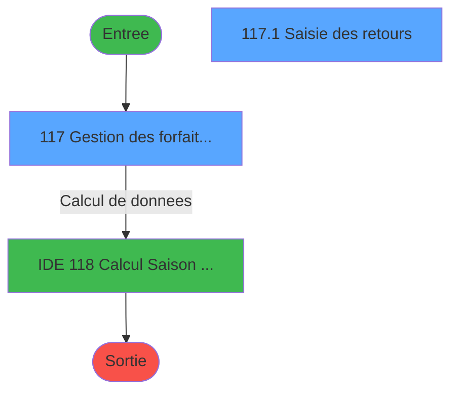
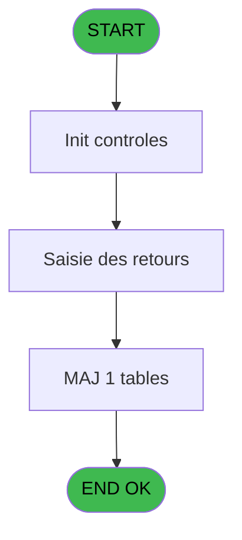
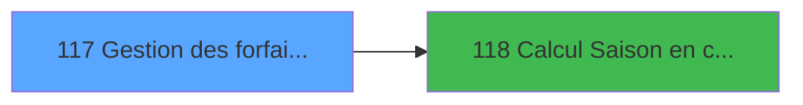

# PBP IDE 117 - Gestion des forfaits retournés

> **Analyse**: Phases 1-4 2026-02-03 09:30 -> 09:30 (20s) | Assemblage 09:30
> **Pipeline**: V7.2 Enrichi
> **Structure**: 4 onglets (Resume | Ecrans | Donnees | Connexions)

<!-- TAB:Resume -->

## 1. FICHE D'IDENTITE

| Attribut | Valeur |
|----------|--------|
| Projet | PBP |
| IDE Position | 117 |
| Nom Programme | Gestion des forfaits retournés |
| Fichier source | `Prg_117.xml` |
| Domaine metier | General |
| Taches | 6 (2 ecrans visibles) |
| Tables modifiees | 1 |
| Programmes appeles | 1 |
| :warning: Statut | **ORPHELIN_POTENTIEL** |

## 2. DESCRIPTION FONCTIONNELLE

**Gestion des forfaits retournés** assure la gestion complete de ce processus.

Le flux de traitement s'organise en **5 blocs fonctionnels** :

- **Traitement** (2 taches) : traitements metier divers
- **Consultation** (1 tache) : ecrans de recherche, selection et consultation
- **Creation** (1 tache) : insertion d'enregistrements en base (mouvements, prestations)
- **Saisie** (1 tache) : ecrans de saisie utilisateur (formulaires, champs, donnees)
- **Validation** (1 tache) : controles et verifications de coherence

**Donnees modifiees** : 1 tables en ecriture (reedition_ticket).

Detail : phases du traitement

#### Phase 1 : Traitement (2 taches)

- **117** - Gestion des forfaits retournés **[[ECRAN]](#ecran-t1)**
- **117.3** - (sans nom)

#### Phase 2 : Saisie (1 tache)

- **117.1** - Saisie des retours **[[ECRAN]](#ecran-t2)**

#### Phase 3 : Validation (1 tache)

- **117.2** - Verif Existence Enreg

#### Phase 4 : Consultation (1 tache)

- **117.2.1** - Recherche Existence **[[ECRAN]](#ecran-t4)**

#### Phase 5 : Creation (1 tache)

- **117.2.2** - Creation

#### Tables impactees

| Table | Operations | Role metier |
|-------|-----------|-------------|
| reedition_ticket | R/**W** (4 usages) |  |

## 3. BLOCS FONCTIONNELS

### 3.1 Traitement (2 taches)

Traitements internes.

---

#### 117 - Gestion des forfaits retournés [[ECRAN]](#ecran-t1)

**Role** : Gestion du moyen de paiement : Gestion des forfaits retournés.
**Ecran** : 1106 x 270 DLU (MDI) | [Voir mockup](#ecran-t1)

---

#### 117.3 - (sans nom)

**Role** : Traitement interne.

### 3.2 Saisie (1 tache)

L'operateur saisit les donnees de la transaction via 1 ecran (Saisie des retours).

---

#### 117.1 - Saisie des retours [[ECRAN]](#ecran-t2)

**Role** : Saisie des donnees : Saisie des retours.
**Ecran** : 1102 x 162 DLU (Modal) | [Voir mockup](#ecran-t2)

### 3.3 Validation (1 tache)

Controles de coherence : 1 tache verifie les donnees et conditions.

---

#### 117.2 - Verif Existence Enreg

**Role** : Verification : Verif Existence Enreg.

### 3.4 Consultation (1 tache)

Ecrans de recherche et consultation.

---

#### 117.2.1 - Recherche Existence [[ECRAN]](#ecran-t4)

**Role** : Traitement : Recherche Existence.
**Ecran** : 260 x 58 DLU | [Voir mockup](#ecran-t4)

### 3.5 Creation (1 tache)

Insertion de nouveaux enregistrements en base.

---

#### 117.2.2 - Creation

**Role** : Creation d'enregistrement : Creation.

## 5. REGLES METIER

*(Aucune regle metier identifiee)*

## 6. CONTEXTE

- **Appele par**: (aucun)
- **Appelle**: 1 programmes | **Tables**: 1 (W:1 R:1 L:0) | **Taches**: 6 | **Expressions**: 3

<!-- TAB:Ecrans -->

## 8. ECRANS

### 8.1 Forms visibles (2 / 6)

| # | Position | Tache | Nom | Type | Largeur | Hauteur | Bloc |
|---|----------|-------|-----|------|---------|---------|------|
| 1 | 117 | 117 | Gestion des forfaits retournés | MDI | 1106 | 270 | Traitement |
| 2 | 117.1 | 117.1 | Saisie des retours | Modal | 1102 | 162 | Saisie |

### 8.2 Mockups Ecrans

---

#### 117 - Gestion des forfaits retournés
**Tache** : [117](#t1) | **Type** : MDI | **Dimensions** : 1106 x 270 DLU
**Bloc** : Traitement | **Titre IDE** : Gestion des forfaits retournés

<!-- FORM-DATA:
{
    "width":  1106,
    "vFactor":  8,
    "type":  "MDI",
    "hFactor":  8,
    "controls":  [
                     {
                         "x":  2,
                         "type":  "label",
                         "var":  "",
                         "y":  2,
                         "w":  1097,
                         "fmt":  "",
                         "name":  "",
                         "h":  36,
                         "color":  "1",
                         "text":  "",
                         "parent":  null
                     },
                     {
                         "x":  2,
                         "type":  "label",
                         "var":  "",
                         "y":  245,
                         "w":  1097,
                         "fmt":  "",
                         "name":  "",
                         "h":  24,
                         "color":  "1",
                         "text":  "",
                         "parent":  null
                     },
                     {
                         "x":  3,
                         "type":  "label",
                         "var":  "",
                         "y":  38,
                         "w":  1096,
                         "fmt":  "",
                         "name":  "",
                         "h":  28,
                         "color":  "195",
                         "text":  "",
                         "parent":  null
                     },
                     {
                         "x":  11,
                         "type":  "label",
                         "var":  "",
                         "y":  49,
                         "w":  119,
                         "fmt":  "",
                         "name":  "",
                         "h":  10,
                         "color":  "118",
                         "text":  "Semaine  du :",
                         "parent":  7
                     },
                     {
                         "x":  325,
                         "type":  "label",
                         "var":  "",
                         "y":  49,
                         "w":  32,
                         "fmt":  "",
                         "name":  "",
                         "h":  10,
                         "color":  "118",
                         "text":  "Au :",
                         "parent":  7
                     },
                     {
                         "x":  394,
                         "type":  "label",
                         "var":  "",
                         "y":  7,
                         "w":  317,
                         "fmt":  "",
                         "name":  "",
                         "h":  11,
                         "color":  "",
                         "text":  "Nombre de retour forfaits ski",
                         "parent":  null
                     },
                     {
                         "x":  403,
                         "type":  "label",
                         "var":  "",
                         "y":  22,
                         "w":  298,
                         "fmt":  "",
                         "name":  "",
                         "h":  11,
                         "color":  "",
                         "text":  "par date et durée de forfait",
                         "parent":  null
                     },
                     {
                         "x":  6,
                         "type":  "edit",
                         "var":  "",
                         "y":  5,
                         "w":  232,
                         "fmt":  "30",
                         "name":  "",
                         "h":  10,
                         "color":  "2",
                         "text":  "",
                         "parent":  1
                     },
                     {
                         "x":  880,
                         "type":  "edit",
                         "var":  "",
                         "y":  5,
                         "w":  209,
                         "fmt":  "WWW DD MMM YYYYT",
                         "name":  "",
                         "h":  10,
                         "color":  "",
                         "text":  "",
                         "parent":  1
                     },
                     {
                         "x":  932,
                         "type":  "button",
                         "var":  "",
                         "y":  46,
                         "w":  154,
                         "fmt":  "\u0026Consultation",
                         "name":  "",
                         "h":  18,
                         "color":  "",
                         "text":  "",
                         "parent":  null
                     },
                     {
                         "x":  126,
                         "type":  "edit",
                         "var":  "",
                         "y":  49,
                         "w":  126,
                         "fmt":  "",
                         "name":  "w0_Date_debut",
                         "h":  10,
                         "color":  "110",
                         "text":  "",
                         "parent":  7
                     },
                     {
                         "x":  259,
                         "type":  "button",
                         "var":  "",
                         "y":  49,
                         "w":  25,
                         "fmt":  "...",
                         "name":  "b_Date",
                         "h":  10,
                         "color":  "",
                         "text":  "",
                         "parent":  7
                     },
                     {
                         "x":  371,
                         "type":  "edit",
                         "var":  "",
                         "y":  49,
                         "w":  126,
                         "fmt":  "",
                         "name":  "w0_Date_fin",
                         "h":  10,
                         "color":  "110",
                         "text":  "",
                         "parent":  7
                     },
                     {
                         "x":  10,
                         "type":  "button",
                         "var":  "",
                         "y":  248,
                         "w":  154,
                         "fmt":  "\u0026Quitter",
                         "name":  "",
                         "h":  18,
                         "color":  "",
                         "text":  "",
                         "parent":  5
                     }
                 ],
    "taskId":  "117",
    "height":  270
}
-->

<strong>Champs : 4 champs</strong>

| Pos (x,y) | Nom | Variable | Type |
|-----------|-----|----------|------|
| 6,5 | 30 | - | edit |
| 880,5 | WWW DD MMM YYYYT | - | edit |
| 126,49 | w0_Date_debut | - | edit |
| 371,49 | w0_Date_fin | - | edit |

<strong>Boutons : 3 boutons</strong>

| Bouton | Pos (x,y) | Action |
|--------|-----------|--------|
| Consultation | 932,46 | Bouton fonctionnel |
| ... | 259,49 | Bouton fonctionnel |
| Quitter | 10,248 | Quitte le programme |

---

#### 117.1 - Saisie des retours
**Tache** : [117.1](#t2) | **Type** : Modal | **Dimensions** : 1102 x 162 DLU
**Bloc** : Saisie | **Titre IDE** : Saisie des retours

<!-- FORM-DATA:
{
    "width":  1102,
    "vFactor":  8,
    "type":  "Modal",
    "hFactor":  8,
    "controls":  [
                     {
                         "x":  2,
                         "type":  "table",
                         "var":  "",
                         "name":  "",
                         "titleH":  12,
                         "color":  "110",
                         "w":  892,
                         "y":  19,
                         "fmt":  "",
                         "parent":  null,
                         "text":  "",
                         "rowH":  18,
                         "h":  140,
                         "cols":  [
                                      {
                                          "title":  "Date",
                                          "layer":  1,
                                          "w":  107
                                      },
                                      {
                                          "title":  "0.5",
                                          "layer":  2,
                                          "w":  48
                                      },
                                      {
                                          "title":  "1",
                                          "layer":  3,
                                          "w":  48
                                      },
                                      {
                                          "title":  "2",
                                          "layer":  4,
                                          "w":  48
                                      },
                                      {
                                          "title":  "3",
                                          "layer":  5,
                                          "w":  48
                                      },
                                      {
                                          "title":  "4",
                                          "layer":  6,
                                          "w":  48
                                      },
                                      {
                                          "title":  "5",
                                          "layer":  7,
                                          "w":  48
                                      },
                                      {
                                          "title":  "6",
                                          "layer":  8,
                                          "w":  48
                                      },
                                      {
                                          "title":  "7",
                                          "layer":  9,
                                          "w":  48
                                      },
                                      {
                                          "title":  "8",
                                          "layer":  10,
                                          "w":  48
                                      },
                                      {
                                          "title":  "9",
                                          "layer":  11,
                                          "w":  48
                                      },
                                      {
                                          "title":  "10",
                                          "layer":  12,
                                          "w":  48
                                      },
                                      {
                                          "title":  "11",
                                          "layer":  13,
                                          "w":  48
                                      },
                                      {
                                          "title":  "12",
                                          "layer":  14,
                                          "w":  48
                                      },
                                      {
                                          "title":  "13",
                                          "layer":  15,
                                          "w":  48
                                      },
                                      {
                                          "title":  "14",
                                          "layer":  16,
                                          "w":  48
                                      },
                                      {
                                          "title":  "15",
                                          "layer":  17,
                                          "w":  48
                                      }
                                  ],
                         "rows":  17
                     },
                     {
                         "x":  1,
                         "type":  "label",
                         "var":  "",
                         "y":  5,
                         "w":  893,
                         "fmt":  "",
                         "name":  "",
                         "h":  15,
                         "color":  "118",
                         "text":  "Durée de forfait (exprimé en jour)",
                         "parent":  null
                     },
                     {
                         "x":  898,
                         "type":  "label",
                         "var":  "",
                         "y":  1,
                         "w":  202,
                         "fmt":  "",
                         "name":  "",
                         "h":  158,
                         "color":  "",
                         "text":  "",
                         "parent":  null
                     },
                     {
                         "x":  8,
                         "type":  "edit",
                         "var":  "",
                         "y":  37,
                         "w":  93,
                         "fmt":  "DD/MM",
                         "name":  "Date_retour",
                         "h":  10,
                         "color":  "45",
                         "text":  "",
                         "parent":  1
                     },
                     {
                         "x":  115,
                         "type":  "edit",
                         "var":  "",
                         "y":  37,
                         "w":  35,
                         "fmt":  "3Z",
                         "name":  "Nb_forfait_demi_journee",
                         "h":  10,
                         "color":  "6",
                         "text":  "",
                         "parent":  1
                     },
                     {
                         "x":  163,
                         "type":  "edit",
                         "var":  "",
                         "y":  37,
                         "w":  35,
                         "fmt":  "3Z",
                         "name":  "Nb_forfait_1_jour",
                         "h":  10,
                         "color":  "6",
                         "text":  "",
                         "parent":  1
                     },
                     {
                         "x":  211,
                         "type":  "edit",
                         "var":  "",
                         "y":  37,
                         "w":  35,
                         "fmt":  "3Z",
                         "name":  "Nb_forfait_2_jours",
                         "h":  10,
                         "color":  "6",
                         "text":  "",
                         "parent":  1
                     },
                     {
                         "x":  259,
                         "type":  "edit",
                         "var":  "",
                         "y":  37,
                         "w":  35,
                         "fmt":  "3Z",
                         "name":  "Nb_forfait_3_jours",
                         "h":  10,
                         "color":  "6",
                         "text":  "",
                         "parent":  1
                     },
                     {
                         "x":  307,
                         "type":  "edit",
                         "var":  "",
                         "y":  37,
                         "w":  35,
                         "fmt":  "3Z",
                         "name":  "Nb_forfait_4_jours",
                         "h":  10,
                         "color":  "6",
                         "text":  "",
                         "parent":  1
                     },
                     {
                         "x":  355,
                         "type":  "edit",
                         "var":  "",
                         "y":  37,
                         "w":  35,
                         "fmt":  "3Z",
                         "name":  "Nb_forfait_5_jours",
                         "h":  10,
                         "color":  "6",
                         "text":  "",
                         "parent":  1
                     },
                     {
                         "x":  403,
                         "type":  "edit",
                         "var":  "",
                         "y":  37,
                         "w":  35,
                         "fmt":  "3Z",
                         "name":  "Nb_forfait_6_jours",
                         "h":  10,
                         "color":  "6",
                         "text":  "",
                         "parent":  1
                     },
                     {
                         "x":  451,
                         "type":  "edit",
                         "var":  "",
                         "y":  37,
                         "w":  35,
                         "fmt":  "3Z",
                         "name":  "Nb_forfait_7_jours",
                         "h":  10,
                         "color":  "6",
                         "text":  "",
                         "parent":  1
                     },
                     {
                         "x":  499,
                         "type":  "edit",
                         "var":  "",
                         "y":  37,
                         "w":  35,
                         "fmt":  "3Z",
                         "name":  "Nb_forfait_8_jours",
                         "h":  10,
                         "color":  "6",
                         "text":  "",
                         "parent":  1
                     },
                     {
                         "x":  547,
                         "type":  "edit",
                         "var":  "",
                         "y":  37,
                         "w":  35,
                         "fmt":  "3Z",
                         "name":  "Nb_forfait_9_jours",
                         "h":  10,
                         "color":  "6",
                         "text":  "",
                         "parent":  1
                     },
                     {
                         "x":  595,
                         "type":  "edit",
                         "var":  "",
                         "y":  37,
                         "w":  35,
                         "fmt":  "3Z",
                         "name":  "Nb_forfait_10_jours",
                         "h":  10,
                         "color":  "6",
                         "text":  "",
                         "parent":  1
                     },
                     {
                         "x":  643,
                         "type":  "edit",
                         "var":  "",
                         "y":  37,
                         "w":  35,
                         "fmt":  "3Z",
                         "name":  "Nb_forfait_11_jours",
                         "h":  10,
                         "color":  "6",
                         "text":  "",
                         "parent":  1
                     },
                     {
                         "x":  691,
                         "type":  "edit",
                         "var":  "",
                         "y":  37,
                         "w":  35,
                         "fmt":  "3Z",
                         "name":  "Nb_forfait_12_jours",
                         "h":  10,
                         "color":  "6",
                         "text":  "",
                         "parent":  1
                     },
                     {
                         "x":  739,
                         "type":  "edit",
                         "var":  "",
                         "y":  37,
                         "w":  35,
                         "fmt":  "3Z",
                         "name":  "Nb_forfait_13_jours",
                         "h":  10,
                         "color":  "6",
                         "text":  "",
                         "parent":  1
                     },
                     {
                         "x":  787,
                         "type":  "edit",
                         "var":  "",
                         "y":  37,
                         "w":  35,
                         "fmt":  "3Z",
                         "name":  "Nb_forfait_14_jours",
                         "h":  10,
                         "color":  "6",
                         "text":  "",
                         "parent":  1
                     },
                     {
                         "x":  835,
                         "type":  "edit",
                         "var":  "",
                         "y":  37,
                         "w":  35,
                         "fmt":  "3Z",
                         "name":  "Nb_forfait_15_jours",
                         "h":  10,
                         "color":  "6",
                         "text":  "",
                         "parent":  1
                     },
                     {
                         "x":  932,
                         "type":  "button",
                         "var":  "",
                         "y":  24,
                         "w":  154,
                         "fmt":  "\u0026Modification",
                         "name":  "",
                         "h":  18,
                         "color":  "",
                         "text":  "",
                         "parent":  null
                     },
                     {
                         "x":  932,
                         "type":  "button",
                         "var":  "",
                         "y":  48,
                         "w":  154,
                         "fmt":  "\u0026Annulation",
                         "name":  "",
                         "h":  18,
                         "color":  "",
                         "text":  "",
                         "parent":  null
                     }
                 ],
    "taskId":  "117.1",
    "height":  162
}
-->

<strong>Champs : 17 champs</strong>

| Pos (x,y) | Nom | Variable | Type |
|-----------|-----|----------|------|
| 8,37 | Date_retour | - | edit |
| 115,37 | Nb_forfait_demi_journee | - | edit |
| 163,37 | Nb_forfait_1_jour | - | edit |
| 211,37 | Nb_forfait_2_jours | - | edit |
| 259,37 | Nb_forfait_3_jours | - | edit |
| 307,37 | Nb_forfait_4_jours | - | edit |
| 355,37 | Nb_forfait_5_jours | - | edit |
| 403,37 | Nb_forfait_6_jours | - | edit |
| 451,37 | Nb_forfait_7_jours | - | edit |
| 499,37 | Nb_forfait_8_jours | - | edit |
| 547,37 | Nb_forfait_9_jours | - | edit |
| 595,37 | Nb_forfait_10_jours | - | edit |
| 643,37 | Nb_forfait_11_jours | - | edit |
| 691,37 | Nb_forfait_12_jours | - | edit |
| 739,37 | Nb_forfait_13_jours | - | edit |
| 787,37 | Nb_forfait_14_jours | - | edit |
| 835,37 | Nb_forfait_15_jours | - | edit |

<strong>Boutons : 2 boutons</strong>

| Bouton | Pos (x,y) | Action |
|--------|-----------|--------|
| Modification | 932,24 | Modifie l'element |
| Annulation | 932,48 | Annule et retour au menu |

## 9. NAVIGATION

### 9.1 Enchainement des ecrans

**Detail par enchainement :**

| Depuis | Action | Vers | Retour |
|--------|--------|------|--------|
| Gestion des forfaits retournés | Calcul de donnees | [Calcul Saison en cours (IDE 118)](PBP-IDE-118.md) | Retour ecran |

### 9.3 Structure hierarchique (6 taches)

| Position | Tache | Type | Dimensions | Bloc |
|----------|-------|------|------------|------|
| **117.1** | [**Gestion des forfaits retournés** (117)](#t1) [mockup](#ecran-t1) | MDI | 1106x270 | Traitement |
| 117.1.1 | [(sans nom) (117.3)](#t6) | - | - | |
| **117.2** | [**Saisie des retours** (117.1)](#t2) [mockup](#ecran-t2) | Modal | 1102x162 | Saisie |
| **117.3** | [**Verif Existence Enreg** (117.2)](#t3) | - | - | Validation |
| **117.4** | [**Recherche Existence** (117.2.1)](#t4) [mockup](#ecran-t4) | - | 260x58 | Consultation |
| **117.5** | [**Creation** (117.2.2)](#t5) | - | - | Creation |

### 9.4 Algorigramme

> **Legende**: Vert = START/END OK | Rouge = END KO | Bleu = Decisions
> *Algorigramme auto-genere. Utiliser `/algorigramme` pour une synthese metier detaillee.*

<!-- TAB:Donnees -->

## 10. TABLES

### Tables utilisees (1)

| ID | Nom | Description | Type | R | W | L | Usages |
|----|-----|-------------|------|---|---|---|--------|
| 887 | reedition_ticket |  | DB | R | **W** |   | 4 |

### Colonnes par table (1 / 1 tables avec colonnes identifiees)

Table 887 - reedition_ticket (R/**W**) - 4 usages

| Lettre | Variable | Acces | Type |
|--------|----------|-------|------|
| A | P Date debut recherche | W | Date |
| B | P Date fin recherche | W | Date |

## 11. VARIABLES

### 11.1 Autres (5)

Variables diverses.

| Lettre | Nom | Type | Usage dans |
|--------|-----|------|-----------|
| A | w0_Date_debut | Date | 2x refs |
| B | w0_Date_fin | Date | 1x refs |
| C | w0_Saison_en_cours | Alpha | - |
| D | w0_Date_debut_saison | Date | 1x refs |
| E | w0_Date_fin_saison | Date | 1x refs |

## 12. EXPRESSIONS

**3 / 3 expressions decodees (100%)**

### 12.1 Repartition par type

| Type | Expressions | Regles |
|------|-------------|--------|
| CALCULATION | 1 | 0 |
| DATE | 1 | 0 |
| FORMAT | 1 | 0 |

### 12.2 Expressions cles par type

#### CALCULATION (1 expressions)

| Type | IDE | Expression | Regle |
|------|-----|------------|-------|
| CALCULATION | 3 | `w0_Date_debut [A]+7` | - |

#### DATE (1 expressions)

| Type | IDE | Expression | Regle |
|------|-----|------------|-------|
| DATE | 2 | `Date()` | - |

#### FORMAT (1 expressions)

| Type | IDE | Expression | Regle |
|------|-----|------------|-------|
| FORMAT | 1 | `MlsTrans('SAISON')&' '&IF(w0_Date_debut_saison [D]='H','HIVER',IF(w0_Date_debut_saison [D]='E','ETE',''))&' '&IF(w0_Date_debut_saison [D]='H',Str(Year([F]),'4'),Str(Year(w0_Date_fin_saison [E]),'4'))` | - |

<!-- TAB:Connexions -->

## 13. GRAPHE D'APPELS

### 13.1 Chaine depuis Main (Callers)

**Chemin**: (pas de callers directs)

### 13.2 Callers

| IDE | Nom Programme | Nb Appels |
|-----|---------------|-----------|
| - | (aucun) | - |

### 13.3 Callees (programmes appeles)

### 13.4 Detail Callees avec contexte

| IDE | Nom Programme | Appels | Contexte |
|-----|---------------|--------|----------|
| [118](PBP-IDE-118.md) | Calcul Saison en cours | 1 | Calcul de donnees |

## 14. RECOMMANDATIONS MIGRATION

### 14.1 Profil du programme

| Metrique | Valeur | Impact migration |
|----------|--------|-----------------|
| Lignes de logique | 88 | Programme compact |
| Expressions | 3 | Peu de logique |
| Tables WRITE | 1 | Impact faible |
| Sous-programmes | 1 | Peu de dependances |
| Ecrans visibles | 2 | Quelques ecrans |
| Code desactive | 1.1% (1 / 88) | Code sain |
| Regles metier | 0 | Pas de regle identifiee |

### 14.2 Plan de migration par bloc

#### Traitement (2 taches: 1 ecran, 1 traitement)

- **Strategie** : Orchestrateur avec 1 ecrans (Razor/React) et 1 traitements backend (services).
- Les ecrans deviennent des composants UI, les traitements invisibles deviennent des services injectables.
- 1 sous-programme(s) a migrer ou a reutiliser depuis les services existants.
- Decomposer les taches en services unitaires testables.

#### Saisie (1 tache: 1 ecran, 0 traitement)

- **Strategie** : Formulaire React/Blazor avec validation Zod/FluentValidation.
- Reproduire 1 ecran : Saisie des retours
- Validation temps reel cote client + serveur

#### Validation (1 tache: 0 ecran, 1 traitement)

- **Strategie** : FluentValidation avec validators specifiques.
- Chaque tache de validation -> un validator injectable

#### Consultation (1 tache: 1 ecran, 0 traitement)

- **Strategie** : Composants de recherche/selection en modales.
- 1 ecran : Recherche Existence

#### Creation (1 tache: 0 ecran, 1 traitement)

- **Strategie** : Repository pattern avec Entity Framework Core.
- Insertion via `IRepository<T>.CreateAsync()`

### 14.3 Dependances critiques

| Dependance | Type | Appels | Impact |
|------------|------|--------|--------|
| reedition_ticket | Table WRITE (Database) | 3x | Schema + repository |
| [Calcul Saison en cours (IDE 118)](PBP-IDE-118.md) | Sous-programme | 1x | Normale - Calcul de donnees |

---
*Spec DETAILED generee par Pipeline V7.2 - 2026-02-03 09:30*
