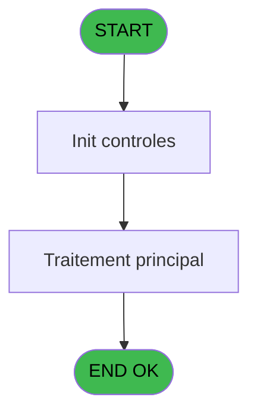
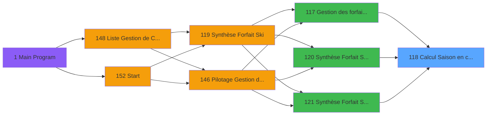

# PBP IDE 118 - Calcul Saison en cours

> **Analyse**: Phases 1-4 2026-02-03 15:19 -> 15:20 (11s) | Assemblage 15:20
> **Pipeline**: V7.2 Enrichi
> **Structure**: 4 onglets (Resume | Ecrans | Donnees | Connexions)

<!-- TAB:Resume -->

## 1. FICHE D'IDENTITE

| Attribut | Valeur |
|----------|--------|
| Projet | PBP |
| IDE Position | 118 |
| Nom Programme | Calcul Saison en cours |
| Fichier source | `Prg_118.xml` |
| Dossier IDE | Forfait |
| Taches | 1 (0 ecrans visibles) |
| Tables modifiees | 0 |
| Programmes appeles | 0 |

## 2. DESCRIPTION FONCTIONNELLE

**Calcul Saison en cours** assure la gestion complete de ce processus, accessible depuis [Gestion des forfaits retournés (IDE 117)](PBP-IDE-117.md), [Synthèse Forfait Ski Batch (IDE 120)](PBP-IDE-120.md), [Synthèse Forfait Ski Résultat (IDE 121)](PBP-IDE-121.md).

Le flux de traitement s'organise en **1 blocs fonctionnels** :

- **Calcul** (1 tache) : calculs de montants, stocks ou compteurs

**Logique metier** : 2 regles identifiees couvrant conditions metier.

## 3. BLOCS FONCTIONNELS

### 3.1 Calcul (1 tache)

Calculs metier : montants, stocks, compteurs.

---

#### 118 - Calcul Saison en cours

**Role** : Calcul : Calcul Saison en cours.
**Variables liees** : B (<P.Saison_encours), I (w0_Saison_été ?), J (w0_Saison_hiver ?)

## 5. REGLES METIER

2 regles identifiees:

### Autres (2 regles)

#### [RM-001] Si w0_Date_début_hiver [G] alors 'E' sinon IF(w0_Date_fin_hiver [H],'H',''))

| Element | Detail |
|---------|--------|
| **Condition** | `w0_Date_début_hiver [G]` |
| **Si vrai** | 'E' |
| **Si faux** | IF(w0_Date_fin_hiver [H],'H','')) |
| **Variables** | G (w0_Date_début_hiver), H (w0_Date_fin_hiver) |
| **Expression source** | Expression 9 : `IF(w0_Date_début_hiver [G],'E',IF(w0_Date_fin_hiver [H],'H',` |
| **Exemple** | Si w0_Date_début_hiver [G] → 'E'. Sinon → IF(w0_Date_fin_hiver [H],'H','')) |

#### [RM-002] Si [N]='E' alors P.Date [A] sinon IF([N]='H',<P.Date_fin_working [D],'00/00/0000'DATE))

| Element | Detail |
|---------|--------|
| **Condition** | `[N]='E'` |
| **Si vrai** | P.Date [A] |
| **Si faux** | IF([N]='H',<P.Date_fin_working [D],'00/00/0000'DATE)) |
| **Variables** | A (P.Date), D (<P.Date_fin_working) |
| **Expression source** | Expression 10 : `IF([N]='E',P.Date [A],IF([N]='H',<P.Date_fin_working [D],'00` |
| **Exemple** | Si [N]='E' → P.Date [A]. Sinon → IF([N]='H',<P.Date_fin_working [D],'00/00/0000'DATE)) |

## 6. CONTEXTE

- **Appele par**: [Gestion des forfaits retournés (IDE 117)](PBP-IDE-117.md), [Synthèse Forfait Ski Batch (IDE 120)](PBP-IDE-120.md), [Synthèse Forfait Ski Résultat (IDE 121)](PBP-IDE-121.md)
- **Appelle**: 0 programmes | **Tables**: 0 (W:0 R:0 L:0) | **Taches**: 1 | **Expressions**: 11

<!-- TAB:Ecrans -->

## 8. ECRANS

*(Programme sans ecran visible)*

## 9. NAVIGATION

### 9.3 Structure hierarchique (1 tache)

| Position | Tache | Type | Dimensions | Bloc |
|----------|-------|------|------------|------|
| **118.1** | [**Calcul Saison en cours** (118)](#t1) | - | - | Calcul |

### 9.4 Algorigramme

> **Legende**: Vert = START/END OK | Rouge = END KO | Bleu = Decisions
> *Algorigramme auto-genere. Utiliser `/algorigramme` pour une synthese metier detaillee.*

<!-- TAB:Donnees -->

## 10. TABLES

### Tables utilisees (0)

| ID | Nom | Description | Type | R | W | L | Usages |
|----|-----|-------------|------|---|---|---|--------|

### Colonnes par table (0 / 0 tables avec colonnes identifiees)

## 11. VARIABLES

### 11.1 Parametres entrants (1)

Variables recues du programme appelant ([Gestion des forfaits retournés (IDE 117)](PBP-IDE-117.md)).

| Lettre | Nom | Type | Usage dans |
|--------|-----|------|-----------|
| A | P.Date | Date | 3x parametre entrant |

### 11.2 Autres (9)

Variables diverses.

| Lettre | Nom | Type | Usage dans |
|--------|-----|------|-----------|
| B | <P.Saison_encours | Alpha | 2x refs |
| C | <P.Date_deb_working | Date | - |
| D | <P.Date_fin_working | Date | 2x refs |
| E | w0_Date_début_été | Date | 2x refs |
| F | w0_Date_fin_été | Date | - |
| G | w0_Date_début_hiver | Date | 1x refs |
| H | w0_Date_fin_hiver | Date | 1x refs |
| I | w0_Saison_été ? | Logical | - |
| J | w0_Saison_hiver ? | Logical | - |

## 12. EXPRESSIONS

**11 / 11 expressions decodees (100%)**

### 12.1 Repartition par type

| Type | Expressions | Regles |
|------|-------------|--------|
| CONDITION | 6 | 2 |
| FORMAT | 4 | 0 |
| DATE | 1 | 0 |

### 12.2 Expressions cles par type

#### CONDITION (6 expressions)

| Type | IDE | Expression | Regle |
|------|-----|------------|-------|
| CONDITION | 9 | `IF(w0_Date_début_hiver [G],'E',IF(w0_Date_fin_hiver [H],'H',''))` | [RM-001](#rm-RM-001) |
| CONDITION | 10 | `IF([N]='E',P.Date [A],IF([N]='H',<P.Date_fin_working [D],'00/00/0000'DATE))` | [RM-002](#rm-RM-002) |
| CONDITION | 5 | `[K]>=P.Date [A] AND [K] <=<P.Saison_encours [B]` | - |
| CONDITION | 6 | `[K] >=<P.Date_fin_working [D] AND [K]<=w0_Date_début_été [E]` | - |
| CONDITION | 8 | `[K]='00/00/0000'DATE` | - |
| ... | | *+1 autres* | |

#### FORMAT (4 expressions)

| Type | IDE | Expression | Regle |
|------|-----|------------|-------|
| FORMAT | 3 | `DVal('01/11/'&Str(IF(Range(Month([K]),5,12),Year([K]),Year([K])-1),'4'),'DD/MM/YYYY')` | - |
| FORMAT | 4 | `DVal('30/04/'&Str(IF(Range(Month([K]),5,12),Year([K])+1,Year([K])),'4'),'DD/MM/YYYY')` | - |
| FORMAT | 1 | `DVal('01/05/'&Str(Year([K]),'4'),'DD/MM/YYYY')` | - |
| FORMAT | 2 | `DVal('31/10/'&Str(Year([K]),'4'),'DD/MM/YYYY')` | - |

#### DATE (1 expressions)

| Type | IDE | Expression | Regle |
|------|-----|------------|-------|
| DATE | 7 | `Date()` | - |

<!-- TAB:Connexions -->

## 13. GRAPHE D'APPELS

### 13.1 Chaine depuis Main (Callers)

Main -> ... -> [Gestion des forfaits retournés (IDE 117)](PBP-IDE-117.md) -> **Calcul Saison en cours (IDE 118)**

Main -> ... -> [Synthèse Forfait Ski Batch (IDE 120)](PBP-IDE-120.md) -> **Calcul Saison en cours (IDE 118)**

Main -> ... -> [Synthèse Forfait Ski Résultat (IDE 121)](PBP-IDE-121.md) -> **Calcul Saison en cours (IDE 118)**

### 13.2 Callers

| IDE | Nom Programme | Nb Appels |
|-----|---------------|-----------|
| [117](PBP-IDE-117.md) | Gestion des forfaits retournés | 1 |
| [120](PBP-IDE-120.md) | Synthèse Forfait Ski Batch | 1 |
| [121](PBP-IDE-121.md) | Synthèse Forfait Ski Résultat | 1 |

### 13.3 Callees (programmes appeles)

### 13.4 Detail Callees avec contexte

| IDE | Nom Programme | Appels | Contexte |
|-----|---------------|--------|----------|
| - | (aucun) | - | - |

## 14. RECOMMANDATIONS MIGRATION

### 14.1 Profil du programme

| Metrique | Valeur | Impact migration |
|----------|--------|-----------------|
| Lignes de logique | 31 | Programme compact |
| Expressions | 11 | Peu de logique |
| Tables WRITE | 0 | Impact faible |
| Sous-programmes | 0 | Peu de dependances |
| Ecrans visibles | 0 | Ecran unique ou traitement batch |
| Code desactive | 0% (0 / 31) | Code sain |
| Regles metier | 2 | Quelques regles a preserver |

### 14.2 Plan de migration par bloc

#### Calcul (1 tache: 0 ecran, 1 traitement)

- **Strategie** : Services de calcul purs (Domain Services).
- Migrer la logique de calcul (stock, compteurs, montants)

### 14.3 Dependances critiques

| Dependance | Type | Appels | Impact |
|------------|------|--------|--------|

---
*Spec DETAILED generee par Pipeline V7.2 - 2026-02-03 15:20*
