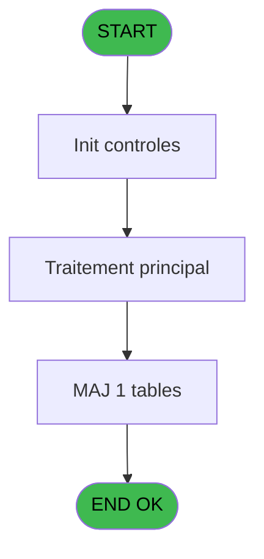
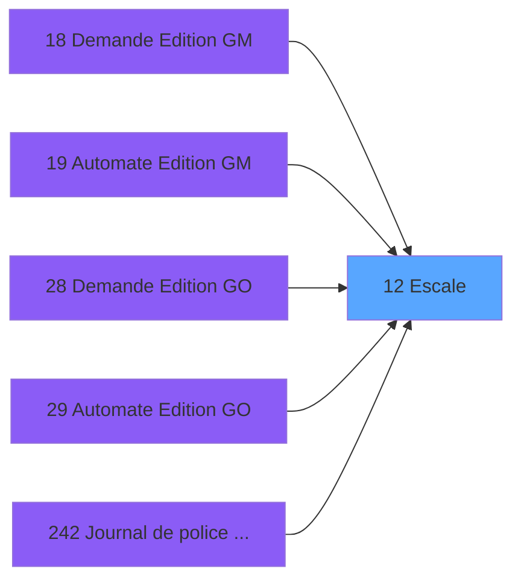

# PBP IDE 12 - Escale

> **Analyse**: Phases 1-4 2026-02-03 01:00 -> 01:00 (39s) | Assemblage 01:00
> **Pipeline**: V7.2 Enrichi
> **Structure**: 4 onglets (Resume | Ecrans | Donnees | Connexions)

<!-- TAB:Resume -->

## 1. FICHE D'IDENTITE

| Attribut | Valeur |
|----------|--------|
| Projet | PBP |
| IDE Position | 12 |
| Nom Programme | Escale |
| Fichier source | `Prg_12.xml` |
| Domaine metier | General |
| Taches | 2 (1 ecrans visibles) |
| Tables modifiees | 1 |
| Programmes appeles | 0 |

## 2. DESCRIPTION FONCTIONNELLE

**Escale** assure la gestion complete de ce processus, accessible depuis [Demande Edition GM (IDE 18)](PBP-IDE-18.md), [   Automate Edition GM (IDE 19)](PBP-IDE-19.md), [Demande Edition GO (IDE 28)](PBP-IDE-28.md), [   Automate Edition GO (IDE 29)](PBP-IDE-29.md), [Journal de police / Stat EOT (IDE 242)](PBP-IDE-242.md), [Livre de porte (IDE 337)](PBP-IDE-337.md), [Journal de police / Stat EOT (IDE 340)](PBP-IDE-340.md), [Facturation (IDE 345)](PBP-IDE-345.md), [Livre de porte SAV (IDE 417)](PBP-IDE-417.md).

Le flux de traitement s'organise en **2 blocs fonctionnels** :

- **Consultation** (1 tache) : ecrans de recherche, selection et consultation
- **Traitement** (1 tache) : traitements metier divers

**Donnees modifiees** : 1 tables en ecriture (escale).

**Logique metier** : 1 regles identifiees couvrant conditions metier.

Detail : phases du traitement

#### Phase 1 : Traitement (1 tache)

- **12** - Passeport GO **[[ECRAN]](#ecran-t1)**

#### Phase 2 : Consultation (1 tache)

- **12.1** - Recherche du commandant

#### Tables impactees

| Table | Operations | Role metier |
|-------|-----------|-------------|
| escale | **W** (1 usages) |  |

## 3. BLOCS FONCTIONNELS

### 3.1 Traitement (1 tache)

Traitements internes.

---

#### 12 - Passeport GO [[ECRAN]](#ecran-t1)

**Role** : Traitement : Passeport GO.
**Ecran** : 824 x 199 DLU (MDI) | [Voir mockup](#ecran-t1)

### 3.2 Consultation (1 tache)

Ecrans de recherche et consultation.

---

#### 12.1 - Recherche du commandant

**Role** : Traitement : Recherche du commandant.
**Variables liees** : B (v. commandant)

## 5. REGLES METIER

1 regles identifiees:

### Autres (1 regles)

#### [RM-001] Si > date [A]='00/00/0000'DATE alors Date () sinon > date [A])

| Element | Detail |
|---------|--------|
| **Condition** | `> date [A]='00/00/0000'DATE` |
| **Si vrai** | Date () |
| **Si faux** | > date [A]) |
| **Variables** | A (> date) |
| **Expression source** | Expression 6 : `IF (> date [A]='00/00/0000'DATE,Date (),> date [A])` |
| **Exemple** | Si > date [A]='00/00/0000'DATE → Date (). Sinon → > date [A]) |

## 6. CONTEXTE

- **Appele par**: [Demande Edition GM (IDE 18)](PBP-IDE-18.md), [   Automate Edition GM (IDE 19)](PBP-IDE-19.md), [Demande Edition GO (IDE 28)](PBP-IDE-28.md), [   Automate Edition GO (IDE 29)](PBP-IDE-29.md), [Journal de police / Stat EOT (IDE 242)](PBP-IDE-242.md), [Livre de porte (IDE 337)](PBP-IDE-337.md), [Journal de police / Stat EOT (IDE 340)](PBP-IDE-340.md), [Facturation (IDE 345)](PBP-IDE-345.md), [Livre de porte SAV (IDE 417)](PBP-IDE-417.md)
- **Appelle**: 0 programmes | **Tables**: 3 (W:1 R:1 L:1) | **Taches**: 2 | **Expressions**: 6

<!-- TAB:Ecrans -->

## 8. ECRANS

### 8.1 Forms visibles (1 / 2)

| # | Position | Tache | Nom | Type | Largeur | Hauteur | Bloc |
|---|----------|-------|-----|------|---------|---------|------|
| 1 | 12 | 12 | Passeport GO | MDI | 824 | 199 | Traitement |

### 8.2 Mockups Ecrans

---

#### 12 - Passeport GO
**Tache** : [12](#t1) | **Type** : MDI | **Dimensions** : 824 x 199 DLU
**Bloc** : Traitement | **Titre IDE** : Passeport GO

<!-- FORM-DATA:
{
    "width":  824,
    "vFactor":  8,
    "type":  "MDI",
    "hFactor":  8,
    "controls":  [
                     {
                         "x":  0,
                         "type":  "label",
                         "var":  "",
                         "y":  0,
                         "w":  822,
                         "fmt":  "",
                         "name":  "",
                         "h":  20,
                         "color":  "1",
                         "text":  "",
                         "parent":  null
                     },
                     {
                         "x":  24,
                         "type":  "label",
                         "var":  "",
                         "y":  22,
                         "w":  772,
                         "fmt":  "",
                         "name":  "",
                         "h":  24,
                         "color":  "",
                         "text":  "",
                         "parent":  null
                     },
                     {
                         "x":  43,
                         "type":  "label",
                         "var":  "",
                         "y":  31,
                         "w":  128,
                         "fmt":  "",
                         "name":  "",
                         "h":  8,
                         "color":  "142",
                         "text":  "Commandant :",
                         "parent":  5
                     },
                     {
                         "x":  360,
                         "type":  "label",
                         "var":  "",
                         "y":  53,
                         "w":  439,
                         "fmt":  "",
                         "name":  "",
                         "h":  118,
                         "color":  "",
                         "text":  "",
                         "parent":  null
                     },
                     {
                         "x":  360,
                         "type":  "label",
                         "var":  "",
                         "y":  53,
                         "w":  439,
                         "fmt":  "",
                         "name":  "",
                         "h":  29,
                         "color":  "",
                         "text":  "",
                         "parent":  null
                     },
                     {
                         "x":  24,
                         "type":  "table",
                         "var":  "",
                         "name":  "",
                         "titleH":  12,
                         "color":  "110",
                         "w":  211,
                         "y":  57,
                         "fmt":  "",
                         "parent":  null,
                         "text":  "",
                         "rowH":  14,
                         "h":  110,
                         "cols":  [
                                      {
                                          "title":  "Date escale",
                                          "layer":  1,
                                          "w":  178
                                      }
                                  ],
                         "rows":  1
                     },
                     {
                         "x":  382,
                         "type":  "label",
                         "var":  "",
                         "y":  87,
                         "w":  74,
                         "fmt":  "",
                         "name":  "",
                         "h":  8,
                         "color":  "",
                         "text":  "Escale",
                         "parent":  8
                     },
                     {
                         "x":  382,
                         "type":  "label",
                         "var":  "",
                         "y":  103,
                         "w":  128,
                         "fmt":  "",
                         "name":  "",
                         "h":  8,
                         "color":  "",
                         "text":  "Heure d\u0027arrivée",
                         "parent":  8
                     },
                     {
                         "x":  382,
                         "type":  "label",
                         "var":  "",
                         "y":  119,
                         "w":  133,
                         "fmt":  "",
                         "name":  "",
                         "h":  8,
                         "color":  "",
                         "text":  "Heure de départ",
                         "parent":  8
                     },
                     {
                         "x":  382,
                         "type":  "label",
                         "var":  "",
                         "y":  134,
                         "w":  112,
                         "fmt":  "",
                         "name":  "",
                         "h":  8,
                         "color":  "",
                         "text":  "Num. Croisière",
                         "parent":  8
                     },
                     {
                         "x":  382,
                         "type":  "label",
                         "var":  "",
                         "y":  149,
                         "w":  67,
                         "fmt":  "",
                         "name":  "",
                         "h":  8,
                         "color":  "",
                         "text":  "Notes",
                         "parent":  8
                     },
                     {
                         "x":  0,
                         "type":  "label",
                         "var":  "",
                         "y":  175,
                         "w":  822,
                         "fmt":  "",
                         "name":  "",
                         "h":  24,
                         "color":  "1",
                         "text":  "",
                         "parent":  null
                     },
                     {
                         "x":  189,
                         "type":  "edit",
                         "var":  "",
                         "y":  31,
                         "w":  568,
                         "fmt":  "",
                         "name":  "",
                         "h":  8,
                         "color":  "142",
                         "text":  "",
                         "parent":  5
                     },
                     {
                         "x":  51,
                         "type":  "edit",
                         "var":  "",
                         "y":  72,
                         "w":  126,
                         "fmt":  "",
                         "name":  "",
                         "h":  10,
                         "color":  "110",
                         "text":  "",
                         "parent":  10
                     },
                     {
                         "x":  522,
                         "type":  "edit",
                         "var":  "",
                         "y":  88,
                         "w":  238,
                         "fmt":  "",
                         "name":  "",
                         "h":  10,
                         "color":  "6",
                         "text":  "",
                         "parent":  8
                     },
                     {
                         "x":  522,
                         "type":  "edit",
                         "var":  "",
                         "y":  103,
                         "w":  104,
                         "fmt":  "",
                         "name":  "",
                         "h":  10,
                         "color":  "6",
                         "text":  "",
                         "parent":  8
                     },
                     {
                         "x":  522,
                         "type":  "edit",
                         "var":  "",
                         "y":  119,
                         "w":  104,
                         "fmt":  "",
                         "name":  "",
                         "h":  10,
                         "color":  "6",
                         "text":  "",
                         "parent":  8
                     },
                     {
                         "x":  522,
                         "type":  "edit",
                         "var":  "",
                         "y":  134,
                         "w":  126,
                         "fmt":  "",
                         "name":  "",
                         "h":  10,
                         "color":  "6",
                         "text":  "",
                         "parent":  8
                     },
                     {
                         "x":  522,
                         "type":  "edit",
                         "var":  "",
                         "y":  149,
                         "w":  238,
                         "fmt":  "",
                         "name":  "",
                         "h":  10,
                         "color":  "6",
                         "text":  "",
                         "parent":  8
                     },
                     {
                         "x":  609,
                         "type":  "edit",
                         "var":  "",
                         "y":  6,
                         "w":  203,
                         "fmt":  "WWW DD MMM YYYYT",
                         "name":  "",
                         "h":  8,
                         "color":  "",
                         "text":  "",
                         "parent":  1
                     },
                     {
                         "x":  6,
                         "type":  "edit",
                         "var":  "",
                         "y":  11,
                         "w":  325,
                         "fmt":  "30",
                         "name":  "",
                         "h":  8,
                         "color":  "",
                         "text":  "",
                         "parent":  1
                     },
                     {
                         "x":  382,
                         "type":  "edit",
                         "var":  "",
                         "y":  65,
                         "w":  383,
                         "fmt":  "30",
                         "name":  "",
                         "h":  10,
                         "color":  "142",
                         "text":  "",
                         "parent":  9
                     },
                     {
                         "x":  8,
                         "type":  "button",
                         "var":  "",
                         "y":  178,
                         "w":  154,
                         "fmt":  "\u0026Quitter",
                         "name":  "",
                         "h":  18,
                         "color":  "",
                         "text":  "",
                         "parent":  null
                     },
                     {
                         "x":  173,
                         "type":  "button",
                         "var":  "",
                         "y":  178,
                         "w":  154,
                         "fmt":  "A\u0026bandonner",
                         "name":  "",
                         "h":  18,
                         "color":  "",
                         "text":  "",
                         "parent":  null
                     },
                     {
                         "x":  496,
                         "type":  "button",
                         "var":  "",
                         "y":  178,
                         "w":  154,
                         "fmt":  "\u0026Création",
                         "name":  "",
                         "h":  18,
                         "color":  "",
                         "text":  "",
                         "parent":  null
                     },
                     {
                         "x":  662,
                         "type":  "button",
                         "var":  "",
                         "y":  178,
                         "w":  154,
                         "fmt":  "\u0026Modifier",
                         "name":  "",
                         "h":  18,
                         "color":  "",
                         "text":  "",
                         "parent":  null
                     },
                     {
                         "x":  6,
                         "type":  "edit",
                         "var":  "",
                         "y":  2,
                         "w":  267,
                         "fmt":  "20",
                         "name":  "",
                         "h":  8,
                         "color":  "",
                         "text":  "",
                         "parent":  1
                     }
                 ],
    "taskId":  "12",
    "height":  199
}
-->

<strong>Champs : 11 champs</strong>

| Pos (x,y) | Nom | Variable | Type |
|-----------|-----|----------|------|
| 189,31 | (sans nom) | - | edit |
| 51,72 | (sans nom) | - | edit |
| 522,88 | (sans nom) | - | edit |
| 522,103 | (sans nom) | - | edit |
| 522,119 | (sans nom) | - | edit |
| 522,134 | (sans nom) | - | edit |
| 522,149 | (sans nom) | - | edit |
| 609,6 | WWW DD MMM YYYYT | - | edit |
| 6,11 | 30 | - | edit |
| 382,65 | 30 | - | edit |
| 6,2 | 20 | - | edit |

<strong>Boutons : 4 boutons</strong>

| Bouton | Pos (x,y) | Action |
|--------|-----------|--------|
| Quitter | 8,178 | Quitte le programme |
| Abandonner | 173,178 | Annule et retour au menu |
| Création | 496,178 | Bouton fonctionnel |
| Modifier | 662,178 | Modifie l'element |

## 9. NAVIGATION

Ecran unique: **Passeport GO**

### 9.3 Structure hierarchique (2 taches)

| Position | Tache | Type | Dimensions | Bloc |
|----------|-------|------|------------|------|
| **12.1** | [**Passeport GO** (12)](#t1) [mockup](#ecran-t1) | MDI | 824x199 | Traitement |
| **12.2** | [**Recherche du commandant** (12.1)](#t2) | MDI | - | Consultation |

### 9.4 Algorigramme

> **Legende**: Vert = START/END OK | Rouge = END KO | Bleu = Decisions
> *Algorigramme auto-genere. Utiliser `/algorigramme` pour une synthese metier detaillee.*

<!-- TAB:Donnees -->

## 10. TABLES

### Tables utilisees (3)

| ID | Nom | Description | Type | R | W | L | Usages |
|----|-----|-------------|------|---|---|---|--------|
| 35 | personnel_go______go |  | DB | R |   |   | 1 |
| 281 | crew |  | DB |   |   | L | 1 |
| 289 | escale |  | DB |   | **W** |   | 1 |

### Colonnes par table (1 / 2 tables avec colonnes identifiees)

Table 35 - personnel_go______go (R) - 1 usages

*Table utilisee uniquement en Link ou aucune colonne Real identifiee dans le DataView.*

Table 289 - escale (**W**) - 1 usages

| Lettre | Variable | Acces | Type |
|--------|----------|-------|------|
| A | > date | W | Date |
| B | v. commandant | W | Alpha |
| C | b_Quitter | W | Alpha |

## 11. VARIABLES

### 11.1 Variables de session (1)

Variables persistantes pendant toute la session.

| Lettre | Nom | Type | Usage dans |
|--------|-----|------|-----------|
| B | v. commandant | Alpha | - |

### 11.2 Autres (2)

Variables diverses.

| Lettre | Nom | Type | Usage dans |
|--------|-----|------|-----------|
| A | > date | Date | 1x refs |
| C | b_Quitter | Alpha | 1x refs |

## 12. EXPRESSIONS

**6 / 6 expressions decodees (100%)**

### 12.1 Repartition par type

| Type | Expressions | Regles |
|------|-------------|--------|
| CONDITION | 1 | 5 |
| CONSTANTE | 1 | 0 |
| DATE | 1 | 0 |
| REFERENCE_VG | 1 | 0 |
| OTHER | 2 | 0 |

### 12.2 Expressions cles par type

#### CONDITION (1 expressions)

| Type | IDE | Expression | Regle |
|------|-----|------------|-------|
| CONDITION | 6 | `IF (> date [A]='00/00/0000'DATE,Date (),> date [A])` | [RM-001](#rm-RM-001) |

#### CONSTANTE (1 expressions)

| Type | IDE | Expression | Regle |
|------|-----|------------|-------|
| CONSTANTE | 3 | `'&Imprimer'` | - |

#### DATE (1 expressions)

| Type | IDE | Expression | Regle |
|------|-----|------------|-------|
| DATE | 2 | `Date ()` | - |

#### REFERENCE_VG (1 expressions)

| Type | IDE | Expression | Regle |
|------|-----|------------|-------|
| REFERENCE_VG | 1 | `VG2` | - |

#### OTHER (2 expressions)

| Type | IDE | Expression | Regle |
|------|-----|------------|-------|
| OTHER | 5 | `CDOW (b_Quitter [C])` | - |
| OTHER | 4 | `GetParam ('VILLAGE')` | - |

<!-- TAB:Connexions -->

## 13. GRAPHE D'APPELS

### 13.1 Chaine depuis Main (Callers)

Main -> ... -> [Demande Edition GM (IDE 18)](PBP-IDE-18.md) -> **Escale (IDE 12)**

Main -> ... -> [   Automate Edition GM (IDE 19)](PBP-IDE-19.md) -> **Escale (IDE 12)**

Main -> ... -> [Demande Edition GO (IDE 28)](PBP-IDE-28.md) -> **Escale (IDE 12)**

Main -> ... -> [   Automate Edition GO (IDE 29)](PBP-IDE-29.md) -> **Escale (IDE 12)**

Main -> ... -> [Journal de police / Stat EOT (IDE 242)](PBP-IDE-242.md) -> **Escale (IDE 12)**

Main -> ... -> [Livre de porte (IDE 337)](PBP-IDE-337.md) -> **Escale (IDE 12)**

Main -> ... -> [Journal de police / Stat EOT (IDE 340)](PBP-IDE-340.md) -> **Escale (IDE 12)**

Main -> ... -> [Facturation (IDE 345)](PBP-IDE-345.md) -> **Escale (IDE 12)**

Main -> ... -> [Livre de porte SAV (IDE 417)](PBP-IDE-417.md) -> **Escale (IDE 12)**

### 13.2 Callers

| IDE | Nom Programme | Nb Appels |
|-----|---------------|-----------|
| [18](PBP-IDE-18.md) | Demande Edition GM | 1 |
| [19](PBP-IDE-19.md) |    Automate Edition GM | 1 |
| [28](PBP-IDE-28.md) | Demande Edition GO | 1 |
| [29](PBP-IDE-29.md) |    Automate Edition GO | 1 |
| [242](PBP-IDE-242.md) | Journal de police / Stat EOT | 1 |
| [337](PBP-IDE-337.md) | Livre de porte | 1 |
| [340](PBP-IDE-340.md) | Journal de police / Stat EOT | 1 |
| [345](PBP-IDE-345.md) | Facturation | 1 |
| [417](PBP-IDE-417.md) | Livre de porte SAV | 1 |

### 13.3 Callees (programmes appeles)

### 13.4 Detail Callees avec contexte

| IDE | Nom Programme | Appels | Contexte |
|-----|---------------|--------|----------|
| - | (aucun) | - | - |

## 14. RECOMMANDATIONS MIGRATION

### 14.1 Profil du programme

| Metrique | Valeur | Impact migration |
|----------|--------|-----------------|
| Lignes de logique | 30 | Programme compact |
| Expressions | 6 | Peu de logique |
| Tables WRITE | 1 | Impact faible |
| Sous-programmes | 0 | Peu de dependances |
| Ecrans visibles | 1 | Ecran unique ou traitement batch |
| Code desactive | 0% (0 / 30) | Code sain |
| Regles metier | 1 | Quelques regles a preserver |

### 14.2 Plan de migration par bloc

#### Traitement (1 tache: 1 ecran, 0 traitement)

- **Strategie** : 1 composant(s) UI (Razor/React) avec formulaires et validation.
- Decomposer les taches en services unitaires testables.

#### Consultation (1 tache: 0 ecran, 1 traitement)

- **Strategie** : Composants de recherche/selection en modales.

### 14.3 Dependances critiques

| Dependance | Type | Appels | Impact |
|------------|------|--------|--------|
| escale | Table WRITE (Database) | 1x | Schema + repository |

---
*Spec DETAILED generee par Pipeline V7.2 - 2026-02-03 01:01*
