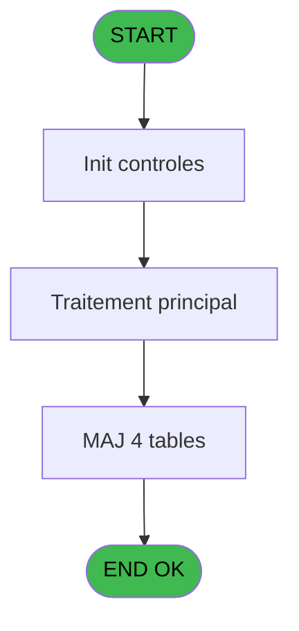
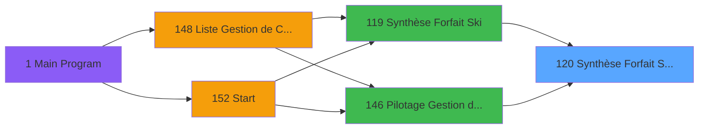
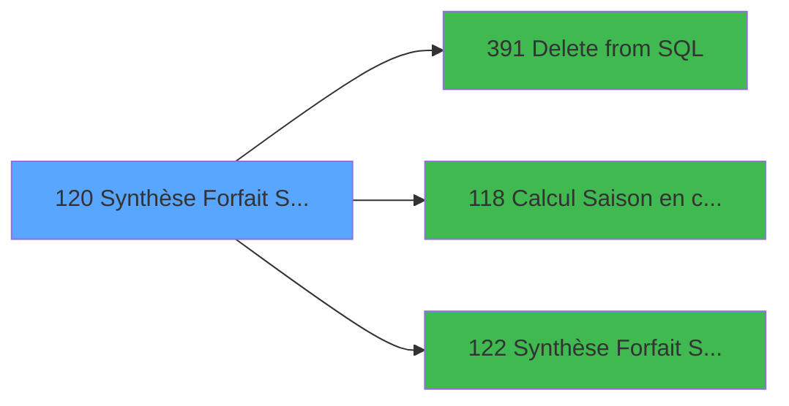

# PBP IDE 120 - Synthèse Forfait Ski Batch

> **Analyse**: Phases 1-4 2026-02-03 15:20 -> 15:20 (17s) | Assemblage 15:20
> **Pipeline**: V7.2 Enrichi
> **Structure**: 4 onglets (Resume | Ecrans | Donnees | Connexions)

<!-- TAB:Resume -->

## 1. FICHE D'IDENTITE

| Attribut | Valeur |
|----------|--------|
| Projet | PBP |
| IDE Position | 120 |
| Nom Programme | Synthèse Forfait Ski Batch |
| Fichier source | `Prg_120.xml` |
| Dossier IDE | Forfait |
| Taches | 13 (1 ecrans visibles) |
| Tables modifiees | 4 |
| Programmes appeles | 3 |

## 2. DESCRIPTION FONCTIONNELLE

**Synthèse Forfait Ski Batch** assure la gestion complete de ce processus, accessible depuis [Synthèse Forfait Ski (IDE 119)](PBP-IDE-119.md), [Pilotage Gestion de Crise (IDE 146)](PBP-IDE-146.md).

Le flux de traitement s'organise en **2 blocs fonctionnels** :

- **Traitement** (9 taches) : traitements metier divers
- **Calcul** (4 taches) : calculs de montants, stocks ou compteurs

**Donnees modifiees** : 4 tables en ecriture (log_effectif_envoi, Prestation_Multi, effectif_Q_new, Boo_HorairesOuverture).

Detail : phases du traitement

#### Phase 1 : Traitement (9 taches)

- **120** - Traitement **[[ECRAN]](#ecran-t1)**
- **120.1** - Maj tempo
- **120.4** - Rempli Jh
- **120.5** - Cumul forfait saison
- **120.6** - (sans nom) **[[ECRAN]](#ecran-t29)**
- **120.8** - (sans nom)
- **120.9** - Rempli tempo SQL **[[ECRAN]](#ecran-t38)**
- **120.11** - Rempli tempo SQL **[[ECRAN]](#ecran-t42)**
- **120.12** - reset total_jour_forfait_ski

Delegue a : [Delete from SQL (IDE 391)](PBP-IDE-391.md)

#### Phase 2 : Calcul (4 taches)

- **120.2** - Calcul clause qualite
- **120.3** - Calcul clause qualite
- **120.7** - Calcul du nbre de journée cum. **[[ECRAN]](#ecran-t30)**
- **120.10** - Calcul

Delegue a : [Calcul Saison en cours (IDE 118)](PBP-IDE-118.md)

#### Tables impactees

| Table | Operations | Role metier |
|-------|-----------|-------------|
| Prestation_Multi | R/**W**/L (6 usages) | Prestations/services vendus |
| effectif_Q_new | **W**/L (3 usages) |  |
| Boo_HorairesOuverture | **W** (1 usages) | Resultats recherche |
| log_effectif_envoi | **W** (1 usages) |  |

## 3. BLOCS FONCTIONNELS

### 3.1 Traitement (9 taches)

Traitements internes.

---

#### 120 - Traitement [[ECRAN]](#ecran-t1)

**Role** : Tache d'orchestration : point d'entree du programme (9 sous-taches). Coordonne l'enchainement des traitements.
**Ecran** : 846 x 58 DLU | [Voir mockup](#ecran-t1)

8 sous-taches directes

| Tache | Nom | Bloc |
|-------|-----|------|
| [120.1](#t8) | Maj tempo | Traitement |
| [120.4](#t27) | Rempli Jh | Traitement |
| [120.5](#t28) | Cumul forfait saison | Traitement |
| [120.6](#t29) | (sans nom) **[[ECRAN]](#ecran-t29)** | Traitement |
| [120.8](#t31) | (sans nom) | Traitement |
| [120.9](#t38) | Rempli tempo SQL **[[ECRAN]](#ecran-t38)** | Traitement |
| [120.11](#t42) | Rempli tempo SQL **[[ECRAN]](#ecran-t42)** | Traitement |
| [120.12](#t43) | reset total_jour_forfait_ski | Traitement |

**Delegue a** : [Delete from SQL (IDE 391)](PBP-IDE-391.md)

---

#### 120.1 - Maj tempo

**Role** : Traitement : Maj tempo.
**Delegue a** : [Delete from SQL (IDE 391)](PBP-IDE-391.md)

---

#### 120.4 - Rempli Jh

**Role** : Traitement : Rempli Jh.
**Delegue a** : [Delete from SQL (IDE 391)](PBP-IDE-391.md)

---

#### 120.5 - Cumul forfait saison

**Role** : Traitement : Cumul forfait saison.
**Variables liees** : L (v. Date debut forfait), M (v. Date fin forfait), N (v. Nb jour forfait), O (v.NbJour_durée_forfait), D (v_Saison)
**Delegue a** : [Delete from SQL (IDE 391)](PBP-IDE-391.md)

---

#### 120.6 - (sans nom) [[ECRAN]](#ecran-t29)

**Role** : Traitement interne.
**Ecran** : 632 x 0 DLU | [Voir mockup](#ecran-t29)
**Delegue a** : [Delete from SQL (IDE 391)](PBP-IDE-391.md)

---

#### 120.8 - (sans nom)

**Role** : Traitement interne.
**Delegue a** : [Delete from SQL (IDE 391)](PBP-IDE-391.md)

---

#### 120.9 - Rempli tempo SQL [[ECRAN]](#ecran-t38)

**Role** : Traitement : Rempli tempo SQL.
**Ecran** : 651 x 541 DLU | [Voir mockup](#ecran-t38)
**Delegue a** : [Delete from SQL (IDE 391)](PBP-IDE-391.md)

---

#### 120.11 - Rempli tempo SQL [[ECRAN]](#ecran-t42)

**Role** : Traitement : Rempli tempo SQL.
**Ecran** : 651 x 541 DLU | [Voir mockup](#ecran-t42)
**Delegue a** : [Delete from SQL (IDE 391)](PBP-IDE-391.md)

---

#### 120.12 - reset total_jour_forfait_ski

**Role** : Traitement : reset total_jour_forfait_ski.
**Delegue a** : [Delete from SQL (IDE 391)](PBP-IDE-391.md)

### 3.2 Calcul (4 taches)

Calculs metier : montants, stocks, compteurs.

---

#### 120.2 - Calcul clause qualite

**Role** : Calcul : Calcul clause qualite.
**Variables liees** : G (v_Clause _where_qualité), H (v_Clause _where_tranche_age)
**Delegue a** : [Calcul Saison en cours (IDE 118)](PBP-IDE-118.md)

---

#### 120.3 - Calcul clause qualite

**Role** : Calcul : Calcul clause qualite.
**Variables liees** : G (v_Clause _where_qualité), H (v_Clause _where_tranche_age)
**Delegue a** : [Calcul Saison en cours (IDE 118)](PBP-IDE-118.md)

---

#### 120.7 - Calcul du nbre de journée cum. [[ECRAN]](#ecran-t30)

**Role** : Calcul : Calcul du nbre de journée cum..
**Ecran** : 402 x 0 DLU | [Voir mockup](#ecran-t30)
**Delegue a** : [Calcul Saison en cours (IDE 118)](PBP-IDE-118.md)

---

#### 120.10 - Calcul

**Role** : Calcul : Calcul.
**Delegue a** : [Calcul Saison en cours (IDE 118)](PBP-IDE-118.md)

## 5. REGLES METIER

*(Aucune regle metier identifiee)*

## 6. CONTEXTE

- **Appele par**: [Synthèse Forfait Ski (IDE 119)](PBP-IDE-119.md), [Pilotage Gestion de Crise (IDE 146)](PBP-IDE-146.md)
- **Appelle**: 3 programmes | **Tables**: 10 (W:4 R:5 L:6) | **Taches**: 13 | **Expressions**: 29

<!-- TAB:Ecrans -->

## 8. ECRANS

### 8.1 Forms visibles (1 / 13)

| # | Position | Tache | Nom | Type | Largeur | Hauteur | Bloc |
|---|----------|-------|-----|------|---------|---------|------|
| 1 | 120 | 120 | Traitement | Type0 | 846 | 58 | Traitement |

### 8.2 Mockups Ecrans

---

#### 120 - Traitement
**Tache** : [120](#t1) | **Type** : Type0 | **Dimensions** : 846 x 58 DLU
**Bloc** : Traitement | **Titre IDE** : Traitement

<!-- FORM-DATA:
{
    "width":  846,
    "vFactor":  8,
    "type":  "Type0",
    "hFactor":  8,
    "controls":  [
                     {
                         "x":  0,
                         "type":  "label",
                         "var":  "",
                         "y":  15,
                         "w":  662,
                         "fmt":  "",
                         "name":  "",
                         "h":  24,
                         "color":  "1",
                         "text":  "",
                         "parent":  null
                     },
                     {
                         "x":  669,
                         "type":  "label",
                         "var":  "",
                         "y":  0,
                         "w":  168,
                         "fmt":  "",
                         "name":  "",
                         "h":  53,
                         "color":  "",
                         "text":  "",
                         "parent":  null
                     },
                     {
                         "x":  682,
                         "type":  "image",
                         "var":  "",
                         "y":  9,
                         "w":  149,
                         "fmt":  "",
                         "name":  "",
                         "h":  41,
                         "color":  "",
                         "text":  "",
                         "parent":  33
                     },
                     {
                         "x":  12,
                         "type":  "edit",
                         "var":  "",
                         "y":  22,
                         "w":  632,
                         "fmt":  "",
                         "name":  "v libelle execution",
                         "h":  10,
                         "color":  "2",
                         "text":  "",
                         "parent":  null
                     }
                 ],
    "taskId":  "120",
    "height":  58
}
-->

<strong>Champs : 1 champs</strong>

| Pos (x,y) | Nom | Variable | Type |
|-----------|-----|----------|------|
| 12,22 | v libelle execution | - | edit |

## 9. NAVIGATION

Ecran unique: **Traitement**

### 9.3 Structure hierarchique (13 taches)

| Position | Tache | Type | Dimensions | Bloc |
|----------|-------|------|------------|------|
| **120.1** | [**Traitement** (120)](#t1) [mockup](#ecran-t1) | - | 846x58 | Traitement |
| 120.1.1 | [Maj tempo (120.1)](#t8) | - | - | |
| 120.1.2 | [Rempli Jh (120.4)](#t27) | - | - | |
| 120.1.3 | [Cumul forfait saison (120.5)](#t28) | - | - | |
| 120.1.4 | [(sans nom) (120.6)](#t29) [mockup](#ecran-t29) | - | 632x0 | |
| 120.1.5 | [(sans nom) (120.8)](#t31) | - | - | |
| 120.1.6 | [Rempli tempo SQL (120.9)](#t38) [mockup](#ecran-t38) | - | 651x541 | |
| 120.1.7 | [Rempli tempo SQL (120.11)](#t42) [mockup](#ecran-t42) | - | 651x541 | |
| 120.1.8 | [reset total_jour_forfait_ski (120.12)](#t43) | - | - | |
| **120.2** | [**Calcul clause qualite** (120.2)](#t15) | - | - | Calcul |
| 120.2.1 | [Calcul clause qualite (120.3)](#t22) | - | - | |
| 120.2.2 | [Calcul du nbre de journée cum. (120.7)](#t30) [mockup](#ecran-t30) | - | 402x0 | |
| 120.2.3 | [Calcul (120.10)](#t39) | - | - | |

### 9.4 Algorigramme

> **Legende**: Vert = START/END OK | Rouge = END KO | Bleu = Decisions
> *Algorigramme auto-genere. Utiliser `/algorigramme` pour une synthese metier detaillee.*

<!-- TAB:Donnees -->

## 10. TABLES

### Tables utilisees (10)

| ID | Nom | Description | Type | R | W | L | Usages |
|----|-----|-------------|------|---|---|---|--------|
| 30 | gm-recherche_____gmr | Index de recherche | DB |   |   | L | 2 |
| 120 | tables_qualites__qua |  | DB | R |   |   | 1 |
| 372 | pv_budget |  | DB | R |   |   | 1 |
| 392 | pv_invoicehistoline | Historique / journal | DB |   |   | L | 1 |
| 637 | tempo_zone_secteur | Table temporaire ecran | DB | R |   | L | 2 |
| 797 | log_effectif_envoi |  | DB |   | **W** |   | 1 |
| 887 | reedition_ticket |  | DB | R |   | L | 2 |
| 888 | Prestation_Multi | Prestations/services vendus | DB | R | **W** | L | 6 |
| 889 | effectif_Q_new |  | DB |   | **W** | L | 3 |
| 897 | Boo_HorairesOuverture | Resultats recherche | DB |   | **W** |   | 1 |

### Colonnes par table (2 / 8 tables avec colonnes identifiees)

Table 120 - tables_qualites__qua (R) - 1 usages

*Table utilisee uniquement en Link ou aucune colonne Real identifiee dans le DataView.*

Table 372 - pv_budget (R) - 1 usages

| Lettre | Variable | Acces | Type |
|--------|----------|-------|------|
| A | P_Date | R | Date |
| B | < P_Nom Fichier Csv | R | Alpha |
| C | P Viens de ? | R | Alpha |
| D | v_Saison | R | Alpha |
| E | v_date_deb_working | R | Date |
| F | v_date_fin_working | R | Date |
| G | v_Clause _where_qualité | R | Alpha |
| H | v_Clause _where_tranche_age | R | Alpha |
| I | v_nom_fichier_Excel | R | Alpha |
| J | v_Village | R | Alpha |
| K | v libelle execution | R | Alpha |

Table 637 - tempo_zone_secteur (R/L) - 2 usages

*Table utilisee uniquement en Link ou aucune colonne Real identifiee dans le DataView.*

Table 797 - log_effectif_envoi (**W**) - 1 usages

*Table utilisee uniquement en Link ou aucune colonne Real identifiee dans le DataView.*

Table 887 - reedition_ticket (R/L) - 2 usages

*Table utilisee uniquement en Link ou aucune colonne Real identifiee dans le DataView.*

Table 888 - Prestation_Multi (R/**W**/L) - 6 usages

| Lettre | Variable | Acces | Type |
|--------|----------|-------|------|
| A | gmc_nom_complet | W | Unicode |
| B | gmc_prenom_complet | W | Unicode |
| C | heb_num_compte | W | Numeric |
| D | heb_filiation | W | Numeric |
| E | heb_date_debut | W | Alpha |
| F | heb_date_fin | W | Alpha |
| G | heb_age_num | W | Numeric |
| H | heb_complement_type | W | Unicode |
| I | V.Calc tranche min | W | Numeric |
| J | V.Calc tranche max | W | Numeric |
| K | v. Nb nuités | W | Numeric |
| L | v. Date debut forfait | W | Date |
| M | v. Date fin forfait | W | Date |
| N | v. Nb jour forfait | W | Numeric |
| O | v.NbJour_durée_forfait | W | Numeric |

Table 889 - effectif_Q_new (**W**/L) - 3 usages

*Table utilisee uniquement en Link ou aucune colonne Real identifiee dans le DataView.*

Table 897 - Boo_HorairesOuverture (**W**) - 1 usages

*Table utilisee uniquement en Link ou aucune colonne Real identifiee dans le DataView.*

## 11. VARIABLES

### 11.1 Parametres entrants (1)

Variables recues du programme appelant ([Synthèse Forfait Ski (IDE 119)](PBP-IDE-119.md)).

| Lettre | Nom | Type | Usage dans |
|--------|-----|------|-----------|
| C | P Viens de ? | Alpha | - |

### 11.2 Variables de session (5)

Variables persistantes pendant toute la session.

| Lettre | Nom | Type | Usage dans |
|--------|-----|------|-----------|
| K | v libelle execution | Alpha | 1x session |
| L | v. Date debut forfait | Date | - |
| M | v. Date fin forfait | Date | - |
| N | v. Nb jour forfait | Numeric | - |
| O | v.NbJour_durée_forfait | Numeric | - |

### 11.3 Autres (9)

Variables diverses.

| Lettre | Nom | Type | Usage dans |
|--------|-----|------|-----------|
| A | P_Date | Date | - |
| B | < P_Nom Fichier Csv | Alpha | - |
| D | v_Saison | Alpha | 2x refs |
| E | v_date_deb_working | Date | - |
| F | v_date_fin_working | Date | - |
| G | v_Clause _where_qualité | Alpha | 1x refs |
| H | v_Clause _where_tranche_age | Alpha | - |
| I | v_nom_fichier_Excel | Alpha | - |
| J | v_Village | Alpha | - |

## 12. EXPRESSIONS

**29 / 29 expressions decodees (100%)**

### 12.1 Repartition par type

| Type | Expressions | Regles |
|------|-------------|--------|
| CONDITION | 3 | 0 |
| CALCULATION | 1 | 0 |
| CONSTANTE | 14 | 0 |
| DATE | 1 | 0 |
| FORMAT | 1 | 0 |
| OTHER | 5 | 0 |
| REFERENCE_VG | 2 | 0 |
| CAST_LOGIQUE | 1 | 0 |
| CONCATENATION | 1 | 0 |

### 12.2 Expressions cles par type

#### CONDITION (3 expressions)

| Type | IDE | Expression | Regle |
|------|-----|------------|-------|
| CONDITION | 21 | `[AD]='G'` | - |
| CONDITION | 10 | `[AA]<>'00/00/0000'DATE` | - |
| CONDITION | 2 | `v libelle execution [K]='00/00/0000'DATE` | - |

#### CALCULATION (1 expressions)

| Type | IDE | Expression | Regle |
|------|-----|------------|-------|
| CALCULATION | 9 | `[AA]-1` | - |

#### CONSTANTE (14 expressions)

| Type | IDE | Expression | Regle |
|------|-----|------------|-------|
| CONSTANTE | 20 | `'Début traitement'` | - |
| CONSTANTE | 19 | `'Fin traitement'` | - |
| CONSTANTE | 18 | `'Cumul Journée J'` | - |
| CONSTANTE | 22 | `'synthese_forfait_ski'` | - |
| CONSTANTE | 28 | `'TFSKI'` | - |
| ... | | *+9 autres* | |

#### DATE (1 expressions)

| Type | IDE | Expression | Regle |
|------|-----|------------|-------|
| DATE | 1 | `Date()` | - |

#### FORMAT (1 expressions)

| Type | IDE | Expression | Regle |
|------|-----|------------|-------|
| FORMAT | 6 | `Translate('%club_exportdata%')&'Trsft\'&Trim([X])&'_SYNT_FORFAIT_SKI_'&DStr(Date(),'YYYYMM')&'.csv'` | - |

#### OTHER (5 expressions)

| Type | IDE | Expression | Regle |
|------|-----|------------|-------|
| OTHER | 8 | `[V]` | - |
| OTHER | 29 | `v_Saison [D]` | - |
| OTHER | 5 | `SetCrsr (1)` | - |
| OTHER | 3 | `DbDel ('{637,2}'DSOURCE,'')` | - |
| OTHER | 4 | `SetCrsr (2)` | - |

#### REFERENCE_VG (2 expressions)

| Type | IDE | Expression | Regle |
|------|-----|------------|-------|
| REFERENCE_VG | 26 | `VG1` | - |
| REFERENCE_VG | 7 | `VG33` | - |

#### CAST_LOGIQUE (1 expressions)

| Type | IDE | Expression | Regle |
|------|-----|------------|-------|
| CAST_LOGIQUE | 24 | `'TRUE'LOG` | - |

#### CONCATENATION (1 expressions)

| Type | IDE | Expression | Regle |
|------|-----|------------|-------|
| CONCATENATION | 25 | `Trim(v_Saison [D])&Trim(v_Clause _where_qualité [G])` | - |

### 12.3 Toutes les expressions (29)

Voir les 29 expressions

#### CONDITION (3)

| IDE | Expression Decodee |
|-----|-------------------|
| 2 | `v libelle execution [K]='00/00/0000'DATE` |
| 10 | `[AA]<>'00/00/0000'DATE` |
| 21 | `[AD]='G'` |

#### CALCULATION (1)

| IDE | Expression Decodee |
|-----|-------------------|
| 9 | `[AA]-1` |

#### CONSTANTE (14)

| IDE | Expression Decodee |
|-----|-------------------|
| 11 | `'Maj Tempo qualité'` |
| 12 | `'Clause Where Qualité'` |
| 13 | `'Clause Where Tranche'` |
| 14 | `'Rempli Sql Temp'` |
| 15 | `'Rempli JH'` |
| 16 | `'cumul Forfait Saison'` |
| 17 | `'Calcul Nbre journée cumul.'` |
| 18 | `'Cumul Journée J'` |
| 19 | `'Fin traitement'` |
| 20 | `'Début traitement'` |
| 22 | `'synthese_forfait_ski'` |
| 23 | `'synthese_saison_forfait_ski'` |
| 27 | `''` |
| 28 | `'TFSKI'` |

#### DATE (1)

| IDE | Expression Decodee |
|-----|-------------------|
| 1 | `Date()` |

#### FORMAT (1)

| IDE | Expression Decodee |
|-----|-------------------|
| 6 | `Translate('%club_exportdata%')&'Trsft\'&Trim([X])&'_SYNT_FORFAIT_SKI_'&DStr(Date(),'YYYYMM')&'.csv'` |

#### OTHER (5)

| IDE | Expression Decodee |
|-----|-------------------|
| 3 | `DbDel ('{637,2}'DSOURCE,'')` |
| 4 | `SetCrsr (2)` |
| 5 | `SetCrsr (1)` |
| 8 | `[V]` |
| 29 | `v_Saison [D]` |

#### REFERENCE_VG (2)

| IDE | Expression Decodee |
|-----|-------------------|
| 7 | `VG33` |
| 26 | `VG1` |

#### CAST_LOGIQUE (1)

| IDE | Expression Decodee |
|-----|-------------------|
| 24 | `'TRUE'LOG` |

#### CONCATENATION (1)

| IDE | Expression Decodee |
|-----|-------------------|
| 25 | `Trim(v_Saison [D])&Trim(v_Clause _where_qualité [G])` |

<!-- TAB:Connexions -->

## 13. GRAPHE D'APPELS

### 13.1 Chaine depuis Main (Callers)

Main -> ... -> [Synthèse Forfait Ski (IDE 119)](PBP-IDE-119.md) -> **Synthèse Forfait Ski Batch (IDE 120)**

Main -> ... -> [Pilotage Gestion de Crise (IDE 146)](PBP-IDE-146.md) -> **Synthèse Forfait Ski Batch (IDE 120)**

### 13.2 Callers

| IDE | Nom Programme | Nb Appels |
|-----|---------------|-----------|
| [119](PBP-IDE-119.md) | Synthèse Forfait Ski | 1 |
| [146](PBP-IDE-146.md) | Pilotage Gestion de Crise | 1 |

### 13.3 Callees (programmes appeles)

### 13.4 Detail Callees avec contexte

| IDE | Nom Programme | Appels | Contexte |
|-----|---------------|--------|----------|
| [391](PBP-IDE-391.md) | Delete from SQL | 2 | Sous-programme |
| [118](PBP-IDE-118.md) | Calcul Saison en cours | 1 | Calcul de donnees |
| [122](PBP-IDE-122.md) | Synthèse Forfait Ski Edition | 1 | Impression ticket/document |

## 14. RECOMMANDATIONS MIGRATION

### 14.1 Profil du programme

| Metrique | Valeur | Impact migration |
|----------|--------|-----------------|
| Lignes de logique | 562 | Programme volumineux |
| Expressions | 29 | Peu de logique |
| Tables WRITE | 4 | Impact modere |
| Sous-programmes | 3 | Peu de dependances |
| Ecrans visibles | 1 | Ecran unique ou traitement batch |
| Code desactive | 0.4% (2 / 562) | Code sain |
| Regles metier | 0 | Pas de regle identifiee |

### 14.2 Plan de migration par bloc

#### Traitement (9 taches: 4 ecrans, 5 traitements)

- **Strategie** : Orchestrateur avec 4 ecrans (Razor/React) et 5 traitements backend (services).
- Les ecrans deviennent des composants UI, les traitements invisibles deviennent des services injectables.
- 3 sous-programme(s) a migrer ou a reutiliser depuis les services existants.
- Decomposer les taches en services unitaires testables.

#### Calcul (4 taches: 1 ecran, 3 traitements)

- **Strategie** : Services de calcul purs (Domain Services).
- Migrer la logique de calcul (stock, compteurs, montants)

### 14.3 Dependances critiques

| Dependance | Type | Appels | Impact |
|------------|------|--------|--------|
| log_effectif_envoi | Table WRITE (Database) | 1x | Schema + repository |
| Prestation_Multi | Table WRITE (Database) | 3x | Schema + repository |
| effectif_Q_new | Table WRITE (Database) | 2x | Schema + repository |
| Boo_HorairesOuverture | Table WRITE (Database) | 1x | Schema + repository |
| [Delete from SQL (IDE 391)](PBP-IDE-391.md) | Sous-programme | 2x | Haute - Sous-programme |
| [Synthèse Forfait Ski Edition (IDE 122)](PBP-IDE-122.md) | Sous-programme | 1x | Normale - Impression ticket/document |
| [Calcul Saison en cours (IDE 118)](PBP-IDE-118.md) | Sous-programme | 1x | Normale - Calcul de donnees |

---
*Spec DETAILED generee par Pipeline V7.2 - 2026-02-03 15:20*
