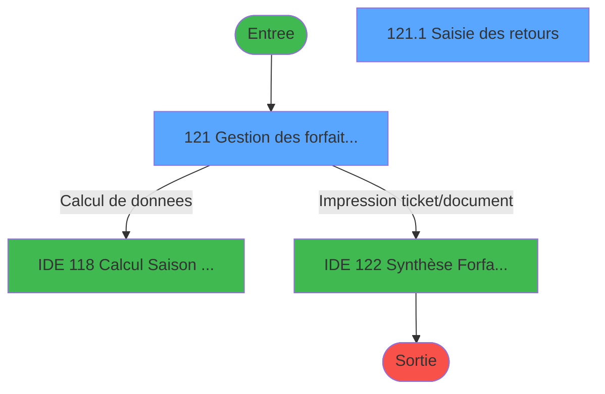
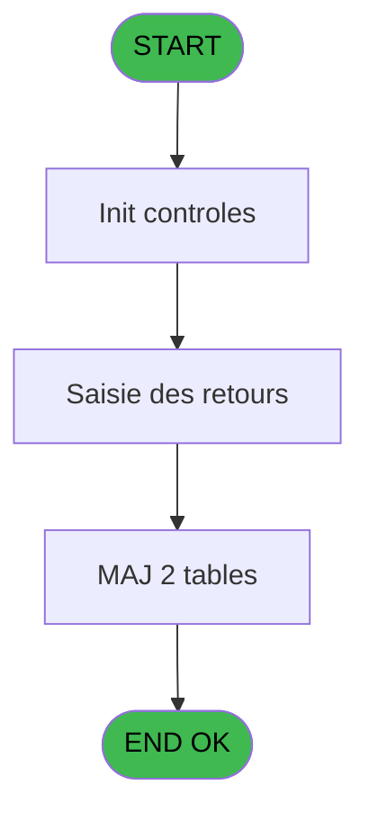
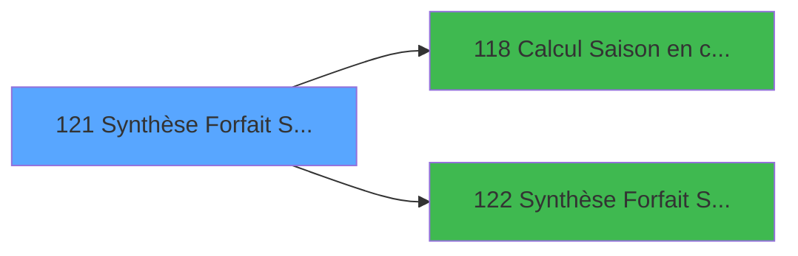

# PBP IDE 121 - Synthèse Forfait Ski Résultat

> **Analyse**: Phases 1-4 2026-02-03 15:20 -> 15:21 (16s) | Assemblage 15:21
> **Pipeline**: V7.2 Enrichi
> **Structure**: 4 onglets (Resume | Ecrans | Donnees | Connexions)

<!-- TAB:Resume -->

## 1. FICHE D'IDENTITE

| Attribut | Valeur |
|----------|--------|
| Projet | PBP |
| IDE Position | 121 |
| Nom Programme | Synthèse Forfait Ski Résultat |
| Fichier source | `Prg_121.xml` |
| Dossier IDE | Forfait |
| Taches | 3 (2 ecrans visibles) |
| Tables modifiees | 2 |
| Programmes appeles | 2 |

## 2. DESCRIPTION FONCTIONNELLE

**Synthèse Forfait Ski Résultat** assure la gestion complete de ce processus, accessible depuis [Synthèse Forfait Ski (IDE 119)](PBP-IDE-119.md).

Le flux de traitement s'organise en **2 blocs fonctionnels** :

- **Traitement** (2 taches) : traitements metier divers
- **Saisie** (1 tache) : ecrans de saisie utilisateur (formulaires, champs, donnees)

**Donnees modifiees** : 2 tables en ecriture (reedition_ticket, Boo_HorairesOuverture).

Detail : phases du traitement

#### Phase 1 : Traitement (2 taches)

- **121** - Gestion des forfaits retournés **[[ECRAN]](#ecran-t1)**
- **121.2** - (sans nom)

#### Phase 2 : Saisie (1 tache)

- **121.1** - Saisie des retours **[[ECRAN]](#ecran-t2)**

#### Tables impactees

| Table | Operations | Role metier |
|-------|-----------|-------------|
| reedition_ticket | **W**/L (2 usages) |  |
| Boo_HorairesOuverture | **W** (1 usages) | Resultats recherche |

## 3. BLOCS FONCTIONNELS

### 3.1 Traitement (2 taches)

Traitements internes.

---

#### 121 - Gestion des forfaits retournés [[ECRAN]](#ecran-t1)

**Role** : Gestion du moyen de paiement : Gestion des forfaits retournés.
**Ecran** : 1755 x 438 DLU (MDI) | [Voir mockup](#ecran-t1)

---

#### 121.2 - (sans nom)

**Role** : Traitement interne.

### 3.2 Saisie (1 tache)

L'operateur saisit les donnees de la transaction via 1 ecran (Saisie des retours).

---

#### 121.1 - Saisie des retours [[ECRAN]](#ecran-t2)

**Role** : Saisie des donnees : Saisie des retours.
**Ecran** : 1749 x 380 DLU (Modal) | [Voir mockup](#ecran-t2)

## 5. REGLES METIER

*(Aucune regle metier identifiee)*

## 6. CONTEXTE

- **Appele par**: [Synthèse Forfait Ski (IDE 119)](PBP-IDE-119.md)
- **Appelle**: 2 programmes | **Tables**: 5 (W:2 R:1 L:3) | **Taches**: 3 | **Expressions**: 8

<!-- TAB:Ecrans -->

## 8. ECRANS

### 8.1 Forms visibles (2 / 3)

| # | Position | Tache | Nom | Type | Largeur | Hauteur | Bloc |
|---|----------|-------|-----|------|---------|---------|------|
| 1 | 121 | 121 | Gestion des forfaits retournés | MDI | 1755 | 438 | Traitement |
| 2 | 121.1 | 121.1 | Saisie des retours | Modal | 1749 | 380 | Saisie |

### 8.2 Mockups Ecrans

---

#### 121 - Gestion des forfaits retournés
**Tache** : [121](#t1) | **Type** : MDI | **Dimensions** : 1755 x 438 DLU
**Bloc** : Traitement | **Titre IDE** : Gestion des forfaits retournés

<!-- FORM-DATA:
{
    "width":  1755,
    "vFactor":  8,
    "type":  "MDI",
    "hFactor":  8,
    "controls":  [
                     {
                         "x":  2,
                         "type":  "label",
                         "var":  "",
                         "y":  2,
                         "w":  1640,
                         "fmt":  "",
                         "name":  "",
                         "h":  18,
                         "color":  "1",
                         "text":  "",
                         "parent":  null
                     },
                     {
                         "x":  3,
                         "type":  "label",
                         "var":  "",
                         "y":  20,
                         "w":  1638,
                         "fmt":  "",
                         "name":  "",
                         "h":  30,
                         "color":  "195",
                         "text":  "",
                         "parent":  null
                     },
                     {
                         "x":  11,
                         "type":  "label",
                         "var":  "",
                         "y":  30,
                         "w":  119,
                         "fmt":  "",
                         "name":  "",
                         "h":  10,
                         "color":  "118",
                         "text":  "Semaine  du :",
                         "parent":  7
                     },
                     {
                         "x":  310,
                         "type":  "label",
                         "var":  "",
                         "y":  30,
                         "w":  32,
                         "fmt":  "",
                         "name":  "",
                         "h":  10,
                         "color":  "118",
                         "text":  "Au :",
                         "parent":  7
                     },
                     {
                         "x":  566,
                         "type":  "label",
                         "var":  "",
                         "y":  6,
                         "w":  526,
                         "fmt":  "",
                         "name":  "",
                         "h":  11,
                         "color":  "",
                         "text":  "Synthèse forfaits ski par date et durée de forfait",
                         "parent":  null
                     },
                     {
                         "x":  1405,
                         "type":  "edit",
                         "var":  "",
                         "y":  5,
                         "w":  209,
                         "fmt":  "WWW DD MMM YYYYT",
                         "name":  "",
                         "h":  11,
                         "color":  "",
                         "text":  "",
                         "parent":  null
                     },
                     {
                         "x":  12,
                         "type":  "edit",
                         "var":  "",
                         "y":  6,
                         "w":  232,
                         "fmt":  "30",
                         "name":  "",
                         "h":  11,
                         "color":  "2",
                         "text":  "",
                         "parent":  null
                     },
                     {
                         "x":  134,
                         "type":  "edit",
                         "var":  "",
                         "y":  30,
                         "w":  126,
                         "fmt":  "",
                         "name":  "w0_Date_debut",
                         "h":  10,
                         "color":  "110",
                         "text":  "",
                         "parent":  7
                     },
                     {
                         "x":  272,
                         "type":  "button",
                         "var":  "",
                         "y":  30,
                         "w":  25,
                         "fmt":  "...",
                         "name":  "b_Date",
                         "h":  10,
                         "color":  "",
                         "text":  "",
                         "parent":  7
                     },
                     {
                         "x":  357,
                         "type":  "edit",
                         "var":  "",
                         "y":  30,
                         "w":  126,
                         "fmt":  "",
                         "name":  "w0_Date_fin",
                         "h":  10,
                         "color":  "110",
                         "text":  "",
                         "parent":  7
                     },
                     {
                         "x":  0,
                         "type":  "subform",
                         "var":  "",
                         "y":  53,
                         "w":  1750,
                         "fmt":  "",
                         "name":  "Saisie des retours",
                         "h":  381,
                         "color":  "",
                         "text":  "",
                         "parent":  null
                     }
                 ],
    "taskId":  "121",
    "height":  438
}
-->

<strong>Champs : 4 champs</strong>

| Pos (x,y) | Nom | Variable | Type |
|-----------|-----|----------|------|
| 1405,5 | WWW DD MMM YYYYT | - | edit |
| 12,6 | 30 | - | edit |
| 134,30 | w0_Date_debut | - | edit |
| 357,30 | w0_Date_fin | - | edit |

<strong>Boutons : 1 boutons</strong>

| Bouton | Pos (x,y) | Action |
|--------|-----------|--------|
| ... | 272,30 | Bouton fonctionnel |

---

#### 121.1 - Saisie des retours
**Tache** : [121.1](#t2) | **Type** : Modal | **Dimensions** : 1749 x 380 DLU
**Bloc** : Saisie | **Titre IDE** : Saisie des retours

<!-- FORM-DATA:
{
    "width":  1749,
    "vFactor":  8,
    "type":  "Modal",
    "hFactor":  8,
    "controls":  [
                     {
                         "x":  2,
                         "type":  "table",
                         "var":  "",
                         "name":  "",
                         "titleH":  12,
                         "color":  "110",
                         "w":  1717,
                         "y":  67,
                         "fmt":  "",
                         "parent":  null,
                         "text":  "",
                         "rowH":  39,
                         "h":  287,
                         "cols":  [
                                      {
                                          "title":  "",
                                          "layer":  1,
                                          "w":  105
                                      },
                                      {
                                          "title":  "Début forfait Ski",
                                          "layer":  2,
                                          "w":  200
                                      },
                                      {
                                          "title":  "0.5",
                                          "layer":  3,
                                          "w":  66
                                      },
                                      {
                                          "title":  "1",
                                          "layer":  4,
                                          "w":  66
                                      },
                                      {
                                          "title":  "2",
                                          "layer":  5,
                                          "w":  66
                                      },
                                      {
                                          "title":  "3",
                                          "layer":  6,
                                          "w":  66
                                      },
                                      {
                                          "title":  "4",
                                          "layer":  7,
                                          "w":  66
                                      },
                                      {
                                          "title":  "5",
                                          "layer":  8,
                                          "w":  66
                                      },
                                      {
                                          "title":  "6",
                                          "layer":  9,
                                          "w":  66
                                      },
                                      {
                                          "title":  "7",
                                          "layer":  10,
                                          "w":  66
                                      },
                                      {
                                          "title":  "8",
                                          "layer":  11,
                                          "w":  66
                                      },
                                      {
                                          "title":  "9",
                                          "layer":  12,
                                          "w":  66
                                      },
                                      {
                                          "title":  "10",
                                          "layer":  13,
                                          "w":  66
                                      },
                                      {
                                          "title":  "11",
                                          "layer":  14,
                                          "w":  66
                                      },
                                      {
                                          "title":  "12",
                                          "layer":  15,
                                          "w":  66
                                      },
                                      {
                                          "title":  "13",
                                          "layer":  16,
                                          "w":  66
                                      },
                                      {
                                          "title":  "14",
                                          "layer":  17,
                                          "w":  66
                                      },
                                      {
                                          "title":  "15",
                                          "layer":  18,
                                          "w":  66
                                      },
                                      {
                                          "title":  "Total jour",
                                          "layer":  19,
                                          "w":  110
                                      },
                                      {
                                          "title":  "J.H P",
                                          "layer":  20,
                                          "w":  103
                                      },
                                      {
                                          "title":  "Dépassement",
                                          "layer":  21,
                                          "w":  134
                                      }
                                  ],
                         "rows":  21
                     },
                     {
                         "x":  8,
                         "type":  "label",
                         "var":  "",
                         "y":  0,
                         "w":  1636,
                         "fmt":  "",
                         "name":  "",
                         "h":  11,
                         "color":  "118",
                         "text":  "Durée de forfait (exprimé en jour)",
                         "parent":  null
                     },
                     {
                         "x":  8,
                         "type":  "label",
                         "var":  "",
                         "y":  13,
                         "w":  1638,
                         "fmt":  "",
                         "name":  "",
                         "h":  18,
                         "color":  "118",
                         "text":  "",
                         "parent":  null
                     },
                     {
                         "x":  19,
                         "type":  "label",
                         "var":  "",
                         "y":  18,
                         "w":  97,
                         "fmt":  "",
                         "name":  "",
                         "h":  10,
                         "color":  "118",
                         "text":  "Forfaits",
                         "parent":  null
                     },
                     {
                         "x":  9,
                         "type":  "label",
                         "var":  "",
                         "y":  32,
                         "w":  1638,
                         "fmt":  "",
                         "name":  "",
                         "h":  18,
                         "color":  "118",
                         "text":  "",
                         "parent":  null
                     },
                     {
                         "x":  19,
                         "type":  "label",
                         "var":  "",
                         "y":  37,
                         "w":  97,
                         "fmt":  "",
                         "name":  "",
                         "h":  10,
                         "color":  "118",
                         "text":  "Journées",
                         "parent":  null
                     },
                     {
                         "x":  112,
                         "type":  "label",
                         "var":  "",
                         "y":  92,
                         "w":  48,
                         "fmt":  "",
                         "name":  "",
                         "h":  9,
                         "color":  "48",
                         "text":  "Ecart",
                         "parent":  1
                     },
                     {
                         "x":  114,
                         "type":  "label",
                         "var":  "",
                         "y":  108,
                         "w":  90,
                         "fmt":  "",
                         "name":  "",
                         "h":  9,
                         "color":  "118",
                         "text":  "Total . Jour",
                         "parent":  1
                     },
                     {
                         "x":  313,
                         "type":  "edit",
                         "var":  "",
                         "y":  18,
                         "w":  54,
                         "fmt":  "N5Z",
                         "name":  "ssfs_valeur_demi_journee",
                         "h":  10,
                         "color":  "6",
                         "text":  "",
                         "parent":  null
                     },
                     {
                         "x":  380,
                         "type":  "edit",
                         "var":  "",
                         "y":  18,
                         "w":  54,
                         "fmt":  "N5Z",
                         "name":  "ssfs_valeur_1jour",
                         "h":  10,
                         "color":  "6",
                         "text":  "",
                         "parent":  null
                     },
                     {
                         "x":  445,
                         "type":  "edit",
                         "var":  "",
                         "y":  18,
                         "w":  54,
                         "fmt":  "N5Z",
                         "name":  "ssfs_valeur_2jours",
                         "h":  10,
                         "color":  "6",
                         "text":  "",
                         "parent":  null
                     },
                     {
                         "x":  513,
                         "type":  "edit",
                         "var":  "",
                         "y":  18,
                         "w":  54,
                         "fmt":  "N5Z",
                         "name":  "ssfs_valeur_3jours",
                         "h":  10,
                         "color":  "6",
                         "text":  "",
                         "parent":  null
                     },
                     {
                         "x":  579,
                         "type":  "edit",
                         "var":  "",
                         "y":  18,
                         "w":  54,
                         "fmt":  "N5Z",
                         "name":  "ssfs_valeur_4jours",
                         "h":  10,
                         "color":  "6",
                         "text":  "",
                         "parent":  null
                     },
                     {
                         "x":  645,
                         "type":  "edit",
                         "var":  "",
                         "y":  18,
                         "w":  54,
                         "fmt":  "N5Z",
                         "name":  "ssfs_valeur_5jours",
                         "h":  10,
                         "color":  "6",
                         "text":  "",
                         "parent":  null
                     },
                     {
                         "x":  712,
                         "type":  "edit",
                         "var":  "",
                         "y":  18,
                         "w":  54,
                         "fmt":  "N5Z",
                         "name":  "ssfs_valeur_6jours",
                         "h":  10,
                         "color":  "6",
                         "text":  "",
                         "parent":  null
                     },
                     {
                         "x":  777,
                         "type":  "edit",
                         "var":  "",
                         "y":  18,
                         "w":  54,
                         "fmt":  "N5Z",
                         "name":  "ssfs_valeur_7jours",
                         "h":  10,
                         "color":  "6",
                         "text":  "",
                         "parent":  null
                     },
                     {
                         "x":  843,
                         "type":  "edit",
                         "var":  "",
                         "y":  18,
                         "w":  54,
                         "fmt":  "N5Z",
                         "name":  "ssfs_valeur_8jours",
                         "h":  10,
                         "color":  "6",
                         "text":  "",
                         "parent":  null
                     },
                     {
                         "x":  909,
                         "type":  "edit",
                         "var":  "",
                         "y":  18,
                         "w":  54,
                         "fmt":  "N5Z",
                         "name":  "ssfs_valeur_9jours",
                         "h":  10,
                         "color":  "6",
                         "text":  "",
                         "parent":  null
                     },
                     {
                         "x":  976,
                         "type":  "edit",
                         "var":  "",
                         "y":  18,
                         "w":  54,
                         "fmt":  "N5Z",
                         "name":  "ssfs_valeur_10jours",
                         "h":  10,
                         "color":  "6",
                         "text":  "",
                         "parent":  null
                     },
                     {
                         "x":  1041,
                         "type":  "edit",
                         "var":  "",
                         "y":  18,
                         "w":  54,
                         "fmt":  "N5Z",
                         "name":  "ssfs_valeur_11jours",
                         "h":  10,
                         "color":  "6",
                         "text":  "",
                         "parent":  null
                     },
                     {
                         "x":  1107,
                         "type":  "edit",
                         "var":  "",
                         "y":  18,
                         "w":  54,
                         "fmt":  "N5Z",
                         "name":  "ssfs_valeur_12jours",
                         "h":  10,
                         "color":  "6",
                         "text":  "",
                         "parent":  null
                     },
                     {
                         "x":  1166,
                         "type":  "edit",
                         "var":  "",
                         "y":  18,
                         "w":  54,
                         "fmt":  "N5Z",
                         "name":  "ssfs_valeur_13jours",
                         "h":  10,
                         "color":  "6",
                         "text":  "",
                         "parent":  null
                     },
                     {
                         "x":  1233,
                         "type":  "edit",
                         "var":  "",
                         "y":  18,
                         "w":  54,
                         "fmt":  "N5Z",
                         "name":  "ssfs_valeur_14jours",
                         "h":  10,
                         "color":  "6",
                         "text":  "",
                         "parent":  null
                     },
                     {
                         "x":  1301,
                         "type":  "edit",
                         "var":  "",
                         "y":  18,
                         "w":  54,
                         "fmt":  "N5Z",
                         "name":  "ssfs_valeur_15jours",
                         "h":  10,
                         "color":  "6",
                         "text":  "",
                         "parent":  null
                     },
                     {
                         "x":  1395,
                         "type":  "edit",
                         "var":  "",
                         "y":  18,
                         "w":  54,
                         "fmt":  "N5Z",
                         "name":  "ssfs_valeur_total",
                         "h":  10,
                         "color":  "6",
                         "text":  "",
                         "parent":  null
                     },
                     {
                         "x":  313,
                         "type":  "edit",
                         "var":  "",
                         "y":  37,
                         "w":  54,
                         "fmt":  "N5Z",
                         "name":  "ssfs_valeur_demi_journee/_0001",
                         "h":  10,
                         "color":  "6",
                         "text":  "",
                         "parent":  null
                     },
                     {
                         "x":  380,
                         "type":  "edit",
                         "var":  "",
                         "y":  37,
                         "w":  54,
                         "fmt":  "N5Z",
                         "name":  "ssfs_valeur_1jour_0001",
                         "h":  10,
                         "color":  "6",
                         "text":  "",
                         "parent":  null
                     },
                     {
                         "x":  445,
                         "type":  "edit",
                         "var":  "",
                         "y":  37,
                         "w":  54,
                         "fmt":  "N5Z",
                         "name":  "ssfs_valeur_2jours_0001",
                         "h":  10,
                         "color":  "6",
                         "text":  "",
                         "parent":  null
                     },
                     {
                         "x":  513,
                         "type":  "edit",
                         "var":  "",
                         "y":  37,
                         "w":  54,
                         "fmt":  "N5Z",
                         "name":  "ssfs_valeur_3jours_0001",
                         "h":  10,
                         "color":  "6",
                         "text":  "",
                         "parent":  null
                     },
                     {
                         "x":  579,
                         "type":  "edit",
                         "var":  "",
                         "y":  37,
                         "w":  54,
                         "fmt":  "N5Z",
                         "name":  "ssfs_valeur_4jours_0001",
                         "h":  10,
                         "color":  "6",
                         "text":  "",
                         "parent":  null
                     },
                     {
                         "x":  645,
                         "type":  "edit",
                         "var":  "",
                         "y":  37,
                         "w":  54,
                         "fmt":  "N5Z",
                         "name":  "ssfs_valeur_5jours_0001",
                         "h":  10,
                         "color":  "6",
                         "text":  "",
                         "parent":  null
                     },
                     {
                         "x":  712,
                         "type":  "edit",
                         "var":  "",
                         "y":  37,
                         "w":  54,
                         "fmt":  "N5Z",
                         "name":  "ssfs_valeur_6jours_0001",
                         "h":  10,
                         "color":  "6",
                         "text":  "",
                         "parent":  null
                     },
                     {
                         "x":  777,
                         "type":  "edit",
                         "var":  "",
                         "y":  37,
                         "w":  54,
                         "fmt":  "N5Z",
                         "name":  "ssfs_valeur_7jours_0001",
                         "h":  10,
                         "color":  "6",
                         "text":  "",
                         "parent":  null
                     },
                     {
                         "x":  843,
                         "type":  "edit",
                         "var":  "",
                         "y":  37,
                         "w":  54,
                         "fmt":  "N5Z",
                         "name":  "ssfs_valeur_8jours_0001",
                         "h":  10,
                         "color":  "6",
                         "text":  "",
                         "parent":  null
                     },
                     {
                         "x":  909,
                         "type":  "edit",
                         "var":  "",
                         "y":  37,
                         "w":  54,
                         "fmt":  "N5Z",
                         "name":  "ssfs_valeur_9jours_0001",
                         "h":  10,
                         "color":  "6",
                         "text":  "",
                         "parent":  null
                     },
                     {
                         "x":  976,
                         "type":  "edit",
                         "var":  "",
                         "y":  37,
                         "w":  54,
                         "fmt":  "N5Z",
                         "name":  "ssfs_valeur_10jours_0001",
                         "h":  10,
                         "color":  "6",
                         "text":  "",
                         "parent":  null
                     },
                     {
                         "x":  1041,
                         "type":  "edit",
                         "var":  "",
                         "y":  37,
                         "w":  54,
                         "fmt":  "N5Z",
                         "name":  "ssfs_valeur_11jours_0001",
                         "h":  10,
                         "color":  "6",
                         "text":  "",
                         "parent":  null
                     },
                     {
                         "x":  1107,
                         "type":  "edit",
                         "var":  "",
                         "y":  37,
                         "w":  54,
                         "fmt":  "N5Z",
                         "name":  "ssfs_valeur_12jours_0001",
                         "h":  10,
                         "color":  "6",
                         "text":  "",
                         "parent":  null
                     },
                     {
                         "x":  1166,
                         "type":  "edit",
                         "var":  "",
                         "y":  37,
                         "w":  54,
                         "fmt":  "N5Z",
                         "name":  "ssfs_valeur_13jours_0001",
                         "h":  10,
                         "color":  "6",
                         "text":  "",
                         "parent":  null
                     },
                     {
                         "x":  1233,
                         "type":  "edit",
                         "var":  "",
                         "y":  37,
                         "w":  54,
                         "fmt":  "N5Z",
                         "name":  "ssfs_valeur_14jours_0001",
                         "h":  10,
                         "color":  "6",
                         "text":  "",
                         "parent":  null
                     },
                     {
                         "x":  1301,
                         "type":  "edit",
                         "var":  "",
                         "y":  37,
                         "w":  54,
                         "fmt":  "N5Z",
                         "name":  "ssfs_valeur_15jours_0001",
                         "h":  10,
                         "color":  "6",
                         "text":  "",
                         "parent":  null
                     },
                     {
                         "x":  1395,
                         "type":  "edit",
                         "var":  "",
                         "y":  37,
                         "w":  54,
                         "fmt":  "N5Z",
                         "name":  "ssfs_valeur_total_0002",
                         "h":  10,
                         "color":  "6",
                         "text":  "",
                         "parent":  null
                     },
                     {
                         "x":  8,
                         "type":  "edit",
                         "var":  "",
                         "y":  81,
                         "w":  93,
                         "fmt":  "30",
                         "name":  "",
                         "h":  10,
                         "color":  "118",
                         "text":  "",
                         "parent":  1
                     },
                     {
                         "x":  112,
                         "type":  "edit",
                         "var":  "",
                         "y":  81,
                         "w":  119,
                         "fmt":  "DD/MM/YYYY",
                         "name":  "Date_retour",
                         "h":  10,
                         "color":  "1",
                         "text":  "",
                         "parent":  1
                     },
                     {
                         "x":  314,
                         "type":  "edit",
                         "var":  "",
                         "y":  81,
                         "w":  54,
                         "fmt":  "N3Z",
                         "name":  "Nb_forfait_demi_journee",
                         "h":  10,
                         "color":  "1",
                         "text":  "",
                         "parent":  1
                     },
                     {
                         "x":  314,
                         "type":  "edit",
                         "var":  "",
                         "y":  92,
                         "w":  54,
                         "fmt":  "N3Z",
                         "name":  "rfs_nb_forfait_demi_journee",
                         "h":  10,
                         "color":  "48",
                         "text":  "",
                         "parent":  1
                     },
                     {
                         "x":  314,
                         "type":  "edit",
                         "var":  "",
                         "y":  107,
                         "w":  54,
                         "fmt":  "N3Z",
                         "name":  "tjfs_nb_forfait_demi_journee",
                         "h":  10,
                         "color":  "1",
                         "text":  "",
                         "parent":  1
                     },
                     {
                         "x":  381,
                         "type":  "edit",
                         "var":  "",
                         "y":  81,
                         "w":  54,
                         "fmt":  "N3Z",
                         "name":  "Nb_forfait_1_jour",
                         "h":  10,
                         "color":  "1",
                         "text":  "",
                         "parent":  1
                     },
                     {
                         "x":  379,
                         "type":  "edit",
                         "var":  "",
                         "y":  92,
                         "w":  54,
                         "fmt":  "N3Z",
                         "name":  "rfs_nb_forfait_1jour",
                         "h":  10,
                         "color":  "48",
                         "text":  "",
                         "parent":  1
                     },
                     {
                         "x":  379,
                         "type":  "edit",
                         "var":  "",
                         "y":  107,
                         "w":  54,
                         "fmt":  "N3Z",
                         "name":  "tjfs_nb_forfait_1jour",
                         "h":  10,
                         "color":  "1",
                         "text":  "",
                         "parent":  1
                     },
                     {
                         "x":  446,
                         "type":  "edit",
                         "var":  "",
                         "y":  81,
                         "w":  54,
                         "fmt":  "N3Z",
                         "name":  "Nb_forfait_2_jours",
                         "h":  10,
                         "color":  "1",
                         "text":  "",
                         "parent":  1
                     },
                     {
                         "x":  446,
                         "type":  "edit",
                         "var":  "",
                         "y":  92,
                         "w":  54,
                         "fmt":  "N3Z",
                         "name":  "rfs_nb_forfait_2jours",
                         "h":  10,
                         "color":  "48",
                         "text":  "",
                         "parent":  1
                     },
                     {
                         "x":  446,
                         "type":  "edit",
                         "var":  "",
                         "y":  107,
                         "w":  54,
                         "fmt":  "N3Z",
                         "name":  "tjfs_nb_forfait_2jours",
                         "h":  10,
                         "color":  "1",
                         "text":  "",
                         "parent":  1
                     },
                     {
                         "x":  510,
                         "type":  "edit",
                         "var":  "",
                         "y":  81,
                         "w":  54,
                         "fmt":  "N3Z",
                         "name":  "Nb_forfait_3_jours",
                         "h":  10,
                         "color":  "1",
                         "text":  "",
                         "parent":  1
                     },
                     {
                         "x":  514,
                         "type":  "edit",
                         "var":  "",
                         "y":  92,
                         "w":  54,
                         "fmt":  "N3Z",
                         "name":  "rfs_nb_forfait_3jours",
                         "h":  10,
                         "color":  "48",
                         "text":  "",
                         "parent":  1
                     },
                     {
                         "x":  514,
                         "type":  "edit",
                         "var":  "",
                         "y":  107,
                         "w":  54,
                         "fmt":  "N3Z",
                         "name":  "tjfs_nb_forfait_3jours",
                         "h":  10,
                         "color":  "1",
                         "text":  "",
                         "parent":  1
                     },
                     {
                         "x":  579,
                         "type":  "edit",
                         "var":  "",
                         "y":  81,
                         "w":  54,
                         "fmt":  "N3Z",
                         "name":  "Nb_forfait_4_jours",
                         "h":  10,
                         "color":  "1",
                         "text":  "",
                         "parent":  1
                     },
                     {
                         "x":  579,
                         "type":  "edit",
                         "var":  "",
                         "y":  92,
                         "w":  54,
                         "fmt":  "N3Z",
                         "name":  "rfs_nb_forfait_4jours",
                         "h":  10,
                         "color":  "48",
                         "text":  "",
                         "parent":  1
                     },
                     {
                         "x":  579,
                         "type":  "edit",
                         "var":  "",
                         "y":  107,
                         "w":  54,
                         "fmt":  "N3Z",
                         "name":  "tjfs_nb_forfait_4jours",
                         "h":  10,
                         "color":  "1",
                         "text":  "",
                         "parent":  1
                     },
                     {
                         "x":  646,
                         "type":  "edit",
                         "var":  "",
                         "y":  81,
                         "w":  54,
                         "fmt":  "N3Z",
                         "name":  "Nb_forfait_5_jours",
                         "h":  10,
                         "color":  "1",
                         "text":  "",
                         "parent":  1
                     },
                     {
                         "x":  646,
                         "type":  "edit",
                         "var":  "",
                         "y":  92,
                         "w":  54,
                         "fmt":  "N3Z",
                         "name":  "rfs_nb_forfait_5jours",
                         "h":  10,
                         "color":  "48",
                         "text":  "",
                         "parent":  1
                     },
                     {
                         "x":  646,
                         "type":  "edit",
                         "var":  "",
                         "y":  107,
                         "w":  54,
                         "fmt":  "N3Z",
                         "name":  "tjfs_nb_forfait_5jours",
                         "h":  10,
                         "color":  "1",
                         "text":  "",
                         "parent":  1
                     },
                     {
                         "x":  710,
                         "type":  "edit",
                         "var":  "",
                         "y":  81,
                         "w":  54,
                         "fmt":  "N3Z",
                         "name":  "Nb_forfait_6_jours",
                         "h":  10,
                         "color":  "1",
                         "text":  "",
                         "parent":  1
                     },
                     {
                         "x":  710,
                         "type":  "edit",
                         "var":  "",
                         "y":  92,
                         "w":  54,
                         "fmt":  "N3Z",
                         "name":  "rfs_nb_forfait_6jours",
                         "h":  10,
                         "color":  "48",
                         "text":  "",
                         "parent":  1
                     },
                     {
                         "x":  710,
                         "type":  "edit",
                         "var":  "",
                         "y":  107,
                         "w":  54,
                         "fmt":  "N3Z",
                         "name":  "tjfs_nb_forfait_6jours",
                         "h":  10,
                         "color":  "1",
                         "text":  "",
                         "parent":  1
                     },
                     {
                         "x":  779,
                         "type":  "edit",
                         "var":  "",
                         "y":  81,
                         "w":  54,
                         "fmt":  "N3Z",
                         "name":  "Nb_forfait_7_jours",
                         "h":  10,
                         "color":  "1",
                         "text":  "",
                         "parent":  1
                     },
                     {
                         "x":  779,
                         "type":  "edit",
                         "var":  "",
                         "y":  92,
                         "w":  54,
                         "fmt":  "N3Z",
                         "name":  "rfs_nb_forfait_7jours",
                         "h":  10,
                         "color":  "48",
                         "text":  "",
                         "parent":  1
                     },
                     {
                         "x":  779,
                         "type":  "edit",
                         "var":  "",
                         "y":  107,
                         "w":  54,
                         "fmt":  "N3Z",
                         "name":  "tjfs_nb_forfait_7jours",
                         "h":  10,
                         "color":  "1",
                         "text":  "",
                         "parent":  1
                     },
                     {
                         "x":  843,
                         "type":  "edit",
                         "var":  "",
                         "y":  81,
                         "w":  54,
                         "fmt":  "N3Z",
                         "name":  "Nb_forfait_8_jours",
                         "h":  10,
                         "color":  "1",
                         "text":  "",
                         "parent":  1
                     },
                     {
                         "x":  843,
                         "type":  "edit",
                         "var":  "",
                         "y":  92,
                         "w":  54,
                         "fmt":  "N3Z",
                         "name":  "rfs_nb_forfait_8jours",
                         "h":  10,
                         "color":  "48",
                         "text":  "",
                         "parent":  1
                     },
                     {
                         "x":  843,
                         "type":  "edit",
                         "var":  "",
                         "y":  107,
                         "w":  54,
                         "fmt":  "N3Z",
                         "name":  "tjfs_nb_forfait_8jours",
                         "h":  10,
                         "color":  "1",
                         "text":  "",
                         "parent":  1
                     },
                     {
                         "x":  910,
                         "type":  "edit",
                         "var":  "",
                         "y":  81,
                         "w":  54,
                         "fmt":  "N3Z",
                         "name":  "Nb_forfait_9_jours",
                         "h":  10,
                         "color":  "1",
                         "text":  "",
                         "parent":  1
                     },
                     {
                         "x":  910,
                         "type":  "edit",
                         "var":  "",
                         "y":  92,
                         "w":  54,
                         "fmt":  "N3Z",
                         "name":  "rfs_nb_forfait_9jours",
                         "h":  10,
                         "color":  "48",
                         "text":  "",
                         "parent":  1
                     },
                     {
                         "x":  910,
                         "type":  "edit",
                         "var":  "",
                         "y":  107,
                         "w":  54,
                         "fmt":  "N3Z",
                         "name":  "tjfs_nb_forfait_9jours",
                         "h":  10,
                         "color":  "1",
                         "text":  "",
                         "parent":  1
                     },
                     {
                         "x":  974,
                         "type":  "edit",
                         "var":  "",
                         "y":  81,
                         "w":  54,
                         "fmt":  "N3Z",
                         "name":  "Nb_forfait_10_jours",
                         "h":  10,
                         "color":  "1",
                         "text":  "",
                         "parent":  1
                     },
                     {
                         "x":  974,
                         "type":  "edit",
                         "var":  "",
                         "y":  92,
                         "w":  54,
                         "fmt":  "N3Z",
                         "name":  "rfs_nb_forfait_10jours",
                         "h":  10,
                         "color":  "48",
                         "text":  "",
                         "parent":  1
                     },
                     {
                         "x":  974,
                         "type":  "edit",
                         "var":  "",
                         "y":  107,
                         "w":  54,
                         "fmt":  "N3Z",
                         "name":  "tjfs_nb_forfait_10jours",
                         "h":  10,
                         "color":  "1",
                         "text":  "",
                         "parent":  1
                     },
                     {
                         "x":  1042,
                         "type":  "edit",
                         "var":  "",
                         "y":  81,
                         "w":  54,
                         "fmt":  "N3Z",
                         "name":  "Nb_forfait_11_jours",
                         "h":  10,
                         "color":  "1",
                         "text":  "",
                         "parent":  1
                     },
                     {
                         "x":  1042,
                         "type":  "edit",
                         "var":  "",
                         "y":  92,
                         "w":  54,
                         "fmt":  "N3Z",
                         "name":  "rfs_nb_forfait_11jours",
                         "h":  10,
                         "color":  "48",
                         "text":  "",
                         "parent":  1
                     },
                     {
                         "x":  1042,
                         "type":  "edit",
                         "var":  "",
                         "y":  107,
                         "w":  54,
                         "fmt":  "N3Z",
                         "name":  "tjfs_nb_forfait_11jours",
                         "h":  10,
                         "color":  "1",
                         "text":  "",
                         "parent":  1
                     },
                     {
                         "x":  1107,
                         "type":  "edit",
                         "var":  "",
                         "y":  81,
                         "w":  54,
                         "fmt":  "N3Z",
                         "name":  "Nb_forfait_12_jours",
                         "h":  10,
                         "color":  "1",
                         "text":  "",
                         "parent":  1
                     },
                     {
                         "x":  1107,
                         "type":  "edit",
                         "var":  "",
                         "y":  92,
                         "w":  54,
                         "fmt":  "N3Z",
                         "name":  "rfs_nb_forfait_12jours",
                         "h":  10,
                         "color":  "48",
                         "text":  "",
                         "parent":  1
                     },
                     {
                         "x":  1107,
                         "type":  "edit",
                         "var":  "",
                         "y":  107,
                         "w":  54,
                         "fmt":  "N3Z",
                         "name":  "tjfs_nb_forfait_12jours",
                         "h":  10,
                         "color":  "1",
                         "text":  "",
                         "parent":  1
                     },
                     {
                         "x":  1171,
                         "type":  "edit",
                         "var":  "",
                         "y":  81,
                         "w":  54,
                         "fmt":  "N3Z",
                         "name":  "Nb_forfait_13_jours",
                         "h":  10,
                         "color":  "1",
                         "text":  "",
                         "parent":  1
                     },
                     {
                         "x":  1174,
                         "type":  "edit",
                         "var":  "",
                         "y":  92,
                         "w":  54,
                         "fmt":  "N3Z",
                         "name":  "rfs_nb_forfait_13jours_0001",
                         "h":  10,
                         "color":  "48",
                         "text":  "",
                         "parent":  1
                     },
                     {
                         "x":  1174,
                         "type":  "edit",
                         "var":  "",
                         "y":  107,
                         "w":  54,
                         "fmt":  "N3Z",
                         "name":  "tjfs_nb_forfait_13jours",
                         "h":  10,
                         "color":  "1",
                         "text":  "",
                         "parent":  1
                     },
                     {
                         "x":  1238,
                         "type":  "edit",
                         "var":  "",
                         "y":  81,
                         "w":  54,
                         "fmt":  "N3Z",
                         "name":  "Nb_forfait_14_jours",
                         "h":  10,
                         "color":  "1",
                         "text":  "",
                         "parent":  1
                     },
                     {
                         "x":  1238,
                         "type":  "edit",
                         "var":  "",
                         "y":  92,
                         "w":  54,
                         "fmt":  "N3Z",
                         "name":  "rfs_nb_forfait_14jours",
                         "h":  10,
                         "color":  "48",
                         "text":  "",
                         "parent":  1
                     },
                     {
                         "x":  1238,
                         "type":  "edit",
                         "var":  "",
                         "y":  107,
                         "w":  54,
                         "fmt":  "N3Z",
                         "name":  "tjfs_nb_forfait_14jours",
                         "h":  10,
                         "color":  "1",
                         "text":  "",
                         "parent":  1
                     },
                     {
                         "x":  1306,
                         "type":  "edit",
                         "var":  "",
                         "y":  81,
                         "w":  54,
                         "fmt":  "N3Z",
                         "name":  "Nb_forfait_15_jours",
                         "h":  10,
                         "color":  "1",
                         "text":  "",
                         "parent":  1
                     },
                     {
                         "x":  1306,
                         "type":  "edit",
                         "var":  "",
                         "y":  92,
                         "w":  54,
                         "fmt":  "N3Z",
                         "name":  "rfs_nb_forfait_15jours",
                         "h":  10,
                         "color":  "48",
                         "text":  "",
                         "parent":  1
                     },
                     {
                         "x":  1306,
                         "type":  "edit",
                         "var":  "",
                         "y":  107,
                         "w":  54,
                         "fmt":  "N3Z",
                         "name":  "tjfs_nb_forfait_15jours",
                         "h":  10,
                         "color":  "1",
                         "text":  "",
                         "parent":  1
                     },
                     {
                         "x":  1381,
                         "type":  "edit",
                         "var":  "",
                         "y":  81,
                         "w":  85,
                         "fmt":  "N4Z",
                         "name":  "sfs_nb_forfait_total_journee",
                         "h":  10,
                         "color":  "1",
                         "text":  "",
                         "parent":  1
                     },
                     {
                         "x":  1381,
                         "type":  "edit",
                         "var":  "",
                         "y":  92,
                         "w":  85,
                         "fmt":  "N4Z",
                         "name":  "rfs_nb_forfait_total_journee",
                         "h":  10,
                         "color":  "48",
                         "text":  "",
                         "parent":  1
                     },
                     {
                         "x":  1381,
                         "type":  "edit",
                         "var":  "",
                         "y":  107,
                         "w":  85,
                         "fmt":  "N4Z",
                         "name":  "tjfs_nb_forfait_total_journee",
                         "h":  10,
                         "color":  "1",
                         "text":  "",
                         "parent":  1
                     },
                     {
                         "x":  1480,
                         "type":  "edit",
                         "var":  "",
                         "y":  107,
                         "w":  85,
                         "fmt":  "N4Z",
                         "name":  "sfs_nb_jh",
                         "h":  10,
                         "color":  "1",
                         "text":  "",
                         "parent":  1
                     },
                     {
                         "x":  1608,
                         "type":  "edit",
                         "var":  "",
                         "y":  107,
                         "w":  91,
                         "fmt":  "N4Z",
                         "name":  "",
                         "h":  10,
                         "color":  "118",
                         "text":  "",
                         "parent":  1
                     },
                     {
                         "x":  10,
                         "type":  "button",
                         "var":  "",
                         "y":  359,
                         "w":  126,
                         "fmt":  "\u0026Quitter",
                         "name":  "b.Quitter",
                         "h":  19,
                         "color":  "",
                         "text":  "",
                         "parent":  null
                     },
                     {
                         "x":  178,
                         "type":  "button",
                         "var":  "",
                         "y":  359,
                         "w":  126,
                         "fmt":  "\u0026Editer",
                         "name":  "b.Editer",
                         "h":  19,
                         "color":  "",
                         "text":  "",
                         "parent":  null
                     },
                     {
                         "x":  1432,
                         "type":  "button",
                         "var":  "",
                         "y":  359,
                         "w":  126,
                         "fmt":  "\u0026Annulation",
                         "name":  "",
                         "h":  19,
                         "color":  "",
                         "text":  "",
                         "parent":  null
                     },
                     {
                         "x":  1588,
                         "type":  "button",
                         "var":  "",
                         "y":  359,
                         "w":  126,
                         "fmt":  "\u0026Modification",
                         "name":  "",
                         "h":  19,
                         "color":  "",
                         "text":  "",
                         "parent":  null
                     }
                 ],
    "taskId":  "121.1",
    "height":  380
}
-->

<strong>Champs : 89 champs</strong>

| Pos (x,y) | Nom | Variable | Type |
|-----------|-----|----------|------|
| 313,18 | ssfs_valeur_demi_journee | - | edit |
| 380,18 | ssfs_valeur_1jour | - | edit |
| 445,18 | ssfs_valeur_2jours | - | edit |
| 513,18 | ssfs_valeur_3jours | - | edit |
| 579,18 | ssfs_valeur_4jours | - | edit |
| 645,18 | ssfs_valeur_5jours | - | edit |
| 712,18 | ssfs_valeur_6jours | - | edit |
| 777,18 | ssfs_valeur_7jours | - | edit |
| 843,18 | ssfs_valeur_8jours | - | edit |
| 909,18 | ssfs_valeur_9jours | - | edit |
| 976,18 | ssfs_valeur_10jours | - | edit |
| 1041,18 | ssfs_valeur_11jours | - | edit |
| 1107,18 | ssfs_valeur_12jours | - | edit |
| 1166,18 | ssfs_valeur_13jours | - | edit |
| 1233,18 | ssfs_valeur_14jours | - | edit |
| 1301,18 | ssfs_valeur_15jours | - | edit |
| 1395,18 | ssfs_valeur_total | - | edit |
| 313,37 | ssfs_valeur_demi_journee/_0001 | - | edit |
| 380,37 | ssfs_valeur_1jour_0001 | - | edit |
| 445,37 | ssfs_valeur_2jours_0001 | - | edit |
| 513,37 | ssfs_valeur_3jours_0001 | - | edit |
| 579,37 | ssfs_valeur_4jours_0001 | - | edit |
| 645,37 | ssfs_valeur_5jours_0001 | - | edit |
| 712,37 | ssfs_valeur_6jours_0001 | - | edit |
| 777,37 | ssfs_valeur_7jours_0001 | - | edit |
| 843,37 | ssfs_valeur_8jours_0001 | - | edit |
| 909,37 | ssfs_valeur_9jours_0001 | - | edit |
| 976,37 | ssfs_valeur_10jours_0001 | - | edit |
| 1041,37 | ssfs_valeur_11jours_0001 | - | edit |
| 1107,37 | ssfs_valeur_12jours_0001 | - | edit |
| 1166,37 | ssfs_valeur_13jours_0001 | - | edit |
| 1233,37 | ssfs_valeur_14jours_0001 | - | edit |
| 1301,37 | ssfs_valeur_15jours_0001 | - | edit |
| 1395,37 | ssfs_valeur_total_0002 | - | edit |
| 8,81 | 30 | - | edit |
| 112,81 | Date_retour | - | edit |
| 314,81 | Nb_forfait_demi_journee | - | edit |
| 314,92 | rfs_nb_forfait_demi_journee | - | edit |
| 314,107 | tjfs_nb_forfait_demi_journee | - | edit |
| 381,81 | Nb_forfait_1_jour | - | edit |
| 379,92 | rfs_nb_forfait_1jour | - | edit |
| 379,107 | tjfs_nb_forfait_1jour | - | edit |
| 446,81 | Nb_forfait_2_jours | - | edit |
| 446,92 | rfs_nb_forfait_2jours | - | edit |
| 446,107 | tjfs_nb_forfait_2jours | - | edit |
| 510,81 | Nb_forfait_3_jours | - | edit |
| 514,92 | rfs_nb_forfait_3jours | - | edit |
| 514,107 | tjfs_nb_forfait_3jours | - | edit |
| 579,81 | Nb_forfait_4_jours | - | edit |
| 579,92 | rfs_nb_forfait_4jours | - | edit |
| 579,107 | tjfs_nb_forfait_4jours | - | edit |
| 646,81 | Nb_forfait_5_jours | - | edit |
| 646,92 | rfs_nb_forfait_5jours | - | edit |
| 646,107 | tjfs_nb_forfait_5jours | - | edit |
| 710,81 | Nb_forfait_6_jours | - | edit |
| 710,92 | rfs_nb_forfait_6jours | - | edit |
| 710,107 | tjfs_nb_forfait_6jours | - | edit |
| 779,81 | Nb_forfait_7_jours | - | edit |
| 779,92 | rfs_nb_forfait_7jours | - | edit |
| 779,107 | tjfs_nb_forfait_7jours | - | edit |
| 843,81 | Nb_forfait_8_jours | - | edit |
| 843,92 | rfs_nb_forfait_8jours | - | edit |
| 843,107 | tjfs_nb_forfait_8jours | - | edit |
| 910,81 | Nb_forfait_9_jours | - | edit |
| 910,92 | rfs_nb_forfait_9jours | - | edit |
| 910,107 | tjfs_nb_forfait_9jours | - | edit |
| 974,81 | Nb_forfait_10_jours | - | edit |
| 974,92 | rfs_nb_forfait_10jours | - | edit |
| 974,107 | tjfs_nb_forfait_10jours | - | edit |
| 1042,81 | Nb_forfait_11_jours | - | edit |
| 1042,92 | rfs_nb_forfait_11jours | - | edit |
| 1042,107 | tjfs_nb_forfait_11jours | - | edit |
| 1107,81 | Nb_forfait_12_jours | - | edit |
| 1107,92 | rfs_nb_forfait_12jours | - | edit |
| 1107,107 | tjfs_nb_forfait_12jours | - | edit |
| 1171,81 | Nb_forfait_13_jours | - | edit |
| 1174,92 | rfs_nb_forfait_13jours_0001 | - | edit |
| 1174,107 | tjfs_nb_forfait_13jours | - | edit |
| 1238,81 | Nb_forfait_14_jours | - | edit |
| 1238,92 | rfs_nb_forfait_14jours | - | edit |
| 1238,107 | tjfs_nb_forfait_14jours | - | edit |
| 1306,81 | Nb_forfait_15_jours | - | edit |
| 1306,92 | rfs_nb_forfait_15jours | - | edit |
| 1306,107 | tjfs_nb_forfait_15jours | - | edit |
| 1381,81 | sfs_nb_forfait_total_journee | - | edit |
| 1381,92 | rfs_nb_forfait_total_journee | - | edit |
| 1381,107 | tjfs_nb_forfait_total_journee | - | edit |
| 1480,107 | sfs_nb_jh | - | edit |
| 1608,107 | N4Z | - | edit |

<strong>Boutons : 4 boutons</strong>

| Bouton | Pos (x,y) | Action |
|--------|-----------|--------|
| Quitter | 10,359 | Quitte le programme |
| Editer | 178,359 | Modifie l'element |
| Annulation | 1432,359 | Annule et retour au menu |
| Modification | 1588,359 | Modifie l'element |

## 9. NAVIGATION

### 9.1 Enchainement des ecrans

**Detail par enchainement :**

| Depuis | Action | Vers | Retour |
|--------|--------|------|--------|
| Gestion des forfaits retournés | Calcul de donnees | [Calcul Saison en cours (IDE 118)](PBP-IDE-118.md) | Retour ecran |
| Gestion des forfaits retournés | Impression ticket/document | [Synthèse Forfait Ski Edition (IDE 122)](PBP-IDE-122.md) | Retour ecran |

### 9.3 Structure hierarchique (3 taches)

| Position | Tache | Type | Dimensions | Bloc |
|----------|-------|------|------------|------|
| **121.1** | [**Gestion des forfaits retournés** (121)](#t1) [mockup](#ecran-t1) | MDI | 1755x438 | Traitement |
| 121.1.1 | [(sans nom) (121.2)](#t6) | - | - | |
| **121.2** | [**Saisie des retours** (121.1)](#t2) [mockup](#ecran-t2) | Modal | 1749x380 | Saisie |

### 9.4 Algorigramme

> **Legende**: Vert = START/END OK | Rouge = END KO | Bleu = Decisions
> *Algorigramme auto-genere. Utiliser `/algorigramme` pour une synthese metier detaillee.*

<!-- TAB:Donnees -->

## 10. TABLES

### Tables utilisees (5)

| ID | Nom | Description | Type | R | W | L | Usages |
|----|-----|-------------|------|---|---|---|--------|
| 372 | pv_budget |  | DB | R |   |   | 1 |
| 887 | reedition_ticket |  | DB |   | **W** | L | 2 |
| 888 | Prestation_Multi | Prestations/services vendus | DB |   |   | L | 1 |
| 889 | effectif_Q_new |  | DB |   |   | L | 1 |
| 897 | Boo_HorairesOuverture | Resultats recherche | DB |   | **W** |   | 1 |

### Colonnes par table (2 / 3 tables avec colonnes identifiees)

Table 372 - pv_budget (R) - 1 usages

| Lettre | Variable | Acces | Type |
|--------|----------|-------|------|
| A | w0_Date_debut | R | Date |
| B | w0_Date_fin | R | Date |
| C | w0_Saison_en_cours | R | Alpha |
| D | w0_Date_debut_saison | R | Date |
| E | w0_Date_fin_saison | R | Date |
| F | w0_Village | R | Alpha |
| G | v Fichier Excel | R | Alpha |

Table 887 - reedition_ticket (**W**/L) - 2 usages

*Table utilisee uniquement en Link ou aucune colonne Real identifiee dans le DataView.*

Table 897 - Boo_HorairesOuverture (**W**) - 1 usages

| Lettre | Variable | Acces | Type |
|--------|----------|-------|------|
| A | P Date debut recherche | W | Date |
| B | P Date fin recherche | W | Date |
| C | b.Quitter | W | Alpha |
| D | b.Editer | W | Alpha |

## 11. VARIABLES

### 11.1 Variables de session (1)

Variables persistantes pendant toute la session.

| Lettre | Nom | Type | Usage dans |
|--------|-----|------|-----------|
| G | v Fichier Excel | Alpha | 1x session |

### 11.2 Autres (6)

Variables diverses.

| Lettre | Nom | Type | Usage dans |
|--------|-----|------|-----------|
| A | w0_Date_debut | Date | 2x refs |
| B | w0_Date_fin | Date | 1x refs |
| C | w0_Saison_en_cours | Alpha | - |
| D | w0_Date_debut_saison | Date | 1x refs |
| E | w0_Date_fin_saison | Date | 1x refs |
| F | w0_Village | Alpha | 1x refs |

## 12. EXPRESSIONS

**8 / 8 expressions decodees (100%)**

### 12.1 Repartition par type

| Type | Expressions | Regles |
|------|-------------|--------|
| CALCULATION | 2 | 0 |
| CONDITION | 1 | 0 |
| DATE | 1 | 0 |
| FORMAT | 2 | 0 |
| REFERENCE_VG | 1 | 0 |
| OTHER | 1 | 0 |

### 12.2 Expressions cles par type

#### CALCULATION (2 expressions)

| Type | IDE | Expression | Regle |
|------|-----|------------|-------|
| CALCULATION | 5 | `[M]+1` | - |
| CALCULATION | 3 | `w0_Date_debut [A]+7` | - |

#### CONDITION (1 expressions)

| Type | IDE | Expression | Regle |
|------|-----|------------|-------|
| CONDITION | 6 | `[M]<>'00/00/0000'DATE` | - |

#### DATE (1 expressions)

| Type | IDE | Expression | Regle |
|------|-----|------------|-------|
| DATE | 2 | `Date()` | - |

#### FORMAT (2 expressions)

| Type | IDE | Expression | Regle |
|------|-----|------------|-------|
| FORMAT | 1 | `MlsTrans('SAISON')&' '&IF(w0_Date_debut_saison [D]='H','HIVER',IF(w0_Date_debut_saison [D]='E','ETE',''))&' '&IF(w0_Date_debut_saison [D]='H',Str(Year(w0_Village [F]),'4'),Str(Year(w0_Date_fin_saison [E]),'4'))` | - |
| FORMAT | 7 | `Translate('%club_exportdata%')&'Trsft\'&Trim(v Fichier Excel [G])&'_SYNT_FORFAIT_SKI_'&DStr(Date(),'YYYYMM')&'.csv'` | - |

#### REFERENCE_VG (1 expressions)

| Type | IDE | Expression | Regle |
|------|-----|------------|-------|
| REFERENCE_VG | 4 | `VG33` | - |

#### OTHER (1 expressions)

| Type | IDE | Expression | Regle |
|------|-----|------------|-------|
| OTHER | 8 | `[O]` | - |

<!-- TAB:Connexions -->

## 13. GRAPHE D'APPELS

### 13.1 Chaine depuis Main (Callers)

Main -> ... -> [Synthèse Forfait Ski (IDE 119)](PBP-IDE-119.md) -> **Synthèse Forfait Ski Résultat (IDE 121)**

### 13.2 Callers

| IDE | Nom Programme | Nb Appels |
|-----|---------------|-----------|
| [119](PBP-IDE-119.md) | Synthèse Forfait Ski | 1 |

### 13.3 Callees (programmes appeles)

### 13.4 Detail Callees avec contexte

| IDE | Nom Programme | Appels | Contexte |
|-----|---------------|--------|----------|
| [118](PBP-IDE-118.md) | Calcul Saison en cours | 1 | Calcul de donnees |
| [122](PBP-IDE-122.md) | Synthèse Forfait Ski Edition | 1 | Impression ticket/document |

## 14. RECOMMANDATIONS MIGRATION

### 14.1 Profil du programme

| Metrique | Valeur | Impact migration |
|----------|--------|-----------------|
| Lignes de logique | 224 | Taille moyenne |
| Expressions | 8 | Peu de logique |
| Tables WRITE | 2 | Impact faible |
| Sous-programmes | 2 | Peu de dependances |
| Ecrans visibles | 2 | Quelques ecrans |
| Code desactive | 0.4% (1 / 224) | Code sain |
| Regles metier | 0 | Pas de regle identifiee |

### 14.2 Plan de migration par bloc

#### Traitement (2 taches: 1 ecran, 1 traitement)

- **Strategie** : Orchestrateur avec 1 ecrans (Razor/React) et 1 traitements backend (services).
- Les ecrans deviennent des composants UI, les traitements invisibles deviennent des services injectables.
- 2 sous-programme(s) a migrer ou a reutiliser depuis les services existants.
- Decomposer les taches en services unitaires testables.

#### Saisie (1 tache: 1 ecran, 0 traitement)

- **Strategie** : Formulaire React/Blazor avec validation Zod/FluentValidation.
- Reproduire 1 ecran : Saisie des retours
- Validation temps reel cote client + serveur

### 14.3 Dependances critiques

| Dependance | Type | Appels | Impact |
|------------|------|--------|--------|
| reedition_ticket | Table WRITE (Database) | 1x | Schema + repository |
| Boo_HorairesOuverture | Table WRITE (Database) | 1x | Schema + repository |
| [Synthèse Forfait Ski Edition (IDE 122)](PBP-IDE-122.md) | Sous-programme | 1x | Normale - Impression ticket/document |
| [Calcul Saison en cours (IDE 118)](PBP-IDE-118.md) | Sous-programme | 1x | Normale - Calcul de donnees |

---
*Spec DETAILED generee par Pipeline V7.2 - 2026-02-03 15:21*
