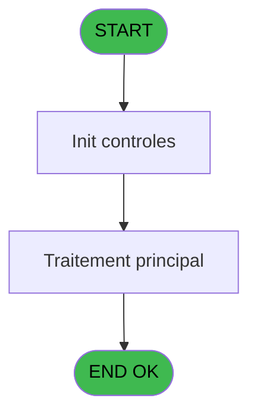
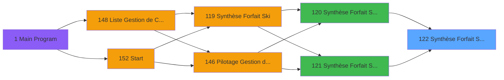

# PBP IDE 122 - Synthèse Forfait Ski Edition

> **Analyse**: Phases 1-4 2026-02-03 15:21 -> 15:21 (14s) | Assemblage 15:21
> **Pipeline**: V7.2 Enrichi
> **Structure**: 4 onglets (Resume | Ecrans | Donnees | Connexions)

<!-- TAB:Resume -->

## 1. FICHE D'IDENTITE

| Attribut | Valeur |
|----------|--------|
| Projet | PBP |
| IDE Position | 122 |
| Nom Programme | Synthèse Forfait Ski Edition |
| Fichier source | `Prg_122.xml` |
| Dossier IDE | Garantie |
| Taches | 3 (1 ecrans visibles) |
| Tables modifiees | 0 |
| Programmes appeles | 0 |

## 2. DESCRIPTION FONCTIONNELLE

**Synthèse Forfait Ski Edition** assure la gestion complete de ce processus, accessible depuis [Synthèse Forfait Ski Batch (IDE 120)](PBP-IDE-120.md), [Synthèse Forfait Ski Résultat (IDE 121)](PBP-IDE-121.md).

Le flux de traitement s'organise en **1 blocs fonctionnels** :

- **Traitement** (3 taches) : traitements metier divers

## 3. BLOCS FONCTIONNELS

### 3.1 Traitement (3 taches)

Traitements internes.

---

#### 122 - Forfait Ski (Excel) [[ECRAN]](#ecran-t1)

**Role** : Traitement : Forfait Ski (Excel).
**Ecran** : 547 x 63 DLU | [Voir mockup](#ecran-t1)

---

#### 122.1 - Genere

**Role** : Traitement : Genere.

---

#### 122.2 - Génération Synthèse

**Role** : Traitement : Génération Synthèse.

## 5. REGLES METIER

*(Aucune regle metier identifiee)*

## 6. CONTEXTE

- **Appele par**: [Synthèse Forfait Ski Batch (IDE 120)](PBP-IDE-120.md), [Synthèse Forfait Ski Résultat (IDE 121)](PBP-IDE-121.md)
- **Appelle**: 0 programmes | **Tables**: 2 (W:0 R:2 L:0) | **Taches**: 3 | **Expressions**: 5

<!-- TAB:Ecrans -->

## 8. ECRANS

### 8.1 Forms visibles (1 / 3)

| # | Position | Tache | Nom | Type | Largeur | Hauteur | Bloc |
|---|----------|-------|-----|------|---------|---------|------|
| 1 | 122 | 122 | Forfait Ski (Excel) | Type0 | 547 | 63 | Traitement |

### 8.2 Mockups Ecrans

---

#### 122 - Forfait Ski (Excel)
**Tache** : [122](#t1) | **Type** : Type0 | **Dimensions** : 547 x 63 DLU
**Bloc** : Traitement | **Titre IDE** : Forfait Ski (Excel)

<!-- FORM-DATA:
{
    "width":  547,
    "vFactor":  8,
    "type":  "Type0",
    "hFactor":  8,
    "controls":  [
                     {
                         "x":  17,
                         "type":  "label",
                         "var":  "",
                         "y":  20,
                         "w":  326,
                         "fmt":  "",
                         "name":  "",
                         "h":  24,
                         "color":  "1",
                         "text":  "",
                         "parent":  null
                     },
                     {
                         "x":  361,
                         "type":  "label",
                         "var":  "",
                         "y":  6,
                         "w":  168,
                         "fmt":  "",
                         "name":  "",
                         "h":  53,
                         "color":  "",
                         "text":  "",
                         "parent":  null
                     },
                     {
                         "x":  59,
                         "type":  "label",
                         "var":  "",
                         "y":  28,
                         "w":  206,
                         "fmt":  "",
                         "name":  "",
                         "h":  10,
                         "color":  "119",
                         "text":  "Edition .......",
                         "parent":  null
                     },
                     {
                         "x":  371,
                         "type":  "image",
                         "var":  "",
                         "y":  13,
                         "w":  149,
                         "fmt":  "",
                         "name":  "",
                         "h":  41,
                         "color":  "",
                         "text":  "",
                         "parent":  17
                     }
                 ],
    "taskId":  "122",
    "height":  63
}
-->

## 9. NAVIGATION

Ecran unique: **Forfait Ski (Excel)**

### 9.3 Structure hierarchique (3 taches)

| Position | Tache | Type | Dimensions | Bloc |
|----------|-------|------|------------|------|
| **122.1** | [**Forfait Ski (Excel)** (122)](#t1) [mockup](#ecran-t1) | - | 547x63 | Traitement |
| 122.1.1 | [Genere (122.1)](#t2) | - | - | |
| 122.1.2 | [Génération Synthèse (122.2)](#t3) | - | - | |

### 9.4 Algorigramme

> **Legende**: Vert = START/END OK | Rouge = END KO | Bleu = Decisions
> *Algorigramme auto-genere. Utiliser `/algorigramme` pour une synthese metier detaillee.*

<!-- TAB:Donnees -->

## 10. TABLES

### Tables utilisees (2)

| ID | Nom | Description | Type | R | W | L | Usages |
|----|-----|-------------|------|---|---|---|--------|
| 889 | effectif_Q_new |  | DB | R |   |   | 1 |
| 897 | Boo_HorairesOuverture | Resultats recherche | DB | R |   |   | 1 |

### Colonnes par table (1 / 2 tables avec colonnes identifiees)

Table 889 - effectif_Q_new (R) - 1 usages

*Table utilisee uniquement en Link ou aucune colonne Real identifiee dans le DataView.*

Table 897 - Boo_HorairesOuverture (R) - 1 usages

| Lettre | Variable | Acces | Type |
|--------|----------|-------|------|
| A | v Total journée | R | Numeric |
| B | v.entete csv | R | Alpha |

## 11. VARIABLES

### 11.1 Parametres entrants (4)

Variables recues du programme appelant ([Synthèse Forfait Ski Batch (IDE 120)](PBP-IDE-120.md)).

| Lettre | Nom | Type | Usage dans |
|--------|-----|------|-----------|
| A | P. Saison en cours | Alpha | - |
| B | P.Date début saison | Date | 1x parametre entrant |
| C | P.Date fin saison | Date | 2x parametre entrant |
| D | P.Nom Fichier Excel | Alpha | [122](#t1) |

### 11.2 Variables de session (1)

Variables persistantes pendant toute la session.

| Lettre | Nom | Type | Usage dans |
|--------|-----|------|-----------|
| E | V.Separateur | Alpha | 1x session |

## 12. EXPRESSIONS

**5 / 5 expressions decodees (100%)**

### 12.1 Repartition par type

| Type | Expressions | Regles |
|------|-------------|--------|
| REFERENCE_VG | 1 | 0 |
| CONCATENATION | 2 | 0 |
| STRING | 1 | 0 |
| FORMAT | 1 | 0 |

### 12.2 Expressions cles par type

#### REFERENCE_VG (1 expressions)

| Type | IDE | Expression | Regle |
|------|-----|------------|-------|
| REFERENCE_VG | 2 | `VG36` | - |

#### CONCATENATION (2 expressions)

| Type | IDE | Expression | Regle |
|------|-----|------------|-------|
| CONCATENATION | 4 | `{1,2}&{1,2}&'Forfaits de ski'&Fill({1,2},18)&'JHP'&{1,2}&{1,2}&'Dépassements'` | - |
| CONCATENATION | 3 | `{1,2}&{1,2}&'0.5 J'&{1,2}&'1 J.'&{1,2}&'2 J.'&{1,2}&'3 J.'&{1,2}&'4 J.'&{1,2}&'5 J.'&{1,2}&'6 J.'&{1,2}&'7 J.'&{1,2}&'8 J.'&{1,2}&'9 J.'&{1,2}&'10 J.'&{1,2}&'11 J.'&{1,2}&'12 J.'&{1,2}&'13 J.'&{1,2}&'14 J.'&{1,2}&'15 J.'&{1,2}&'Total'&{1,2}&{1,2}&'JHP'&{1,2}&{1,2}&'Dépas.'` | - |

#### STRING (1 expressions)

| Type | IDE | Expression | Regle |
|------|-----|------------|-------|
| STRING | 1 | `Trim(P.Date fin saison [C])` | - |

#### FORMAT (1 expressions)

| Type | IDE | Expression | Regle |
|------|-----|------------|-------|
| FORMAT | 5 | `{1,2}&IF(P.Date début saison [B]='F','Forfaits','Journées')&{1,2}&Str(P.Date fin saison [C],'6Z')&{1,2}&Str(P.Nom Fichier Excel [D],'6Z')&{1,2}&Str(V.Separateur [E],'6Z')&{1,2}&Str([F],'6Z')&{1,2}&Str([G],'6Z')&{1,2}&Str([H],'6Z')&{1,2}&Str([I],'6Z')&{1,2}&Str([J],'6Z')&{1,2}&Str([K],'6Z')&{1,2}&Str([L],'6Z')&{1,2}&Str([M],'6Z')&{1,2}&Str([N],'6Z')&{1,2}&Str([O],'6Z')&{1,2}&Str([P],'6Z')&{1,2}&Str([Q],'6Z')&{1,2}&Str([R],'6Z')&{1,2}&Str([S],'6Z')&{1,2}&{1,2}&Str([T],'6Z')&{1,2}&{1,2}&Str([U],'6Z')` | - |

<!-- TAB:Connexions -->

## 13. GRAPHE D'APPELS

### 13.1 Chaine depuis Main (Callers)

Main -> ... -> [Synthèse Forfait Ski Batch (IDE 120)](PBP-IDE-120.md) -> **Synthèse Forfait Ski Edition (IDE 122)**

Main -> ... -> [Synthèse Forfait Ski Résultat (IDE 121)](PBP-IDE-121.md) -> **Synthèse Forfait Ski Edition (IDE 122)**

### 13.2 Callers

| IDE | Nom Programme | Nb Appels |
|-----|---------------|-----------|
| [120](PBP-IDE-120.md) | Synthèse Forfait Ski Batch | 1 |
| [121](PBP-IDE-121.md) | Synthèse Forfait Ski Résultat | 1 |

### 13.3 Callees (programmes appeles)

### 13.4 Detail Callees avec contexte

| IDE | Nom Programme | Appels | Contexte |
|-----|---------------|--------|----------|
| - | (aucun) | - | - |

## 14. RECOMMANDATIONS MIGRATION

### 14.1 Profil du programme

| Metrique | Valeur | Impact migration |
|----------|--------|-----------------|
| Lignes de logique | 86 | Programme compact |
| Expressions | 5 | Peu de logique |
| Tables WRITE | 0 | Impact faible |
| Sous-programmes | 0 | Peu de dependances |
| Ecrans visibles | 1 | Ecran unique ou traitement batch |
| Code desactive | 0% (0 / 86) | Code sain |
| Regles metier | 0 | Pas de regle identifiee |

### 14.2 Plan de migration par bloc

#### Traitement (3 taches: 1 ecran, 2 traitements)

- **Strategie** : Orchestrateur avec 1 ecrans (Razor/React) et 2 traitements backend (services).
- Les ecrans deviennent des composants UI, les traitements invisibles deviennent des services injectables.
- Decomposer les taches en services unitaires testables.

### 14.3 Dependances critiques

| Dependance | Type | Appels | Impact |
|------------|------|--------|--------|

---
*Spec DETAILED generee par Pipeline V7.2 - 2026-02-03 15:21*
