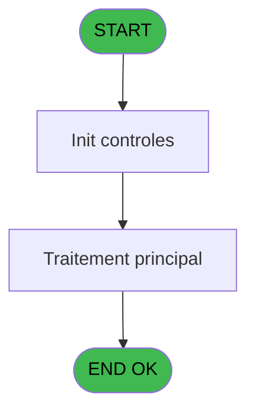
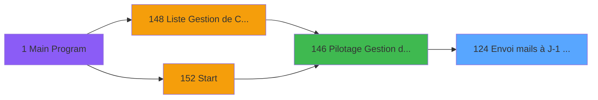
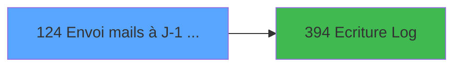

# PBP IDE 124 - Envoi mails à J-1 avant desact

> **Analyse**: Phases 1-4 2026-02-03 15:21 -> 15:22 (13s) | Assemblage 15:22
> **Pipeline**: V7.2 Enrichi
> **Structure**: 4 onglets (Resume | Ecrans | Donnees | Connexions)

<!-- TAB:Resume -->

## 1. FICHE D'IDENTITE

| Attribut | Valeur |
|----------|--------|
| Projet | PBP |
| IDE Position | 124 |
| Nom Programme | Envoi mails à J-1 avant desact |
| Fichier source | `Prg_124.xml` |
| Dossier IDE | Garantie |
| Taches | 3 (1 ecrans visibles) |
| Tables modifiees | 0 |
| Programmes appeles | 1 |

## 2. DESCRIPTION FONCTIONNELLE

**Envoi mails à J-1 avant desact** assure la gestion complete de ce processus, accessible depuis [Pilotage Gestion de Crise (IDE 146)](PBP-IDE-146.md).

Le flux de traitement s'organise en **1 blocs fonctionnels** :

- **Traitement** (3 taches) : traitements metier divers

## 3. BLOCS FONCTIONNELS

### 3.1 Traitement (3 taches)

Traitements internes.

---

#### 124 - Envoi mails à J-1 avant desact [[ECRAN]](#ecran-t3)

**Role** : Traitement : Envoi mails à J-1 avant desact.
**Ecran** : 238 x 60 DLU | [Voir mockup](#ecran-t3)
**Variables liees** : C (v.nb mails)
**Delegue a** : [Ecriture Log (IDE 394)](PBP-IDE-394.md)

---

#### 124.1 - Traitement des Garanties

**Role** : Traitement : Traitement des Garanties.
**Delegue a** : [Ecriture Log (IDE 394)](PBP-IDE-394.md)

---

#### 124.1.1 - Traitement des mails

**Role** : Traitement : Traitement des mails.
**Variables liees** : C (v.nb mails)
**Delegue a** : [Ecriture Log (IDE 394)](PBP-IDE-394.md)

## 5. REGLES METIER

*(Aucune regle metier identifiee)*

## 6. CONTEXTE

- **Appele par**: [Pilotage Gestion de Crise (IDE 146)](PBP-IDE-146.md)
- **Appelle**: 1 programmes | **Tables**: 10 (W:0 R:2 L:8) | **Taches**: 3 | **Expressions**: 8

<!-- TAB:Ecrans -->

## 8. ECRANS

### 8.1 Forms visibles (1 / 3)

| # | Position | Tache | Nom | Type | Largeur | Hauteur | Bloc |
|---|----------|-------|-----|------|---------|---------|------|
| 1 | 124.1 | 124 | Envoi mails à J-1 avant desact | Type0 | 238 | 60 | Traitement |

### 8.2 Mockups Ecrans

---

#### 124.1 - Envoi mails à J-1 avant desact
**Tache** : [124](#t3) | **Type** : Type0 | **Dimensions** : 238 x 60 DLU
**Bloc** : Traitement | **Titre IDE** : Envoi mails à J-1 avant desact

<!-- FORM-DATA:
{
    "width":  238,
    "vFactor":  8,
    "type":  "Type0",
    "hFactor":  4,
    "controls":  [
                     {
                         "x":  4,
                         "type":  "label",
                         "var":  "",
                         "y":  2,
                         "w":  232,
                         "fmt":  "",
                         "name":  "",
                         "h":  29,
                         "color":  "",
                         "text":  "",
                         "parent":  null
                     },
                     {
                         "x":  52,
                         "type":  "label",
                         "var":  "",
                         "y":  12,
                         "w":  164,
                         "fmt":  "",
                         "name":  "",
                         "h":  8,
                         "color":  "7",
                         "text":  "Impression en cours ...",
                         "parent":  null
                     },
                     {
                         "x":  4,
                         "type":  "label",
                         "var":  "",
                         "y":  31,
                         "w":  232,
                         "fmt":  "",
                         "name":  "",
                         "h":  27,
                         "color":  "",
                         "text":  "",
                         "parent":  null
                     },
                     {
                         "x":  25,
                         "type":  "label",
                         "var":  "",
                         "y":  40,
                         "w":  188,
                         "fmt":  "",
                         "name":  "",
                         "h":  8,
                         "color":  "",
                         "text":  "Envoi mails à J-1 avant desactivation",
                         "parent":  null
                     },
                     {
                         "x":  8,
                         "type":  "image",
                         "var":  "",
                         "y":  4,
                         "w":  36,
                         "fmt":  "",
                         "name":  "",
                         "h":  25,
                         "color":  "",
                         "text":  "",
                         "parent":  null
                     }
                 ],
    "taskId":  "124.1",
    "height":  60
}
-->

## 9. NAVIGATION

Ecran unique: **Envoi mails à J-1 avant desact**

### 9.3 Structure hierarchique (3 taches)

| Position | Tache | Type | Dimensions | Bloc |
|----------|-------|------|------------|------|
| **124.1** | [**Envoi mails à J-1 avant desact** (124)](#t3) [mockup](#ecran-t3) | - | 238x60 | Traitement |
| 124.1.1 | [Traitement des Garanties (124.1)](#t5) | - | - | |
| 124.1.2 | [Traitement des mails (124.1.1)](#t13) | - | - | |

### 9.4 Algorigramme

> **Legende**: Vert = START/END OK | Rouge = END KO | Bleu = Decisions
> *Algorigramme auto-genere. Utiliser `/algorigramme` pour une synthese metier detaillee.*

<!-- TAB:Donnees -->

## 10. TABLES

### Tables utilisees (10)

| ID | Nom | Description | Type | R | W | L | Usages |
|----|-----|-------------|------|---|---|---|--------|
| 30 | gm-recherche_____gmr | Index de recherche | DB | R |   |   | 2 |
| 34 | hebergement______heb | Hebergement (chambres) | DB |   |   | L | 1 |
| 39 | depot_garantie___dga | Depots et garanties | DB |   |   | L | 1 |
| 47 | compte_gm________cgm | Comptes GM (generaux) | DB |   |   | L | 1 |
| 69 | initialisation___ini |  | DB | R |   |   | 1 |
| 285 | email |  | DB |   |   | L | 1 |
| 358 | import_mod |  | DB |   |   | L | 1 |
| 372 | pv_budget |  | DB |   |   | L | 1 |
| 845 | stat_vendeur_date |  | TMP |   |   | L | 1 |
| 913 | log_traitement_auto |  | DB |   |   | L | 1 |

### Colonnes par table (5 / 2 tables avec colonnes identifiees)

Table 30 - gm-recherche_____gmr (R) - 2 usages

| Lettre | Variable | Acces | Type |
|--------|----------|-------|------|
| A | L.RetourGarantie | R | Logical |
| B | v.CtrLigne | R | Numeric |
| C | v.nb mails | R | Numeric |

Table 69 - initialisation___ini (R) - 1 usages

| Lettre | Variable | Acces | Type |
|--------|----------|-------|------|
| A | V.Date Lancement | R | Date |
| B | V.Heure Lancement | R | Time |

## 11. VARIABLES

### 11.1 Variables de session (3)

Variables persistantes pendant toute la session.

| Lettre | Nom | Type | Usage dans |
|--------|-----|------|-----------|
| A | V.Date Lancement | Date | - |
| B | V.Heure Lancement | Time | - |
| C | v.nb mails | Numeric | [124](#t3), [124.1.1](#t13) |

## 12. EXPRESSIONS

**8 / 8 expressions decodees (100%)**

### 12.1 Repartition par type

| Type | Expressions | Regles |
|------|-------------|--------|
| CONSTANTE | 2 | 0 |
| DATE | 1 | 0 |
| CONCATENATION | 3 | 0 |
| OTHER | 2 | 0 |

### 12.2 Expressions cles par type

#### CONSTANTE (2 expressions)

| Type | IDE | Expression | Regle |
|------|-----|------------|-------|
| CONSTANTE | 8 | `'GM'` | - |
| CONSTANTE | 7 | `'C'` | - |

#### DATE (1 expressions)

| Type | IDE | Expression | Regle |
|------|-----|------------|-------|
| DATE | 2 | `Date()` | - |

#### CONCATENATION (3 expressions)

| Type | IDE | Expression | Regle |
|------|-----|------------|-------|
| CONCATENATION | 6 | `MlsTrans('ARRIVEES DU')&' '&DStr (Date()-2,'DD MMMMMMMMM YYYYT')` | - |
| CONCATENATION | 5 | `MlsTrans('DESAFFECTATION AUTOMATIQUE DE GARANTIE')&' AU '&DStr (Date(),'DD MMMMMMMMM YYYYT')` | - |
| CONCATENATION | 4 | `MlsTrans ('Edition du')&' '&DStr (Date (),'DD/MM/YYYY')&' '&MlsTrans ('à')&' '&TStr (Time (),'HH:MM:SS')` | - |

#### OTHER (2 expressions)

| Type | IDE | Expression | Regle |
|------|-----|------------|-------|
| OTHER | 3 | `Time()` | - |
| OTHER | 1 | `v.nb mails [C]` | - |

<!-- TAB:Connexions -->

## 13. GRAPHE D'APPELS

### 13.1 Chaine depuis Main (Callers)

Main -> ... -> [Pilotage Gestion de Crise (IDE 146)](PBP-IDE-146.md) -> **Envoi mails à J-1 avant desact (IDE 124)**

### 13.2 Callers

| IDE | Nom Programme | Nb Appels |
|-----|---------------|-----------|
| [146](PBP-IDE-146.md) | Pilotage Gestion de Crise | 1 |

### 13.3 Callees (programmes appeles)

### 13.4 Detail Callees avec contexte

| IDE | Nom Programme | Appels | Contexte |
|-----|---------------|--------|----------|
| [394](PBP-IDE-394.md) | Ecriture Log | 1 | Sous-programme |

## 14. RECOMMANDATIONS MIGRATION

### 14.1 Profil du programme

| Metrique | Valeur | Impact migration |
|----------|--------|-----------------|
| Lignes de logique | 115 | Programme compact |
| Expressions | 8 | Peu de logique |
| Tables WRITE | 0 | Impact faible |
| Sous-programmes | 1 | Peu de dependances |
| Ecrans visibles | 1 | Ecran unique ou traitement batch |
| Code desactive | 0% (0 / 115) | Code sain |
| Regles metier | 0 | Pas de regle identifiee |

### 14.2 Plan de migration par bloc

#### Traitement (3 taches: 1 ecran, 2 traitements)

- **Strategie** : Orchestrateur avec 1 ecrans (Razor/React) et 2 traitements backend (services).
- Les ecrans deviennent des composants UI, les traitements invisibles deviennent des services injectables.
- 1 sous-programme(s) a migrer ou a reutiliser depuis les services existants.
- Decomposer les taches en services unitaires testables.

### 14.3 Dependances critiques

| Dependance | Type | Appels | Impact |
|------------|------|--------|--------|
| [Ecriture Log (IDE 394)](PBP-IDE-394.md) | Sous-programme | 1x | Normale - Sous-programme |

---
*Spec DETAILED generee par Pipeline V7.2 - 2026-02-03 15:22*
