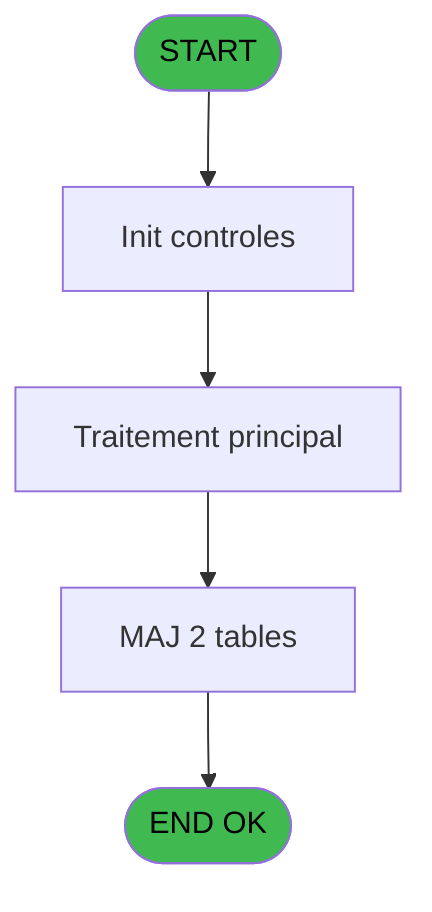
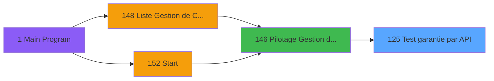
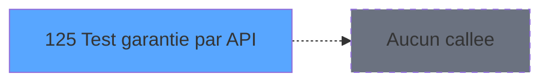

# PBP IDE 125 - Test garantie par API

> **Analyse**: Phases 1-4 2026-02-03 15:22 -> 15:22 (17s) | Assemblage 15:22
> **Pipeline**: V7.2 Enrichi
> **Structure**: 4 onglets (Resume | Ecrans | Donnees | Connexions)

<!-- TAB:Resume -->

## 1. FICHE D'IDENTITE

| Attribut | Valeur |
|----------|--------|
| Projet | PBP |
| IDE Position | 125 |
| Nom Programme | Test garantie par API |
| Fichier source | `Prg_125.xml` |
| Dossier IDE | Garantie |
| Taches | 4 (0 ecrans visibles) |
| Tables modifiees | 2 |
| Programmes appeles | 0 |

## 2. DESCRIPTION FONCTIONNELLE

**Test garantie par API** assure la gestion complete de ce processus, accessible depuis [Pilotage Gestion de Crise (IDE 146)](PBP-IDE-146.md).

Le flux de traitement s'organise en **1 blocs fonctionnels** :

- **Traitement** (4 taches) : traitements metier divers

**Donnees modifiees** : 2 tables en ecriture (depot_garantie___dga, fiche_police).

Detail : phases du traitement

#### Phase 1 : Traitement (4 taches)

- **125** - Test garantie par API **[[ECRAN]](#ecran-t1)**
- **125.1** - Recup montant à bloquer
- **125.2** - Mise à jour log
- **125.3** - Mise à jour garantie

#### Tables impactees

| Table | Operations | Role metier |
|-------|-----------|-------------|
| depot_garantie___dga | **W** (1 usages) | Depots et garanties |
| fiche_police | **W** (1 usages) | Donnees police/session |

## 3. BLOCS FONCTIONNELS

### 3.1 Traitement (4 taches)

Traitements internes.

---

#### 125 - Test garantie par API [[ECRAN]](#ecran-t1)

**Role** : Verification : Test garantie par API.
**Ecran** : 598 x 195 DLU | [Voir mockup](#ecran-t1)

3 sous-taches directes

| Tache | Nom | Bloc |
|-------|-----|------|
| [125.1](#t2) | Recup montant à bloquer | Traitement |
| [125.2](#t4) | Mise à jour log | Traitement |
| [125.3](#t5) | Mise à jour garantie | Traitement |

**Variables liees** : L (v.Garantie Existe)

---

#### 125.1 - Recup montant à bloquer

**Role** : Consultation/chargement : Recup montant à bloquer.
**Variables liees** : H (v.montant à bloquer), G (montant)

---

#### 125.2 - Mise à jour log

**Role** : Traitement : Mise à jour log.

---

#### 125.3 - Mise à jour garantie

**Role** : Traitement : Mise à jour garantie.
**Variables liees** : L (v.Garantie Existe)

## 5. REGLES METIER

*(Aucune regle metier identifiee)*

## 6. CONTEXTE

- **Appele par**: [Pilotage Gestion de Crise (IDE 146)](PBP-IDE-146.md)
- **Appelle**: 0 programmes | **Tables**: 3 (W:2 R:1 L:0) | **Taches**: 4 | **Expressions**: 13

<!-- TAB:Ecrans -->

## 8. ECRANS

*(Programme sans ecran visible)*

## 9. NAVIGATION

### 9.3 Structure hierarchique (4 taches)

| Position | Tache | Type | Dimensions | Bloc |
|----------|-------|------|------------|------|
| **125.1** | [**Test garantie par API** (125)](#t1) [mockup](#ecran-t1) | - | 598x195 | Traitement |
| 125.1.1 | [Recup montant à bloquer (125.1)](#t2) | - | - | |
| 125.1.2 | [Mise à jour log (125.2)](#t4) | - | - | |
| 125.1.3 | [Mise à jour garantie (125.3)](#t5) | - | - | |

### 9.4 Algorigramme

> **Legende**: Vert = START/END OK | Rouge = END KO | Bleu = Decisions
> *Algorigramme auto-genere. Utiliser `/algorigramme` pour une synthese metier detaillee.*

<!-- TAB:Donnees -->

## 10. TABLES

### Tables utilisees (3)

| ID | Nom | Description | Type | R | W | L | Usages |
|----|-----|-------------|------|---|---|---|--------|
| 39 | depot_garantie___dga | Depots et garanties | DB |   | **W** |   | 1 |
| 91 | garantie_________gar | Depots et garanties | DB | R |   |   | 1 |
| 936 | fiche_police | Donnees police/session | DB |   | **W** |   | 1 |

### Colonnes par table (2 / 3 tables avec colonnes identifiees)

Table 39 - depot_garantie___dga (**W**) - 1 usages

| Lettre | Variable | Acces | Type |
|--------|----------|-------|------|
| L | v.Garantie Existe | W | Logical |

Table 91 - garantie_________gar (R) - 1 usages

| Lettre | Variable | Acces | Type |
|--------|----------|-------|------|
| L | v.Garantie Existe | R | Logical |

Table 936 - fiche_police (**W**) - 1 usages

*Table utilisee uniquement en Link ou aucune colonne Real identifiee dans le DataView.*

## 11. VARIABLES

### 11.1 Variables de session (7)

Variables persistantes pendant toute la session.

| Lettre | Nom | Type | Usage dans |
|--------|-----|------|-----------|
| H | v.montant à bloquer | Numeric | - |
| I | v.API Access Token | Unicode | - |
| J | v.Token Expiration Time | Time | 1x session |
| K | v.Blocage Fonds Ok | Logical | - |
| L | v.Garantie Existe | Logical | - |
| M | v.Error Message | Unicode | 1x session |
| N | v.heure traitement | Time | 3x session |

### 11.2 Autres (7)

Variables diverses.

| Lettre | Nom | Type | Usage dans |
|--------|-----|------|-----------|
| A | compte | Numeric | - |
| B | filiation | Numeric | - |
| C | nom | Unicode | - |
| D | prenom | Unicode | - |
| E | alias | Unicode | 1x refs |
| F | type carte | Unicode | - |
| G | montant | Numeric | - |

## 12. EXPRESSIONS

**13 / 13 expressions decodees (100%)**

### 12.1 Repartition par type

| Type | Expressions | Regles |
|------|-------------|--------|
| CONSTANTE | 2 | 0 |
| FORMAT | 1 | 0 |
| DATE | 1 | 0 |
| OTHER | 5 | 0 |
| CONDITION | 2 | 0 |
| CAST_LOGIQUE | 1 | 0 |
| STRING | 1 | 0 |

### 12.2 Expressions cles par type

#### CONSTANTE (2 expressions)

| Type | IDE | Expression | Regle |
|------|-----|------------|-------|
| CONSTANTE | 9 | `'C'` | - |
| CONSTANTE | 3 | `'BLO'` | - |

#### FORMAT (1 expressions)

| Type | IDE | Expression | Regle |
|------|-----|------------|-------|
| FORMAT | 1 | `DStr(Date()-1,'YYYYMMDD')` | - |

#### DATE (1 expressions)

| Type | IDE | Expression | Regle |
|------|-----|------------|-------|
| DATE | 12 | `Date()` | - |

#### OTHER (5 expressions)

| Type | IDE | Expression | Regle |
|------|-----|------------|-------|
| OTHER | 8 | `v.Token Expiration Time [J]` | - |
| OTHER | 10 | `NOT(v.heure traitement [N])` | - |
| OTHER | 7 | `v.heure traitement [N] AND NOT(VG111)` | - |
| OTHER | 2 | `Time()` | - |
| OTHER | 6 | `v.heure traitement [N]` | - |

#### CONDITION (2 expressions)

| Type | IDE | Expression | Regle |
|------|-----|------------|-------|
| CONDITION | 4 | `Trim(alias [E])<>''` | - |
| CONDITION | 5 | `[P]=0` | - |

#### CAST_LOGIQUE (1 expressions)

| Type | IDE | Expression | Regle |
|------|-----|------------|-------|
| CAST_LOGIQUE | 11 | `'TRUE'LOG` | - |

#### STRING (1 expressions)

| Type | IDE | Expression | Regle |
|------|-----|------------|-------|
| STRING | 13 | `Trim(v.Error Message [M])` | - |

<!-- TAB:Connexions -->

## 13. GRAPHE D'APPELS

### 13.1 Chaine depuis Main (Callers)

Main -> ... -> [Pilotage Gestion de Crise (IDE 146)](PBP-IDE-146.md) -> **Test garantie par API (IDE 125)**

### 13.2 Callers

| IDE | Nom Programme | Nb Appels |
|-----|---------------|-----------|
| [146](PBP-IDE-146.md) | Pilotage Gestion de Crise | 1 |

### 13.3 Callees (programmes appeles)

### 13.4 Detail Callees avec contexte

| IDE | Nom Programme | Appels | Contexte |
|-----|---------------|--------|----------|
| - | (aucun) | - | - |

## 14. RECOMMANDATIONS MIGRATION

### 14.1 Profil du programme

| Metrique | Valeur | Impact migration |
|----------|--------|-----------------|
| Lignes de logique | 66 | Programme compact |
| Expressions | 13 | Peu de logique |
| Tables WRITE | 2 | Impact faible |
| Sous-programmes | 0 | Peu de dependances |
| Ecrans visibles | 0 | Ecran unique ou traitement batch |
| Code desactive | 0% (0 / 66) | Code sain |
| Regles metier | 0 | Pas de regle identifiee |

### 14.2 Plan de migration par bloc

#### Traitement (4 taches: 1 ecran, 3 traitements)

- **Strategie** : Orchestrateur avec 1 ecrans (Razor/React) et 3 traitements backend (services).
- Les ecrans deviennent des composants UI, les traitements invisibles deviennent des services injectables.
- Decomposer les taches en services unitaires testables.

### 14.3 Dependances critiques

| Dependance | Type | Appels | Impact |
|------------|------|--------|--------|
| depot_garantie___dga | Table WRITE (Database) | 1x | Schema + repository |
| fiche_police | Table WRITE (Database) | 1x | Schema + repository |

---
*Spec DETAILED generee par Pipeline V7.2 - 2026-02-03 15:22*
