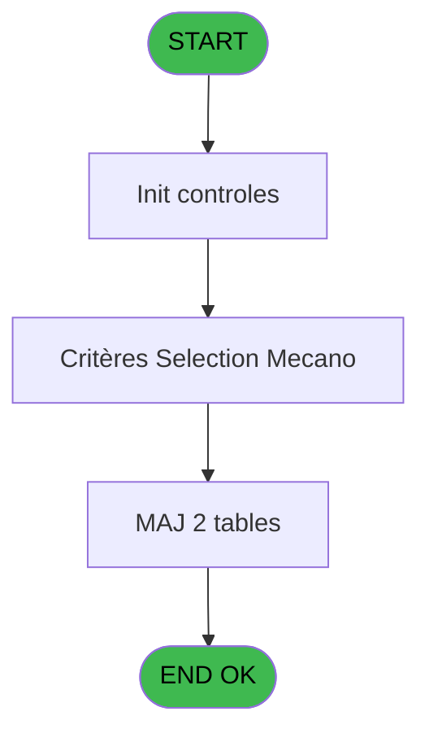
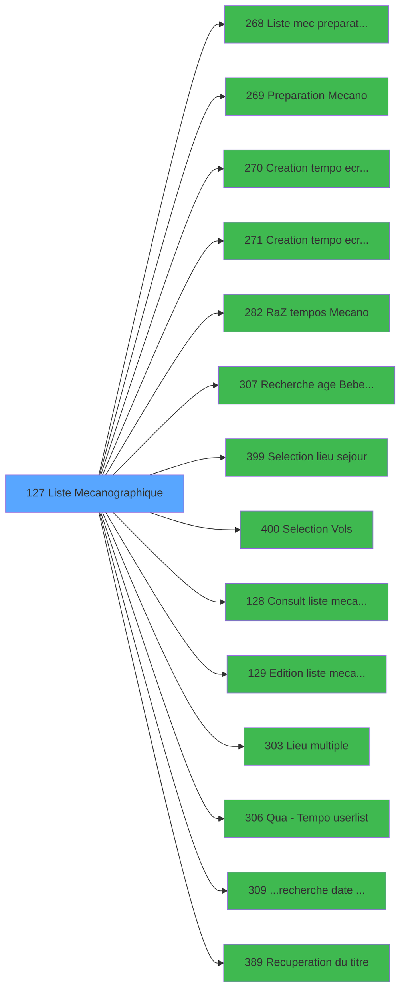

# PBP IDE 127 - Liste Mecanographique

> **Analyse**: Phases 1-4 2026-02-03 15:23 -> 15:23 (14s) | Assemblage 15:23
> **Pipeline**: V7.2 Enrichi
> **Structure**: 4 onglets (Resume | Ecrans | Donnees | Connexions)

<!-- TAB:Resume -->

## 1. FICHE D'IDENTITE

| Attribut | Valeur |
|----------|--------|
| Projet | PBP |
| IDE Position | 127 |
| Nom Programme | Liste Mecanographique |
| Fichier source | `Prg_127.xml` |
| Dossier IDE | Gestion |
| Taches | 11 (3 ecrans visibles) |
| Tables modifiees | 2 |
| Programmes appeles | 14 |
| :warning: Statut | **ORPHELIN_POTENTIEL** |

## 2. DESCRIPTION FONCTIONNELLE

**Liste Mecanographique** assure la gestion complete de ce processus.

Le flux de traitement s'organise en **3 blocs fonctionnels** :

- **Traitement** (7 taches) : traitements metier divers
- **Consultation** (3 taches) : ecrans de recherche, selection et consultation
- **Initialisation** (1 tache) : reinitialisation d'etats et de variables de travail

**Donnees modifiees** : 2 tables en ecriture (tempo_liste_service, tempo_zone_secteur).

Detail : phases du traitement

#### Phase 1 : Traitement (7 taches)

- **127** - Liste Mecanographique **[[ECRAN]](#ecran-t1)**
- **127.1** - Liste Mecanographique **[[ECRAN]](#ecran-t2)**
- **127.1.1** - Charge Combo
- **127.1.1.1** - Test minus
- **127.1.2** - Sel Code Logements **[[ECRAN]](#ecran-t5)**
- **127.1.4.2** - Check Nb Fid
- **127.1.6** - hggfhf

Delegue a : [Liste mec preparation planning (IDE 268)](PBP-IDE-268.md), [Preparation Mecano (IDE 269)](PBP-IDE-269.md), [  Consult liste mecano ecran (IDE 128)](PBP-IDE-128.md), [Lieu multiple (IDE 303)](PBP-IDE-303.md), [Qua -> Tempo userlist (IDE 306)](PBP-IDE-306.md), [Recuperation du titre (IDE 389)](PBP-IDE-389.md)

#### Phase 2 : Initialisation (1 tache)

- **127.1.3** - Init Temp

Delegue a : [RaZ tempos Mecano (IDE 282)](PBP-IDE-282.md)

#### Phase 3 : Consultation (3 taches)

- **127.1.4** - Zoom Fidelisation **[[ECRAN]](#ecran-t13)**
- **127.1.4.1** - Select/Deselect All
- **127.1.5** - Select/Deselect All

Delegue a : [Recherche age Bebe_Enfant (IDE 307)](PBP-IDE-307.md), [Selection lieu sejour (IDE 399)](PBP-IDE-399.md), [Selection Vols (IDE 400)](PBP-IDE-400.md), [...recherche date minimum (IDE 309)](PBP-IDE-309.md), [Recuperation du titre (IDE 389)](PBP-IDE-389.md)

#### Tables impactees

| Table | Operations | Role metier |
|-------|-----------|-------------|
| tempo_liste_service | **W**/L (5 usages) | Table temporaire ecran |
| tempo_zone_secteur | **W**/L (2 usages) | Table temporaire ecran |

## 3. BLOCS FONCTIONNELS

### 3.1 Traitement (7 taches)

Traitements internes.

---

#### 127 - Liste Mecanographique [[ECRAN]](#ecran-t1)

**Role** : Tache d'orchestration : point d'entree du programme (7 sous-taches). Coordonne l'enchainement des traitements.
**Ecran** : 72 x 40 DLU (MDI) | [Voir mockup](#ecran-t1)

6 sous-taches directes

| Tache | Nom | Bloc |
|-------|-----|------|
| [127.1](#t2) | Liste Mecanographique **[[ECRAN]](#ecran-t2)** | Traitement |
| [127.1.1](#t3) | Charge Combo | Traitement |
| [127.1.1.1](#t4) | Test minus | Traitement |
| [127.1.2](#t5) | Sel Code Logements **[[ECRAN]](#ecran-t5)** | Traitement |
| [127.1.4.2](#t15) | Check Nb Fid | Traitement |
| [127.1.6](#t19) | hggfhf | Traitement |

**Variables liees** : C (w0_Type Liste)
**Delegue a** : [Liste mec preparation planning (IDE 268)](PBP-IDE-268.md), [Preparation Mecano (IDE 269)](PBP-IDE-269.md), [  Consult liste mecano ecran (IDE 128)](PBP-IDE-128.md)

---

#### 127.1 - Liste Mecanographique [[ECRAN]](#ecran-t2)

**Role** : Traitement : Liste Mecanographique.
**Ecran** : 1422 x 239 DLU (MDI) | [Voir mockup](#ecran-t2)
**Variables liees** : C (w0_Type Liste)
**Delegue a** : [Liste mec preparation planning (IDE 268)](PBP-IDE-268.md), [Preparation Mecano (IDE 269)](PBP-IDE-269.md), [  Consult liste mecano ecran (IDE 128)](PBP-IDE-128.md)

---

#### 127.1.1 - Charge Combo

**Role** : Traitement : Charge Combo.
**Variables liees** : M (w0_combo seminaire), BB (w0_Contenu Combo Seminaire)
**Delegue a** : [Liste mec preparation planning (IDE 268)](PBP-IDE-268.md), [Preparation Mecano (IDE 269)](PBP-IDE-269.md), [  Consult liste mecano ecran (IDE 128)](PBP-IDE-128.md)

---

#### 127.1.1.1 - Test minus

**Role** : Verification : Test minus.
**Delegue a** : [Liste mec preparation planning (IDE 268)](PBP-IDE-268.md), [Preparation Mecano (IDE 269)](PBP-IDE-269.md), [  Consult liste mecano ecran (IDE 128)](PBP-IDE-128.md)

---

#### 127.1.2 - Sel Code Logements [[ECRAN]](#ecran-t5)

**Role** : Traitement : Sel Code Logements.
**Ecran** : 418 x 173 DLU (Modal) | [Voir mockup](#ecran-t5)
**Variables liees** : J (w0_CodeVol)
**Delegue a** : [Liste mec preparation planning (IDE 268)](PBP-IDE-268.md), [Preparation Mecano (IDE 269)](PBP-IDE-269.md), [  Consult liste mecano ecran (IDE 128)](PBP-IDE-128.md)

---

#### 127.1.4.2 - Check Nb Fid

**Role** : Traitement : Check Nb Fid.
**Delegue a** : [Liste mec preparation planning (IDE 268)](PBP-IDE-268.md), [Preparation Mecano (IDE 269)](PBP-IDE-269.md), [  Consult liste mecano ecran (IDE 128)](PBP-IDE-128.md)

---

#### 127.1.6 - hggfhf

**Role** : Traitement : hggfhf.
**Delegue a** : [Liste mec preparation planning (IDE 268)](PBP-IDE-268.md), [Preparation Mecano (IDE 269)](PBP-IDE-269.md), [  Consult liste mecano ecran (IDE 128)](PBP-IDE-128.md)

### 3.2 Initialisation (1 tache)

Reinitialisation d'etats et variables de travail.

---

#### 127.1.3 - Init Temp

**Role** : Reinitialisation : Init Temp.
**Delegue a** : [RaZ tempos Mecano (IDE 282)](PBP-IDE-282.md)

### 3.3 Consultation (3 taches)

Ecrans de recherche et consultation.

---

#### 127.1.4 - Zoom Fidelisation [[ECRAN]](#ecran-t13)

**Role** : Selection par l'operateur : Zoom Fidelisation.
**Ecran** : 408 x 247 DLU (MDI) | [Voir mockup](#ecran-t13)
**Variables liees** : E (Bouton Zoom Date), L (bouton zoom categorie), T (w0_Fidelisation), U (bouton fidelisation)
**Delegue a** : [Recherche age Bebe_Enfant (IDE 307)](PBP-IDE-307.md), [Selection lieu sejour (IDE 399)](PBP-IDE-399.md), [Selection Vols (IDE 400)](PBP-IDE-400.md)

---

#### 127.1.4.1 - Select/Deselect All

**Role** : Traitement : Select/Deselect All.
**Delegue a** : [Recherche age Bebe_Enfant (IDE 307)](PBP-IDE-307.md), [Selection lieu sejour (IDE 399)](PBP-IDE-399.md), [Selection Vols (IDE 400)](PBP-IDE-400.md)

---

#### 127.1.5 - Select/Deselect All

**Role** : Traitement : Select/Deselect All.
**Delegue a** : [Recherche age Bebe_Enfant (IDE 307)](PBP-IDE-307.md), [Selection lieu sejour (IDE 399)](PBP-IDE-399.md), [Selection Vols (IDE 400)](PBP-IDE-400.md)

## 5. REGLES METIER

*(Aucune regle metier identifiee)*

## 6. CONTEXTE

- **Appele par**: (aucun)
- **Appelle**: 14 programmes | **Tables**: 8 (W:2 R:3 L:5) | **Taches**: 11 | **Expressions**: 1

<!-- TAB:Ecrans -->

## 8. ECRANS

### 8.1 Forms visibles (3 / 11)

| # | Position | Tache | Nom | Type | Largeur | Hauteur | Bloc |
|---|----------|-------|-----|------|---------|---------|------|
| 1 | 127.1 | 127.1 | Liste Mecanographique | MDI | 1422 | 239 | Traitement |
| 2 | 127.1.5 | 127.1.2 | Sel Code Logements | Modal | 418 | 173 | Traitement |
| 3 | 127.1.2 | 127.1.4 | Zoom Fidelisation | MDI | 408 | 247 | Consultation |

### 8.2 Mockups Ecrans

---

#### 127.1 - Liste Mecanographique
**Tache** : [127.1](#t2) | **Type** : MDI | **Dimensions** : 1422 x 239 DLU
**Bloc** : Traitement | **Titre IDE** : Liste Mecanographique

<!-- FORM-DATA:
{
    "width":  1422,
    "vFactor":  8,
    "type":  "MDI",
    "hFactor":  8,
    "controls":  [
                     {
                         "x":  1,
                         "type":  "label",
                         "var":  "",
                         "y":  0,
                         "w":  1418,
                         "fmt":  "",
                         "name":  "",
                         "h":  20,
                         "color":  "1",
                         "text":  "",
                         "parent":  null
                     },
                     {
                         "x":  0,
                         "type":  "label",
                         "var":  "",
                         "y":  213,
                         "w":  1418,
                         "fmt":  "",
                         "name":  "",
                         "h":  24,
                         "color":  "1",
                         "text":  "",
                         "parent":  null
                     },
                     {
                         "x":  373,
                         "type":  "label",
                         "var":  "",
                         "y":  23,
                         "w":  417,
                         "fmt":  "",
                         "name":  "",
                         "h":  187,
                         "color":  "195",
                         "text":  "Paramètres",
                         "parent":  null
                     },
                     {
                         "x":  383,
                         "type":  "label",
                         "var":  "",
                         "y":  86,
                         "w":  45,
                         "fmt":  "",
                         "name":  "",
                         "h":  12,
                         "color":  "",
                         "text":  "Type",
                         "parent":  6
                     },
                     {
                         "x":  383,
                         "type":  "label",
                         "var":  "",
                         "y":  101,
                         "w":  45,
                         "fmt":  "",
                         "name":  "",
                         "h":  9,
                         "color":  "",
                         "text":  "Date",
                         "parent":  6
                     },
                     {
                         "x":  383,
                         "type":  "label",
                         "var":  "",
                         "y":  116,
                         "w":  80,
                         "fmt":  "",
                         "name":  "",
                         "h":  10,
                         "color":  "",
                         "text":  "Catégorie",
                         "parent":  6
                     },
                     {
                         "x":  383,
                         "type":  "label",
                         "var":  "",
                         "y":  132,
                         "w":  80,
                         "fmt":  "",
                         "name":  "",
                         "h":  10,
                         "color":  "",
                         "text":  "Séminaire",
                         "parent":  6
                     },
                     {
                         "x":  383,
                         "type":  "label",
                         "var":  "",
                         "y":  147,
                         "w":  100,
                         "fmt":  "",
                         "name":  "",
                         "h":  10,
                         "color":  "",
                         "text":  "Lieu séjour",
                         "parent":  6
                     },
                     {
                         "x":  383,
                         "type":  "label",
                         "var":  "",
                         "y":  162,
                         "w":  100,
                         "fmt":  "",
                         "name":  "",
                         "h":  12,
                         "color":  "",
                         "text":  "Tri",
                         "parent":  6
                     },
                     {
                         "x":  383,
                         "type":  "label",
                         "var":  "",
                         "y":  178,
                         "w":  108,
                         "fmt":  "",
                         "name":  "",
                         "h":  12,
                         "color":  "",
                         "text":  "Commentaires",
                         "parent":  6
                     },
                     {
                         "x":  473,
                         "type":  "label",
                         "var":  "",
                         "y":  35,
                         "w":  224,
                         "fmt":  "",
                         "name":  "",
                         "h":  45,
                         "color":  "",
                         "text":  "",
                         "parent":  6
                     },
                     {
                         "x":  501,
                         "type":  "label",
                         "var":  "",
                         "y":  43,
                         "w":  46,
                         "fmt":  "",
                         "name":  "",
                         "h":  9,
                         "color":  "",
                         "text":  "Total",
                         "parent":  18
                     },
                     {
                         "x":  501,
                         "type":  "label",
                         "var":  "",
                         "y":  60,
                         "w":  78,
                         "fmt":  "",
                         "name":  "",
                         "h":  9,
                         "color":  "",
                         "text":  "Sélection",
                         "parent":  18
                     },
                     {
                         "x":  3,
                         "type":  "table",
                         "var":  "",
                         "name":  "",
                         "titleH":  12,
                         "color":  "110",
                         "w":  362,
                         "y":  27,
                         "fmt":  "",
                         "parent":  null,
                         "text":  "",
                         "rowH":  13,
                         "h":  182,
                         "cols":  [
                                      {
                                          "title":  "",
                                          "layer":  1,
                                          "w":  324
                                      }
                                  ],
                         "rows":  1
                     },
                     {
                         "x":  1228,
                         "type":  "label",
                         "var":  "",
                         "y":  20,
                         "w":  191,
                         "fmt":  "",
                         "name":  "",
                         "h":  190,
                         "color":  "",
                         "text":  "",
                         "parent":  null
                     },
                     {
                         "x":  383,
                         "type":  "label",
                         "var":  "",
                         "y":  195,
                         "w":  108,
                         "fmt":  "",
                         "name":  "",
                         "h":  10,
                         "color":  "",
                         "text":  "Fidélisation",
                         "parent":  6
                     },
                     {
                         "x":  492,
                         "type":  "combobox",
                         "var":  "",
                         "y":  86,
                         "w":  279,
                         "fmt":  "",
                         "name":  "w0_Type Liste",
                         "h":  12,
                         "color":  "110",
                         "text":  "",
                         "parent":  6
                     },
                     {
                         "x":  492,
                         "type":  "edit",
                         "var":  "",
                         "y":  101,
                         "w":  126,
                         "fmt":  "",
                         "name":  "w0_Date",
                         "h":  10,
                         "color":  "110",
                         "text":  "",
                         "parent":  6
                     },
                     {
                         "x":  617,
                         "type":  "button",
                         "var":  "",
                         "y":  101,
                         "w":  25,
                         "fmt":  "...",
                         "name":  "Bouton Zoom Date",
                         "h":  10,
                         "color":  "",
                         "text":  "",
                         "parent":  6
                     },
                     {
                         "x":  492,
                         "type":  "edit",
                         "var":  "",
                         "y":  116,
                         "w":  126,
                         "fmt":  "30",
                         "name":  "w0_CodeVol",
                         "h":  10,
                         "color":  "110",
                         "text":  "",
                         "parent":  6
                     },
                     {
                         "x":  617,
                         "type":  "button",
                         "var":  "",
                         "y":  116,
                         "w":  25,
                         "fmt":  "...",
                         "name":  "bouton zoom categorie",
                         "h":  10,
                         "color":  "",
                         "text":  "",
                         "parent":  6
                     },
                     {
                         "x":  492,
                         "type":  "edit",
                         "var":  "",
                         "y":  147,
                         "w":  26,
                         "fmt":  "",
                         "name":  "w0_Sejour",
                         "h":  10,
                         "color":  "110",
                         "text":  "",
                         "parent":  6
                     },
                     {
                         "x":  518,
                         "type":  "button",
                         "var":  "",
                         "y":  147,
                         "w":  25,
                         "fmt":  "...",
                         "name":  "bouton lieu sejour",
                         "h":  10,
                         "color":  "",
                         "text":  "",
                         "parent":  6
                     },
                     {
                         "x":  492,
                         "type":  "combobox",
                         "var":  "",
                         "y":  162,
                         "w":  279,
                         "fmt":  "",
                         "name":  "w0_ordre tri",
                         "h":  12,
                         "color":  "110",
                         "text":  "1,2,3,4",
                         "parent":  6
                     },
                     {
                         "x":  492,
                         "type":  "combobox",
                         "var":  "",
                         "y":  178,
                         "w":  279,
                         "fmt":  "",
                         "name":  "w0_type commentaire_0001",
                         "h":  12,
                         "color":  "110",
                         "text":  "",
                         "parent":  6
                     },
                     {
                         "x":  1248,
                         "type":  "button",
                         "var":  "",
                         "y":  109,
                         "w":  154,
                         "fmt":  "\u0026Ecran",
                         "name":  "b_Ecran",
                         "h":  18,
                         "color":  "",
                         "text":  "",
                         "parent":  35
                     },
                     {
                         "x":  1248,
                         "type":  "button",
                         "var":  "",
                         "y":  135,
                         "w":  154,
                         "fmt":  "\u0026Impression",
                         "name":  "b_Edition",
                         "h":  18,
                         "color":  "",
                         "text":  "",
                         "parent":  35
                     },
                     {
                         "x":  549,
                         "type":  "edit",
                         "var":  "",
                         "y":  148,
                         "w":  232,
                         "fmt":  "",
                         "name":  "",
                         "h":  8,
                         "color":  "142",
                         "text":  "",
                         "parent":  6
                     },
                     {
                         "x":  10,
                         "type":  "checkbox",
                         "var":  "",
                         "y":  30,
                         "w":  30,
                         "fmt":  "",
                         "name":  "TUL MARQUEUR",
                         "h":  9,
                         "color":  "110",
                         "text":  "",
                         "parent":  31
                     },
                     {
                         "x":  45,
                         "type":  "edit",
                         "var":  "",
                         "y":  30,
                         "w":  277,
                         "fmt":  "",
                         "name":  "",
                         "h":  9,
                         "color":  "110",
                         "text":  "",
                         "parent":  31
                     },
                     {
                         "x":  588,
                         "type":  "edit",
                         "var":  "",
                         "y":  43,
                         "w":  56,
                         "fmt":  "",
                         "name":  "",
                         "h":  9,
                         "color":  "",
                         "text":  "",
                         "parent":  18
                     },
                     {
                         "x":  588,
                         "type":  "edit",
                         "var":  "",
                         "y":  60,
                         "w":  56,
                         "fmt":  "",
                         "name":  "",
                         "h":  9,
                         "color":  "",
                         "text":  "",
                         "parent":  18
                     },
                     {
                         "x":  6,
                         "type":  "edit",
                         "var":  "",
                         "y":  2,
                         "w":  267,
                         "fmt":  "20",
                         "name":  "",
                         "h":  8,
                         "color":  "",
                         "text":  "",
                         "parent":  1
                     },
                     {
                         "x":  1120,
                         "type":  "edit",
                         "var":  "",
                         "y":  6,
                         "w":  291,
                         "fmt":  "WWW DD MMM YYYYT",
                         "name":  "",
                         "h":  8,
                         "color":  "",
                         "text":  "",
                         "parent":  1
                     },
                     {
                         "x":  6,
                         "type":  "edit",
                         "var":  "",
                         "y":  11,
                         "w":  331,
                         "fmt":  "25",
                         "name":  "",
                         "h":  8,
                         "color":  "",
                         "text":  "",
                         "parent":  1
                     },
                     {
                         "x":  1238,
                         "type":  "image",
                         "var":  "",
                         "y":  37,
                         "w":  170,
                         "fmt":  "",
                         "name":  "",
                         "h":  59,
                         "color":  "",
                         "text":  "",
                         "parent":  35
                     },
                     {
                         "x":  14,
                         "type":  "button",
                         "var":  "",
                         "y":  216,
                         "w":  154,
                         "fmt":  "\u0026Quitter",
                         "name":  "Quitter",
                         "h":  18,
                         "color":  "",
                         "text":  "",
                         "parent":  5
                     },
                     {
                         "x":  795,
                         "type":  "subform",
                         "var":  "",
                         "y":  23,
                         "w":  432,
                         "fmt":  "",
                         "name":  "Sel Code Logements",
                         "h":  187,
                         "color":  "",
                         "text":  "",
                         "parent":  null
                     },
                     {
                         "x":  492,
                         "type":  "combobox",
                         "var":  "",
                         "y":  131,
                         "w":  279,
                         "fmt":  "",
                         "name":  "w0_combo seminaire",
                         "h":  12,
                         "color":  "",
                         "text":  "",
                         "parent":  6
                     },
                     {
                         "x":  746,
                         "type":  "button",
                         "var":  "",
                         "y":  195,
                         "w":  25,
                         "fmt":  "...",
                         "name":  "bouton fidelisation",
                         "h":  10,
                         "color":  "",
                         "text":  "",
                         "parent":  6
                     },
                     {
                         "x":  492,
                         "type":  "combobox",
                         "var":  "",
                         "y":  194,
                         "w":  249,
                         "fmt":  "",
                         "name":  "w0_Fidelisation",
                         "h":  10,
                         "color":  "",
                         "text":  "Toutes , Choix",
                         "parent":  6
                     }
                 ],
    "taskId":  "127.1",
    "height":  239
}
-->

<strong>Champs : 16 champs</strong>

| Pos (x,y) | Nom | Variable | Type |
|-----------|-----|----------|------|
| 492,86 | w0_Type Liste | - | combobox |
| 492,101 | w0_Date | - | edit |
| 492,116 | w0_CodeVol | - | edit |
| 492,147 | w0_Sejour | - | edit |
| 492,162 | w0_ordre tri | - | combobox |
| 492,178 | w0_type commentaire_0001 | - | combobox |
| 549,148 | (sans nom) | - | edit |
| 10,30 | TUL MARQUEUR | - | checkbox |
| 45,30 | (sans nom) | - | edit |
| 588,43 | (sans nom) | - | edit |
| 588,60 | (sans nom) | - | edit |
| 6,2 | 20 | - | edit |
| 1120,6 | WWW DD MMM YYYYT | - | edit |
| 6,11 | 25 | - | edit |
| 492,131 | w0_combo seminaire | - | combobox |
| 492,194 | w0_Fidelisation | - | combobox |

<strong>Boutons : 7 boutons</strong>

| Bouton | Pos (x,y) | Action |
|--------|-----------|--------|
| ... | 617,101 | Appel [...recherche date minimum (IDE 309)](PBP-IDE-309.md) |
| ... | 617,116 | Appel [...recherche date minimum (IDE 309)](PBP-IDE-309.md) |
| ... | 518,147 | Appel [...recherche date minimum (IDE 309)](PBP-IDE-309.md) |
| Ecran | 1248,109 | Appel [Creation tempo ecran par nom (IDE 270)](PBP-IDE-270.md) |
| Impression | 1248,135 | Bouton fonctionnel |
| Quitter | 14,216 | Quitte le programme |
| ... | 746,195 | Appel [...recherche date minimum (IDE 309)](PBP-IDE-309.md) |

---

#### 127.1.5 - Sel Code Logements
**Tache** : [127.1.2](#t5) | **Type** : Modal | **Dimensions** : 418 x 173 DLU
**Bloc** : Traitement | **Titre IDE** : Sel Code Logements

<!-- FORM-DATA:
{
    "width":  418,
    "vFactor":  8,
    "type":  "Modal",
    "hFactor":  8,
    "controls":  [
                     {
                         "x":  33,
                         "type":  "table",
                         "var":  "",
                         "name":  "",
                         "titleH":  12,
                         "color":  "110",
                         "w":  358,
                         "y":  2,
                         "fmt":  "",
                         "parent":  null,
                         "text":  "",
                         "rowH":  13,
                         "h":  170,
                         "cols":  [
                                      {
                                          "title":  "",
                                          "layer":  1,
                                          "w":  324
                                      }
                                  ],
                         "rows":  1
                     },
                     {
                         "x":  38,
                         "type":  "checkbox",
                         "var":  "",
                         "y":  4,
                         "w":  30,
                         "fmt":  "",
                         "name":  "",
                         "h":  9,
                         "color":  "110",
                         "text":  "TUL MARQUEUR",
                         "parent":  1
                     },
                     {
                         "x":  69,
                         "type":  "edit",
                         "var":  "",
                         "y":  4,
                         "w":  283,
                         "fmt":  "",
                         "name":  "",
                         "h":  9,
                         "color":  "110",
                         "text":  "",
                         "parent":  1
                     }
                 ],
    "taskId":  "127.1.5",
    "height":  173
}
-->

<strong>Champs : 2 champs</strong>

| Pos (x,y) | Nom | Variable | Type |
|-----------|-----|----------|------|
| 38,4 | TUL MARQUEUR | - | checkbox |
| 69,4 | (sans nom) | - | edit |

---

#### 127.1.2 - Zoom Fidelisation
**Tache** : [127.1.4](#t13) | **Type** : MDI | **Dimensions** : 408 x 247 DLU
**Bloc** : Consultation | **Titre IDE** : Zoom Fidelisation

<!-- FORM-DATA:
{
    "width":  408,
    "vFactor":  8,
    "type":  "MDI",
    "hFactor":  8,
    "controls":  [
                     {
                         "x":  14,
                         "type":  "table",
                         "var":  "",
                         "name":  "",
                         "titleH":  12,
                         "color":  "196",
                         "w":  386,
                         "y":  1,
                         "fmt":  "",
                         "parent":  null,
                         "text":  "",
                         "rowH":  13,
                         "h":  217,
                         "cols":  [
                                      {
                                          "title":  "Libellé",
                                          "layer":  1,
                                          "w":  353
                                      }
                                  ],
                         "rows":  1
                     },
                     {
                         "x":  3,
                         "type":  "label",
                         "var":  "",
                         "y":  224,
                         "w":  398,
                         "fmt":  "",
                         "name":  "",
                         "h":  20,
                         "color":  "",
                         "text":  "",
                         "parent":  null
                     },
                     {
                         "x":  18,
                         "type":  "edit",
                         "var":  "",
                         "y":  16,
                         "w":  288,
                         "fmt":  "",
                         "name":  "",
                         "h":  8,
                         "color":  "196",
                         "text":  "",
                         "parent":  1
                     },
                     {
                         "x":  333,
                         "type":  "checkbox",
                         "var":  "",
                         "y":  16,
                         "w":  21,
                         "fmt":  "",
                         "name":  "",
                         "h":  10,
                         "color":  "196",
                         "text":  "",
                         "parent":  1
                     },
                     {
                         "x":  132,
                         "type":  "button",
                         "var":  "",
                         "y":  227,
                         "w":  144,
                         "fmt":  "\u0026Quitter",
                         "name":  "",
                         "h":  14,
                         "color":  "",
                         "text":  "",
                         "parent":  4
                     },
                     {
                         "x":  338,
                         "type":  "button",
                         "var":  "",
                         "y":  1,
                         "w":  29,
                         "fmt":  "þ",
                         "name":  "",
                         "h":  13,
                         "color":  "",
                         "text":  "",
                         "parent":  null
                     }
                 ],
    "taskId":  "127.1.2",
    "height":  247
}
-->

<strong>Champs : 2 champs</strong>

| Pos (x,y) | Nom | Variable | Type |
|-----------|-----|----------|------|
| 18,16 | (sans nom) | - | edit |
| 333,16 | (sans nom) | - | checkbox |

<strong>Boutons : 2 boutons</strong>

| Bouton | Pos (x,y) | Action |
|--------|-----------|--------|
| Quitter | 132,227 | Quitte le programme |
| þ | 338,1 | Bouton fonctionnel |

## 9. NAVIGATION

### 9.1 Enchainement des ecrans

```mermaid
flowchart TD
    START([Entree])
    style START fill:#3fb950
    VF2[127.1 Liste Mecanographique]
    style VF2 fill:#58a6ff
    VF5[127.1.2 Sel Code Logements]
    style VF5 fill:#58a6ff
    VF13[127.1.4 Zoom Fidelisation]
    style VF13 fill:#58a6ff
    EXT268[IDE 268 Liste mec prep...]
    style EXT268 fill:#3fb950
    EXT269[IDE 269 Preparation Me...]
    style EXT269 fill:#3fb950
    EXT270[IDE 270 Creation tempo...]
    style EXT270 fill:#3fb950
    EXT271[IDE 271 Creation tempo...]
    style EXT271 fill:#3fb950
    EXT282[IDE 282 RaZ tempos Mecano]
    style EXT282 fill:#3fb950
    EXT307[IDE 307 Recherche age ...]
    style EXT307 fill:#3fb950
    EXT399[IDE 399 Selection lieu...]
    style EXT399 fill:#3fb950
    EXT400[IDE 400 Selection Vols]
    style EXT400 fill:#3fb950
    EXT128[IDE 128 Consult liste ...]
    style EXT128 fill:#3fb950
    EXT129[IDE 129 Edition liste ...]
    style EXT129 fill:#3fb950
    EXT303[IDE 303 Lieu multiple]
    style EXT303 fill:#3fb950
    EXT306[IDE 306 Qua - Tempo us...]
    style EXT306 fill:#3fb950
    EXT309[IDE 309 ...recherche d...]
    style EXT309 fill:#3fb950
    EXT389[IDE 389 Recuperation d...]
    style EXT389 fill:#3fb950
    FIN([Sortie])
    style FIN fill:#f85149
    START --> VF2
    VF2 -->|Configuration impression| EXT268
    VF2 -->|Sous-programme| EXT269
    VF2 -->|Sous-programme| EXT270
    VF2 -->|Sous-programme| EXT271
    VF2 -->|Reinitialisation| EXT282
    VF2 -->|Sous-programme| EXT307
    VF2 -->|Selection/consultation| EXT399
    VF2 -->|Selection/consultation| EXT400
    EXT389 --> FIN
```

**Detail par enchainement :**

| Depuis | Action | Vers | Retour |
|--------|--------|------|--------|
| Liste Mecanographique | Configuration impression | [Liste mec preparation planning (IDE 268)](PBP-IDE-268.md) | Retour ecran |
| Liste Mecanographique | Sous-programme | [Preparation Mecano (IDE 269)](PBP-IDE-269.md) | Retour ecran |
| Liste Mecanographique | Sous-programme | [Creation tempo ecran par nom (IDE 270)](PBP-IDE-270.md) | Retour ecran |
| Liste Mecanographique | Sous-programme | [Creation tempo ecran par doss (IDE 271)](PBP-IDE-271.md) | Retour ecran |
| Liste Mecanographique | Reinitialisation | [RaZ tempos Mecano (IDE 282)](PBP-IDE-282.md) | Retour ecran |
| Liste Mecanographique | Sous-programme | [Recherche age Bebe_Enfant (IDE 307)](PBP-IDE-307.md) | Retour ecran |
| Liste Mecanographique | Selection/consultation | [Selection lieu sejour (IDE 399)](PBP-IDE-399.md) | Retour ecran |
| Liste Mecanographique | Selection/consultation | [Selection Vols (IDE 400)](PBP-IDE-400.md) | Retour ecran |
| Liste Mecanographique | Configuration impression | [  Consult liste mecano ecran (IDE 128)](PBP-IDE-128.md) | Retour ecran |
| Liste Mecanographique | Impression ticket/document | [  Edition liste mecano AL (IDE 129)](PBP-IDE-129.md) | Retour ecran |
| Liste Mecanographique | Sous-programme | [Lieu multiple (IDE 303)](PBP-IDE-303.md) | Retour ecran |
| Liste Mecanographique | Configuration impression | [Qua -> Tempo userlist (IDE 306)](PBP-IDE-306.md) | Retour ecran |
| Liste Mecanographique | Sous-programme | [...recherche date minimum (IDE 309)](PBP-IDE-309.md) | Retour ecran |
| Liste Mecanographique | Recuperation donnees | [Recuperation du titre (IDE 389)](PBP-IDE-389.md) | Retour ecran |

### 9.3 Structure hierarchique (11 taches)

| Position | Tache | Type | Dimensions | Bloc |
|----------|-------|------|------------|------|
| **127.1** | [**Liste Mecanographique** (127)](#t1) [mockup](#ecran-t1) | MDI | 72x40 | Traitement |
| 127.1.1 | [Liste Mecanographique (127.1)](#t2) [mockup](#ecran-t2) | MDI | 1422x239 | |
| 127.1.2 | [Charge Combo (127.1.1)](#t3) | MDI | - | |
| 127.1.3 | [Test minus (127.1.1.1)](#t4) | MDI | - | |
| 127.1.4 | [Sel Code Logements (127.1.2)](#t5) [mockup](#ecran-t5) | Modal | 418x173 | |
| 127.1.5 | [Check Nb Fid (127.1.4.2)](#t15) | MDI | - | |
| 127.1.6 | [hggfhf (127.1.6)](#t19) | - | - | |
| **127.2** | [**Init Temp** (127.1.3)](#t10) | MDI | - | Initialisation |
| **127.3** | [**Zoom Fidelisation** (127.1.4)](#t13) [mockup](#ecran-t13) | MDI | 408x247 | Consultation |
| 127.3.1 | [Select/Deselect All (127.1.4.1)](#t14) | MDI | - | |
| 127.3.2 | [Select/Deselect All (127.1.5)](#t18) | MDI | - | |

### 9.4 Algorigramme

> **Legende**: Vert = START/END OK | Rouge = END KO | Bleu = Decisions
> *Algorigramme auto-genere. Utiliser `/algorigramme` pour une synthese metier detaillee.*

<!-- TAB:Donnees -->

## 10. TABLES

### Tables utilisees (8)

| ID | Nom | Description | Type | R | W | L | Usages |
|----|-----|-------------|------|---|---|---|--------|
| 36 | client_gm |  | DB | R |   |   | 1 |
| 81 | societe__________soc |  | DB | R |   |   | 1 |
| 118 | tables_imports |  | DB |   |   | L | 1 |
| 120 | tables_qualites__qua |  | DB |   |   | L | 1 |
| 134 | groupe_arr_dep___vol |  | DB |   |   | L | 1 |
| 602 | tempo_liste_service | Table temporaire ecran | TMP |   | **W** | L | 5 |
| 637 | tempo_zone_secteur | Table temporaire ecran | DB |   | **W** | L | 2 |
| 845 | stat_vendeur_date |  | TMP | R |   |   | 1 |

### Colonnes par table (3 / 5 tables avec colonnes identifiees)

Table 36 - client_gm (R) - 1 usages

*Table utilisee uniquement en Link ou aucune colonne Real identifiee dans le DataView.*

Table 81 - societe__________soc (R) - 1 usages

| Lettre | Variable | Acces | Type |
|--------|----------|-------|------|
| A | w0_Categorie | R | Alpha |
| B | w0_TypeVol | R | Alpha |
| C | w0_Type Liste | R | Alpha |
| D | w0_Date | R | Date |
| E | Bouton Zoom Date | R | Alpha |
| F | w0_ordre tri | R | Alpha |
| G | w0_NbFid | R | Numeric |
| H | w0_type commentaire | R | Alpha |
| I | retour categorie | R | Logical |
| J | w0_CodeVol | R | Alpha |
| K | w0_Compagnie | R | Alpha |
| L | bouton zoom categorie | R | Alpha |
| M | w0_combo seminaire | R | Alpha |
| N | w0_Sejour | R | Alpha |
| O | bouton lieu sejour | R | Alpha |
| P | bouton sejour | R | Alpha |
| Q | w0_Total | R | Numeric |
| R | w0_Selection | R | Numeric |
| S | v. titre | R | Alpha |
| T | w0_Fidelisation | R | Alpha |
| U | bouton fidelisation | R | Alpha |
| V | W0 date minimum | R | Date |
| W | w0_LieuMultiple | R | Logical |
| X | w0_AgeBebe | R | Numeric |
| Y | w0_AgeEnfant | R | Numeric |
| Z | b_Ecran | R | Alpha |
| BA | b_Edition | R | Alpha |
| BB | w0_Contenu Combo Seminaire | R | Alpha |
| BC | W0 Display List | R | Alpha |

Table 602 - tempo_liste_service (**W**/L) - 5 usages

| Lettre | Variable | Acces | Type |
|--------|----------|-------|------|
| C | w0_Type Liste | W | Alpha |

Table 637 - tempo_zone_secteur (**W**/L) - 2 usages

*Table utilisee uniquement en Link ou aucune colonne Real identifiee dans le DataView.*

Table 845 - stat_vendeur_date (R) - 1 usages

| Lettre | Variable | Acces | Type |
|--------|----------|-------|------|
| C | date | R | Date |
| D | w0_Date | R | Date |
| E | Bouton Zoom Date | R | Alpha |
| I | date alpha | R | Alpha |
| V | W0 date minimum | R | Date |

## 11. VARIABLES

### 11.1 Variables de session (1)

Variables persistantes pendant toute la session.

| Lettre | Nom | Type | Usage dans |
|--------|-----|------|-----------|
| S | v. titre | Alpha | - |

### 11.2 Variables de travail (2)

Variables internes au programme.

| Lettre | Nom | Type | Usage dans |
|--------|-----|------|-----------|
| V | W0 date minimum | Date | - |
| BC | W0 Display List | Alpha | - |

### 11.3 Autres (26)

Variables diverses.

| Lettre | Nom | Type | Usage dans |
|--------|-----|------|-----------|
| A | w0_Categorie | Alpha | - |
| B | w0_TypeVol | Alpha | - |
| C | w0_Type Liste | Alpha | - |
| D | w0_Date | Date | - |
| E | Bouton Zoom Date | Alpha | - |
| F | w0_ordre tri | Alpha | - |
| G | w0_NbFid | Numeric | - |
| H | w0_type commentaire | Alpha | - |
| I | retour categorie | Logical | - |
| J | w0_CodeVol | Alpha | - |
| K | w0_Compagnie | Alpha | - |
| L | bouton zoom categorie | Alpha | - |
| M | w0_combo seminaire | Alpha | - |
| N | w0_Sejour | Alpha | - |
| O | bouton lieu sejour | Alpha | - |
| P | bouton sejour | Alpha | - |
| Q | w0_Total | Numeric | - |
| R | w0_Selection | Numeric | - |
| T | w0_Fidelisation | Alpha | - |
| U | bouton fidelisation | Alpha | - |
| W | w0_LieuMultiple | Logical | - |
| X | w0_AgeBebe | Numeric | - |
| Y | w0_AgeEnfant | Numeric | - |
| Z | b_Ecran | Alpha | - |
| BA | b_Edition | Alpha | - |
| BB | w0_Contenu Combo Seminaire | Alpha | - |

Toutes les 29 variables (liste complete)

| Cat | Lettre | Nom Variable | Type |
|-----|--------|--------------|------|
| W0 | **V** | W0 date minimum | Date |
| W0 | **BC** | W0 Display List | Alpha |
| V. | **S** | v. titre | Alpha |
| Autre | **A** | w0_Categorie | Alpha |
| Autre | **B** | w0_TypeVol | Alpha |
| Autre | **C** | w0_Type Liste | Alpha |
| Autre | **D** | w0_Date | Date |
| Autre | **E** | Bouton Zoom Date | Alpha |
| Autre | **F** | w0_ordre tri | Alpha |
| Autre | **G** | w0_NbFid | Numeric |
| Autre | **H** | w0_type commentaire | Alpha |
| Autre | **I** | retour categorie | Logical |
| Autre | **J** | w0_CodeVol | Alpha |
| Autre | **K** | w0_Compagnie | Alpha |
| Autre | **L** | bouton zoom categorie | Alpha |
| Autre | **M** | w0_combo seminaire | Alpha |
| Autre | **N** | w0_Sejour | Alpha |
| Autre | **O** | bouton lieu sejour | Alpha |
| Autre | **P** | bouton sejour | Alpha |
| Autre | **Q** | w0_Total | Numeric |
| Autre | **R** | w0_Selection | Numeric |
| Autre | **T** | w0_Fidelisation | Alpha |
| Autre | **U** | bouton fidelisation | Alpha |
| Autre | **W** | w0_LieuMultiple | Logical |
| Autre | **X** | w0_AgeBebe | Numeric |
| Autre | **Y** | w0_AgeEnfant | Numeric |
| Autre | **Z** | b_Ecran | Alpha |
| Autre | **BA** | b_Edition | Alpha |
| Autre | **BB** | w0_Contenu Combo Seminaire | Alpha |

## 12. EXPRESSIONS

**1 / 1 expressions decodees (100%)**

### 12.1 Repartition par type

| Type | Expressions | Regles |
|------|-------------|--------|
| OTHER | 1 | 0 |

### 12.2 Expressions cles par type

#### OTHER (1 expressions)

| Type | IDE | Expression | Regle |
|------|-----|------------|-------|
| OTHER | 1 | `DbDel ('{637,2}'DSOURCE,'')` | - |

<!-- TAB:Connexions -->

## 13. GRAPHE D'APPELS

### 13.1 Chaine depuis Main (Callers)

**Chemin**: (pas de callers directs)

### 13.2 Callers

| IDE | Nom Programme | Nb Appels |
|-----|---------------|-----------|
| - | (aucun) | - |

### 13.3 Callees (programmes appeles)

### 13.4 Detail Callees avec contexte

| IDE | Nom Programme | Appels | Contexte |
|-----|---------------|--------|----------|
| [268](PBP-IDE-268.md) | Liste mec preparation planning | 2 | Configuration impression |
| [269](PBP-IDE-269.md) | Preparation Mecano | 2 | Sous-programme |
| [270](PBP-IDE-270.md) | Creation tempo ecran par nom | 2 | Sous-programme |
| [271](PBP-IDE-271.md) | Creation tempo ecran par doss | 2 | Sous-programme |
| [282](PBP-IDE-282.md) | RaZ tempos Mecano | 2 | Reinitialisation |
| [307](PBP-IDE-307.md) | Recherche age Bebe_Enfant | 2 | Sous-programme |
| [399](PBP-IDE-399.md) | Selection lieu sejour | 2 | Selection/consultation |
| [400](PBP-IDE-400.md) | Selection Vols | 2 | Selection/consultation |
| [128](PBP-IDE-128.md) |   Consult liste mecano ecran | 1 | Configuration impression |
| [129](PBP-IDE-129.md) |   Edition liste mecano AL | 1 | Impression ticket/document |
| [303](PBP-IDE-303.md) | Lieu multiple | 1 | Sous-programme |
| [306](PBP-IDE-306.md) | Qua -> Tempo userlist | 1 | Configuration impression |
| [309](PBP-IDE-309.md) | ...recherche date minimum | 1 | Sous-programme |
| [389](PBP-IDE-389.md) | Recuperation du titre | 1 | Recuperation donnees |

## 14. RECOMMANDATIONS MIGRATION

### 14.1 Profil du programme

| Metrique | Valeur | Impact migration |
|----------|--------|-----------------|
| Lignes de logique | 241 | Taille moyenne |
| Expressions | 1 | Peu de logique |
| Tables WRITE | 2 | Impact faible |
| Sous-programmes | 14 | Forte dependance |
| Ecrans visibles | 3 | Quelques ecrans |
| Code desactive | 5.4% (13 / 241) | A verifier |
| Regles metier | 0 | Pas de regle identifiee |

### 14.2 Plan de migration par bloc

#### Traitement (7 taches: 3 ecrans, 4 traitements)

- **Strategie** : Orchestrateur avec 3 ecrans (Razor/React) et 4 traitements backend (services).
- Les ecrans deviennent des composants UI, les traitements invisibles deviennent des services injectables.
- 14 sous-programme(s) a migrer ou a reutiliser depuis les services existants.
- Decomposer les taches en services unitaires testables.

#### Initialisation (1 tache: 0 ecran, 1 traitement)

- **Strategie** : Constructeur/methode `InitAsync()` dans l'orchestrateur.

#### Consultation (3 taches: 1 ecran, 2 traitements)

- **Strategie** : Composants de recherche/selection en modales.
- 1 ecran : Zoom Fidelisation

### 14.3 Dependances critiques

| Dependance | Type | Appels | Impact |
|------------|------|--------|--------|
| tempo_liste_service | Table WRITE (Temp) | 4x | Schema + repository |
| tempo_zone_secteur | Table WRITE (Database) | 1x | Schema + repository |
| [Recherche age Bebe_Enfant (IDE 307)](PBP-IDE-307.md) | Sous-programme | 2x | Haute - Sous-programme |
| [RaZ tempos Mecano (IDE 282)](PBP-IDE-282.md) | Sous-programme | 2x | Haute - Reinitialisation |
| [Selection Vols (IDE 400)](PBP-IDE-400.md) | Sous-programme | 2x | Haute - Selection/consultation |
| [Selection lieu sejour (IDE 399)](PBP-IDE-399.md) | Sous-programme | 2x | Haute - Selection/consultation |
| [Preparation Mecano (IDE 269)](PBP-IDE-269.md) | Sous-programme | 2x | Haute - Sous-programme |
| [Liste mec preparation planning (IDE 268)](PBP-IDE-268.md) | Sous-programme | 2x | Haute - Configuration impression |
| [Creation tempo ecran par doss (IDE 271)](PBP-IDE-271.md) | Sous-programme | 2x | Haute - Sous-programme |
| [Creation tempo ecran par nom (IDE 270)](PBP-IDE-270.md) | Sous-programme | 2x | Haute - Sous-programme |
| [Qua -> Tempo userlist (IDE 306)](PBP-IDE-306.md) | Sous-programme | 1x | Normale - Configuration impression |
| [...recherche date minimum (IDE 309)](PBP-IDE-309.md) | Sous-programme | 1x | Normale - Sous-programme |

---
*Spec DETAILED generee par Pipeline V7.2 - 2026-02-03 15:23*
