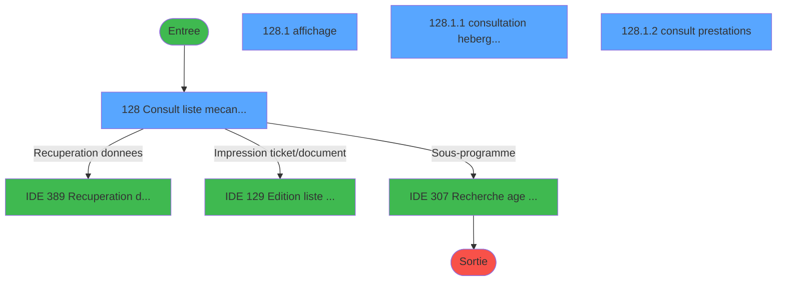
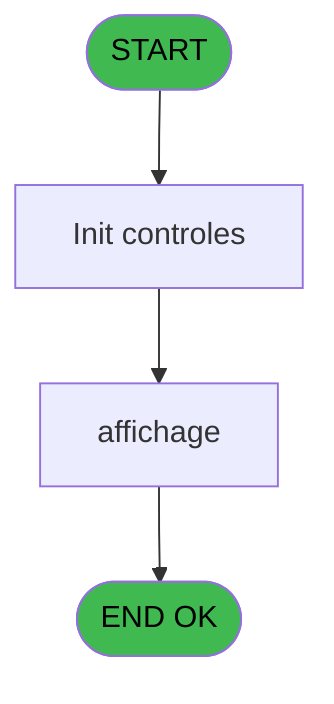
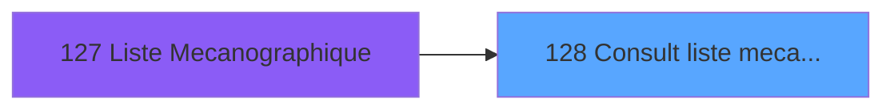
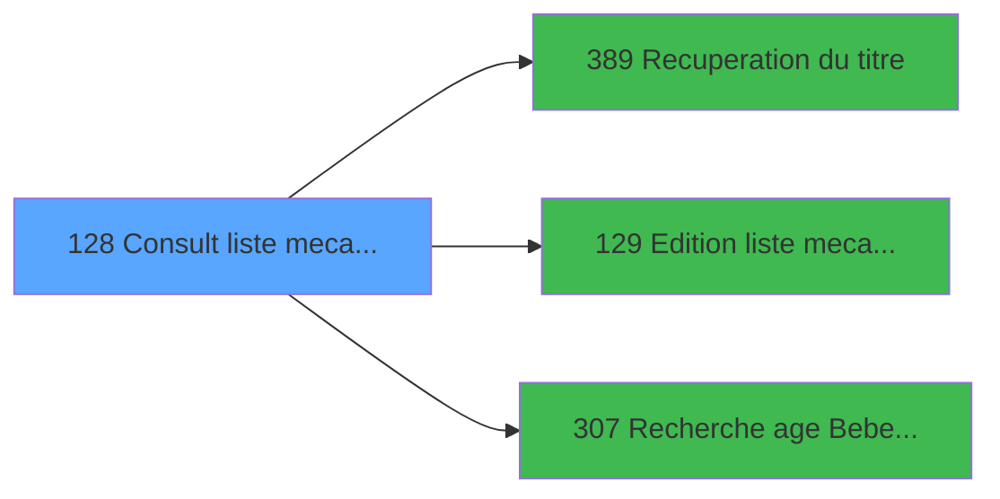

# PBP IDE 128 - Consult liste mecano ecran

> **Analyse**: Phases 1-4 2026-02-03 15:23 -> 15:23 (18s) | Assemblage 15:23
> **Pipeline**: V7.2 Enrichi
> **Structure**: 4 onglets (Resume | Ecrans | Donnees | Connexions)

<!-- TAB:Resume -->

## 1. FICHE D'IDENTITE

| Attribut | Valeur |
|----------|--------|
| Projet | PBP |
| IDE Position | 128 |
| Nom Programme | Consult liste mecano ecran |
| Fichier source | `Prg_128.xml` |
| Dossier IDE | Gestion |
| Taches | 4 (4 ecrans visibles) |
| Tables modifiees | 0 |
| Programmes appeles | 3 |

## 2. DESCRIPTION FONCTIONNELLE

**Consult liste mecano ecran** assure la gestion complete de ce processus, accessible depuis [Liste Mecanographique (IDE 127)](PBP-IDE-127.md).

Le flux de traitement s'organise en **2 blocs fonctionnels** :

- **Traitement** (3 taches) : traitements metier divers
- **Consultation** (1 tache) : ecrans de recherche, selection et consultation

**Logique metier** : 1 regles identifiees couvrant conditions metier.

Detail : phases du traitement

#### Phase 1 : Traitement (3 taches)

- **128** - Consult liste mecano ecran **[[ECRAN]](#ecran-t1)**
- **128.1.1** - consultation hebergement **[[ECRAN]](#ecran-t3)**
- **128.1.2** - consult prestations **[[ECRAN]](#ecran-t4)**

Delegue a : [Recuperation du titre (IDE 389)](PBP-IDE-389.md)

#### Phase 2 : Consultation (1 tache)

- **128.1** - affichage **[[ECRAN]](#ecran-t2)**

Delegue a : [Recuperation du titre (IDE 389)](PBP-IDE-389.md), [Recherche age Bebe_Enfant (IDE 307)](PBP-IDE-307.md)

## 3. BLOCS FONCTIONNELS

### 3.1 Traitement (3 taches)

Traitements internes.

---

#### 128 - Consult liste mecano ecran [[ECRAN]](#ecran-t1)

**Role** : Traitement : Consult liste mecano ecran.
**Ecran** : 1205 x 226 DLU (MDI) | [Voir mockup](#ecran-t1)
**Delegue a** : [Recuperation du titre (IDE 389)](PBP-IDE-389.md)

---

#### 128.1.1 - consultation hebergement [[ECRAN]](#ecran-t3)

**Role** : Consultation/chargement : consultation hebergement.
**Ecran** : 774 x 65 DLU (Modal) | [Voir mockup](#ecran-t3)
**Delegue a** : [Recuperation du titre (IDE 389)](PBP-IDE-389.md)

---

#### 128.1.2 - consult prestations [[ECRAN]](#ecran-t4)

**Role** : Traitement : consult prestations.
**Ecran** : 775 x 37 DLU (Modal) | [Voir mockup](#ecran-t4)
**Delegue a** : [Recuperation du titre (IDE 389)](PBP-IDE-389.md)

### 3.2 Consultation (1 tache)

Ecrans de recherche et consultation.

---

#### 128.1 - affichage [[ECRAN]](#ecran-t2)

**Role** : Reinitialisation : affichage.
**Ecran** : 806 x 274 DLU (MDI) | [Voir mockup](#ecran-t2)
**Delegue a** : [Recherche age Bebe_Enfant (IDE 307)](PBP-IDE-307.md)

## 5. REGLES METIER

1 regles identifiees:

### Autres (1 regles)

#### [RM-001] Si [AI]='O' alors MlsTrans ('Bebe') sinon '')

| Element | Detail |
|---------|--------|
| **Condition** | `[AI]='O'` |
| **Si vrai** | MlsTrans ('Bebe') |
| **Si faux** | '') |
| **Expression source** | Expression 12 : `IF ([AI]='O',MlsTrans ('Bebe'),'')` |
| **Exemple** | Si [AI]='O' → MlsTrans ('Bebe'). Sinon → '') |

## 6. CONTEXTE

- **Appele par**: [Liste Mecanographique (IDE 127)](PBP-IDE-127.md)
- **Appelle**: 3 programmes | **Tables**: 8 (W:0 R:3 L:5) | **Taches**: 4 | **Expressions**: 23

<!-- TAB:Ecrans -->

## 8. ECRANS

### 8.1 Forms visibles (4 / 4)

| # | Position | Tache | Nom | Type | Largeur | Hauteur | Bloc |
|---|----------|-------|-----|------|---------|---------|------|
| 1 | 128 | 128 | Consult liste mecano ecran | MDI | 1205 | 226 | Traitement |
| 2 | 128.1 | 128.1 | affichage | MDI | 806 | 274 | Consultation |
| 3 | 128.1.1 | 128.1.1 | consultation hebergement | Modal | 774 | 65 | Traitement |
| 4 | 128.1.2 | 128.1.2 | consult prestations | Modal | 775 | 37 | Traitement |

### 8.2 Mockups Ecrans

---

#### 128 - Consult liste mecano ecran
**Tache** : [128](#t1) | **Type** : MDI | **Dimensions** : 1205 x 226 DLU
**Bloc** : Traitement | **Titre IDE** : Consult liste mecano ecran

<!-- FORM-DATA:
{
    "width":  1205,
    "vFactor":  8,
    "type":  "MDI",
    "hFactor":  8,
    "controls":  [
                     {
                         "x":  0,
                         "type":  "label",
                         "var":  "",
                         "y":  0,
                         "w":  1202,
                         "fmt":  "",
                         "name":  "",
                         "h":  19,
                         "color":  "",
                         "text":  "",
                         "parent":  null
                     },
                     {
                         "x":  3,
                         "type":  "table",
                         "var":  "",
                         "name":  "",
                         "titleH":  12,
                         "color":  "110",
                         "w":  1011,
                         "y":  27,
                         "fmt":  "",
                         "parent":  null,
                         "text":  "",
                         "rowH":  11,
                         "h":  112,
                         "cols":  [
                                      {
                                          "title":  "P. Vente",
                                          "layer":  1,
                                          "w":  76
                                      },
                                      {
                                          "title":  "Sexe",
                                          "layer":  2,
                                          "w":  59
                                      },
                                      {
                                          "title":  "Nom",
                                          "layer":  3,
                                          "w":  188
                                      },
                                      {
                                          "title":  "Prénom",
                                          "layer":  4,
                                          "w":  130
                                      },
                                      {
                                          "title":  "Numéro",
                                          "layer":  5,
                                          "w":  162
                                      },
                                      {
                                          "title":  "Age",
                                          "layer":  6,
                                          "w":  68
                                      },
                                      {
                                          "title":  "Nom Accompagnant",
                                          "layer":  7,
                                          "w":  186
                                      },
                                      {
                                          "title":  "Fil Accomp.",
                                          "layer":  8,
                                          "w":  110
                                      }
                                  ],
                         "rows":  8
                     },
                     {
                         "x":  1014,
                         "type":  "label",
                         "var":  "",
                         "y":  27,
                         "w":  181,
                         "fmt":  "",
                         "name":  "",
                         "h":  153,
                         "color":  "",
                         "text":  "",
                         "parent":  null
                     },
                     {
                         "x":  6,
                         "type":  "label",
                         "var":  "",
                         "y":  145,
                         "w":  276,
                         "fmt":  "",
                         "name":  "",
                         "h":  32,
                         "color":  "",
                         "text":  "",
                         "parent":  null
                     },
                     {
                         "x":  278,
                         "type":  "label",
                         "var":  "",
                         "y":  145,
                         "w":  276,
                         "fmt":  "",
                         "name":  "",
                         "h":  32,
                         "color":  "",
                         "text":  "",
                         "parent":  null
                     },
                     {
                         "x":  550,
                         "type":  "label",
                         "var":  "",
                         "y":  145,
                         "w":  310,
                         "fmt":  "",
                         "name":  "",
                         "h":  32,
                         "color":  "",
                         "text":  "",
                         "parent":  null
                     },
                     {
                         "x":  858,
                         "type":  "label",
                         "var":  "",
                         "y":  145,
                         "w":  147,
                         "fmt":  "",
                         "name":  "",
                         "h":  32,
                         "color":  "",
                         "text":  "",
                         "parent":  null
                     },
                     {
                         "x":  27,
                         "type":  "label",
                         "var":  "",
                         "y":  153,
                         "w":  239,
                         "fmt":  "",
                         "name":  "",
                         "h":  8,
                         "color":  "",
                         "text":  "Séminaire",
                         "parent":  26
                     },
                     {
                         "x":  306,
                         "type":  "label",
                         "var":  "",
                         "y":  153,
                         "w":  126,
                         "fmt":  "",
                         "name":  "",
                         "h":  8,
                         "color":  "",
                         "text":  "Fin Séjour",
                         "parent":  27
                     },
                     {
                         "x":  450,
                         "type":  "label",
                         "var":  "",
                         "y":  153,
                         "w":  82,
                         "fmt":  "",
                         "name":  "",
                         "h":  8,
                         "color":  "",
                         "text":  "Circuit",
                         "parent":  27
                     },
                     {
                         "x":  561,
                         "type":  "label",
                         "var":  "",
                         "y":  153,
                         "w":  136,
                         "fmt":  "",
                         "name":  "",
                         "h":  8,
                         "color":  "",
                         "text":  "Code Logement",
                         "parent":  28
                     },
                     {
                         "x":  705,
                         "type":  "label",
                         "var":  "",
                         "y":  153,
                         "w":  35,
                         "fmt":  "",
                         "name":  "",
                         "h":  8,
                         "color":  "",
                         "text":  "Oc.",
                         "parent":  28
                     },
                     {
                         "x":  740,
                         "type":  "label",
                         "var":  "",
                         "y":  153,
                         "w":  110,
                         "fmt":  "",
                         "name":  "",
                         "h":  8,
                         "color":  "",
                         "text":  "Logement",
                         "parent":  28
                     },
                     {
                         "x":  6,
                         "type":  "label",
                         "var":  "",
                         "y":  179,
                         "w":  999,
                         "fmt":  "",
                         "name":  "",
                         "h":  20,
                         "color":  "",
                         "text":  "",
                         "parent":  null
                     },
                     {
                         "x":  27,
                         "type":  "label",
                         "var":  "",
                         "y":  185,
                         "w":  239,
                         "fmt":  "",
                         "name":  "",
                         "h":  9,
                         "color":  "",
                         "text":  "Commentaire",
                         "parent":  45
                     },
                     {
                         "x":  0,
                         "type":  "label",
                         "var":  "",
                         "y":  201,
                         "w":  1202,
                         "fmt":  "",
                         "name":  "",
                         "h":  23,
                         "color":  "",
                         "text":  "",
                         "parent":  null
                     },
                     {
                         "x":  10,
                         "type":  "edit",
                         "var":  "",
                         "y":  41,
                         "w":  42,
                         "fmt":  "",
                         "name":  "EME Code Vente",
                         "h":  8,
                         "color":  "110",
                         "text":  "",
                         "parent":  6
                     },
                     {
                         "x":  99,
                         "type":  "edit",
                         "var":  "",
                         "y":  41,
                         "w":  30,
                         "fmt":  "",
                         "name":  "EME Sexe",
                         "h":  8,
                         "color":  "110",
                         "text":  "",
                         "parent":  6
                     },
                     {
                         "x":  147,
                         "type":  "edit",
                         "var":  "",
                         "y":  41,
                         "w":  176,
                         "fmt":  "",
                         "name":  "",
                         "h":  8,
                         "color":  "110",
                         "text":  "",
                         "parent":  6
                     },
                     {
                         "x":  333,
                         "type":  "edit",
                         "var":  "",
                         "y":  41,
                         "w":  120,
                         "fmt":  "",
                         "name":  "",
                         "h":  8,
                         "color":  "110",
                         "text":  "",
                         "parent":  6
                     },
                     {
                         "x":  306,
                         "type":  "edit",
                         "var":  "",
                         "y":  185,
                         "w":  683,
                         "fmt":  "",
                         "name":  "",
                         "h":  9,
                         "color":  "",
                         "text":  "",
                         "parent":  45
                     },
                     {
                         "x":  462,
                         "type":  "edit",
                         "var":  "",
                         "y":  41,
                         "w":  154,
                         "fmt":  "",
                         "name":  "EME Numero",
                         "h":  8,
                         "color":  "110",
                         "text":  "",
                         "parent":  6
                     },
                     {
                         "x":  635,
                         "type":  "edit",
                         "var":  "",
                         "y":  41,
                         "w":  42,
                         "fmt":  "",
                         "name":  "",
                         "h":  8,
                         "color":  "110",
                         "text":  "",
                         "parent":  6
                     },
                     {
                         "x":  694,
                         "type":  "edit",
                         "var":  "",
                         "y":  41,
                         "w":  176,
                         "fmt":  "",
                         "name":  "EME Nom    Accompagn",
                         "h":  8,
                         "color":  "110",
                         "text":  "",
                         "parent":  6
                     },
                     {
                         "x":  922,
                         "type":  "edit",
                         "var":  "",
                         "y":  41,
                         "w":  30,
                         "fmt":  "",
                         "name":  "",
                         "h":  8,
                         "color":  "110",
                         "text":  "",
                         "parent":  6
                     },
                     {
                         "x":  29,
                         "type":  "edit",
                         "var":  "",
                         "y":  164,
                         "w":  235,
                         "fmt":  "",
                         "name":  "EME Seminaire",
                         "h":  9,
                         "color":  "",
                         "text":  "",
                         "parent":  26
                     },
                     {
                         "x":  561,
                         "type":  "edit",
                         "var":  "",
                         "y":  164,
                         "w":  22,
                         "fmt":  "",
                         "name":  "",
                         "h":  9,
                         "color":  "",
                         "text":  "",
                         "parent":  28
                     },
                     {
                         "x":  591,
                         "type":  "edit",
                         "var":  "",
                         "y":  164,
                         "w":  78,
                         "fmt":  "",
                         "name":  "",
                         "h":  9,
                         "color":  "",
                         "text":  "",
                         "parent":  28
                     },
                     {
                         "x":  306,
                         "type":  "edit",
                         "var":  "",
                         "y":  164,
                         "w":  123,
                         "fmt":  "DD/MM/YYYYZ",
                         "name":  "",
                         "h":  9,
                         "color":  "",
                         "text":  "",
                         "parent":  27
                     },
                     {
                         "x":  450,
                         "type":  "edit",
                         "var":  "",
                         "y":  164,
                         "w":  78,
                         "fmt":  "",
                         "name":  "",
                         "h":  9,
                         "color":  "",
                         "text":  "",
                         "parent":  27
                     },
                     {
                         "x":  754,
                         "type":  "edit",
                         "var":  "",
                         "y":  164,
                         "w":  78,
                         "fmt":  "",
                         "name":  "EME Nom Logement",
                         "h":  9,
                         "color":  "",
                         "text":  "",
                         "parent":  28
                     },
                     {
                         "x":  1028,
                         "type":  "button",
                         "var":  "",
                         "y":  128,
                         "w":  154,
                         "fmt":  "\u0026Voir",
                         "name":  "bouton voir",
                         "h":  18,
                         "color":  "",
                         "text":  "",
                         "parent":  null
                     },
                     {
                         "x":  1028,
                         "type":  "button",
                         "var":  "",
                         "y":  155,
                         "w":  154,
                         "fmt":  "\u0026Impression",
                         "name":  "bouton edit",
                         "h":  18,
                         "color":  "",
                         "text":  "",
                         "parent":  null
                     },
                     {
                         "x":  6,
                         "type":  "edit",
                         "var":  "",
                         "y":  2,
                         "w":  267,
                         "fmt":  "20",
                         "name":  "",
                         "h":  8,
                         "color":  "",
                         "text":  "",
                         "parent":  1
                     },
                     {
                         "x":  452,
                         "type":  "edit",
                         "var":  "",
                         "y":  6,
                         "w":  299,
                         "fmt":  "26",
                         "name":  "",
                         "h":  8,
                         "color":  "",
                         "text":  "",
                         "parent":  1
                     },
                     {
                         "x":  884,
                         "type":  "edit",
                         "var":  "",
                         "y":  6,
                         "w":  307,
                         "fmt":  "WWW DD MMM YYYYT",
                         "name":  "",
                         "h":  8,
                         "color":  "",
                         "text":  "",
                         "parent":  1
                     },
                     {
                         "x":  6,
                         "type":  "edit",
                         "var":  "",
                         "y":  10,
                         "w":  331,
                         "fmt":  "25",
                         "name":  "",
                         "h":  8,
                         "color":  "",
                         "text":  "",
                         "parent":  1
                     },
                     {
                         "x":  883,
                         "type":  "edit",
                         "var":  "",
                         "y":  41,
                         "w":  19,
                         "fmt":  "1",
                         "name":  "",
                         "h":  8,
                         "color":  "110",
                         "text":  "",
                         "parent":  6
                     },
                     {
                         "x":  1027,
                         "type":  "image",
                         "var":  "",
                         "y":  44,
                         "w":  159,
                         "fmt":  "",
                         "name":  "",
                         "h":  67,
                         "color":  "",
                         "text":  "",
                         "parent":  7
                     },
                     {
                         "x":  869,
                         "type":  "edit",
                         "var":  "",
                         "y":  153,
                         "w":  56,
                         "fmt":  "4",
                         "name":  "",
                         "h":  8,
                         "color":  "",
                         "text":  "",
                         "parent":  29
                     },
                     {
                         "x":  704,
                         "type":  "edit",
                         "var":  "",
                         "y":  164,
                         "w":  39,
                         "fmt":  "3",
                         "name":  "",
                         "h":  9,
                         "color":  "",
                         "text":  "",
                         "parent":  28
                     },
                     {
                         "x":  864,
                         "type":  "edit",
                         "var":  "",
                         "y":  164,
                         "w":  135,
                         "fmt":  "30",
                         "name":  "",
                         "h":  9,
                         "color":  "",
                         "text":  "",
                         "parent":  29
                     },
                     {
                         "x":  7,
                         "type":  "button",
                         "var":  "",
                         "y":  204,
                         "w":  154,
                         "fmt":  "\u0026Quitter",
                         "name":  "",
                         "h":  18,
                         "color":  "",
                         "text":  "",
                         "parent":  48
                     }
                 ],
    "taskId":  "128",
    "height":  226
}
-->

<strong>Champs : 23 champs</strong>

| Pos (x,y) | Nom | Variable | Type |
|-----------|-----|----------|------|
| 10,41 | EME Code Vente | - | edit |
| 99,41 | EME Sexe | - | edit |
| 147,41 | (sans nom) | - | edit |
| 333,41 | (sans nom) | - | edit |
| 306,185 | (sans nom) | - | edit |
| 462,41 | EME Numero | - | edit |
| 635,41 | (sans nom) | - | edit |
| 694,41 | EME Nom    Accompagn | - | edit |
| 922,41 | (sans nom) | - | edit |
| 29,164 | EME Seminaire | - | edit |
| 561,164 | (sans nom) | - | edit |
| 591,164 | (sans nom) | - | edit |
| 306,164 | DD/MM/YYYYZ | - | edit |
| 450,164 | (sans nom) | - | edit |
| 754,164 | EME Nom Logement | - | edit |
| 6,2 | 20 | - | edit |
| 452,6 | 26 | - | edit |
| 884,6 | WWW DD MMM YYYYT | - | edit |
| 6,10 | 25 | - | edit |
| 883,41 | 1 | - | edit |
| 869,153 | 4 | - | edit |
| 704,164 | 3 | - | edit |
| 864,164 | 30 | - | edit |

<strong>Boutons : 3 boutons</strong>

| Bouton | Pos (x,y) | Action |
|--------|-----------|--------|
| Voir | 1028,128 | Bouton fonctionnel |
| Impression | 1028,155 | Bouton fonctionnel |
| Quitter | 7,204 | Quitte le programme |

---

#### 128.1 - affichage
**Tache** : [128.1](#t2) | **Type** : MDI | **Dimensions** : 806 x 274 DLU
**Bloc** : Consultation | **Titre IDE** : affichage

<!-- FORM-DATA:
{
    "width":  806,
    "vFactor":  8,
    "type":  "MDI",
    "hFactor":  8,
    "controls":  [
                     {
                         "x":  20,
                         "type":  "label",
                         "var":  "",
                         "y":  14,
                         "w":  765,
                         "fmt":  "",
                         "name":  "",
                         "h":  126,
                         "color":  "",
                         "text":  "",
                         "parent":  null
                     },
                     {
                         "x":  66,
                         "type":  "label",
                         "var":  "",
                         "y":  37,
                         "w":  94,
                         "fmt":  "",
                         "name":  "",
                         "h":  8,
                         "color":  "",
                         "text":  "N° adhérent",
                         "parent":  3
                     },
                     {
                         "x":  66,
                         "type":  "label",
                         "var":  "",
                         "y":  51,
                         "w":  126,
                         "fmt":  "",
                         "name":  "",
                         "h":  8,
                         "color":  "",
                         "text":  "Date naissance",
                         "parent":  3
                     },
                     {
                         "x":  66,
                         "type":  "label",
                         "var":  "",
                         "y":  65,
                         "w":  120,
                         "fmt":  "",
                         "name":  "",
                         "h":  9,
                         "color":  "",
                         "text":  "Ville naissance",
                         "parent":  3
                     },
                     {
                         "x":  66,
                         "type":  "label",
                         "var":  "",
                         "y":  78,
                         "w":  64,
                         "fmt":  "",
                         "name":  "",
                         "h":  9,
                         "color":  "",
                         "text":  "Identité",
                         "parent":  3
                     },
                     {
                         "x":  64,
                         "type":  "label",
                         "var":  "",
                         "y":  90,
                         "w":  128,
                         "fmt":  "",
                         "name":  "",
                         "h":  9,
                         "color":  "",
                         "text":  "Date délivrance",
                         "parent":  3
                     },
                     {
                         "x":  390,
                         "type":  "label",
                         "var":  "",
                         "y":  90,
                         "w":  128,
                         "fmt":  "",
                         "name":  "",
                         "h":  9,
                         "color":  "",
                         "text":  "Date validité",
                         "parent":  3
                     },
                     {
                         "x":  64,
                         "type":  "label",
                         "var":  "",
                         "y":  103,
                         "w":  94,
                         "fmt":  "",
                         "name":  "",
                         "h":  8,
                         "color":  "",
                         "text":  "Adresse",
                         "parent":  3
                     },
                     {
                         "x":  0,
                         "type":  "label",
                         "var":  "",
                         "y":  248,
                         "w":  805,
                         "fmt":  "",
                         "name":  "",
                         "h":  24,
                         "color":  "",
                         "text":  "",
                         "parent":  null
                     },
                     {
                         "x":  82,
                         "type":  "edit",
                         "var":  "",
                         "y":  2,
                         "w":  37,
                         "fmt":  "",
                         "name":  "GMC Titre",
                         "h":  10,
                         "color":  "",
                         "text":  "",
                         "parent":  null
                     },
                     {
                         "x":  214,
                         "type":  "edit",
                         "var":  "",
                         "y":  51,
                         "w":  132,
                         "fmt":  "DD/MM/YYYYZ",
                         "name":  "",
                         "h":  9,
                         "color":  "",
                         "text":  "",
                         "parent":  3
                     },
                     {
                         "x":  214,
                         "type":  "edit",
                         "var":  "",
                         "y":  65,
                         "w":  440,
                         "fmt":  "",
                         "name":  "",
                         "h":  9,
                         "color":  "",
                         "text":  "",
                         "parent":  3
                     },
                     {
                         "x":  670,
                         "type":  "edit",
                         "var":  "",
                         "y":  65,
                         "w":  45,
                         "fmt":  "",
                         "name":  "",
                         "h":  9,
                         "color":  "",
                         "text":  "",
                         "parent":  3
                     },
                     {
                         "x":  214,
                         "type":  "edit",
                         "var":  "",
                         "y":  78,
                         "w":  22,
                         "fmt":  "",
                         "name":  "",
                         "h":  9,
                         "color":  "",
                         "text":  "",
                         "parent":  3
                     },
                     {
                         "x":  248,
                         "type":  "edit",
                         "var":  "",
                         "y":  78,
                         "w":  347,
                         "fmt":  "",
                         "name":  "",
                         "h":  9,
                         "color":  "",
                         "text":  "",
                         "parent":  3
                     },
                     {
                         "x":  214,
                         "type":  "edit",
                         "var":  "",
                         "y":  90,
                         "w":  123,
                         "fmt":  "DD/MM/YYYYZ",
                         "name":  "",
                         "h":  9,
                         "color":  "",
                         "text":  "",
                         "parent":  3
                     },
                     {
                         "x":  526,
                         "type":  "edit",
                         "var":  "",
                         "y":  90,
                         "w":  123,
                         "fmt":  "DD/MM/YYYYZ",
                         "name":  "",
                         "h":  9,
                         "color":  "",
                         "text":  "",
                         "parent":  3
                     },
                     {
                         "x":  214,
                         "type":  "edit",
                         "var":  "",
                         "y":  114,
                         "w":  475,
                         "fmt":  "",
                         "name":  "",
                         "h":  9,
                         "color":  "",
                         "text":  "",
                         "parent":  3
                     },
                     {
                         "x":  214,
                         "type":  "edit",
                         "var":  "",
                         "y":  125,
                         "w":  123,
                         "fmt":  "",
                         "name":  "",
                         "h":  9,
                         "color":  "",
                         "text":  "",
                         "parent":  3
                     },
                     {
                         "x":  346,
                         "type":  "edit",
                         "var":  "",
                         "y":  125,
                         "w":  347,
                         "fmt":  "",
                         "name":  "",
                         "h":  9,
                         "color":  "",
                         "text":  "",
                         "parent":  3
                     },
                     {
                         "x":  214,
                         "type":  "edit",
                         "var":  "",
                         "y":  103,
                         "w":  123,
                         "fmt":  "",
                         "name":  "",
                         "h":  9,
                         "color":  "",
                         "text":  "",
                         "parent":  3
                     },
                     {
                         "x":  346,
                         "type":  "edit",
                         "var":  "",
                         "y":  103,
                         "w":  347,
                         "fmt":  "",
                         "name":  "",
                         "h":  9,
                         "color":  "",
                         "text":  "",
                         "parent":  3
                     },
                     {
                         "x":  124,
                         "type":  "edit",
                         "var":  "",
                         "y":  2,
                         "w":  597,
                         "fmt":  "52",
                         "name":  "",
                         "h":  10,
                         "color":  "7",
                         "text":  "",
                         "parent":  null
                     },
                     {
                         "x":  621,
                         "type":  "image",
                         "var":  "",
                         "y":  19,
                         "w":  160,
                         "fmt":  "",
                         "name":  "",
                         "h":  45,
                         "color":  "",
                         "text":  "",
                         "parent":  3
                     },
                     {
                         "x":  214,
                         "type":  "edit",
                         "var":  "",
                         "y":  36,
                         "w":  347,
                         "fmt":  "30",
                         "name":  "",
                         "h":  9,
                         "color":  "",
                         "text":  "",
                         "parent":  3
                     },
                     {
                         "x":  8,
                         "type":  "button",
                         "var":  "",
                         "y":  251,
                         "w":  154,
                         "fmt":  "\u0026Quitter",
                         "name":  "",
                         "h":  18,
                         "color":  "",
                         "text":  "",
                         "parent":  25
                     },
                     {
                         "x":  0,
                         "type":  "subform",
                         "var":  "",
                         "y":  141,
                         "w":  806,
                         "fmt":  "",
                         "name":  "consultation hebergement",
                         "h":  66,
                         "color":  "",
                         "text":  "",
                         "parent":  null
                     },
                     {
                         "x":  0,
                         "type":  "subform",
                         "var":  "",
                         "y":  207,
                         "w":  806,
                         "fmt":  "",
                         "name":  "consult prestations",
                         "h":  40,
                         "color":  "",
                         "text":  "",
                         "parent":  null
                     }
                 ],
    "taskId":  "128.1",
    "height":  274
}
-->

<strong>Champs : 15 champs</strong>

| Pos (x,y) | Nom | Variable | Type |
|-----------|-----|----------|------|
| 82,2 | GMC Titre | - | edit |
| 214,51 | DD/MM/YYYYZ | - | edit |
| 214,65 | (sans nom) | - | edit |
| 670,65 | (sans nom) | - | edit |
| 214,78 | (sans nom) | - | edit |
| 248,78 | (sans nom) | - | edit |
| 214,90 | DD/MM/YYYYZ | - | edit |
| 526,90 | DD/MM/YYYYZ | - | edit |
| 214,114 | (sans nom) | - | edit |
| 214,125 | (sans nom) | - | edit |
| 346,125 | (sans nom) | - | edit |
| 214,103 | (sans nom) | - | edit |
| 346,103 | (sans nom) | - | edit |
| 124,2 | 52 | - | edit |
| 214,36 | 30 | - | edit |

<strong>Boutons : 1 boutons</strong>

| Bouton | Pos (x,y) | Action |
|--------|-----------|--------|
| Quitter | 8,251 | Quitte le programme |

---

#### 128.1.1 - consultation hebergement
**Tache** : [128.1.1](#t3) | **Type** : Modal | **Dimensions** : 774 x 65 DLU
**Bloc** : Traitement | **Titre IDE** : consultation hebergement

<!-- FORM-DATA:
{
    "width":  774,
    "vFactor":  8,
    "type":  "Modal",
    "hFactor":  8,
    "controls":  [
                     {
                         "x":  8,
                         "type":  "table",
                         "var":  "",
                         "name":  "",
                         "titleH":  12,
                         "color":  "110",
                         "w":  765,
                         "y":  0,
                         "fmt":  "",
                         "parent":  null,
                         "text":  "",
                         "rowH":  12,
                         "h":  62,
                         "cols":  [
                                      {
                                          "title":  "Type",
                                          "layer":  1,
                                          "w":  158
                                      },
                                      {
                                          "title":  "Début",
                                          "layer":  2,
                                          "w":  165
                                      },
                                      {
                                          "title":  "Fin",
                                          "layer":  3,
                                          "w":  163
                                      },
                                      {
                                          "title":  "Détail",
                                          "layer":  4,
                                          "w":  244
                                      }
                                  ],
                         "rows":  4
                     },
                     {
                         "x":  173,
                         "type":  "edit",
                         "var":  "",
                         "y":  14,
                         "w":  120,
                         "fmt":  "DD/MM/YYYYZ",
                         "name":  "",
                         "h":  8,
                         "color":  "110",
                         "text":  "",
                         "parent":  1
                     },
                     {
                         "x":  299,
                         "type":  "edit",
                         "var":  "",
                         "y":  14,
                         "w":  30,
                         "fmt":  "",
                         "name":  "",
                         "h":  8,
                         "color":  "110",
                         "text":  "",
                         "parent":  1
                     },
                     {
                         "x":  338,
                         "type":  "edit",
                         "var":  "",
                         "y":  14,
                         "w":  120,
                         "fmt":  "DD/MM/YYYYZ",
                         "name":  "",
                         "h":  8,
                         "color":  "110",
                         "text":  "",
                         "parent":  1
                     },
                     {
                         "x":  461,
                         "type":  "edit",
                         "var":  "",
                         "y":  14,
                         "w":  30,
                         "fmt":  "",
                         "name":  "",
                         "h":  8,
                         "color":  "110",
                         "text":  "",
                         "parent":  1
                     },
                     {
                         "x":  501,
                         "type":  "edit",
                         "var":  "",
                         "y":  14,
                         "w":  232,
                         "fmt":  "20",
                         "name":  "",
                         "h":  8,
                         "color":  "110",
                         "text":  "",
                         "parent":  1
                     },
                     {
                         "x":  14,
                         "type":  "edit",
                         "var":  "",
                         "y":  14,
                         "w":  142,
                         "fmt":  "12",
                         "name":  "",
                         "h":  8,
                         "color":  "110",
                         "text":  "",
                         "parent":  1
                     }
                 ],
    "taskId":  "128.1.1",
    "height":  65
}
-->

<strong>Champs : 6 champs</strong>

| Pos (x,y) | Nom | Variable | Type |
|-----------|-----|----------|------|
| 173,14 | DD/MM/YYYYZ | - | edit |
| 299,14 | (sans nom) | - | edit |
| 338,14 | DD/MM/YYYYZ | - | edit |
| 461,14 | (sans nom) | - | edit |
| 501,14 | 20 | - | edit |
| 14,14 | 12 | - | edit |

---

#### 128.1.2 - consult prestations
**Tache** : [128.1.2](#t4) | **Type** : Modal | **Dimensions** : 775 x 37 DLU
**Bloc** : Traitement | **Titre IDE** : consult prestations

<!-- FORM-DATA:
{
    "width":  775,
    "vFactor":  8,
    "type":  "Modal",
    "hFactor":  8,
    "controls":  [
                     {
                         "x":  195,
                         "type":  "table",
                         "var":  "",
                         "name":  "",
                         "titleH":  12,
                         "color":  "110",
                         "w":  394,
                         "y":  0,
                         "fmt":  "",
                         "parent":  null,
                         "text":  "",
                         "rowH":  11,
                         "h":  35,
                         "cols":  [
                                      {
                                          "title":  "Code circuit",
                                          "layer":  1,
                                          "w":  108
                                      },
                                      {
                                          "title":  "Libellé",
                                          "layer":  2,
                                          "w":  249
                                      }
                                  ],
                         "rows":  2
                     },
                     {
                         "x":  201,
                         "type":  "edit",
                         "var":  "",
                         "y":  14,
                         "w":  75,
                         "fmt":  "",
                         "name":  "",
                         "h":  8,
                         "color":  "110",
                         "text":  "",
                         "parent":  1
                     },
                     {
                         "x":  309,
                         "type":  "edit",
                         "var":  "",
                         "y":  14,
                         "w":  232,
                         "fmt":  "",
                         "name":  "",
                         "h":  8,
                         "color":  "110",
                         "text":  "",
                         "parent":  1
                     }
                 ],
    "taskId":  "128.1.2",
    "height":  37
}
-->

<strong>Champs : 2 champs</strong>

| Pos (x,y) | Nom | Variable | Type |
|-----------|-----|----------|------|
| 201,14 | (sans nom) | - | edit |
| 309,14 | (sans nom) | - | edit |

## 9. NAVIGATION

### 9.1 Enchainement des ecrans

**Detail par enchainement :**

| Depuis | Action | Vers | Retour |
|--------|--------|------|--------|
| Consult liste mecano ecran | Recuperation donnees | [Recuperation du titre (IDE 389)](PBP-IDE-389.md) | Retour ecran |
| Consult liste mecano ecran | Impression ticket/document | [  Edition liste mecano AL (IDE 129)](PBP-IDE-129.md) | Retour ecran |
| Consult liste mecano ecran | Sous-programme | [Recherche age Bebe_Enfant (IDE 307)](PBP-IDE-307.md) | Retour ecran |

### 9.3 Structure hierarchique (4 taches)

| Position | Tache | Type | Dimensions | Bloc |
|----------|-------|------|------------|------|
| **128.1** | [**Consult liste mecano ecran** (128)](#t1) [mockup](#ecran-t1) | MDI | 1205x226 | Traitement |
| 128.1.1 | [consultation hebergement (128.1.1)](#t3) [mockup](#ecran-t3) | Modal | 774x65 | |
| 128.1.2 | [consult prestations (128.1.2)](#t4) [mockup](#ecran-t4) | Modal | 775x37 | |
| **128.2** | [**affichage** (128.1)](#t2) [mockup](#ecran-t2) | MDI | 806x274 | Consultation |

### 9.4 Algorigramme

> **Legende**: Vert = START/END OK | Rouge = END KO | Bleu = Decisions
> *Algorigramme auto-genere. Utiliser `/algorigramme` pour une synthese metier detaillee.*

<!-- TAB:Donnees -->

## 10. TABLES

### Tables utilisees (8)

| ID | Nom | Description | Type | R | W | L | Usages |
|----|-----|-------------|------|---|---|---|--------|
| 31 | gm-complet_______gmc |  | DB | R |   |   | 2 |
| 33 | prestations______pre | Prestations/services vendus | DB | R |   |   | 1 |
| 34 | hebergement______heb | Hebergement (chambres) | DB | R |   |   | 1 |
| 37 | commentaire_gm_________acc |  | DB |   |   | L | 1 |
| 135 | libelle_prestation | Prestations/services vendus | DB |   |   | L | 1 |
| 358 | import_mod |  | DB |   |   | L | 1 |
| 612 | tempo_present_excel | Table temporaire ecran | TMP |   |   | L | 1 |
| 845 | stat_vendeur_date |  | TMP |   |   | L | 1 |

### Colonnes par table (5 / 3 tables avec colonnes identifiees)

Table 31 - gm-complet_______gmc (R) - 2 usages

| Lettre | Variable | Acces | Type |
|--------|----------|-------|------|
| A | > date | R | Date |
| B | > lieu sejour | R | Alpha |
| C | > categorie | R | Alpha |
| D | >Total | R | Numeric |
| E | >NbSelect | R | Numeric |
| F | >Seminaire | R | Alpha |
| G | >Type commentaire | R | Alpha |
| H | w0_AgeBebe | R | Numeric |
| I | bouton voir | R | Alpha |
| J | bouton edit | R | Alpha |
| K | v. titre | R | Alpha |

Table 33 - prestations______pre (R) - 1 usages

| Lettre | Variable | Acces | Type |
|--------|----------|-------|------|
| A | P.Num compte | R | Numeric |
| B | P.Filiation | R | Numeric |

Table 34 - hebergement______heb (R) - 1 usages

| Lettre | Variable | Acces | Type |
|--------|----------|-------|------|
| A | P.Num compte | R | Numeric |
| B | P.Filiation | R | Numeric |

## 11. VARIABLES

### 11.1 Variables de session (1)

Variables persistantes pendant toute la session.

| Lettre | Nom | Type | Usage dans |
|--------|-----|------|-----------|
| K | v. titre | Alpha | - |

### 11.2 Autres (10)

Variables diverses.

| Lettre | Nom | Type | Usage dans |
|--------|-----|------|-----------|
| A | > date | Date | - |
| B | > lieu sejour | Alpha | - |
| C | > categorie | Alpha | - |
| D | >Total | Numeric | 1x refs |
| E | >NbSelect | Numeric | 1x refs |
| F | >Seminaire | Alpha | - |
| G | >Type commentaire | Alpha | - |
| H | w0_AgeBebe | Numeric | - |
| I | bouton voir | Alpha | - |
| J | bouton edit | Alpha | - |

## 12. EXPRESSIONS

**23 / 23 expressions decodees (100%)**

### 12.1 Repartition par type

| Type | Expressions | Regles |
|------|-------------|--------|
| CONDITION | 4 | 5 |
| CONSTANTE | 3 | 0 |
| DATE | 1 | 0 |
| REFERENCE_VG | 2 | 0 |
| OTHER | 7 | 0 |
| STRING | 4 | 0 |
| CONCATENATION | 2 | 0 |

### 12.2 Expressions cles par type

#### CONDITION (4 expressions)

| Type | IDE | Expression | Regle |
|------|-----|------------|-------|
| CONDITION | 12 | `IF ([AI]='O',MlsTrans ('Bebe'),'')` | [RM-001](#rm-RM-001) |
| CONDITION | 22 | `Trim ([V])<>''` | - |
| CONDITION | 17 | `[AB]<>''` | - |
| CONDITION | 16 | `[Y]<>''` | - |

#### CONSTANTE (3 expressions)

| Type | IDE | Expression | Regle |
|------|-----|------------|-------|
| CONSTANTE | 23 | `0` | - |
| CONSTANTE | 11 | `'VBEBE'` | - |
| CONSTANTE | 2 | `5` | - |

#### DATE (1 expressions)

| Type | IDE | Expression | Regle |
|------|-----|------------|-------|
| DATE | 3 | `Date ()` | - |

#### REFERENCE_VG (2 expressions)

| Type | IDE | Expression | Regle |
|------|-----|------------|-------|
| REFERENCE_VG | 5 | `VG1` | - |
| REFERENCE_VG | 4 | `VG2` | - |

#### OTHER (7 expressions)

| Type | IDE | Expression | Regle |
|------|-----|------------|-------|
| OTHER | 19 | `GetParam ('VILLAGE')` | - |
| OTHER | 20 | `GetParam ('CODELANGUE')` | - |
| OTHER | 21 | `[CV]` | - |
| OTHER | 18 | `Left ([Z],1)` | - |
| OTHER | 6 | `GetParam ('SOCIETE')` | - |
| ... | | *+2 autres* | |

#### STRING (4 expressions)

| Type | IDE | Expression | Regle |
|------|-----|------------|-------|
| STRING | 8 | `Val(Left([W],2),'2')` | - |
| STRING | 14 | `Left ([AF],1)&Trim(MID([AF],2,2))` | - |
| STRING | 1 | `Trim ([AS])` | - |
| STRING | 7 | `Val(MID([W],3,10),'10')` | - |

#### CONCATENATION (2 expressions)

| Type | IDE | Expression | Regle |
|------|-----|------------|-------|
| CONCATENATION | 15 | `Str (>NbSelect [E],'4')&' '&MlsTrans ('selectionnes sur')&' '&Str (>Total [D],'4')` | - |
| CONCATENATION | 13 | `Trim([CP])&IF(VG125 AND [CW]='O',' (NGM)','')` | - |

### 12.3 Toutes les expressions (23)

Voir les 23 expressions

#### CONDITION (4)

| IDE | Expression Decodee |
|-----|-------------------|
| 12 | `IF ([AI]='O',MlsTrans ('Bebe'),'')` |
| 16 | `[Y]<>''` |
| 17 | `[AB]<>''` |
| 22 | `Trim ([V])<>''` |

#### CONSTANTE (3)

| IDE | Expression Decodee |
|-----|-------------------|
| 2 | `5` |
| 11 | `'VBEBE'` |
| 23 | `0` |

#### DATE (1)

| IDE | Expression Decodee |
|-----|-------------------|
| 3 | `Date ()` |

#### REFERENCE_VG (2)

| IDE | Expression Decodee |
|-----|-------------------|
| 4 | `VG2` |
| 5 | `VG1` |

#### OTHER (7)

| IDE | Expression Decodee |
|-----|-------------------|
| 6 | `GetParam ('SOCIETE')` |
| 9 | `[Q]` |
| 10 | `[R]` |
| 18 | `Left ([Z],1)` |
| 19 | `GetParam ('VILLAGE')` |
| 20 | `GetParam ('CODELANGUE')` |
| 21 | `[CV]` |

#### STRING (4)

| IDE | Expression Decodee |
|-----|-------------------|
| 1 | `Trim ([AS])` |
| 7 | `Val(MID([W],3,10),'10')` |
| 8 | `Val(Left([W],2),'2')` |
| 14 | `Left ([AF],1)&Trim(MID([AF],2,2))` |

#### CONCATENATION (2)

| IDE | Expression Decodee |
|-----|-------------------|
| 13 | `Trim([CP])&IF(VG125 AND [CW]='O',' (NGM)','')` |
| 15 | `Str (>NbSelect [E],'4')&' '&MlsTrans ('selectionnes sur')&' '&Str (>Total [D],'4')` |

<!-- TAB:Connexions -->

## 13. GRAPHE D'APPELS

### 13.1 Chaine depuis Main (Callers)

Main -> ... -> [Liste Mecanographique (IDE 127)](PBP-IDE-127.md) -> **Consult liste mecano ecran (IDE 128)**

### 13.2 Callers

| IDE | Nom Programme | Nb Appels |
|-----|---------------|-----------|
| [127](PBP-IDE-127.md) | Liste Mecanographique | 1 |

### 13.3 Callees (programmes appeles)

### 13.4 Detail Callees avec contexte

| IDE | Nom Programme | Appels | Contexte |
|-----|---------------|--------|----------|
| [389](PBP-IDE-389.md) | Recuperation du titre | 2 | Recuperation donnees |
| [129](PBP-IDE-129.md) |   Edition liste mecano AL | 1 | Impression ticket/document |
| [307](PBP-IDE-307.md) | Recherche age Bebe_Enfant | 1 | Sous-programme |

## 14. RECOMMANDATIONS MIGRATION

### 14.1 Profil du programme

| Metrique | Valeur | Impact migration |
|----------|--------|-----------------|
| Lignes de logique | 155 | Programme compact |
| Expressions | 23 | Peu de logique |
| Tables WRITE | 0 | Impact faible |
| Sous-programmes | 3 | Peu de dependances |
| Ecrans visibles | 4 | Quelques ecrans |
| Code desactive | 0% (0 / 155) | Code sain |
| Regles metier | 1 | Quelques regles a preserver |

### 14.2 Plan de migration par bloc

#### Traitement (3 taches: 3 ecrans, 0 traitement)

- **Strategie** : 3 composant(s) UI (Razor/React) avec formulaires et validation.
- 3 sous-programme(s) a migrer ou a reutiliser depuis les services existants.
- Decomposer les taches en services unitaires testables.

#### Consultation (1 tache: 1 ecran, 0 traitement)

- **Strategie** : Composants de recherche/selection en modales.
- 1 ecran : affichage

### 14.3 Dependances critiques

| Dependance | Type | Appels | Impact |
|------------|------|--------|--------|
| [Recuperation du titre (IDE 389)](PBP-IDE-389.md) | Sous-programme | 2x | Haute - Recuperation donnees |
| [Recherche age Bebe_Enfant (IDE 307)](PBP-IDE-307.md) | Sous-programme | 1x | Normale - Sous-programme |
| [  Edition liste mecano AL (IDE 129)](PBP-IDE-129.md) | Sous-programme | 1x | Normale - Impression ticket/document |

---
*Spec DETAILED generee par Pipeline V7.2 - 2026-02-03 15:23*
