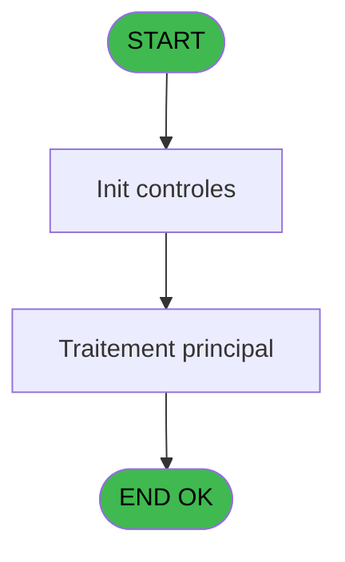
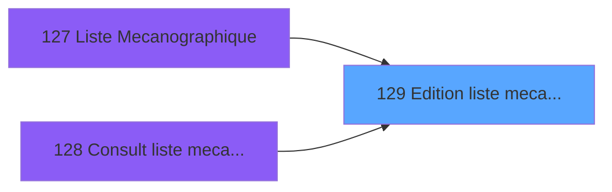

# PBP IDE 129 - Edition liste mecano AL

> **Analyse**: Phases 1-4 2026-02-03 15:23 -> 15:24 (19s) | Assemblage 15:24
> **Pipeline**: V7.2 Enrichi
> **Structure**: 4 onglets (Resume | Ecrans | Donnees | Connexions)

<!-- TAB:Resume -->

## 1. FICHE D'IDENTITE

| Attribut | Valeur |
|----------|--------|
| Projet | PBP |
| IDE Position | 129 |
| Nom Programme | Edition liste mecano AL |
| Fichier source | `Prg_129.xml` |
| Dossier IDE | Gestion |
| Taches | 4 (1 ecrans visibles) |
| Tables modifiees | 0 |
| Programmes appeles | 1 |

## 2. DESCRIPTION FONCTIONNELLE

**Edition liste mecano AL** assure la gestion complete de ce processus, accessible depuis [Liste Mecanographique (IDE 127)](PBP-IDE-127.md), [  Consult liste mecano ecran (IDE 128)](PBP-IDE-128.md).

Le flux de traitement s'organise en **2 blocs fonctionnels** :

- **Traitement** (3 taches) : traitements metier divers
- **Calcul** (1 tache) : calculs de montants, stocks ou compteurs

**Logique metier** : 7 regles identifiees couvrant conditions metier, valeurs par defaut.

Detail : phases du traitement

#### Phase 1 : Traitement (3 taches)

- **129** - Veuillez patienter... **[[ECRAN]](#ecran-t1)**
- **129.1** - statistiques
- **129.3** - Lecture du code ZIP

#### Phase 2 : Calcul (1 tache)

- **129.2** - calcul lignes

## 3. BLOCS FONCTIONNELS

### 3.1 Traitement (3 taches)

Traitements internes.

---

#### 129 - Veuillez patienter... [[ECRAN]](#ecran-t1)

**Role** : Traitement : Veuillez patienter....
**Ecran** : 426 x 58 DLU (MDI) | [Voir mockup](#ecran-t1)

---

#### 129.1 - statistiques

**Role** : Traitement : statistiques.

---

#### 129.3 - Lecture du code ZIP

**Role** : Traitement : Lecture du code ZIP.
**Variables liees** : S (W0 Code ZIP)

### 3.2 Calcul (1 tache)

Calculs metier : montants, stocks, compteurs.

---

#### 129.2 - calcul lignes

**Role** : Calcul : calcul lignes.

## 5. REGLES METIER

7 regles identifiees:

### Autres (7 regles)

#### [RM-001] Valeur par defaut si Trim (>Seminaire [F])<>'',MlsTrans ('Seminaire')&' '&Trim (>Seminaire [F]),Trim (IF (>LieuSejour [B] est vide

| Element | Detail |
|---------|--------|
| **Condition** | `Trim (>Seminaire [F])<>''` |
| **Si vrai** | MlsTrans ('Seminaire')&' '&Trim (>Seminaire [F]) |
| **Si faux** | Trim (IF (>LieuSejour [B]='','',MlsTrans ('Lieu de sejour')&' '&>LieuSejour [B])&' '&MlsTrans ('Categorie')&' '&Trim (>Categorie [C]))) |
| **Variables** | B (>LieuSejour), C (>Categorie), F (>Seminaire) |
| **Expression source** | Expression 19 : `IF (Trim (>Seminaire [F])<>'',MlsTrans ('Seminaire')&' '&Tri` |
| **Exemple** | Si Trim (>Seminaire [F])<>'' → MlsTrans ('Seminaire')&' '&Trim (>Seminaire [F]) |

#### [RM-002] Si [BL] alors 'Z' sinon '')

| Element | Detail |
|---------|--------|
| **Condition** | `[BL]` |
| **Si vrai** | 'Z' |
| **Si faux** | '') |
| **Expression source** | Expression 26 : `IF ([BL],'Z','')` |
| **Exemple** | Si [BL] → 'Z'. Sinon → '') |

#### [RM-003] Si >Type commentaire [G]='N' alors IF([Z] sinon [AE],[Y]),IF([U],[Y],[AE]))

| Element | Detail |
|---------|--------|
| **Condition** | `>Type commentaire [G]='N'` |
| **Si vrai** | IF([Z] |
| **Si faux** | [AE],[Y]),IF([U],[Y],[AE])) |
| **Variables** | G (>Type commentaire) |
| **Expression source** | Expression 38 : `IF(>Type commentaire [G]='N',IF([Z],[AE],[Y]),IF([U],[Y],[AE` |
| **Exemple** | Si >Type commentaire [G]='N' → IF([Z]. Sinon → [AE],[Y]),IF([U],[Y],[AE])) |

#### [RM-004] Traitement si Trim([AH]) est renseigne

| Element | Detail |
|---------|--------|
| **Condition** | `Trim([AH])<>''` |
| **Si vrai** | [AJ] |
| **Si faux** | '') |
| **Expression source** | Expression 39 : `IF(Trim([AH])<>'',[AJ],'')` |
| **Exemple** | Si Trim([AH])<>'' → [AJ]. Sinon → '') |

#### [RM-005] Traitement si Trim([BY]) est renseigne

| Element | Detail |
|---------|--------|
| **Condition** | `Trim([BY])<>''` |
| **Si vrai** | 172 |
| **Si faux** | 167) |
| **Expression source** | Expression 42 : `IF(Trim([BY])<>'',172,167)` |
| **Exemple** | Si Trim([BY])<>'' → 172. Sinon → 167) |

#### [RM-006] Traitement si Trim([BX]) est renseigne

| Element | Detail |
|---------|--------|
| **Condition** | `Trim([BX])<>''` |
| **Si vrai** | Trim([AN])&' ↑' |
| **Si faux** | Trim([AN])) |
| **Expression source** | Expression 43 : `IF(Trim([BX])<>'',Trim([AN])&' ↑',Trim([AN]))` |
| **Exemple** | Si Trim([BX])<>'' → Trim([AN])&' ↑'. Sinon → Trim([AN])) |

#### [RM-007] Traitement conditionnel si VG114 AND [CZ],TVal(IF(Val(Trim(StrToken([CY],1,'-')),'2') est a zero

| Element | Detail |
|---------|--------|
| **Condition** | `VG114 AND [CZ]` |
| **Si vrai** | TVal(IF(Val(Trim(StrToken([CY] |
| **Si faux** | 1,'-')),'2')=0,'14',Trim(StrToken([CY],1,'-'))),'HH'),[CJ]+([CH]*3600)) |
| **Expression source** | Expression 46 : `IF(VG114 AND [CZ],TVal(IF(Val(Trim(StrToken([CY],1,'-')),'2'` |
| **Exemple** | Si VG114 AND [CZ] → TVal(IF(Val(Trim(StrToken([CY] |

## 6. CONTEXTE

- **Appele par**: [Liste Mecanographique (IDE 127)](PBP-IDE-127.md), [  Consult liste mecano ecran (IDE 128)](PBP-IDE-128.md)
- **Appelle**: 1 programmes | **Tables**: 12 (W:0 R:3 L:9) | **Taches**: 4 | **Expressions**: 51

<!-- TAB:Ecrans -->

## 8. ECRANS

### 8.1 Forms visibles (1 / 4)

| # | Position | Tache | Nom | Type | Largeur | Hauteur | Bloc |
|---|----------|-------|-----|------|---------|---------|------|
| 1 | 129 | 129 | Veuillez patienter... | MDI | 426 | 58 | Traitement |

### 8.2 Mockups Ecrans

---

#### 129 - Veuillez patienter...
**Tache** : [129](#t1) | **Type** : MDI | **Dimensions** : 426 x 58 DLU
**Bloc** : Traitement | **Titre IDE** : Veuillez patienter...

<!-- FORM-DATA:
{
    "width":  426,
    "vFactor":  8,
    "type":  "MDI",
    "hFactor":  8,
    "controls":  [
                     {
                         "x":  0,
                         "type":  "label",
                         "var":  "",
                         "y":  0,
                         "w":  423,
                         "fmt":  "",
                         "name":  "",
                         "h":  29,
                         "color":  "",
                         "text":  "",
                         "parent":  null
                     },
                     {
                         "x":  120,
                         "type":  "label",
                         "var":  "",
                         "y":  10,
                         "w":  221,
                         "fmt":  "",
                         "name":  "",
                         "h":  8,
                         "color":  "7",
                         "text":  "Impression en cours ...",
                         "parent":  null
                     },
                     {
                         "x":  0,
                         "type":  "label",
                         "var":  "",
                         "y":  29,
                         "w":  423,
                         "fmt":  "",
                         "name":  "",
                         "h":  27,
                         "color":  "",
                         "text":  "",
                         "parent":  null
                     },
                     {
                         "x":  72,
                         "type":  "label",
                         "var":  "",
                         "y":  38,
                         "w":  280,
                         "fmt":  "",
                         "name":  "",
                         "h":  8,
                         "color":  "",
                         "text":  "Liste mecanographique",
                         "parent":  null
                     },
                     {
                         "x":  4,
                         "type":  "image",
                         "var":  "",
                         "y":  2,
                         "w":  72,
                         "fmt":  "",
                         "name":  "",
                         "h":  25,
                         "color":  "",
                         "text":  "",
                         "parent":  null
                     }
                 ],
    "taskId":  "129",
    "height":  58
}
-->

## 9. NAVIGATION

Ecran unique: **Veuillez patienter...**

### 9.3 Structure hierarchique (4 taches)

| Position | Tache | Type | Dimensions | Bloc |
|----------|-------|------|------------|------|
| **129.1** | [**Veuillez patienter...** (129)](#t1) [mockup](#ecran-t1) | MDI | 426x58 | Traitement |
| 129.1.1 | [statistiques (129.1)](#t2) | MDI | - | |
| 129.1.2 | [Lecture du code ZIP (129.3)](#t4) | MDI | - | |
| **129.2** | [**calcul lignes** (129.2)](#t3) | MDI | - | Calcul |

### 9.4 Algorigramme

> **Legende**: Vert = START/END OK | Rouge = END KO | Bleu = Decisions
> *Algorigramme auto-genere. Utiliser `/algorigramme` pour une synthese metier detaillee.*

<!-- TAB:Donnees -->

## 10. TABLES

### Tables utilisees (12)

| ID | Nom | Description | Type | R | W | L | Usages |
|----|-----|-------------|------|---|---|---|--------|
| 31 | gm-complet_______gmc |  | DB |   |   | L | 1 |
| 33 | prestations______pre | Prestations/services vendus | DB | R |   |   | 1 |
| 34 | hebergement______heb | Hebergement (chambres) | DB |   |   | L | 1 |
| 37 | commentaire_gm_________acc |  | DB |   |   | L | 1 |
| 109 | table_utilisateurs |  | DB |   |   | L | 1 |
| 167 | troncon__________tro |  | DB |   |   | L | 1 |
| 171 | commentaire______com |  | DB |   |   | L | 1 |
| 479 | gestion_devise_session | Sessions de caisse | TMP | R |   |   | 1 |
| 612 | tempo_present_excel | Table temporaire ecran | TMP |   |   | L | 1 |
| 628 | fichier_fictif_blocage_import |  | DB | R |   |   | 2 |
| 639 | tempo_code_autocom | Table temporaire ecran | DB |   |   | L | 1 |
| 806 | sale_channel |  | DB |   |   | L | 1 |

### Colonnes par table (5 / 3 tables avec colonnes identifiees)

Table 33 - prestations______pre (R) - 1 usages

| Lettre | Variable | Acces | Type |
|--------|----------|-------|------|
| A | >Date | R | Date |
| B | >LieuSejour | R | Alpha |
| C | >Categorie | R | Alpha |
| D | >Total | R | Numeric |
| E | >NbSelect | R | Numeric |
| F | >Seminaire | R | Alpha |
| G | >Type commentaire | R | Alpha |
| H | w0_RuptureGroup | R | Logical |
| I | v.tronçon? | R | Logical |
| J | v.repour reponse FYA | R | Logical |
| K | v.Durée transfert | R | Numeric |
| L | v.Heure arrivée village | R | Time |
| M | V.retour com PMS ? | R | Logical |
| N | V.retour com NA ? | R | Logical |
| O | w0_RetourLangue | R | Logical |
| P | w0_AgeBebe | R | Numeric |
| Q | w0_AgeEnfant | R | Numeric |
| R | W0 pied page | R | Numeric |
| S | W0 Code ZIP | R | Alpha |
| T | Existe ZIP | R | Logical |

Table 479 - gestion_devise_session (R) - 1 usages

*Table utilisee uniquement en Link ou aucune colonne Real identifiee dans le DataView.*

Table 628 - fichier_fictif_blocage_import (R) - 2 usages

| Lettre | Variable | Acces | Type |
|--------|----------|-------|------|
| A | W1 adultes hommes | R | Numeric |
| B | W1 adultes femmes | R | Numeric |
| C | W1 enfants hommes | R | Numeric |
| D | W1 enfants femmes | R | Numeric |
| E | W1 bebes hommes | R | Numeric |
| F | W1 bebes femmes | R | Numeric |
| G | W1 Total general | R | Numeric |
| H | W1 Millesias | R | Numeric |
| I | W1 Singles | R | Numeric |

## 11. VARIABLES

### 11.1 Variables de session (6)

Variables persistantes pendant toute la session.

| Lettre | Nom | Type | Usage dans |
|--------|-----|------|-----------|
| I | v.tronçon? | Logical | 2x session |
| J | v.repour reponse FYA | Logical | 1x session |
| K | v.Durée transfert | Numeric | 1x session |
| L | v.Heure arrivée village | Time | 4x session |
| M | V.retour com PMS ? | Logical | 1x session |
| N | V.retour com NA ? | Logical | 2x session |

### 11.2 Variables de travail (2)

Variables internes au programme.

| Lettre | Nom | Type | Usage dans |
|--------|-----|------|-----------|
| R | W0 pied page | Numeric | - |
| S | W0 Code ZIP | Alpha | [129.3](#t4) |

### 11.3 Autres (12)

Variables diverses.

| Lettre | Nom | Type | Usage dans |
|--------|-----|------|-----------|
| A | >Date | Date | 3x refs |
| B | >LieuSejour | Alpha | 1x refs |
| C | >Categorie | Alpha | 1x refs |
| D | >Total | Numeric | - |
| E | >NbSelect | Numeric | - |
| F | >Seminaire | Alpha | 1x refs |
| G | >Type commentaire | Alpha | 1x refs |
| H | w0_RuptureGroup | Logical | - |
| O | w0_RetourLangue | Logical | 2x refs |
| P | w0_AgeBebe | Numeric | - |
| Q | w0_AgeEnfant | Numeric | - |
| T | Existe ZIP | Logical | 1x refs |

Toutes les 20 variables (liste complete)

| Cat | Lettre | Nom Variable | Type |
|-----|--------|--------------|------|
| W0 | **R** | W0 pied page | Numeric |
| W0 | **S** | W0 Code ZIP | Alpha |
| V. | **I** | v.tronçon? | Logical |
| V. | **J** | v.repour reponse FYA | Logical |
| V. | **K** | v.Durée transfert | Numeric |
| V. | **L** | v.Heure arrivée village | Time |
| V. | **M** | V.retour com PMS ? | Logical |
| V. | **N** | V.retour com NA ? | Logical |
| Autre | **A** | >Date | Date |
| Autre | **B** | >LieuSejour | Alpha |
| Autre | **C** | >Categorie | Alpha |
| Autre | **D** | >Total | Numeric |
| Autre | **E** | >NbSelect | Numeric |
| Autre | **F** | >Seminaire | Alpha |
| Autre | **G** | >Type commentaire | Alpha |
| Autre | **H** | w0_RuptureGroup | Logical |
| Autre | **O** | w0_RetourLangue | Logical |
| Autre | **P** | w0_AgeBebe | Numeric |
| Autre | **Q** | w0_AgeEnfant | Numeric |
| Autre | **T** | Existe ZIP | Logical |

## 12. EXPRESSIONS

**51 / 51 expressions decodees (100%)**

### 12.1 Repartition par type

| Type | Expressions | Regles |
|------|-------------|--------|
| CONDITION | 13 | 6 |
| CONCATENATION | 4 | 5 |
| CONSTANTE | 9 | 0 |
| OTHER | 21 | 0 |
| REFERENCE_VG | 2 | 0 |
| STRING | 2 | 0 |

### 12.2 Expressions cles par type

#### CONDITION (13 expressions)

| Type | IDE | Expression | Regle |
|------|-----|------------|-------|
| CONDITION | 39 | `IF(Trim([AH])<>'',[AJ],'')` | [RM-004](#rm-RM-004) |
| CONDITION | 38 | `IF(>Type commentaire [G]='N',IF([Z],[AE],[Y]),IF([U],[Y],[AE]))` | [RM-003](#rm-RM-003) |
| CONDITION | 46 | `IF(VG114 AND [CZ],TVal(IF(Val(Trim(StrToken([CY],1,'-')),'2')=0,'14',Trim(StrToken([CY],1,'-'))),'HH'),[CJ]+([CH]*3600))` | [RM-007](#rm-RM-007) |
| CONDITION | 43 | `IF(Trim([BX])<>'',Trim([AN])&' ↑',Trim([AN]))` | [RM-006](#rm-RM-006) |
| CONDITION | 42 | `IF(Trim([BY])<>'',172,167)` | [RM-005](#rm-RM-005) |
| ... | | *+8 autres* | |

#### CONCATENATION (4 expressions)

| Type | IDE | Expression | Regle |
|------|-----|------------|-------|
| CONCATENATION | 19 | `IF (Trim (>Seminaire [F])<>'',MlsTrans ('Seminaire')&' '&Trim (>Seminaire [F]),Trim (IF (>LieuSejour [B]='','',MlsTrans ('Lieu de sejour')&' '&>LieuSejour [B])&' '&MlsTrans ('Categorie')&' '&Trim (>Categorie [C])))` | [RM-001](#rm-RM-001) |
| CONCATENATION | 25 | `Trim ([AH])&' '&[AI]` | - |
| CONCATENATION | 21 | `MlsTrans ('Edition du')&' '&DStr (Date (),'DD/MM/YYYY')&' '&MlsTrans ('à')&' '&TStr (Time (),'HH:MM:SS')` | - |
| CONCATENATION | 22 | `'- '&Str (Page (0,1),'3P0Z0')&' -'` | - |

#### CONSTANTE (9 expressions)

| Type | IDE | Expression | Regle |
|------|-----|------------|-------|
| CONSTANTE | 49 | `63` | - |
| CONSTANTE | 44 | `'A'` | - |
| CONSTANTE | 51 | `'QUE004'` | - |
| CONSTANTE | 50 | `1` | - |
| CONSTANTE | 41 | `'H'` | - |
| ... | | *+4 autres* | |

#### OTHER (21 expressions)

| Type | IDE | Expression | Regle |
|------|-----|------------|-------|
| OTHER | 32 | `V.retour com NA ? [N]` | - |
| OTHER | 33 | `w0_RetourLangue [O]` | - |
| OTHER | 31 | `V.retour com PMS ? [M]` | - |
| OTHER | 29 | `v.Durée transfert [K]` | - |
| OTHER | 30 | `v.Heure arrivée village [L]` | - |
| ... | | *+16 autres* | |

#### REFERENCE_VG (2 expressions)

| Type | IDE | Expression | Regle |
|------|-----|------------|-------|
| REFERENCE_VG | 48 | `VG114` | - |
| REFERENCE_VG | 4 | `VG1` | - |

#### STRING (2 expressions)

| Type | IDE | Expression | Regle |
|------|-----|------------|-------|
| STRING | 24 | `Val ([AG],'3Z')` | - |
| STRING | 17 | `Trim(MID ([AO],2,2))` | - |

### 12.3 Toutes les expressions (51)

Voir les 51 expressions

#### CONDITION (13)

| IDE | Expression Decodee |
|-----|-------------------|
| 14 | `v.Heure arrivée village [L]<>'---'` |
| 15 | `v.Heure arrivée village [L]<>'---' AND ([U] OR [Z])` |
| 16 | `v.Heure arrivée village [L]='---'` |
| 26 | `IF ([BL],'Z','')` |
| 38 | `IF(>Type commentaire [G]='N',IF([Z],[AE],[Y]),IF([U],[Y],[AE]))` |
| 39 | `IF(Trim([AH])<>'',[AJ],'')` |
| 42 | `IF(Trim([BY])<>'',172,167)` |
| 43 | `IF(Trim([BX])<>'',Trim([AN])&' ↑',Trim([AN]))` |
| 46 | `IF(VG114 AND [CZ],TVal(IF(Val(Trim(StrToken([CY],1,'-')),'2')=0,'14',Trim(StrToken([CY],1,'-'))),'HH'),[CJ]+([CH]*3600))` |
| 2 | `Trim ('LISTE MECANOGRAPHIQUE du '&Trim (DStr (>Date [A],'##/##/####')))` |
| 23 | `INIGet ('[MAGIC_LOGICAL_NAMES]preview')='O'` |
| 40 | `>Date [A]` |
| 45 | `DureeTransfert(v.tronçon? [I],>Date [A],[CP],'A')` |

#### CONCATENATION (4)

| IDE | Expression Decodee |
|-----|-------------------|
| 22 | `'- '&Str (Page (0,1),'3P0Z0')&' -'` |
| 19 | `IF (Trim (>Seminaire [F])<>'',MlsTrans ('Seminaire')&' '&Trim (>Seminaire [F]),Trim (IF (>LieuSejour [B]='','',MlsTrans ('Lieu de sejour')&' '&>LieuSejour [B])&' '&MlsTrans ('Categorie')&' '&Trim (>Categorie [C])))` |
| 21 | `MlsTrans ('Edition du')&' '&DStr (Date (),'DD/MM/YYYY')&' '&MlsTrans ('à')&' '&TStr (Time (),'HH:MM:SS')` |
| 25 | `Trim ([AH])&' '&[AI]` |

#### CONSTANTE (9)

| IDE | Expression Decodee |
|-----|-------------------|
| 9 | `3` |
| 10 | `'VBEBE'` |
| 11 | `'VENFA'` |
| 20 | `'PRN'` |
| 41 | `'H'` |
| 44 | `'A'` |
| 49 | `63` |
| 50 | `1` |
| 51 | `'QUE004'` |

#### OTHER (21)

| IDE | Expression Decodee |
|-----|-------------------|
| 1 | `'Village '&GetParam ('VILLAGE')` |
| 3 | `GetParam ('SOCIETE')` |
| 5 | `V.retour com NA ? [N]` |
| 6 | `w0_RetourLangue [O]` |
| 7 | `W0 Code ZIP [S]` |
| 8 | `Existe ZIP [T]` |
| 12 | `SetCrsr (1)` |
| 13 | `SetCrsr (2)` |
| 18 | `Left ([AO],1)` |
| 27 | `v.tronçon? [I]` |
| 28 | `v.repour reponse FYA [J]` |
| 29 | `v.Durée transfert [K]` |
| 30 | `v.Heure arrivée village [L]` |
| 31 | `V.retour com PMS ? [M]` |
| 32 | `V.retour com NA ? [N]` |
| 33 | `w0_RetourLangue [O]` |
| 34 | `[BC]` |
| 35 | `[BJ]` |
| 36 | `[BK]` |
| 37 | `[BB]` |
| 47 | `[CQ] OR [CZ]` |

#### REFERENCE_VG (2)

| IDE | Expression Decodee |
|-----|-------------------|
| 4 | `VG1` |
| 48 | `VG114` |

#### STRING (2)

| IDE | Expression Decodee |
|-----|-------------------|
| 17 | `Trim(MID ([AO],2,2))` |
| 24 | `Val ([AG],'3Z')` |

<!-- TAB:Connexions -->

## 13. GRAPHE D'APPELS

### 13.1 Chaine depuis Main (Callers)

Main -> ... -> [Liste Mecanographique (IDE 127)](PBP-IDE-127.md) -> **Edition liste mecano AL (IDE 129)**

Main -> ... -> [  Consult liste mecano ecran (IDE 128)](PBP-IDE-128.md) -> **Edition liste mecano AL (IDE 129)**

### 13.2 Callers

| IDE | Nom Programme | Nb Appels |
|-----|---------------|-----------|
| [127](PBP-IDE-127.md) | Liste Mecanographique | 1 |
| [128](PBP-IDE-128.md) |   Consult liste mecano ecran | 1 |

### 13.3 Callees (programmes appeles)

### 13.4 Detail Callees avec contexte

| IDE | Nom Programme | Appels | Contexte |
|-----|---------------|--------|----------|
| [307](PBP-IDE-307.md) | Recherche age Bebe_Enfant | 2 | Sous-programme |

## 14. RECOMMANDATIONS MIGRATION

### 14.1 Profil du programme

| Metrique | Valeur | Impact migration |
|----------|--------|-----------------|
| Lignes de logique | 191 | Programme compact |
| Expressions | 51 | Logique moderee |
| Tables WRITE | 0 | Impact faible |
| Sous-programmes | 1 | Peu de dependances |
| Ecrans visibles | 1 | Ecran unique ou traitement batch |
| Code desactive | 0% (0 / 191) | Code sain |
| Regles metier | 7 | Quelques regles a preserver |

### 14.2 Plan de migration par bloc

#### Traitement (3 taches: 1 ecran, 2 traitements)

- **Strategie** : Orchestrateur avec 1 ecrans (Razor/React) et 2 traitements backend (services).
- Les ecrans deviennent des composants UI, les traitements invisibles deviennent des services injectables.
- 1 sous-programme(s) a migrer ou a reutiliser depuis les services existants.
- Decomposer les taches en services unitaires testables.

#### Calcul (1 tache: 0 ecran, 1 traitement)

- **Strategie** : Services de calcul purs (Domain Services).
- Migrer la logique de calcul (stock, compteurs, montants)

### 14.3 Dependances critiques

| Dependance | Type | Appels | Impact |
|------------|------|--------|--------|
| [Recherche age Bebe_Enfant (IDE 307)](PBP-IDE-307.md) | Sous-programme | 2x | Haute - Sous-programme |

---
*Spec DETAILED generee par Pipeline V7.2 - 2026-02-03 15:24*
