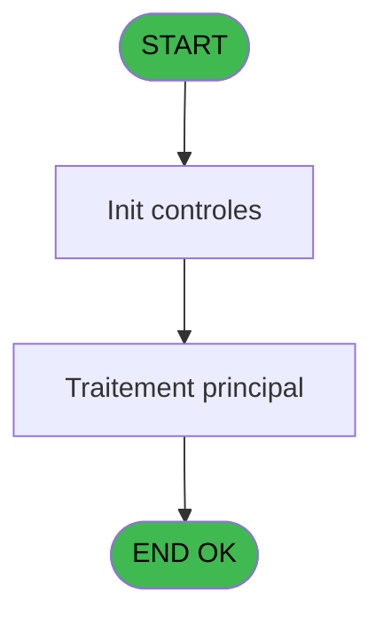

# PBP IDE 13 - Edition fiches d'immigrations

> **Analyse**: Phases 1-4 2026-02-03 01:01 -> 01:01 (37s) | Assemblage 01:01
> **Pipeline**: V7.2 Enrichi
> **Structure**: 4 onglets (Resume | Ecrans | Donnees | Connexions)

<!-- TAB:Resume -->

## 1. FICHE D'IDENTITE

| Attribut | Valeur |
|----------|--------|
| Projet | PBP |
| IDE Position | 13 |
| Nom Programme | Edition fiches d'immigrations |
| Fichier source | `Prg_13.xml` |
| Domaine metier | Impression |
| Taches | 1 (1 ecrans visibles) |
| Tables modifiees | 0 |
| Programmes appeles | 1 |
| :warning: Statut | **ORPHELIN_POTENTIEL** |

## 2. DESCRIPTION FONCTIONNELLE

**Edition fiches d'immigrations** assure la gestion complete de ce processus.

Le flux de traitement s'organise en **1 blocs fonctionnels** :

- **Impression** (1 tache) : generation de tickets et documents

## 3. BLOCS FONCTIONNELS

### 3.1 Impression (1 tache)

Generation des documents et tickets.

---

#### 13 - Edition fiches d'immigrations [[ECRAN]](#ecran-t1)

**Role** : Generation du document : Edition fiches d'immigrations.
**Ecran** : 950 x 231 DLU (MDI) | [Voir mockup](#ecran-t1)
**Delegue a** : [  Edition Fiches (IDE 15)](PBP-IDE-15.md)

## 5. REGLES METIER

*(Aucune regle metier identifiee)*

## 6. CONTEXTE

- **Appele par**: (aucun)
- **Appelle**: 1 programmes | **Tables**: 0 (W:0 R:0 L:0) | **Taches**: 1 | **Expressions**: 5

<!-- TAB:Ecrans -->

## 8. ECRANS

### 8.1 Forms visibles (1 / 1)

| # | Position | Tache | Nom | Type | Largeur | Hauteur | Bloc |
|---|----------|-------|-----|------|---------|---------|------|
| 1 | 13 | 13 | Edition fiches d'immigrations | MDI | 950 | 231 | Impression |

### 8.2 Mockups Ecrans

---

#### 13 - Edition fiches d'immigrations
**Tache** : [13](#t1) | **Type** : MDI | **Dimensions** : 950 x 231 DLU
**Bloc** : Impression | **Titre IDE** : Edition fiches d'immigrations

<!-- FORM-DATA:
{
    "width":  950,
    "vFactor":  8,
    "type":  "MDI",
    "hFactor":  8,
    "controls":  [
                     {
                         "x":  1,
                         "type":  "label",
                         "var":  "",
                         "y":  1,
                         "w":  950,
                         "fmt":  "",
                         "name":  "",
                         "h":  19,
                         "color":  "1",
                         "text":  "",
                         "parent":  null
                     },
                     {
                         "x":  49,
                         "type":  "label",
                         "var":  "",
                         "y":  32,
                         "w":  348,
                         "fmt":  "",
                         "name":  "",
                         "h":  40,
                         "color":  "7",
                         "text":  "Croisière",
                         "parent":  null
                     },
                     {
                         "x":  485,
                         "type":  "label",
                         "var":  "",
                         "y":  32,
                         "w":  416,
                         "fmt":  "",
                         "name":  "",
                         "h":  40,
                         "color":  "7",
                         "text":  "Port d\u0027embarquement",
                         "parent":  null
                     },
                     {
                         "x":  129,
                         "type":  "label",
                         "var":  "",
                         "y":  50,
                         "w":  40,
                         "fmt":  "",
                         "name":  "",
                         "h":  10,
                         "color":  "103",
                         "text":  "Du",
                         "parent":  4
                     },
                     {
                         "x":  483,
                         "type":  "label",
                         "var":  "",
                         "y":  77,
                         "w":  416,
                         "fmt":  "",
                         "name":  "",
                         "h":  54,
                         "color":  "7",
                         "text":  "Adresse sur le pays",
                         "parent":  null
                     },
                     {
                         "x":  485,
                         "type":  "label",
                         "var":  "",
                         "y":  141,
                         "w":  416,
                         "fmt":  "",
                         "name":  "",
                         "h":  58,
                         "color":  "7",
                         "text":  "Formulaire à éditer",
                         "parent":  null
                     },
                     {
                         "x":  1,
                         "type":  "label",
                         "var":  "",
                         "y":  206,
                         "w":  947,
                         "fmt":  "",
                         "name":  "",
                         "h":  24,
                         "color":  "1",
                         "text":  "",
                         "parent":  null
                     },
                     {
                         "x":  181,
                         "type":  "edit",
                         "var":  "",
                         "y":  50,
                         "w":  134,
                         "fmt":  "DD/MM/YYYY",
                         "name":  "v.date du",
                         "h":  10,
                         "color":  "110",
                         "text":  "",
                         "parent":  4
                     },
                     {
                         "x":  572,
                         "type":  "edit",
                         "var":  "",
                         "y":  50,
                         "w":  115,
                         "fmt":  "U10",
                         "name":  "v.port d\u0027embarquement",
                         "h":  10,
                         "color":  "110",
                         "text":  "",
                         "parent":  5
                     },
                     {
                         "x":  572,
                         "type":  "edit",
                         "var":  "",
                         "y":  95,
                         "w":  238,
                         "fmt":  "U20",
                         "name":  "v. adresse 1",
                         "h":  10,
                         "color":  "110",
                         "text":  "",
                         "parent":  9
                     },
                     {
                         "x":  572,
                         "type":  "edit",
                         "var":  "",
                         "y":  111,
                         "w":  238,
                         "fmt":  "U20",
                         "name":  "v. adresse 2",
                         "h":  10,
                         "color":  "110",
                         "text":  "",
                         "parent":  9
                     },
                     {
                         "x":  507,
                         "type":  "radio",
                         "var":  "",
                         "y":  152,
                         "w":  350,
                         "fmt":  "",
                         "name":  "v.fiche",
                         "h":  43,
                         "color":  "103",
                         "text":  "1    Virgin Gorda,2    I 94 ,3    I 94W",
                         "parent":  null
                     },
                     {
                         "x":  170,
                         "type":  "button",
                         "var":  "",
                         "y":  209,
                         "w":  154,
                         "fmt":  "\u0026Ok",
                         "name":  "b.ok",
                         "h":  18,
                         "color":  "",
                         "text":  "",
                         "parent":  null
                     },
                     {
                         "x":  786,
                         "type":  "button",
                         "var":  "",
                         "y":  210,
                         "w":  154,
                         "fmt":  "\u0026Test",
                         "name":  "b.Test",
                         "h":  18,
                         "color":  "",
                         "text":  "",
                         "parent":  null
                     },
                     {
                         "x":  7,
                         "type":  "edit",
                         "var":  "",
                         "y":  7,
                         "w":  267,
                         "fmt":  "30",
                         "name":  "",
                         "h":  8,
                         "color":  "",
                         "text":  "",
                         "parent":  1
                     },
                     {
                         "x":  592,
                         "type":  "edit",
                         "var":  "",
                         "y":  7,
                         "w":  317,
                         "fmt":  "WWW DD MMM YYYYT",
                         "name":  "",
                         "h":  8,
                         "color":  "",
                         "text":  "",
                         "parent":  1
                     },
                     {
                         "x":  54,
                         "type":  "image",
                         "var":  "",
                         "y":  106,
                         "w":  240,
                         "fmt":  "",
                         "name":  "",
                         "h":  71,
                         "color":  "",
                         "text":  "",
                         "parent":  null
                     },
                     {
                         "x":  9,
                         "type":  "button",
                         "var":  "",
                         "y":  209,
                         "w":  154,
                         "fmt":  "\u0026Quitter",
                         "name":  "",
                         "h":  18,
                         "color":  "",
                         "text":  "",
                         "parent":  14
                     }
                 ],
    "taskId":  "13",
    "height":  231
}
-->

<strong>Champs : 6 champs</strong>

| Pos (x,y) | Nom | Variable | Type |
|-----------|-----|----------|------|
| 181,50 | v.date du | - | edit |
| 572,50 | v.port d'embarquement | - | edit |
| 572,95 | v. adresse 1 | - | edit |
| 572,111 | v. adresse 2 | - | edit |
| 7,7 | 30 | - | edit |
| 592,7 | WWW DD MMM YYYYT | - | edit |

<strong>Boutons : 3 boutons</strong>

| Bouton | Pos (x,y) | Action |
|--------|-----------|--------|
| Ok | 170,209 | Valide la saisie et enregistre |
| Test | 786,210 | Bouton fonctionnel |
| Quitter | 9,209 | Quitte le programme |

## 9. NAVIGATION

Ecran unique: **Edition fiches d'immigrations**

### 9.3 Structure hierarchique (1 tache)

| Position | Tache | Type | Dimensions | Bloc |
|----------|-------|------|------------|------|
| **13.1** | [**Edition fiches d'immigrations** (13)](#t1) [mockup](#ecran-t1) | MDI | 950x231 | Impression |

### 9.4 Algorigramme

> **Legende**: Vert = START/END OK | Rouge = END KO | Bleu = Decisions
> *Algorigramme auto-genere. Utiliser `/algorigramme` pour une synthese metier detaillee.*

<!-- TAB:Donnees -->

## 10. TABLES

### Tables utilisees (0)

| ID | Nom | Description | Type | R | W | L | Usages |
|----|-----|-------------|------|---|---|---|--------|

### Colonnes par table (0 / 0 tables avec colonnes identifiees)

## 11. VARIABLES

### 11.1 Variables de session (6)

Variables persistantes pendant toute la session.

| Lettre | Nom | Type | Usage dans |
|--------|-----|------|-----------|
| A | v.date du | Date | - |
| B | v.date au | Date | - |
| C | v.port d'embarquement | Alpha | - |
| D | v. adresse 1 | Alpha | - |
| E | v. adresse 2 | Alpha | - |
| F | v.fiche | Alpha | 1x session |

### 11.2 Autres (2)

Variables diverses.

| Lettre | Nom | Type | Usage dans |
|--------|-----|------|-----------|
| G | b.ok | Alpha | - |
| H | b.Test | Alpha | - |

## 12. EXPRESSIONS

**5 / 5 expressions decodees (100%)**

### 12.1 Repartition par type

| Type | Expressions | Regles |
|------|-------------|--------|
| CONSTANTE | 1 | 0 |
| DATE | 1 | 0 |
| REFERENCE_VG | 1 | 0 |
| CAST_LOGIQUE | 1 | 0 |
| CONDITION | 1 | 0 |

### 12.2 Expressions cles par type

#### CONSTANTE (1 expressions)

| Type | IDE | Expression | Regle |
|------|-----|------------|-------|
| CONSTANTE | 3 | `'CLUB MED 2'` | - |

#### DATE (1 expressions)

| Type | IDE | Expression | Regle |
|------|-----|------------|-------|
| DATE | 1 | `Date ()` | - |

#### REFERENCE_VG (1 expressions)

| Type | IDE | Expression | Regle |
|------|-----|------------|-------|
| REFERENCE_VG | 2 | `VG1` | - |

#### CAST_LOGIQUE (1 expressions)

| Type | IDE | Expression | Regle |
|------|-----|------------|-------|
| CAST_LOGIQUE | 4 | `'TRUE'LOG` | - |

#### CONDITION (1 expressions)

| Type | IDE | Expression | Regle |
|------|-----|------------|-------|
| CONDITION | 5 | `v.fiche [F]<>''` | - |

<!-- TAB:Connexions -->

## 13. GRAPHE D'APPELS

### 13.1 Chaine depuis Main (Callers)

**Chemin**: (pas de callers directs)

### 13.2 Callers

| IDE | Nom Programme | Nb Appels |
|-----|---------------|-----------|
| - | (aucun) | - |

### 13.3 Callees (programmes appeles)

### 13.4 Detail Callees avec contexte

| IDE | Nom Programme | Appels | Contexte |
|-----|---------------|--------|----------|
| [15](PBP-IDE-15.md) |   Edition Fiches | 2 | Impression ticket/document |

## 14. RECOMMANDATIONS MIGRATION

### 14.1 Profil du programme

| Metrique | Valeur | Impact migration |
|----------|--------|-----------------|
| Lignes de logique | 18 | Programme compact |
| Expressions | 5 | Peu de logique |
| Tables WRITE | 0 | Impact faible |
| Sous-programmes | 1 | Peu de dependances |
| Ecrans visibles | 1 | Ecran unique ou traitement batch |
| Code desactive | 0% (0 / 18) | Code sain |
| Regles metier | 0 | Pas de regle identifiee |

### 14.2 Plan de migration par bloc

#### Impression (1 tache: 1 ecran, 0 traitement)

- **Strategie** : Templates HTML -> PDF via wkhtmltopdf ou Puppeteer.
- `PrintService` injectable avec choix imprimante

### 14.3 Dependances critiques

| Dependance | Type | Appels | Impact |
|------------|------|--------|--------|
| [  Edition Fiches (IDE 15)](PBP-IDE-15.md) | Sous-programme | 2x | Haute - Impression ticket/document |

---
*Spec DETAILED generee par Pipeline V7.2 - 2026-02-03 01:01*
