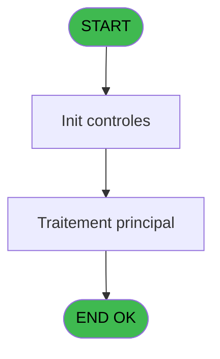
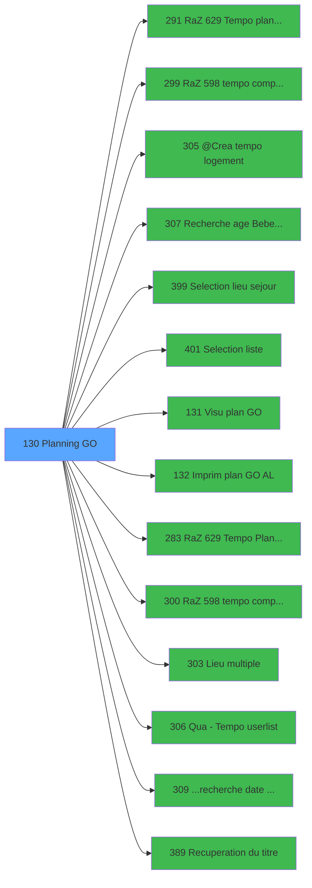

# PBP IDE 130 - Planning GO

> **Analyse**: Phases 1-4 2026-02-03 15:24 -> 15:24 (19s) | Assemblage 15:24
> **Pipeline**: V7.2 Enrichi
> **Structure**: 4 onglets (Resume | Ecrans | Donnees | Connexions)

<!-- TAB:Resume -->

## 1. FICHE D'IDENTITE

| Attribut | Valeur |
|----------|--------|
| Projet | PBP |
| IDE Position | 130 |
| Nom Programme | Planning GO |
| Fichier source | `Prg_130.xml` |
| Dossier IDE | Gestion |
| Taches | 1 (1 ecrans visibles) |
| Tables modifiees | 0 |
| Programmes appeles | 14 |
| :warning: Statut | **ORPHELIN_POTENTIEL** |

## 2. DESCRIPTION FONCTIONNELLE

**Planning GO** assure la gestion complete de ce processus.

Le flux de traitement s'organise en **1 blocs fonctionnels** :

- **Traitement** (1 tache) : traitements metier divers

## 3. BLOCS FONCTIONNELS

### 3.1 Traitement (1 tache)

Traitements internes.

---

#### 130 - Planning GO [[ECRAN]](#ecran-t1)

**Role** : Traitement : Planning GO.
**Ecran** : 1000 x 191 DLU (MDI) | [Voir mockup](#ecran-t1)
**Delegue a** : [RaZ 629 Tempo planning (IDE 291)](PBP-IDE-291.md), [@Crea tempo logement (IDE 305)](PBP-IDE-305.md), [  Visu plan GO (IDE 131)](PBP-IDE-131.md)

## 5. REGLES METIER

*(Aucune regle metier identifiee)*

## 6. CONTEXTE

- **Appele par**: (aucun)
- **Appelle**: 14 programmes | **Tables**: 5 (W:0 R:1 L:4) | **Taches**: 1 | **Expressions**: 36

<!-- TAB:Ecrans -->

## 8. ECRANS

### 8.1 Forms visibles (1 / 1)

| # | Position | Tache | Nom | Type | Largeur | Hauteur | Bloc |
|---|----------|-------|-----|------|---------|---------|------|
| 1 | 130 | 130 | Planning GO | MDI | 1000 | 191 | Traitement |

### 8.2 Mockups Ecrans

---

#### 130 - Planning GO
**Tache** : [130](#t1) | **Type** : MDI | **Dimensions** : 1000 x 191 DLU
**Bloc** : Traitement | **Titre IDE** : Planning GO

<!-- FORM-DATA:
{
    "width":  1000,
    "vFactor":  8,
    "type":  "MDI",
    "hFactor":  8,
    "controls":  [
                     {
                         "x":  1,
                         "type":  "label",
                         "var":  "",
                         "y":  0,
                         "w":  993,
                         "fmt":  "",
                         "name":  "",
                         "h":  20,
                         "color":  "1",
                         "text":  "",
                         "parent":  null
                     },
                     {
                         "x":  389,
                         "type":  "label",
                         "var":  "",
                         "y":  25,
                         "w":  409,
                         "fmt":  "",
                         "name":  "",
                         "h":  137,
                         "color":  "195",
                         "text":  "Paramètres",
                         "parent":  null
                     },
                     {
                         "x":  14,
                         "type":  "table",
                         "var":  "",
                         "name":  "",
                         "titleH":  12,
                         "color":  "110",
                         "w":  371,
                         "y":  27,
                         "fmt":  "",
                         "parent":  null,
                         "text":  "",
                         "rowH":  11,
                         "h":  133,
                         "cols":  [
                                      {
                                          "title":  "",
                                          "layer":  1,
                                          "w":  336
                                      }
                                  ],
                         "rows":  1
                     },
                     {
                         "x":  800,
                         "type":  "label",
                         "var":  "",
                         "y":  29,
                         "w":  186,
                         "fmt":  "",
                         "name":  "",
                         "h":  133,
                         "color":  "",
                         "text":  "",
                         "parent":  null
                     },
                     {
                         "x":  476,
                         "type":  "label",
                         "var":  "",
                         "y":  38,
                         "w":  224,
                         "fmt":  "",
                         "name":  "",
                         "h":  45,
                         "color":  "",
                         "text":  "",
                         "parent":  5
                     },
                     {
                         "x":  512,
                         "type":  "label",
                         "var":  "",
                         "y":  45,
                         "w":  46,
                         "fmt":  "",
                         "name":  "",
                         "h":  9,
                         "color":  "",
                         "text":  "Total",
                         "parent":  9
                     },
                     {
                         "x":  512,
                         "type":  "label",
                         "var":  "",
                         "y":  66,
                         "w":  78,
                         "fmt":  "",
                         "name":  "",
                         "h":  9,
                         "color":  "",
                         "text":  "Sélection",
                         "parent":  9
                     },
                     {
                         "x":  397,
                         "type":  "label",
                         "var":  "",
                         "y":  109,
                         "w":  55,
                         "fmt":  "",
                         "name":  "",
                         "h":  9,
                         "color":  "",
                         "text":  "Date",
                         "parent":  5
                     },
                     {
                         "x":  397,
                         "type":  "label",
                         "var":  "",
                         "y":  124,
                         "w":  100,
                         "fmt":  "",
                         "name":  "",
                         "h":  9,
                         "color":  "",
                         "text":  "Lieu séjour",
                         "parent":  5
                     },
                     {
                         "x":  398,
                         "type":  "label",
                         "var":  "",
                         "y":  138,
                         "w":  53,
                         "fmt":  "",
                         "name":  "",
                         "h":  9,
                         "color":  "",
                         "text":  "Liste",
                         "parent":  5
                     },
                     {
                         "x":  0,
                         "type":  "label",
                         "var":  "",
                         "y":  166,
                         "w":  993,
                         "fmt":  "",
                         "name":  "",
                         "h":  24,
                         "color":  "1",
                         "text":  "",
                         "parent":  null
                     },
                     {
                         "x":  497,
                         "type":  "edit",
                         "var":  "",
                         "y":  109,
                         "w":  126,
                         "fmt":  "",
                         "name":  "w0_Date",
                         "h":  10,
                         "color":  "110",
                         "text":  "",
                         "parent":  5
                     },
                     {
                         "x":  625,
                         "type":  "button",
                         "var":  "",
                         "y":  109,
                         "w":  25,
                         "fmt":  "...",
                         "name":  "b_Date",
                         "h":  10,
                         "color":  "",
                         "text":  "",
                         "parent":  5
                     },
                     {
                         "x":  498,
                         "type":  "edit",
                         "var":  "",
                         "y":  138,
                         "w":  182,
                         "fmt":  "",
                         "name":  "w0_Liste",
                         "h":  10,
                         "color":  "110",
                         "text":  "",
                         "parent":  5
                     },
                     {
                         "x":  683,
                         "type":  "button",
                         "var":  "",
                         "y":  138,
                         "w":  25,
                         "fmt":  "...",
                         "name":  "b_Liste",
                         "h":  10,
                         "color":  "",
                         "text":  "",
                         "parent":  5
                     },
                     {
                         "x":  497,
                         "type":  "edit",
                         "var":  "",
                         "y":  124,
                         "w":  26,
                         "fmt":  "",
                         "name":  "w0_LieuSejour",
                         "h":  10,
                         "color":  "110",
                         "text":  "",
                         "parent":  5
                     },
                     {
                         "x":  556,
                         "type":  "edit",
                         "var":  "",
                         "y":  125,
                         "w":  232,
                         "fmt":  "",
                         "name":  "",
                         "h":  8,
                         "color":  "142",
                         "text":  "",
                         "parent":  5
                     },
                     {
                         "x":  526,
                         "type":  "button",
                         "var":  "",
                         "y":  124,
                         "w":  25,
                         "fmt":  "...",
                         "name":  "bouton lieu sejour",
                         "h":  10,
                         "color":  "",
                         "text":  "",
                         "parent":  null
                     },
                     {
                         "x":  56,
                         "type":  "edit",
                         "var":  "",
                         "y":  29,
                         "w":  277,
                         "fmt":  "",
                         "name":  "",
                         "h":  8,
                         "color":  "110",
                         "text":  "",
                         "parent":  6
                     },
                     {
                         "x":  20,
                         "type":  "checkbox",
                         "var":  "",
                         "y":  29,
                         "w":  30,
                         "fmt":  "",
                         "name":  "TUL MARQUEUR",
                         "h":  9,
                         "color":  "110",
                         "text":  "",
                         "parent":  6
                     },
                     {
                         "x":  604,
                         "type":  "edit",
                         "var":  "",
                         "y":  45,
                         "w":  56,
                         "fmt":  "",
                         "name":  "",
                         "h":  9,
                         "color":  "",
                         "text":  "",
                         "parent":  9
                     },
                     {
                         "x":  604,
                         "type":  "edit",
                         "var":  "",
                         "y":  66,
                         "w":  56,
                         "fmt":  "",
                         "name":  "",
                         "h":  9,
                         "color":  "",
                         "text":  "",
                         "parent":  9
                     },
                     {
                         "x":  816,
                         "type":  "button",
                         "var":  "",
                         "y":  113,
                         "w":  154,
                         "fmt":  "\u0026Ecran",
                         "name":  "b_Ecran",
                         "h":  18,
                         "color":  "",
                         "text":  "",
                         "parent":  8
                     },
                     {
                         "x":  816,
                         "type":  "button",
                         "var":  "",
                         "y":  135,
                         "w":  154,
                         "fmt":  "\u0026Impression",
                         "name":  "b_Edition",
                         "h":  18,
                         "color":  "",
                         "text":  "",
                         "parent":  8
                     },
                     {
                         "x":  6,
                         "type":  "edit",
                         "var":  "",
                         "y":  2,
                         "w":  267,
                         "fmt":  "20",
                         "name":  "",
                         "h":  8,
                         "color":  "",
                         "text":  "",
                         "parent":  1
                     },
                     {
                         "x":  717,
                         "type":  "edit",
                         "var":  "",
                         "y":  6,
                         "w":  267,
                         "fmt":  "WWW DD MMM YYYYT",
                         "name":  "",
                         "h":  8,
                         "color":  "",
                         "text":  "",
                         "parent":  1
                     },
                     {
                         "x":  6,
                         "type":  "edit",
                         "var":  "",
                         "y":  11,
                         "w":  331,
                         "fmt":  "25",
                         "name":  "",
                         "h":  8,
                         "color":  "",
                         "text":  "",
                         "parent":  1
                     },
                     {
                         "x":  810,
                         "type":  "image",
                         "var":  "",
                         "y":  46,
                         "w":  162,
                         "fmt":  "",
                         "name":  "",
                         "h":  53,
                         "color":  "",
                         "text":  "",
                         "parent":  8
                     },
                     {
                         "x":  8,
                         "type":  "button",
                         "var":  "",
                         "y":  169,
                         "w":  154,
                         "fmt":  "\u0026Quitter",
                         "name":  "",
                         "h":  18,
                         "color":  "",
                         "text":  "",
                         "parent":  22
                     }
                 ],
    "taskId":  "130",
    "height":  191
}
-->

<strong>Champs : 11 champs</strong>

| Pos (x,y) | Nom | Variable | Type |
|-----------|-----|----------|------|
| 497,109 | w0_Date | - | edit |
| 498,138 | w0_Liste | - | edit |
| 497,124 | w0_LieuSejour | - | edit |
| 556,125 | (sans nom) | - | edit |
| 56,29 | (sans nom) | - | edit |
| 20,29 | TUL MARQUEUR | - | checkbox |
| 604,45 | (sans nom) | - | edit |
| 604,66 | (sans nom) | - | edit |
| 6,2 | 20 | - | edit |
| 717,6 | WWW DD MMM YYYYT | - | edit |
| 6,11 | 25 | - | edit |

<strong>Boutons : 6 boutons</strong>

| Bouton | Pos (x,y) | Action |
|--------|-----------|--------|
| ... | 625,109 | Appel [...recherche date minimum (IDE 309)](PBP-IDE-309.md) |
| ... | 683,138 | Appel [...recherche date minimum (IDE 309)](PBP-IDE-309.md) |
| ... | 526,124 | Appel [...recherche date minimum (IDE 309)](PBP-IDE-309.md) |
| Ecran | 816,113 | Bouton fonctionnel |
| Impression | 816,135 | Bouton fonctionnel |
| Quitter | 8,169 | Quitte le programme |

## 9. NAVIGATION

Ecran unique: **Planning GO**

### 9.3 Structure hierarchique (1 tache)

| Position | Tache | Type | Dimensions | Bloc |
|----------|-------|------|------------|------|
| **130.1** | [**Planning GO** (130)](#t1) [mockup](#ecran-t1) | MDI | 1000x191 | Traitement |

### 9.4 Algorigramme

> **Legende**: Vert = START/END OK | Rouge = END KO | Bleu = Decisions
> *Algorigramme auto-genere. Utiliser `/algorigramme` pour une synthese metier detaillee.*

<!-- TAB:Donnees -->

## 10. TABLES

### Tables utilisees (5)

| ID | Nom | Description | Type | R | W | L | Usages |
|----|-----|-------------|------|---|---|---|--------|
| 81 | societe__________soc |  | DB | R |   |   | 1 |
| 118 | tables_imports |  | DB |   |   | L | 1 |
| 120 | tables_qualites__qua |  | DB |   |   | L | 1 |
| 134 | groupe_arr_dep___vol |  | DB |   |   | L | 1 |
| 637 | tempo_zone_secteur | Table temporaire ecran | DB |   |   | L | 1 |

### Colonnes par table (1 / 1 tables avec colonnes identifiees)

Table 81 - societe__________soc (R) - 1 usages

| Lettre | Variable | Acces | Type |
|--------|----------|-------|------|
| A | w0_Categorie(TUL) | R | Alpha |
| B | w0_TypeVol | R | Alpha |
| C | w0_Date | R | Date |
| D | b_Date | R | Alpha |
| E | w0_Liste | R | Alpha |
| F | b_Liste | R | Alpha |
| G | W0 top liste | R | Alpha |
| H | retour categorie | R | Logical |
| I | w0_Categorie | R | Alpha |
| J | b_Categorie | R | Alpha |
| K | w0_LieuSejour | R | Alpha |
| L | bouton lieu sejour | R | Alpha |
| M | bouton sejour | R | Alpha |
| N | w0_Total | R | Numeric |
| O | w0_Selection | R | Numeric |
| P | v. titre | R | Alpha |
| Q | W0 nom societe | R | Alpha |
| R | W0 date minimum | R | Date |
| S | w0_SejourMulti | R | Logical |
| T | w0_AgeBebe | R | Numeric |
| U | w0_AgeEnfant | R | Numeric |
| V | b_Ecran | R | Alpha |
| W | b_Edition | R | Alpha |

## 11. VARIABLES

### 11.1 Variables de session (1)

Variables persistantes pendant toute la session.

| Lettre | Nom | Type | Usage dans |
|--------|-----|------|-----------|
| P | v. titre | Alpha | 1x session |

### 11.2 Variables de travail (3)

Variables internes au programme.

| Lettre | Nom | Type | Usage dans |
|--------|-----|------|-----------|
| G | W0 top liste | Alpha | - |
| Q | W0 nom societe | Alpha | - |
| R | W0 date minimum | Date | - |

### 11.3 Autres (19)

Variables diverses.

| Lettre | Nom | Type | Usage dans |
|--------|-----|------|-----------|
| A | w0_Categorie(TUL) | Alpha | 1x refs |
| B | w0_TypeVol | Alpha | 1x refs |
| C | w0_Date | Date | 1x refs |
| D | b_Date | Alpha | - |
| E | w0_Liste | Alpha | - |
| F | b_Liste | Alpha | - |
| H | retour categorie | Logical | - |
| I | w0_Categorie | Alpha | 1x refs |
| J | b_Categorie | Alpha | - |
| K | w0_LieuSejour | Alpha | - |
| L | bouton lieu sejour | Alpha | - |
| M | bouton sejour | Alpha | - |
| N | w0_Total | Numeric | - |
| O | w0_Selection | Numeric | - |
| S | w0_SejourMulti | Logical | - |
| T | w0_AgeBebe | Numeric | - |
| U | w0_AgeEnfant | Numeric | - |
| V | b_Ecran | Alpha | - |
| W | b_Edition | Alpha | 1x refs |

Toutes les 23 variables (liste complete)

| Cat | Lettre | Nom Variable | Type |
|-----|--------|--------------|------|
| W0 | **G** | W0 top liste | Alpha |
| W0 | **Q** | W0 nom societe | Alpha |
| W0 | **R** | W0 date minimum | Date |
| V. | **P** | v. titre | Alpha |
| Autre | **A** | w0_Categorie(TUL) | Alpha |
| Autre | **B** | w0_TypeVol | Alpha |
| Autre | **C** | w0_Date | Date |
| Autre | **D** | b_Date | Alpha |
| Autre | **E** | w0_Liste | Alpha |
| Autre | **F** | b_Liste | Alpha |
| Autre | **H** | retour categorie | Logical |
| Autre | **I** | w0_Categorie | Alpha |
| Autre | **J** | b_Categorie | Alpha |
| Autre | **K** | w0_LieuSejour | Alpha |
| Autre | **L** | bouton lieu sejour | Alpha |
| Autre | **M** | bouton sejour | Alpha |
| Autre | **N** | w0_Total | Numeric |
| Autre | **O** | w0_Selection | Numeric |
| Autre | **S** | w0_SejourMulti | Logical |
| Autre | **T** | w0_AgeBebe | Numeric |
| Autre | **U** | w0_AgeEnfant | Numeric |
| Autre | **V** | b_Ecran | Alpha |
| Autre | **W** | b_Edition | Alpha |

## 12. EXPRESSIONS

**36 / 36 expressions decodees (100%)**

### 12.1 Repartition par type

| Type | Expressions | Regles |
|------|-------------|--------|
| CONSTANTE | 15 | 0 |
| DATE | 1 | 0 |
| OTHER | 13 | 0 |
| REFERENCE_VG | 2 | 0 |
| CAST_LOGIQUE | 2 | 0 |
| CONDITION | 2 | 0 |
| STRING | 1 | 0 |

### 12.2 Expressions cles par type

#### CONSTANTE (15 expressions)

| Type | IDE | Expression | Regle |
|------|-----|------------|-------|
| CONSTANTE | 21 | `'TQUGO'` | - |
| CONSTANTE | 19 | `'P'` | - |
| CONSTANTE | 16 | `'Planning'` | - |
| CONSTANTE | 24 | `'A'` | - |
| CONSTANTE | 36 | `'8 : Planning List of Gos by room number'` | - |
| ... | | *+10 autres* | |

#### DATE (1 expressions)

| Type | IDE | Expression | Regle |
|------|-----|------------|-------|
| DATE | 14 | `Date ()` | - |

#### OTHER (13 expressions)

| Type | IDE | Expression | Regle |
|------|-----|------------|-------|
| OTHER | 26 | `w0_Date [C]` | - |
| OTHER | 25 | `w0_TypeVol [B]` | - |
| OTHER | 23 | `[X]` | - |
| OTHER | 32 | `GetParam ('VILLAGE')` | - |
| OTHER | 29 | `SetCrsr (1)` | - |
| ... | | *+8 autres* | |

#### REFERENCE_VG (2 expressions)

| Type | IDE | Expression | Regle |
|------|-----|------------|-------|
| REFERENCE_VG | 20 | `VG1` | - |
| REFERENCE_VG | 13 | `VG2` | - |

#### CAST_LOGIQUE (2 expressions)

| Type | IDE | Expression | Regle |
|------|-----|------------|-------|
| CAST_LOGIQUE | 35 | `'FALSE'LOG` | - |
| CAST_LOGIQUE | 30 | `[AP] AND 'FALSE'LOG` | - |

#### CONDITION (2 expressions)

| Type | IDE | Expression | Regle |
|------|-----|------------|-------|
| CONDITION | 34 | `[AJ]=0` | - |
| CONDITION | 33 | `[AJ]<>0` | - |

#### STRING (1 expressions)

| Type | IDE | Expression | Regle |
|------|-----|------------|-------|
| STRING | 11 | `Trim ([AK])` | - |

### 12.3 Toutes les expressions (36)

Voir les 36 expressions

#### CONSTANTE (15)

| IDE | Expression Decodee |
|-----|-------------------|
| 1 | `''` |
| 3 | `'VBEBE'` |
| 4 | `'VENFA'` |
| 5 | `'PL'` |
| 7 | `'G10'` |
| 8 | `'Se&jour'` |
| 10 | `'...'` |
| 12 | `8` |
| 16 | `'Planning'` |
| 19 | `'P'` |
| 21 | `'TQUGO'` |
| 24 | `'A'` |
| 27 | `'M'` |
| 31 | `0` |
| 36 | `'8 : Planning List of Gos by room number'` |

#### DATE (1)

| IDE | Expression Decodee |
|-----|-------------------|
| 14 | `Date ()` |

#### OTHER (13)

| IDE | Expression Decodee |
|-----|-------------------|
| 2 | `GetParam ('LIEU_SEJOUR')` |
| 6 | `[AN]` |
| 9 | `v. titre [P]` |
| 15 | `MlsTrans ('Toutes')` |
| 17 | `GetParam ('SOCIETE')` |
| 18 | `w0_Categorie(TUL) [A]` |
| 22 | `b_Edition [W]` |
| 23 | `[X]` |
| 25 | `w0_TypeVol [B]` |
| 26 | `w0_Date [C]` |
| 28 | `SetCrsr (2)` |
| 29 | `SetCrsr (1)` |
| 32 | `GetParam ('VILLAGE')` |

#### REFERENCE_VG (2)

| IDE | Expression Decodee |
|-----|-------------------|
| 13 | `VG2` |
| 20 | `VG1` |

#### CAST_LOGIQUE (2)

| IDE | Expression Decodee |
|-----|-------------------|
| 30 | `[AP] AND 'FALSE'LOG` |
| 35 | `'FALSE'LOG` |

#### CONDITION (2)

| IDE | Expression Decodee |
|-----|-------------------|
| 33 | `[AJ]<>0` |
| 34 | `[AJ]=0` |

#### STRING (1)

| IDE | Expression Decodee |
|-----|-------------------|
| 11 | `Trim ([AK])` |

<!-- TAB:Connexions -->

## 13. GRAPHE D'APPELS

### 13.1 Chaine depuis Main (Callers)

**Chemin**: (pas de callers directs)

### 13.2 Callers

| IDE | Nom Programme | Nb Appels |
|-----|---------------|-----------|
| - | (aucun) | - |

### 13.3 Callees (programmes appeles)

### 13.4 Detail Callees avec contexte

| IDE | Nom Programme | Appels | Contexte |
|-----|---------------|--------|----------|
| [291](PBP-IDE-291.md) | RaZ 629 Tempo planning | 2 | Reinitialisation |
| [299](PBP-IDE-299.md) | RaZ 598 tempo comptage | 2 | Reinitialisation |
| [305](PBP-IDE-305.md) | @Crea tempo logement | 2 | Sous-programme |
| [307](PBP-IDE-307.md) | Recherche age Bebe_Enfant | 2 | Sous-programme |
| [399](PBP-IDE-399.md) | Selection lieu sejour | 2 | Selection/consultation |
| [401](PBP-IDE-401.md) | Selection liste | 2 | Selection/consultation |
| [131](PBP-IDE-131.md) |   Visu plan GO | 1 | Sous-programme |
| [132](PBP-IDE-132.md) |   Imprim plan GO AL | 1 | Impression ticket/document |
| [283](PBP-IDE-283.md) | RaZ 629 Tempo Planning | 1 | Reinitialisation |
| [300](PBP-IDE-300.md) | RaZ 598 tempo comptage eff | 1 | Reinitialisation |
| [303](PBP-IDE-303.md) | Lieu multiple | 1 | Sous-programme |
| [306](PBP-IDE-306.md) | Qua -> Tempo userlist | 1 | Configuration impression |
| [309](PBP-IDE-309.md) | ...recherche date minimum | 1 | Sous-programme |
| [389](PBP-IDE-389.md) | Recuperation du titre | 1 | Recuperation donnees |

## 14. RECOMMANDATIONS MIGRATION

### 14.1 Profil du programme

| Metrique | Valeur | Impact migration |
|----------|--------|-----------------|
| Lignes de logique | 122 | Programme compact |
| Expressions | 36 | Peu de logique |
| Tables WRITE | 0 | Impact faible |
| Sous-programmes | 14 | Forte dependance |
| Ecrans visibles | 1 | Ecran unique ou traitement batch |
| Code desactive | 0% (0 / 122) | Code sain |
| Regles metier | 0 | Pas de regle identifiee |

### 14.2 Plan de migration par bloc

#### Traitement (1 tache: 1 ecran, 0 traitement)

- **Strategie** : 1 composant(s) UI (Razor/React) avec formulaires et validation.
- 14 sous-programme(s) a migrer ou a reutiliser depuis les services existants.
- Decomposer les taches en services unitaires testables.

### 14.3 Dependances critiques

| Dependance | Type | Appels | Impact |
|------------|------|--------|--------|
| [Recherche age Bebe_Enfant (IDE 307)](PBP-IDE-307.md) | Sous-programme | 2x | Haute - Sous-programme |
| [Selection lieu sejour (IDE 399)](PBP-IDE-399.md) | Sous-programme | 2x | Haute - Selection/consultation |
| [Selection liste (IDE 401)](PBP-IDE-401.md) | Sous-programme | 2x | Haute - Selection/consultation |
| [RaZ 629 Tempo planning (IDE 291)](PBP-IDE-291.md) | Sous-programme | 2x | Haute - Reinitialisation |
| [RaZ 598 tempo comptage (IDE 299)](PBP-IDE-299.md) | Sous-programme | 2x | Haute - Reinitialisation |
| [@Crea tempo logement (IDE 305)](PBP-IDE-305.md) | Sous-programme | 2x | Haute - Sous-programme |
| [Qua -> Tempo userlist (IDE 306)](PBP-IDE-306.md) | Sous-programme | 1x | Normale - Configuration impression |
| [Lieu multiple (IDE 303)](PBP-IDE-303.md) | Sous-programme | 1x | Normale - Sous-programme |
| [Recuperation du titre (IDE 389)](PBP-IDE-389.md) | Sous-programme | 1x | Normale - Recuperation donnees |
| [...recherche date minimum (IDE 309)](PBP-IDE-309.md) | Sous-programme | 1x | Normale - Sous-programme |

---
*Spec DETAILED generee par Pipeline V7.2 - 2026-02-03 15:24*
