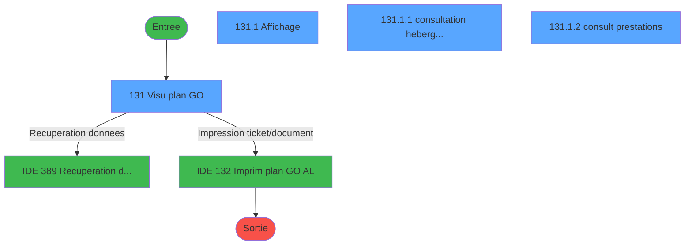
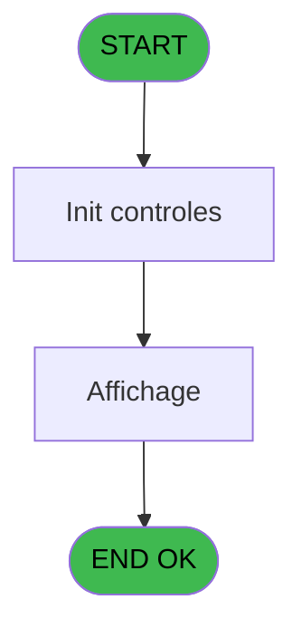
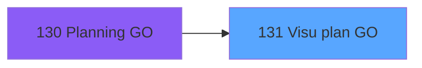
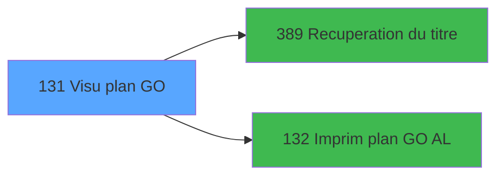

# PBP IDE 131 - Visu plan GO

> **Analyse**: Phases 1-4 2026-02-03 15:24 -> 15:25 (18s) | Assemblage 15:25
> **Pipeline**: V7.2 Enrichi
> **Structure**: 4 onglets (Resume | Ecrans | Donnees | Connexions)

<!-- TAB:Resume -->

## 1. FICHE D'IDENTITE

| Attribut | Valeur |
|----------|--------|
| Projet | PBP |
| IDE Position | 131 |
| Nom Programme | Visu plan GO |
| Fichier source | `Prg_131.xml` |
| Dossier IDE | Gestion |
| Taches | 4 (4 ecrans visibles) |
| Tables modifiees | 0 |
| Programmes appeles | 2 |

## 2. DESCRIPTION FONCTIONNELLE

**Visu plan GO** assure la gestion complete de ce processus, accessible depuis [Planning GO (IDE 130)](PBP-IDE-130.md).

Le flux de traitement s'organise en **2 blocs fonctionnels** :

- **Traitement** (3 taches) : traitements metier divers
- **Consultation** (1 tache) : ecrans de recherche, selection et consultation

**Logique metier** : 1 regles identifiees couvrant conditions metier.

Detail : phases du traitement

#### Phase 1 : Traitement (3 taches)

- **131** - Visu plan GO **[[ECRAN]](#ecran-t1)**
- **131.1.1** - consultation hebergement **[[ECRAN]](#ecran-t3)**
- **131.1.2** - consult prestations **[[ECRAN]](#ecran-t4)**

Delegue a : [Recuperation du titre (IDE 389)](PBP-IDE-389.md)

#### Phase 2 : Consultation (1 tache)

- **131.1** - Affichage **[[ECRAN]](#ecran-t2)**

Delegue a : [Recuperation du titre (IDE 389)](PBP-IDE-389.md)

## 3. BLOCS FONCTIONNELS

### 3.1 Traitement (3 taches)

Traitements internes.

---

#### 131 - Visu plan GO [[ECRAN]](#ecran-t1)

**Role** : Traitement : Visu plan GO.
**Ecran** : 1216 x 225 DLU (MDI) | [Voir mockup](#ecran-t1)
**Delegue a** : [Recuperation du titre (IDE 389)](PBP-IDE-389.md)

---

#### 131.1.1 - consultation hebergement [[ECRAN]](#ecran-t3)

**Role** : Consultation/chargement : consultation hebergement.
**Ecran** : 768 x 78 DLU (Modal) | [Voir mockup](#ecran-t3)
**Variables liees** : A (>Date Consultation)
**Delegue a** : [Recuperation du titre (IDE 389)](PBP-IDE-389.md)

---

#### 131.1.2 - consult prestations [[ECRAN]](#ecran-t4)

**Role** : Traitement : consult prestations.
**Ecran** : 759 x 36 DLU (Modal) | [Voir mockup](#ecran-t4)
**Variables liees** : A (>Date Consultation)
**Delegue a** : [Recuperation du titre (IDE 389)](PBP-IDE-389.md)

### 3.2 Consultation (1 tache)

Ecrans de recherche et consultation.

---

#### 131.1 - Affichage [[ECRAN]](#ecran-t2)

**Role** : Reinitialisation : Affichage.
**Ecran** : 798 x 265 DLU (MDI) | [Voir mockup](#ecran-t2)

## 5. REGLES METIER

1 regles identifiees:

### Autres (1 regles)

#### [RM-001] Si NOT(VG117) alors [O] sinon [AX])

| Element | Detail |
|---------|--------|
| **Condition** | `NOT(VG117)` |
| **Si vrai** | [O] |
| **Si faux** | [AX]) |
| **Expression source** | Expression 15 : `IF(NOT(VG117),[O],[AX])` |
| **Exemple** | Si NOT(VG117) → [O]. Sinon → [AX]) |

## 6. CONTEXTE

- **Appele par**: [Planning GO (IDE 130)](PBP-IDE-130.md)
- **Appelle**: 2 programmes | **Tables**: 7 (W:0 R:4 L:3) | **Taches**: 4 | **Expressions**: 16

<!-- TAB:Ecrans -->

## 8. ECRANS

### 8.1 Forms visibles (4 / 4)

| # | Position | Tache | Nom | Type | Largeur | Hauteur | Bloc |
|---|----------|-------|-----|------|---------|---------|------|
| 1 | 131 | 131 | Visu plan GO | MDI | 1216 | 225 | Traitement |
| 2 | 131.1 | 131.1 | Affichage | MDI | 798 | 265 | Consultation |
| 3 | 131.1.1 | 131.1.1 | consultation hebergement | Modal | 768 | 78 | Traitement |
| 4 | 131.1.2 | 131.1.2 | consult prestations | Modal | 759 | 36 | Traitement |

### 8.2 Mockups Ecrans

---

#### 131 - Visu plan GO
**Tache** : [131](#t1) | **Type** : MDI | **Dimensions** : 1216 x 225 DLU
**Bloc** : Traitement | **Titre IDE** : Visu plan GO

<!-- FORM-DATA:
{
    "width":  1216,
    "vFactor":  8,
    "type":  "MDI",
    "hFactor":  8,
    "controls":  [
                     {
                         "x":  0,
                         "type":  "label",
                         "var":  "",
                         "y":  0,
                         "w":  1208,
                         "fmt":  "",
                         "name":  "",
                         "h":  19,
                         "color":  "",
                         "text":  "",
                         "parent":  null
                     },
                     {
                         "x":  1030,
                         "type":  "label",
                         "var":  "",
                         "y":  25,
                         "w":  178,
                         "fmt":  "",
                         "name":  "",
                         "h":  168,
                         "color":  "",
                         "text":  "",
                         "parent":  null
                     },
                     {
                         "x":  5,
                         "type":  "table",
                         "var":  "",
                         "name":  "",
                         "titleH":  12,
                         "color":  "110",
                         "w":  1019,
                         "y":  27,
                         "fmt":  "",
                         "parent":  null,
                         "text":  "",
                         "rowH":  15,
                         "h":  130,
                         "cols":  [
                                      {
                                          "title":  "Logement",
                                          "layer":  1,
                                          "w":  120
                                      },
                                      {
                                          "title":  "Sexe",
                                          "layer":  2,
                                          "w":  60
                                      },
                                      {
                                          "title":  "Nom",
                                          "layer":  3,
                                          "w":  194
                                      },
                                      {
                                          "title":  "Prénom",
                                          "layer":  4,
                                          "w":  228
                                      },
                                      {
                                          "title":  "Qualité",
                                          "layer":  5,
                                          "w":  116
                                      },
                                      {
                                          "title":  "Date Début",
                                          "layer":  6,
                                          "w":  145
                                      },
                                      {
                                          "title":  "Date Fin",
                                          "layer":  7,
                                          "w":  117
                                      }
                                  ],
                         "rows":  7
                     },
                     {
                         "x":  9,
                         "type":  "label",
                         "var":  "",
                         "y":  159,
                         "w":  165,
                         "fmt":  "",
                         "name":  "",
                         "h":  34,
                         "color":  "",
                         "text":  "",
                         "parent":  null
                     },
                     {
                         "x":  171,
                         "type":  "label",
                         "var":  "",
                         "y":  159,
                         "w":  165,
                         "fmt":  "",
                         "name":  "",
                         "h":  34,
                         "color":  "",
                         "text":  "",
                         "parent":  null
                     },
                     {
                         "x":  333,
                         "type":  "label",
                         "var":  "",
                         "y":  159,
                         "w":  691,
                         "fmt":  "",
                         "name":  "",
                         "h":  34,
                         "color":  "",
                         "text":  "",
                         "parent":  null
                     },
                     {
                         "x":  31,
                         "type":  "label",
                         "var":  "",
                         "y":  165,
                         "w":  123,
                         "fmt":  "",
                         "name":  "",
                         "h":  8,
                         "color":  "",
                         "text":  "Visu du",
                         "parent":  23
                     },
                     {
                         "x":  199,
                         "type":  "label",
                         "var":  "",
                         "y":  165,
                         "w":  101,
                         "fmt":  "",
                         "name":  "",
                         "h":  8,
                         "color":  "",
                         "text":  "UP",
                         "parent":  24
                     },
                     {
                         "x":  352,
                         "type":  "label",
                         "var":  "",
                         "y":  165,
                         "w":  291,
                         "fmt":  "",
                         "name":  "",
                         "h":  8,
                         "color":  "",
                         "text":  "Service",
                         "parent":  25
                     },
                     {
                         "x":  661,
                         "type":  "label",
                         "var":  "",
                         "y":  165,
                         "w":  291,
                         "fmt":  "",
                         "name":  "",
                         "h":  8,
                         "color":  "",
                         "text":  "Fonction",
                         "parent":  25
                     },
                     {
                         "x":  0,
                         "type":  "label",
                         "var":  "",
                         "y":  198,
                         "w":  1208,
                         "fmt":  "",
                         "name":  "",
                         "h":  24,
                         "color":  "",
                         "text":  "",
                         "parent":  null
                     },
                     {
                         "x":  31,
                         "type":  "edit",
                         "var":  "",
                         "y":  179,
                         "w":  123,
                         "fmt":  "DD/MM/YYYY",
                         "name":  "",
                         "h":  9,
                         "color":  "",
                         "text":  "",
                         "parent":  23
                     },
                     {
                         "x":  13,
                         "type":  "edit",
                         "var":  "",
                         "y":  42,
                         "w":  82,
                         "fmt":  "",
                         "name":  "TMP Logement",
                         "h":  10,
                         "color":  "110",
                         "text":  "",
                         "parent":  7
                     },
                     {
                         "x":  201,
                         "type":  "edit",
                         "var":  "",
                         "y":  179,
                         "w":  101,
                         "fmt":  "",
                         "name":  "",
                         "h":  9,
                         "color":  "",
                         "text":  "",
                         "parent":  24
                     },
                     {
                         "x":  136,
                         "type":  "edit",
                         "var":  "",
                         "y":  42,
                         "w":  37,
                         "fmt":  "",
                         "name":  "",
                         "h":  10,
                         "color":  "110",
                         "text":  "",
                         "parent":  7
                     },
                     {
                         "x":  190,
                         "type":  "edit",
                         "var":  "",
                         "y":  42,
                         "w":  182,
                         "fmt":  "",
                         "name":  "TMP Nom",
                         "h":  10,
                         "color":  "110",
                         "text":  "",
                         "parent":  7
                     },
                     {
                         "x":  386,
                         "type":  "edit",
                         "var":  "",
                         "y":  42,
                         "w":  216,
                         "fmt":  "",
                         "name":  "TMP Prenom",
                         "h":  10,
                         "color":  "110",
                         "text":  "",
                         "parent":  7
                     },
                     {
                         "x":  613,
                         "type":  "edit",
                         "var":  "",
                         "y":  42,
                         "w":  104,
                         "fmt":  "",
                         "name":  "",
                         "h":  10,
                         "color":  "110",
                         "text":  "",
                         "parent":  7
                     },
                     {
                         "x":  352,
                         "type":  "edit",
                         "var":  "",
                         "y":  179,
                         "w":  291,
                         "fmt":  "50",
                         "name":  "",
                         "h":  9,
                         "color":  "",
                         "text":  "",
                         "parent":  25
                     },
                     {
                         "x":  660,
                         "type":  "edit",
                         "var":  "",
                         "y":  179,
                         "w":  291,
                         "fmt":  "50",
                         "name":  "",
                         "h":  9,
                         "color":  "",
                         "text":  "",
                         "parent":  25
                     },
                     {
                         "x":  730,
                         "type":  "edit",
                         "var":  "",
                         "y":  42,
                         "w":  104,
                         "fmt":  "DD/MM/YY",
                         "name":  "",
                         "h":  10,
                         "color":  "110",
                         "text":  "",
                         "parent":  7
                     },
                     {
                         "x":  874,
                         "type":  "edit",
                         "var":  "",
                         "y":  42,
                         "w":  104,
                         "fmt":  "DD/MM/YY",
                         "name":  "",
                         "h":  10,
                         "color":  "110",
                         "text":  "",
                         "parent":  7
                     },
                     {
                         "x":  1043,
                         "type":  "button",
                         "var":  "",
                         "y":  132,
                         "w":  154,
                         "fmt":  "\u0026Voir",
                         "name":  "b_Voir",
                         "h":  18,
                         "color":  "",
                         "text":  "",
                         "parent":  6
                     },
                     {
                         "x":  1043,
                         "type":  "button",
                         "var":  "",
                         "y":  158,
                         "w":  154,
                         "fmt":  "\u0026Impression",
                         "name":  "b_Imprimer",
                         "h":  18,
                         "color":  "",
                         "text":  "",
                         "parent":  6
                     },
                     {
                         "x":  7,
                         "type":  "button",
                         "var":  "",
                         "y":  201,
                         "w":  154,
                         "fmt":  "\u0026Quitter",
                         "name":  "b_Quitter",
                         "h":  18,
                         "color":  "",
                         "text":  "",
                         "parent":  34
                     },
                     {
                         "x":  7,
                         "type":  "edit",
                         "var":  "",
                         "y":  2,
                         "w":  395,
                         "fmt":  "30",
                         "name":  "",
                         "h":  8,
                         "color":  "",
                         "text":  "",
                         "parent":  1
                     },
                     {
                         "x":  436,
                         "type":  "edit",
                         "var":  "",
                         "y":  6,
                         "w":  288,
                         "fmt":  "25",
                         "name":  "",
                         "h":  8,
                         "color":  "",
                         "text":  "",
                         "parent":  1
                     },
                     {
                         "x":  909,
                         "type":  "edit",
                         "var":  "",
                         "y":  6,
                         "w":  253,
                         "fmt":  "WWW DD MMM YYYYT",
                         "name":  "",
                         "h":  8,
                         "color":  "",
                         "text":  "",
                         "parent":  1
                     },
                     {
                         "x":  7,
                         "type":  "edit",
                         "var":  "",
                         "y":  10,
                         "w":  331,
                         "fmt":  "25",
                         "name":  "",
                         "h":  8,
                         "color":  "",
                         "text":  "",
                         "parent":  3
                     },
                     {
                         "x":  1048,
                         "type":  "image",
                         "var":  "",
                         "y":  50,
                         "w":  149,
                         "fmt":  "",
                         "name":  "",
                         "h":  58,
                         "color":  "",
                         "text":  "",
                         "parent":  6
                     }
                 ],
    "taskId":  "131",
    "height":  225
}
-->

<strong>Champs : 15 champs</strong>

| Pos (x,y) | Nom | Variable | Type |
|-----------|-----|----------|------|
| 31,179 | DD/MM/YYYY | - | edit |
| 13,42 | TMP Logement | - | edit |
| 201,179 | (sans nom) | - | edit |
| 136,42 | (sans nom) | - | edit |
| 190,42 | TMP Nom | - | edit |
| 386,42 | TMP Prenom | - | edit |
| 613,42 | (sans nom) | - | edit |
| 352,179 | 50 | - | edit |
| 660,179 | 50 | - | edit |
| 730,42 | DD/MM/YY | - | edit |
| 874,42 | DD/MM/YY | - | edit |
| 7,2 | 30 | - | edit |
| 436,6 | 25 | - | edit |
| 909,6 | WWW DD MMM YYYYT | - | edit |
| 7,10 | 25 | - | edit |

<strong>Boutons : 3 boutons</strong>

| Bouton | Pos (x,y) | Action |
|--------|-----------|--------|
| Voir | 1043,132 | Bouton fonctionnel |
| Impression | 1043,158 | Bouton fonctionnel |
| Quitter | 7,201 | Quitte le programme |

---

#### 131.1 - Affichage
**Tache** : [131.1](#t2) | **Type** : MDI | **Dimensions** : 798 x 265 DLU
**Bloc** : Consultation | **Titre IDE** : Affichage

<!-- FORM-DATA:
{
    "width":  798,
    "vFactor":  8,
    "type":  "MDI",
    "hFactor":  8,
    "controls":  [
                     {
                         "x":  20,
                         "type":  "label",
                         "var":  "",
                         "y":  20,
                         "w":  757,
                         "fmt":  "",
                         "name":  "",
                         "h":  95,
                         "color":  "",
                         "text":  "",
                         "parent":  null
                     },
                     {
                         "x":  33,
                         "type":  "label",
                         "var":  "",
                         "y":  28,
                         "w":  72,
                         "fmt":  "",
                         "name":  "",
                         "h":  8,
                         "color":  "",
                         "text":  "N° client",
                         "parent":  3
                     },
                     {
                         "x":  23,
                         "type":  "line",
                         "var":  "",
                         "y":  39,
                         "w":  752,
                         "fmt":  "",
                         "name":  "",
                         "h":  0,
                         "color":  "",
                         "text":  "",
                         "parent":  3
                     },
                     {
                         "x":  33,
                         "type":  "label",
                         "var":  "",
                         "y":  45,
                         "w":  88,
                         "fmt":  "",
                         "name":  "",
                         "h":  8,
                         "color":  "",
                         "text":  "Naissance",
                         "parent":  3
                     },
                     {
                         "x":  23,
                         "type":  "line",
                         "var":  "",
                         "y":  56,
                         "w":  752,
                         "fmt":  "",
                         "name":  "",
                         "h":  0,
                         "color":  "",
                         "text":  "",
                         "parent":  3
                     },
                     {
                         "x":  33,
                         "type":  "label",
                         "var":  "",
                         "y":  63,
                         "w":  64,
                         "fmt":  "",
                         "name":  "",
                         "h":  8,
                         "color":  "",
                         "text":  "Identité",
                         "parent":  3
                     },
                     {
                         "x":  23,
                         "type":  "line",
                         "var":  "",
                         "y":  75,
                         "w":  752,
                         "fmt":  "",
                         "name":  "",
                         "h":  0,
                         "color":  "",
                         "text":  "",
                         "parent":  3
                     },
                     {
                         "x":  33,
                         "type":  "label",
                         "var":  "",
                         "y":  80,
                         "w":  69,
                         "fmt":  "",
                         "name":  "",
                         "h":  9,
                         "color":  "",
                         "text":  "Adresse",
                         "parent":  3
                     },
                     {
                         "x":  0,
                         "type":  "label",
                         "var":  "",
                         "y":  239,
                         "w":  796,
                         "fmt":  "",
                         "name":  "",
                         "h":  24,
                         "color":  "",
                         "text":  "",
                         "parent":  null
                     },
                     {
                         "x":  81,
                         "type":  "edit",
                         "var":  "",
                         "y":  7,
                         "w":  37,
                         "fmt":  "",
                         "name":  "GMC Titre",
                         "h":  10,
                         "color":  "",
                         "text":  "",
                         "parent":  null
                     },
                     {
                         "x":  123,
                         "type":  "edit",
                         "var":  "",
                         "y":  27,
                         "w":  26,
                         "fmt":  "",
                         "name":  "",
                         "h":  10,
                         "color":  "",
                         "text":  "",
                         "parent":  3
                     },
                     {
                         "x":  159,
                         "type":  "edit",
                         "var":  "",
                         "y":  27,
                         "w":  123,
                         "fmt":  "",
                         "name":  "",
                         "h":  9,
                         "color":  "",
                         "text":  "",
                         "parent":  3
                     },
                     {
                         "x":  297,
                         "type":  "edit",
                         "var":  "",
                         "y":  27,
                         "w":  26,
                         "fmt":  "",
                         "name":  "",
                         "h":  10,
                         "color":  "",
                         "text":  "",
                         "parent":  3
                     },
                     {
                         "x":  338,
                         "type":  "edit",
                         "var":  "",
                         "y":  27,
                         "w":  48,
                         "fmt":  "",
                         "name":  "",
                         "h":  10,
                         "color":  "",
                         "text":  "",
                         "parent":  3
                     },
                     {
                         "x":  127,
                         "type":  "edit",
                         "var":  "",
                         "y":  45,
                         "w":  120,
                         "fmt":  "DD/MM/YYYYZ",
                         "name":  "",
                         "h":  8,
                         "color":  "",
                         "text":  "",
                         "parent":  3
                     },
                     {
                         "x":  285,
                         "type":  "edit",
                         "var":  "",
                         "y":  45,
                         "w":  403,
                         "fmt":  "",
                         "name":  "",
                         "h":  9,
                         "color":  "",
                         "text":  "",
                         "parent":  3
                     },
                     {
                         "x":  708,
                         "type":  "edit",
                         "var":  "",
                         "y":  45,
                         "w":  45,
                         "fmt":  "",
                         "name":  "",
                         "h":  9,
                         "color":  "",
                         "text":  "",
                         "parent":  3
                     },
                     {
                         "x":  127,
                         "type":  "edit",
                         "var":  "",
                         "y":  63,
                         "w":  22,
                         "fmt":  "",
                         "name":  "",
                         "h":  9,
                         "color":  "",
                         "text":  "",
                         "parent":  3
                     },
                     {
                         "x":  154,
                         "type":  "edit",
                         "var":  "",
                         "y":  63,
                         "w":  347,
                         "fmt":  "",
                         "name":  "",
                         "h":  9,
                         "color":  "",
                         "text":  "",
                         "parent":  3
                     },
                     {
                         "x":  506,
                         "type":  "edit",
                         "var":  "",
                         "y":  63,
                         "w":  120,
                         "fmt":  "DD/MM/YYYYZ",
                         "name":  "",
                         "h":  8,
                         "color":  "",
                         "text":  "",
                         "parent":  3
                     },
                     {
                         "x":  641,
                         "type":  "edit",
                         "var":  "",
                         "y":  63,
                         "w":  120,
                         "fmt":  "DD/MM/YYYYZ",
                         "name":  "",
                         "h":  8,
                         "color":  "",
                         "text":  "",
                         "parent":  3
                     },
                     {
                         "x":  127,
                         "type":  "edit",
                         "var":  "",
                         "y":  80,
                         "w":  123,
                         "fmt":  "",
                         "name":  "",
                         "h":  9,
                         "color":  "",
                         "text":  "",
                         "parent":  3
                     },
                     {
                         "x":  259,
                         "type":  "edit",
                         "var":  "",
                         "y":  80,
                         "w":  347,
                         "fmt":  "",
                         "name":  "",
                         "h":  9,
                         "color":  "",
                         "text":  "",
                         "parent":  3
                     },
                     {
                         "x":  127,
                         "type":  "edit",
                         "var":  "",
                         "y":  91,
                         "w":  403,
                         "fmt":  "",
                         "name":  "",
                         "h":  9,
                         "color":  "",
                         "text":  "",
                         "parent":  3
                     },
                     {
                         "x":  127,
                         "type":  "edit",
                         "var":  "",
                         "y":  102,
                         "w":  123,
                         "fmt":  "",
                         "name":  "",
                         "h":  9,
                         "color":  "",
                         "text":  "",
                         "parent":  3
                     },
                     {
                         "x":  259,
                         "type":  "edit",
                         "var":  "",
                         "y":  102,
                         "w":  347,
                         "fmt":  "",
                         "name":  "",
                         "h":  9,
                         "color":  "",
                         "text":  "",
                         "parent":  3
                     },
                     {
                         "x":  118,
                         "type":  "edit",
                         "var":  "",
                         "y":  7,
                         "w":  597,
                         "fmt":  "50",
                         "name":  "",
                         "h":  10,
                         "color":  "7",
                         "text":  "",
                         "parent":  null
                     },
                     {
                         "x":  12,
                         "type":  "button",
                         "var":  "",
                         "y":  242,
                         "w":  154,
                         "fmt":  "\u0026Quitter",
                         "name":  "",
                         "h":  18,
                         "color":  "",
                         "text":  "",
                         "parent":  27
                     },
                     {
                         "x":  0,
                         "type":  "subform",
                         "var":  "",
                         "y":  118,
                         "w":  798,
                         "fmt":  "",
                         "name":  "consultation hebergement",
                         "h":  81,
                         "color":  "",
                         "text":  "",
                         "parent":  null
                     },
                     {
                         "x":  0,
                         "type":  "subform",
                         "var":  "",
                         "y":  199,
                         "w":  798,
                         "fmt":  "",
                         "name":  "consult prestations",
                         "h":  40,
                         "color":  "",
                         "text":  "",
                         "parent":  null
                     }
                 ],
    "taskId":  "131.1",
    "height":  265
}
-->

<strong>Champs : 18 champs</strong>

| Pos (x,y) | Nom | Variable | Type |
|-----------|-----|----------|------|
| 81,7 | GMC Titre | - | edit |
| 123,27 | (sans nom) | - | edit |
| 159,27 | (sans nom) | - | edit |
| 297,27 | (sans nom) | - | edit |
| 338,27 | (sans nom) | - | edit |
| 127,45 | DD/MM/YYYYZ | - | edit |
| 285,45 | (sans nom) | - | edit |
| 708,45 | (sans nom) | - | edit |
| 127,63 | (sans nom) | - | edit |
| 154,63 | (sans nom) | - | edit |
| 506,63 | DD/MM/YYYYZ | - | edit |
| 641,63 | DD/MM/YYYYZ | - | edit |
| 127,80 | (sans nom) | - | edit |
| 259,80 | (sans nom) | - | edit |
| 127,91 | (sans nom) | - | edit |
| 127,102 | (sans nom) | - | edit |
| 259,102 | (sans nom) | - | edit |
| 118,7 | 50 | - | edit |

<strong>Boutons : 1 boutons</strong>

| Bouton | Pos (x,y) | Action |
|--------|-----------|--------|
| Quitter | 12,242 | Quitte le programme |

---

#### 131.1.1 - consultation hebergement
**Tache** : [131.1.1](#t3) | **Type** : Modal | **Dimensions** : 768 x 78 DLU
**Bloc** : Traitement | **Titre IDE** : consultation hebergement

<!-- FORM-DATA:
{
    "width":  768,
    "vFactor":  8,
    "type":  "Modal",
    "hFactor":  8,
    "controls":  [
                     {
                         "x":  1,
                         "type":  "table",
                         "var":  "",
                         "name":  "",
                         "titleH":  12,
                         "color":  "110",
                         "w":  765,
                         "y":  1,
                         "fmt":  "",
                         "parent":  null,
                         "text":  "",
                         "rowH":  12,
                         "h":  75,
                         "cols":  [
                                      {
                                          "title":  "Type",
                                          "layer":  1,
                                          "w":  158
                                      },
                                      {
                                          "title":  "Début",
                                          "layer":  2,
                                          "w":  165
                                      },
                                      {
                                          "title":  "Fin",
                                          "layer":  3,
                                          "w":  163
                                      },
                                      {
                                          "title":  "Détail",
                                          "layer":  4,
                                          "w":  244
                                      }
                                  ],
                         "rows":  4
                     },
                     {
                         "x":  165,
                         "type":  "edit",
                         "var":  "",
                         "y":  15,
                         "w":  120,
                         "fmt":  "DD/MM/YYYYZ",
                         "name":  "",
                         "h":  8,
                         "color":  "110",
                         "text":  "",
                         "parent":  1
                     },
                     {
                         "x":  293,
                         "type":  "edit",
                         "var":  "",
                         "y":  15,
                         "w":  30,
                         "fmt":  "",
                         "name":  "",
                         "h":  8,
                         "color":  "110",
                         "text":  "",
                         "parent":  1
                     },
                     {
                         "x":  330,
                         "type":  "edit",
                         "var":  "",
                         "y":  15,
                         "w":  120,
                         "fmt":  "DD/MM/YYYYZ",
                         "name":  "",
                         "h":  8,
                         "color":  "110",
                         "text":  "",
                         "parent":  1
                     },
                     {
                         "x":  454,
                         "type":  "edit",
                         "var":  "",
                         "y":  15,
                         "w":  30,
                         "fmt":  "",
                         "name":  "",
                         "h":  8,
                         "color":  "110",
                         "text":  "",
                         "parent":  1
                     },
                     {
                         "x":  493,
                         "type":  "edit",
                         "var":  "",
                         "y":  15,
                         "w":  232,
                         "fmt":  "20",
                         "name":  "",
                         "h":  8,
                         "color":  "110",
                         "text":  "",
                         "parent":  1
                     },
                     {
                         "x":  6,
                         "type":  "edit",
                         "var":  "",
                         "y":  15,
                         "w":  142,
                         "fmt":  "12",
                         "name":  "",
                         "h":  8,
                         "color":  "110",
                         "text":  "",
                         "parent":  1
                     }
                 ],
    "taskId":  "131.1.1",
    "height":  78
}
-->

<strong>Champs : 6 champs</strong>

| Pos (x,y) | Nom | Variable | Type |
|-----------|-----|----------|------|
| 165,15 | DD/MM/YYYYZ | - | edit |
| 293,15 | (sans nom) | - | edit |
| 330,15 | DD/MM/YYYYZ | - | edit |
| 454,15 | (sans nom) | - | edit |
| 493,15 | 20 | - | edit |
| 6,15 | 12 | - | edit |

---

#### 131.1.2 - consult prestations
**Tache** : [131.1.2](#t4) | **Type** : Modal | **Dimensions** : 759 x 36 DLU
**Bloc** : Traitement | **Titre IDE** : consult prestations

<!-- FORM-DATA:
{
    "width":  759,
    "vFactor":  8,
    "type":  "Modal",
    "hFactor":  8,
    "controls":  [
                     {
                         "x":  202,
                         "type":  "table",
                         "var":  "",
                         "name":  "",
                         "titleH":  12,
                         "color":  "110",
                         "w":  376,
                         "y":  3,
                         "fmt":  "",
                         "parent":  null,
                         "text":  "",
                         "rowH":  10,
                         "h":  32,
                         "cols":  [
                                      {
                                          "title":  "Code circuit",
                                          "layer":  1,
                                          "w":  106
                                      },
                                      {
                                          "title":  "Libellé",
                                          "layer":  2,
                                          "w":  237
                                      }
                                  ],
                         "rows":  2
                     },
                     {
                         "x":  208,
                         "type":  "edit",
                         "var":  "",
                         "y":  17,
                         "w":  75,
                         "fmt":  "",
                         "name":  "",
                         "h":  8,
                         "color":  "110",
                         "text":  "",
                         "parent":  1
                     },
                     {
                         "x":  314,
                         "type":  "edit",
                         "var":  "",
                         "y":  17,
                         "w":  229,
                         "fmt":  "",
                         "name":  "",
                         "h":  8,
                         "color":  "110",
                         "text":  "",
                         "parent":  1
                     }
                 ],
    "taskId":  "131.1.2",
    "height":  36
}
-->

<strong>Champs : 2 champs</strong>

| Pos (x,y) | Nom | Variable | Type |
|-----------|-----|----------|------|
| 208,17 | (sans nom) | - | edit |
| 314,17 | (sans nom) | - | edit |

## 9. NAVIGATION

### 9.1 Enchainement des ecrans

**Detail par enchainement :**

| Depuis | Action | Vers | Retour |
|--------|--------|------|--------|
| Visu plan GO | Recuperation donnees | [Recuperation du titre (IDE 389)](PBP-IDE-389.md) | Retour ecran |
| Visu plan GO | Impression ticket/document | [  Imprim plan GO AL (IDE 132)](PBP-IDE-132.md) | Retour ecran |

### 9.3 Structure hierarchique (4 taches)

| Position | Tache | Type | Dimensions | Bloc |
|----------|-------|------|------------|------|
| **131.1** | [**Visu plan GO** (131)](#t1) [mockup](#ecran-t1) | MDI | 1216x225 | Traitement |
| 131.1.1 | [consultation hebergement (131.1.1)](#t3) [mockup](#ecran-t3) | Modal | 768x78 | |
| 131.1.2 | [consult prestations (131.1.2)](#t4) [mockup](#ecran-t4) | Modal | 759x36 | |
| **131.2** | [**Affichage** (131.1)](#t2) [mockup](#ecran-t2) | MDI | 798x265 | Consultation |

### 9.4 Algorigramme

> **Legende**: Vert = START/END OK | Rouge = END KO | Bleu = Decisions
> *Algorigramme auto-genere. Utiliser `/algorigramme` pour une synthese metier detaillee.*

<!-- TAB:Donnees -->

## 10. TABLES

### Tables utilisees (7)

| ID | Nom | Description | Type | R | W | L | Usages |
|----|-----|-------------|------|---|---|---|--------|
| 31 | gm-complet_______gmc |  | DB | R |   |   | 1 |
| 33 | prestations______pre | Prestations/services vendus | DB | R |   |   | 1 |
| 34 | hebergement______heb | Hebergement (chambres) | DB | R |   |   | 1 |
| 35 | personnel_go______go |  | DB | R |   |   | 1 |
| 135 | libelle_prestation | Prestations/services vendus | DB |   |   | L | 1 |
| 629 | tableau_article__tar | Articles et stock | DB |   |   | L | 1 |
| 1094 | Table_1094 |  | MEM |   |   | L | 1 |

### Colonnes par table (3 / 4 tables avec colonnes identifiees)

Table 31 - gm-complet_______gmc (R) - 1 usages

*Table utilisee uniquement en Link ou aucune colonne Real identifiee dans le DataView.*

Table 33 - prestations______pre (R) - 1 usages

| Lettre | Variable | Acces | Type |
|--------|----------|-------|------|
| A | P.Num compte | R | Numeric |
| B | P.Filiation | R | Numeric |

Table 34 - hebergement______heb (R) - 1 usages

| Lettre | Variable | Acces | Type |
|--------|----------|-------|------|
| A | P.Num compte | R | Numeric |
| B | P.Filiation | R | Numeric |

Table 35 - personnel_go______go (R) - 1 usages

| Lettre | Variable | Acces | Type |
|--------|----------|-------|------|
| A | >Date Consultation | R | Date |
| B | >Total | R | Numeric |
| C | >NbSelect | R | Numeric |
| D | w0_TitreEcran | R | Alpha |
| E | b_Voir | R | Alpha |
| F | b_Imprimer | R | Alpha |
| G | b_Quitter | R | Alpha |

## 11. VARIABLES

### 11.1 Autres (7)

Variables diverses.

| Lettre | Nom | Type | Usage dans |
|--------|-----|------|-----------|
| A | >Date Consultation | Date | - |
| B | >Total | Numeric | 1x refs |
| C | >NbSelect | Numeric | 1x refs |
| D | w0_TitreEcran | Alpha | 1x refs |
| E | b_Voir | Alpha | - |
| F | b_Imprimer | Alpha | - |
| G | b_Quitter | Alpha | - |

## 12. EXPRESSIONS

**16 / 16 expressions decodees (100%)**

### 12.1 Repartition par type

| Type | Expressions | Regles |
|------|-------------|--------|
| CONDITION | 2 | 5 |
| CONSTANTE | 4 | 0 |
| DATE | 1 | 0 |
| OTHER | 5 | 0 |
| REFERENCE_VG | 2 | 0 |
| STRING | 1 | 0 |
| CONCATENATION | 1 | 0 |

### 12.2 Expressions cles par type

#### CONDITION (2 expressions)

| Type | IDE | Expression | Regle |
|------|-----|------------|-------|
| CONDITION | 15 | `IF(NOT(VG117),[O],[AX])` | [RM-001](#rm-RM-001) |
| CONDITION | 16 | `IF(NOT(VG117),[N],[AY])` | - |

#### CONSTANTE (4 expressions)

| Type | IDE | Expression | Regle |
|------|-----|------------|-------|
| CONSTANTE | 8 | `'&Imprimante'` | - |
| CONSTANTE | 9 | `'&Quitter'` | - |
| CONSTANTE | 3 | `9` | - |
| CONSTANTE | 7 | `'&Voir'` | - |

#### DATE (1 expressions)

| Type | IDE | Expression | Regle |
|------|-----|------------|-------|
| DATE | 6 | `Date ()` | - |

#### OTHER (5 expressions)

| Type | IDE | Expression | Regle |
|------|-----|------------|-------|
| OTHER | 13 | `[S]` | - |
| OTHER | 14 | `[AV]` | - |
| OTHER | 12 | `[R]` | - |
| OTHER | 1 | `GetParam ('SOCIETE')` | - |
| OTHER | 11 | `GetParam ('VILLAGE')` | - |

#### REFERENCE_VG (2 expressions)

| Type | IDE | Expression | Regle |
|------|-----|------------|-------|
| REFERENCE_VG | 5 | `VG2` | - |
| REFERENCE_VG | 2 | `VG1` | - |

#### STRING (1 expressions)

| Type | IDE | Expression | Regle |
|------|-----|------------|-------|
| STRING | 4 | `Trim (w0_TitreEcran [D])` | - |

#### CONCATENATION (1 expressions)

| Type | IDE | Expression | Regle |
|------|-----|------------|-------|
| CONCATENATION | 10 | `MlsTrans ('Selection')&' '&Trim (Str (>NbSelect [C],'4'))&' '&MlsTrans ('sur')&' '&Trim (Str (>Total [B],'4'))` | - |

<!-- TAB:Connexions -->

## 13. GRAPHE D'APPELS

### 13.1 Chaine depuis Main (Callers)

Main -> ... -> [Planning GO (IDE 130)](PBP-IDE-130.md) -> **Visu plan GO (IDE 131)**

### 13.2 Callers

| IDE | Nom Programme | Nb Appels |
|-----|---------------|-----------|
| [130](PBP-IDE-130.md) | Planning GO | 1 |

### 13.3 Callees (programmes appeles)

### 13.4 Detail Callees avec contexte

| IDE | Nom Programme | Appels | Contexte |
|-----|---------------|--------|----------|
| [389](PBP-IDE-389.md) | Recuperation du titre | 2 | Recuperation donnees |
| [132](PBP-IDE-132.md) |   Imprim plan GO AL | 1 | Impression ticket/document |

## 14. RECOMMANDATIONS MIGRATION

### 14.1 Profil du programme

| Metrique | Valeur | Impact migration |
|----------|--------|-----------------|
| Lignes de logique | 102 | Programme compact |
| Expressions | 16 | Peu de logique |
| Tables WRITE | 0 | Impact faible |
| Sous-programmes | 2 | Peu de dependances |
| Ecrans visibles | 4 | Quelques ecrans |
| Code desactive | 0% (0 / 102) | Code sain |
| Regles metier | 1 | Quelques regles a preserver |

### 14.2 Plan de migration par bloc

#### Traitement (3 taches: 3 ecrans, 0 traitement)

- **Strategie** : 3 composant(s) UI (Razor/React) avec formulaires et validation.
- 2 sous-programme(s) a migrer ou a reutiliser depuis les services existants.
- Decomposer les taches en services unitaires testables.

#### Consultation (1 tache: 1 ecran, 0 traitement)

- **Strategie** : Composants de recherche/selection en modales.
- 1 ecran : Affichage

### 14.3 Dependances critiques

| Dependance | Type | Appels | Impact |
|------------|------|--------|--------|
| [Recuperation du titre (IDE 389)](PBP-IDE-389.md) | Sous-programme | 2x | Haute - Recuperation donnees |
| [  Imprim plan GO AL (IDE 132)](PBP-IDE-132.md) | Sous-programme | 1x | Normale - Impression ticket/document |

---
*Spec DETAILED generee par Pipeline V7.2 - 2026-02-03 15:25*
