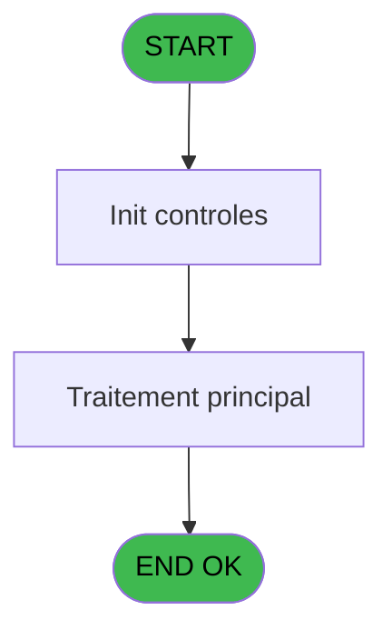
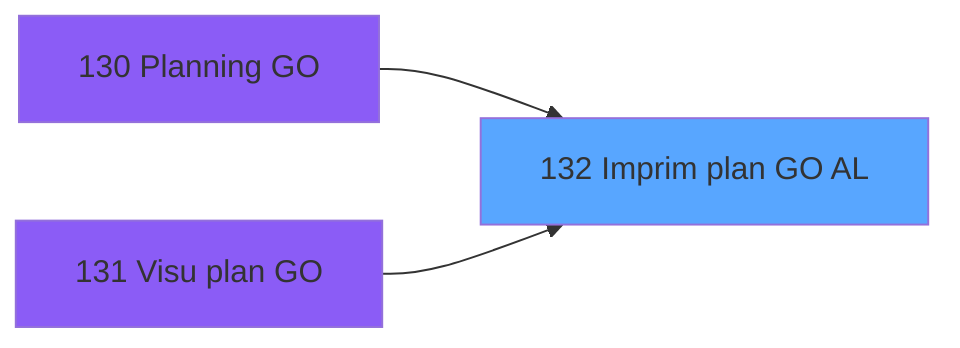

# PBP IDE 132 - Imprim plan GO AL

> **Analyse**: Phases 1-4 2026-02-03 15:25 -> 15:25 (20s) | Assemblage 15:25
> **Pipeline**: V7.2 Enrichi
> **Structure**: 4 onglets (Resume | Ecrans | Donnees | Connexions)

<!-- TAB:Resume -->

## 1. FICHE D'IDENTITE

| Attribut | Valeur |
|----------|--------|
| Projet | PBP |
| IDE Position | 132 |
| Nom Programme | Imprim plan GO AL |
| Fichier source | `Prg_132.xml` |
| Dossier IDE | Gestion |
| Taches | 2 (1 ecrans visibles) |
| Tables modifiees | 0 |
| Programmes appeles | 0 |

## 2. DESCRIPTION FONCTIONNELLE

**Imprim plan GO AL** assure la gestion complete de ce processus, accessible depuis [Planning GO (IDE 130)](PBP-IDE-130.md), [  Visu plan GO (IDE 131)](PBP-IDE-131.md).

Le flux de traitement s'organise en **2 blocs fonctionnels** :

- **Calcul** (1 tache) : calculs de montants, stocks ou compteurs
- **Traitement** (1 tache) : traitements metier divers

**Logique metier** : 2 regles identifiees couvrant conditions metier.

Detail : phases du traitement

#### Phase 1 : Traitement (1 tache)

- **132** - Veuillez patienter... **[[ECRAN]](#ecran-t1)**

#### Phase 2 : Calcul (1 tache)

- **132.1** - Calcul pied

## 3. BLOCS FONCTIONNELS

### 3.1 Traitement (1 tache)

Traitements internes.

---

#### 132 - Veuillez patienter... [[ECRAN]](#ecran-t1)

**Role** : Traitement : Veuillez patienter....
**Ecran** : 424 x 56 DLU (MDI) | [Voir mockup](#ecran-t1)

### 3.2 Calcul (1 tache)

Calculs metier : montants, stocks, compteurs.

---

#### 132.1 - Calcul pied

**Role** : Calcul : Calcul pied.
**Variables liees** : A (>DateCalcul), E (w0_NomPied01), F (w0_NbPied01), G (w0_NomPied02), H (w0_NbPied02)

## 5. REGLES METIER

2 regles identifiees:

### Autres (2 regles)

#### [RM-001] Si w0_NbPied03 [J]='F' alors 'Me' sinon 'M')

| Element | Detail |
|---------|--------|
| **Condition** | `w0_NbPied03 [J]='F'` |
| **Si vrai** | 'Me' |
| **Si faux** | 'M') |
| **Variables** | J (w0_NbPied03) |
| **Expression source** | Expression 7 : `IF (w0_NbPied03 [J]='F','Me','M')` |
| **Exemple** | Si w0_NbPied03 [J]='F' → 'Me'. Sinon → 'M') |

#### [RM-002] Si NOT(VG117) alors w0_NbPied05 [N] sinon [BM])

| Element | Detail |
|---------|--------|
| **Condition** | `NOT(VG117)` |
| **Si vrai** | w0_NbPied05 [N] |
| **Si faux** | [BM]) |
| **Variables** | N (w0_NbPied05) |
| **Expression source** | Expression 15 : `IF(NOT(VG117),w0_NbPied05 [N],[BM])` |
| **Exemple** | Si NOT(VG117) → w0_NbPied05 [N]. Sinon → [BM]) |

## 6. CONTEXTE

- **Appele par**: [Planning GO (IDE 130)](PBP-IDE-130.md), [  Visu plan GO (IDE 131)](PBP-IDE-131.md)
- **Appelle**: 0 programmes | **Tables**: 4 (W:0 R:2 L:2) | **Taches**: 2 | **Expressions**: 16

<!-- TAB:Ecrans -->

## 8. ECRANS

### 8.1 Forms visibles (1 / 2)

| # | Position | Tache | Nom | Type | Largeur | Hauteur | Bloc |
|---|----------|-------|-----|------|---------|---------|------|
| 1 | 132 | 132 | Veuillez patienter... | MDI | 424 | 56 | Traitement |

### 8.2 Mockups Ecrans

---

#### 132 - Veuillez patienter...
**Tache** : [132](#t1) | **Type** : MDI | **Dimensions** : 424 x 56 DLU
**Bloc** : Traitement | **Titre IDE** : Veuillez patienter...

<!-- FORM-DATA:
{
    "width":  424,
    "vFactor":  8,
    "type":  "MDI",
    "hFactor":  8,
    "controls":  [
                     {
                         "x":  0,
                         "type":  "label",
                         "var":  "",
                         "y":  0,
                         "w":  423,
                         "fmt":  "",
                         "name":  "",
                         "h":  29,
                         "color":  "",
                         "text":  "",
                         "parent":  null
                     },
                     {
                         "x":  120,
                         "type":  "label",
                         "var":  "",
                         "y":  10,
                         "w":  221,
                         "fmt":  "",
                         "name":  "",
                         "h":  8,
                         "color":  "7",
                         "text":  "Impression en cours ...",
                         "parent":  null
                     },
                     {
                         "x":  0,
                         "type":  "label",
                         "var":  "",
                         "y":  29,
                         "w":  423,
                         "fmt":  "",
                         "name":  "",
                         "h":  27,
                         "color":  "",
                         "text":  "",
                         "parent":  null
                     },
                     {
                         "x":  72,
                         "type":  "label",
                         "var":  "",
                         "y":  38,
                         "w":  280,
                         "fmt":  "",
                         "name":  "",
                         "h":  8,
                         "color":  "",
                         "text":  "Planning GO",
                         "parent":  null
                     },
                     {
                         "x":  4,
                         "type":  "image",
                         "var":  "",
                         "y":  2,
                         "w":  72,
                         "fmt":  "",
                         "name":  "",
                         "h":  25,
                         "color":  "",
                         "text":  "",
                         "parent":  null
                     }
                 ],
    "taskId":  "132",
    "height":  56
}
-->

## 9. NAVIGATION

Ecran unique: **Veuillez patienter...**

### 9.3 Structure hierarchique (2 taches)

| Position | Tache | Type | Dimensions | Bloc |
|----------|-------|------|------------|------|
| **132.1** | [**Veuillez patienter...** (132)](#t1) [mockup](#ecran-t1) | MDI | 424x56 | Traitement |
| **132.2** | [**Calcul pied** (132.1)](#t2) | MDI | - | Calcul |

### 9.4 Algorigramme

> **Legende**: Vert = START/END OK | Rouge = END KO | Bleu = Decisions
> *Algorigramme auto-genere. Utiliser `/algorigramme` pour une synthese metier detaillee.*

<!-- TAB:Donnees -->

## 10. TABLES

### Tables utilisees (4)

| ID | Nom | Description | Type | R | W | L | Usages |
|----|-----|-------------|------|---|---|---|--------|
| 35 | personnel_go______go |  | DB | R |   |   | 1 |
| 598 | tempo_ecr_previsions | Table temporaire ecran | TMP | R |   |   | 1 |
| 629 | tableau_article__tar | Articles et stock | DB |   |   | L | 1 |
| 1094 | Table_1094 |  | MEM |   |   | L | 1 |

### Colonnes par table (2 / 2 tables avec colonnes identifiees)

Table 35 - personnel_go______go (R) - 1 usages

| Lettre | Variable | Acces | Type |
|--------|----------|-------|------|
| A | >DateCalcul | R | Date |
| B | >NbTotal | R | Numeric |
| C | >NbSelect | R | Numeric |
| D | w0_NomLogement | R | Alpha |
| E | w0_NomPied01 | R | Alpha |
| F | w0_NbPied01 | R | Numeric |
| G | w0_NomPied02 | R | Alpha |
| H | w0_NbPied02 | R | Numeric |
| I | w0_NomPied03 | R | Alpha |
| J | w0_NbPied03 | R | Numeric |
| K | w0_NomPied04 | R | Alpha |
| L | w0_NbPied04 | R | Numeric |
| M | w0_NomPied05 | R | Alpha |
| N | w0_NbPied05 | R | Numeric |
| O | w0_TotalSelect | R | Numeric |

Table 598 - tempo_ecr_previsions (R) - 1 usages

| Lettre | Variable | Acces | Type |
|--------|----------|-------|------|
| A | w1_Rupture | R | Numeric |
| B | w1_TotalSelect | R | Numeric |

## 11. VARIABLES

### 11.1 Autres (15)

Variables diverses.

| Lettre | Nom | Type | Usage dans |
|--------|-----|------|-----------|
| A | >DateCalcul | Date | 1x refs |
| B | >NbTotal | Numeric | - |
| C | >NbSelect | Numeric | 1x refs |
| D | w0_NomLogement | Alpha | - |
| E | w0_NomPied01 | Alpha | - |
| F | w0_NbPied01 | Numeric | - |
| G | w0_NomPied02 | Alpha | - |
| H | w0_NbPied02 | Numeric | 1x refs |
| I | w0_NomPied03 | Alpha | - |
| J | w0_NbPied03 | Numeric | 1x refs |
| K | w0_NomPied04 | Alpha | - |
| L | w0_NbPied04 | Numeric | - |
| M | w0_NomPied05 | Alpha | - |
| N | w0_NbPied05 | Numeric | 1x refs |
| O | w0_TotalSelect | Numeric | 1x refs |

## 12. EXPRESSIONS

**16 / 16 expressions decodees (100%)**

### 12.1 Repartition par type

| Type | Expressions | Regles |
|------|-------------|--------|
| CONCATENATION | 2 | 0 |
| CONDITION | 6 | 2 |
| CONSTANTE | 1 | 0 |
| OTHER | 6 | 0 |
| REFERENCE_VG | 1 | 0 |

### 12.2 Expressions cles par type

#### CONCATENATION (2 expressions)

| Type | IDE | Expression | Regle |
|------|-----|------------|-------|
| CONCATENATION | 8 | `MlsTrans ('Edition du')&' '&DStr (Date (),'DD/MM/YYYY')&' '&MlsTrans ('à')&' '&TStr (Time (),'HH:MM:SS')` | - |
| CONCATENATION | 9 | `'- '&Str (Page (0,1),'3P0Z0')&' -'` | - |

#### CONDITION (6 expressions)

| Type | IDE | Expression | Regle |
|------|-----|------------|-------|
| CONDITION | 15 | `IF(NOT(VG117),w0_NbPied05 [N],[BM])` | [RM-002](#rm-RM-002) |
| CONDITION | 7 | `IF (w0_NbPied03 [J]='F','Me','M')` | [RM-001](#rm-RM-001) |
| CONDITION | 10 | `>NbSelect [C]>0` | - |
| CONDITION | 11 | `INIGet ('[MAGIC_LOGICAL_NAMES]preview')='O'` | - |
| CONDITION | 16 | `IF(NOT(VG117),w0_TotalSelect [O],[BO])` | - |
| ... | | *+1 autres* | |

#### CONSTANTE (1 expressions)

| Type | IDE | Expression | Regle |
|------|-----|------------|-------|
| CONSTANTE | 6 | `''` | - |

#### OTHER (6 expressions)

| Type | IDE | Expression | Regle |
|------|-----|------------|-------|
| OTHER | 12 | `[R]` | - |
| OTHER | 13 | `[S]` | - |
| OTHER | 14 | `[BN]` | - |
| OTHER | 1 | `'Village '&GetParam ('VILLAGE')` | - |
| OTHER | 3 | `GetParam ('SOCIETE')` | - |
| ... | | *+1 autres* | |

#### REFERENCE_VG (1 expressions)

| Type | IDE | Expression | Regle |
|------|-----|------------|-------|
| REFERENCE_VG | 4 | `VG1` | - |

<!-- TAB:Connexions -->

## 13. GRAPHE D'APPELS

### 13.1 Chaine depuis Main (Callers)

Main -> ... -> [Planning GO (IDE 130)](PBP-IDE-130.md) -> **Imprim plan GO AL (IDE 132)**

Main -> ... -> [  Visu plan GO (IDE 131)](PBP-IDE-131.md) -> **Imprim plan GO AL (IDE 132)**

### 13.2 Callers

| IDE | Nom Programme | Nb Appels |
|-----|---------------|-----------|
| [130](PBP-IDE-130.md) | Planning GO | 1 |
| [131](PBP-IDE-131.md) |   Visu plan GO | 1 |

### 13.3 Callees (programmes appeles)

### 13.4 Detail Callees avec contexte

| IDE | Nom Programme | Appels | Contexte |
|-----|---------------|--------|----------|
| - | (aucun) | - | - |

## 14. RECOMMANDATIONS MIGRATION

### 14.1 Profil du programme

| Metrique | Valeur | Impact migration |
|----------|--------|-----------------|
| Lignes de logique | 85 | Programme compact |
| Expressions | 16 | Peu de logique |
| Tables WRITE | 0 | Impact faible |
| Sous-programmes | 0 | Peu de dependances |
| Ecrans visibles | 1 | Ecran unique ou traitement batch |
| Code desactive | 0% (0 / 85) | Code sain |
| Regles metier | 2 | Quelques regles a preserver |

### 14.2 Plan de migration par bloc

#### Traitement (1 tache: 1 ecran, 0 traitement)

- **Strategie** : 1 composant(s) UI (Razor/React) avec formulaires et validation.
- Decomposer les taches en services unitaires testables.

#### Calcul (1 tache: 0 ecran, 1 traitement)

- **Strategie** : Services de calcul purs (Domain Services).
- Migrer la logique de calcul (stock, compteurs, montants)

### 14.3 Dependances critiques

| Dependance | Type | Appels | Impact |
|------------|------|--------|--------|

---
*Spec DETAILED generee par Pipeline V7.2 - 2026-02-03 15:25*
