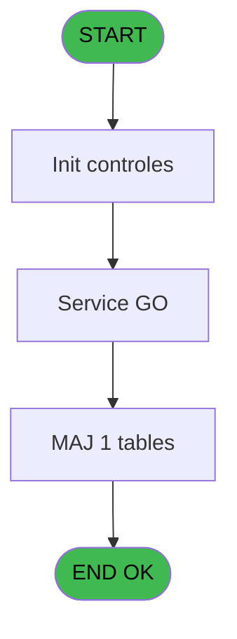
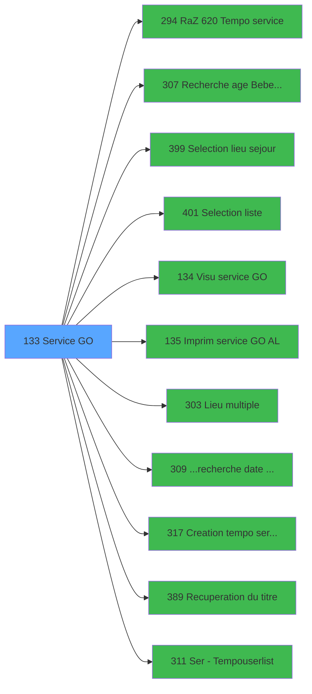

# PBP IDE 133 - Service GO

> **Analyse**: Phases 1-4 2026-02-03 15:25 -> 15:26 (18s) | Assemblage 15:26
> **Pipeline**: V7.2 Enrichi
> **Structure**: 4 onglets (Resume | Ecrans | Donnees | Connexions)

<!-- TAB:Resume -->

## 1. FICHE D'IDENTITE

| Attribut | Valeur |
|----------|--------|
| Projet | PBP |
| IDE Position | 133 |
| Nom Programme | Service GO |
| Fichier source | `Prg_133.xml` |
| Dossier IDE | Gestion |
| Taches | 5 (3 ecrans visibles) |
| Tables modifiees | 1 |
| Programmes appeles | 11 |
| :warning: Statut | **ORPHELIN_POTENTIEL** |

## 2. DESCRIPTION FONCTIONNELLE

**Service GO** assure la gestion complete de ce processus.

Le flux de traitement s'organise en **2 blocs fonctionnels** :

- **Traitement** (4 taches) : traitements metier divers
- **Creation** (1 tache) : insertion d'enregistrements en base (mouvements, prestations)

**Donnees modifiees** : 1 tables en ecriture (tempo_zone_secteur).

Detail : phases du traitement

#### Phase 1 : Traitement (4 taches)

- **133.1** - Service GO **[[ECRAN]](#ecran-t1)**
- **133** - Service GO
- **133.2** - Service GO **[[ECRAN]](#ecran-t10)**
- **133.2.1** - Veuillez patienter ... **[[ECRAN]](#ecran-t11)**

Delegue a : [  Visu service GO (IDE 134)](PBP-IDE-134.md), [Lieu multiple (IDE 303)](PBP-IDE-303.md), [Recuperation du titre (IDE 389)](PBP-IDE-389.md), [Ser -> Tempouserlist (IDE 311)](PBP-IDE-311.md)

#### Phase 2 : Creation (1 tache)

- **133.2.2** - Creation tempo service

Delegue a : [Creation tempo service (IDE 317)](PBP-IDE-317.md)

#### Tables impactees

| Table | Operations | Role metier |
|-------|-----------|-------------|
| tempo_zone_secteur | **W**/L (4 usages) | Table temporaire ecran |

## 3. BLOCS FONCTIONNELS

### 3.1 Traitement (4 taches)

Traitements internes.

---

#### 133.1 - Service GO [[ECRAN]](#ecran-t1)

**Role** : Traitement : Service GO.
**Ecran** : 1094 x 191 DLU (MDI) | [Voir mockup](#ecran-t1)

3 sous-taches directes

| Tache | Nom | Bloc |
|-------|-----|------|
| [133](#t6) | Service GO | Traitement |
| [133.2](#t10) | Service GO **[[ECRAN]](#ecran-t10)** | Traitement |
| [133.2.1](#t11) | Veuillez patienter ... **[[ECRAN]](#ecran-t11)** | Traitement |

**Delegue a** : [  Visu service GO (IDE 134)](PBP-IDE-134.md), [  Imprim service GO AL (IDE 135)](PBP-IDE-135.md), [Lieu multiple (IDE 303)](PBP-IDE-303.md)

---

#### 133 - Service GO

**Role** : Traitement : Service GO.
**Delegue a** : [  Visu service GO (IDE 134)](PBP-IDE-134.md), [  Imprim service GO AL (IDE 135)](PBP-IDE-135.md), [Lieu multiple (IDE 303)](PBP-IDE-303.md)

---

#### 133.2 - Service GO [[ECRAN]](#ecran-t10)

**Role** : Traitement : Service GO.
**Ecran** : 1094 x 191 DLU (MDI) | [Voir mockup](#ecran-t10)
**Delegue a** : [  Visu service GO (IDE 134)](PBP-IDE-134.md), [  Imprim service GO AL (IDE 135)](PBP-IDE-135.md), [Lieu multiple (IDE 303)](PBP-IDE-303.md)

---

#### 133.2.1 - Veuillez patienter ... [[ECRAN]](#ecran-t11)

**Role** : Traitement : Veuillez patienter ....
**Ecran** : 424 x 56 DLU (MDI) | [Voir mockup](#ecran-t11)
**Delegue a** : [  Visu service GO (IDE 134)](PBP-IDE-134.md), [Lieu multiple (IDE 303)](PBP-IDE-303.md), [Recuperation du titre (IDE 389)](PBP-IDE-389.md)

### 3.2 Creation (1 tache)

Insertion de nouveaux enregistrements en base.

---

#### 133.2.2 - Creation tempo service

**Role** : Creation d'enregistrement : Creation tempo service.
**Delegue a** : [Creation tempo service (IDE 317)](PBP-IDE-317.md)

## 5. REGLES METIER

*(Aucune regle metier identifiee)*

## 6. CONTEXTE

- **Appele par**: (aucun)
- **Appelle**: 11 programmes | **Tables**: 11 (W:1 R:2 L:9) | **Taches**: 5 | **Expressions**: 2

<!-- TAB:Ecrans -->

## 8. ECRANS

### 8.1 Forms visibles (3 / 5)

| # | Position | Tache | Nom | Type | Largeur | Hauteur | Bloc |
|---|----------|-------|-----|------|---------|---------|------|
| 1 | 133 | 133.1 | Service GO | MDI | 1094 | 191 | Traitement |
| 2 | 133.1 | 133.2 | Service GO | MDI | 1094 | 191 | Traitement |
| 3 | 133.1.1 | 133.2.1 | Veuillez patienter ... | MDI | 424 | 56 | Traitement |

### 8.2 Mockups Ecrans

---

#### 133 - Service GO
**Tache** : [133.1](#t1) | **Type** : MDI | **Dimensions** : 1094 x 191 DLU
**Bloc** : Traitement | **Titre IDE** : Service GO

<!-- FORM-DATA:
{
    "width":  1094,
    "vFactor":  8,
    "type":  "MDI",
    "hFactor":  8,
    "controls":  [
                     {
                         "x":  1,
                         "type":  "label",
                         "var":  "",
                         "y":  0,
                         "w":  1090,
                         "fmt":  "",
                         "name":  "",
                         "h":  20,
                         "color":  "1",
                         "text":  "",
                         "parent":  null
                     },
                     {
                         "x":  451,
                         "type":  "label",
                         "var":  "",
                         "y":  22,
                         "w":  426,
                         "fmt":  "",
                         "name":  "",
                         "h":  138,
                         "color":  "195",
                         "text":  "Paramètres",
                         "parent":  null
                     },
                     {
                         "x":  15,
                         "type":  "table",
                         "var":  "",
                         "name":  "",
                         "titleH":  12,
                         "color":  "110",
                         "w":  422,
                         "y":  25,
                         "fmt":  "",
                         "parent":  null,
                         "text":  "",
                         "rowH":  11,
                         "h":  135,
                         "cols":  [
                                      {
                                          "title":  "",
                                          "layer":  1,
                                          "w":  395
                                      }
                                  ],
                         "rows":  1
                     },
                     {
                         "x":  889,
                         "type":  "label",
                         "var":  "",
                         "y":  26,
                         "w":  186,
                         "fmt":  "",
                         "name":  "",
                         "h":  134,
                         "color":  "",
                         "text":  "",
                         "parent":  null
                     },
                     {
                         "x":  547,
                         "type":  "label",
                         "var":  "",
                         "y":  36,
                         "w":  218,
                         "fmt":  "",
                         "name":  "",
                         "h":  43,
                         "color":  "",
                         "text":  "",
                         "parent":  5
                     },
                     {
                         "x":  574,
                         "type":  "label",
                         "var":  "",
                         "y":  46,
                         "w":  46,
                         "fmt":  "",
                         "name":  "",
                         "h":  9,
                         "color":  "",
                         "text":  "Total",
                         "parent":  9
                     },
                     {
                         "x":  574,
                         "type":  "label",
                         "var":  "",
                         "y":  59,
                         "w":  78,
                         "fmt":  "",
                         "name":  "",
                         "h":  9,
                         "color":  "",
                         "text":  "Sélection",
                         "parent":  9
                     },
                     {
                         "x":  460,
                         "type":  "label",
                         "var":  "",
                         "y":  108,
                         "w":  61,
                         "fmt":  "",
                         "name":  "",
                         "h":  9,
                         "color":  "",
                         "text":  "Date",
                         "parent":  5
                     },
                     {
                         "x":  460,
                         "type":  "label",
                         "var":  "",
                         "y":  124,
                         "w":  106,
                         "fmt":  "",
                         "name":  "",
                         "h":  9,
                         "color":  "",
                         "text":  "Lieu séjour",
                         "parent":  5
                     },
                     {
                         "x":  460,
                         "type":  "label",
                         "var":  "",
                         "y":  140,
                         "w":  59,
                         "fmt":  "",
                         "name":  "",
                         "h":  9,
                         "color":  "",
                         "text":  "Liste",
                         "parent":  5
                     },
                     {
                         "x":  0,
                         "type":  "label",
                         "var":  "",
                         "y":  165,
                         "w":  1090,
                         "fmt":  "",
                         "name":  "",
                         "h":  24,
                         "color":  "1",
                         "text":  "",
                         "parent":  null
                     },
                     {
                         "x":  570,
                         "type":  "edit",
                         "var":  "",
                         "y":  108,
                         "w":  126,
                         "fmt":  "",
                         "name":  "w0_Date",
                         "h":  10,
                         "color":  "110",
                         "text":  "",
                         "parent":  5
                     },
                     {
                         "x":  701,
                         "type":  "button",
                         "var":  "",
                         "y":  108,
                         "w":  25,
                         "fmt":  "...",
                         "name":  "b_Date",
                         "h":  10,
                         "color":  "",
                         "text":  "",
                         "parent":  5
                     },
                     {
                         "x":  570,
                         "type":  "edit",
                         "var":  "",
                         "y":  140,
                         "w":  182,
                         "fmt":  "",
                         "name":  "w0_Liste",
                         "h":  10,
                         "color":  "110",
                         "text":  "",
                         "parent":  5
                     },
                     {
                         "x":  765,
                         "type":  "button",
                         "var":  "",
                         "y":  140,
                         "w":  25,
                         "fmt":  "...",
                         "name":  "b_Liste",
                         "h":  10,
                         "color":  "",
                         "text":  "",
                         "parent":  5
                     },
                     {
                         "x":  570,
                         "type":  "edit",
                         "var":  "",
                         "y":  124,
                         "w":  26,
                         "fmt":  "",
                         "name":  "w0_LieuSejour",
                         "h":  10,
                         "color":  "110",
                         "text":  "",
                         "parent":  5
                     },
                     {
                         "x":  630,
                         "type":  "edit",
                         "var":  "",
                         "y":  124,
                         "w":  232,
                         "fmt":  "",
                         "name":  "",
                         "h":  8,
                         "color":  "142",
                         "text":  "",
                         "parent":  5
                     },
                     {
                         "x":  600,
                         "type":  "button",
                         "var":  "",
                         "y":  124,
                         "w":  25,
                         "fmt":  "...",
                         "name":  "b_LieuSejour",
                         "h":  10,
                         "color":  "",
                         "text":  "",
                         "parent":  5
                     },
                     {
                         "x":  58,
                         "type":  "edit",
                         "var":  "",
                         "y":  28,
                         "w":  344,
                         "fmt":  "",
                         "name":  "SER LIBELLE TRENTE",
                         "h":  8,
                         "color":  "110",
                         "text":  "",
                         "parent":  6
                     },
                     {
                         "x":  21,
                         "type":  "checkbox",
                         "var":  "",
                         "y":  28,
                         "w":  30,
                         "fmt":  "",
                         "name":  "TUL MARQUEUR",
                         "h":  9,
                         "color":  "110",
                         "text":  "v. marqueur",
                         "parent":  6
                     },
                     {
                         "x":  666,
                         "type":  "edit",
                         "var":  "",
                         "y":  46,
                         "w":  56,
                         "fmt":  "",
                         "name":  "w0_Total",
                         "h":  9,
                         "color":  "",
                         "text":  "",
                         "parent":  9
                     },
                     {
                         "x":  666,
                         "type":  "edit",
                         "var":  "",
                         "y":  59,
                         "w":  56,
                         "fmt":  "",
                         "name":  "w0_Selection",
                         "h":  9,
                         "color":  "",
                         "text":  "",
                         "parent":  9
                     },
                     {
                         "x":  907,
                         "type":  "button",
                         "var":  "",
                         "y":  108,
                         "w":  154,
                         "fmt":  "\u0026Ecran",
                         "name":  "b_Ecran",
                         "h":  18,
                         "color":  "",
                         "text":  "",
                         "parent":  7
                     },
                     {
                         "x":  907,
                         "type":  "button",
                         "var":  "",
                         "y":  132,
                         "w":  154,
                         "fmt":  "\u0026Impression",
                         "name":  "b_Edition",
                         "h":  18,
                         "color":  "",
                         "text":  "",
                         "parent":  7
                     },
                     {
                         "x":  5,
                         "type":  "edit",
                         "var":  "",
                         "y":  2,
                         "w":  267,
                         "fmt":  "20",
                         "name":  "",
                         "h":  8,
                         "color":  "",
                         "text":  "",
                         "parent":  1
                     },
                     {
                         "x":  809,
                         "type":  "edit",
                         "var":  "",
                         "y":  6,
                         "w":  270,
                         "fmt":  "WWW DD MMM YYYYT",
                         "name":  "",
                         "h":  8,
                         "color":  "",
                         "text":  "",
                         "parent":  1
                     },
                     {
                         "x":  5,
                         "type":  "edit",
                         "var":  "",
                         "y":  11,
                         "w":  331,
                         "fmt":  "25",
                         "name":  "",
                         "h":  8,
                         "color":  "",
                         "text":  "",
                         "parent":  null
                     },
                     {
                         "x":  903,
                         "type":  "image",
                         "var":  "",
                         "y":  42,
                         "w":  162,
                         "fmt":  "",
                         "name":  "",
                         "h":  53,
                         "color":  "",
                         "text":  "",
                         "parent":  7
                     },
                     {
                         "x":  8,
                         "type":  "button",
                         "var":  "",
                         "y":  168,
                         "w":  154,
                         "fmt":  "\u0026Quitter",
                         "name":  "",
                         "h":  18,
                         "color":  "",
                         "text":  "",
                         "parent":  22
                     }
                 ],
    "taskId":  "133",
    "height":  191
}
-->

<strong>Champs : 11 champs</strong>

| Pos (x,y) | Nom | Variable | Type |
|-----------|-----|----------|------|
| 570,108 | w0_Date | - | edit |
| 570,140 | w0_Liste | - | edit |
| 570,124 | w0_LieuSejour | - | edit |
| 630,124 | (sans nom) | - | edit |
| 58,28 | SER LIBELLE TRENTE | - | edit |
| 21,28 | TUL MARQUEUR | - | checkbox |
| 666,46 | w0_Total | - | edit |
| 666,59 | w0_Selection | - | edit |
| 5,2 | 20 | - | edit |
| 809,6 | WWW DD MMM YYYYT | - | edit |
| 5,11 | 25 | - | edit |

<strong>Boutons : 6 boutons</strong>

| Bouton | Pos (x,y) | Action |
|--------|-----------|--------|
| ... | 701,108 | Appel [...recherche date minimum (IDE 309)](PBP-IDE-309.md) |
| ... | 765,140 | Appel [...recherche date minimum (IDE 309)](PBP-IDE-309.md) |
| ... | 600,124 | Appel [...recherche date minimum (IDE 309)](PBP-IDE-309.md) |
| Ecran | 907,108 | Bouton fonctionnel |
| Impression | 907,132 | Bouton fonctionnel |
| Quitter | 8,168 | Quitte le programme |

---

#### 133.1 - Service GO
**Tache** : [133.2](#t10) | **Type** : MDI | **Dimensions** : 1094 x 191 DLU
**Bloc** : Traitement | **Titre IDE** : Service GO

<!-- FORM-DATA:
{
    "width":  1094,
    "vFactor":  8,
    "type":  "MDI",
    "hFactor":  8,
    "controls":  [
                     {
                         "x":  1,
                         "type":  "label",
                         "var":  "",
                         "y":  0,
                         "w":  1090,
                         "fmt":  "",
                         "name":  "",
                         "h":  20,
                         "color":  "1",
                         "text":  "",
                         "parent":  null
                     },
                     {
                         "x":  451,
                         "type":  "label",
                         "var":  "",
                         "y":  22,
                         "w":  426,
                         "fmt":  "",
                         "name":  "",
                         "h":  138,
                         "color":  "195",
                         "text":  "Paramètres",
                         "parent":  null
                     },
                     {
                         "x":  15,
                         "type":  "table",
                         "var":  "",
                         "name":  "",
                         "titleH":  12,
                         "color":  "110",
                         "w":  422,
                         "y":  25,
                         "fmt":  "",
                         "parent":  null,
                         "text":  "",
                         "rowH":  11,
                         "h":  135,
                         "cols":  [
                                      {
                                          "title":  "",
                                          "layer":  1,
                                          "w":  395
                                      }
                                  ],
                         "rows":  1
                     },
                     {
                         "x":  889,
                         "type":  "label",
                         "var":  "",
                         "y":  26,
                         "w":  186,
                         "fmt":  "",
                         "name":  "",
                         "h":  134,
                         "color":  "",
                         "text":  "",
                         "parent":  null
                     },
                     {
                         "x":  547,
                         "type":  "label",
                         "var":  "",
                         "y":  36,
                         "w":  218,
                         "fmt":  "",
                         "name":  "",
                         "h":  43,
                         "color":  "",
                         "text":  "",
                         "parent":  5
                     },
                     {
                         "x":  574,
                         "type":  "label",
                         "var":  "",
                         "y":  46,
                         "w":  46,
                         "fmt":  "",
                         "name":  "",
                         "h":  9,
                         "color":  "",
                         "text":  "Total",
                         "parent":  9
                     },
                     {
                         "x":  574,
                         "type":  "label",
                         "var":  "",
                         "y":  59,
                         "w":  78,
                         "fmt":  "",
                         "name":  "",
                         "h":  9,
                         "color":  "",
                         "text":  "Sélection",
                         "parent":  9
                     },
                     {
                         "x":  460,
                         "type":  "label",
                         "var":  "",
                         "y":  108,
                         "w":  61,
                         "fmt":  "",
                         "name":  "",
                         "h":  9,
                         "color":  "",
                         "text":  "Date",
                         "parent":  5
                     },
                     {
                         "x":  460,
                         "type":  "label",
                         "var":  "",
                         "y":  124,
                         "w":  106,
                         "fmt":  "",
                         "name":  "",
                         "h":  9,
                         "color":  "",
                         "text":  "Lieu séjour",
                         "parent":  5
                     },
                     {
                         "x":  460,
                         "type":  "label",
                         "var":  "",
                         "y":  140,
                         "w":  59,
                         "fmt":  "",
                         "name":  "",
                         "h":  9,
                         "color":  "",
                         "text":  "Liste",
                         "parent":  5
                     },
                     {
                         "x":  0,
                         "type":  "label",
                         "var":  "",
                         "y":  165,
                         "w":  1090,
                         "fmt":  "",
                         "name":  "",
                         "h":  24,
                         "color":  "1",
                         "text":  "",
                         "parent":  null
                     },
                     {
                         "x":  570,
                         "type":  "edit",
                         "var":  "",
                         "y":  108,
                         "w":  126,
                         "fmt":  "",
                         "name":  "w0_Date",
                         "h":  10,
                         "color":  "110",
                         "text":  "",
                         "parent":  5
                     },
                     {
                         "x":  701,
                         "type":  "button",
                         "var":  "",
                         "y":  108,
                         "w":  25,
                         "fmt":  "...",
                         "name":  "b_Date",
                         "h":  10,
                         "color":  "",
                         "text":  "",
                         "parent":  5
                     },
                     {
                         "x":  570,
                         "type":  "edit",
                         "var":  "",
                         "y":  140,
                         "w":  182,
                         "fmt":  "",
                         "name":  "w0_Liste",
                         "h":  10,
                         "color":  "110",
                         "text":  "",
                         "parent":  5
                     },
                     {
                         "x":  765,
                         "type":  "button",
                         "var":  "",
                         "y":  140,
                         "w":  25,
                         "fmt":  "...",
                         "name":  "b_Liste",
                         "h":  10,
                         "color":  "",
                         "text":  "",
                         "parent":  5
                     },
                     {
                         "x":  570,
                         "type":  "edit",
                         "var":  "",
                         "y":  124,
                         "w":  26,
                         "fmt":  "",
                         "name":  "w0_LieuSejour",
                         "h":  10,
                         "color":  "110",
                         "text":  "",
                         "parent":  5
                     },
                     {
                         "x":  630,
                         "type":  "edit",
                         "var":  "",
                         "y":  124,
                         "w":  232,
                         "fmt":  "",
                         "name":  "",
                         "h":  8,
                         "color":  "142",
                         "text":  "",
                         "parent":  5
                     },
                     {
                         "x":  600,
                         "type":  "button",
                         "var":  "",
                         "y":  124,
                         "w":  25,
                         "fmt":  "...",
                         "name":  "b_LieuSejour",
                         "h":  10,
                         "color":  "",
                         "text":  "",
                         "parent":  5
                     },
                     {
                         "x":  58,
                         "type":  "edit",
                         "var":  "",
                         "y":  28,
                         "w":  344,
                         "fmt":  "",
                         "name":  "SER LIBELLE TRENTE",
                         "h":  8,
                         "color":  "110",
                         "text":  "",
                         "parent":  6
                     },
                     {
                         "x":  21,
                         "type":  "checkbox",
                         "var":  "",
                         "y":  28,
                         "w":  30,
                         "fmt":  "",
                         "name":  "TUL MARQUEUR",
                         "h":  9,
                         "color":  "110",
                         "text":  "v. marqueur",
                         "parent":  6
                     },
                     {
                         "x":  666,
                         "type":  "edit",
                         "var":  "",
                         "y":  46,
                         "w":  56,
                         "fmt":  "",
                         "name":  "w0_Total",
                         "h":  9,
                         "color":  "",
                         "text":  "",
                         "parent":  9
                     },
                     {
                         "x":  666,
                         "type":  "edit",
                         "var":  "",
                         "y":  59,
                         "w":  56,
                         "fmt":  "",
                         "name":  "w0_Selection",
                         "h":  9,
                         "color":  "",
                         "text":  "",
                         "parent":  9
                     },
                     {
                         "x":  907,
                         "type":  "button",
                         "var":  "",
                         "y":  108,
                         "w":  154,
                         "fmt":  "\u0026Ecran",
                         "name":  "b_Ecran",
                         "h":  18,
                         "color":  "",
                         "text":  "",
                         "parent":  7
                     },
                     {
                         "x":  907,
                         "type":  "button",
                         "var":  "",
                         "y":  132,
                         "w":  154,
                         "fmt":  "\u0026Impression",
                         "name":  "b_Edition",
                         "h":  18,
                         "color":  "",
                         "text":  "",
                         "parent":  7
                     },
                     {
                         "x":  5,
                         "type":  "edit",
                         "var":  "",
                         "y":  2,
                         "w":  267,
                         "fmt":  "20",
                         "name":  "",
                         "h":  8,
                         "color":  "",
                         "text":  "",
                         "parent":  1
                     },
                     {
                         "x":  809,
                         "type":  "edit",
                         "var":  "",
                         "y":  6,
                         "w":  270,
                         "fmt":  "WWW DD MMM YYYYT",
                         "name":  "",
                         "h":  8,
                         "color":  "",
                         "text":  "",
                         "parent":  1
                     },
                     {
                         "x":  5,
                         "type":  "edit",
                         "var":  "",
                         "y":  11,
                         "w":  331,
                         "fmt":  "25",
                         "name":  "",
                         "h":  8,
                         "color":  "",
                         "text":  "",
                         "parent":  null
                     },
                     {
                         "x":  903,
                         "type":  "image",
                         "var":  "",
                         "y":  42,
                         "w":  162,
                         "fmt":  "",
                         "name":  "",
                         "h":  53,
                         "color":  "",
                         "text":  "",
                         "parent":  7
                     },
                     {
                         "x":  8,
                         "type":  "button",
                         "var":  "",
                         "y":  168,
                         "w":  154,
                         "fmt":  "\u0026Quitter",
                         "name":  "",
                         "h":  18,
                         "color":  "",
                         "text":  "",
                         "parent":  22
                     }
                 ],
    "taskId":  "133.1",
    "height":  191
}
-->

<strong>Champs : 11 champs</strong>

| Pos (x,y) | Nom | Variable | Type |
|-----------|-----|----------|------|
| 570,108 | w0_Date | - | edit |
| 570,140 | w0_Liste | - | edit |
| 570,124 | w0_LieuSejour | - | edit |
| 630,124 | (sans nom) | - | edit |
| 58,28 | SER LIBELLE TRENTE | - | edit |
| 21,28 | TUL MARQUEUR | - | checkbox |
| 666,46 | w0_Total | - | edit |
| 666,59 | w0_Selection | - | edit |
| 5,2 | 20 | - | edit |
| 809,6 | WWW DD MMM YYYYT | - | edit |
| 5,11 | 25 | - | edit |

<strong>Boutons : 6 boutons</strong>

| Bouton | Pos (x,y) | Action |
|--------|-----------|--------|
| ... | 701,108 | Appel [...recherche date minimum (IDE 309)](PBP-IDE-309.md) |
| ... | 765,140 | Appel [...recherche date minimum (IDE 309)](PBP-IDE-309.md) |
| ... | 600,124 | Appel [...recherche date minimum (IDE 309)](PBP-IDE-309.md) |
| Ecran | 907,108 | Bouton fonctionnel |
| Impression | 907,132 | Bouton fonctionnel |
| Quitter | 8,168 | Quitte le programme |

---

#### 133.1.1 - Veuillez patienter ...
**Tache** : [133.2.1](#t11) | **Type** : MDI | **Dimensions** : 424 x 56 DLU
**Bloc** : Traitement | **Titre IDE** : Veuillez patienter ...

<!-- FORM-DATA:
{
    "width":  424,
    "vFactor":  8,
    "type":  "MDI",
    "hFactor":  8,
    "controls":  [
                     {
                         "x":  0,
                         "type":  "label",
                         "var":  "",
                         "y":  0,
                         "w":  423,
                         "fmt":  "",
                         "name":  "",
                         "h":  29,
                         "color":  "",
                         "text":  "",
                         "parent":  null
                     },
                     {
                         "x":  120,
                         "type":  "label",
                         "var":  "",
                         "y":  10,
                         "w":  221,
                         "fmt":  "",
                         "name":  "",
                         "h":  8,
                         "color":  "7",
                         "text":  "Traitement en cours ...",
                         "parent":  null
                     },
                     {
                         "x":  0,
                         "type":  "label",
                         "var":  "",
                         "y":  29,
                         "w":  423,
                         "fmt":  "",
                         "name":  "",
                         "h":  27,
                         "color":  "",
                         "text":  "",
                         "parent":  null
                     },
                     {
                         "x":  72,
                         "type":  "label",
                         "var":  "",
                         "y":  38,
                         "w":  267,
                         "fmt":  "",
                         "name":  "",
                         "h":  8,
                         "color":  "",
                         "text":  "Preparation table temporaire",
                         "parent":  null
                     },
                     {
                         "x":  4,
                         "type":  "image",
                         "var":  "",
                         "y":  2,
                         "w":  72,
                         "fmt":  "",
                         "name":  "",
                         "h":  25,
                         "color":  "",
                         "text":  "",
                         "parent":  null
                     }
                 ],
    "taskId":  "133.1.1",
    "height":  56
}
-->

## 9. NAVIGATION

### 9.1 Enchainement des ecrans

```mermaid
flowchart TD
    START([Entree])
    style START fill:#3fb950
    VF1[133.1 Service GO]
    style VF1 fill:#58a6ff
    VF10[133.2 Service GO]
    style VF10 fill:#58a6ff
    VF11[133.2.1 Veuillez patienter...]
    style VF11 fill:#58a6ff
    EXT294[IDE 294 RaZ 620 Tempo ...]
    style EXT294 fill:#3fb950
    EXT307[IDE 307 Recherche age ...]
    style EXT307 fill:#3fb950
    EXT399[IDE 399 Selection lieu...]
    style EXT399 fill:#3fb950
    EXT401[IDE 401 Selection liste]
    style EXT401 fill:#3fb950
    EXT134[IDE 134 Visu service GO]
    style EXT134 fill:#3fb950
    EXT135[IDE 135 Imprim service...]
    style EXT135 fill:#3fb950
    EXT303[IDE 303 Lieu multiple]
    style EXT303 fill:#3fb950
    EXT309[IDE 309 ...recherche d...]
    style EXT309 fill:#3fb950
    EXT317[IDE 317 Creation tempo...]
    style EXT317 fill:#3fb950
    EXT389[IDE 389 Recuperation d...]
    style EXT389 fill:#3fb950
    EXT311[IDE 311 Ser - Tempouse...]
    style EXT311 fill:#3fb950
    FIN([Sortie])
    style FIN fill:#f85149
    START --> VF1
    VF1 -->|Reinitialisation| EXT294
    VF1 -->|Sous-programme| EXT307
    VF1 -->|Selection/consultation| EXT399
    VF1 -->|Selection/consultation| EXT401
    VF1 -->|Sous-programme| EXT134
    VF1 -->|Impression ticket/document| EXT135
    VF1 -->|Sous-programme| EXT303
    VF1 -->|Sous-programme| EXT309
    EXT311 --> FIN
```

**Detail par enchainement :**

| Depuis | Action | Vers | Retour |
|--------|--------|------|--------|
| Service GO | Reinitialisation | [RaZ 620 Tempo service (IDE 294)](PBP-IDE-294.md) | Retour ecran |
| Service GO | Sous-programme | [Recherche age Bebe_Enfant (IDE 307)](PBP-IDE-307.md) | Retour ecran |
| Service GO | Selection/consultation | [Selection lieu sejour (IDE 399)](PBP-IDE-399.md) | Retour ecran |
| Service GO | Selection/consultation | [Selection liste (IDE 401)](PBP-IDE-401.md) | Retour ecran |
| Service GO | Sous-programme | [  Visu service GO (IDE 134)](PBP-IDE-134.md) | Retour ecran |
| Service GO | Impression ticket/document | [  Imprim service GO AL (IDE 135)](PBP-IDE-135.md) | Retour ecran |
| Service GO | Sous-programme | [Lieu multiple (IDE 303)](PBP-IDE-303.md) | Retour ecran |
| Service GO | Sous-programme | [...recherche date minimum (IDE 309)](PBP-IDE-309.md) | Retour ecran |
| Service GO | Sous-programme | [Creation tempo service (IDE 317)](PBP-IDE-317.md) | Retour ecran |
| Service GO | Recuperation donnees | [Recuperation du titre (IDE 389)](PBP-IDE-389.md) | Retour ecran |
| Service GO | Configuration impression | [Ser -> Tempouserlist (IDE 311)](PBP-IDE-311.md) | Retour ecran |

### 9.3 Structure hierarchique (5 taches)

| Position | Tache | Type | Dimensions | Bloc |
|----------|-------|------|------------|------|
| **133.1** | [**Service GO** (133.1)](#t1) [mockup](#ecran-t1) | MDI | 1094x191 | Traitement |
| 133.1.1 | [Service GO (133)](#t6) | - | - | |
| 133.1.2 | [Service GO (133.2)](#t10) [mockup](#ecran-t10) | MDI | 1094x191 | |
| 133.1.3 | [Veuillez patienter ... (133.2.1)](#t11) [mockup](#ecran-t11) | MDI | 424x56 | |
| **133.2** | [**Creation tempo service** (133.2.2)](#t15) | MDI | - | Creation |

### 9.4 Algorigramme

> **Legende**: Vert = START/END OK | Rouge = END KO | Bleu = Decisions
> *Algorigramme auto-genere. Utiliser `/algorigramme` pour une synthese metier detaillee.*

<!-- TAB:Donnees -->

## 10. TABLES

### Tables utilisees (11)

| ID | Nom | Description | Type | R | W | L | Usages |
|----|-----|-------------|------|---|---|---|--------|
| 34 | hebergement______heb | Hebergement (chambres) | DB | R |   |   | 1 |
| 35 | personnel_go______go |  | DB |   |   | L | 1 |
| 81 | societe__________soc |  | DB | R |   |   | 2 |
| 104 | fichier_menage |  | DB |   |   | L | 1 |
| 117 | tables_services | Services / filieres | DB |   |   | L | 1 |
| 118 | tables_imports |  | DB |   |   | L | 2 |
| 134 | groupe_arr_dep___vol |  | DB |   |   | L | 2 |
| 598 | tempo_ecr_previsions | Table temporaire ecran | TMP |   |   | L | 1 |
| 620 | zip_chambre |  | TMP |   |   | L | 1 |
| 637 | tempo_zone_secteur | Table temporaire ecran | DB |   | **W** | L | 4 |
| 1094 | Table_1094 |  | MEM |   |   | L | 1 |

### Colonnes par table (4 / 3 tables avec colonnes identifiees)

Table 34 - hebergement______heb (R) - 1 usages

| Lettre | Variable | Acces | Type |
|--------|----------|-------|------|
| A | >DateCalcul | R | Date |
| B | >Categorie(TUL) | R | Alpha |
| C | >NomTable(TUL) | R | Alpha |
| D | >Total | R | Numeric |
| E | >NbSelect | R | Numeric |
| F | w0_RetPresent | R | Logical |

Table 81 - societe__________soc (R) - 2 usages

| Lettre | Variable | Acces | Type |
|--------|----------|-------|------|
| A | >TypeVol | R | Alpha |
| B | w0_Categorie(TUL) | R | Alpha |
| C | w0_NomTable(TUL) | R | Alpha |
| D | w0_Date | R | Date |
| E | b_Date | R | Alpha |
| F | w0_Liste | R | Alpha |
| G | b_Liste | R | Alpha |
| H | W0 top liste | R | Alpha |
| I | retour categorie | R | Logical |
| J | W0 categorie | R | Alpha |
| K | bouton zoom categorie | R | Alpha |
| L | w0_LieuSejour | R | Alpha |
| M | b_LieuSejour | R | Alpha |
| N | v. marqueur | R | Logical |
| O | b_Sejour | R | Alpha |
| P | w0_Total | R | Numeric |
| Q | w0_Selection | R | Numeric |
| R | v. titre | R | Alpha |
| S | W0 nom societe | R | Alpha |
| T | W0 date minimum | R | Date |
| U | w0_SejourMulti | R | Logical |
| V | Ww0_AgeBebe | R | Numeric |
| W | w0_AgeEnfant | R | Numeric |
| X | b_Ecran | R | Alpha |
| Y | b_Edition | R | Alpha |
| Z | b_Edition | R | Alpha |

Table 637 - tempo_zone_secteur (**W**/L) - 4 usages

| Lettre | Variable | Acces | Type |
|--------|----------|-------|------|
| A | >Categorie | W | Alpha |
| B | >NomTable | W | Alpha |
| C | v. goj_job_family | W | Unicode |

## 11. VARIABLES

### 11.1 Variables de session (2)

Variables persistantes pendant toute la session.

| Lettre | Nom | Type | Usage dans |
|--------|-----|------|-----------|
| N | v. marqueur | Logical | - |
| R | v. titre | Alpha | - |

### 11.2 Variables de travail (4)

Variables internes au programme.

| Lettre | Nom | Type | Usage dans |
|--------|-----|------|-----------|
| H | W0 top liste | Alpha | - |
| J | W0 categorie | Alpha | - |
| S | W0 nom societe | Alpha | - |
| T | W0 date minimum | Date | - |

### 11.3 Autres (20)

Variables diverses.

| Lettre | Nom | Type | Usage dans |
|--------|-----|------|-----------|
| A | >TypeVol | Alpha | - |
| B | w0_Categorie(TUL) | Alpha | - |
| C | w0_NomTable(TUL) | Alpha | - |
| D | w0_Date | Date | - |
| E | b_Date | Alpha | - |
| F | w0_Liste | Alpha | - |
| G | b_Liste | Alpha | - |
| I | retour categorie | Logical | - |
| K | bouton zoom categorie | Alpha | - |
| L | w0_LieuSejour | Alpha | - |
| M | b_LieuSejour | Alpha | - |
| O | b_Sejour | Alpha | - |
| P | w0_Total | Numeric | - |
| Q | w0_Selection | Numeric | - |
| U | w0_SejourMulti | Logical | - |
| V | Ww0_AgeBebe | Numeric | - |
| W | w0_AgeEnfant | Numeric | - |
| X | b_Ecran | Alpha | - |
| Y | b_Edition | Alpha | - |
| Z | b_Edition | Alpha | - |

Toutes les 26 variables (liste complete)

| Cat | Lettre | Nom Variable | Type |
|-----|--------|--------------|------|
| W0 | **H** | W0 top liste | Alpha |
| W0 | **J** | W0 categorie | Alpha |
| W0 | **S** | W0 nom societe | Alpha |
| W0 | **T** | W0 date minimum | Date |
| V. | **N** | v. marqueur | Logical |
| V. | **R** | v. titre | Alpha |
| Autre | **A** | >TypeVol | Alpha |
| Autre | **B** | w0_Categorie(TUL) | Alpha |
| Autre | **C** | w0_NomTable(TUL) | Alpha |
| Autre | **D** | w0_Date | Date |
| Autre | **E** | b_Date | Alpha |
| Autre | **F** | w0_Liste | Alpha |
| Autre | **G** | b_Liste | Alpha |
| Autre | **I** | retour categorie | Logical |
| Autre | **K** | bouton zoom categorie | Alpha |
| Autre | **L** | w0_LieuSejour | Alpha |
| Autre | **M** | b_LieuSejour | Alpha |
| Autre | **O** | b_Sejour | Alpha |
| Autre | **P** | w0_Total | Numeric |
| Autre | **Q** | w0_Selection | Numeric |
| Autre | **U** | w0_SejourMulti | Logical |
| Autre | **V** | Ww0_AgeBebe | Numeric |
| Autre | **W** | w0_AgeEnfant | Numeric |
| Autre | **X** | b_Ecran | Alpha |
| Autre | **Y** | b_Edition | Alpha |
| Autre | **Z** | b_Edition | Alpha |

## 12. EXPRESSIONS

**2 / 2 expressions decodees (100%)**

### 12.1 Repartition par type

| Type | Expressions | Regles |
|------|-------------|--------|
| REFERENCE_VG | 1 | 0 |
| OTHER | 1 | 0 |

### 12.2 Expressions cles par type

#### REFERENCE_VG (1 expressions)

| Type | IDE | Expression | Regle |
|------|-----|------------|-------|
| REFERENCE_VG | 1 | `VG117` | - |

#### OTHER (1 expressions)

| Type | IDE | Expression | Regle |
|------|-----|------------|-------|
| OTHER | 2 | `NOT(VG117)` | - |

<!-- TAB:Connexions -->

## 13. GRAPHE D'APPELS

### 13.1 Chaine depuis Main (Callers)

**Chemin**: (pas de callers directs)

### 13.2 Callers

| IDE | Nom Programme | Nb Appels |
|-----|---------------|-----------|
| - | (aucun) | - |

### 13.3 Callees (programmes appeles)

### 13.4 Detail Callees avec contexte

| IDE | Nom Programme | Appels | Contexte |
|-----|---------------|--------|----------|
| [294](PBP-IDE-294.md) | RaZ 620 Tempo service | 4 | Reinitialisation |
| [307](PBP-IDE-307.md) | Recherche age Bebe_Enfant | 4 | Sous-programme |
| [399](PBP-IDE-399.md) | Selection lieu sejour | 4 | Selection/consultation |
| [401](PBP-IDE-401.md) | Selection liste | 4 | Selection/consultation |
| [134](PBP-IDE-134.md) |   Visu service GO | 2 | Sous-programme |
| [135](PBP-IDE-135.md) |   Imprim service GO AL | 2 | Impression ticket/document |
| [303](PBP-IDE-303.md) | Lieu multiple | 2 | Sous-programme |
| [309](PBP-IDE-309.md) | ...recherche date minimum | 2 | Sous-programme |
| [317](PBP-IDE-317.md) | Creation tempo service | 2 | Sous-programme |
| [389](PBP-IDE-389.md) | Recuperation du titre | 2 | Recuperation donnees |
| [311](PBP-IDE-311.md) | Ser -> Tempouserlist | 1 | Configuration impression |

## 14. RECOMMANDATIONS MIGRATION

### 14.1 Profil du programme

| Metrique | Valeur | Impact migration |
|----------|--------|-----------------|
| Lignes de logique | 360 | Taille moyenne |
| Expressions | 2 | Peu de logique |
| Tables WRITE | 1 | Impact faible |
| Sous-programmes | 11 | Forte dependance |
| Ecrans visibles | 3 | Quelques ecrans |
| Code desactive | 0% (0 / 360) | Code sain |
| Regles metier | 0 | Pas de regle identifiee |

### 14.2 Plan de migration par bloc

#### Traitement (4 taches: 3 ecrans, 1 traitement)

- **Strategie** : Orchestrateur avec 3 ecrans (Razor/React) et 1 traitements backend (services).
- Les ecrans deviennent des composants UI, les traitements invisibles deviennent des services injectables.
- 11 sous-programme(s) a migrer ou a reutiliser depuis les services existants.
- Decomposer les taches en services unitaires testables.

#### Creation (1 tache: 0 ecran, 1 traitement)

- **Strategie** : Repository pattern avec Entity Framework Core.
- Insertion via `IRepository<T>.CreateAsync()`

### 14.3 Dependances critiques

| Dependance | Type | Appels | Impact |
|------------|------|--------|--------|
| tempo_zone_secteur | Table WRITE (Database) | 1x | Schema + repository |
| [Selection lieu sejour (IDE 399)](PBP-IDE-399.md) | Sous-programme | 4x | **CRITIQUE** - Selection/consultation |
| [Selection liste (IDE 401)](PBP-IDE-401.md) | Sous-programme | 4x | **CRITIQUE** - Selection/consultation |
| [RaZ 620 Tempo service (IDE 294)](PBP-IDE-294.md) | Sous-programme | 4x | **CRITIQUE** - Reinitialisation |
| [Recherche age Bebe_Enfant (IDE 307)](PBP-IDE-307.md) | Sous-programme | 4x | **CRITIQUE** - Sous-programme |
| [...recherche date minimum (IDE 309)](PBP-IDE-309.md) | Sous-programme | 2x | Haute - Sous-programme |
| [Creation tempo service (IDE 317)](PBP-IDE-317.md) | Sous-programme | 2x | Haute - Sous-programme |
| [Recuperation du titre (IDE 389)](PBP-IDE-389.md) | Sous-programme | 2x | Haute - Recuperation donnees |
| [  Visu service GO (IDE 134)](PBP-IDE-134.md) | Sous-programme | 2x | Haute - Sous-programme |
| [  Imprim service GO AL (IDE 135)](PBP-IDE-135.md) | Sous-programme | 2x | Haute - Impression ticket/document |
| [Lieu multiple (IDE 303)](PBP-IDE-303.md) | Sous-programme | 2x | Haute - Sous-programme |

---
*Spec DETAILED generee par Pipeline V7.2 - 2026-02-03 15:26*
