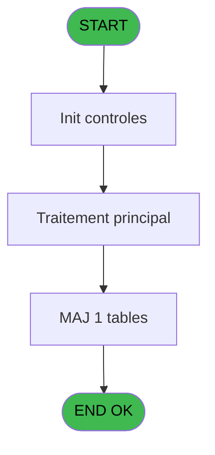
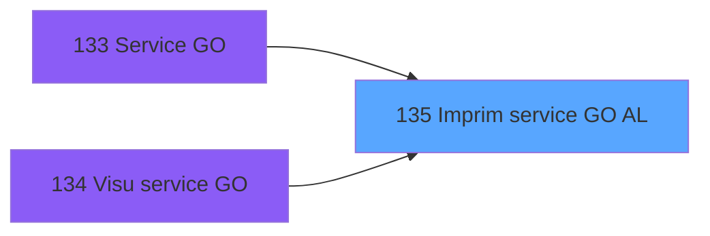

# PBP IDE 135 - Imprim service GO AL

> **Analyse**: Phases 1-4 2026-02-03 15:26 -> 15:26 (17s) | Assemblage 15:26
> **Pipeline**: V7.2 Enrichi
> **Structure**: 4 onglets (Resume | Ecrans | Donnees | Connexions)

<!-- TAB:Resume -->

## 1. FICHE D'IDENTITE

| Attribut | Valeur |
|----------|--------|
| Projet | PBP |
| IDE Position | 135 |
| Nom Programme | Imprim service GO AL |
| Fichier source | `Prg_135.xml` |
| Dossier IDE | Gestion |
| Taches | 1 (0 ecrans visibles) |
| Tables modifiees | 1 |
| Programmes appeles | 0 |

## 2. DESCRIPTION FONCTIONNELLE

**Imprim service GO AL** assure la gestion complete de ce processus, accessible depuis [Service GO (IDE 133)](PBP-IDE-133.md), [  Visu service GO (IDE 134)](PBP-IDE-134.md).

Le flux de traitement s'organise en **1 blocs fonctionnels** :

- **Traitement** (1 tache) : traitements metier divers

**Donnees modifiees** : 1 tables en ecriture (zip_chambre).

## 3. BLOCS FONCTIONNELS

### 3.1 Traitement (1 tache)

Traitements internes.

---

#### 135 - Veuillez patienter... [[ECRAN]](#ecran-t1)

**Role** : Traitement : Veuillez patienter....
**Ecran** : 426 x 57 DLU (MDI) | [Voir mockup](#ecran-t1)

## 5. REGLES METIER

*(Aucune regle metier identifiee)*

## 6. CONTEXTE

- **Appele par**: [Service GO (IDE 133)](PBP-IDE-133.md), [  Visu service GO (IDE 134)](PBP-IDE-134.md)
- **Appelle**: 0 programmes | **Tables**: 1 (W:1 R:0 L:0) | **Taches**: 1 | **Expressions**: 10

<!-- TAB:Ecrans -->

## 8. ECRANS

*(Programme sans ecran visible)*

## 9. NAVIGATION

### 9.3 Structure hierarchique (1 tache)

| Position | Tache | Type | Dimensions | Bloc |
|----------|-------|------|------------|------|
| **135.1** | [**Veuillez patienter...** (135)](#t1) [mockup](#ecran-t1) | MDI | 426x57 | Traitement |

### 9.4 Algorigramme

> **Legende**: Vert = START/END OK | Rouge = END KO | Bleu = Decisions
> *Algorigramme auto-genere. Utiliser `/algorigramme` pour une synthese metier detaillee.*

<!-- TAB:Donnees -->

## 10. TABLES

### Tables utilisees (1)

| ID | Nom | Description | Type | R | W | L | Usages |
|----|-----|-------------|------|---|---|---|--------|
| 620 | zip_chambre |  | TMP |   | **W** |   | 1 |

### Colonnes par table (1 / 1 tables avec colonnes identifiees)

Table 620 - zip_chambre (**W**) - 1 usages

| Lettre | Variable | Acces | Type |
|--------|----------|-------|------|
| A | >DateCalcul | W | Date |
| B | >Total | W | Numeric |
| C | >NbSelect | W | Numeric |

## 11. VARIABLES

### 11.1 Autres (3)

Variables diverses.

| Lettre | Nom | Type | Usage dans |
|--------|-----|------|-----------|
| A | >DateCalcul | Date | 2x refs |
| B | >Total | Numeric | - |
| C | >NbSelect | Numeric | 2x refs |

## 12. EXPRESSIONS

**10 / 10 expressions decodees (100%)**

### 12.1 Repartition par type

| Type | Expressions | Regles |
|------|-------------|--------|
| CONCATENATION | 4 | 0 |
| OTHER | 2 | 0 |
| REFERENCE_VG | 1 | 0 |
| CONDITION | 3 | 0 |

### 12.2 Expressions cles par type

#### CONCATENATION (4 expressions)

| Type | IDE | Expression | Regle |
|------|-----|------------|-------|
| CONCATENATION | 5 | `MlsTrans ('Edition du')&' '&DStr (Date (),'DD/MM/YYYY')&' '&MlsTrans ('à')&' '&TStr (Time (),'HH:MM:SS')` | - |
| CONCATENATION | 8 | `MlsTrans ('Aucune selection à la date du')&' '&DStr (>DateCalcul [A],'DD/MM/YYYY')` | - |
| CONCATENATION | 6 | `'- '&Str (Page (0,1),'3P0Z0')&' -'` | - |
| CONCATENATION | 1 | `MlsTrans ('LISTE DES SERVICES PLANNING DU')&' '&DStr (>DateCalcul [A],'DD/MM/YYYY')` | - |

#### OTHER (2 expressions)

| Type | IDE | Expression | Regle |
|------|-----|------------|-------|
| OTHER | 3 | `'Village '&GetParam ('VILLAGE')` | - |
| OTHER | 2 | `GetParam ('SOCIETE')` | - |

#### REFERENCE_VG (1 expressions)

| Type | IDE | Expression | Regle |
|------|-----|------------|-------|
| REFERENCE_VG | 4 | `VG1` | - |

#### CONDITION (3 expressions)

| Type | IDE | Expression | Regle |
|------|-----|------------|-------|
| CONDITION | 10 | `INIGet ('[MAGIC_LOGICAL_NAMES]preview')='O'` | - |
| CONDITION | 9 | `>NbSelect [C]=0` | - |
| CONDITION | 7 | `>NbSelect [C]>0` | - |

<!-- TAB:Connexions -->

## 13. GRAPHE D'APPELS

### 13.1 Chaine depuis Main (Callers)

Main -> ... -> [Service GO (IDE 133)](PBP-IDE-133.md) -> **Imprim service GO AL (IDE 135)**

Main -> ... -> [  Visu service GO (IDE 134)](PBP-IDE-134.md) -> **Imprim service GO AL (IDE 135)**

### 13.2 Callers

| IDE | Nom Programme | Nb Appels |
|-----|---------------|-----------|
| [133](PBP-IDE-133.md) | Service GO | 2 |
| [134](PBP-IDE-134.md) |   Visu service GO | 1 |

### 13.3 Callees (programmes appeles)

### 13.4 Detail Callees avec contexte

| IDE | Nom Programme | Appels | Contexte |
|-----|---------------|--------|----------|
| - | (aucun) | - | - |

## 14. RECOMMANDATIONS MIGRATION

### 14.1 Profil du programme

| Metrique | Valeur | Impact migration |
|----------|--------|-----------------|
| Lignes de logique | 28 | Programme compact |
| Expressions | 10 | Peu de logique |
| Tables WRITE | 1 | Impact faible |
| Sous-programmes | 0 | Peu de dependances |
| Ecrans visibles | 0 | Ecran unique ou traitement batch |
| Code desactive | 0% (0 / 28) | Code sain |
| Regles metier | 0 | Pas de regle identifiee |

### 14.2 Plan de migration par bloc

#### Traitement (1 tache: 1 ecran, 0 traitement)

- **Strategie** : 1 composant(s) UI (Razor/React) avec formulaires et validation.
- Decomposer les taches en services unitaires testables.

### 14.3 Dependances critiques

| Dependance | Type | Appels | Impact |
|------------|------|--------|--------|
| zip_chambre | Table WRITE (Temp) | 1x | Schema + repository |

---
*Spec DETAILED generee par Pipeline V7.2 - 2026-02-03 15:27*
