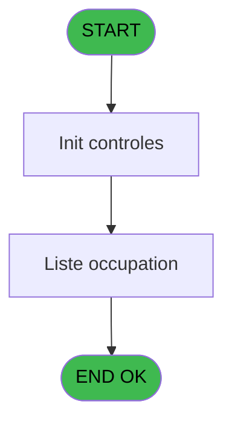
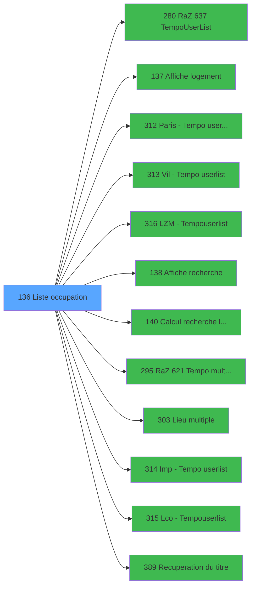

# PBP IDE 136 - Liste occupation

> **Analyse**: Phases 1-4 2026-02-03 15:27 -> 15:27 (20s) | Assemblage 15:27
> **Pipeline**: V7.2 Enrichi
> **Structure**: 4 onglets (Resume | Ecrans | Donnees | Connexions)

<!-- TAB:Resume -->

## 1. FICHE D'IDENTITE

| Attribut | Valeur |
|----------|--------|
| Projet | PBP |
| IDE Position | 136 |
| Nom Programme | Liste occupation |
| Fichier source | `Prg_136.xml` |
| Dossier IDE | Gestion |
| Taches | 3 (1 ecrans visibles) |
| Tables modifiees | 0 |
| Programmes appeles | 12 |
| :warning: Statut | **ORPHELIN_POTENTIEL** |

## 2. DESCRIPTION FONCTIONNELLE

**Liste occupation** assure la gestion complete de ce processus.

Le flux de traitement s'organise en **2 blocs fonctionnels** :

- **Consultation** (2 taches) : ecrans de recherche, selection et consultation
- **Traitement** (1 tache) : traitements metier divers

Detail : phases du traitement

#### Phase 1 : Traitement (1 tache)

- **136** - Liste occupation **[[ECRAN]](#ecran-t1)**

Delegue a : [Paris -> Tempo userlist (IDE 312)](PBP-IDE-312.md), [Vil -> Tempo userlist (IDE 313)](PBP-IDE-313.md), [LZM -> Tempouserlist (IDE 316)](PBP-IDE-316.md), [Lieu multiple (IDE 303)](PBP-IDE-303.md), [Imp -> Tempo userlist (IDE 314)](PBP-IDE-314.md), [Lco  -> Tempouserlist (IDE 315)](PBP-IDE-315.md), [Recuperation du titre (IDE 389)](PBP-IDE-389.md)

#### Phase 2 : Consultation (2 taches)

- **136.1** - Recherche logement **[[ECRAN]](#ecran-t2)**
- **136.1.1** - Exist select

Delegue a : [  Affiche logement (IDE 137)](PBP-IDE-137.md), [  Affiche recherche (IDE 138)](PBP-IDE-138.md), [Recuperation du titre (IDE 389)](PBP-IDE-389.md)

## 3. BLOCS FONCTIONNELS

### 3.1 Traitement (1 tache)

Traitements internes.

---

#### 136 - Liste occupation [[ECRAN]](#ecran-t1)

**Role** : Traitement : Liste occupation.
**Ecran** : 734 x 277 DLU (MDI) | [Voir mockup](#ecran-t1)
**Delegue a** : [Paris -> Tempo userlist (IDE 312)](PBP-IDE-312.md), [Vil -> Tempo userlist (IDE 313)](PBP-IDE-313.md), [LZM -> Tempouserlist (IDE 316)](PBP-IDE-316.md)

### 3.2 Consultation (2 taches)

Ecrans de recherche et consultation.

---

#### 136.1 - Recherche logement [[ECRAN]](#ecran-t2)

**Role** : Traitement : Recherche logement.
**Ecran** : 736 x 278 DLU (MDI) | [Voir mockup](#ecran-t2)
**Variables liees** : U (b_LogementRaZ), BI (b_Logement), BW (RetourLogement), CL (b_Recherche)
**Delegue a** : [  Affiche logement (IDE 137)](PBP-IDE-137.md), [  Affiche recherche (IDE 138)](PBP-IDE-138.md), [  Calcul recherche logement (IDE 140)](PBP-IDE-140.md)

---

#### 136.1.1 - Exist select

**Role** : Traitement : Exist select.
**Variables liees** : K (w0_NbSelect), CH (w0_ExistSelect)
**Delegue a** : [  Affiche logement (IDE 137)](PBP-IDE-137.md), [  Affiche recherche (IDE 138)](PBP-IDE-138.md)

## 5. REGLES METIER

*(Aucune regle metier identifiee)*

## 6. CONTEXTE

- **Appele par**: (aucun)
- **Appelle**: 12 programmes | **Tables**: 1 (W:0 R:1 L:0) | **Taches**: 3 | **Expressions**: 1

<!-- TAB:Ecrans -->

## 8. ECRANS

### 8.1 Forms visibles (1 / 3)

| # | Position | Tache | Nom | Type | Largeur | Hauteur | Bloc |
|---|----------|-------|-----|------|---------|---------|------|
| 1 | 136.1 | 136.1 | Recherche logement | MDI | 736 | 278 | Consultation |

### 8.2 Mockups Ecrans

---

#### 136.1 - Recherche logement
**Tache** : [136.1](#t2) | **Type** : MDI | **Dimensions** : 736 x 278 DLU
**Bloc** : Consultation | **Titre IDE** : Recherche logement

<!-- FORM-DATA:
{
    "width":  736,
    "vFactor":  8,
    "type":  "MDI",
    "hFactor":  8,
    "controls":  [
                     {
                         "x":  0,
                         "type":  "label",
                         "var":  "",
                         "y":  1,
                         "w":  732,
                         "fmt":  "",
                         "name":  "",
                         "h":  19,
                         "color":  "1",
                         "text":  "",
                         "parent":  null
                     },
                     {
                         "x":  14,
                         "type":  "label",
                         "var":  "",
                         "y":  22,
                         "w":  303,
                         "fmt":  "",
                         "name":  "",
                         "h":  227,
                         "color":  "",
                         "text":  "",
                         "parent":  null
                     },
                     {
                         "x":  323,
                         "type":  "label",
                         "var":  "",
                         "y":  22,
                         "w":  405,
                         "fmt":  "",
                         "name":  "",
                         "h":  154,
                         "color":  "",
                         "text":  "",
                         "parent":  null
                     },
                     {
                         "x":  333,
                         "type":  "label",
                         "var":  "",
                         "y":  25,
                         "w":  183,
                         "fmt":  "",
                         "name":  "",
                         "h":  18,
                         "color":  "153",
                         "text":  "",
                         "parent":  6
                     },
                     {
                         "x":  525,
                         "type":  "label",
                         "var":  "",
                         "y":  25,
                         "w":  183,
                         "fmt":  "",
                         "name":  "",
                         "h":  18,
                         "color":  "153",
                         "text":  "",
                         "parent":  6
                     },
                     {
                         "x":  22,
                         "type":  "label",
                         "var":  "",
                         "y":  26,
                         "w":  46,
                         "fmt":  "",
                         "name":  "",
                         "h":  9,
                         "color":  "142",
                         "text":  "Total",
                         "parent":  5
                     },
                     {
                         "x":  139,
                         "type":  "label",
                         "var":  "",
                         "y":  26,
                         "w":  111,
                         "fmt":  "",
                         "name":  "",
                         "h":  9,
                         "color":  "142",
                         "text":  "Selectionnes",
                         "parent":  5
                     },
                     {
                         "x":  17,
                         "type":  "line",
                         "var":  "",
                         "y":  38,
                         "w":  297,
                         "fmt":  "",
                         "name":  "",
                         "h":  0,
                         "color":  "",
                         "text":  "",
                         "parent":  5
                     },
                     {
                         "x":  30,
                         "type":  "label",
                         "var":  "",
                         "y":  42,
                         "w":  104,
                         "fmt":  "",
                         "name":  "",
                         "h":  8,
                         "color":  "",
                         "text":  "Occupations",
                         "parent":  5
                     },
                     {
                         "x":  333,
                         "type":  "label",
                         "var":  "",
                         "y":  46,
                         "w":  183,
                         "fmt":  "",
                         "name":  "",
                         "h":  18,
                         "color":  "153",
                         "text":  "",
                         "parent":  6
                     },
                     {
                         "x":  525,
                         "type":  "label",
                         "var":  "",
                         "y":  46,
                         "w":  183,
                         "fmt":  "",
                         "name":  "",
                         "h":  18,
                         "color":  "153",
                         "text":  "",
                         "parent":  6
                     },
                     {
                         "x":  17,
                         "type":  "line",
                         "var":  "",
                         "y":  52,
                         "w":  297,
                         "fmt":  "",
                         "name":  "",
                         "h":  0,
                         "color":  "",
                         "text":  "",
                         "parent":  5
                     },
                     {
                         "x":  30,
                         "type":  "label",
                         "var":  "",
                         "y":  57,
                         "w":  74,
                         "fmt":  "",
                         "name":  "",
                         "h":  8,
                         "color":  "",
                         "text":  "Bâtiment",
                         "parent":  5
                     },
                     {
                         "x":  17,
                         "type":  "line",
                         "var":  "",
                         "y":  67,
                         "w":  297,
                         "fmt":  "",
                         "name":  "",
                         "h":  0,
                         "color":  "",
                         "text":  "",
                         "parent":  5
                     },
                     {
                         "x":  333,
                         "type":  "label",
                         "var":  "",
                         "y":  68,
                         "w":  183,
                         "fmt":  "",
                         "name":  "",
                         "h":  18,
                         "color":  "153",
                         "text":  "",
                         "parent":  6
                     },
                     {
                         "x":  525,
                         "type":  "label",
                         "var":  "",
                         "y":  68,
                         "w":  183,
                         "fmt":  "",
                         "name":  "",
                         "h":  18,
                         "color":  "153",
                         "text":  "",
                         "parent":  6
                     },
                     {
                         "x":  30,
                         "type":  "label",
                         "var":  "",
                         "y":  72,
                         "w":  82,
                         "fmt":  "",
                         "name":  "",
                         "h":  8,
                         "color":  "",
                         "text":  "Ensemble",
                         "parent":  5
                     },
                     {
                         "x":  17,
                         "type":  "line",
                         "var":  "",
                         "y":  82,
                         "w":  297,
                         "fmt":  "",
                         "name":  "",
                         "h":  0,
                         "color":  "",
                         "text":  "",
                         "parent":  5
                     },
                     {
                         "x":  30,
                         "type":  "label",
                         "var":  "",
                         "y":  87,
                         "w":  155,
                         "fmt":  "",
                         "name":  "",
                         "h":  8,
                         "color":  "",
                         "text":  "Logements",
                         "parent":  5
                     },
                     {
                         "x":  333,
                         "type":  "label",
                         "var":  "",
                         "y":  89,
                         "w":  183,
                         "fmt":  "",
                         "name":  "",
                         "h":  18,
                         "color":  "153",
                         "text":  "",
                         "parent":  6
                     },
                     {
                         "x":  525,
                         "type":  "label",
                         "var":  "",
                         "y":  89,
                         "w":  183,
                         "fmt":  "",
                         "name":  "",
                         "h":  18,
                         "color":  "153",
                         "text":  "",
                         "parent":  6
                     },
                     {
                         "x":  17,
                         "type":  "line",
                         "var":  "",
                         "y":  97,
                         "w":  297,
                         "fmt":  "",
                         "name":  "",
                         "h":  0,
                         "color":  "",
                         "text":  "",
                         "parent":  5
                     },
                     {
                         "x":  30,
                         "type":  "label",
                         "var":  "",
                         "y":  102,
                         "w":  61,
                         "fmt":  "",
                         "name":  "",
                         "h":  8,
                         "color":  "",
                         "text":  "Etages",
                         "parent":  5
                     },
                     {
                         "x":  333,
                         "type":  "label",
                         "var":  "",
                         "y":  111,
                         "w":  183,
                         "fmt":  "",
                         "name":  "",
                         "h":  18,
                         "color":  "153",
                         "text":  "",
                         "parent":  6
                     },
                     {
                         "x":  525,
                         "type":  "label",
                         "var":  "",
                         "y":  111,
                         "w":  183,
                         "fmt":  "",
                         "name":  "",
                         "h":  18,
                         "color":  "153",
                         "text":  "",
                         "parent":  6
                     },
                     {
                         "x":  17,
                         "type":  "line",
                         "var":  "",
                         "y":  112,
                         "w":  297,
                         "fmt":  "",
                         "name":  "",
                         "h":  0,
                         "color":  "",
                         "text":  "",
                         "parent":  5
                     },
                     {
                         "x":  30,
                         "type":  "label",
                         "var":  "",
                         "y":  117,
                         "w":  46,
                         "fmt":  "",
                         "name":  "",
                         "h":  8,
                         "color":  "",
                         "text":  "Vues",
                         "parent":  5
                     },
                     {
                         "x":  17,
                         "type":  "line",
                         "var":  "",
                         "y":  128,
                         "w":  297,
                         "fmt":  "",
                         "name":  "",
                         "h":  0,
                         "color":  "",
                         "text":  "",
                         "parent":  5
                     },
                     {
                         "x":  30,
                         "type":  "label",
                         "var":  "",
                         "y":  132,
                         "w":  120,
                         "fmt":  "",
                         "name":  "",
                         "h":  8,
                         "color":  "",
                         "text":  "Communicante",
                         "parent":  5
                     },
                     {
                         "x":  333,
                         "type":  "label",
                         "var":  "",
                         "y":  132,
                         "w":  183,
                         "fmt":  "",
                         "name":  "",
                         "h":  18,
                         "color":  "153",
                         "text":  "",
                         "parent":  6
                     },
                     {
                         "x":  525,
                         "type":  "label",
                         "var":  "",
                         "y":  132,
                         "w":  183,
                         "fmt":  "",
                         "name":  "",
                         "h":  18,
                         "color":  "153",
                         "text":  "",
                         "parent":  6
                     },
                     {
                         "x":  17,
                         "type":  "line",
                         "var":  "",
                         "y":  143,
                         "w":  297,
                         "fmt":  "",
                         "name":  "",
                         "h":  0,
                         "color":  "",
                         "text":  "",
                         "parent":  5
                     },
                     {
                         "x":  30,
                         "type":  "label",
                         "var":  "",
                         "y":  147,
                         "w":  123,
                         "fmt":  "",
                         "name":  "",
                         "h":  8,
                         "color":  "",
                         "text":  "Attribution",
                         "parent":  5
                     },
                     {
                         "x":  333,
                         "type":  "label",
                         "var":  "",
                         "y":  154,
                         "w":  183,
                         "fmt":  "",
                         "name":  "",
                         "h":  18,
                         "color":  "153",
                         "text":  "",
                         "parent":  6
                     },
                     {
                         "x":  525,
                         "type":  "label",
                         "var":  "",
                         "y":  154,
                         "w":  183,
                         "fmt":  "",
                         "name":  "",
                         "h":  18,
                         "color":  "153",
                         "text":  "",
                         "parent":  6
                     },
                     {
                         "x":  17,
                         "type":  "line",
                         "var":  "",
                         "y":  158,
                         "w":  297,
                         "fmt":  "",
                         "name":  "",
                         "h":  0,
                         "color":  "",
                         "text":  "",
                         "parent":  5
                     },
                     {
                         "x":  30,
                         "type":  "label",
                         "var":  "",
                         "y":  162,
                         "w":  82,
                         "fmt":  "",
                         "name":  "",
                         "h":  8,
                         "color":  "",
                         "text":  "Handicap",
                         "parent":  5
                     },
                     {
                         "x":  17,
                         "type":  "line",
                         "var":  "",
                         "y":  173,
                         "w":  297,
                         "fmt":  "",
                         "name":  "",
                         "h":  0,
                         "color":  "",
                         "text":  "",
                         "parent":  5
                     },
                     {
                         "x":  30,
                         "type":  "label",
                         "var":  "",
                         "y":  177,
                         "w":  75,
                         "fmt":  "",
                         "name":  "",
                         "h":  8,
                         "color":  "",
                         "text":  "Standing",
                         "parent":  5
                     },
                     {
                         "x":  323,
                         "type":  "label",
                         "var":  "",
                         "y":  179,
                         "w":  405,
                         "fmt":  "",
                         "name":  "",
                         "h":  70,
                         "color":  "",
                         "text":  "",
                         "parent":  null
                     },
                     {
                         "x":  17,
                         "type":  "line",
                         "var":  "",
                         "y":  188,
                         "w":  297,
                         "fmt":  "",
                         "name":  "",
                         "h":  0,
                         "color":  "",
                         "text":  "",
                         "parent":  5
                     },
                     {
                         "x":  30,
                         "type":  "label",
                         "var":  "",
                         "y":  192,
                         "w":  40,
                         "fmt":  "",
                         "name":  "",
                         "h":  8,
                         "color":  "",
                         "text":  "Lieu",
                         "parent":  5
                     },
                     {
                         "x":  332,
                         "type":  "label",
                         "var":  "",
                         "y":  200,
                         "w":  135,
                         "fmt":  "",
                         "name":  "",
                         "h":  8,
                         "color":  "",
                         "text":  "Date début",
                         "parent":  45
                     },
                     {
                         "x":  697,
                         "type":  "label",
                         "var":  "",
                         "y":  201,
                         "w":  21,
                         "fmt":  "",
                         "name":  "",
                         "h":  9,
                         "color":  "",
                         "text":  "H",
                         "parent":  45
                     },
                     {
                         "x":  17,
                         "type":  "line",
                         "var":  "",
                         "y":  203,
                         "w":  297,
                         "fmt":  "",
                         "name":  "",
                         "h":  0,
                         "color":  "",
                         "text":  "",
                         "parent":  5
                     },
                     {
                         "x":  30,
                         "type":  "label",
                         "var":  "",
                         "y":  207,
                         "w":  128,
                         "fmt":  "",
                         "name":  "",
                         "h":  8,
                         "color":  "",
                         "text":  "Code Logement",
                         "parent":  5
                     },
                     {
                         "x":  17,
                         "type":  "line",
                         "var":  "",
                         "y":  218,
                         "w":  297,
                         "fmt":  "",
                         "name":  "",
                         "h":  0,
                         "color":  "",
                         "text":  "",
                         "parent":  5
                     },
                     {
                         "x":  332,
                         "type":  "label",
                         "var":  "",
                         "y":  218,
                         "w":  99,
                         "fmt":  "",
                         "name":  "",
                         "h":  8,
                         "color":  "",
                         "text":  "Date fin",
                         "parent":  45
                     },
                     {
                         "x":  697,
                         "type":  "label",
                         "var":  "",
                         "y":  218,
                         "w":  21,
                         "fmt":  "",
                         "name":  "",
                         "h":  9,
                         "color":  "",
                         "text":  "H",
                         "parent":  45
                     },
                     {
                         "x":  30,
                         "type":  "label",
                         "var":  "",
                         "y":  223,
                         "w":  48,
                         "fmt":  "",
                         "name":  "",
                         "h":  8,
                         "color":  "",
                         "text":  "Zone",
                         "parent":  5
                     },
                     {
                         "x":  17,
                         "type":  "line",
                         "var":  "",
                         "y":  233,
                         "w":  297,
                         "fmt":  "",
                         "name":  "",
                         "h":  0,
                         "color":  "",
                         "text":  "",
                         "parent":  5
                     },
                     {
                         "x":  30,
                         "type":  "label",
                         "var":  "",
                         "y":  237,
                         "w":  67,
                         "fmt":  "",
                         "name":  "",
                         "h":  8,
                         "color":  "",
                         "text":  "Secteur",
                         "parent":  5
                     },
                     {
                         "x":  0,
                         "type":  "label",
                         "var":  "",
                         "y":  252,
                         "w":  732,
                         "fmt":  "",
                         "name":  "",
                         "h":  25,
                         "color":  "1",
                         "text":  "",
                         "parent":  null
                     },
                     {
                         "x":  70,
                         "type":  "edit",
                         "var":  "",
                         "y":  26,
                         "w":  56,
                         "fmt":  "",
                         "name":  "",
                         "h":  9,
                         "color":  "",
                         "text":  "",
                         "parent":  5
                     },
                     {
                         "x":  245,
                         "type":  "edit",
                         "var":  "",
                         "y":  26,
                         "w":  56,
                         "fmt":  "",
                         "name":  "",
                         "h":  9,
                         "color":  "",
                         "text":  "",
                         "parent":  5
                     },
                     {
                         "x":  473,
                         "type":  "edit",
                         "var":  "",
                         "y":  200,
                         "w":  126,
                         "fmt":  "DD/MM/YYYY",
                         "name":  "w0_DateMin",
                         "h":  10,
                         "color":  "110",
                         "text":  "",
                         "parent":  45
                     },
                     {
                         "x":  603,
                         "type":  "button",
                         "var":  "",
                         "y":  200,
                         "w":  38,
                         "fmt":  "",
                         "name":  "b_ZoomDateMin",
                         "h":  10,
                         "color":  "",
                         "text":  "",
                         "parent":  45
                     },
                     {
                         "x":  651,
                         "type":  "edit",
                         "var":  "",
                         "y":  200,
                         "w":  37,
                         "fmt":  "",
                         "name":  "w0_HeureMin",
                         "h":  10,
                         "color":  "110",
                         "text":  "",
                         "parent":  45
                     },
                     {
                         "x":  473,
                         "type":  "edit",
                         "var":  "",
                         "y":  218,
                         "w":  126,
                         "fmt":  "DD/MM/YYYY",
                         "name":  "w0_DateMax",
                         "h":  10,
                         "color":  "110",
                         "text":  "",
                         "parent":  45
                     },
                     {
                         "x":  603,
                         "type":  "button",
                         "var":  "",
                         "y":  218,
                         "w":  38,
                         "fmt":  "",
                         "name":  "b_ZoomDateMax",
                         "h":  10,
                         "color":  "",
                         "text":  "",
                         "parent":  45
                     },
                     {
                         "x":  651,
                         "type":  "edit",
                         "var":  "",
                         "y":  218,
                         "w":  37,
                         "fmt":  "",
                         "name":  "w0_HeureMax",
                         "h":  10,
                         "color":  "110",
                         "text":  "",
                         "parent":  45
                     },
                     {
                         "x":  244,
                         "type":  "button",
                         "var":  "",
                         "y":  41,
                         "w":  59,
                         "fmt":  "",
                         "name":  "b_OccupationRaZ",
                         "h":  10,
                         "color":  "",
                         "text":  "",
                         "parent":  5
                     },
                     {
                         "x":  244,
                         "type":  "button",
                         "var":  "",
                         "y":  71,
                         "w":  59,
                         "fmt":  "",
                         "name":  "b_EnsembleRaZ",
                         "h":  10,
                         "color":  "",
                         "text":  "",
                         "parent":  5
                     },
                     {
                         "x":  244,
                         "type":  "button",
                         "var":  "",
                         "y":  56,
                         "w":  59,
                         "fmt":  "",
                         "name":  "b_BatimentRaZ",
                         "h":  10,
                         "color":  "",
                         "text":  "",
                         "parent":  5
                     },
                     {
                         "x":  244,
                         "type":  "button",
                         "var":  "",
                         "y":  86,
                         "w":  59,
                         "fmt":  "",
                         "name":  "b_LogementRaZ",
                         "h":  10,
                         "color":  "",
                         "text":  "",
                         "parent":  5
                     },
                     {
                         "x":  244,
                         "type":  "button",
                         "var":  "",
                         "y":  101,
                         "w":  59,
                         "fmt":  "",
                         "name":  "b_EtageRaZ",
                         "h":  10,
                         "color":  "",
                         "text":  "",
                         "parent":  5
                     },
                     {
                         "x":  244,
                         "type":  "button",
                         "var":  "",
                         "y":  116,
                         "w":  59,
                         "fmt":  "",
                         "name":  "b_VuesRaZ",
                         "h":  10,
                         "color":  "",
                         "text":  "",
                         "parent":  5
                     },
                     {
                         "x":  244,
                         "type":  "button",
                         "var":  "",
                         "y":  131,
                         "w":  59,
                         "fmt":  "",
                         "name":  "b_CommunicanteRaZ",
                         "h":  10,
                         "color":  "",
                         "text":  "",
                         "parent":  5
                     },
                     {
                         "x":  244,
                         "type":  "button",
                         "var":  "",
                         "y":  146,
                         "w":  59,
                         "fmt":  "",
                         "name":  "b_AttributionRaZ",
                         "h":  10,
                         "color":  "",
                         "text":  "",
                         "parent":  5
                     },
                     {
                         "x":  244,
                         "type":  "button",
                         "var":  "",
                         "y":  161,
                         "w":  59,
                         "fmt":  "",
                         "name":  "b_HandicapeRaZ",
                         "h":  10,
                         "color":  "",
                         "text":  "",
                         "parent":  5
                     },
                     {
                         "x":  244,
                         "type":  "button",
                         "var":  "",
                         "y":  176,
                         "w":  59,
                         "fmt":  "",
                         "name":  "b_StandingRaZ",
                         "h":  10,
                         "color":  "",
                         "text":  "",
                         "parent":  5
                     },
                     {
                         "x":  244,
                         "type":  "button",
                         "var":  "",
                         "y":  191,
                         "w":  59,
                         "fmt":  "",
                         "name":  "b_LieuRaZ",
                         "h":  10,
                         "color":  "",
                         "text":  "",
                         "parent":  5
                     },
                     {
                         "x":  244,
                         "type":  "button",
                         "var":  "",
                         "y":  207,
                         "w":  59,
                         "fmt":  "",
                         "name":  "b_CodLogRaZ",
                         "h":  10,
                         "color":  "",
                         "text":  "",
                         "parent":  5
                     },
                     {
                         "x":  244,
                         "type":  "button",
                         "var":  "",
                         "y":  221,
                         "w":  59,
                         "fmt":  "",
                         "name":  "b_ZoneRaZ",
                         "h":  10,
                         "color":  "",
                         "text":  "",
                         "parent":  5
                     },
                     {
                         "x":  244,
                         "type":  "button",
                         "var":  "",
                         "y":  236,
                         "w":  59,
                         "fmt":  "",
                         "name":  "b_SecteurRaZ",
                         "h":  10,
                         "color":  "",
                         "text":  "",
                         "parent":  5
                     },
                     {
                         "x":  337,
                         "type":  "button",
                         "var":  "",
                         "y":  27,
                         "w":  174,
                         "fmt":  "\u0026Occupation",
                         "name":  "b_Occupation",
                         "h":  14,
                         "color":  "",
                         "text":  "",
                         "parent":  6
                     },
                     {
                         "x":  337,
                         "type":  "button",
                         "var":  "",
                         "y":  48,
                         "w":  174,
                         "fmt":  "\u0026Ensembles",
                         "name":  "b_Ensemble",
                         "h":  14,
                         "color":  "",
                         "text":  "",
                         "parent":  6
                     },
                     {
                         "x":  531,
                         "type":  "button",
                         "var":  "",
                         "y":  27,
                         "w":  174,
                         "fmt":  "\u0026Bâtiment",
                         "name":  "b_Batiment",
                         "h":  14,
                         "color":  "",
                         "text":  "",
                         "parent":  6
                     },
                     {
                         "x":  529,
                         "type":  "button",
                         "var":  "",
                         "y":  48,
                         "w":  174,
                         "fmt":  "\u0026\\Logement",
                         "name":  "b_Logement",
                         "h":  14,
                         "color":  "",
                         "text":  "",
                         "parent":  6
                     },
                     {
                         "x":  337,
                         "type":  "button",
                         "var":  "",
                         "y":  70,
                         "w":  174,
                         "fmt":  "E\u0026tage",
                         "name":  "b_Etage",
                         "h":  14,
                         "color":  "",
                         "text":  "",
                         "parent":  6
                     },
                     {
                         "x":  529,
                         "type":  "button",
                         "var":  "",
                         "y":  70,
                         "w":  174,
                         "fmt":  "\u0026Vue",
                         "name":  "b_Vue",
                         "h":  14,
                         "color":  "",
                         "text":  "",
                         "parent":  6
                     },
                     {
                         "x":  337,
                         "type":  "button",
                         "var":  "",
                         "y":  91,
                         "w":  174,
                         "fmt":  "\u0026Communicante",
                         "name":  "b_Communicante",
                         "h":  14,
                         "color":  "",
                         "text":  "",
                         "parent":  6
                     },
                     {
                         "x":  529,
                         "type":  "button",
                         "var":  "",
                         "y":  91,
                         "w":  174,
                         "fmt":  "\u0026\\Attribution",
                         "name":  "b_Attribution",
                         "h":  14,
                         "color":  "",
                         "text":  "",
                         "parent":  6
                     },
                     {
                         "x":  337,
                         "type":  "button",
                         "var":  "",
                         "y":  113,
                         "w":  174,
                         "fmt":  "\u0026\\Handicap",
                         "name":  "b_Handicap",
                         "h":  14,
                         "color":  "",
                         "text":  "",
                         "parent":  6
                     },
                     {
                         "x":  529,
                         "type":  "button",
                         "var":  "",
                         "y":  113,
                         "w":  174,
                         "fmt":  "\u0026Standing",
                         "name":  "b_Standing",
                         "h":  14,
                         "color":  "",
                         "text":  "",
                         "parent":  6
                     },
                     {
                         "x":  337,
                         "type":  "button",
                         "var":  "",
                         "y":  134,
                         "w":  174,
                         "fmt":  "L\u0026ieu",
                         "name":  "b_Lieu",
                         "h":  14,
                         "color":  "",
                         "text":  "",
                         "parent":  6
                     },
                     {
                         "x":  529,
                         "type":  "button",
                         "var":  "",
                         "y":  134,
                         "w":  174,
                         "fmt":  "Co\u0026de \\Log",
                         "name":  "b_CodLog",
                         "h":  14,
                         "color":  "",
                         "text":  "",
                         "parent":  6
                     },
                     {
                         "x":  337,
                         "type":  "button",
                         "var":  "",
                         "y":  156,
                         "w":  174,
                         "fmt":  "\u0026Zone",
                         "name":  "b_Zone",
                         "h":  14,
                         "color":  "",
                         "text":  "",
                         "parent":  6
                     },
                     {
                         "x":  529,
                         "type":  "button",
                         "var":  "",
                         "y":  156,
                         "w":  174,
                         "fmt":  "Secte\u0026ur",
                         "name":  "b_Secteur",
                         "h":  14,
                         "color":  "",
                         "text":  "",
                         "parent":  6
                     },
                     {
                         "x":  411,
                         "type":  "button",
                         "var":  "",
                         "y":  256,
                         "w":  149,
                         "fmt":  "Remise à \u0026Zéro",
                         "name":  "b_RaZGlobal",
                         "h":  18,
                         "color":  "",
                         "text":  "",
                         "parent":  null
                     },
                     {
                         "x":  12,
                         "type":  "button",
                         "var":  "",
                         "y":  256,
                         "w":  149,
                         "fmt":  "\u0026Quitter",
                         "name":  "b_Quitter",
                         "h":  18,
                         "color":  "",
                         "text":  "",
                         "parent":  62
                     },
                     {
                         "x":  571,
                         "type":  "button",
                         "var":  "",
                         "y":  256,
                         "w":  149,
                         "fmt":  "\u0026Recherche",
                         "name":  "b_Recherche",
                         "h":  18,
                         "color":  "",
                         "text":  "",
                         "parent":  62
                     },
                     {
                         "x":  4,
                         "type":  "edit",
                         "var":  "",
                         "y":  2,
                         "w":  267,
                         "fmt":  "20",
                         "name":  "",
                         "h":  8,
                         "color":  "",
                         "text":  "",
                         "parent":  1
                     },
                     {
                         "x":  475,
                         "type":  "edit",
                         "var":  "",
                         "y":  6,
                         "w":  248,
                         "fmt":  "WWW DD MMM YYYYT",
                         "name":  "",
                         "h":  8,
                         "color":  "",
                         "text":  "",
                         "parent":  1
                     },
                     {
                         "x":  3,
                         "type":  "edit",
                         "var":  "",
                         "y":  11,
                         "w":  331,
                         "fmt":  "25",
                         "name":  "",
                         "h":  8,
                         "color":  "",
                         "text":  "",
                         "parent":  null
                     }
                 ],
    "taskId":  "136.1",
    "height":  278
}
-->

<strong>Champs : 9 champs</strong>

| Pos (x,y) | Nom | Variable | Type |
|-----------|-----|----------|------|
| 70,26 | (sans nom) | - | edit |
| 245,26 | (sans nom) | - | edit |
| 473,200 | w0_DateMin | - | edit |
| 651,200 | w0_HeureMin | - | edit |
| 473,218 | w0_DateMax | - | edit |
| 651,218 | w0_HeureMax | - | edit |
| 4,2 | 20 | - | edit |
| 475,6 | WWW DD MMM YYYYT | - | edit |
| 3,11 | 25 | - | edit |

<strong>Boutons : 33 boutons</strong>

| Bouton | Pos (x,y) | Action |
|--------|-----------|--------|
| b_ZoomDateMin | 603,200 | Ouvre la selection |
| b_ZoomDateMax | 603,218 | Ouvre la selection |
| b_OccupationRaZ | 244,41 | Bouton fonctionnel |
| b_EnsembleRaZ | 244,71 | Bouton fonctionnel |
| b_BatimentRaZ | 244,56 | Bouton fonctionnel |
| b_LogementRaZ | 244,86 | Bouton fonctionnel |
| b_EtageRaZ | 244,101 | Bouton fonctionnel |
| b_VuesRaZ | 244,116 | Bouton fonctionnel |
| b_CommunicanteRaZ | 244,131 | Bouton fonctionnel |
| b_AttributionRaZ | 244,146 | Bouton fonctionnel |
| b_HandicapeRaZ | 244,161 | Bouton fonctionnel |
| b_StandingRaZ | 244,176 | Bouton fonctionnel |
| b_LieuRaZ | 244,191 | Bouton fonctionnel |
| b_CodLogRaZ | 244,207 | Bouton fonctionnel |
| b_ZoneRaZ | 244,221 | Bouton fonctionnel |
| b_SecteurRaZ | 244,236 | Bouton fonctionnel |
| Occupation | 337,27 | Bouton fonctionnel |
| Ensembles | 337,48 | Bouton fonctionnel |
| Bâtiment | 531,27 | Bouton fonctionnel |
| \Logement | 529,48 | Bouton fonctionnel |
| Etage | 337,70 | Bouton fonctionnel |
| Vue | 529,70 | Bouton fonctionnel |
| Communicante | 337,91 | Bouton fonctionnel |
| \Attribution | 529,91 | Bouton fonctionnel |
| \Handicap | 337,113 | Bouton fonctionnel |
| Standing | 529,113 | Bouton fonctionnel |
| Lieu | 337,134 | Appel [Lieu multiple (IDE 303)](PBP-IDE-303.md) |
| Code \Log | 529,134 | Bouton fonctionnel |
| Zone | 337,156 | Bouton fonctionnel |
| Secteur | 529,156 | Bouton fonctionnel |
| Remise à Zéro | 411,256 | Lance le calcul |
| Quitter | 12,256 | Quitte le programme |
| Recherche | 571,256 | Appel [  Affiche recherche (IDE 138)](PBP-IDE-138.md) |

## 9. NAVIGATION

Ecran unique: **Recherche logement**

### 9.3 Structure hierarchique (3 taches)

| Position | Tache | Type | Dimensions | Bloc |
|----------|-------|------|------------|------|
| **136.1** | [**Liste occupation** (136)](#t1) [mockup](#ecran-t1) | MDI | 734x277 | Traitement |
| **136.2** | [**Recherche logement** (136.1)](#t2) [mockup](#ecran-t2) | MDI | 736x278 | Consultation |
| 136.2.1 | [Exist select (136.1.1)](#t3) | MDI | - | |

### 9.4 Algorigramme

> **Legende**: Vert = START/END OK | Rouge = END KO | Bleu = Decisions
> *Algorigramme auto-genere. Utiliser `/algorigramme` pour une synthese metier detaillee.*

<!-- TAB:Donnees -->

## 10. TABLES

### Tables utilisees (1)

| ID | Nom | Description | Type | R | W | L | Usages |
|----|-----|-------------|------|---|---|---|--------|
| 637 | tempo_zone_secteur | Table temporaire ecran | DB | R |   |   | 1 |

### Colonnes par table (1 / 1 tables avec colonnes identifiees)

Table 637 - tempo_zone_secteur (R) - 1 usages

| Lettre | Variable | Acces | Type |
|--------|----------|-------|------|
| A | >Categorie | R | Alpha |
| B | >NomTable | R | Alpha |
| C | <CodeRetour | R | Logical |
| D | w1_TousVrai | R | Logical |

## 11. VARIABLES

### 11.1 Variables de session (1)

Variables persistantes pendant toute la session.

| Lettre | Nom | Type | Usage dans |
|--------|-----|------|-----------|
| A | v.fin | Logical | 1x session |

### 11.2 Autres (63)

Variables diverses.

| Lettre | Nom | Type | Usage dans |
|--------|-----|------|-----------|
| B | w0_NomTable | Alpha | - |
| C | w0_Numerique | Numeric | - |
| D | w0_CodeMenage | Alpha | - |
| E | w0_CodeTri | Alpha | - |
| F | w0_NbLogMini | Numeric | - |
| G | w0_TitreEcran | Alpha | - |
| H | w0_CodeEcranFille | Numeric | - |
| I | w0_LieuMulti | Logical | - |
| J | w0_Total | Numeric | - |
| K | w0_NbSelect | Numeric | - |
| L | w0_DateMin | Date | - |
| M | b_ZoomDateMin | Alpha | - |
| N | w0_HeureMin | Alpha | - |
| O | w0_DateMax | Date | - |
| P | b_ZoomDateMax | Alpha | - |
| Q | w0_HeureMax | Alpha | - |
| R | b_OcccupationRaZ | Alpha | - |
| S | b_EnsembleRaZ | Alpha | - |
| T | b_BatimentRaZ | Alpha | - |
| U | b_LogementRaZ | Alpha | - |
| V | b_EtageRaZ | Alpha | - |
| W | b_VuesRaZ | Alpha | - |
| X | b_CommunicanteRaZ | Alpha | - |
| Y | b_AttributionRaZ | Alpha | - |
| Z | b_HandicapeRaZ | Alpha | - |
| BA | b_StandingRaZ | Alpha | - |
| BB | b_LieuRaZ | Alpha | - |
| BC | b_CodLogRaZ | Alpha | - |
| BD | b_ZoneRaZ | Alpha | - |
| BE | b_SecteurRaZ | Alpha | - |
| BF | b_Occcupation | Alpha | - |
| BG | b_Ensemble | Alpha | - |
| BH | b_Batiment | Alpha | - |
| BI | b_Logement | Alpha | - |
| BJ | b_Etage | Alpha | - |
| BK | b_Vue | Alpha | - |
| BL | b_Communicante | Alpha | - |
| BM | b_Attribution | Alpha | - |
| BN | b_Handicap | Alpha | - |
| BO | b_Standing | Alpha | - |
| BP | b_Lieu | Alpha | - |
| BQ | b_CodLog | Alpha | - |
| BR | b_Zone | Alpha | - |
| BS | b_Secteur | Alpha | - |
| BT | RetourOccup | Logical | - |
| BU | RetourEnsemble | Logical | - |
| BV | RetourBatiment | Logical | - |
| BW | RetourLogement | Logical | - |
| BX | RetourEtage | Logical | - |
| BY | RetourVue | Logical | - |
| BZ | RetourComm | Logical | - |
| CA | RetourAttrib | Logical | - |
| CB | RetourHandi | Logical | - |
| CC | RetourStand | Logical | - |
| CD | RetourLieu | Logical | - |
| CE | RetourCodLog | Logical | - |
| CF | RetourZone | Logical | - |
| CG | RetourSect | Logical | - |
| CH | w0_ExistSelect | Logical | - |
| CI | b_RaZGlobal | Alpha | - |
| CJ | b_Quitter | Alpha | - |
| CK | b_raz | Alpha | - |
| CL | b_Recherche | Alpha | - |

Toutes les 64 variables (liste complete)

| Cat | Lettre | Nom Variable | Type |
|-----|--------|--------------|------|
| V. | **A** | v.fin | Logical |
| Autre | **B** | w0_NomTable | Alpha |
| Autre | **C** | w0_Numerique | Numeric |
| Autre | **D** | w0_CodeMenage | Alpha |
| Autre | **E** | w0_CodeTri | Alpha |
| Autre | **F** | w0_NbLogMini | Numeric |
| Autre | **G** | w0_TitreEcran | Alpha |
| Autre | **H** | w0_CodeEcranFille | Numeric |
| Autre | **I** | w0_LieuMulti | Logical |
| Autre | **J** | w0_Total | Numeric |
| Autre | **K** | w0_NbSelect | Numeric |
| Autre | **L** | w0_DateMin | Date |
| Autre | **M** | b_ZoomDateMin | Alpha |
| Autre | **N** | w0_HeureMin | Alpha |
| Autre | **O** | w0_DateMax | Date |
| Autre | **P** | b_ZoomDateMax | Alpha |
| Autre | **Q** | w0_HeureMax | Alpha |
| Autre | **R** | b_OcccupationRaZ | Alpha |
| Autre | **S** | b_EnsembleRaZ | Alpha |
| Autre | **T** | b_BatimentRaZ | Alpha |
| Autre | **U** | b_LogementRaZ | Alpha |
| Autre | **V** | b_EtageRaZ | Alpha |
| Autre | **W** | b_VuesRaZ | Alpha |
| Autre | **X** | b_CommunicanteRaZ | Alpha |
| Autre | **Y** | b_AttributionRaZ | Alpha |
| Autre | **Z** | b_HandicapeRaZ | Alpha |
| Autre | **BA** | b_StandingRaZ | Alpha |
| Autre | **BB** | b_LieuRaZ | Alpha |
| Autre | **BC** | b_CodLogRaZ | Alpha |
| Autre | **BD** | b_ZoneRaZ | Alpha |
| Autre | **BE** | b_SecteurRaZ | Alpha |
| Autre | **BF** | b_Occcupation | Alpha |
| Autre | **BG** | b_Ensemble | Alpha |
| Autre | **BH** | b_Batiment | Alpha |
| Autre | **BI** | b_Logement | Alpha |
| Autre | **BJ** | b_Etage | Alpha |
| Autre | **BK** | b_Vue | Alpha |
| Autre | **BL** | b_Communicante | Alpha |
| Autre | **BM** | b_Attribution | Alpha |
| Autre | **BN** | b_Handicap | Alpha |
| Autre | **BO** | b_Standing | Alpha |
| Autre | **BP** | b_Lieu | Alpha |
| Autre | **BQ** | b_CodLog | Alpha |
| Autre | **BR** | b_Zone | Alpha |
| Autre | **BS** | b_Secteur | Alpha |
| Autre | **BT** | RetourOccup | Logical |
| Autre | **BU** | RetourEnsemble | Logical |
| Autre | **BV** | RetourBatiment | Logical |
| Autre | **BW** | RetourLogement | Logical |
| Autre | **BX** | RetourEtage | Logical |
| Autre | **BY** | RetourVue | Logical |
| Autre | **BZ** | RetourComm | Logical |
| Autre | **CA** | RetourAttrib | Logical |
| Autre | **CB** | RetourHandi | Logical |
| Autre | **CC** | RetourStand | Logical |
| Autre | **CD** | RetourLieu | Logical |
| Autre | **CE** | RetourCodLog | Logical |
| Autre | **CF** | RetourZone | Logical |
| Autre | **CG** | RetourSect | Logical |
| Autre | **CH** | w0_ExistSelect | Logical |
| Autre | **CI** | b_RaZGlobal | Alpha |
| Autre | **CJ** | b_Quitter | Alpha |
| Autre | **CK** | b_raz | Alpha |
| Autre | **CL** | b_Recherche | Alpha |

## 12. EXPRESSIONS

**1 / 1 expressions decodees (100%)**

### 12.1 Repartition par type

| Type | Expressions | Regles |
|------|-------------|--------|
| OTHER | 1 | 0 |

### 12.2 Expressions cles par type

#### OTHER (1 expressions)

| Type | IDE | Expression | Regle |
|------|-----|------------|-------|
| OTHER | 1 | `v.fin [A]` | - |

<!-- TAB:Connexions -->

## 13. GRAPHE D'APPELS

### 13.1 Chaine depuis Main (Callers)

**Chemin**: (pas de callers directs)

### 13.2 Callers

| IDE | Nom Programme | Nb Appels |
|-----|---------------|-----------|
| - | (aucun) | - |

### 13.3 Callees (programmes appeles)

### 13.4 Detail Callees avec contexte

| IDE | Nom Programme | Appels | Contexte |
|-----|---------------|--------|----------|
| [280](PBP-IDE-280.md) | RaZ 637 TempoUserList | 15 | Reinitialisation |
| [137](PBP-IDE-137.md) |   Affiche logement | 14 | Affichage donnees |
| [312](PBP-IDE-312.md) | Paris -> Tempo userlist | 6 | Configuration impression |
| [313](PBP-IDE-313.md) | Vil -> Tempo userlist | 4 | Configuration impression |
| [316](PBP-IDE-316.md) | LZM -> Tempouserlist | 2 | Configuration impression |
| [138](PBP-IDE-138.md) |   Affiche recherche | 1 | Affichage donnees |
| [140](PBP-IDE-140.md) |   Calcul recherche logement | 1 | Calcul de donnees |
| [295](PBP-IDE-295.md) | RaZ 621 Tempo multicritere | 1 | Reinitialisation |
| [303](PBP-IDE-303.md) | Lieu multiple | 1 | Sous-programme |
| [314](PBP-IDE-314.md) | Imp -> Tempo userlist | 1 | Configuration impression |
| [315](PBP-IDE-315.md) | Lco  -> Tempouserlist | 1 | Configuration impression |
| [389](PBP-IDE-389.md) | Recuperation du titre | 1 | Recuperation donnees |

## 14. RECOMMANDATIONS MIGRATION

### 14.1 Profil du programme

| Metrique | Valeur | Impact migration |
|----------|--------|-----------------|
| Lignes de logique | 372 | Taille moyenne |
| Expressions | 1 | Peu de logique |
| Tables WRITE | 0 | Impact faible |
| Sous-programmes | 12 | Forte dependance |
| Ecrans visibles | 1 | Ecran unique ou traitement batch |
| Code desactive | 0% (0 / 372) | Code sain |
| Regles metier | 0 | Pas de regle identifiee |

### 14.2 Plan de migration par bloc

#### Traitement (1 tache: 1 ecran, 0 traitement)

- **Strategie** : 1 composant(s) UI (Razor/React) avec formulaires et validation.
- 12 sous-programme(s) a migrer ou a reutiliser depuis les services existants.
- Decomposer les taches en services unitaires testables.

#### Consultation (2 taches: 1 ecran, 1 traitement)

- **Strategie** : Composants de recherche/selection en modales.
- 1 ecran : Recherche logement

### 14.3 Dependances critiques

| Dependance | Type | Appels | Impact |
|------------|------|--------|--------|
| [RaZ 637 TempoUserList (IDE 280)](PBP-IDE-280.md) | Sous-programme | 15x | **CRITIQUE** - Reinitialisation |
| [  Affiche logement (IDE 137)](PBP-IDE-137.md) | Sous-programme | 14x | **CRITIQUE** - Affichage donnees |
| [Paris -> Tempo userlist (IDE 312)](PBP-IDE-312.md) | Sous-programme | 6x | **CRITIQUE** - Configuration impression |
| [Vil -> Tempo userlist (IDE 313)](PBP-IDE-313.md) | Sous-programme | 4x | **CRITIQUE** - Configuration impression |
| [LZM -> Tempouserlist (IDE 316)](PBP-IDE-316.md) | Sous-programme | 2x | Haute - Configuration impression |
| [Imp -> Tempo userlist (IDE 314)](PBP-IDE-314.md) | Sous-programme | 1x | Normale - Configuration impression |
| [Lco  -> Tempouserlist (IDE 315)](PBP-IDE-315.md) | Sous-programme | 1x | Normale - Configuration impression |
| [Recuperation du titre (IDE 389)](PBP-IDE-389.md) | Sous-programme | 1x | Normale - Recuperation donnees |
| [Lieu multiple (IDE 303)](PBP-IDE-303.md) | Sous-programme | 1x | Normale - Sous-programme |
| [  Affiche recherche (IDE 138)](PBP-IDE-138.md) | Sous-programme | 1x | Normale - Affichage donnees |

---
*Spec DETAILED generee par Pipeline V7.2 - 2026-02-03 15:27*
