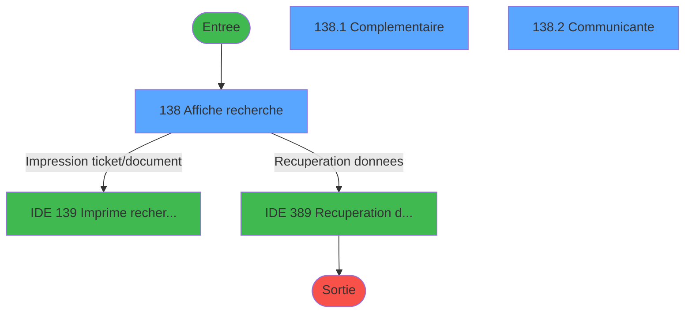
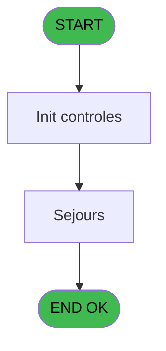
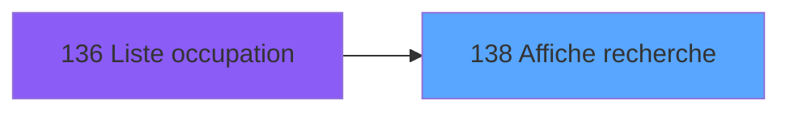
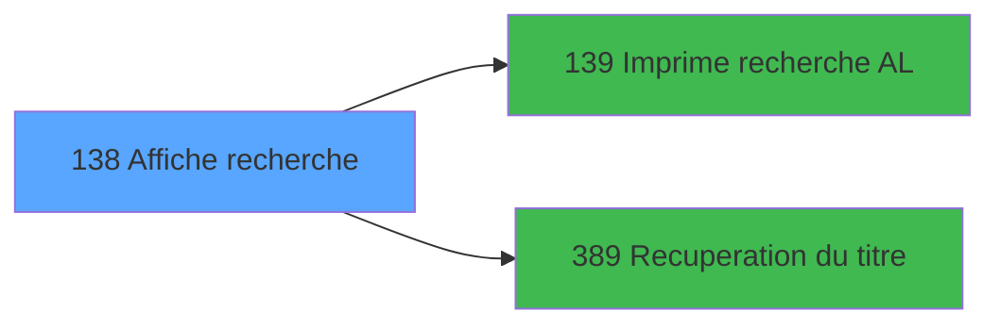

# PBP IDE 138 - Affiche recherche

> **Analyse**: Phases 1-4 2026-02-03 15:27 -> 15:28 (17s) | Assemblage 15:28
> **Pipeline**: V7.2 Enrichi
> **Structure**: 4 onglets (Resume | Ecrans | Donnees | Connexions)

<!-- TAB:Resume -->

## 1. FICHE D'IDENTITE

| Attribut | Valeur |
|----------|--------|
| Projet | PBP |
| IDE Position | 138 |
| Nom Programme | Affiche recherche |
| Fichier source | `Prg_138.xml` |
| Dossier IDE | Gestion |
| Taches | 4 (3 ecrans visibles) |
| Tables modifiees | 0 |
| Programmes appeles | 2 |

## 2. DESCRIPTION FONCTIONNELLE

**Affiche recherche** assure la gestion complete de ce processus, accessible depuis [Liste occupation (IDE 136)](PBP-IDE-136.md).

Le flux de traitement s'organise en **2 blocs fonctionnels** :

- **Traitement** (2 taches) : traitements metier divers
- **Consultation** (2 taches) : ecrans de recherche, selection et consultation

**Logique metier** : 17 regles identifiees couvrant conditions metier.

Detail : phases du traitement

#### Phase 1 : Consultation (2 taches)

- **138** - Affiche recherche **[[ECRAN]](#ecran-t1)**
- **138.3** - Exist select

Delegue a : [Recuperation du titre (IDE 389)](PBP-IDE-389.md)

#### Phase 2 : Traitement (2 taches)

- **138.1** - Complementaire **[[ECRAN]](#ecran-t2)**
- **138.2** - Communicante **[[ECRAN]](#ecran-t3)**

Delegue a : [Recuperation du titre (IDE 389)](PBP-IDE-389.md)

## 3. BLOCS FONCTIONNELS

### 3.1 Consultation (2 taches)

Ecrans de recherche et consultation.

---

#### 138 - Affiche recherche [[ECRAN]](#ecran-t1)

**Role** : Reinitialisation : Affiche recherche.
**Ecran** : 1005 x 275 DLU (MDI) | [Voir mockup](#ecran-t1)

---

#### 138.3 - Exist select

**Role** : Traitement : Exist select.
**Variables liees** : F (>NbSelect), H (w0_ExistOccup), I (w0_ExistEnsem), J (w0_ExistBati), L (w0_ExistEtag)

### 3.2 Traitement (2 taches)

Traitements internes.

---

#### 138.1 - Complementaire [[ECRAN]](#ecran-t2)

**Role** : Traitement : Complementaire.
**Ecran** : 1001 x 94 DLU (Modal) | [Voir mockup](#ecran-t2)
**Delegue a** : [Recuperation du titre (IDE 389)](PBP-IDE-389.md)

---

#### 138.2 - Communicante [[ECRAN]](#ecran-t3)

**Role** : Traitement : Communicante.
**Ecran** : 171 x 56 DLU (Modal) | [Voir mockup](#ecran-t3)
**Delegue a** : [Recuperation du titre (IDE 389)](PBP-IDE-389.md)

## 5. REGLES METIER

17 regles identifiees:

### Autres (17 regles)

#### [RM-001] Si [AE]='C' alors 'Cl' sinon 'Pe')

| Element | Detail |
|---------|--------|
| **Condition** | `[AE]='C'` |
| **Si vrai** | 'Cl' |
| **Si faux** | 'Pe') |
| **Expression source** | Expression 8 : `IF ([AE]='C','Cl','Pe')` |
| **Exemple** | Si [AE]='C' → 'Cl'. Sinon → 'Pe') |

#### [RM-002] Si [AF]='N' alors 'Non' sinon [AF])

| Element | Detail |
|---------|--------|
| **Condition** | `[AF]='N'` |
| **Si vrai** | 'Non' |
| **Si faux** | [AF]) |
| **Expression source** | Expression 9 : `IF ([AF]='N','Non',[AF])` |
| **Exemple** | Si [AF]='N' → 'Non'. Sinon → [AF]) |

#### [RM-003] Si [AG]='N' alors 'Non' sinon [AG])

| Element | Detail |
|---------|--------|
| **Condition** | `[AG]='N'` |
| **Si vrai** | 'Non' |
| **Si faux** | [AG]) |
| **Expression source** | Expression 10 : `IF ([AG]='N','Non',[AG])` |
| **Exemple** | Si [AG]='N' → 'Non'. Sinon → [AG]) |

#### [RM-004] Si [AH]='N' alors 'Non' sinon 'Oui')

| Element | Detail |
|---------|--------|
| **Condition** | `[AH]='N'` |
| **Si vrai** | 'Non' |
| **Si faux** | 'Oui') |
| **Expression source** | Expression 11 : `IF ([AH]='N','Non','Oui')` |
| **Exemple** | Si [AH]='N' → 'Non'. Sinon → 'Oui') |

#### [RM-005] Si [AJ]='N' alors 'Non' sinon 'Oui')

| Element | Detail |
|---------|--------|
| **Condition** | `[AJ]='N'` |
| **Si vrai** | 'Non' |
| **Si faux** | 'Oui') |
| **Expression source** | Expression 12 : `IF ([AJ]='N','Non','Oui')` |
| **Exemple** | Si [AJ]='N' → 'Non'. Sinon → 'Oui') |

#### [RM-006] Si [AL]='N' alors 'Non' sinon 'Oui')

| Element | Detail |
|---------|--------|
| **Condition** | `[AL]='N'` |
| **Si vrai** | 'Non' |
| **Si faux** | 'Oui') |
| **Expression source** | Expression 13 : `IF ([AL]='N','Non','Oui')` |
| **Exemple** | Si [AL]='N' → 'Non'. Sinon → 'Oui') |

#### [RM-007] Si [U]='C' alors '>' sinon '')

| Element | Detail |
|---------|--------|
| **Condition** | `[U]='C'` |
| **Si vrai** | '>' |
| **Si faux** | '') |
| **Expression source** | Expression 14 : `IF ([U]='C','>','')` |
| **Exemple** | Si [U]='C' → '>'. Sinon → '') |

#### [RM-008] Si w0_ExistAttrib [O] alors 55 sinon 1)

| Element | Detail |
|---------|--------|
| **Condition** | `w0_ExistAttrib [O]` |
| **Si vrai** | 55 |
| **Si faux** | 1) |
| **Variables** | O (w0_ExistAttrib) |
| **Expression source** | Expression 29 : `IF (w0_ExistAttrib [O],55,1)` |
| **Exemple** | Si w0_ExistAttrib [O] → 55. Sinon → 1) |
| **Impact** | [138.3 - Exist select](#t4) |

#### [RM-009] Si w0_ExistEnsem [I] alors 55 sinon 1)

| Element | Detail |
|---------|--------|
| **Condition** | `w0_ExistEnsem [I]` |
| **Si vrai** | 55 |
| **Si faux** | 1) |
| **Variables** | I (w0_ExistEnsem) |
| **Expression source** | Expression 30 : `IF (w0_ExistEnsem [I],55,1)` |
| **Exemple** | Si w0_ExistEnsem [I] → 55. Sinon → 1) |
| **Impact** | [138.3 - Exist select](#t4) |

#### [RM-010] Si w0_ExixtLog [K] alors 55 sinon 1)

| Element | Detail |
|---------|--------|
| **Condition** | `w0_ExixtLog [K]` |
| **Si vrai** | 55 |
| **Si faux** | 1) |
| **Variables** | K (w0_ExixtLog) |
| **Expression source** | Expression 31 : `IF (w0_ExixtLog [K],55,1)` |
| **Exemple** | Si w0_ExixtLog [K] → 55. Sinon → 1) |

#### [RM-011] Si w0_ExistBati [J] alors 55 sinon 1)

| Element | Detail |
|---------|--------|
| **Condition** | `w0_ExistBati [J]` |
| **Si vrai** | 55 |
| **Si faux** | 1) |
| **Variables** | J (w0_ExistBati) |
| **Expression source** | Expression 32 : `IF (w0_ExistBati [J],55,1)` |
| **Exemple** | Si w0_ExistBati [J] → 55. Sinon → 1) |
| **Impact** | [138.3 - Exist select](#t4) |

#### [RM-012] Si w0_ExistEtag [L] alors 55 sinon 1)

| Element | Detail |
|---------|--------|
| **Condition** | `w0_ExistEtag [L]` |
| **Si vrai** | 55 |
| **Si faux** | 1) |
| **Variables** | L (w0_ExistEtag) |
| **Expression source** | Expression 33 : `IF (w0_ExistEtag [L],55,1)` |
| **Exemple** | Si w0_ExistEtag [L] → 55. Sinon → 1) |
| **Impact** | [138.3 - Exist select](#t4) |

#### [RM-013] Si w0_ExistVues [M] alors 55 sinon 1)

| Element | Detail |
|---------|--------|
| **Condition** | `w0_ExistVues [M]` |
| **Si vrai** | 55 |
| **Si faux** | 1) |
| **Variables** | M (w0_ExistVues) |
| **Expression source** | Expression 34 : `IF (w0_ExistVues [M],55,1)` |
| **Exemple** | Si w0_ExistVues [M] → 55. Sinon → 1) |
| **Impact** | [138.3 - Exist select](#t4) |

#### [RM-014] Si w0_ExistOccup [H] alors 55 sinon 1)

| Element | Detail |
|---------|--------|
| **Condition** | `w0_ExistOccup [H]` |
| **Si vrai** | 55 |
| **Si faux** | 1) |
| **Variables** | H (w0_ExistOccup) |
| **Expression source** | Expression 35 : `IF (w0_ExistOccup [H],55,1)` |
| **Exemple** | Si w0_ExistOccup [H] → 55. Sinon → 1) |
| **Impact** | [138.3 - Exist select](#t4) |

#### [RM-015] Si w0_ExistHandi [P] alors 55 sinon 1)

| Element | Detail |
|---------|--------|
| **Condition** | `w0_ExistHandi [P]` |
| **Si vrai** | 55 |
| **Si faux** | 1) |
| **Variables** | P (w0_ExistHandi) |
| **Expression source** | Expression 36 : `IF (w0_ExistHandi [P],55,1)` |
| **Exemple** | Si w0_ExistHandi [P] → 55. Sinon → 1) |
| **Impact** | [138.3 - Exist select](#t4) |

#### [RM-016] Si w0_ExistCommu [N] alors 55 sinon 1)

| Element | Detail |
|---------|--------|
| **Condition** | `w0_ExistCommu [N]` |
| **Si vrai** | 55 |
| **Si faux** | 1) |
| **Variables** | N (w0_ExistCommu) |
| **Expression source** | Expression 37 : `IF (w0_ExistCommu [N],55,1)` |
| **Exemple** | Si w0_ExistCommu [N] → 55. Sinon → 1) |
| **Impact** | [138.3 - Exist select](#t4) |

#### [RM-017] Si w0_ExistStand [Q] alors 55 sinon 1)

| Element | Detail |
|---------|--------|
| **Condition** | `w0_ExistStand [Q]` |
| **Si vrai** | 55 |
| **Si faux** | 1) |
| **Variables** | Q (w0_ExistStand) |
| **Expression source** | Expression 38 : `IF (w0_ExistStand [Q],55,1)` |
| **Exemple** | Si w0_ExistStand [Q] → 55. Sinon → 1) |
| **Impact** | [138.3 - Exist select](#t4) |

## 6. CONTEXTE

- **Appele par**: [Liste occupation (IDE 136)](PBP-IDE-136.md)
- **Appelle**: 2 programmes | **Tables**: 5 (W:0 R:4 L:1) | **Taches**: 4 | **Expressions**: 43

<!-- TAB:Ecrans -->

## 8. ECRANS

### 8.1 Forms visibles (3 / 4)

| # | Position | Tache | Nom | Type | Largeur | Hauteur | Bloc |
|---|----------|-------|-----|------|---------|---------|------|
| 1 | 138 | 138 | Affiche recherche | MDI | 1005 | 275 | Consultation |
| 2 | 138.1 | 138.1 | Complementaire | Modal | 1001 | 94 | Traitement |
| 3 | 138.2 | 138.2 | Communicante | Modal | 171 | 56 | Traitement |

### 8.2 Mockups Ecrans

---

#### 138 - Affiche recherche
**Tache** : [138](#t1) | **Type** : MDI | **Dimensions** : 1005 x 275 DLU
**Bloc** : Consultation | **Titre IDE** : Affiche recherche

<!-- FORM-DATA:
{
    "width":  1005,
    "vFactor":  8,
    "type":  "MDI",
    "hFactor":  8,
    "controls":  [
                     {
                         "x":  0,
                         "type":  "label",
                         "var":  "",
                         "y":  0,
                         "w":  1003,
                         "fmt":  "",
                         "name":  "",
                         "h":  19,
                         "color":  "",
                         "text":  "",
                         "parent":  null
                     },
                     {
                         "x":  8,
                         "type":  "table",
                         "var":  "",
                         "name":  "",
                         "titleH":  12,
                         "color":  "110",
                         "w":  210,
                         "y":  27,
                         "fmt":  "",
                         "parent":  null,
                         "text":  "",
                         "rowH":  14,
                         "h":  127,
                         "cols":  [
                                      {
                                          "title":  "NOM STANDARD",
                                          "layer":  1,
                                          "w":  172
                                      }
                                  ],
                         "rows":  1
                     },
                     {
                         "x":  218,
                         "type":  "label",
                         "var":  "",
                         "y":  28,
                         "w":  407,
                         "fmt":  "",
                         "name":  "",
                         "h":  126,
                         "color":  "",
                         "text":  "",
                         "parent":  null
                     },
                     {
                         "x":  808,
                         "type":  "label",
                         "var":  "",
                         "y":  28,
                         "w":  185,
                         "fmt":  "",
                         "name":  "",
                         "h":  126,
                         "color":  "",
                         "text":  "",
                         "parent":  null
                     },
                     {
                         "x":  233,
                         "type":  "label",
                         "var":  "",
                         "y":  36,
                         "w":  134,
                         "fmt":  "",
                         "name":  "",
                         "h":  8,
                         "color":  "",
                         "text":  "Non complet",
                         "parent":  7
                     },
                     {
                         "x":  219,
                         "type":  "line",
                         "var":  "",
                         "y":  64,
                         "w":  404,
                         "fmt":  "",
                         "name":  "",
                         "h":  0,
                         "color":  "",
                         "text":  "",
                         "parent":  7
                     },
                     {
                         "x":  450,
                         "type":  "line",
                         "var":  "",
                         "y":  64,
                         "w":  0,
                         "fmt":  "",
                         "name":  "",
                         "h":  88,
                         "color":  "",
                         "text":  "",
                         "parent":  7
                     },
                     {
                         "x":  230,
                         "type":  "label",
                         "var":  "",
                         "y":  74,
                         "w":  144,
                         "fmt":  "",
                         "name":  "",
                         "h":  10,
                         "color":  "2",
                         "text":  "Ensemble",
                         "parent":  7
                     },
                     {
                         "x":  463,
                         "type":  "label",
                         "var":  "",
                         "y":  74,
                         "w":  86,
                         "fmt":  "",
                         "name":  "",
                         "h":  10,
                         "color":  "",
                         "text":  "Lit Pliant",
                         "parent":  7
                     },
                     {
                         "x":  230,
                         "type":  "label",
                         "var":  "",
                         "y":  86,
                         "w":  144,
                         "fmt":  "",
                         "name":  "",
                         "h":  10,
                         "color":  "2",
                         "text":  "Type de logement",
                         "parent":  7
                     },
                     {
                         "x":  463,
                         "type":  "label",
                         "var":  "",
                         "y":  86,
                         "w":  86,
                         "fmt":  "",
                         "name":  "",
                         "h":  10,
                         "color":  "",
                         "text":  "Lit Bébé",
                         "parent":  7
                     },
                     {
                         "x":  230,
                         "type":  "label",
                         "var":  "",
                         "y":  98,
                         "w":  144,
                         "fmt":  "",
                         "name":  "",
                         "h":  10,
                         "color":  "2",
                         "text":  "Bâtiment",
                         "parent":  7
                     },
                     {
                         "x":  463,
                         "type":  "label",
                         "var":  "",
                         "y":  98,
                         "w":  86,
                         "fmt":  "",
                         "name":  "",
                         "h":  10,
                         "color":  "",
                         "text":  "Banquette",
                         "parent":  7
                     },
                     {
                         "x":  230,
                         "type":  "label",
                         "var":  "",
                         "y":  110,
                         "w":  144,
                         "fmt":  "",
                         "name":  "",
                         "h":  10,
                         "color":  "2",
                         "text":  "Etage",
                         "parent":  7
                     },
                     {
                         "x":  230,
                         "type":  "label",
                         "var":  "",
                         "y":  122,
                         "w":  144,
                         "fmt":  "",
                         "name":  "",
                         "h":  10,
                         "color":  "2",
                         "text":  "Vue",
                         "parent":  7
                     },
                     {
                         "x":  464,
                         "type":  "label",
                         "var":  "",
                         "y":  122,
                         "w":  99,
                         "fmt":  "",
                         "name":  "",
                         "h":  10,
                         "color":  "2",
                         "text":  "Handicapés",
                         "parent":  7
                     },
                     {
                         "x":  230,
                         "type":  "label",
                         "var":  "",
                         "y":  134,
                         "w":  144,
                         "fmt":  "",
                         "name":  "",
                         "h":  10,
                         "color":  "2",
                         "text":  "Occupation STD",
                         "parent":  7
                     },
                     {
                         "x":  464,
                         "type":  "label",
                         "var":  "",
                         "y":  134,
                         "w":  99,
                         "fmt":  "",
                         "name":  "",
                         "h":  10,
                         "color":  "2",
                         "text":  "Communic.",
                         "parent":  7
                     },
                     {
                         "x":  0,
                         "type":  "label",
                         "var":  "",
                         "y":  250,
                         "w":  1001,
                         "fmt":  "",
                         "name":  "",
                         "h":  23,
                         "color":  "",
                         "text":  "",
                         "parent":  null
                     },
                     {
                         "x":  56,
                         "type":  "edit",
                         "var":  "",
                         "y":  41,
                         "w":  114,
                         "fmt":  "",
                         "name":  "TLOG NOM STANDARD",
                         "h":  10,
                         "color":  "110",
                         "text":  "",
                         "parent":  6
                     },
                     {
                         "x":  378,
                         "type":  "edit",
                         "var":  "",
                         "y":  98,
                         "w":  37,
                         "fmt":  "",
                         "name":  "",
                         "h":  10,
                         "color":  "",
                         "text":  "",
                         "parent":  7
                     },
                     {
                         "x":  378,
                         "type":  "edit",
                         "var":  "",
                         "y":  86,
                         "w":  66,
                         "fmt":  "",
                         "name":  "",
                         "h":  10,
                         "color":  "",
                         "text":  "",
                         "parent":  7
                     },
                     {
                         "x":  378,
                         "type":  "edit",
                         "var":  "",
                         "y":  74,
                         "w":  48,
                         "fmt":  "",
                         "name":  "",
                         "h":  10,
                         "color":  "",
                         "text":  "",
                         "parent":  7
                     },
                     {
                         "x":  378,
                         "type":  "edit",
                         "var":  "",
                         "y":  110,
                         "w":  37,
                         "fmt":  "",
                         "name":  "",
                         "h":  10,
                         "color":  "",
                         "text":  "",
                         "parent":  7
                     },
                     {
                         "x":  421,
                         "type":  "edit",
                         "var":  "",
                         "y":  36,
                         "w":  182,
                         "fmt":  "",
                         "name":  "",
                         "h":  10,
                         "color":  "",
                         "text":  "",
                         "parent":  7
                     },
                     {
                         "x":  421,
                         "type":  "edit",
                         "var":  "",
                         "y":  49,
                         "w":  82,
                         "fmt":  "",
                         "name":  "",
                         "h":  10,
                         "color":  "",
                         "text":  "",
                         "parent":  7
                     },
                     {
                         "x":  520,
                         "type":  "edit",
                         "var":  "",
                         "y":  49,
                         "w":  37,
                         "fmt":  "",
                         "name":  "",
                         "h":  10,
                         "color":  "2",
                         "text":  "",
                         "parent":  7
                     },
                     {
                         "x":  378,
                         "type":  "edit",
                         "var":  "",
                         "y":  122,
                         "w":  37,
                         "fmt":  "",
                         "name":  "",
                         "h":  10,
                         "color":  "",
                         "text":  "",
                         "parent":  7
                     },
                     {
                         "x":  378,
                         "type":  "edit",
                         "var":  "",
                         "y":  134,
                         "w":  37,
                         "fmt":  "",
                         "name":  "",
                         "h":  10,
                         "color":  "",
                         "text":  "",
                         "parent":  7
                     },
                     {
                         "x":  824,
                         "type":  "button",
                         "var":  "",
                         "y":  126,
                         "w":  154,
                         "fmt":  "\u0026Impression",
                         "name":  "b_Imprimer",
                         "h":  18,
                         "color":  "",
                         "text":  "",
                         "parent":  8
                     },
                     {
                         "x":  7,
                         "type":  "button",
                         "var":  "",
                         "y":  253,
                         "w":  154,
                         "fmt":  "\u0026Quitter",
                         "name":  "b_Quitter",
                         "h":  18,
                         "color":  "",
                         "text":  "",
                         "parent":  42
                     },
                     {
                         "x":  7,
                         "type":  "edit",
                         "var":  "",
                         "y":  2,
                         "w":  267,
                         "fmt":  "20",
                         "name":  "",
                         "h":  8,
                         "color":  "",
                         "text":  "",
                         "parent":  1
                     },
                     {
                         "x":  329,
                         "type":  "edit",
                         "var":  "",
                         "y":  6,
                         "w":  344,
                         "fmt":  "30",
                         "name":  "",
                         "h":  8,
                         "color":  "",
                         "text":  "",
                         "parent":  1
                     },
                     {
                         "x":  637,
                         "type":  "edit",
                         "var":  "",
                         "y":  6,
                         "w":  357,
                         "fmt":  "WWW DD MMM YYYYT",
                         "name":  "",
                         "h":  8,
                         "color":  "",
                         "text":  "",
                         "parent":  1
                     },
                     {
                         "x":  7,
                         "type":  "edit",
                         "var":  "",
                         "y":  10,
                         "w":  331,
                         "fmt":  "25",
                         "name":  "",
                         "h":  8,
                         "color":  "",
                         "text":  "",
                         "parent":  null
                     },
                     {
                         "x":  14,
                         "type":  "edit",
                         "var":  "",
                         "y":  41,
                         "w":  36,
                         "fmt":  "1",
                         "name":  "",
                         "h":  9,
                         "color":  "111",
                         "text":  "",
                         "parent":  6
                     },
                     {
                         "x":  837,
                         "type":  "image",
                         "var":  "",
                         "y":  41,
                         "w":  130,
                         "fmt":  "",
                         "name":  "",
                         "h":  64,
                         "color":  "",
                         "text":  "",
                         "parent":  8
                     },
                     {
                         "x":  566,
                         "type":  "edit",
                         "var":  "",
                         "y":  49,
                         "w":  37,
                         "fmt":  "2",
                         "name":  "",
                         "h":  10,
                         "color":  "2",
                         "text":  "",
                         "parent":  7
                     },
                     {
                         "x":  565,
                         "type":  "edit",
                         "var":  "",
                         "y":  74,
                         "w":  48,
                         "fmt":  "3",
                         "name":  "",
                         "h":  10,
                         "color":  "",
                         "text":  "",
                         "parent":  7
                     },
                     {
                         "x":  565,
                         "type":  "edit",
                         "var":  "",
                         "y":  86,
                         "w":  48,
                         "fmt":  "3",
                         "name":  "",
                         "h":  10,
                         "color":  "",
                         "text":  "",
                         "parent":  7
                     },
                     {
                         "x":  565,
                         "type":  "edit",
                         "var":  "",
                         "y":  98,
                         "w":  48,
                         "fmt":  "3",
                         "name":  "",
                         "h":  10,
                         "color":  "",
                         "text":  "",
                         "parent":  7
                     },
                     {
                         "x":  565,
                         "type":  "edit",
                         "var":  "",
                         "y":  122,
                         "w":  48,
                         "fmt":  "3",
                         "name":  "",
                         "h":  10,
                         "color":  "",
                         "text":  "",
                         "parent":  7
                     },
                     {
                         "x":  565,
                         "type":  "edit",
                         "var":  "",
                         "y":  134,
                         "w":  48,
                         "fmt":  "3",
                         "name":  "",
                         "h":  10,
                         "color":  "",
                         "text":  "",
                         "parent":  7
                     },
                     {
                         "x":  0,
                         "type":  "subform",
                         "var":  "",
                         "y":  155,
                         "w":  1003,
                         "fmt":  "",
                         "name":  "Sejours",
                         "h":  94,
                         "color":  "",
                         "text":  "",
                         "parent":  null
                     },
                     {
                         "x":  629,
                         "type":  "subform",
                         "var":  "",
                         "y":  31,
                         "w":  177,
                         "fmt":  "",
                         "name":  "Communicante",
                         "h":  60,
                         "color":  "",
                         "text":  "",
                         "parent":  null
                     },
                     {
                         "x":  629,
                         "type":  "subform",
                         "var":  "",
                         "y":  93,
                         "w":  177,
                         "fmt":  "",
                         "name":  "Proximite",
                         "h":  61,
                         "color":  "",
                         "text":  "",
                         "parent":  null
                     }
                 ],
    "taskId":  "138",
    "height":  275
}
-->

<strong>Champs : 21 champs</strong>

| Pos (x,y) | Nom | Variable | Type |
|-----------|-----|----------|------|
| 56,41 | TLOG NOM STANDARD | - | edit |
| 378,98 | (sans nom) | - | edit |
| 378,86 | (sans nom) | - | edit |
| 378,74 | (sans nom) | - | edit |
| 378,110 | (sans nom) | - | edit |
| 421,36 | (sans nom) | - | edit |
| 421,49 | (sans nom) | - | edit |
| 520,49 | (sans nom) | - | edit |
| 378,122 | (sans nom) | - | edit |
| 378,134 | (sans nom) | - | edit |
| 7,2 | 20 | - | edit |
| 329,6 | 30 | - | edit |
| 637,6 | WWW DD MMM YYYYT | - | edit |
| 7,10 | 25 | - | edit |
| 14,41 | 1 | - | edit |
| 566,49 | 2 | - | edit |
| 565,74 | 3 | - | edit |
| 565,86 | 3 | - | edit |
| 565,98 | 3 | - | edit |
| 565,122 | 3 | - | edit |
| 565,134 | 3 | - | edit |

<strong>Boutons : 2 boutons</strong>

| Bouton | Pos (x,y) | Action |
|--------|-----------|--------|
| Impression | 824,126 | Bouton fonctionnel |
| Quitter | 7,253 | Quitte le programme |

---

#### 138.1 - Complementaire
**Tache** : [138.1](#t2) | **Type** : Modal | **Dimensions** : 1001 x 94 DLU
**Bloc** : Traitement | **Titre IDE** : Complementaire

<!-- FORM-DATA:
{
    "width":  1001,
    "vFactor":  8,
    "type":  "Modal",
    "hFactor":  8,
    "controls":  [
                     {
                         "x":  9,
                         "type":  "table",
                         "var":  "",
                         "name":  "",
                         "titleH":  12,
                         "color":  "110",
                         "w":  986,
                         "y":  1,
                         "fmt":  "",
                         "parent":  null,
                         "text":  "",
                         "rowH":  12,
                         "h":  91,
                         "cols":  [
                                      {
                                          "title":  "Sexe",
                                          "layer":  1,
                                          "w":  94
                                      },
                                      {
                                          "title":  "Libellé",
                                          "layer":  2,
                                          "w":  252
                                      },
                                      {
                                          "title":  "Date début",
                                          "layer":  3,
                                          "w":  124
                                      },
                                      {
                                          "title":  "Heure",
                                          "layer":  4,
                                          "w":  70
                                      },
                                      {
                                          "title":  "Date fin",
                                          "layer":  5,
                                          "w":  116
                                      },
                                      {
                                          "title":  "Heure",
                                          "layer":  6,
                                          "w":  62
                                      },
                                      {
                                          "title":  "Age",
                                          "layer":  7,
                                          "w":  101
                                      },
                                      {
                                          "title":  "Nat.",
                                          "layer":  8,
                                          "w":  57
                                      },
                                      {
                                          "title":  "Fumeur",
                                          "layer":  9,
                                          "w":  75
                                      }
                                  ],
                         "rows":  9
                     },
                     {
                         "x":  114,
                         "type":  "edit",
                         "var":  "",
                         "y":  16,
                         "w":  237,
                         "fmt":  "",
                         "name":  "",
                         "h":  10,
                         "color":  "110",
                         "text":  "",
                         "parent":  1
                     },
                     {
                         "x":  371,
                         "type":  "edit",
                         "var":  "",
                         "y":  16,
                         "w":  98,
                         "fmt":  "DD/MM/YYZ",
                         "name":  "",
                         "h":  10,
                         "color":  "110",
                         "text":  "",
                         "parent":  1
                     },
                     {
                         "x":  499,
                         "type":  "edit",
                         "var":  "",
                         "y":  16,
                         "w":  36,
                         "fmt":  "",
                         "name":  "",
                         "h":  10,
                         "color":  "110",
                         "text":  "",
                         "parent":  1
                     },
                     {
                         "x":  560,
                         "type":  "edit",
                         "var":  "",
                         "y":  16,
                         "w":  98,
                         "fmt":  "DD/MM/YYZ",
                         "name":  "",
                         "h":  10,
                         "color":  "110",
                         "text":  "",
                         "parent":  1
                     },
                     {
                         "x":  685,
                         "type":  "edit",
                         "var":  "",
                         "y":  16,
                         "w":  30,
                         "fmt":  "",
                         "name":  "",
                         "h":  10,
                         "color":  "110",
                         "text":  "",
                         "parent":  1
                     },
                     {
                         "x":  840,
                         "type":  "edit",
                         "var":  "",
                         "y":  16,
                         "w":  40,
                         "fmt":  "",
                         "name":  "",
                         "h":  10,
                         "color":  "110",
                         "text":  "",
                         "parent":  1
                     },
                     {
                         "x":  53,
                         "type":  "edit",
                         "var":  "",
                         "y":  16,
                         "w":  30,
                         "fmt":  "2",
                         "name":  "",
                         "h":  10,
                         "color":  "110",
                         "text":  "",
                         "parent":  1
                     },
                     {
                         "x":  736,
                         "type":  "edit",
                         "var":  "",
                         "y":  16,
                         "w":  86,
                         "fmt":  "8",
                         "name":  "",
                         "h":  10,
                         "color":  "110",
                         "text":  "",
                         "parent":  1
                     },
                     {
                         "x":  904,
                         "type":  "edit",
                         "var":  "",
                         "y":  16,
                         "w":  42,
                         "fmt":  "3",
                         "name":  "",
                         "h":  10,
                         "color":  "110",
                         "text":  "",
                         "parent":  1
                     },
                     {
                         "x":  16,
                         "type":  "edit",
                         "var":  "",
                         "y":  16,
                         "w":  20,
                         "fmt":  "1",
                         "name":  "",
                         "h":  10,
                         "color":  "110",
                         "text":  "",
                         "parent":  1
                     }
                 ],
    "taskId":  "138.1",
    "height":  94
}
-->

<strong>Champs : 10 champs</strong>

| Pos (x,y) | Nom | Variable | Type |
|-----------|-----|----------|------|
| 114,16 | (sans nom) | - | edit |
| 371,16 | DD/MM/YYZ | - | edit |
| 499,16 | (sans nom) | - | edit |
| 560,16 | DD/MM/YYZ | - | edit |
| 685,16 | (sans nom) | - | edit |
| 840,16 | (sans nom) | - | edit |
| 53,16 | 2 | - | edit |
| 736,16 | 8 | - | edit |
| 904,16 | 3 | - | edit |
| 16,16 | 1 | - | edit |

---

#### 138.2 - Communicante
**Tache** : [138.2](#t3) | **Type** : Modal | **Dimensions** : 171 x 56 DLU
**Bloc** : Traitement | **Titre IDE** : Communicante

<!-- FORM-DATA:
{
    "width":  171,
    "vFactor":  8,
    "type":  "Modal",
    "hFactor":  8,
    "controls":  [
                     {
                         "x":  0,
                         "type":  "table",
                         "var":  "",
                         "name":  "",
                         "titleH":  12,
                         "color":  "110",
                         "w":  168,
                         "y":  0,
                         "fmt":  "",
                         "parent":  null,
                         "text":  "",
                         "rowH":  14,
                         "h":  55,
                         "cols":  [
                                      {
                                          "title":  "Communicante",
                                          "layer":  1,
                                          "w":  162
                                      }
                                  ],
                         "rows":  1
                     },
                     {
                         "x":  6,
                         "type":  "edit",
                         "var":  "",
                         "y":  14,
                         "w":  140,
                         "fmt":  "",
                         "name":  "",
                         "h":  10,
                         "color":  "110",
                         "text":  "",
                         "parent":  1
                     }
                 ],
    "taskId":  "138.2",
    "height":  56
}
-->

<strong>Champs : 1 champs</strong>

| Pos (x,y) | Nom | Variable | Type |
|-----------|-----|----------|------|
| 6,14 | (sans nom) | - | edit |

## 9. NAVIGATION

### 9.1 Enchainement des ecrans

**Detail par enchainement :**

| Depuis | Action | Vers | Retour |
|--------|--------|------|--------|
| Affiche recherche | Impression ticket/document | [  Imprime recherche AL (IDE 139)](PBP-IDE-139.md) | Retour ecran |
| Affiche recherche | Recuperation donnees | [Recuperation du titre (IDE 389)](PBP-IDE-389.md) | Retour ecran |

### 9.3 Structure hierarchique (4 taches)

| Position | Tache | Type | Dimensions | Bloc |
|----------|-------|------|------------|------|
| **138.1** | [**Affiche recherche** (138)](#t1) [mockup](#ecran-t1) | MDI | 1005x275 | Consultation |
| 138.1.1 | [Exist select (138.3)](#t4) | MDI | - | |
| **138.2** | [**Complementaire** (138.1)](#t2) [mockup](#ecran-t2) | Modal | 1001x94 | Traitement |
| 138.2.1 | [Communicante (138.2)](#t3) [mockup](#ecran-t3) | Modal | 171x56 | |

### 9.4 Algorigramme

> **Legende**: Vert = START/END OK | Rouge = END KO | Bleu = Decisions
> *Algorigramme auto-genere. Utiliser `/algorigramme` pour une synthese metier detaillee.*

<!-- TAB:Donnees -->

## 10. TABLES

### Tables utilisees (5)

| ID | Nom | Description | Type | R | W | L | Usages |
|----|-----|-------------|------|---|---|---|--------|
| 34 | hebergement______heb | Hebergement (chambres) | DB | R |   |   | 1 |
| 103 | logement_client__loc |  | DB | R |   |   | 1 |
| 105 | logement_complement |  | DB | R |   |   | 1 |
| 621 | tempo_ecran_mecano | Table temporaire ecran | TMP |   |   | L | 1 |
| 637 | tempo_zone_secteur | Table temporaire ecran | DB | R |   |   | 1 |

### Colonnes par table (4 / 4 tables avec colonnes identifiees)

Table 34 - hebergement______heb (R) - 1 usages

*Table utilisee uniquement en Link ou aucune colonne Real identifiee dans le DataView.*

Table 103 - logement_client__loc (R) - 1 usages

| Lettre | Variable | Acces | Type |
|--------|----------|-------|------|
| A | >DateDebut | R | Date |
| B | >HeureDebut | R | Alpha |
| C | >DateFin | R | Date |
| D | >HeureFin | R | Alpha |
| E | >Total | R | Numeric |
| F | >NbSelect | R | Numeric |
| G | w0_ExecTache | R | Logical |
| H | w0_ExistOccup | R | Logical |
| I | w0_ExistEnsem | R | Logical |
| J | w0_ExistBati | R | Logical |
| K | w0_ExixtLog | R | Logical |
| L | w0_ExistEtag | R | Logical |
| M | w0_ExistVues | R | Logical |
| N | w0_ExistCommu | R | Logical |
| O | w0_ExistAttrib | R | Logical |
| P | w0_ExistHandi | R | Logical |
| Q | w0_ExistStand | R | Logical |
| R | w0_TitreEcran | R | Alpha |
| S | b_Imprimer | R | Alpha |
| T | b_Quitter | R | Alpha |

Table 105 - logement_complement (R) - 1 usages

| Lettre | Variable | Acces | Type |
|--------|----------|-------|------|
| A | P.Nom standard | R | Alpha |
| B | >CodeComplement | R | Alpha |

Table 637 - tempo_zone_secteur (R) - 1 usages

| Lettre | Variable | Acces | Type |
|--------|----------|-------|------|
| A | >Categorie | R | Alpha |
| B | >NomTable | R | Alpha |
| C | <CodeRetour | R | Logical |
| D | w1_TousVrai | R | Logical |

## 11. VARIABLES

### 11.1 Autres (20)

Variables diverses.

| Lettre | Nom | Type | Usage dans |
|--------|-----|------|-----------|
| A | >DateDebut | Date | - |
| B | >HeureDebut | Alpha | - |
| C | >DateFin | Date | - |
| D | >HeureFin | Alpha | - |
| E | >Total | Numeric | 1x refs |
| F | >NbSelect | Numeric | 1x refs |
| G | w0_ExecTache | Logical | - |
| H | w0_ExistOccup | Logical | 1x refs |
| I | w0_ExistEnsem | Logical | 1x refs |
| J | w0_ExistBati | Logical | 1x refs |
| K | w0_ExixtLog | Logical | 1x refs |
| L | w0_ExistEtag | Logical | 1x refs |
| M | w0_ExistVues | Logical | 1x refs |
| N | w0_ExistCommu | Logical | 1x refs |
| O | w0_ExistAttrib | Logical | 1x refs |
| P | w0_ExistHandi | Logical | 1x refs |
| Q | w0_ExistStand | Logical | 1x refs |
| R | w0_TitreEcran | Alpha | 1x refs |
| S | b_Imprimer | Alpha | - |
| T | b_Quitter | Alpha | 1x refs |

Toutes les 20 variables (liste complete)

| Cat | Lettre | Nom Variable | Type |
|-----|--------|--------------|------|
| Autre | **A** | >DateDebut | Date |
| Autre | **B** | >HeureDebut | Alpha |
| Autre | **C** | >DateFin | Date |
| Autre | **D** | >HeureFin | Alpha |
| Autre | **E** | >Total | Numeric |
| Autre | **F** | >NbSelect | Numeric |
| Autre | **G** | w0_ExecTache | Logical |
| Autre | **H** | w0_ExistOccup | Logical |
| Autre | **I** | w0_ExistEnsem | Logical |
| Autre | **J** | w0_ExistBati | Logical |
| Autre | **K** | w0_ExixtLog | Logical |
| Autre | **L** | w0_ExistEtag | Logical |
| Autre | **M** | w0_ExistVues | Logical |
| Autre | **N** | w0_ExistCommu | Logical |
| Autre | **O** | w0_ExistAttrib | Logical |
| Autre | **P** | w0_ExistHandi | Logical |
| Autre | **Q** | w0_ExistStand | Logical |
| Autre | **R** | w0_TitreEcran | Alpha |
| Autre | **S** | b_Imprimer | Alpha |
| Autre | **T** | b_Quitter | Alpha |

## 12. EXPRESSIONS

**43 / 43 expressions decodees (100%)**

### 12.1 Repartition par type

| Type | Expressions | Regles |
|------|-------------|--------|
| CONDITION | 17 | 17 |
| CONSTANTE | 16 | 0 |
| DATE | 1 | 0 |
| REFERENCE_VG | 2 | 0 |
| OTHER | 3 | 0 |
| CAST_LOGIQUE | 2 | 0 |
| STRING | 1 | 0 |
| CONCATENATION | 1 | 0 |

### 12.2 Expressions cles par type

#### CONDITION (17 expressions)

| Type | IDE | Expression | Regle |
|------|-----|------------|-------|
| CONDITION | 33 | `IF (w0_ExistEtag [L],55,1)` | [RM-012](#rm-RM-012) |
| CONDITION | 34 | `IF (w0_ExistVues [M],55,1)` | [RM-013](#rm-RM-013) |
| CONDITION | 31 | `IF (w0_ExixtLog [K],55,1)` | [RM-010](#rm-RM-010) |
| CONDITION | 32 | `IF (w0_ExistBati [J],55,1)` | [RM-011](#rm-RM-011) |
| CONDITION | 37 | `IF (w0_ExistCommu [N],55,1)` | [RM-016](#rm-RM-016) |
| ... | | *+12 autres* | |

#### CONSTANTE (16 expressions)

| Type | IDE | Expression | Regle |
|------|-----|------------|-------|
| CONSTANTE | 25 | `'TCOMU'` | - |
| CONSTANTE | 26 | `'TATTR'` | - |
| CONSTANTE | 23 | `'TETAG'` | - |
| CONSTANTE | 24 | `'VVUES'` | - |
| CONSTANTE | 42 | `'C'` | - |
| ... | | *+11 autres* | |

#### DATE (1 expressions)

| Type | IDE | Expression | Regle |
|------|-----|------------|-------|
| DATE | 7 | `Date ()` | - |

#### REFERENCE_VG (2 expressions)

| Type | IDE | Expression | Regle |
|------|-----|------------|-------|
| REFERENCE_VG | 6 | `VG2` | - |
| REFERENCE_VG | 1 | `VG1` | - |

#### OTHER (3 expressions)

| Type | IDE | Expression | Regle |
|------|-----|------------|-------|
| OTHER | 41 | `GetParam ('VILLAGE')` | - |
| OTHER | 3 | `b_Quitter [T]` | - |
| OTHER | 2 | `GetParam ('SOCIETE')` | - |

#### CAST_LOGIQUE (2 expressions)

| Type | IDE | Expression | Regle |
|------|-----|------------|-------|
| CAST_LOGIQUE | 40 | `'TRUE'LOG` | - |
| CAST_LOGIQUE | 39 | `'FALSE'LOG` | - |

#### STRING (1 expressions)

| Type | IDE | Expression | Regle |
|------|-----|------------|-------|
| STRING | 5 | `Trim (w0_TitreEcran [R])` | - |

#### CONCATENATION (1 expressions)

| Type | IDE | Expression | Regle |
|------|-----|------------|-------|
| CONCATENATION | 17 | `MlsTrans ('Selection')&' '&Trim (Str (>NbSelect [F],'4'))&' '&MlsTrans ('sur')&' '&Trim (Str (>Total [E],'4'))` | - |

### 12.3 Toutes les expressions (43)

Voir les 43 expressions

#### CONDITION (17)

| IDE | Expression Decodee |
|-----|-------------------|
| 8 | `IF ([AE]='C','Cl','Pe')` |
| 9 | `IF ([AF]='N','Non',[AF])` |
| 10 | `IF ([AG]='N','Non',[AG])` |
| 11 | `IF ([AH]='N','Non','Oui')` |
| 12 | `IF ([AJ]='N','Non','Oui')` |
| 13 | `IF ([AL]='N','Non','Oui')` |
| 14 | `IF ([U]='C','>','')` |
| 29 | `IF (w0_ExistAttrib [O],55,1)` |
| 30 | `IF (w0_ExistEnsem [I],55,1)` |
| 31 | `IF (w0_ExixtLog [K],55,1)` |
| 32 | `IF (w0_ExistBati [J],55,1)` |
| 33 | `IF (w0_ExistEtag [L],55,1)` |
| 34 | `IF (w0_ExistVues [M],55,1)` |
| 35 | `IF (w0_ExistOccup [H],55,1)` |
| 36 | `IF (w0_ExistHandi [P],55,1)` |
| 37 | `IF (w0_ExistCommu [N],55,1)` |
| 38 | `IF (w0_ExistStand [Q],55,1)` |

#### CONSTANTE (16)

| IDE | Expression Decodee |
|-----|-------------------|
| 4 | `33` |
| 15 | `'&Imprimer'` |
| 16 | `'&Quitter'` |
| 18 | `'L'` |
| 19 | `'TOCCU'` |
| 20 | `'VENSE'` |
| 21 | `'VBATI'` |
| 22 | `'VLOGE'` |
| 23 | `'TETAG'` |
| 24 | `'VVUES'` |
| 25 | `'TCOMU'` |
| 26 | `'TATTR'` |
| 27 | `'THAND'` |
| 28 | `'TSTAN'` |
| 42 | `'C'` |
| 43 | `'P'` |

#### DATE (1)

| IDE | Expression Decodee |
|-----|-------------------|
| 7 | `Date ()` |

#### REFERENCE_VG (2)

| IDE | Expression Decodee |
|-----|-------------------|
| 1 | `VG1` |
| 6 | `VG2` |

#### OTHER (3)

| IDE | Expression Decodee |
|-----|-------------------|
| 2 | `GetParam ('SOCIETE')` |
| 3 | `b_Quitter [T]` |
| 41 | `GetParam ('VILLAGE')` |

#### CAST_LOGIQUE (2)

| IDE | Expression Decodee |
|-----|-------------------|
| 39 | `'FALSE'LOG` |
| 40 | `'TRUE'LOG` |

#### STRING (1)

| IDE | Expression Decodee |
|-----|-------------------|
| 5 | `Trim (w0_TitreEcran [R])` |

#### CONCATENATION (1)

| IDE | Expression Decodee |
|-----|-------------------|
| 17 | `MlsTrans ('Selection')&' '&Trim (Str (>NbSelect [F],'4'))&' '&MlsTrans ('sur')&' '&Trim (Str (>Total [E],'4'))` |

<!-- TAB:Connexions -->

## 13. GRAPHE D'APPELS

### 13.1 Chaine depuis Main (Callers)

Main -> ... -> [Liste occupation (IDE 136)](PBP-IDE-136.md) -> **Affiche recherche (IDE 138)**

### 13.2 Callers

| IDE | Nom Programme | Nb Appels |
|-----|---------------|-----------|
| [136](PBP-IDE-136.md) | Liste occupation | 1 |

### 13.3 Callees (programmes appeles)

### 13.4 Detail Callees avec contexte

| IDE | Nom Programme | Appels | Contexte |
|-----|---------------|--------|----------|
| [139](PBP-IDE-139.md) |   Imprime recherche AL | 1 | Impression ticket/document |
| [389](PBP-IDE-389.md) | Recuperation du titre | 1 | Recuperation donnees |

## 14. RECOMMANDATIONS MIGRATION

### 14.1 Profil du programme

| Metrique | Valeur | Impact migration |
|----------|--------|-----------------|
| Lignes de logique | 112 | Programme compact |
| Expressions | 43 | Peu de logique |
| Tables WRITE | 0 | Impact faible |
| Sous-programmes | 2 | Peu de dependances |
| Ecrans visibles | 3 | Quelques ecrans |
| Code desactive | 0% (0 / 112) | Code sain |
| Regles metier | 17 | Logique metier riche |

### 14.2 Plan de migration par bloc

#### Consultation (2 taches: 1 ecran, 1 traitement)

- **Strategie** : Composants de recherche/selection en modales.
- 1 ecran : Affiche recherche

#### Traitement (2 taches: 2 ecrans, 0 traitement)

- **Strategie** : 2 composant(s) UI (Razor/React) avec formulaires et validation.
- 2 sous-programme(s) a migrer ou a reutiliser depuis les services existants.
- Decomposer les taches en services unitaires testables.

### 14.3 Dependances critiques

| Dependance | Type | Appels | Impact |
|------------|------|--------|--------|
| [Recuperation du titre (IDE 389)](PBP-IDE-389.md) | Sous-programme | 1x | Normale - Recuperation donnees |
| [  Imprime recherche AL (IDE 139)](PBP-IDE-139.md) | Sous-programme | 1x | Normale - Impression ticket/document |

---
*Spec DETAILED generee par Pipeline V7.2 - 2026-02-03 15:28*
