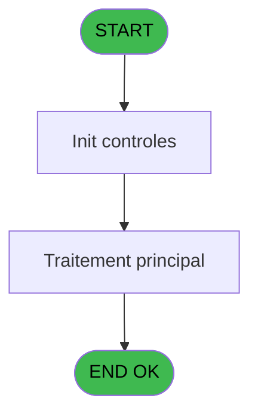
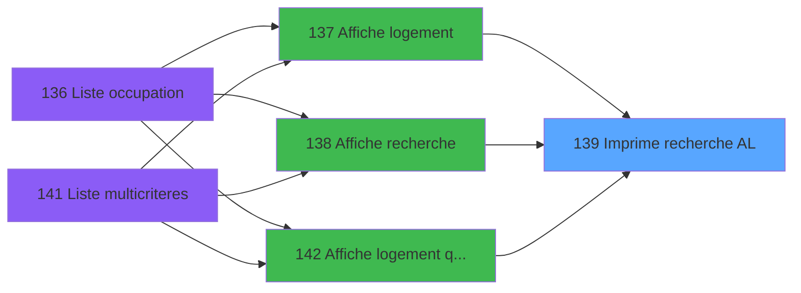

# PBP IDE 139 - Imprime recherche AL

> **Analyse**: Phases 1-4 2026-02-03 15:28 -> 15:28 (17s) | Assemblage 15:28
> **Pipeline**: V7.2 Enrichi
> **Structure**: 4 onglets (Resume | Ecrans | Donnees | Connexions)

<!-- TAB:Resume -->

## 1. FICHE D'IDENTITE

| Attribut | Valeur |
|----------|--------|
| Projet | PBP |
| IDE Position | 139 |
| Nom Programme | Imprime recherche AL |
| Fichier source | `Prg_139.xml` |
| Dossier IDE | Gestion |
| Taches | 3 (1 ecrans visibles) |
| Tables modifiees | 0 |
| Programmes appeles | 0 |

## 2. DESCRIPTION FONCTIONNELLE

**Imprime recherche AL** assure la gestion complete de ce processus, accessible depuis [  Affiche logement (IDE 137)](PBP-IDE-137.md), [  Affiche recherche (IDE 138)](PBP-IDE-138.md), [  Affiche logement (qualite) (IDE 142)](PBP-IDE-142.md).

Le flux de traitement s'organise en **2 blocs fonctionnels** :

- **Traitement** (2 taches) : traitements metier divers
- **Impression** (1 tache) : generation de tickets et documents

**Logique metier** : 3 regles identifiees couvrant conditions metier.

Detail : phases du traitement

#### Phase 1 : Traitement (2 taches)

- **139** - Veuillez Patienter ... **[[ECRAN]](#ecran-t1)**
- **139.2** - Nombre occupation

#### Phase 2 : Impression (1 tache)

- **139.1** - Imprime occupation

## 3. BLOCS FONCTIONNELS

### 3.1 Traitement (2 taches)

Traitements internes.

---

#### 139 - Veuillez Patienter ... [[ECRAN]](#ecran-t1)

**Role** : Traitement : Veuillez Patienter ....
**Ecran** : 424 x 56 DLU (MDI) | [Voir mockup](#ecran-t1)

---

#### 139.2 - Nombre occupation

**Role** : Calcul : Nombre occupation.

### 3.2 Impression (1 tache)

Generation des documents et tickets.

---

#### 139.1 - Imprime occupation

**Role** : Configuration/parametrage : Imprime occupation.

## 5. REGLES METIER

3 regles identifiees:

### Autres (3 regles)

#### [RM-001] Si w0_NbPers/Log [G]='C' alors 'è' sinon '')

| Element | Detail |
|---------|--------|
| **Condition** | `w0_NbPers/Log [G]='C'` |
| **Si vrai** | 'è' |
| **Si faux** | '') |
| **Variables** | G (w0_NbPers/Log) |
| **Expression source** | Expression 8 : `IF (w0_NbPers/Log [G]='C','è','')` |
| **Exemple** | Si w0_NbPers/Log [G]='C' → 'è'. Sinon → '') |

#### [RM-002] Si e_SiBebe [V]='O' alors 'Oui' sinon 'Non')

| Element | Detail |
|---------|--------|
| **Condition** | `e_SiBebe [V]='O'` |
| **Si vrai** | 'Oui' |
| **Si faux** | 'Non') |
| **Variables** | V (e_SiBebe) |
| **Expression source** | Expression 9 : `IF (e_SiBebe [V]='O','Oui','Non')` |
| **Exemple** | Si e_SiBebe [V]='O' → 'Oui'. Sinon → 'Non') |

#### [RM-003] Si e_Vip [X]='O' alors 'Oui' sinon 'Non')

| Element | Detail |
|---------|--------|
| **Condition** | `e_Vip [X]='O'` |
| **Si vrai** | 'Oui' |
| **Si faux** | 'Non') |
| **Variables** | X (e_Vip) |
| **Expression source** | Expression 10 : `IF (e_Vip [X]='O','Oui','Non')` |
| **Exemple** | Si e_Vip [X]='O' → 'Oui'. Sinon → 'Non') |

## 6. CONTEXTE

- **Appele par**: [  Affiche logement (IDE 137)](PBP-IDE-137.md), [  Affiche recherche (IDE 138)](PBP-IDE-138.md), [  Affiche logement (qualite) (IDE 142)](PBP-IDE-142.md)
- **Appelle**: 0 programmes | **Tables**: 8 (W:0 R:3 L:6) | **Taches**: 3 | **Expressions**: 13

<!-- TAB:Ecrans -->

## 8. ECRANS

### 8.1 Forms visibles (1 / 3)

| # | Position | Tache | Nom | Type | Largeur | Hauteur | Bloc |
|---|----------|-------|-----|------|---------|---------|------|
| 1 | 139 | 139 | Veuillez Patienter ... | MDI | 424 | 56 | Traitement |

### 8.2 Mockups Ecrans

---

#### 139 - Veuillez Patienter ...
**Tache** : [139](#t1) | **Type** : MDI | **Dimensions** : 424 x 56 DLU
**Bloc** : Traitement | **Titre IDE** : Veuillez Patienter ...

<!-- FORM-DATA:
{
    "width":  424,
    "vFactor":  8,
    "type":  "MDI",
    "hFactor":  8,
    "controls":  [
                     {
                         "x":  0,
                         "type":  "label",
                         "var":  "",
                         "y":  0,
                         "w":  423,
                         "fmt":  "",
                         "name":  "",
                         "h":  29,
                         "color":  "",
                         "text":  "",
                         "parent":  null
                     },
                     {
                         "x":  120,
                         "type":  "label",
                         "var":  "",
                         "y":  10,
                         "w":  221,
                         "fmt":  "",
                         "name":  "",
                         "h":  8,
                         "color":  "7",
                         "text":  "Impression en cours ...",
                         "parent":  null
                     },
                     {
                         "x":  0,
                         "type":  "label",
                         "var":  "",
                         "y":  29,
                         "w":  423,
                         "fmt":  "",
                         "name":  "",
                         "h":  27,
                         "color":  "",
                         "text":  "",
                         "parent":  null
                     },
                     {
                         "x":  72,
                         "type":  "label",
                         "var":  "",
                         "y":  38,
                         "w":  267,
                         "fmt":  "",
                         "name":  "",
                         "h":  8,
                         "color":  "",
                         "text":  "Edition des occupations",
                         "parent":  null
                     },
                     {
                         "x":  4,
                         "type":  "image",
                         "var":  "",
                         "y":  2,
                         "w":  72,
                         "fmt":  "",
                         "name":  "",
                         "h":  25,
                         "color":  "",
                         "text":  "",
                         "parent":  null
                     }
                 ],
    "taskId":  "139",
    "height":  56
}
-->

## 9. NAVIGATION

Ecran unique: **Veuillez Patienter ...**

### 9.3 Structure hierarchique (3 taches)

| Position | Tache | Type | Dimensions | Bloc |
|----------|-------|------|------------|------|
| **139.1** | [**Veuillez Patienter ...** (139)](#t1) [mockup](#ecran-t1) | MDI | 424x56 | Traitement |
| 139.1.1 | [Nombre occupation (139.2)](#t3) | MDI | - | |
| **139.2** | [**Imprime occupation** (139.1)](#t2) | MDI | - | Impression |

### 9.4 Algorigramme

> **Legende**: Vert = START/END OK | Rouge = END KO | Bleu = Decisions
> *Algorigramme auto-genere. Utiliser `/algorigramme` pour une synthese metier detaillee.*

<!-- TAB:Donnees -->

## 10. TABLES

### Tables utilisees (8)

| ID | Nom | Description | Type | R | W | L | Usages |
|----|-----|-------------|------|---|---|---|--------|
| 30 | gm-recherche_____gmr | Index de recherche | DB | R |   |   | 1 |
| 34 | hebergement______heb | Hebergement (chambres) | DB | R |   | L | 2 |
| 35 | personnel_go______go |  | DB |   |   | L | 1 |
| 36 | client_gm |  | DB |   |   | L | 1 |
| 103 | logement_client__loc |  | DB | R |   |   | 1 |
| 113 | tables_village |  | DB |   |   | L | 1 |
| 358 | import_mod |  | DB |   |   | L | 1 |
| 621 | tempo_ecran_mecano | Table temporaire ecran | TMP |   |   | L | 1 |

### Colonnes par table (4 / 3 tables avec colonnes identifiees)

Table 30 - gm-recherche_____gmr (R) - 1 usages

| Lettre | Variable | Acces | Type |
|--------|----------|-------|------|
| A | w1_EditData | R | Logical |
| B | w1_AffichBloqAllo | R | Logical |
| C | v passage | R | Logical |
| D | w1_RetourClient | R | Logical |
| E | w1_RetourPersonnel | R | Logical |
| F | e_Communicant | R | Alpha |
| G | e_Logement | R | Alpha |
| H | e_Ensemble | R | Alpha |
| I | e_TypLogement | R | Alpha |
| J | e_Batiment | R | Alpha |
| K | e_Etage | R | Alpha |
| L | e_Vue | R | Alpha |
| M | e_Handicap | R | Alpha |
| N | e_Communicant | R | Alpha |
| O | e_Texte | R | Alpha |
| P | e_Sexe | R | Alpha |
| Q | e_Nom | R | Alpha |
| R | e_Prenom | R | Alpha |
| S | e_Nationnalite | R | Alpha |
| T | e_Age | R | Numeric |
| U | e_FinSejour | R | Date |
| V | e_SiBebe | R | Alpha |
| W | e_Millesia | R | Alpha |
| X | e_Vip | R | Alpha |

Table 34 - hebergement______heb (R/L) - 2 usages

*Table utilisee uniquement en Link ou aucune colonne Real identifiee dans le DataView.*

Table 103 - logement_client__loc (R) - 1 usages

| Lettre | Variable | Acces | Type |
|--------|----------|-------|------|
| A | >DateDebut | R | Date |
| B | >HeureDebut | R | Alpha |
| C | >DateFin | R | Date |
| D | >HeureFin | R | Alpha |
| E | e0_TotalLibre | R | Numeric |
| F | w0_LogLibre | R | Logical |
| G | w0_NbPers/Log | R | Numeric |

## 11. VARIABLES

### 11.1 Autres (24)

Variables diverses.

| Lettre | Nom | Type | Usage dans |
|--------|-----|------|-----------|
| A | >DateDebut | Date | 1x refs |
| B | >HeureDebut | Alpha | 1x refs |
| C | >DateFin | Date | 1x refs |
| D | >HeureFin | Alpha | 1x refs |
| E | e0_TotalLibre | Numeric | - |
| F | w0_LogLibre | Logical | 1x refs |
| G | w0_NbPers/Log | Numeric | 1x refs |
| H | e_Ensemble | Alpha | - |
| I | e_TypLogement | Alpha | - |
| J | e_Batiment | Alpha | - |
| K | e_Etage | Alpha | - |
| L | e_Vue | Alpha | - |
| M | e_Handicap | Alpha | - |
| N | e_Communicant | Alpha | - |
| O | e_Texte | Alpha | - |
| P | e_Sexe | Alpha | - |
| Q | e_Nom | Alpha | - |
| R | e_Prenom | Alpha | - |
| S | e_Nationnalite | Alpha | - |
| T | e_Age | Numeric | - |
| U | e_FinSejour | Date | - |
| V | e_SiBebe | Alpha | 1x refs |
| W | e_Millesia | Alpha | 1x refs |
| X | e_Vip | Alpha | 1x refs |

Toutes les 24 variables (liste complete)

| Cat | Lettre | Nom Variable | Type |
|-----|--------|--------------|------|
| Autre | **A** | >DateDebut | Date |
| Autre | **B** | >HeureDebut | Alpha |
| Autre | **C** | >DateFin | Date |
| Autre | **D** | >HeureFin | Alpha |
| Autre | **E** | e0_TotalLibre | Numeric |
| Autre | **F** | w0_LogLibre | Logical |
| Autre | **G** | w0_NbPers/Log | Numeric |
| Autre | **H** | e_Ensemble | Alpha |
| Autre | **I** | e_TypLogement | Alpha |
| Autre | **J** | e_Batiment | Alpha |
| Autre | **K** | e_Etage | Alpha |
| Autre | **L** | e_Vue | Alpha |
| Autre | **M** | e_Handicap | Alpha |
| Autre | **N** | e_Communicant | Alpha |
| Autre | **O** | e_Texte | Alpha |
| Autre | **P** | e_Sexe | Alpha |
| Autre | **Q** | e_Nom | Alpha |
| Autre | **R** | e_Prenom | Alpha |
| Autre | **S** | e_Nationnalite | Alpha |
| Autre | **T** | e_Age | Numeric |
| Autre | **U** | e_FinSejour | Date |
| Autre | **V** | e_SiBebe | Alpha |
| Autre | **W** | e_Millesia | Alpha |
| Autre | **X** | e_Vip | Alpha |

## 12. EXPRESSIONS

**13 / 13 expressions decodees (100%)**

### 12.1 Repartition par type

| Type | Expressions | Regles |
|------|-------------|--------|
| CONCATENATION | 3 | 0 |
| CALCULATION | 1 | 0 |
| CONDITION | 5 | 3 |
| REFERENCE_VG | 1 | 0 |
| OTHER | 3 | 0 |

### 12.2 Expressions cles par type

#### CONCATENATION (3 expressions)

| Type | IDE | Expression | Regle |
|------|-----|------------|-------|
| CONCATENATION | 6 | `MlsTrans ('LISTE D''OCCUPATION DU')&' '&DStr (>DateDebut [A],'DD/MM/YYYY')&' '&MlsTrans ('à')&' '&Trim (>HeureDebut [B])&' '&MlsTrans ('h au')&' '&DStr (>DateFin [C],'DD/MM/YYYY')&' '&MlsTrans ('à')&' '&Trim (>HeureFin [D])&' h'` | - |
| CONCATENATION | 5 | `MlsTrans ('Edition du')&' '&DStr (Date (),'DD/MM/YYYY')&' '&MlsTrans ('à')&' '&TStr (Time (),'HH:MM:SS')` | - |
| CONCATENATION | 7 | `'- '&Str (Page (0,1),'3P0Z0')&' -'` | - |

#### CALCULATION (1 expressions)

| Type | IDE | Expression | Regle |
|------|-----|------------|-------|
| CALCULATION | 11 | `[Y]+1` | - |

#### CONDITION (5 expressions)

| Type | IDE | Expression | Regle |
|------|-----|------------|-------|
| CONDITION | 10 | `IF (e_Vip [X]='O','Oui','Non')` | [RM-003](#rm-RM-003) |
| CONDITION | 9 | `IF (e_SiBebe [V]='O','Oui','Non')` | [RM-002](#rm-RM-002) |
| CONDITION | 8 | `IF (w0_NbPers/Log [G]='C','è','')` | [RM-001](#rm-RM-001) |
| CONDITION | 13 | `e_Millesia [W]>[AA]` | - |
| CONDITION | 12 | `INIGet ('[MAGIC_LOGICAL_NAMES]preview')='O'` | - |

#### REFERENCE_VG (1 expressions)

| Type | IDE | Expression | Regle |
|------|-----|------------|-------|
| REFERENCE_VG | 1 | `VG1` | - |

#### OTHER (3 expressions)

| Type | IDE | Expression | Regle |
|------|-----|------------|-------|
| OTHER | 4 | `w0_LogLibre [F]` | - |
| OTHER | 3 | `GetParam ('SOCIETE')` | - |
| OTHER | 2 | `'Village '&GetParam ('VILLAGE')` | - |

<!-- TAB:Connexions -->

## 13. GRAPHE D'APPELS

### 13.1 Chaine depuis Main (Callers)

Main -> ... -> [  Affiche logement (IDE 137)](PBP-IDE-137.md) -> **Imprime recherche AL (IDE 139)**

Main -> ... -> [  Affiche recherche (IDE 138)](PBP-IDE-138.md) -> **Imprime recherche AL (IDE 139)**

Main -> ... -> [  Affiche logement (qualite) (IDE 142)](PBP-IDE-142.md) -> **Imprime recherche AL (IDE 139)**

### 13.2 Callers

| IDE | Nom Programme | Nb Appels |
|-----|---------------|-----------|
| [137](PBP-IDE-137.md) |   Affiche logement | 1 |
| [138](PBP-IDE-138.md) |   Affiche recherche | 1 |
| [142](PBP-IDE-142.md) |   Affiche logement (qualite) | 1 |

### 13.3 Callees (programmes appeles)

### 13.4 Detail Callees avec contexte

| IDE | Nom Programme | Appels | Contexte |
|-----|---------------|--------|----------|
| - | (aucun) | - | - |

## 14. RECOMMANDATIONS MIGRATION

### 14.1 Profil du programme

| Metrique | Valeur | Impact migration |
|----------|--------|-----------------|
| Lignes de logique | 220 | Taille moyenne |
| Expressions | 13 | Peu de logique |
| Tables WRITE | 0 | Impact faible |
| Sous-programmes | 0 | Peu de dependances |
| Ecrans visibles | 1 | Ecran unique ou traitement batch |
| Code desactive | 0% (0 / 220) | Code sain |
| Regles metier | 3 | Quelques regles a preserver |

### 14.2 Plan de migration par bloc

#### Traitement (2 taches: 1 ecran, 1 traitement)

- **Strategie** : Orchestrateur avec 1 ecrans (Razor/React) et 1 traitements backend (services).
- Les ecrans deviennent des composants UI, les traitements invisibles deviennent des services injectables.
- Decomposer les taches en services unitaires testables.

#### Impression (1 tache: 0 ecran, 1 traitement)

- **Strategie** : Templates HTML -> PDF via wkhtmltopdf ou Puppeteer.
- `PrintService` injectable avec choix imprimante

### 14.3 Dependances critiques

| Dependance | Type | Appels | Impact |
|------------|------|--------|--------|

---
*Spec DETAILED generee par Pipeline V7.2 - 2026-02-03 15:28*
