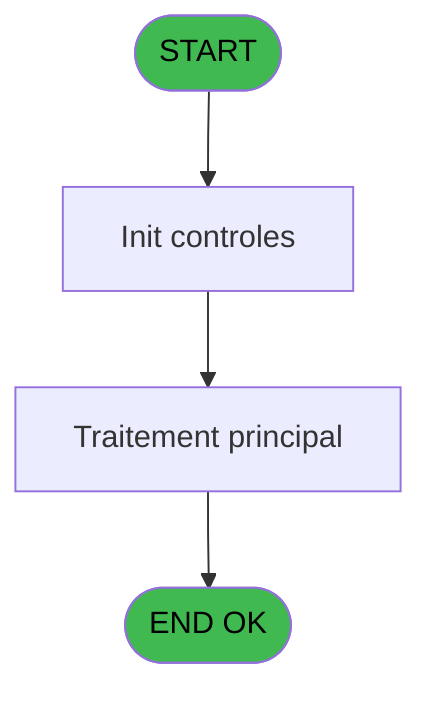

# PBP IDE 14 - Fiches d'immigration GM

> **Analyse**: Phases 1-4 2026-02-03 01:02 -> 01:02 (38s) | Assemblage 01:02
> **Pipeline**: V7.2 Enrichi
> **Structure**: 4 onglets (Resume | Ecrans | Donnees | Connexions)

<!-- TAB:Resume -->

## 1. FICHE D'IDENTITE

| Attribut | Valeur |
|----------|--------|
| Projet | PBP |
| IDE Position | 14 |
| Nom Programme | Fiches d'immigration GM |
| Fichier source | `Prg_14.xml` |
| Domaine metier | General |
| Taches | 1 (1 ecrans visibles) |
| Tables modifiees | 0 |
| Programmes appeles | 1 |
| :warning: Statut | **ORPHELIN_POTENTIEL** |

## 2. DESCRIPTION FONCTIONNELLE

**Fiches d'immigration GM** assure la gestion complete de ce processus.

Le flux de traitement s'organise en **1 blocs fonctionnels** :

- **Impression** (1 tache) : generation de tickets et documents

## 3. BLOCS FONCTIONNELS

### 3.1 Impression (1 tache)

Generation des documents et tickets.

---

#### 14 - Edition fiches d'immigrations [[ECRAN]](#ecran-t1)

**Role** : Generation du document : Edition fiches d'immigrations.
**Ecran** : 954 x 233 DLU (MDI) | [Voir mockup](#ecran-t1)
**Delegue a** : [  Edition Fiches (IDE 15)](PBP-IDE-15.md)

## 5. REGLES METIER

*(Aucune regle metier identifiee)*

## 6. CONTEXTE

- **Appele par**: (aucun)
- **Appelle**: 1 programmes | **Tables**: 1 (W:0 R:1 L:0) | **Taches**: 1 | **Expressions**: 5

<!-- TAB:Ecrans -->

## 8. ECRANS

### 8.1 Forms visibles (1 / 1)

| # | Position | Tache | Nom | Type | Largeur | Hauteur | Bloc |
|---|----------|-------|-----|------|---------|---------|------|
| 1 | 14 | 14 | Edition fiches d'immigrations | MDI | 954 | 233 | Impression |

### 8.2 Mockups Ecrans

---

#### 14 - Edition fiches d'immigrations
**Tache** : [14](#t1) | **Type** : MDI | **Dimensions** : 954 x 233 DLU
**Bloc** : Impression | **Titre IDE** : Edition fiches d'immigrations

<!-- FORM-DATA:
{
    "width":  954,
    "vFactor":  8,
    "type":  "MDI",
    "hFactor":  8,
    "controls":  [
                     {
                         "x":  1,
                         "type":  "label",
                         "var":  "",
                         "y":  1,
                         "w":  950,
                         "fmt":  "",
                         "name":  "",
                         "h":  19,
                         "color":  "1",
                         "text":  "",
                         "parent":  null
                     },
                     {
                         "x":  49,
                         "type":  "label",
                         "var":  "",
                         "y":  27,
                         "w":  348,
                         "fmt":  "",
                         "name":  "",
                         "h":  40,
                         "color":  "7",
                         "text":  "Croisière",
                         "parent":  null
                     },
                     {
                         "x":  485,
                         "type":  "label",
                         "var":  "",
                         "y":  27,
                         "w":  416,
                         "fmt":  "",
                         "name":  "",
                         "h":  40,
                         "color":  "7",
                         "text":  "Port d\u0027embarquement",
                         "parent":  null
                     },
                     {
                         "x":  129,
                         "type":  "label",
                         "var":  "",
                         "y":  45,
                         "w":  40,
                         "fmt":  "",
                         "name":  "",
                         "h":  10,
                         "color":  "103",
                         "text":  "Du",
                         "parent":  4
                     },
                     {
                         "x":  483,
                         "type":  "label",
                         "var":  "",
                         "y":  73,
                         "w":  416,
                         "fmt":  "",
                         "name":  "",
                         "h":  54,
                         "color":  "7",
                         "text":  "Adresse sur le pays",
                         "parent":  null
                     },
                     {
                         "x":  45,
                         "type":  "table",
                         "var":  "",
                         "name":  "",
                         "titleH":  12,
                         "color":  "110",
                         "w":  359,
                         "y":  74,
                         "fmt":  "",
                         "parent":  null,
                         "text":  "",
                         "rowH":  14,
                         "h":  127,
                         "cols":  [
                                      {
                                          "title":  "Nom",
                                          "layer":  1,
                                          "w":  194
                                      },
                                      {
                                          "title":  "Prénom",
                                          "layer":  2,
                                          "w":  132
                                      }
                                  ],
                         "rows":  2
                     },
                     {
                         "x":  45,
                         "type":  "label",
                         "var":  "",
                         "y":  74,
                         "w":  193,
                         "fmt":  "",
                         "name":  "",
                         "h":  12,
                         "color":  "7",
                         "text":  "Nom",
                         "parent":  null
                     },
                     {
                         "x":  238,
                         "type":  "label",
                         "var":  "",
                         "y":  74,
                         "w":  161,
                         "fmt":  "",
                         "name":  "",
                         "h":  12,
                         "color":  "7",
                         "text":  "Prenom",
                         "parent":  null
                     },
                     {
                         "x":  485,
                         "type":  "label",
                         "var":  "",
                         "y":  137,
                         "w":  416,
                         "fmt":  "",
                         "name":  "",
                         "h":  62,
                         "color":  "7",
                         "text":  "Formulaire à éditer",
                         "parent":  null
                     },
                     {
                         "x":  1,
                         "type":  "label",
                         "var":  "",
                         "y":  206,
                         "w":  947,
                         "fmt":  "",
                         "name":  "",
                         "h":  24,
                         "color":  "1",
                         "text":  "",
                         "parent":  null
                     },
                     {
                         "x":  51,
                         "type":  "edit",
                         "var":  "",
                         "y":  89,
                         "w":  182,
                         "fmt":  "",
                         "name":  "GM Nom",
                         "h":  10,
                         "color":  "110",
                         "text":  "",
                         "parent":  10
                     },
                     {
                         "x":  245,
                         "type":  "edit",
                         "var":  "",
                         "y":  89,
                         "w":  126,
                         "fmt":  "",
                         "name":  "GM Prenom",
                         "h":  10,
                         "color":  "110",
                         "text":  "",
                         "parent":  10
                     },
                     {
                         "x":  181,
                         "type":  "edit",
                         "var":  "",
                         "y":  45,
                         "w":  134,
                         "fmt":  "DD/MM/YYYY",
                         "name":  "v.date du",
                         "h":  10,
                         "color":  "6",
                         "text":  "",
                         "parent":  4
                     },
                     {
                         "x":  572,
                         "type":  "edit",
                         "var":  "",
                         "y":  45,
                         "w":  115,
                         "fmt":  "U10",
                         "name":  "v.port d\u0027embarquement",
                         "h":  10,
                         "color":  "6",
                         "text":  "",
                         "parent":  5
                     },
                     {
                         "x":  572,
                         "type":  "edit",
                         "var":  "",
                         "y":  91,
                         "w":  238,
                         "fmt":  "U20",
                         "name":  "v. adresse 1",
                         "h":  10,
                         "color":  "6",
                         "text":  "",
                         "parent":  9
                     },
                     {
                         "x":  572,
                         "type":  "edit",
                         "var":  "",
                         "y":  107,
                         "w":  238,
                         "fmt":  "U20",
                         "name":  "v. adresse 2",
                         "h":  10,
                         "color":  "6",
                         "text":  "",
                         "parent":  9
                     },
                     {
                         "x":  561,
                         "type":  "radio",
                         "var":  "",
                         "y":  151,
                         "w":  268,
                         "fmt":  "",
                         "name":  "v.fiche",
                         "h":  43,
                         "color":  "103",
                         "text":  "1    Virgin Gorda,2    I 94 ,3    I 94W",
                         "parent":  null
                     },
                     {
                         "x":  170,
                         "type":  "button",
                         "var":  "",
                         "y":  209,
                         "w":  154,
                         "fmt":  "\u0026Ok",
                         "name":  "b.ok",
                         "h":  18,
                         "color":  "",
                         "text":  "",
                         "parent":  null
                     },
                     {
                         "x":  7,
                         "type":  "edit",
                         "var":  "",
                         "y":  7,
                         "w":  267,
                         "fmt":  "30",
                         "name":  "",
                         "h":  8,
                         "color":  "",
                         "text":  "",
                         "parent":  1
                     },
                     {
                         "x":  592,
                         "type":  "edit",
                         "var":  "",
                         "y":  7,
                         "w":  317,
                         "fmt":  "WWW DD MMM YYYYT",
                         "name":  "",
                         "h":  8,
                         "color":  "",
                         "text":  "",
                         "parent":  1
                     },
                     {
                         "x":  801,
                         "type":  "image",
                         "var":  "",
                         "y":  145,
                         "w":  88,
                         "fmt":  "",
                         "name":  "",
                         "h":  33,
                         "color":  "",
                         "text":  "",
                         "parent":  null
                     },
                     {
                         "x":  9,
                         "type":  "button",
                         "var":  "",
                         "y":  209,
                         "w":  154,
                         "fmt":  "\u0026Quitter",
                         "name":  "",
                         "h":  18,
                         "color":  "",
                         "text":  "",
                         "parent":  19
                     }
                 ],
    "taskId":  "14",
    "height":  233
}
-->

<strong>Champs : 8 champs</strong>

| Pos (x,y) | Nom | Variable | Type |
|-----------|-----|----------|------|
| 51,89 | GM Nom | - | edit |
| 245,89 | GM Prenom | - | edit |
| 181,45 | v.date du | - | edit |
| 572,45 | v.port d'embarquement | - | edit |
| 572,91 | v. adresse 1 | - | edit |
| 572,107 | v. adresse 2 | - | edit |
| 7,7 | 30 | - | edit |
| 592,7 | WWW DD MMM YYYYT | - | edit |

<strong>Boutons : 2 boutons</strong>

| Bouton | Pos (x,y) | Action |
|--------|-----------|--------|
| Ok | 170,209 | Valide la saisie et enregistre |
| Quitter | 9,209 | Quitte le programme |

## 9. NAVIGATION

Ecran unique: **Edition fiches d'immigrations**

### 9.3 Structure hierarchique (1 tache)

| Position | Tache | Type | Dimensions | Bloc |
|----------|-------|------|------------|------|
| **14.1** | [**Edition fiches d'immigrations** (14)](#t1) [mockup](#ecran-t1) | MDI | 954x233 | Impression |

### 9.4 Algorigramme

> **Legende**: Vert = START/END OK | Rouge = END KO | Bleu = Decisions
> *Algorigramme auto-genere. Utiliser `/algorigramme` pour une synthese metier detaillee.*

<!-- TAB:Donnees -->

## 10. TABLES

### Tables utilisees (1)

| ID | Nom | Description | Type | R | W | L | Usages |
|----|-----|-------------|------|---|---|---|--------|
| 36 | client_gm |  | DB | R |   |   | 1 |

### Colonnes par table (1 / 1 tables avec colonnes identifiees)

Table 36 - client_gm (R) - 1 usages

| Lettre | Variable | Acces | Type |
|--------|----------|-------|------|
| A | v.date du | R | Date |
| B | v.date au | R | Date |
| C | v.port d'embarquement | R | Alpha |
| D | v. adresse 1 | R | Alpha |
| E | v. adresse 2 | R | Alpha |
| F | v.fiche | R | Alpha |
| G | b.ok | R | Alpha |
| H | b.Test | R | Alpha |

## 11. VARIABLES

### 11.1 Variables de session (6)

Variables persistantes pendant toute la session.

| Lettre | Nom | Type | Usage dans |
|--------|-----|------|-----------|
| A | v.date du | Date | - |
| B | v.date au | Date | - |
| C | v.port d'embarquement | Alpha | - |
| D | v. adresse 1 | Alpha | - |
| E | v. adresse 2 | Alpha | - |
| F | v.fiche | Alpha | - |

### 11.2 Autres (2)

Variables diverses.

| Lettre | Nom | Type | Usage dans |
|--------|-----|------|-----------|
| G | b.ok | Alpha | - |
| H | b.Test | Alpha | - |

## 12. EXPRESSIONS

**5 / 5 expressions decodees (100%)**

### 12.1 Repartition par type

| Type | Expressions | Regles |
|------|-------------|--------|
| CONSTANTE | 1 | 0 |
| DATE | 1 | 0 |
| REFERENCE_VG | 1 | 0 |
| CAST_LOGIQUE | 1 | 0 |
| CONDITION | 1 | 0 |

### 12.2 Expressions cles par type

#### CONSTANTE (1 expressions)

| Type | IDE | Expression | Regle |
|------|-----|------------|-------|
| CONSTANTE | 3 | `'CLUB MED 2'` | - |

#### DATE (1 expressions)

| Type | IDE | Expression | Regle |
|------|-----|------------|-------|
| DATE | 1 | `Date ()` | - |

#### REFERENCE_VG (1 expressions)

| Type | IDE | Expression | Regle |
|------|-----|------------|-------|
| REFERENCE_VG | 2 | `VG1` | - |

#### CAST_LOGIQUE (1 expressions)

| Type | IDE | Expression | Regle |
|------|-----|------------|-------|
| CAST_LOGIQUE | 4 | `'FALSE'LOG` | - |

#### CONDITION (1 expressions)

| Type | IDE | Expression | Regle |
|------|-----|------------|-------|
| CONDITION | 5 | `[J]<>''` | - |

<!-- TAB:Connexions -->

## 13. GRAPHE D'APPELS

### 13.1 Chaine depuis Main (Callers)

**Chemin**: (pas de callers directs)

### 13.2 Callers

| IDE | Nom Programme | Nb Appels |
|-----|---------------|-----------|
| - | (aucun) | - |

### 13.3 Callees (programmes appeles)

### 13.4 Detail Callees avec contexte

| IDE | Nom Programme | Appels | Contexte |
|-----|---------------|--------|----------|
| [15](PBP-IDE-15.md) |   Edition Fiches | 1 | Impression ticket/document |

## 14. RECOMMANDATIONS MIGRATION

### 14.1 Profil du programme

| Metrique | Valeur | Impact migration |
|----------|--------|-----------------|
| Lignes de logique | 22 | Programme compact |
| Expressions | 5 | Peu de logique |
| Tables WRITE | 0 | Impact faible |
| Sous-programmes | 1 | Peu de dependances |
| Ecrans visibles | 1 | Ecran unique ou traitement batch |
| Code desactive | 0% (0 / 22) | Code sain |
| Regles metier | 0 | Pas de regle identifiee |

### 14.2 Plan de migration par bloc

#### Impression (1 tache: 1 ecran, 0 traitement)

- **Strategie** : Templates HTML -> PDF via wkhtmltopdf ou Puppeteer.
- `PrintService` injectable avec choix imprimante

### 14.3 Dependances critiques

| Dependance | Type | Appels | Impact |
|------------|------|--------|--------|
| [  Edition Fiches (IDE 15)](PBP-IDE-15.md) | Sous-programme | 1x | Normale - Impression ticket/document |

---
*Spec DETAILED generee par Pipeline V7.2 - 2026-02-03 01:02*
