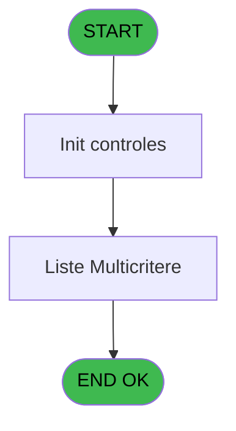
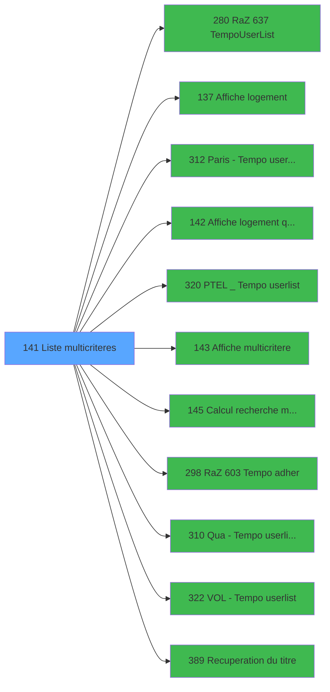

# PBP IDE 141 - Liste multicriteres

> **Analyse**: Phases 1-4 2026-02-03 15:29 -> 15:29 (15s) | Assemblage 15:29
> **Pipeline**: V7.2 Enrichi
> **Structure**: 4 onglets (Resume | Ecrans | Donnees | Connexions)

<!-- TAB:Resume -->

## 1. FICHE D'IDENTITE

| Attribut | Valeur |
|----------|--------|
| Projet | PBP |
| IDE Position | 141 |
| Nom Programme | Liste multicriteres |
| Fichier source | `Prg_141.xml` |
| Dossier IDE | Gestion |
| Taches | 3 (1 ecrans visibles) |
| Tables modifiees | 0 |
| Programmes appeles | 11 |
| :warning: Statut | **ORPHELIN_POTENTIEL** |

## 2. DESCRIPTION FONCTIONNELLE

**Liste multicriteres** assure la gestion complete de ce processus.

Le flux de traitement s'organise en **2 blocs fonctionnels** :

- **Traitement** (2 taches) : traitements metier divers
- **Consultation** (1 tache) : ecrans de recherche, selection et consultation

Detail : phases du traitement

#### Phase 1 : Traitement (2 taches)

- **141** - Liste multicriteres **[[ECRAN]](#ecran-t1)**
- **141.1** - Liste Multicritere **[[ECRAN]](#ecran-t2)**

Delegue a : [Paris -> Tempo userlist (IDE 312)](PBP-IDE-312.md), [PTEL _> Tempo userlist (IDE 320)](PBP-IDE-320.md), [Qua -> Tempo userlist 3 (IDE 310)](PBP-IDE-310.md), [VOL -> Tempo userlist (IDE 322)](PBP-IDE-322.md), [Recuperation du titre (IDE 389)](PBP-IDE-389.md)

#### Phase 2 : Consultation (1 tache)

- **141.1.1** - Exist select

Delegue a : [  Affiche logement (IDE 137)](PBP-IDE-137.md), [  Affiche logement (qualite) (IDE 142)](PBP-IDE-142.md), [  Affiche multicritere (IDE 143)](PBP-IDE-143.md), [Recuperation du titre (IDE 389)](PBP-IDE-389.md)

## 3. BLOCS FONCTIONNELS

### 3.1 Traitement (2 taches)

Traitements internes.

---

#### 141 - Liste multicriteres [[ECRAN]](#ecran-t1)

**Role** : Traitement : Liste multicriteres.
**Ecran** : 792 x 184 DLU (MDI) | [Voir mockup](#ecran-t1)
**Delegue a** : [Paris -> Tempo userlist (IDE 312)](PBP-IDE-312.md), [PTEL _> Tempo userlist (IDE 320)](PBP-IDE-320.md), [Qua -> Tempo userlist 3 (IDE 310)](PBP-IDE-310.md)

---

#### 141.1 - Liste Multicritere [[ECRAN]](#ecran-t2)

**Role** : Traitement : Liste Multicritere.
**Ecran** : 794 x 234 DLU (MDI) | [Voir mockup](#ecran-t2)
**Delegue a** : [Paris -> Tempo userlist (IDE 312)](PBP-IDE-312.md), [PTEL _> Tempo userlist (IDE 320)](PBP-IDE-320.md), [Qua -> Tempo userlist 3 (IDE 310)](PBP-IDE-310.md)

### 3.2 Consultation (1 tache)

Ecrans de recherche et consultation.

---

#### 141.1.1 - Exist select

**Role** : Traitement : Exist select.
**Variables liees** : J (w0_NbSelect), BQ (w0_ExistSelect)
**Delegue a** : [  Affiche logement (IDE 137)](PBP-IDE-137.md), [  Affiche logement (qualite) (IDE 142)](PBP-IDE-142.md), [  Affiche multicritere (IDE 143)](PBP-IDE-143.md)

## 5. REGLES METIER

*(Aucune regle metier identifiee)*

## 6. CONTEXTE

- **Appele par**: (aucun)
- **Appelle**: 11 programmes | **Tables**: 1 (W:0 R:1 L:0) | **Taches**: 3 | **Expressions**: 1

<!-- TAB:Ecrans -->

## 8. ECRANS

### 8.1 Forms visibles (1 / 3)

| # | Position | Tache | Nom | Type | Largeur | Hauteur | Bloc |
|---|----------|-------|-----|------|---------|---------|------|
| 1 | 141.1 | 141.1 | Liste Multicritere | MDI | 794 | 234 | Traitement |

### 8.2 Mockups Ecrans

---

#### 141.1 - Liste Multicritere
**Tache** : [141.1](#t2) | **Type** : MDI | **Dimensions** : 794 x 234 DLU
**Bloc** : Traitement | **Titre IDE** : Liste Multicritere

<!-- FORM-DATA:
{
    "width":  794,
    "vFactor":  8,
    "type":  "MDI",
    "hFactor":  8,
    "controls":  [
                     {
                         "x":  0,
                         "type":  "label",
                         "var":  "",
                         "y":  1,
                         "w":  791,
                         "fmt":  "",
                         "name":  "",
                         "h":  19,
                         "color":  "1",
                         "text":  "",
                         "parent":  null
                     },
                     {
                         "x":  30,
                         "type":  "label",
                         "var":  "",
                         "y":  25,
                         "w":  309,
                         "fmt":  "",
                         "name":  "",
                         "h":  130,
                         "color":  "",
                         "text":  "",
                         "parent":  null
                     },
                     {
                         "x":  345,
                         "type":  "label",
                         "var":  "",
                         "y":  25,
                         "w":  417,
                         "fmt":  "",
                         "name":  "",
                         "h":  89,
                         "color":  "",
                         "text":  "",
                         "parent":  null
                     },
                     {
                         "x":  358,
                         "type":  "label",
                         "var":  "",
                         "y":  29,
                         "w":  195,
                         "fmt":  "",
                         "name":  "",
                         "h":  18,
                         "color":  "153",
                         "text":  "",
                         "parent":  6
                     },
                     {
                         "x":  558,
                         "type":  "label",
                         "var":  "",
                         "y":  29,
                         "w":  195,
                         "fmt":  "",
                         "name":  "",
                         "h":  18,
                         "color":  "153",
                         "text":  "",
                         "parent":  6
                     },
                     {
                         "x":  39,
                         "type":  "label",
                         "var":  "",
                         "y":  33,
                         "w":  46,
                         "fmt":  "",
                         "name":  "",
                         "h":  10,
                         "color":  "142",
                         "text":  "Total",
                         "parent":  5
                     },
                     {
                         "x":  157,
                         "type":  "label",
                         "var":  "",
                         "y":  33,
                         "w":  98,
                         "fmt":  "",
                         "name":  "",
                         "h":  10,
                         "color":  "142",
                         "text":  "Selectionnés",
                         "parent":  5
                     },
                     {
                         "x":  33,
                         "type":  "line",
                         "var":  "",
                         "y":  48,
                         "w":  302,
                         "fmt":  "",
                         "name":  "",
                         "h":  0,
                         "color":  "",
                         "text":  "",
                         "parent":  5
                     },
                     {
                         "x":  358,
                         "type":  "label",
                         "var":  "",
                         "y":  50,
                         "w":  195,
                         "fmt":  "",
                         "name":  "",
                         "h":  18,
                         "color":  "153",
                         "text":  "",
                         "parent":  6
                     },
                     {
                         "x":  558,
                         "type":  "label",
                         "var":  "",
                         "y":  50,
                         "w":  195,
                         "fmt":  "",
                         "name":  "",
                         "h":  18,
                         "color":  "153",
                         "text":  "",
                         "parent":  6
                     },
                     {
                         "x":  49,
                         "type":  "label",
                         "var":  "",
                         "y":  52,
                         "w":  61,
                         "fmt":  "",
                         "name":  "",
                         "h":  8,
                         "color":  "",
                         "text":  "Statuts",
                         "parent":  5
                     },
                     {
                         "x":  33,
                         "type":  "line",
                         "var":  "",
                         "y":  63,
                         "w":  302,
                         "fmt":  "",
                         "name":  "",
                         "h":  0,
                         "color":  "",
                         "text":  "",
                         "parent":  null
                     },
                     {
                         "x":  49,
                         "type":  "label",
                         "var":  "",
                         "y":  66,
                         "w":  104,
                         "fmt":  "",
                         "name":  "",
                         "h":  8,
                         "color":  "",
                         "text":  "Qualité",
                         "parent":  5
                     },
                     {
                         "x":  358,
                         "type":  "label",
                         "var":  "",
                         "y":  72,
                         "w":  195,
                         "fmt":  "",
                         "name":  "",
                         "h":  18,
                         "color":  "153",
                         "text":  "",
                         "parent":  6
                     },
                     {
                         "x":  558,
                         "type":  "label",
                         "var":  "",
                         "y":  72,
                         "w":  195,
                         "fmt":  "",
                         "name":  "",
                         "h":  18,
                         "color":  "153",
                         "text":  "",
                         "parent":  6
                     },
                     {
                         "x":  33,
                         "type":  "line",
                         "var":  "",
                         "y":  76,
                         "w":  302,
                         "fmt":  "",
                         "name":  "",
                         "h":  0,
                         "color":  "",
                         "text":  "",
                         "parent":  null
                     },
                     {
                         "x":  49,
                         "type":  "label",
                         "var":  "",
                         "y":  79,
                         "w":  107,
                         "fmt":  "",
                         "name":  "",
                         "h":  8,
                         "color":  "",
                         "text":  "Remplissage",
                         "parent":  5
                     },
                     {
                         "x":  33,
                         "type":  "line",
                         "var":  "",
                         "y":  89,
                         "w":  302,
                         "fmt":  "",
                         "name":  "",
                         "h":  0,
                         "color":  "",
                         "text":  "",
                         "parent":  null
                     },
                     {
                         "x":  49,
                         "type":  "label",
                         "var":  "",
                         "y":  92,
                         "w":  107,
                         "fmt":  "",
                         "name":  "",
                         "h":  8,
                         "color":  "",
                         "text":  "Nationalité",
                         "parent":  5
                     },
                     {
                         "x":  358,
                         "type":  "label",
                         "var":  "",
                         "y":  93,
                         "w":  195,
                         "fmt":  "",
                         "name":  "",
                         "h":  18,
                         "color":  "153",
                         "text":  "",
                         "parent":  6
                     },
                     {
                         "x":  558,
                         "type":  "label",
                         "var":  "",
                         "y":  93,
                         "w":  195,
                         "fmt":  "",
                         "name":  "",
                         "h":  18,
                         "color":  "153",
                         "text":  "",
                         "parent":  6
                     },
                     {
                         "x":  33,
                         "type":  "line",
                         "var":  "",
                         "y":  102,
                         "w":  302,
                         "fmt":  "",
                         "name":  "",
                         "h":  0,
                         "color":  "",
                         "text":  "",
                         "parent":  null
                     },
                     {
                         "x":  49,
                         "type":  "label",
                         "var":  "",
                         "y":  105,
                         "w":  85,
                         "fmt":  "",
                         "name":  "",
                         "h":  8,
                         "color":  "",
                         "text":  "Inscription",
                         "parent":  5
                     },
                     {
                         "x":  33,
                         "type":  "line",
                         "var":  "",
                         "y":  115,
                         "w":  302,
                         "fmt":  "",
                         "name":  "",
                         "h":  0,
                         "color":  "",
                         "text":  "",
                         "parent":  null
                     },
                     {
                         "x":  345,
                         "type":  "label",
                         "var":  "",
                         "y":  115,
                         "w":  417,
                         "fmt":  "",
                         "name":  "",
                         "h":  40,
                         "color":  "",
                         "text":  "",
                         "parent":  null
                     },
                     {
                         "x":  49,
                         "type":  "label",
                         "var":  "",
                         "y":  118,
                         "w":  85,
                         "fmt":  "",
                         "name":  "",
                         "h":  8,
                         "color":  "",
                         "text":  "Age/Sexe",
                         "parent":  5
                     },
                     {
                         "x":  354,
                         "type":  "label",
                         "var":  "",
                         "y":  122,
                         "w":  136,
                         "fmt":  "",
                         "name":  "",
                         "h":  10,
                         "color":  "",
                         "text":  "Date début",
                         "parent":  30
                     },
                     {
                         "x":  731,
                         "type":  "label",
                         "var":  "",
                         "y":  123,
                         "w":  21,
                         "fmt":  "",
                         "name":  "",
                         "h":  9,
                         "color":  "",
                         "text":  "H",
                         "parent":  30
                     },
                     {
                         "x":  33,
                         "type":  "line",
                         "var":  "",
                         "y":  128,
                         "w":  302,
                         "fmt":  "",
                         "name":  "",
                         "h":  0,
                         "color":  "",
                         "text":  "",
                         "parent":  null
                     },
                     {
                         "x":  49,
                         "type":  "label",
                         "var":  "",
                         "y":  131,
                         "w":  62,
                         "fmt":  "",
                         "name":  "",
                         "h":  8,
                         "color":  "",
                         "text":  "VIP",
                         "parent":  5
                     },
                     {
                         "x":  354,
                         "type":  "label",
                         "var":  "",
                         "y":  140,
                         "w":  107,
                         "fmt":  "",
                         "name":  "",
                         "h":  10,
                         "color":  "",
                         "text":  "Date fin",
                         "parent":  30
                     },
                     {
                         "x":  731,
                         "type":  "label",
                         "var":  "",
                         "y":  140,
                         "w":  21,
                         "fmt":  "",
                         "name":  "",
                         "h":  9,
                         "color":  "",
                         "text":  "H",
                         "parent":  30
                     },
                     {
                         "x":  33,
                         "type":  "line",
                         "var":  "",
                         "y":  141,
                         "w":  302,
                         "fmt":  "",
                         "name":  "",
                         "h":  0,
                         "color":  "",
                         "text":  "",
                         "parent":  null
                     },
                     {
                         "x":  49,
                         "type":  "label",
                         "var":  "",
                         "y":  144,
                         "w":  159,
                         "fmt":  "",
                         "name":  "",
                         "h":  8,
                         "color":  "",
                         "text":  "Code Vol",
                         "parent":  5
                     },
                     {
                         "x":  30,
                         "type":  "label",
                         "var":  "",
                         "y":  158,
                         "w":  732,
                         "fmt":  "",
                         "name":  "",
                         "h":  40,
                         "color":  "",
                         "text":  "",
                         "parent":  null
                     },
                     {
                         "x":  49,
                         "type":  "label",
                         "var":  "",
                         "y":  163,
                         "w":  154,
                         "fmt":  "",
                         "name":  "",
                         "h":  8,
                         "color":  "",
                         "text":  "Selection sur",
                         "parent":  44
                     },
                     {
                         "x":  49,
                         "type":  "label",
                         "var":  "",
                         "y":  173,
                         "w":  400,
                         "fmt":  "",
                         "name":  "",
                         "h":  21,
                         "color":  "",
                         "text":  "(Selection des GM de type Millesia et de type Honey Moon)",
                         "parent":  44
                     },
                     {
                         "x":  49,
                         "type":  "label",
                         "var":  "",
                         "y":  173,
                         "w":  400,
                         "fmt":  "",
                         "name":  "",
                         "h":  21,
                         "color":  "",
                         "text":  "(Permet de selectionner que les GM de type Millesia et Honey Moon ou que Millesia ou que Honey Moon)",
                         "parent":  44
                     },
                     {
                         "x":  49,
                         "type":  "label",
                         "var":  "",
                         "y":  173,
                         "w":  400,
                         "fmt":  "",
                         "name":  "",
                         "h":  21,
                         "color":  "",
                         "text":  "(Selection des GM de type Millesia)",
                         "parent":  44
                     },
                     {
                         "x":  49,
                         "type":  "label",
                         "var":  "",
                         "y":  173,
                         "w":  400,
                         "fmt":  "",
                         "name":  "",
                         "h":  21,
                         "color":  "",
                         "text":  "(Selection des GM de type Honey Moon)",
                         "parent":  44
                     },
                     {
                         "x":  0,
                         "type":  "label",
                         "var":  "",
                         "y":  208,
                         "w":  791,
                         "fmt":  "",
                         "name":  "",
                         "h":  24,
                         "color":  "1",
                         "text":  "",
                         "parent":  null
                     },
                     {
                         "x":  89,
                         "type":  "edit",
                         "var":  "",
                         "y":  33,
                         "w":  53,
                         "fmt":  "",
                         "name":  "",
                         "h":  10,
                         "color":  "",
                         "text":  "",
                         "parent":  5
                     },
                     {
                         "x":  264,
                         "type":  "edit",
                         "var":  "",
                         "y":  34,
                         "w":  53,
                         "fmt":  "",
                         "name":  "",
                         "h":  10,
                         "color":  "",
                         "text":  "",
                         "parent":  5
                     },
                     {
                         "x":  494,
                         "type":  "edit",
                         "var":  "",
                         "y":  122,
                         "w":  126,
                         "fmt":  "DD/MM/YYYY",
                         "name":  "w0_DateMin",
                         "h":  10,
                         "color":  "110",
                         "text":  "",
                         "parent":  30
                     },
                     {
                         "x":  629,
                         "type":  "button",
                         "var":  "",
                         "y":  122,
                         "w":  38,
                         "fmt":  "",
                         "name":  "b_ZoomDateMin",
                         "h":  10,
                         "color":  "",
                         "text":  "",
                         "parent":  30
                     },
                     {
                         "x":  685,
                         "type":  "edit",
                         "var":  "",
                         "y":  122,
                         "w":  37,
                         "fmt":  "",
                         "name":  "w0_HeureMin",
                         "h":  10,
                         "color":  "110",
                         "text":  "",
                         "parent":  30
                     },
                     {
                         "x":  494,
                         "type":  "edit",
                         "var":  "",
                         "y":  140,
                         "w":  126,
                         "fmt":  "DD/MM/YYYY",
                         "name":  "w0_DateMax",
                         "h":  10,
                         "color":  "110",
                         "text":  "",
                         "parent":  30
                     },
                     {
                         "x":  629,
                         "type":  "button",
                         "var":  "",
                         "y":  140,
                         "w":  38,
                         "fmt":  "",
                         "name":  "b_ZoomDateMax",
                         "h":  10,
                         "color":  "",
                         "text":  "",
                         "parent":  30
                     },
                     {
                         "x":  685,
                         "type":  "edit",
                         "var":  "",
                         "y":  140,
                         "w":  37,
                         "fmt":  "",
                         "name":  "w0_HeureMax",
                         "h":  10,
                         "color":  "110",
                         "text":  "",
                         "parent":  30
                     },
                     {
                         "x":  277,
                         "type":  "button",
                         "var":  "",
                         "y":  52,
                         "w":  46,
                         "fmt":  "",
                         "name":  "b_StatutRaZ",
                         "h":  10,
                         "color":  "",
                         "text":  "",
                         "parent":  5
                     },
                     {
                         "x":  277,
                         "type":  "button",
                         "var":  "",
                         "y":  78,
                         "w":  46,
                         "fmt":  "",
                         "name":  "b_RemplissRaZ",
                         "h":  10,
                         "color":  "",
                         "text":  "",
                         "parent":  5
                     },
                     {
                         "x":  277,
                         "type":  "button",
                         "var":  "",
                         "y":  65,
                         "w":  46,
                         "fmt":  "",
                         "name":  "b_QualiteRaZ",
                         "h":  10,
                         "color":  "",
                         "text":  "",
                         "parent":  5
                     },
                     {
                         "x":  277,
                         "type":  "button",
                         "var":  "",
                         "y":  91,
                         "w":  46,
                         "fmt":  "",
                         "name":  "b_NationRaZ",
                         "h":  10,
                         "color":  "",
                         "text":  "",
                         "parent":  5
                     },
                     {
                         "x":  277,
                         "type":  "button",
                         "var":  "",
                         "y":  104,
                         "w":  46,
                         "fmt":  "",
                         "name":  "b_InscripRaZ",
                         "h":  10,
                         "color":  "",
                         "text":  "",
                         "parent":  5
                     },
                     {
                         "x":  277,
                         "type":  "button",
                         "var":  "",
                         "y":  117,
                         "w":  46,
                         "fmt":  "",
                         "name":  "b_AgeSexRaZ",
                         "h":  10,
                         "color":  "",
                         "text":  "",
                         "parent":  5
                     },
                     {
                         "x":  277,
                         "type":  "button",
                         "var":  "",
                         "y":  130,
                         "w":  46,
                         "fmt":  "",
                         "name":  "b_MilesiaRaZ",
                         "h":  10,
                         "color":  "",
                         "text":  "",
                         "parent":  5
                     },
                     {
                         "x":  277,
                         "type":  "button",
                         "var":  "",
                         "y":  143,
                         "w":  46,
                         "fmt":  "",
                         "name":  "b_CodVolRaZ",
                         "h":  10,
                         "color":  "",
                         "text":  "",
                         "parent":  5
                     },
                     {
                         "x":  362,
                         "type":  "button",
                         "var":  "",
                         "y":  31,
                         "w":  187,
                         "fmt":  "\u0026Statut",
                         "name":  "b_Statut",
                         "h":  14,
                         "color":  "",
                         "text":  "",
                         "parent":  6
                     },
                     {
                         "x":  362,
                         "type":  "button",
                         "var":  "",
                         "y":  52,
                         "w":  187,
                         "fmt":  "R\u0026emplissage",
                         "name":  "b_Rempliss",
                         "h":  14,
                         "color":  "",
                         "text":  "",
                         "parent":  6
                     },
                     {
                         "x":  562,
                         "type":  "button",
                         "var":  "",
                         "y":  31,
                         "w":  187,
                         "fmt":  "Q\u0026ualité",
                         "name":  "b_Qualite",
                         "h":  14,
                         "color":  "",
                         "text":  "",
                         "parent":  6
                     },
                     {
                         "x":  562,
                         "type":  "button",
                         "var":  "",
                         "y":  52,
                         "w":  187,
                         "fmt":  "\u0026Nationalité",
                         "name":  "b_Nation",
                         "h":  14,
                         "color":  "",
                         "text":  "",
                         "parent":  6
                     },
                     {
                         "x":  362,
                         "type":  "button",
                         "var":  "",
                         "y":  74,
                         "w":  187,
                         "fmt":  "\u0026Inscription",
                         "name":  "b_Inscription",
                         "h":  14,
                         "color":  "",
                         "text":  "",
                         "parent":  6
                     },
                     {
                         "x":  562,
                         "type":  "button",
                         "var":  "",
                         "y":  74,
                         "w":  187,
                         "fmt":  "\u0026\\Age/Sexe",
                         "name":  "b_AgeSex",
                         "h":  14,
                         "color":  "",
                         "text":  "",
                         "parent":  6
                     },
                     {
                         "x":  362,
                         "type":  "button",
                         "var":  "",
                         "y":  95,
                         "w":  187,
                         "fmt":  "\u0026Vip",
                         "name":  "b_Millesia",
                         "h":  14,
                         "color":  "",
                         "text":  "",
                         "parent":  6
                     },
                     {
                         "x":  562,
                         "type":  "button",
                         "var":  "",
                         "y":  95,
                         "w":  187,
                         "fmt":  "\u0026Code Vol",
                         "name":  "b_CodVol",
                         "h":  14,
                         "color":  "",
                         "text":  "",
                         "parent":  6
                     },
                     {
                         "x":  536,
                         "type":  "checkbox",
                         "var":  "",
                         "y":  165,
                         "w":  123,
                         "fmt":  "",
                         "name":  "w0_millesia",
                         "h":  12,
                         "color":  "",
                         "text":  "Milesia",
                         "parent":  null
                     },
                     {
                         "x":  536,
                         "type":  "checkbox",
                         "var":  "",
                         "y":  179,
                         "w":  181,
                         "fmt":  "",
                         "name":  "w0_Honey moon",
                         "h":  12,
                         "color":  "",
                         "text":  "Honey Moon",
                         "parent":  null
                     },
                     {
                         "x":  444,
                         "type":  "button",
                         "var":  "",
                         "y":  211,
                         "w":  154,
                         "fmt":  "Remise à \u0026Zéro",
                         "name":  "b_RAZ Global",
                         "h":  18,
                         "color":  "",
                         "text":  "",
                         "parent":  50
                     },
                     {
                         "x":  12,
                         "type":  "button",
                         "var":  "",
                         "y":  211,
                         "w":  154,
                         "fmt":  "\u0026Quitter",
                         "name":  "b_Quitter",
                         "h":  18,
                         "color":  "",
                         "text":  "",
                         "parent":  50
                     },
                     {
                         "x":  627,
                         "type":  "button",
                         "var":  "",
                         "y":  211,
                         "w":  154,
                         "fmt":  "\u0026Recherche",
                         "name":  "b_Recherche",
                         "h":  18,
                         "color":  "",
                         "text":  "",
                         "parent":  50
                     },
                     {
                         "x":  5,
                         "type":  "edit",
                         "var":  "",
                         "y":  3,
                         "w":  267,
                         "fmt":  "20",
                         "name":  "",
                         "h":  8,
                         "color":  "",
                         "text":  "",
                         "parent":  1
                     },
                     {
                         "x":  578,
                         "type":  "edit",
                         "var":  "",
                         "y":  7,
                         "w":  203,
                         "fmt":  "WWW DD MMM YYYYT",
                         "name":  "",
                         "h":  7,
                         "color":  "",
                         "text":  "",
                         "parent":  1
                     },
                     {
                         "x":  5,
                         "type":  "edit",
                         "var":  "",
                         "y":  11,
                         "w":  331,
                         "fmt":  "25",
                         "name":  "",
                         "h":  8,
                         "color":  "",
                         "text":  "",
                         "parent":  null
                     }
                 ],
    "taskId":  "141.1",
    "height":  234
}
-->

<strong>Champs : 11 champs</strong>

| Pos (x,y) | Nom | Variable | Type |
|-----------|-----|----------|------|
| 89,33 | (sans nom) | - | edit |
| 264,34 | (sans nom) | - | edit |
| 494,122 | w0_DateMin | - | edit |
| 685,122 | w0_HeureMin | - | edit |
| 494,140 | w0_DateMax | - | edit |
| 685,140 | w0_HeureMax | - | edit |
| 536,165 | w0_millesia | - | checkbox |
| 536,179 | w0_Honey moon | - | checkbox |
| 5,3 | 20 | - | edit |
| 578,7 | WWW DD MMM YYYYT | - | edit |
| 5,11 | 25 | - | edit |

<strong>Boutons : 21 boutons</strong>

| Bouton | Pos (x,y) | Action |
|--------|-----------|--------|
| b_ZoomDateMin | 629,122 | Ouvre la selection |
| b_ZoomDateMax | 629,140 | Ouvre la selection |
| b_StatutRaZ | 277,52 | Bouton fonctionnel |
| b_RemplissRaZ | 277,78 | Bouton fonctionnel |
| b_QualiteRaZ | 277,65 | Bouton fonctionnel |
| b_NationRaZ | 277,91 | Bouton fonctionnel |
| b_InscripRaZ | 277,104 | Bouton fonctionnel |
| b_AgeSexRaZ | 277,117 | Bouton fonctionnel |
| b_MilesiaRaZ | 277,130 | Bouton fonctionnel |
| b_CodVolRaZ | 277,143 | Bouton fonctionnel |
| Statut | 362,31 | Bouton fonctionnel |
| Remplissage | 362,52 | Bouton fonctionnel |
| Qualité | 562,31 | Appel [  Affiche logement (qualite) (IDE 142)](PBP-IDE-142.md) |
| Nationalité | 562,52 | Bouton fonctionnel |
| Inscription | 362,74 | Bouton fonctionnel |
| \Age/Sexe | 562,74 | Bouton fonctionnel |
| Vip | 362,95 | Bouton fonctionnel |
| Code Vol | 562,95 | Bouton fonctionnel |
| Remise à Zéro | 444,211 | Lance le calcul |
| Quitter | 12,211 | Quitte le programme |
| Recherche | 627,211 | Appel [  Calcul recherche multicrite (IDE 145)](PBP-IDE-145.md) |

## 9. NAVIGATION

Ecran unique: **Liste Multicritere**

### 9.3 Structure hierarchique (3 taches)

| Position | Tache | Type | Dimensions | Bloc |
|----------|-------|------|------------|------|
| **141.1** | [**Liste multicriteres** (141)](#t1) [mockup](#ecran-t1) | MDI | 792x184 | Traitement |
| 141.1.1 | [Liste Multicritere (141.1)](#t2) [mockup](#ecran-t2) | MDI | 794x234 | |
| **141.2** | [**Exist select** (141.1.1)](#t3) | MDI | - | Consultation |

### 9.4 Algorigramme

> **Legende**: Vert = START/END OK | Rouge = END KO | Bleu = Decisions
> *Algorigramme auto-genere. Utiliser `/algorigramme` pour une synthese metier detaillee.*

<!-- TAB:Donnees -->

## 10. TABLES

### Tables utilisees (1)

| ID | Nom | Description | Type | R | W | L | Usages |
|----|-----|-------------|------|---|---|---|--------|
| 637 | tempo_zone_secteur | Table temporaire ecran | DB | R |   |   | 1 |

### Colonnes par table (1 / 1 tables avec colonnes identifiees)

Table 637 - tempo_zone_secteur (R) - 1 usages

| Lettre | Variable | Acces | Type |
|--------|----------|-------|------|
| A | >Categorie | R | Alpha |
| B | >NomTable | R | Alpha |
| C | <CodeRetour | R | Logical |
| D | w1_TousVrai | R | Logical |

## 11. VARIABLES

### 11.1 Variables de session (1)

Variables persistantes pendant toute la session.

| Lettre | Nom | Type | Usage dans |
|--------|-----|------|-----------|
| A | v.Fin | Logical | 1x session |

### 11.2 Autres (45)

Variables diverses.

| Lettre | Nom | Type | Usage dans |
|--------|-----|------|-----------|
| B | w0_NomTable | Alpha | - |
| C | w0_Numerique | Numeric | - |
| D | w0_CodeMenage | Alpha | - |
| E | w0_CodeTri | Alpha | - |
| F | w0_NbLogMini | Numeric | - |
| G | w0_TitreEcran | Alpha | - |
| H | w0_CodeEcranFille | Numeric | - |
| I | w0_Total | Numeric | - |
| J | w0_NbSelect | Numeric | - |
| K | w0_DateMin | Date | - |
| L | b_ZoomDateMin | Alpha | - |
| M | w0_HeureMin | Alpha | - |
| N | w0_DateMax | Date | - |
| O | b_ZoomDateMax | Alpha | - |
| P | w0_HeureMax | Alpha | - |
| Q | b_StatutRaZ | Alpha | - |
| R | b_RemplissRaZ | Alpha | - |
| S | b_QualiteRaZ | Alpha | - |
| T | b_NationRaZ | Alpha | - |
| U | b_InscripRaZ | Alpha | - |
| V | b_AgeSexRaZ | Alpha | - |
| W | b_MilesiaRaZ | Alpha | - |
| X | b_CodVolRaZ | Alpha | - |
| Y | b_Statut | Alpha | - |
| Z | b_Rempliss | Alpha | - |
| BA | b_Qualite | Alpha | - |
| BB | b_Nation | Alpha | - |
| BC | b_Inscription | Alpha | - |
| BD | b_AgeSex | Alpha | - |
| BE | b_Millesia | Alpha | - |
| BF | b_CodVol | Alpha | - |
| BG | w0_millesia | Logical | - |
| BH | w0_Honey moon | Logical | - |
| BI | RetourStatut | Logical | - |
| BJ | RetourRempliss | Logical | - |
| BK | RetourQualite | Logical | - |
| BL | RetourNation | Logical | - |
| BM | RetourInscrip | Logical | - |
| BN | RetourAgeSex | Logical | - |
| BO | RetourMillesia | Logical | - |
| BP | RetourCodVol | Logical | - |
| BQ | w0_ExistSelect | Logical | - |
| BR | b_RAZ Global | Alpha | - |
| BS | b_Quitter | Alpha | - |
| BT | b_Recherche | Alpha | - |

Toutes les 46 variables (liste complete)

| Cat | Lettre | Nom Variable | Type |
|-----|--------|--------------|------|
| V. | **A** | v.Fin | Logical |
| Autre | **B** | w0_NomTable | Alpha |
| Autre | **C** | w0_Numerique | Numeric |
| Autre | **D** | w0_CodeMenage | Alpha |
| Autre | **E** | w0_CodeTri | Alpha |
| Autre | **F** | w0_NbLogMini | Numeric |
| Autre | **G** | w0_TitreEcran | Alpha |
| Autre | **H** | w0_CodeEcranFille | Numeric |
| Autre | **I** | w0_Total | Numeric |
| Autre | **J** | w0_NbSelect | Numeric |
| Autre | **K** | w0_DateMin | Date |
| Autre | **L** | b_ZoomDateMin | Alpha |
| Autre | **M** | w0_HeureMin | Alpha |
| Autre | **N** | w0_DateMax | Date |
| Autre | **O** | b_ZoomDateMax | Alpha |
| Autre | **P** | w0_HeureMax | Alpha |
| Autre | **Q** | b_StatutRaZ | Alpha |
| Autre | **R** | b_RemplissRaZ | Alpha |
| Autre | **S** | b_QualiteRaZ | Alpha |
| Autre | **T** | b_NationRaZ | Alpha |
| Autre | **U** | b_InscripRaZ | Alpha |
| Autre | **V** | b_AgeSexRaZ | Alpha |
| Autre | **W** | b_MilesiaRaZ | Alpha |
| Autre | **X** | b_CodVolRaZ | Alpha |
| Autre | **Y** | b_Statut | Alpha |
| Autre | **Z** | b_Rempliss | Alpha |
| Autre | **BA** | b_Qualite | Alpha |
| Autre | **BB** | b_Nation | Alpha |
| Autre | **BC** | b_Inscription | Alpha |
| Autre | **BD** | b_AgeSex | Alpha |
| Autre | **BE** | b_Millesia | Alpha |
| Autre | **BF** | b_CodVol | Alpha |
| Autre | **BG** | w0_millesia | Logical |
| Autre | **BH** | w0_Honey moon | Logical |
| Autre | **BI** | RetourStatut | Logical |
| Autre | **BJ** | RetourRempliss | Logical |
| Autre | **BK** | RetourQualite | Logical |
| Autre | **BL** | RetourNation | Logical |
| Autre | **BM** | RetourInscrip | Logical |
| Autre | **BN** | RetourAgeSex | Logical |
| Autre | **BO** | RetourMillesia | Logical |
| Autre | **BP** | RetourCodVol | Logical |
| Autre | **BQ** | w0_ExistSelect | Logical |
| Autre | **BR** | b_RAZ Global | Alpha |
| Autre | **BS** | b_Quitter | Alpha |
| Autre | **BT** | b_Recherche | Alpha |

## 12. EXPRESSIONS

**1 / 1 expressions decodees (100%)**

### 12.1 Repartition par type

| Type | Expressions | Regles |
|------|-------------|--------|
| OTHER | 1 | 0 |

### 12.2 Expressions cles par type

#### OTHER (1 expressions)

| Type | IDE | Expression | Regle |
|------|-----|------------|-------|
| OTHER | 1 | `v.Fin [A]` | - |

<!-- TAB:Connexions -->

## 13. GRAPHE D'APPELS

### 13.1 Chaine depuis Main (Callers)

**Chemin**: (pas de callers directs)

### 13.2 Callers

| IDE | Nom Programme | Nb Appels |
|-----|---------------|-----------|
| - | (aucun) | - |

### 13.3 Callees (programmes appeles)

### 13.4 Detail Callees avec contexte

| IDE | Nom Programme | Appels | Contexte |
|-----|---------------|--------|----------|
| [280](PBP-IDE-280.md) | RaZ 637 TempoUserList | 10 | Reinitialisation |
| [137](PBP-IDE-137.md) |   Affiche logement | 6 | Affichage donnees |
| [312](PBP-IDE-312.md) | Paris -> Tempo userlist | 4 | Configuration impression |
| [142](PBP-IDE-142.md) |   Affiche logement (qualite) | 2 | Affichage donnees |
| [320](PBP-IDE-320.md) | PTEL _> Tempo userlist | 2 | Configuration impression |
| [143](PBP-IDE-143.md) |   Affiche multicritere | 1 | Affichage donnees |
| [145](PBP-IDE-145.md) |   Calcul recherche multicrite | 1 | Calcul de donnees |
| [298](PBP-IDE-298.md) | RaZ 603 Tempo adher | 1 | Reinitialisation |
| [310](PBP-IDE-310.md) | Qua -> Tempo userlist 3 | 1 | Configuration impression |
| [322](PBP-IDE-322.md) | VOL -> Tempo userlist | 1 | Configuration impression |
| [389](PBP-IDE-389.md) | Recuperation du titre | 1 | Recuperation donnees |

## 14. RECOMMANDATIONS MIGRATION

### 14.1 Profil du programme

| Metrique | Valeur | Impact migration |
|----------|--------|-----------------|
| Lignes de logique | 240 | Taille moyenne |
| Expressions | 1 | Peu de logique |
| Tables WRITE | 0 | Impact faible |
| Sous-programmes | 11 | Forte dependance |
| Ecrans visibles | 1 | Ecran unique ou traitement batch |
| Code desactive | 0% (0 / 240) | Code sain |
| Regles metier | 0 | Pas de regle identifiee |

### 14.2 Plan de migration par bloc

#### Traitement (2 taches: 2 ecrans, 0 traitement)

- **Strategie** : 2 composant(s) UI (Razor/React) avec formulaires et validation.
- 11 sous-programme(s) a migrer ou a reutiliser depuis les services existants.
- Decomposer les taches en services unitaires testables.

#### Consultation (1 tache: 0 ecran, 1 traitement)

- **Strategie** : Composants de recherche/selection en modales.

### 14.3 Dependances critiques

| Dependance | Type | Appels | Impact |
|------------|------|--------|--------|
| [RaZ 637 TempoUserList (IDE 280)](PBP-IDE-280.md) | Sous-programme | 10x | **CRITIQUE** - Reinitialisation |
| [  Affiche logement (IDE 137)](PBP-IDE-137.md) | Sous-programme | 6x | **CRITIQUE** - Affichage donnees |
| [Paris -> Tempo userlist (IDE 312)](PBP-IDE-312.md) | Sous-programme | 4x | **CRITIQUE** - Configuration impression |
| [PTEL _> Tempo userlist (IDE 320)](PBP-IDE-320.md) | Sous-programme | 2x | Haute - Configuration impression |
| [  Affiche logement (qualite) (IDE 142)](PBP-IDE-142.md) | Sous-programme | 2x | Haute - Affichage donnees |
| [Qua -> Tempo userlist 3 (IDE 310)](PBP-IDE-310.md) | Sous-programme | 1x | Normale - Configuration impression |
| [VOL -> Tempo userlist (IDE 322)](PBP-IDE-322.md) | Sous-programme | 1x | Normale - Configuration impression |
| [Recuperation du titre (IDE 389)](PBP-IDE-389.md) | Sous-programme | 1x | Normale - Recuperation donnees |
| [  Affiche multicritere (IDE 143)](PBP-IDE-143.md) | Sous-programme | 1x | Normale - Affichage donnees |
| [  Calcul recherche multicrite (IDE 145)](PBP-IDE-145.md) | Sous-programme | 1x | Normale - Calcul de donnees |

---
*Spec DETAILED generee par Pipeline V7.2 - 2026-02-03 15:29*
