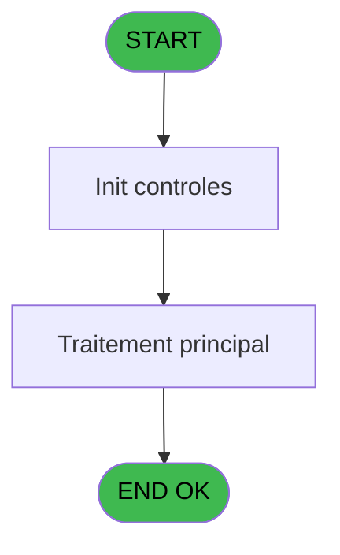
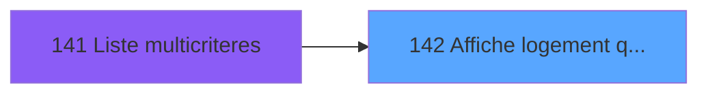
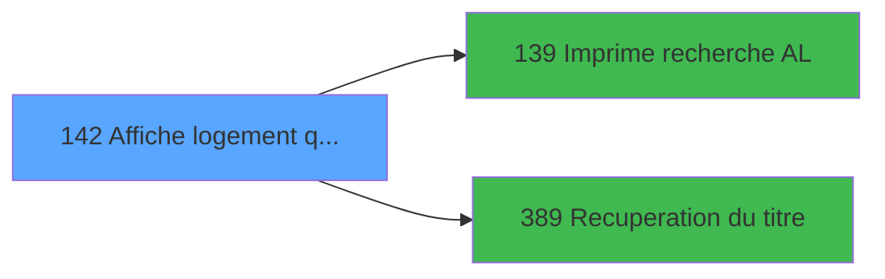

# PBP IDE 142 - Affiche logement (qualite)

> **Analyse**: Phases 1-4 2026-02-03 15:29 -> 15:29 (14s) | Assemblage 15:29
> **Pipeline**: V7.2 Enrichi
> **Structure**: 4 onglets (Resume | Ecrans | Donnees | Connexions)

<!-- TAB:Resume -->

## 1. FICHE D'IDENTITE

| Attribut | Valeur |
|----------|--------|
| Projet | PBP |
| IDE Position | 142 |
| Nom Programme | Affiche logement (qualite) |
| Fichier source | `Prg_142.xml` |
| Dossier IDE | Gestion |
| Taches | 1 (1 ecrans visibles) |
| Tables modifiees | 0 |
| Programmes appeles | 2 |

## 2. DESCRIPTION FONCTIONNELLE

**Affiche logement (qualite)** assure la gestion complete de ce processus, accessible depuis [Liste multicriteres (IDE 141)](PBP-IDE-141.md).

Le flux de traitement s'organise en **1 blocs fonctionnels** :

- **Consultation** (1 tache) : ecrans de recherche, selection et consultation

## 3. BLOCS FONCTIONNELS

### 3.1 Consultation (1 tache)

Ecrans de recherche et consultation.

---

#### 142 - Affiche logement [[ECRAN]](#ecran-t1)

**Role** : Reinitialisation : Affiche logement.
**Ecran** : 691 x 197 DLU (MDI) | [Voir mockup](#ecran-t1)

## 5. REGLES METIER

*(Aucune regle metier identifiee)*

## 6. CONTEXTE

- **Appele par**: [Liste multicriteres (IDE 141)](PBP-IDE-141.md)
- **Appelle**: 2 programmes | **Tables**: 2 (W:0 R:1 L:1) | **Taches**: 1 | **Expressions**: 15

<!-- TAB:Ecrans -->

## 8. ECRANS

### 8.1 Forms visibles (1 / 1)

| # | Position | Tache | Nom | Type | Largeur | Hauteur | Bloc |
|---|----------|-------|-----|------|---------|---------|------|
| 1 | 142 | 142 | Affiche logement | MDI | 691 | 197 | Consultation |

### 8.2 Mockups Ecrans

---

#### 142 - Affiche logement
**Tache** : [142](#t1) | **Type** : MDI | **Dimensions** : 691 x 197 DLU
**Bloc** : Consultation | **Titre IDE** : Affiche logement

<!-- FORM-DATA:
{
    "width":  691,
    "vFactor":  8,
    "type":  "MDI",
    "hFactor":  8,
    "controls":  [
                     {
                         "x":  1,
                         "type":  "label",
                         "var":  "",
                         "y":  0,
                         "w":  681,
                         "fmt":  "",
                         "name":  "",
                         "h":  20,
                         "color":  "1",
                         "text":  "",
                         "parent":  null
                     },
                     {
                         "x":  198,
                         "type":  "table",
                         "var":  "",
                         "name":  "",
                         "titleH":  12,
                         "color":  "110",
                         "w":  482,
                         "y":  23,
                         "fmt":  "",
                         "parent":  null,
                         "text":  "",
                         "rowH":  14,
                         "h":  140,
                         "cols":  [
                                      {
                                          "title":  "Choix",
                                          "layer":  1,
                                          "w":  66
                                      },
                                      {
                                          "title":  "Libellé",
                                          "layer":  2,
                                          "w":  384
                                      }
                                  ],
                         "rows":  2
                     },
                     {
                         "x":  0,
                         "type":  "label",
                         "var":  "",
                         "y":  173,
                         "w":  681,
                         "fmt":  "",
                         "name":  "",
                         "h":  24,
                         "color":  "1",
                         "text":  "",
                         "parent":  null
                     },
                     {
                         "x":  206,
                         "type":  "checkbox",
                         "var":  "",
                         "y":  37,
                         "w":  30,
                         "fmt":  "",
                         "name":  "TUL MARQUEUR",
                         "h":  9,
                         "color":  "110",
                         "text":  "TUL MARQUEUR",
                         "parent":  5
                     },
                     {
                         "x":  349,
                         "type":  "edit",
                         "var":  "",
                         "y":  36,
                         "w":  294,
                         "fmt":  "",
                         "name":  "",
                         "h":  10,
                         "color":  "110",
                         "text":  "",
                         "parent":  5
                     },
                     {
                         "x":  8,
                         "type":  "button",
                         "var":  "",
                         "y":  176,
                         "w":  154,
                         "fmt":  "\u0026Quitter",
                         "name":  "b_Quitter",
                         "h":  18,
                         "color":  "",
                         "text":  "",
                         "parent":  11
                     },
                     {
                         "x":  6,
                         "type":  "edit",
                         "var":  "",
                         "y":  2,
                         "w":  267,
                         "fmt":  "20",
                         "name":  "",
                         "h":  8,
                         "color":  "",
                         "text":  "",
                         "parent":  1
                     },
                     {
                         "x":  370,
                         "type":  "edit",
                         "var":  "",
                         "y":  6,
                         "w":  283,
                         "fmt":  "WWW DD MMM YYYYT",
                         "name":  "",
                         "h":  8,
                         "color":  "",
                         "text":  "",
                         "parent":  1
                     },
                     {
                         "x":  6,
                         "type":  "edit",
                         "var":  "",
                         "y":  11,
                         "w":  331,
                         "fmt":  "25",
                         "name":  "",
                         "h":  8,
                         "color":  "",
                         "text":  "",
                         "parent":  1
                     },
                     {
                         "x":  270,
                         "type":  "edit",
                         "var":  "",
                         "y":  36,
                         "w":  42,
                         "fmt":  "3",
                         "name":  "",
                         "h":  10,
                         "color":  "110",
                         "text":  "",
                         "parent":  5
                     },
                     {
                         "x":  7,
                         "type":  "image",
                         "var":  "",
                         "y":  28,
                         "w":  181,
                         "fmt":  "",
                         "name":  "",
                         "h":  59,
                         "color":  "",
                         "text":  "",
                         "parent":  null
                     }
                 ],
    "taskId":  "142",
    "height":  197
}
-->

<strong>Champs : 6 champs</strong>

| Pos (x,y) | Nom | Variable | Type |
|-----------|-----|----------|------|
| 206,37 | TUL MARQUEUR | - | checkbox |
| 349,36 | (sans nom) | - | edit |
| 6,2 | 20 | - | edit |
| 370,6 | WWW DD MMM YYYYT | - | edit |
| 6,11 | 25 | - | edit |
| 270,36 | 3 | - | edit |

<strong>Boutons : 1 boutons</strong>

| Bouton | Pos (x,y) | Action |
|--------|-----------|--------|
| Quitter | 8,176 | Quitte le programme |

## 9. NAVIGATION

Ecran unique: **Affiche logement**

### 9.3 Structure hierarchique (1 tache)

| Position | Tache | Type | Dimensions | Bloc |
|----------|-------|------|------------|------|
| **142.1** | [**Affiche logement** (142)](#t1) [mockup](#ecran-t1) | MDI | 691x197 | Consultation |

### 9.4 Algorigramme

> **Legende**: Vert = START/END OK | Rouge = END KO | Bleu = Decisions
> *Algorigramme auto-genere. Utiliser `/algorigramme` pour une synthese metier detaillee.*

<!-- TAB:Donnees -->

## 10. TABLES

### Tables utilisees (2)

| ID | Nom | Description | Type | R | W | L | Usages |
|----|-----|-------------|------|---|---|---|--------|
| 107 | logement_zone_menage |  | DB | R |   |   | 1 |
| 637 | tempo_zone_secteur | Table temporaire ecran | DB |   |   | L | 1 |

### Colonnes par table (1 / 1 tables avec colonnes identifiees)

Table 107 - logement_zone_menage (R) - 1 usages

| Lettre | Variable | Acces | Type |
|--------|----------|-------|------|
| A | >Categorie | R | Alpha |
| B | >NomTable | R | Alpha |
| C | >CodeEcran | R | Numeric |
| D | w0_TitreEcran | R | Alpha |
| E | b_Ecran | R | Alpha |
| F | b_Impression | R | Alpha |
| G | b_Quittter | R | Alpha |

## 11. VARIABLES

### 11.1 Autres (7)

Variables diverses.

| Lettre | Nom | Type | Usage dans |
|--------|-----|------|-----------|
| A | >Categorie | Alpha | 1x refs |
| B | >NomTable | Alpha | 1x refs |
| C | >CodeEcran | Numeric | - |
| D | w0_TitreEcran | Alpha | 1x refs |
| E | b_Ecran | Alpha | - |
| F | b_Impression | Alpha | - |
| G | b_Quittter | Alpha | - |

## 12. EXPRESSIONS

**15 / 15 expressions decodees (100%)**

### 12.1 Repartition par type

| Type | Expressions | Regles |
|------|-------------|--------|
| CONSTANTE | 3 | 0 |
| DATE | 1 | 0 |
| REFERENCE_VG | 2 | 0 |
| CONDITION | 2 | 0 |
| OTHER | 6 | 0 |
| STRING | 1 | 0 |

### 12.2 Expressions cles par type

#### CONSTANTE (3 expressions)

| Type | IDE | Expression | Regle |
|------|-----|------------|-------|
| CONSTANTE | 13 | `'&Quitter'` | - |
| CONSTANTE | 12 | `'&Impression'` | - |
| CONSTANTE | 11 | `'&Ecran'` | - |

#### DATE (1 expressions)

| Type | IDE | Expression | Regle |
|------|-----|------------|-------|
| DATE | 9 | `Date ()` | - |

#### REFERENCE_VG (2 expressions)

| Type | IDE | Expression | Regle |
|------|-----|------------|-------|
| REFERENCE_VG | 8 | `VG2` | - |
| REFERENCE_VG | 1 | `VG1` | - |

#### CONDITION (2 expressions)

| Type | IDE | Expression | Regle |
|------|-----|------------|-------|
| CONDITION | 3 | `>NomTable [B]` | - |
| CONDITION | 2 | `>Categorie [A]` | - |

#### OTHER (6 expressions)

| Type | IDE | Expression | Regle |
|------|-----|------------|-------|
| OTHER | 7 | `[I]` | - |
| OTHER | 14 | `GetParam ('VILLAGE')` | - |
| OTHER | 15 | `MID ([H],4,3)` | - |
| OTHER | 4 | `GetParam ('SOCIETE')` | - |
| OTHER | 5 | `GetParam ('LANGUE')` | - |
| ... | | *+1 autres* | |

#### STRING (1 expressions)

| Type | IDE | Expression | Regle |
|------|-----|------------|-------|
| STRING | 10 | `Trim (w0_TitreEcran [D])` | - |

<!-- TAB:Connexions -->

## 13. GRAPHE D'APPELS

### 13.1 Chaine depuis Main (Callers)

Main -> ... -> [Liste multicriteres (IDE 141)](PBP-IDE-141.md) -> **Affiche logement (qualite) (IDE 142)**

### 13.2 Callers

| IDE | Nom Programme | Nb Appels |
|-----|---------------|-----------|
| [141](PBP-IDE-141.md) | Liste multicriteres | 2 |

### 13.3 Callees (programmes appeles)

### 13.4 Detail Callees avec contexte

| IDE | Nom Programme | Appels | Contexte |
|-----|---------------|--------|----------|
| [139](PBP-IDE-139.md) |   Imprime recherche AL | 1 | Impression ticket/document |
| [389](PBP-IDE-389.md) | Recuperation du titre | 1 | Recuperation donnees |

## 14. RECOMMANDATIONS MIGRATION

### 14.1 Profil du programme

| Metrique | Valeur | Impact migration |
|----------|--------|-----------------|
| Lignes de logique | 33 | Programme compact |
| Expressions | 15 | Peu de logique |
| Tables WRITE | 0 | Impact faible |
| Sous-programmes | 2 | Peu de dependances |
| Ecrans visibles | 1 | Ecran unique ou traitement batch |
| Code desactive | 0% (0 / 33) | Code sain |
| Regles metier | 0 | Pas de regle identifiee |

### 14.2 Plan de migration par bloc

#### Consultation (1 tache: 1 ecran, 0 traitement)

- **Strategie** : Composants de recherche/selection en modales.
- 1 ecran : Affiche logement

### 14.3 Dependances critiques

| Dependance | Type | Appels | Impact |
|------------|------|--------|--------|
| [Recuperation du titre (IDE 389)](PBP-IDE-389.md) | Sous-programme | 1x | Normale - Recuperation donnees |
| [  Imprime recherche AL (IDE 139)](PBP-IDE-139.md) | Sous-programme | 1x | Normale - Impression ticket/document |

---
*Spec DETAILED generee par Pipeline V7.2 - 2026-02-03 15:29*
