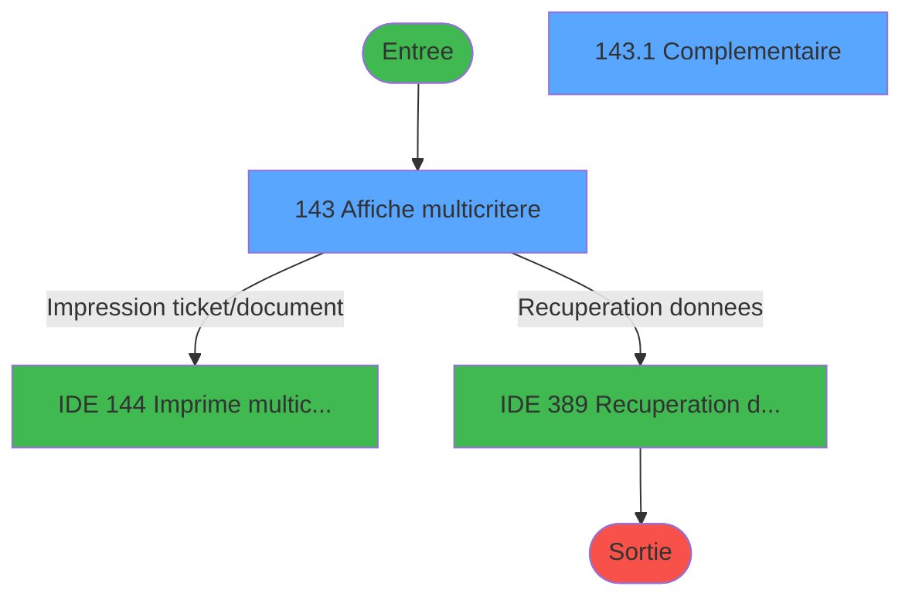
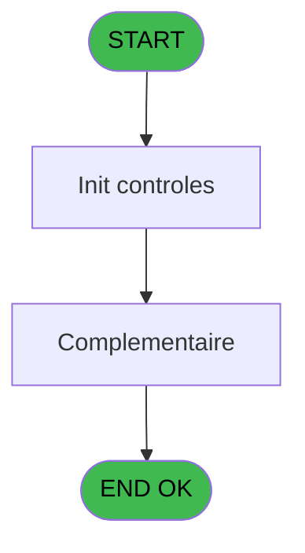
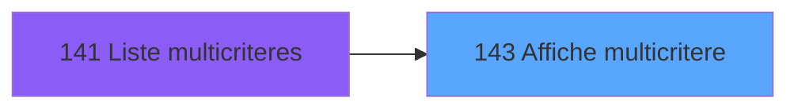
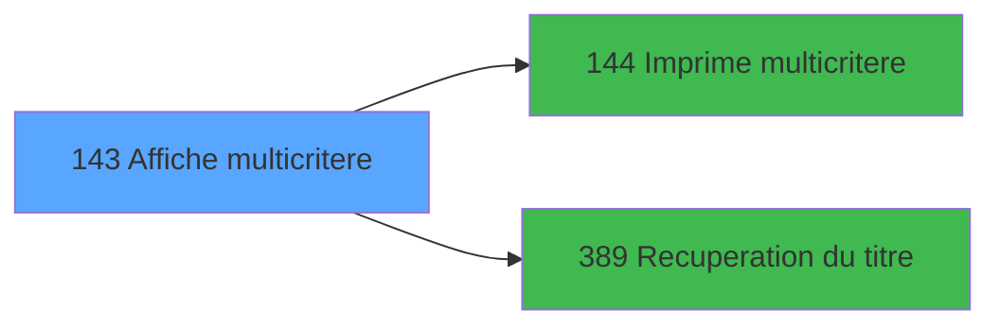

# PBP IDE 143 - Affiche multicritere

> **Analyse**: Phases 1-4 2026-02-03 15:29 -> 15:30 (12s) | Assemblage 15:30
> **Pipeline**: V7.2 Enrichi
> **Structure**: 4 onglets (Resume | Ecrans | Donnees | Connexions)

<!-- TAB:Resume -->

## 1. FICHE D'IDENTITE

| Attribut | Valeur |
|----------|--------|
| Projet | PBP |
| IDE Position | 143 |
| Nom Programme | Affiche multicritere |
| Fichier source | `Prg_143.xml` |
| Dossier IDE | Gestion |
| Taches | 2 (2 ecrans visibles) |
| Tables modifiees | 0 |
| Programmes appeles | 2 |

## 2. DESCRIPTION FONCTIONNELLE

**Affiche multicritere** assure la gestion complete de ce processus, accessible depuis [Liste multicriteres (IDE 141)](PBP-IDE-141.md).

Le flux de traitement s'organise en **2 blocs fonctionnels** :

- **Traitement** (1 tache) : traitements metier divers
- **Consultation** (1 tache) : ecrans de recherche, selection et consultation

**Logique metier** : 4 regles identifiees couvrant conditions metier.

Detail : phases du traitement

#### Phase 1 : Consultation (1 tache)

- **143** - Affiche multicritere **[[ECRAN]](#ecran-t1)**

Delegue a : [Recuperation du titre (IDE 389)](PBP-IDE-389.md)

#### Phase 2 : Traitement (1 tache)

- **143.1** - Complementaire **[[ECRAN]](#ecran-t2)**

Delegue a : [Recuperation du titre (IDE 389)](PBP-IDE-389.md)

## 3. BLOCS FONCTIONNELS

### 3.1 Consultation (1 tache)

Ecrans de recherche et consultation.

---

#### 143 - Affiche multicritere [[ECRAN]](#ecran-t1)

**Role** : Reinitialisation : Affiche multicritere.
**Ecran** : 1054 x 278 DLU (MDI) | [Voir mockup](#ecran-t1)

### 3.2 Traitement (1 tache)

Traitements internes.

---

#### 143.1 - Complementaire [[ECRAN]](#ecran-t2)

**Role** : Traitement : Complementaire.
**Ecran** : 1051 x 86 DLU (Modal) | [Voir mockup](#ecran-t2)
**Delegue a** : [Recuperation du titre (IDE 389)](PBP-IDE-389.md)

## 5. REGLES METIER

4 regles identifiees:

### Autres (4 regles)

#### [RM-001] Si [N]='O' alors MlsTrans ('Bebe') sinon '')

| Element | Detail |
|---------|--------|
| **Condition** | `[N]='O'` |
| **Si vrai** | MlsTrans ('Bebe') |
| **Si faux** | '') |
| **Expression source** | Expression 13 : `IF ([N]='O',MlsTrans ('Bebe'),'')` |
| **Exemple** | Si [N]='O' → MlsTrans ('Bebe'). Sinon → '') |

#### [RM-002] Si InStr ('12345' alors [M])>0 sinon 'Vip'&[M],IF ([M]='O',MlsTrans ('Fleurs'),''))

| Element | Detail |
|---------|--------|
| **Condition** | `InStr ('12345'` |
| **Si vrai** | [M])>0 |
| **Si faux** | 'Vip'&[M],IF ([M]='O',MlsTrans ('Fleurs'),'')) |
| **Expression source** | Expression 14 : `IF (InStr ('12345',[M])>0,'Vip'&[M],IF ([M]='O',MlsTrans ('F` |
| **Exemple** | Si InStr ('12345' → [M])>0. Sinon → 'Vip'&[M],IF ([M]='O',MlsTrans ('Fleurs'),'')) |

#### [RM-003] Si b_Imprimer [K]='F' alors 'Me' sinon 'M')

| Element | Detail |
|---------|--------|
| **Condition** | `b_Imprimer [K]='F'` |
| **Si vrai** | 'Me' |
| **Si faux** | 'M') |
| **Variables** | K (b_Imprimer) |
| **Expression source** | Expression 15 : `IF (b_Imprimer [K]='F','Me','M')` |
| **Exemple** | Si b_Imprimer [K]='F' → 'Me'. Sinon → 'M') |

#### [RM-004] Traitement si b_Quitter [L]='M',IF ([BH] est renseigne

| Element | Detail |
|---------|--------|
| **Condition** | `b_Quitter [L]='M'` |
| **Si vrai** | IF ([BH]<>'' |
| **Si faux** | IF(VG42,[ED],[BK]),MlsTrans ('Millesia')),'') |
| **Variables** | L (b_Quitter) |
| **Expression source** | Expression 16 : `IF (b_Quitter [L]='M',IF ([BH]<>'',IF(VG42,[ED],[BK]),MlsTra` |
| **Exemple** | Si b_Quitter [L]='M' → IF ([BH]<>''. Sinon → IF(VG42,[ED],[BK]),MlsTrans ('Millesia')),'') |

## 6. CONTEXTE

- **Appele par**: [Liste multicriteres (IDE 141)](PBP-IDE-141.md)
- **Appelle**: 2 programmes | **Tables**: 6 (W:0 R:2 L:5) | **Taches**: 2 | **Expressions**: 25

<!-- TAB:Ecrans -->

## 8. ECRANS

### 8.1 Forms visibles (2 / 2)

| # | Position | Tache | Nom | Type | Largeur | Hauteur | Bloc |
|---|----------|-------|-----|------|---------|---------|------|
| 1 | 143 | 143 | Affiche multicritere | MDI | 1054 | 278 | Consultation |
| 2 | 143.1 | 143.1 | Complementaire | Modal | 1051 | 86 | Traitement |

### 8.2 Mockups Ecrans

---

#### 143 - Affiche multicritere
**Tache** : [143](#t1) | **Type** : MDI | **Dimensions** : 1054 x 278 DLU
**Bloc** : Consultation | **Titre IDE** : Affiche multicritere

<!-- FORM-DATA:
{
    "width":  1054,
    "vFactor":  8,
    "type":  "MDI",
    "hFactor":  8,
    "controls":  [
                     {
                         "x":  0,
                         "type":  "label",
                         "var":  "",
                         "y":  0,
                         "w":  1051,
                         "fmt":  "",
                         "name":  "",
                         "h":  19,
                         "color":  "",
                         "text":  "",
                         "parent":  null
                     },
                     {
                         "x":  0,
                         "type":  "table",
                         "var":  "",
                         "name":  "",
                         "titleH":  12,
                         "color":  "110",
                         "w":  354,
                         "y":  28,
                         "fmt":  "",
                         "parent":  null,
                         "text":  "",
                         "rowH":  14,
                         "h":  122,
                         "cols":  [
                                      {
                                          "title":  "Nom",
                                          "layer":  1,
                                          "w":  200
                                      },
                                      {
                                          "title":  "Prénom",
                                          "layer":  2,
                                          "w":  120
                                      }
                                  ],
                         "rows":  2
                     },
                     {
                         "x":  355,
                         "type":  "label",
                         "var":  "",
                         "y":  26,
                         "w":  511,
                         "fmt":  "",
                         "name":  "",
                         "h":  127,
                         "color":  "",
                         "text":  "",
                         "parent":  null
                     },
                     {
                         "x":  874,
                         "type":  "label",
                         "var":  "",
                         "y":  26,
                         "w":  175,
                         "fmt":  "",
                         "name":  "",
                         "h":  127,
                         "color":  "",
                         "text":  "",
                         "parent":  null
                     },
                     {
                         "x":  369,
                         "type":  "label",
                         "var":  "",
                         "y":  36,
                         "w":  37,
                         "fmt":  "",
                         "name":  "",
                         "h":  8,
                         "color":  "",
                         "text":  "N° :",
                         "parent":  6
                     },
                     {
                         "x":  369,
                         "type":  "label",
                         "var":  "",
                         "y":  50,
                         "w":  42,
                         "fmt":  "",
                         "name":  "",
                         "h":  8,
                         "color":  "",
                         "text":  "Titre",
                         "parent":  6
                     },
                     {
                         "x":  546,
                         "type":  "label",
                         "var":  "",
                         "y":  50,
                         "w":  61,
                         "fmt":  "",
                         "name":  "",
                         "h":  8,
                         "color":  "",
                         "text":  "Qualité",
                         "parent":  6
                     },
                     {
                         "x":  369,
                         "type":  "label",
                         "var":  "",
                         "y":  64,
                         "w":  98,
                         "fmt":  "",
                         "name":  "",
                         "h":  8,
                         "color":  "",
                         "text":  "Nationnalité",
                         "parent":  6
                     },
                     {
                         "x":  546,
                         "type":  "label",
                         "var":  "",
                         "y":  64,
                         "w":  122,
                         "fmt":  "",
                         "name":  "",
                         "h":  8,
                         "color":  "",
                         "text":  "Code logement",
                         "parent":  6
                     },
                     {
                         "x":  369,
                         "type":  "label",
                         "var":  "",
                         "y":  78,
                         "w":  85,
                         "fmt":  "",
                         "name":  "",
                         "h":  8,
                         "color":  "",
                         "text":  "Inscription",
                         "parent":  6
                     },
                     {
                         "x":  546,
                         "type":  "label",
                         "var":  "",
                         "y":  78,
                         "w":  54,
                         "fmt":  "",
                         "name":  "",
                         "h":  8,
                         "color":  "",
                         "text":  "Single",
                         "parent":  6
                     },
                     {
                         "x":  357,
                         "type":  "line",
                         "var":  "",
                         "y":  96,
                         "w":  507,
                         "fmt":  "",
                         "name":  "",
                         "h":  0,
                         "color":  "",
                         "text":  "",
                         "parent":  6
                     },
                     {
                         "x":  474,
                         "type":  "label",
                         "var":  "",
                         "y":  104,
                         "w":  78,
                         "fmt":  "",
                         "name":  "",
                         "h":  8,
                         "color":  "",
                         "text":  "Aller",
                         "parent":  6
                     },
                     {
                         "x":  665,
                         "type":  "label",
                         "var":  "",
                         "y":  104,
                         "w":  59,
                         "fmt":  "",
                         "name":  "",
                         "h":  8,
                         "color":  "",
                         "text":  "Retour",
                         "parent":  6
                     },
                     {
                         "x":  369,
                         "type":  "label",
                         "var":  "",
                         "y":  117,
                         "w":  56,
                         "fmt":  "",
                         "name":  "",
                         "h":  8,
                         "color":  "",
                         "text":  "Vol",
                         "parent":  6
                     },
                     {
                         "x":  369,
                         "type":  "label",
                         "var":  "",
                         "y":  132,
                         "w":  80,
                         "fmt":  "",
                         "name":  "",
                         "h":  8,
                         "color":  "",
                         "text":  "Catégorie",
                         "parent":  6
                     },
                     {
                         "x":  0,
                         "type":  "label",
                         "var":  "",
                         "y":  252,
                         "w":  1051,
                         "fmt":  "",
                         "name":  "",
                         "h":  24,
                         "color":  "",
                         "text":  "",
                         "parent":  null
                     },
                     {
                         "x":  6,
                         "type":  "edit",
                         "var":  "",
                         "y":  43,
                         "w":  182,
                         "fmt":  "",
                         "name":  "TAD NOM ADHERENT",
                         "h":  10,
                         "color":  "110",
                         "text":  "",
                         "parent":  5
                     },
                     {
                         "x":  206,
                         "type":  "edit",
                         "var":  "",
                         "y":  43,
                         "w":  104,
                         "fmt":  "",
                         "name":  "TAD PRENOM ADHERENT",
                         "h":  10,
                         "color":  "110",
                         "text":  "",
                         "parent":  5
                     },
                     {
                         "x":  474,
                         "type":  "edit",
                         "var":  "",
                         "y":  36,
                         "w":  123,
                         "fmt":  "",
                         "name":  "",
                         "h":  9,
                         "color":  "",
                         "text":  "",
                         "parent":  6
                     },
                     {
                         "x":  474,
                         "type":  "edit",
                         "var":  "",
                         "y":  78,
                         "w":  45,
                         "fmt":  "",
                         "name":  "",
                         "h":  9,
                         "color":  "",
                         "text":  "",
                         "parent":  6
                     },
                     {
                         "x":  474,
                         "type":  "edit",
                         "var":  "",
                         "y":  64,
                         "w":  34,
                         "fmt":  "",
                         "name":  "",
                         "h":  9,
                         "color":  "",
                         "text":  "",
                         "parent":  6
                     },
                     {
                         "x":  625,
                         "type":  "edit",
                         "var":  "",
                         "y":  50,
                         "w":  45,
                         "fmt":  "U3",
                         "name":  "",
                         "h":  9,
                         "color":  "",
                         "text":  "",
                         "parent":  6
                     },
                     {
                         "x":  674,
                         "type":  "edit",
                         "var":  "",
                         "y":  50,
                         "w":  56,
                         "fmt":  "",
                         "name":  "",
                         "h":  9,
                         "color":  "",
                         "text":  "",
                         "parent":  6
                     },
                     {
                         "x":  674,
                         "type":  "edit",
                         "var":  "",
                         "y":  64,
                         "w":  22,
                         "fmt":  "",
                         "name":  "",
                         "h":  9,
                         "color":  "",
                         "text":  "",
                         "parent":  6
                     },
                     {
                         "x":  754,
                         "type":  "edit",
                         "var":  "",
                         "y":  64,
                         "w":  78,
                         "fmt":  "",
                         "name":  "",
                         "h":  9,
                         "color":  "",
                         "text":  "",
                         "parent":  6
                     },
                     {
                         "x":  466,
                         "type":  "edit",
                         "var":  "",
                         "y":  117,
                         "w":  98,
                         "fmt":  "DD/MM/YYZ",
                         "name":  "",
                         "h":  8,
                         "color":  "",
                         "text":  "",
                         "parent":  6
                     },
                     {
                         "x":  585,
                         "type":  "edit",
                         "var":  "",
                         "y":  117,
                         "w":  34,
                         "fmt":  "",
                         "name":  "",
                         "h":  9,
                         "color":  "",
                         "text":  "",
                         "parent":  6
                     },
                     {
                         "x":  553,
                         "type":  "edit",
                         "var":  "",
                         "y":  132,
                         "w":  78,
                         "fmt":  "",
                         "name":  "",
                         "h":  9,
                         "color":  "",
                         "text":  "",
                         "parent":  6
                     },
                     {
                         "x":  466,
                         "type":  "edit",
                         "var":  "",
                         "y":  132,
                         "w":  78,
                         "fmt":  "",
                         "name":  "",
                         "h":  9,
                         "color":  "",
                         "text":  "",
                         "parent":  6
                     },
                     {
                         "x":  665,
                         "type":  "edit",
                         "var":  "",
                         "y":  117,
                         "w":  101,
                         "fmt":  "DD/MM/YYZ",
                         "name":  "",
                         "h":  9,
                         "color":  "",
                         "text":  "",
                         "parent":  6
                     },
                     {
                         "x":  798,
                         "type":  "edit",
                         "var":  "",
                         "y":  117,
                         "w":  34,
                         "fmt":  "",
                         "name":  "",
                         "h":  9,
                         "color":  "",
                         "text":  "",
                         "parent":  6
                     },
                     {
                         "x":  754,
                         "type":  "edit",
                         "var":  "",
                         "y":  132,
                         "w":  78,
                         "fmt":  "",
                         "name":  "",
                         "h":  9,
                         "color":  "",
                         "text":  "",
                         "parent":  6
                     },
                     {
                         "x":  665,
                         "type":  "edit",
                         "var":  "",
                         "y":  132,
                         "w":  78,
                         "fmt":  "",
                         "name":  "",
                         "h":  9,
                         "color":  "",
                         "text":  "",
                         "parent":  6
                     },
                     {
                         "x":  885,
                         "type":  "button",
                         "var":  "",
                         "y":  122,
                         "w":  154,
                         "fmt":  "\u0026Imprimer",
                         "name":  "b_Imprimer",
                         "h":  18,
                         "color":  "",
                         "text":  "",
                         "parent":  7
                     },
                     {
                         "x":  7,
                         "type":  "button",
                         "var":  "",
                         "y":  255,
                         "w":  154,
                         "fmt":  "\u0026Quitter",
                         "name":  "b_Quitter",
                         "h":  18,
                         "color":  "",
                         "text":  "",
                         "parent":  45
                     },
                     {
                         "x":  5,
                         "type":  "edit",
                         "var":  "",
                         "y":  2,
                         "w":  267,
                         "fmt":  "20",
                         "name":  "",
                         "h":  8,
                         "color":  "",
                         "text":  "",
                         "parent":  1
                     },
                     {
                         "x":  737,
                         "type":  "edit",
                         "var":  "",
                         "y":  6,
                         "w":  307,
                         "fmt":  "WWW DD MMM YYYYT",
                         "name":  "",
                         "h":  8,
                         "color":  "",
                         "text":  "",
                         "parent":  1
                     },
                     {
                         "x":  3,
                         "type":  "edit",
                         "var":  "",
                         "y":  10,
                         "w":  331,
                         "fmt":  "25",
                         "name":  "",
                         "h":  8,
                         "color":  "",
                         "text":  "",
                         "parent":  null
                     },
                     {
                         "x":  674,
                         "type":  "edit",
                         "var":  "",
                         "y":  36,
                         "w":  56,
                         "fmt":  "4",
                         "name":  "",
                         "h":  9,
                         "color":  "",
                         "text":  "",
                         "parent":  6
                     },
                     {
                         "x":  754,
                         "type":  "edit",
                         "var":  "",
                         "y":  36,
                         "w":  78,
                         "fmt":  "6",
                         "name":  "",
                         "h":  9,
                         "color":  "",
                         "text":  "",
                         "parent":  6
                     },
                     {
                         "x":  887,
                         "type":  "image",
                         "var":  "",
                         "y":  43,
                         "w":  149,
                         "fmt":  "",
                         "name":  "",
                         "h":  68,
                         "color":  "",
                         "text":  "",
                         "parent":  7
                     },
                     {
                         "x":  474,
                         "type":  "edit",
                         "var":  "",
                         "y":  50,
                         "w":  34,
                         "fmt":  "2",
                         "name":  "",
                         "h":  9,
                         "color":  "",
                         "text":  "",
                         "parent":  6
                     },
                     {
                         "x":  742,
                         "type":  "edit",
                         "var":  "",
                         "y":  50,
                         "w":  114,
                         "fmt":  "15",
                         "name":  "",
                         "h":  9,
                         "color":  "",
                         "text":  "",
                         "parent":  6
                     },
                     {
                         "x":  0,
                         "type":  "subform",
                         "var":  "",
                         "y":  156,
                         "w":  1054,
                         "fmt":  "",
                         "name":  "Complementaire",
                         "h":  96,
                         "color":  "",
                         "text":  "",
                         "parent":  null
                     }
                 ],
    "taskId":  "143",
    "height":  278
}
-->

<strong>Champs : 24 champs</strong>

| Pos (x,y) | Nom | Variable | Type |
|-----------|-----|----------|------|
| 6,43 | TAD NOM ADHERENT | - | edit |
| 206,43 | TAD PRENOM ADHERENT | - | edit |
| 474,36 | (sans nom) | - | edit |
| 474,78 | (sans nom) | - | edit |
| 474,64 | (sans nom) | - | edit |
| 625,50 | U3 | - | edit |
| 674,50 | (sans nom) | - | edit |
| 674,64 | (sans nom) | - | edit |
| 754,64 | (sans nom) | - | edit |
| 466,117 | DD/MM/YYZ | - | edit |
| 585,117 | (sans nom) | - | edit |
| 553,132 | (sans nom) | - | edit |
| 466,132 | (sans nom) | - | edit |
| 665,117 | DD/MM/YYZ | - | edit |
| 798,117 | (sans nom) | - | edit |
| 754,132 | (sans nom) | - | edit |
| 665,132 | (sans nom) | - | edit |
| 5,2 | 20 | - | edit |
| 737,6 | WWW DD MMM YYYYT | - | edit |
| 3,10 | 25 | - | edit |
| 674,36 | 4 | - | edit |
| 754,36 | 6 | - | edit |
| 474,50 | 2 | - | edit |
| 742,50 | 15 | - | edit |

<strong>Boutons : 2 boutons</strong>

| Bouton | Pos (x,y) | Action |
|--------|-----------|--------|
| Imprimer | 885,122 | Appel [  Imprime multicritere (IDE 144)](PBP-IDE-144.md) |
| Quitter | 7,255 | Quitte le programme |

---

#### 143.1 - Complementaire
**Tache** : [143.1](#t2) | **Type** : Modal | **Dimensions** : 1051 x 86 DLU
**Bloc** : Traitement | **Titre IDE** : Complementaire

<!-- FORM-DATA:
{
    "width":  1051,
    "vFactor":  8,
    "type":  "Modal",
    "hFactor":  8,
    "controls":  [
                     {
                         "x":  147,
                         "type":  "table",
                         "var":  "",
                         "name":  "",
                         "titleH":  12,
                         "color":  "110",
                         "w":  771,
                         "y":  3,
                         "fmt":  "",
                         "parent":  null,
                         "text":  "",
                         "rowH":  14,
                         "h":  82,
                         "cols":  [
                                      {
                                          "title":  "Libellé",
                                          "layer":  1,
                                          "w":  252
                                      },
                                      {
                                          "title":  "Date Début",
                                          "layer":  2,
                                          "w":  124
                                      },
                                      {
                                          "title":  "Heure",
                                          "layer":  3,
                                          "w":  70
                                      },
                                      {
                                          "title":  "Date Fin",
                                          "layer":  4,
                                          "w":  116
                                      },
                                      {
                                          "title":  "Heure",
                                          "layer":  5,
                                          "w":  70
                                      },
                                      {
                                          "title":  "Logement",
                                          "layer":  6,
                                          "w":  105
                                      }
                                  ],
                         "rows":  6
                     },
                     {
                         "x":  158,
                         "type":  "edit",
                         "var":  "",
                         "y":  18,
                         "w":  228,
                         "fmt":  "",
                         "name":  "",
                         "h":  10,
                         "color":  "110",
                         "text":  "",
                         "parent":  1
                     },
                     {
                         "x":  410,
                         "type":  "edit",
                         "var":  "",
                         "y":  18,
                         "w":  104,
                         "fmt":  "DD/MM/YYZ",
                         "name":  "",
                         "h":  10,
                         "color":  "110",
                         "text":  "",
                         "parent":  1
                     },
                     {
                         "x":  544,
                         "type":  "edit",
                         "var":  "",
                         "y":  18,
                         "w":  36,
                         "fmt":  "",
                         "name":  "",
                         "h":  10,
                         "color":  "110",
                         "text":  "",
                         "parent":  1
                     },
                     {
                         "x":  602,
                         "type":  "edit",
                         "var":  "",
                         "y":  18,
                         "w":  104,
                         "fmt":  "DD/MM/YYZ",
                         "name":  "",
                         "h":  10,
                         "color":  "110",
                         "text":  "",
                         "parent":  1
                     },
                     {
                         "x":  730,
                         "type":  "edit",
                         "var":  "",
                         "y":  18,
                         "w":  36,
                         "fmt":  "",
                         "name":  "",
                         "h":  10,
                         "color":  "110",
                         "text":  "",
                         "parent":  1
                     },
                     {
                         "x":  786,
                         "type":  "edit",
                         "var":  "",
                         "y":  18,
                         "w":  82,
                         "fmt":  "",
                         "name":  "",
                         "h":  10,
                         "color":  "110",
                         "text":  "",
                         "parent":  1
                     }
                 ],
    "taskId":  "143.1",
    "height":  86
}
-->

<strong>Champs : 6 champs</strong>

| Pos (x,y) | Nom | Variable | Type |
|-----------|-----|----------|------|
| 158,18 | (sans nom) | - | edit |
| 410,18 | DD/MM/YYZ | - | edit |
| 544,18 | (sans nom) | - | edit |
| 602,18 | DD/MM/YYZ | - | edit |
| 730,18 | (sans nom) | - | edit |
| 786,18 | (sans nom) | - | edit |

## 9. NAVIGATION

### 9.1 Enchainement des ecrans

**Detail par enchainement :**

| Depuis | Action | Vers | Retour |
|--------|--------|------|--------|
| Affiche multicritere | Impression ticket/document | [  Imprime multicritere (IDE 144)](PBP-IDE-144.md) | Retour ecran |
| Affiche multicritere | Recuperation donnees | [Recuperation du titre (IDE 389)](PBP-IDE-389.md) | Retour ecran |

### 9.3 Structure hierarchique (2 taches)

| Position | Tache | Type | Dimensions | Bloc |
|----------|-------|------|------------|------|
| **143.1** | [**Affiche multicritere** (143)](#t1) [mockup](#ecran-t1) | MDI | 1054x278 | Consultation |
| **143.2** | [**Complementaire** (143.1)](#t2) [mockup](#ecran-t2) | Modal | 1051x86 | Traitement |

### 9.4 Algorigramme

> **Legende**: Vert = START/END OK | Rouge = END KO | Bleu = Decisions
> *Algorigramme auto-genere. Utiliser `/algorigramme` pour une synthese metier detaillee.*

<!-- TAB:Donnees -->

## 10. TABLES

### Tables utilisees (6)

| ID | Nom | Description | Type | R | W | L | Usages |
|----|-----|-------------|------|---|---|---|--------|
| 31 | gm-complet_______gmc |  | DB | R |   |   | 1 |
| 34 | hebergement______heb | Hebergement (chambres) | DB | R |   | L | 2 |
| 358 | import_mod |  | DB |   |   | L | 1 |
| 603 | tempo_logement_plann_print | Table temporaire ecran | TMP |   |   | L | 1 |
| 738 | pv_selling_unit |  | DB |   |   | L | 1 |
| 845 | stat_vendeur_date |  | TMP |   |   | L | 1 |

### Colonnes par table (3 / 2 tables avec colonnes identifiees)

Table 31 - gm-complet_______gmc (R) - 1 usages

| Lettre | Variable | Acces | Type |
|--------|----------|-------|------|
| A | >DateDebut | R | Date |
| B | >HeureDebut | R | Alpha |
| C | >DateFin | R | Date |
| D | >HeureFin | R | Alpha |
| E | >Total | R | Numeric |
| F | >NbSelect | R | Numeric |
| G | w0_TitreEcran | R | Alpha |
| H | w0_PackH----------------------- | R | Alpha |
| I | w0_PackA----------------------- | R | Alpha |
| J | w0_PackZ----------------------- | R | Alpha |
| K | b_Imprimer | R | Alpha |
| L | b_Quitter | R | Alpha |

Table 34 - hebergement______heb (R/L) - 2 usages

| Lettre | Variable | Acces | Type |
|--------|----------|-------|------|
| A | P.Num compte | R | Numeric |
| B | P.Filiation | R | Numeric |

## 11. VARIABLES

### 11.1 Autres (12)

Variables diverses.

| Lettre | Nom | Type | Usage dans |
|--------|-----|------|-----------|
| A | >DateDebut | Date | 1x refs |
| B | >HeureDebut | Alpha | - |
| C | >DateFin | Date | 1x refs |
| D | >HeureFin | Alpha | - |
| E | >Total | Numeric | - |
| F | >NbSelect | Numeric | - |
| G | w0_TitreEcran | Alpha | 1x refs |
| H | w0_PackH----------------------- | Alpha | - |
| I | w0_PackA----------------------- | Alpha | - |
| J | w0_PackZ----------------------- | Alpha | - |
| K | b_Imprimer | Alpha | 1x refs |
| L | b_Quitter | Alpha | 1x refs |

## 12. EXPRESSIONS

**25 / 25 expressions decodees (100%)**

### 12.1 Repartition par type

| Type | Expressions | Regles |
|------|-------------|--------|
| CONDITION | 6 | 4 |
| CONSTANTE | 6 | 0 |
| DATE | 1 | 0 |
| REFERENCE_VG | 2 | 0 |
| OTHER | 9 | 0 |
| STRING | 1 | 0 |

### 12.2 Expressions cles par type

#### CONDITION (6 expressions)

| Type | IDE | Expression | Regle |
|------|-----|------------|-------|
| CONDITION | 15 | `IF (b_Imprimer [K]='F','Me','M')` | [RM-003](#rm-RM-003) |
| CONDITION | 16 | `IF (b_Quitter [L]='M',IF ([BH]<>'',IF(VG42,[ED],[BK]),MlsTrans ('Millesia')),'')` | [RM-004](#rm-RM-004) |
| CONDITION | 13 | `IF ([N]='O',MlsTrans ('Bebe'),'')` | [RM-001](#rm-RM-001) |
| CONDITION | 14 | `IF (InStr ('12345',[M])>0,'Vip'&[M],IF ([M]='O',MlsTrans ('Fleurs'),''))` | [RM-002](#rm-RM-002) |
| CONDITION | 8 | `>DateFin [C]` | - |
| ... | | *+1 autres* | |

#### CONSTANTE (6 expressions)

| Type | IDE | Expression | Regle |
|------|-----|------------|-------|
| CONSTANTE | 11 | `'Z'` | - |
| CONSTANTE | 21 | `'&Imprimer'` | - |
| CONSTANTE | 22 | `'&Quitter'` | - |
| CONSTANTE | 1 | `55` | - |
| CONSTANTE | 9 | `'H'` | - |
| ... | | *+1 autres* | |

#### DATE (1 expressions)

| Type | IDE | Expression | Regle |
|------|-----|------------|-------|
| DATE | 18 | `Date ()` | - |

#### REFERENCE_VG (2 expressions)

| Type | IDE | Expression | Regle |
|------|-----|------------|-------|
| REFERENCE_VG | 17 | `VG2` | - |
| REFERENCE_VG | 2 | `VG1` | - |

#### OTHER (9 expressions)

| Type | IDE | Expression | Regle |
|------|-----|------------|-------|
| OTHER | 23 | `GetParam ('VILLAGE')` | - |
| OTHER | 20 | `SetCrsr (1)` | - |
| OTHER | 25 | `[EA]` | - |
| OTHER | 24 | `[BH]` | - |
| OTHER | 19 | `SetCrsr (2)` | - |
| ... | | *+4 autres* | |

#### STRING (1 expressions)

| Type | IDE | Expression | Regle |
|------|-----|------------|-------|
| STRING | 12 | `Trim (w0_TitreEcran [G])` | - |

### 12.3 Toutes les expressions (25)

Voir les 25 expressions

#### CONDITION (6)

| IDE | Expression Decodee |
|-----|-------------------|
| 13 | `IF ([N]='O',MlsTrans ('Bebe'),'')` |
| 14 | `IF (InStr ('12345',[M])>0,'Vip'&[M],IF ([M]='O',MlsTrans ('Fleurs'),''))` |
| 15 | `IF (b_Imprimer [K]='F','Me','M')` |
| 16 | `IF (b_Quitter [L]='M',IF ([BH]<>'',IF(VG42,[ED],[BK]),MlsTrans ('Millesia')),'')` |
| 7 | `>DateDebut [A]` |
| 8 | `>DateFin [C]` |

#### CONSTANTE (6)

| IDE | Expression Decodee |
|-----|-------------------|
| 1 | `55` |
| 9 | `'H'` |
| 10 | `'A'` |
| 11 | `'Z'` |
| 21 | `'&Imprimer'` |
| 22 | `'&Quitter'` |

#### DATE (1)

| IDE | Expression Decodee |
|-----|-------------------|
| 18 | `Date ()` |

#### REFERENCE_VG (2)

| IDE | Expression Decodee |
|-----|-------------------|
| 2 | `VG1` |
| 17 | `VG2` |

#### OTHER (9)

| IDE | Expression Decodee |
|-----|-------------------|
| 3 | `GetParam ('SOCIETE')` |
| 4 | `GetParam ('CODELANGUE')` |
| 5 | `[T]` |
| 6 | `[U]` |
| 19 | `SetCrsr (2)` |
| 20 | `SetCrsr (1)` |
| 23 | `GetParam ('VILLAGE')` |
| 24 | `[BH]` |
| 25 | `[EA]` |

#### STRING (1)

| IDE | Expression Decodee |
|-----|-------------------|
| 12 | `Trim (w0_TitreEcran [G])` |

<!-- TAB:Connexions -->

## 13. GRAPHE D'APPELS

### 13.1 Chaine depuis Main (Callers)

Main -> ... -> [Liste multicriteres (IDE 141)](PBP-IDE-141.md) -> **Affiche multicritere (IDE 143)**

### 13.2 Callers

| IDE | Nom Programme | Nb Appels |
|-----|---------------|-----------|
| [141](PBP-IDE-141.md) | Liste multicriteres | 1 |

### 13.3 Callees (programmes appeles)

### 13.4 Detail Callees avec contexte

| IDE | Nom Programme | Appels | Contexte |
|-----|---------------|--------|----------|
| [144](PBP-IDE-144.md) |   Imprime multicritere | 1 | Impression ticket/document |
| [389](PBP-IDE-389.md) | Recuperation du titre | 1 | Recuperation donnees |

## 14. RECOMMANDATIONS MIGRATION

### 14.1 Profil du programme

| Metrique | Valeur | Impact migration |
|----------|--------|-----------------|
| Lignes de logique | 125 | Programme compact |
| Expressions | 25 | Peu de logique |
| Tables WRITE | 0 | Impact faible |
| Sous-programmes | 2 | Peu de dependances |
| Ecrans visibles | 2 | Quelques ecrans |
| Code desactive | 0% (0 / 125) | Code sain |
| Regles metier | 4 | Quelques regles a preserver |

### 14.2 Plan de migration par bloc

#### Consultation (1 tache: 1 ecran, 0 traitement)

- **Strategie** : Composants de recherche/selection en modales.
- 1 ecran : Affiche multicritere

#### Traitement (1 tache: 1 ecran, 0 traitement)

- **Strategie** : 1 composant(s) UI (Razor/React) avec formulaires et validation.
- 2 sous-programme(s) a migrer ou a reutiliser depuis les services existants.
- Decomposer les taches en services unitaires testables.

### 14.3 Dependances critiques

| Dependance | Type | Appels | Impact |
|------------|------|--------|--------|
| [Recuperation du titre (IDE 389)](PBP-IDE-389.md) | Sous-programme | 1x | Normale - Recuperation donnees |
| [  Imprime multicritere (IDE 144)](PBP-IDE-144.md) | Sous-programme | 1x | Normale - Impression ticket/document |

---
*Spec DETAILED generee par Pipeline V7.2 - 2026-02-03 15:30*
