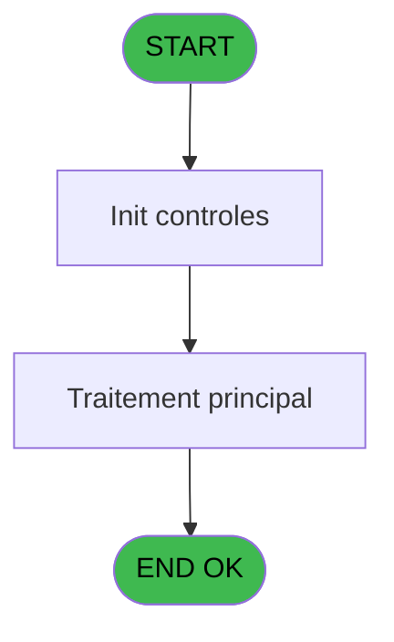

# PBP IDE 144 - Imprime multicritere

> **Analyse**: Phases 1-4 2026-02-03 15:30 -> 15:30 (11s) | Assemblage 15:30
> **Pipeline**: V7.2 Enrichi
> **Structure**: 4 onglets (Resume | Ecrans | Donnees | Connexions)

<!-- TAB:Resume -->

## 1. FICHE D'IDENTITE

| Attribut | Valeur |
|----------|--------|
| Projet | PBP |
| IDE Position | 144 |
| Nom Programme | Imprime multicritere |
| Fichier source | `Prg_144.xml` |
| Dossier IDE | Gestion |
| Taches | 1 (1 ecrans visibles) |
| Tables modifiees | 0 |
| Programmes appeles | 0 |

## 2. DESCRIPTION FONCTIONNELLE

**Imprime multicritere** assure la gestion complete de ce processus, accessible depuis [  Affiche multicritere (IDE 143)](PBP-IDE-143.md).

Le flux de traitement s'organise en **1 blocs fonctionnels** :

- **Traitement** (1 tache) : traitements metier divers

**Logique metier** : 6 regles identifiees couvrant conditions metier.

## 3. BLOCS FONCTIONNELS

### 3.1 Traitement (1 tache)

Traitements internes.

---

#### 144 - Veuillez Patienter ... [[ECRAN]](#ecran-t1)

**Role** : Traitement : Veuillez Patienter ....
**Ecran** : 424 x 56 DLU (MDI) | [Voir mockup](#ecran-t1)

## 5. REGLES METIER

6 regles identifiees:

### Autres (6 regles)

#### [RM-001] Si [J]='F' alors 'Me' sinon 'M')

| Element | Detail |
|---------|--------|
| **Condition** | `[J]='F'` |
| **Si vrai** | 'Me' |
| **Si faux** | 'M') |
| **Expression source** | Expression 11 : `IF ([J]='F','Me','M')` |
| **Exemple** | Si [J]='F' → 'Me'. Sinon → 'M') |

#### [RM-002] Traitement conditionnel si [DE]>0,Str ([DE],'3'),IF ([DF] est a zero

| Element | Detail |
|---------|--------|
| **Condition** | `[DE]>0` |
| **Si vrai** | Str ([DE] |
| **Si faux** | '3'),IF ([DF]=0,'',Str ([DF],'2m'))) |
| **Expression source** | Expression 12 : `IF ([DE]>0,Str ([DE],'3'),IF ([DF]=0,'',Str ([DF],'2m')))` |
| **Exemple** | Si [DE]>0 → Str ([DE]. Sinon → '3'),IF ([DF]=0,'',Str ([DF],'2m'))) |

#### [RM-003] Si [N]='AB' alors 'ABSENT' sinon IF ([N]='PR','PRESENT',IF ([N]='AN','ARRIVANT',IF ([N]='PN','PARTANT',IF ([N]='AR','ARRIVEE',IF ([N]='DE','DEPART',''))))))

| Element | Detail |
|---------|--------|
| **Condition** | `[N]='AB'` |
| **Si vrai** | 'ABSENT' |
| **Si faux** | IF ([N]='PR','PRESENT',IF ([N]='AN','ARRIVANT',IF ([N]='PN','PARTANT',IF ([N]='AR','ARRIVEE',IF ([N]='DE','DEPART','')))))) |
| **Expression source** | Expression 13 : `IF ([N]='AB','ABSENT',IF ([N]='PR','PRESENT',IF ([N]='AN','A` |
| **Exemple** | Si [N]='AB' → 'ABSENT' |

#### [RM-004] Si [M]='O' alors 'B' sinon '')

| Element | Detail |
|---------|--------|
| **Condition** | `[M]='O'` |
| **Si vrai** | 'B' |
| **Si faux** | '') |
| **Expression source** | Expression 14 : `IF ([M]='O','B','')` |
| **Exemple** | Si [M]='O' → 'B'. Sinon → '') |

#### [RM-005] Si InStr ('12345' alors [L])>0 sinon 'Vip'&[L],IF ([L]='O','F',''))

| Element | Detail |
|---------|--------|
| **Condition** | `InStr ('12345'` |
| **Si vrai** | [L])>0 |
| **Si faux** | 'Vip'&[L],IF ([L]='O','F','')) |
| **Expression source** | Expression 15 : `IF (InStr ('12345',[L])>0,'Vip'&[L],IF ([L]='O','F',''))` |
| **Exemple** | Si InStr ('12345' → [L])>0. Sinon → 'Vip'&[L],IF ([L]='O','F','')) |

#### [RM-006] Traitement si VG42,IF([DG] est renseigne

| Element | Detail |
|---------|--------|
| **Condition** | `VG42` |
| **Si vrai** | IF([DG]<>'' |
| **Si faux** | [DG],[K]),IF ([BB]<>'',[BB],[K])) |
| **Expression source** | Expression 21 : `IF(VG42,IF([DG]<>'',[DG],[K]),IF ([BB]<>'',[BB],[K]))` |
| **Exemple** | Si VG42 → IF([DG]<>''. Sinon → [DG],[K]),IF ([BB]<>'',[BB],[K])) |

## 6. CONTEXTE

- **Appele par**: [  Affiche multicritere (IDE 143)](PBP-IDE-143.md)
- **Appelle**: 0 programmes | **Tables**: 4 (W:0 R:1 L:3) | **Taches**: 1 | **Expressions**: 21

<!-- TAB:Ecrans -->

## 8. ECRANS

### 8.1 Forms visibles (1 / 1)

| # | Position | Tache | Nom | Type | Largeur | Hauteur | Bloc |
|---|----------|-------|-----|------|---------|---------|------|
| 1 | 144 | 144 | Veuillez Patienter ... | MDI | 424 | 56 | Traitement |

### 8.2 Mockups Ecrans

---

#### 144 - Veuillez Patienter ...
**Tache** : [144](#t1) | **Type** : MDI | **Dimensions** : 424 x 56 DLU
**Bloc** : Traitement | **Titre IDE** : Veuillez Patienter ...

<!-- FORM-DATA:
{
    "width":  424,
    "vFactor":  8,
    "type":  "MDI",
    "hFactor":  8,
    "controls":  [
                     {
                         "x":  0,
                         "type":  "label",
                         "var":  "",
                         "y":  0,
                         "w":  423,
                         "fmt":  "",
                         "name":  "",
                         "h":  29,
                         "color":  "",
                         "text":  "",
                         "parent":  null
                     },
                     {
                         "x":  120,
                         "type":  "label",
                         "var":  "",
                         "y":  10,
                         "w":  221,
                         "fmt":  "",
                         "name":  "",
                         "h":  8,
                         "color":  "7",
                         "text":  "Impression en cours ...",
                         "parent":  null
                     },
                     {
                         "x":  0,
                         "type":  "label",
                         "var":  "",
                         "y":  29,
                         "w":  423,
                         "fmt":  "",
                         "name":  "",
                         "h":  27,
                         "color":  "",
                         "text":  "",
                         "parent":  null
                     },
                     {
                         "x":  72,
                         "type":  "label",
                         "var":  "",
                         "y":  38,
                         "w":  267,
                         "fmt":  "",
                         "name":  "",
                         "h":  8,
                         "color":  "",
                         "text":  "Edition du resultat",
                         "parent":  null
                     },
                     {
                         "x":  4,
                         "type":  "image",
                         "var":  "",
                         "y":  2,
                         "w":  72,
                         "fmt":  "",
                         "name":  "",
                         "h":  25,
                         "color":  "",
                         "text":  "",
                         "parent":  null
                     }
                 ],
    "taskId":  "144",
    "height":  56
}
-->

## 9. NAVIGATION

Ecran unique: **Veuillez Patienter ...**

### 9.3 Structure hierarchique (1 tache)

| Position | Tache | Type | Dimensions | Bloc |
|----------|-------|------|------------|------|
| **144.1** | [**Veuillez Patienter ...** (144)](#t1) [mockup](#ecran-t1) | MDI | 424x56 | Traitement |

### 9.4 Algorigramme

> **Legende**: Vert = START/END OK | Rouge = END KO | Bleu = Decisions
> *Algorigramme auto-genere. Utiliser `/algorigramme` pour une synthese metier detaillee.*

<!-- TAB:Donnees -->

## 10. TABLES

### Tables utilisees (4)

| ID | Nom | Description | Type | R | W | L | Usages |
|----|-----|-------------|------|---|---|---|--------|
| 31 | gm-complet_______gmc |  | DB | R |   |   | 1 |
| 34 | hebergement______heb | Hebergement (chambres) | DB |   |   | L | 1 |
| 358 | import_mod |  | DB |   |   | L | 1 |
| 603 | tempo_logement_plann_print | Table temporaire ecran | TMP |   |   | L | 1 |

### Colonnes par table (1 / 1 tables avec colonnes identifiees)

Table 31 - gm-complet_______gmc (R) - 1 usages

| Lettre | Variable | Acces | Type |
|--------|----------|-------|------|
| A | >DateDebut | R | Date |
| B | >HeureDebut | R | Alpha |
| C | >DateFin | R | Date |
| D | >HeureFin | R | Alpha |
| E | >Total | R | Numeric |
| F | >NbSelect | R | Numeric |
| G | w0_PackA----------------------- | R | Alpha |
| H | w0_PackZ----------------------- | R | Alpha |

## 11. VARIABLES

### 11.1 Autres (8)

Variables diverses.

| Lettre | Nom | Type | Usage dans |
|--------|-----|------|-----------|
| A | >DateDebut | Date | 2x refs |
| B | >HeureDebut | Alpha | 1x refs |
| C | >DateFin | Date | 2x refs |
| D | >HeureFin | Alpha | 1x refs |
| E | >Total | Numeric | - |
| F | >NbSelect | Numeric | - |
| G | w0_PackA----------------------- | Alpha | - |
| H | w0_PackZ----------------------- | Alpha | - |

## 12. EXPRESSIONS

**21 / 21 expressions decodees (100%)**

### 12.1 Repartition par type

| Type | Expressions | Regles |
|------|-------------|--------|
| CONCATENATION | 3 | 0 |
| CONDITION | 9 | 6 |
| CONSTANTE | 3 | 0 |
| REFERENCE_VG | 1 | 0 |
| OTHER | 5 | 0 |

### 12.2 Expressions cles par type

#### CONCATENATION (3 expressions)

| Type | IDE | Expression | Regle |
|------|-----|------------|-------|
| CONCATENATION | 18 | `MlsTrans ('LISTE MULTICRITERES DU')&' '&DStr (>DateDebut [A],'DD/MM/YYYY')&' '&MlsTrans ('à')&' '&Trim (>HeureDebut [B])&' '&MlsTrans ('h au')&' '&DStr (>DateFin [C],'DD/MM/YYYY')&' '&MlsTrans ('à')&' '&Trim (>HeureFin [D])&' h'` | - |
| CONCATENATION | 17 | `MlsTrans ('Edition du')&' '&DStr (Date (),'DD/MM/YYYY')&' '&MlsTrans ('à')&' '&TStr (Time (),'HH:MM:SS')` | - |
| CONCATENATION | 19 | `'- '&Str (Page (0,1),'3P0Z0')&' -'` | - |

#### CONDITION (9 expressions)

| Type | IDE | Expression | Regle |
|------|-----|------------|-------|
| CONDITION | 14 | `IF ([M]='O','B','')` | [RM-004](#rm-RM-004) |
| CONDITION | 15 | `IF (InStr ('12345',[L])>0,'Vip'&[L],IF ([L]='O','F',''))` | [RM-005](#rm-RM-005) |
| CONDITION | 21 | `IF(VG42,IF([DG]<>'',[DG],[K]),IF ([BB]<>'',[BB],[K]))` | [RM-006](#rm-RM-006) |
| CONDITION | 11 | `IF ([J]='F','Me','M')` | [RM-001](#rm-RM-001) |
| CONDITION | 12 | `IF ([DE]>0,Str ([DE],'3'),IF ([DF]=0,'',Str ([DF],'2m')))` | [RM-002](#rm-RM-002) |
| ... | | *+4 autres* | |

#### CONSTANTE (3 expressions)

| Type | IDE | Expression | Regle |
|------|-----|------------|-------|
| CONSTANTE | 10 | `'Z'` | - |
| CONSTANTE | 9 | `'A'` | - |
| CONSTANTE | 8 | `'H'` | - |

#### REFERENCE_VG (1 expressions)

| Type | IDE | Expression | Regle |
|------|-----|------------|-------|
| REFERENCE_VG | 1 | `VG1` | - |

#### OTHER (5 expressions)

| Type | IDE | Expression | Regle |
|------|-----|------------|-------|
| OTHER | 5 | `[Q]` | - |
| OTHER | 16 | `Counter (0)` | - |
| OTHER | 4 | `[P]` | - |
| OTHER | 2 | `GetParam ('SOCIETE')` | - |
| OTHER | 3 | `'Village '&GetParam ('VILLAGE')` | - |

### 12.3 Toutes les expressions (21)

Voir les 21 expressions

#### CONCATENATION (3)

| IDE | Expression Decodee |
|-----|-------------------|
| 19 | `'- '&Str (Page (0,1),'3P0Z0')&' -'` |
| 17 | `MlsTrans ('Edition du')&' '&DStr (Date (),'DD/MM/YYYY')&' '&MlsTrans ('à')&' '&TStr (Time (),'HH:MM:SS')` |
| 18 | `MlsTrans ('LISTE MULTICRITERES DU')&' '&DStr (>DateDebut [A],'DD/MM/YYYY')&' '&MlsTrans ('à')&' '&Trim (>HeureDebut [B])&' '&MlsTrans ('h au')&' '&DStr (>DateFin [C],'DD/MM/YYYY')&' '&MlsTrans ('à')&' '&Trim (>HeureFin [D])&' h'` |

#### CONDITION (9)

| IDE | Expression Decodee |
|-----|-------------------|
| 11 | `IF ([J]='F','Me','M')` |
| 12 | `IF ([DE]>0,Str ([DE],'3'),IF ([DF]=0,'',Str ([DF],'2m')))` |
| 13 | `IF ([N]='AB','ABSENT',IF ([N]='PR','PRESENT',IF ([N]='AN','ARRIVANT',IF ([N]='PN','PARTANT',IF ([N]='AR','ARRIVEE',IF ([N]='DE','DEPART',''))))))` |
| 14 | `IF ([M]='O','B','')` |
| 15 | `IF (InStr ('12345',[L])>0,'Vip'&[L],IF ([L]='O','F',''))` |
| 21 | `IF(VG42,IF([DG]<>'',[DG],[K]),IF ([BB]<>'',[BB],[K]))` |
| 6 | `>DateFin [C]` |
| 7 | `>DateDebut [A]` |
| 20 | `INIGet ('[MAGIC_LOGICAL_NAMES]preview')='O'` |

#### CONSTANTE (3)

| IDE | Expression Decodee |
|-----|-------------------|
| 8 | `'H'` |
| 9 | `'A'` |
| 10 | `'Z'` |

#### REFERENCE_VG (1)

| IDE | Expression Decodee |
|-----|-------------------|
| 1 | `VG1` |

#### OTHER (5)

| IDE | Expression Decodee |
|-----|-------------------|
| 2 | `GetParam ('SOCIETE')` |
| 3 | `'Village '&GetParam ('VILLAGE')` |
| 4 | `[P]` |
| 5 | `[Q]` |
| 16 | `Counter (0)` |

<!-- TAB:Connexions -->

## 13. GRAPHE D'APPELS

### 13.1 Chaine depuis Main (Callers)

Main -> ... -> [  Affiche multicritere (IDE 143)](PBP-IDE-143.md) -> **Imprime multicritere (IDE 144)**

### 13.2 Callers

| IDE | Nom Programme | Nb Appels |
|-----|---------------|-----------|
| [143](PBP-IDE-143.md) |   Affiche multicritere | 1 |

### 13.3 Callees (programmes appeles)

### 13.4 Detail Callees avec contexte

| IDE | Nom Programme | Appels | Contexte |
|-----|---------------|--------|----------|
| - | (aucun) | - | - |

## 14. RECOMMANDATIONS MIGRATION

### 14.1 Profil du programme

| Metrique | Valeur | Impact migration |
|----------|--------|-----------------|
| Lignes de logique | 82 | Programme compact |
| Expressions | 21 | Peu de logique |
| Tables WRITE | 0 | Impact faible |
| Sous-programmes | 0 | Peu de dependances |
| Ecrans visibles | 1 | Ecran unique ou traitement batch |
| Code desactive | 0% (0 / 82) | Code sain |
| Regles metier | 6 | Quelques regles a preserver |

### 14.2 Plan de migration par bloc

#### Traitement (1 tache: 1 ecran, 0 traitement)

- **Strategie** : 1 composant(s) UI (Razor/React) avec formulaires et validation.
- Decomposer les taches en services unitaires testables.

### 14.3 Dependances critiques

| Dependance | Type | Appels | Impact |
|------------|------|--------|--------|

---
*Spec DETAILED generee par Pipeline V7.2 - 2026-02-03 15:30*
