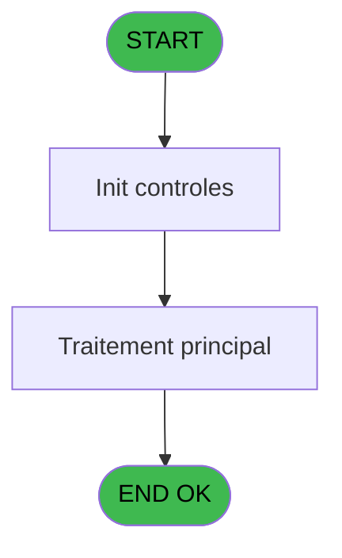
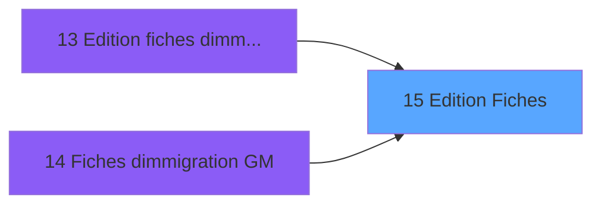

# PBP IDE 15 - Edition Fiches

> **Analyse**: Phases 1-4 2026-02-03 01:03 -> 01:03 (39s) | Assemblage 01:03
> **Pipeline**: V7.2 Enrichi
> **Structure**: 4 onglets (Resume | Ecrans | Donnees | Connexions)

<!-- TAB:Resume -->

## 1. FICHE D'IDENTITE

| Attribut | Valeur |
|----------|--------|
| Projet | PBP |
| IDE Position | 15 |
| Nom Programme | Edition Fiches |
| Fichier source | `Prg_15.xml` |
| Domaine metier | Impression |
| Taches | 1 (1 ecrans visibles) |
| Tables modifiees | 0 |
| Programmes appeles | 0 |

## 2. DESCRIPTION FONCTIONNELLE

**Edition Fiches** assure la gestion complete de ce processus, accessible depuis [Edition fiches d'immigrations (IDE 13)](PBP-IDE-13.md), [Fiches d'immigration GM (IDE 14)](PBP-IDE-14.md).

Le flux de traitement s'organise en **1 blocs fonctionnels** :

- **Traitement** (1 tache) : traitements metier divers

**Logique metier** : 3 regles identifiees couvrant conditions metier.

## 3. BLOCS FONCTIONNELS

### 3.1 Traitement (1 tache)

Traitements internes.

---

#### 15 - Veuillez Patienter ... [[ECRAN]](#ecran-t1)

**Role** : Traitement : Veuillez Patienter ....
**Ecran** : 427 x 59 DLU (MDI) | [Voir mockup](#ecran-t1)

## 5. REGLES METIER

3 regles identifiees:

### Autres (3 regles)

#### [RM-001] Condition toujours fausse (flag inactif)

| Element | Detail |
|---------|--------|
| **Condition** | `> test [F]` |
| **Si vrai** | v. fin [J] |
| **Si faux** | 'FALSE'LOG) |
| **Variables** | J (v. fin), F (> test) |
| **Expression source** | Expression 1 : `IF (> test [F],v. fin [J],'FALSE'LOG)` |
| **Exemple** | Si > test [F] → v. fin [J]. Sinon → 'FALSE'LOG) |

#### [RM-002] Si [BX]='F' alors 'F' sinon 'M')

| Element | Detail |
|---------|--------|
| **Condition** | `[BX]='F'` |
| **Si vrai** | 'F' |
| **Si faux** | 'M') |
| **Expression source** | Expression 75 : `IF ([BX]='F','F','M')` |
| **Exemple** | Si [BX]='F' → 'F'. Sinon → 'M') |

#### [RM-003] Traitement si [BQ] est renseigne

| Element | Detail |
|---------|--------|
| **Condition** | `[BQ]<>''` |
| **Si vrai** | Trim ([BU]) |
| **Si faux** | '') |
| **Expression source** | Expression 155 : `IF ([BQ]<>'',Trim ([BU]),'')` |
| **Exemple** | Si [BQ]<>'' → Trim ([BU]). Sinon → '') |

## 6. CONTEXTE

- **Appele par**: [Edition fiches d'immigrations (IDE 13)](PBP-IDE-13.md), [Fiches d'immigration GM (IDE 14)](PBP-IDE-14.md)
- **Appelle**: 0 programmes | **Tables**: 7 (W:0 R:1 L:6) | **Taches**: 1 | **Expressions**: 219

<!-- TAB:Ecrans -->

## 8. ECRANS

### 8.1 Forms visibles (1 / 1)

| # | Position | Tache | Nom | Type | Largeur | Hauteur | Bloc |
|---|----------|-------|-----|------|---------|---------|------|
| 1 | 15 | 15 | Veuillez Patienter ... | MDI | 427 | 59 | Traitement |

### 8.2 Mockups Ecrans

---

#### 15 - Veuillez Patienter ...
**Tache** : [15](#t1) | **Type** : MDI | **Dimensions** : 427 x 59 DLU
**Bloc** : Traitement | **Titre IDE** : Veuillez Patienter ...

<!-- FORM-DATA:
{
    "width":  427,
    "vFactor":  8,
    "type":  "MDI",
    "hFactor":  8,
    "controls":  [
                     {
                         "x":  0,
                         "type":  "label",
                         "var":  "",
                         "y":  0,
                         "w":  423,
                         "fmt":  "",
                         "name":  "",
                         "h":  29,
                         "color":  "",
                         "text":  "",
                         "parent":  null
                     },
                     {
                         "x":  120,
                         "type":  "label",
                         "var":  "",
                         "y":  10,
                         "w":  221,
                         "fmt":  "",
                         "name":  "",
                         "h":  8,
                         "color":  "7",
                         "text":  "Traitement en cours ...",
                         "parent":  null
                     },
                     {
                         "x":  0,
                         "type":  "label",
                         "var":  "",
                         "y":  29,
                         "w":  423,
                         "fmt":  "",
                         "name":  "",
                         "h":  27,
                         "color":  "",
                         "text":  "",
                         "parent":  null
                     },
                     {
                         "x":  44,
                         "type":  "label",
                         "var":  "",
                         "y":  34,
                         "w":  336,
                         "fmt":  "",
                         "name":  "",
                         "h":  8,
                         "color":  "",
                         "text":  "Liste des presents",
                         "parent":  null
                     },
                     {
                         "x":  4,
                         "type":  "image",
                         "var":  "",
                         "y":  2,
                         "w":  72,
                         "fmt":  "",
                         "name":  "",
                         "h":  25,
                         "color":  "",
                         "text":  "",
                         "parent":  null
                     },
                     {
                         "x":  162,
                         "type":  "edit",
                         "var":  "",
                         "y":  44,
                         "w":  70,
                         "fmt":  "",
                         "name":  "",
                         "h":  10,
                         "color":  "7",
                         "text":  "",
                         "parent":  null
                     }
                 ],
    "taskId":  "15",
    "height":  59
}
-->

<strong>Champs : 1 champs</strong>

| Pos (x,y) | Nom | Variable | Type |
|-----------|-----|----------|------|
| 162,44 | (sans nom) | - | edit |

## 9. NAVIGATION

Ecran unique: **Veuillez Patienter ...**

### 9.3 Structure hierarchique (1 tache)

| Position | Tache | Type | Dimensions | Bloc |
|----------|-------|------|------------|------|
| **15.1** | [**Veuillez Patienter ...** (15)](#t1) [mockup](#ecran-t1) | MDI | 427x59 | Traitement |

### 9.4 Algorigramme

> **Legende**: Vert = START/END OK | Rouge = END KO | Bleu = Decisions
> *Algorigramme auto-genere. Utiliser `/algorigramme` pour une synthese metier detaillee.*

<!-- TAB:Donnees -->

## 10. TABLES

### Tables utilisees (7)

| ID | Nom | Description | Type | R | W | L | Usages |
|----|-----|-------------|------|---|---|---|--------|
| 30 | gm-recherche_____gmr | Index de recherche | DB | R |   |   | 1 |
| 31 | gm-complet_______gmc |  | DB |   |   | L | 1 |
| 36 | client_gm |  | DB |   |   | L | 1 |
| 119 | tables_pays_tel_ |  | DB |   |   | L | 1 |
| 131 | fichier_validation |  | DB |   |   | L | 1 |
| 364 | pms_footer_comment |  | DB |   |   | L | 1 |
| 478 | tempo_ventes | Table temporaire ecran | TMP |   |   | L | 1 |

### Colonnes par table (2 / 1 tables avec colonnes identifiees)

Table 30 - gm-recherche_____gmr (R) - 1 usages

| Lettre | Variable | Acces | Type |
|--------|----------|-------|------|
| A | > date | R | Date |
| B | > fiche | R | Alpha |
| C | > port embarquement | R | Alpha |
| D | > adresse 1 | R | Alpha |
| E | > adresse 2 | R | Alpha |
| F | > test | R | Logical |
| G | > numero compte | R | Numeric |
| H | > filiation | R | Numeric |
| I | v. compteurs | R | Numeric |
| J | v. fin | R | Logical |
| K | nationalite | R | Alpha |
| L | pays de naissance | R | Alpha |
| M | v. pays de delivrance | R | Alpha |
| N | v. cdrt pays residence | R | Logical |
| O | v.Nom | R | Alpha |
| P | v.Prenom | R | Alpha |
| Q | v.sexe | R | Alpha |
| R | v.ard1 | R | Alpha |
| S | v.adr2 | R | Alpha |
| T | v.cp | R | Alpha |
| U | v.ville | R | Alpha |
| V | v.etat/region | R | Alpha |
| W | v.pays | R | Alpha |
| X | v.date naissance | R | Date |
| Y | v.lieu naissance | R | Alpha |
| Z | v.nationalite | R | Alpha |
| BA | v.n° passeport | R | Alpha |
| BB | v.lieu d'emission passeport | R | Alpha |
| BC | v.occupation | R | Alpha |
| BD | v.lieu d'emission visa | R | Alpha |
| BE | v.date d'emission visa | R | Date |

## 11. VARIABLES

### 11.1 Variables de session (21)

Variables persistantes pendant toute la session.

| Lettre | Nom | Type | Usage dans |
|--------|-----|------|-----------|
| I | v. compteurs | Numeric | 1x session |
| J | v. fin | Logical | 1x session |
| M | v. pays de delivrance | Alpha | 1x session |
| N | v. cdrt pays residence | Logical | 1x session |
| O | v.Nom | Alpha | 1x session |
| P | v.Prenom | Alpha | - |
| Q | v.sexe | Alpha | 1x session |
| R | v.ard1 | Alpha | 1x session |
| S | v.adr2 | Alpha | - |
| T | v.cp | Alpha | - |
| U | v.ville | Alpha | - |
| V | v.etat/region | Alpha | 1x session |
| W | v.pays | Alpha | - |
| X | v.date naissance | Date | - |
| Y | v.lieu naissance | Alpha | - |
| Z | v.nationalite | Alpha | 1x session |
| BA | v.n° passeport | Alpha | - |
| BB | v.lieu d'emission passeport | Alpha | - |
| BC | v.occupation | Alpha | - |
| BD | v.lieu d'emission visa | Alpha | - |
| BE | v.date d'emission visa | Date | - |

### 11.2 Autres (10)

Variables diverses.

| Lettre | Nom | Type | Usage dans |
|--------|-----|------|-----------|
| A | > date | Date | 1x refs |
| B | > fiche | Alpha | 3x refs |
| C | > port embarquement | Alpha | 9x refs |
| D | > adresse 1 | Alpha | 20x refs |
| E | > adresse 2 | Alpha | 20x refs |
| F | > test | Logical | 2x refs |
| G | > numero compte | Numeric | 3x refs |
| H | > filiation | Numeric | 1x refs |
| K | nationalite | Alpha | 2x refs |
| L | pays de naissance | Alpha | - |

Toutes les 31 variables (liste complete)

| Cat | Lettre | Nom Variable | Type |
|-----|--------|--------------|------|
| V. | **I** | v. compteurs | Numeric |
| V. | **J** | v. fin | Logical |
| V. | **M** | v. pays de delivrance | Alpha |
| V. | **N** | v. cdrt pays residence | Logical |
| V. | **O** | v.Nom | Alpha |
| V. | **P** | v.Prenom | Alpha |
| V. | **Q** | v.sexe | Alpha |
| V. | **R** | v.ard1 | Alpha |
| V. | **S** | v.adr2 | Alpha |
| V. | **T** | v.cp | Alpha |
| V. | **U** | v.ville | Alpha |
| V. | **V** | v.etat/region | Alpha |
| V. | **W** | v.pays | Alpha |
| V. | **X** | v.date naissance | Date |
| V. | **Y** | v.lieu naissance | Alpha |
| V. | **Z** | v.nationalite | Alpha |
| V. | **BA** | v.n° passeport | Alpha |
| V. | **BB** | v.lieu d'emission passeport | Alpha |
| V. | **BC** | v.occupation | Alpha |
| V. | **BD** | v.lieu d'emission visa | Alpha |
| V. | **BE** | v.date d'emission visa | Date |
| Autre | **A** | > date | Date |
| Autre | **B** | > fiche | Alpha |
| Autre | **C** | > port embarquement | Alpha |
| Autre | **D** | > adresse 1 | Alpha |
| Autre | **E** | > adresse 2 | Alpha |
| Autre | **F** | > test | Logical |
| Autre | **G** | > numero compte | Numeric |
| Autre | **H** | > filiation | Numeric |
| Autre | **K** | nationalite | Alpha |
| Autre | **L** | pays de naissance | Alpha |

## 12. EXPRESSIONS

**219 / 219 expressions decodees (100%)**

### 12.1 Repartition par type

| Type | Expressions | Regles |
|------|-------------|--------|
| CALCULATION | 1 | 0 |
| CAST_LOGIQUE | 2 | 5 |
| CONDITION | 66 | 2 |
| CONSTANTE | 13 | 0 |
| DATE | 12 | 0 |
| CONCATENATION | 4 | 0 |
| OTHER | 26 | 0 |
| STRING | 95 | 0 |

### 12.2 Expressions cles par type

#### CALCULATION (1 expressions)

| Type | IDE | Expression | Regle |
|------|-----|------------|-------|
| CALCULATION | 215 | `v. compteurs [I]+1` | - |

#### CAST_LOGIQUE (2 expressions)

| Type | IDE | Expression | Regle |
|------|-----|------------|-------|
| CAST_LOGIQUE | 1 | `IF (> test [F],v. fin [J],'FALSE'LOG)` | [RM-001](#rm-RM-001) |
| CAST_LOGIQUE | 5 | `'TRUE'LOG` | - |

#### CONDITION (66 expressions)

| Type | IDE | Expression | Regle |
|------|-----|------------|-------|
| CONDITION | 155 | `IF ([BQ]<>'',Trim ([BU]),'')` | [RM-003](#rm-RM-003) |
| CONDITION | 75 | `IF ([BX]='F','F','M')` | [RM-002](#rm-RM-002) |
| CONDITION | 200 | `MID (> adresse 2 [E],9,1)` | - |
| CONDITION | 201 | `MID (> adresse 2 [E],10,1)` | - |
| CONDITION | 199 | `MID (> adresse 2 [E],8,1)` | - |
| ... | | *+61 autres* | |

#### CONSTANTE (13 expressions)

| Type | IDE | Expression | Regle |
|------|-----|------------|-------|
| CONSTANTE | 169 | `'E'` | - |
| CONSTANTE | 168 | `'M'` | - |
| CONSTANTE | 167 | `'B'` | - |
| CONSTANTE | 212 | `''` | - |
| CONSTANTE | 171 | `'2'` | - |
| ... | | *+8 autres* | |

#### DATE (12 expressions)

| Type | IDE | Expression | Regle |
|------|-----|------------|-------|
| DATE | 129 | `MID (DStr ([CL],'DDMMYY'),3,1)` | - |
| DATE | 128 | `MID (DStr ([CL],'DDMMYY'),2,1)` | - |
| DATE | 127 | `MID (DStr ([CL],'DDMMYY'),1,1)` | - |
| DATE | 132 | `MID (DStr ([CL],'DDMMYY'),6,1)` | - |
| DATE | 131 | `MID (DStr ([CL],'DDMMYY'),5,1)` | - |
| ... | | *+7 autres* | |

#### CONCATENATION (4 expressions)

| Type | IDE | Expression | Regle |
|------|-----|------------|-------|
| CONCATENATION | 149 | `Trim ([AH])&'  ('&Trim ([AI])&')'` | - |
| CONCATENATION | 153 | `Trim ([BY])&'  '&Trim ([BZ])` | - |
| CONCATENATION | 219 | `Trim ([BJ])&'    '&DStr ([AG],'DD/MM/YYYY')` | - |
| CONCATENATION | 140 | `Trim ([AO])&'  '&Trim ([AP])` | - |

#### OTHER (26 expressions)

| Type | IDE | Expression | Regle |
|------|-----|------------|-------|
| OTHER | 157 | `Day ([CE])` | - |
| OTHER | 158 | `Month ([CE])` | - |
| OTHER | 159 | `Year ([CE])` | - |
| OTHER | 150 | `[AE]` | - |
| OTHER | 151 | `[BP]` | - |
| ... | | *+21 autres* | |

#### STRING (95 expressions)

| Type | IDE | Expression | Regle |
|------|-----|------------|-------|
| STRING | 88 | `MID (Trim ([CH]),8,1)` | - |
| STRING | 89 | `MID (Trim ([CH]),9,1)` | - |
| STRING | 87 | `MID (Trim ([CH]),7,1)` | - |
| STRING | 85 | `MID (Trim ([CH]),5,1)` | - |
| STRING | 86 | `MID (Trim ([CH]),6,1)` | - |
| ... | | *+90 autres* | |

### 12.3 Toutes les expressions (219)

Voir les 219 expressions

#### CALCULATION (1)

| IDE | Expression Decodee |
|-----|-------------------|
| 215 | `v. compteurs [I]+1` |

#### CAST_LOGIQUE (2)

| IDE | Expression Decodee |
|-----|-------------------|
| 1 | `IF (> test [F],v. fin [J],'FALSE'LOG)` |
| 5 | `'TRUE'LOG` |

#### CONDITION (66)

| IDE | Expression Decodee |
|-----|-------------------|
| 75 | `IF ([BX]='F','F','M')` |
| 76 | `IF ([BX]='F','E','A')` |
| 77 | `IF ([BX]='F','M','L')` |
| 78 | `IF ([BX]='F','A','E')` |
| 79 | `IF ([BX]='F','L','')` |
| 80 | `IF ([BX]='F','E','')` |
| 155 | `IF ([BQ]<>'',Trim ([BU]),'')` |
| 2 | `CndRange (> numero compte [G]<>0,> numero compte [G])` |
| 3 | `CndRange (> numero compte [G]<>0,> filiation [H])` |
| 4 | `> test [F]` |
| 6 | `> fiche [B]='1'` |
| 7 | `> fiche [B]='2' AND [BN]` |
| 8 | `> fiche [B]='3' AND NOT ([BN])` |
| 135 | `[BX]=ASCIIChr (12)` |
| 136 | `[BX]=ASCIIChr (11)` |
| 172 | `MID (> adresse 1 [D],1,1)` |
| 173 | `MID (> adresse 1 [D],2,1)` |
| 174 | `MID (> adresse 1 [D],3,1)` |
| 175 | `MID (> adresse 1 [D],4,1)` |
| 176 | `MID (> adresse 1 [D],5,1)` |
| 177 | `MID (> adresse 1 [D],6,1)` |
| 178 | `MID (> adresse 1 [D],7,1)` |
| 179 | `MID (> adresse 1 [D],8,1)` |
| 180 | `MID (> adresse 1 [D],9,1)` |
| 181 | `MID (> adresse 1 [D],10,1)` |
| 182 | `MID (> adresse 1 [D],11,1)` |
| 183 | `MID (> adresse 1 [D],12,1)` |
| 184 | `MID (> adresse 1 [D],13,1)` |
| 185 | `MID (> adresse 1 [D],14,1)` |
| 186 | `MID (> adresse 1 [D],15,1)` |
| 187 | `MID (> adresse 1 [D],16,1)` |
| 188 | `MID (> adresse 1 [D],17,1)` |
| 189 | `MID (> adresse 1 [D],18,1)` |
| 190 | `MID (> adresse 1 [D],19,1)` |
| 191 | `MID (> adresse 1 [D],20,1)` |
| 192 | `MID (> adresse 2 [E],1,1)` |
| 193 | `MID (> adresse 2 [E],2,1)` |
| 194 | `MID (> adresse 2 [E],3,1)` |
| 195 | `MID (> adresse 2 [E],4,1)` |
| 196 | `MID (> adresse 2 [E],5,1)` |
| 197 | `MID (> adresse 2 [E],6,1)` |
| 198 | `MID (> adresse 2 [E],7,1)` |
| 199 | `MID (> adresse 2 [E],8,1)` |
| 200 | `MID (> adresse 2 [E],9,1)` |
| 201 | `MID (> adresse 2 [E],10,1)` |
| 202 | `MID (> adresse 2 [E],11,1)` |
| 203 | `MID (> adresse 2 [E],12,1)` |
| 204 | `MID (> adresse 2 [E],13,1)` |
| 205 | `MID (> adresse 2 [E],14,1)` |
| 206 | `MID (> adresse 2 [E],15,1)` |
| 207 | `MID (> adresse 2 [E],16,1)` |
| 208 | `MID (> adresse 2 [E],17,1)` |
| 209 | `MID (> adresse 2 [E],18,1)` |
| 210 | `MID (> adresse 2 [E],19,1)` |
| 211 | `MID (> adresse 2 [E],20,1)` |
| 213 | `Range (> date [A],v.sexe [Q],v.ard1 [R]) AND v.etat/region [V]='O' OR > numero compte [G]<>0` |
| 214 | `INIGet ('[MAGIC_LOGICAL_NAMES]preview')='O'` |
| 105 | `MID (Trim (> port embarquement [C]),1,1)` |
| 106 | `MID (Trim (> port embarquement [C]),2,1)` |
| 107 | `MID (Trim (> port embarquement [C]),3,1)` |
| 108 | `MID (Trim (> port embarquement [C]),4,1)` |
| 109 | `MID (Trim (> port embarquement [C]),5,1)` |
| 110 | `MID (Trim (> port embarquement [C]),6,1)` |
| 111 | `MID (Trim (> port embarquement [C]),7,1)` |
| 112 | `MID (Trim (> port embarquement [C]),8,1)` |
| 113 | `MID (Trim (> port embarquement [C]),9,1)` |

#### CONSTANTE (13)

| IDE | Expression Decodee |
|-----|-------------------|
| 9 | `'+'` |
| 10 | `'F'` |
| 133 | `'C'` |
| 134 | `'GM'` |
| 164 | `'C'` |
| 165 | `'L'` |
| 166 | `'U'` |
| 167 | `'B'` |
| 168 | `'M'` |
| 169 | `'E'` |
| 170 | `'D'` |
| 171 | `'2'` |
| 212 | `''` |

#### DATE (12)

| IDE | Expression Decodee |
|-----|-------------------|
| 48 | `MID (DStr ([CE],'DDMMYY'),1,1)` |
| 49 | `MID (DStr ([CE],'DDMMYY'),2,1)` |
| 50 | `MID (DStr ([CE],'DDMMYY'),3,1)` |
| 51 | `MID (DStr ([CE],'DDMMYY'),4,1)` |
| 52 | `MID (DStr ([CE],'DDMMYY'),5,1)` |
| 53 | `MID (DStr ([CE],'DDMMYY'),6,1)` |
| 127 | `MID (DStr ([CL],'DDMMYY'),1,1)` |
| 128 | `MID (DStr ([CL],'DDMMYY'),2,1)` |
| 129 | `MID (DStr ([CL],'DDMMYY'),3,1)` |
| 130 | `MID (DStr ([CL],'DDMMYY'),4,1)` |
| 131 | `MID (DStr ([CL],'DDMMYY'),5,1)` |
| 132 | `MID (DStr ([CL],'DDMMYY'),6,1)` |

#### CONCATENATION (4)

| IDE | Expression Decodee |
|-----|-------------------|
| 219 | `Trim ([BJ])&'    '&DStr ([AG],'DD/MM/YYYY')` |
| 140 | `Trim ([AO])&'  '&Trim ([AP])` |
| 149 | `Trim ([AH])&'  ('&Trim ([AI])&')'` |
| 153 | `Trim ([BY])&'  '&Trim ([BZ])` |

#### OTHER (26)

| IDE | Expression Decodee |
|-----|-------------------|
| 11 | `[AD]` |
| 12 | `[AI]` |
| 137 | `v.nationalite [Z]` |
| 138 | `[AA]` |
| 139 | `v.Nom [O]` |
| 141 | `[AK]` |
| 142 | `[AL]` |
| 143 | `[AM]` |
| 144 | `[BU]` |
| 145 | `[AB]` |
| 146 | `[BF]` |
| 147 | `[AQ]` |
| 148 | `[AF]` |
| 150 | `[AE]` |
| 151 | `[BP]` |
| 152 | `[BO]` |
| 157 | `Day ([CE])` |
| 158 | `Month ([CE])` |
| 159 | `Year ([CE])` |
| 160 | `[BV]` |
| 161 | `nationalite [K]` |
| 162 | `v. pays de delivrance [M]` |
| 163 | `v. cdrt pays residence [N]` |
| 216 | `GetParam ('LANGUE')` |
| 217 | `[AU]` |
| 218 | `[BQ]` |

#### STRING (95)

| IDE | Expression Decodee |
|-----|-------------------|
| 13 | `MID (Trim ([BV]),1,1)` |
| 14 | `MID (Trim ([BV]),2,1)` |
| 15 | `MID (Trim ([BV]),3,1)` |
| 16 | `MID (Trim ([BV]),4,1)` |
| 17 | `MID (Trim ([BV]),5,1)` |
| 18 | `MID (Trim ([BV]),6,1)` |
| 19 | `MID (Trim ([BV]),7,1)` |
| 20 | `MID (Trim ([BV]),8,1)` |
| 21 | `MID (Trim ([BV]),9,1)` |
| 22 | `MID (Trim ([BV]),10,1)` |
| 23 | `MID (Trim ([BV]),11,1)` |
| 24 | `MID (Trim ([BV]),12,1)` |
| 25 | `MID (Trim ([BV]),13,1)` |
| 26 | `MID (Trim ([BV]),14,1)` |
| 27 | `MID (Trim ([BV]),15,1)` |
| 28 | `MID (Trim ([BV]),16,1)` |
| 29 | `MID (Trim ([BV]),17,1)` |
| 30 | `MID (Trim ([BV]),18,1)` |
| 31 | `MID (Trim ([BV]),19,1)` |
| 32 | `MID (Trim ([BV]),20,1)` |
| 33 | `MID (Trim ([BV]),21,1)` |
| 34 | `MID (Trim ([BW]),1,1)` |
| 35 | `MID (Trim ([BW]),2,1)` |
| 36 | `MID (Trim ([BW]),3,1)` |
| 37 | `MID (Trim ([BW]),4,1)` |
| 38 | `MID (Trim ([BW]),5,1)` |
| 39 | `MID (Trim ([BW]),6,1)` |
| 40 | `MID (Trim ([BW]),7,1)` |
| 41 | `MID (Trim ([BW]),8,1)` |
| 42 | `MID (Trim ([BW]),9,1)` |
| 43 | `MID (Trim ([BW]),10,1)` |
| 44 | `MID (Trim ([BW]),11,1)` |
| 45 | `MID (Trim ([BW]),12,1)` |
| 46 | `MID (Trim ([BW]),13,1)` |
| 47 | `MID (Trim ([BW]),14,1)` |
| 54 | `MID (Trim ([CF]),1,1)` |
| 55 | `MID (Trim ([CF]),2,1)` |
| 56 | `MID (Trim ([CF]),3,1)` |
| 57 | `MID (Trim ([CF]),4,1)` |
| 58 | `MID (Trim ([CF]),5,1)` |
| 59 | `MID (Trim ([CF]),6,1)` |
| 60 | `MID (Trim ([CF]),7,1)` |
| 61 | `MID (Trim ([CF]),8,1)` |
| 62 | `MID (Trim ([CF]),9,1)` |
| 63 | `MID (Trim ([CF]),10,1)` |
| 64 | `MID (Trim ([CF]),11,1)` |
| 65 | `MID (Trim ([CF]),12,1)` |
| 66 | `MID (Trim ([CF]),13,1)` |
| 67 | `MID (Trim ([CF]),14,1)` |
| 68 | `MID (Trim ([CF]),15,1)` |
| 69 | `MID (Trim ([CF]),16,1)` |
| 70 | `MID (Trim ([CF]),17,1)` |
| 71 | `MID (Trim ([CF]),18,1)` |
| 72 | `MID (Trim ([CF]),19,1)` |
| 73 | `MID (Trim ([CF]),20,1)` |
| 74 | `MID (Trim ([CF]),21,1)` |
| 81 | `MID (Trim ([CH]),1,1)` |
| 82 | `MID (Trim ([CH]),2,1)` |
| 83 | `MID (Trim ([CH]),3,1)` |
| 84 | `MID (Trim ([CH]),4,1)` |
| 85 | `MID (Trim ([CH]),5,1)` |
| 86 | `MID (Trim ([CH]),6,1)` |
| 87 | `MID (Trim ([CH]),7,1)` |
| 88 | `MID (Trim ([CH]),8,1)` |
| 89 | `MID (Trim ([CH]),9,1)` |
| 90 | `MID (Trim ([CH]),10,1)` |
| 91 | `MID (Trim ([CH]),11,1)` |
| 92 | `MID (Trim ([CH]),12,1)` |
| 93 | `MID (Trim ([CD]),1,1)` |
| 94 | `MID (Trim ([CD]),2,1)` |
| 95 | `MID (Trim ([CD]),3,1)` |
| 96 | `MID (Trim ([CD]),4,1)` |
| 97 | `MID (Trim ([CD]),5,1)` |
| 98 | `MID (Trim ([CD]),6,1)` |
| 99 | `MID (Trim ([CD]),7,1)` |
| 100 | `MID (Trim ([CD]),8,1)` |
| 101 | `MID (Trim ([CD]),9,1)` |
| 102 | `MID (Trim ([CD]),10,1)` |
| 103 | `MID (Trim ([CD]),11,1)` |
| 104 | `MID (Trim ([CD]),12,1)` |
| 114 | `MID (Trim ([CK]),1,1)` |
| 115 | `MID (Trim ([CK]),2,1)` |
| 116 | `MID (Trim ([CK]),3,1)` |
| 117 | `MID (Trim ([CK]),4,1)` |
| 118 | `MID (Trim ([CK]),5,1)` |
| 119 | `MID (Trim ([CK]),6,1)` |
| 120 | `MID (Trim ([CK]),7,1)` |
| 121 | `MID (Trim ([CK]),8,1)` |
| 122 | `MID (Trim ([CK]),9,1)` |
| 123 | `MID (Trim ([CK]),10,1)` |
| 124 | `MID (Trim ([CK]),11,1)` |
| 125 | `MID (Trim ([CK]),12,1)` |
| 126 | `MID (Trim ([CK]),13,1)` |
| 154 | `Trim ([CB])` |
| 156 | `Trim ([CA])` |

<!-- TAB:Connexions -->

## 13. GRAPHE D'APPELS

### 13.1 Chaine depuis Main (Callers)

Main -> ... -> [Edition fiches d'immigrations (IDE 13)](PBP-IDE-13.md) -> **Edition Fiches (IDE 15)**

Main -> ... -> [Fiches d'immigration GM (IDE 14)](PBP-IDE-14.md) -> **Edition Fiches (IDE 15)**

### 13.2 Callers

| IDE | Nom Programme | Nb Appels |
|-----|---------------|-----------|
| [13](PBP-IDE-13.md) | Edition fiches d'immigrations | 2 |
| [14](PBP-IDE-14.md) | Fiches d'immigration GM | 1 |

### 13.3 Callees (programmes appeles)

### 13.4 Detail Callees avec contexte

| IDE | Nom Programme | Appels | Contexte |
|-----|---------------|--------|----------|
| - | (aucun) | - | - |

## 14. RECOMMANDATIONS MIGRATION

### 14.1 Profil du programme

| Metrique | Valeur | Impact migration |
|----------|--------|-----------------|
| Lignes de logique | 166 | Programme compact |
| Expressions | 219 | Beaucoup de logique conditionnelle |
| Tables WRITE | 0 | Impact faible |
| Sous-programmes | 0 | Peu de dependances |
| Ecrans visibles | 1 | Ecran unique ou traitement batch |
| Code desactive | 0% (0 / 166) | Code sain |
| Regles metier | 3 | Quelques regles a preserver |

### 14.2 Plan de migration par bloc

#### Traitement (1 tache: 1 ecran, 0 traitement)

- **Strategie** : 1 composant(s) UI (Razor/React) avec formulaires et validation.
- Decomposer les taches en services unitaires testables.

### 14.3 Dependances critiques

| Dependance | Type | Appels | Impact |
|------------|------|--------|--------|

---
*Spec DETAILED generee par Pipeline V7.2 - 2026-02-03 01:03*
