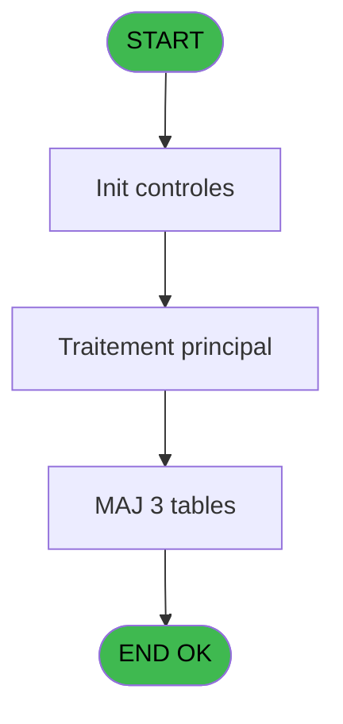
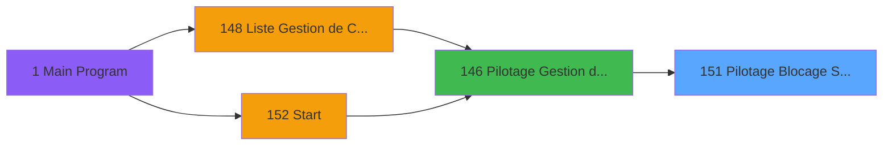

# PBP IDE 151 - Pilotage Blocage Suppl

> **Analyse**: Phases 1-4 2026-02-03 15:30 -> 15:30 (10s) | Assemblage 15:30
> **Pipeline**: V7.2 Enrichi
> **Structure**: 4 onglets (Resume | Ecrans | Donnees | Connexions)

<!-- TAB:Resume -->

## 1. FICHE D'IDENTITE

| Attribut | Valeur |
|----------|--------|
| Projet | PBP |
| IDE Position | 151 |
| Nom Programme | Pilotage Blocage Suppl |
| Fichier source | `Prg_151.xml` |
| Dossier IDE | Initialisation |
| Taches | 6 (0 ecrans visibles) |
| Tables modifiees | 3 |
| Programmes appeles | 0 |

## 2. DESCRIPTION FONCTIONNELLE

**Pilotage Blocage Suppl** assure la gestion complete de ce processus, accessible depuis [Pilotage Gestion de Crise (IDE 146)](PBP-IDE-146.md).

Le flux de traitement s'organise en **2 blocs fonctionnels** :

- **Traitement** (5 taches) : traitements metier divers
- **Creation** (1 tache) : insertion d'enregistrements en base (mouvements, prestations)

**Donnees modifiees** : 3 tables en ecriture (depot_garantie___dga, log_traitement_auto, fiche_police).

Detail : phases du traitement

#### Phase 1 : Traitement (5 taches)

- **151** - Pilotage Blocage Suppl
- **151.1** - (sans nom)
- **151.1.1** - (sans nom)
- **151.2** - Mise à jour log
- **151.3** - update garantie

#### Phase 2 : Creation (1 tache)

- **151.1.2** - Creation Envoi Mail

#### Tables impactees

| Table | Operations | Role metier |
|-------|-----------|-------------|
| fiche_police | **W**/L (2 usages) | Donnees police/session |
| depot_garantie___dga | **W**/L (2 usages) | Depots et garanties |
| log_traitement_auto | **W** (1 usages) |  |

## 3. BLOCS FONCTIONNELS

### 3.1 Traitement (5 taches)

Traitements internes.

---

#### 151 - Pilotage Blocage Suppl

**Role** : Traitement : Pilotage Blocage Suppl.

4 sous-taches directes

| Tache | Nom | Bloc |
|-------|-----|------|
| [151.1](#t2) | (sans nom) | Traitement |
| [151.1.1](#t3) | (sans nom) | Traitement |
| [151.2](#t5) | Mise à jour log | Traitement |
| [151.3](#t7) | update garantie | Traitement |

---

#### 151.1 - (sans nom)

**Role** : Traitement interne.

---

#### 151.1.1 - (sans nom)

**Role** : Traitement interne.

---

#### 151.2 - Mise à jour log

**Role** : Traitement : Mise à jour log.

---

#### 151.3 - update garantie

**Role** : Traitement : update garantie.

### 3.2 Creation (1 tache)

Insertion de nouveaux enregistrements en base.

---

#### 151.1.2 - Creation Envoi Mail

**Role** : Creation d'enregistrement : Creation Envoi Mail.

## 5. REGLES METIER

*(Aucune regle metier identifiee)*

## 6. CONTEXTE

- **Appele par**: [Pilotage Gestion de Crise (IDE 146)](PBP-IDE-146.md)
- **Appelle**: 0 programmes | **Tables**: 6 (W:3 R:2 L:3) | **Taches**: 6 | **Expressions**: 15

<!-- TAB:Ecrans -->

## 8. ECRANS

*(Programme sans ecran visible)*

## 9. NAVIGATION

### 9.3 Structure hierarchique (6 taches)

| Position | Tache | Type | Dimensions | Bloc |
|----------|-------|------|------------|------|
| **151.1** | [**Pilotage Blocage Suppl** (151)](#t1) | - | - | Traitement |
| 151.1.1 | [(sans nom) (151.1)](#t2) | - | - | |
| 151.1.2 | [(sans nom) (151.1.1)](#t3) | - | - | |
| 151.1.3 | [Mise à jour log (151.2)](#t5) | - | - | |
| 151.1.4 | [update garantie (151.3)](#t7) | - | - | |
| **151.2** | [**Creation Envoi Mail** (151.1.2)](#t4) | - | - | Creation |

### 9.4 Algorigramme

> **Legende**: Vert = START/END OK | Rouge = END KO | Bleu = Decisions
> *Algorigramme auto-genere. Utiliser `/algorigramme` pour une synthese metier detaillee.*

<!-- TAB:Donnees -->

## 10. TABLES

### Tables utilisees (6)

| ID | Nom | Description | Type | R | W | L | Usages |
|----|-----|-------------|------|---|---|---|--------|
| 34 | hebergement______heb | Hebergement (chambres) | DB | R |   |   | 1 |
| 39 | depot_garantie___dga | Depots et garanties | DB |   | **W** | L | 2 |
| 47 | compte_gm________cgm | Comptes GM (generaux) | DB |   |   | L | 1 |
| 372 | pv_budget |  | DB | R |   |   | 1 |
| 913 | log_traitement_auto |  | DB |   | **W** |   | 1 |
| 936 | fiche_police | Donnees police/session | DB |   | **W** | L | 2 |

### Colonnes par table (1 / 5 tables avec colonnes identifiees)

Table 34 - hebergement______heb (R) - 1 usages

*Table utilisee uniquement en Link ou aucune colonne Real identifiee dans le DataView.*

Table 39 - depot_garantie___dga (**W**/L) - 2 usages

*Table utilisee uniquement en Link ou aucune colonne Real identifiee dans le DataView.*

Table 372 - pv_budget (R) - 1 usages

*Table utilisee uniquement en Link ou aucune colonne Real identifiee dans le DataView.*

Table 913 - log_traitement_auto (**W**) - 1 usages

*Table utilisee uniquement en Link ou aucune colonne Real identifiee dans le DataView.*

Table 936 - fiche_police (**W**/L) - 2 usages

*Table utilisee uniquement en Link ou aucune colonne Real identifiee dans le DataView.*

## 11. VARIABLES

### 11.1 Variables de session (6)

Variables persistantes pendant toute la session.

| Lettre | Nom | Type | Usage dans |
|--------|-----|------|-----------|
| H | v. API Access Token | Unicode | 1x session |
| I | v. Token Expiration Time | Time | - |
| J | v. Sucess | Logical | - |
| K | v. ErrorMessage | Unicode | - |
| L | v. Date | Date | - |
| M | V. Time | Time | - |

### 11.2 Autres (7)

Variables diverses.

| Lettre | Nom | Type | Usage dans |
|--------|-----|------|-----------|
| A | compte | Numeric | - |
| B | filiation | Numeric | 1x refs |
| C | montant_ | Numeric | 1x refs |
| D | type_card | Unicode | - |
| E | nom | Unicode | 1x refs |
| F | prenom | Unicode | - |
| G | alias | Unicode | - |

## 12. EXPRESSIONS

**15 / 15 expressions decodees (100%)**

### 12.1 Repartition par type

| Type | Expressions | Regles |
|------|-------------|--------|
| CONSTANTE | 2 | 0 |
| FORMAT | 1 | 0 |
| DATE | 1 | 0 |
| OTHER | 7 | 0 |
| STRING | 4 | 0 |

### 12.2 Expressions cles par type

#### CONSTANTE (2 expressions)

| Type | IDE | Expression | Regle |
|------|-----|------------|-------|
| CONSTANTE | 11 | `''` | - |
| CONSTANTE | 1 | `'BLO'` | - |

#### FORMAT (1 expressions)

| Type | IDE | Expression | Regle |
|------|-----|------------|-------|
| FORMAT | 6 | `DStr(Date()+1,'YYYYMMDD')` | - |

#### DATE (1 expressions)

| Type | IDE | Expression | Regle |
|------|-----|------------|-------|
| DATE | 7 | `Date()` | - |

#### OTHER (7 expressions)

| Type | IDE | Expression | Regle |
|------|-----|------------|-------|
| OTHER | 8 | `Time()` | - |
| OTHER | 9 | `[U]` | - |
| OTHER | 10 | `montant_ [C]` | - |
| OTHER | 5 | `[N]` | - |
| OTHER | 2 | `filiation [B]` | - |
| ... | | *+2 autres* | |

#### STRING (4 expressions)

| Type | IDE | Expression | Regle |
|------|-----|------------|-------|
| STRING | 14 | `Trim({1,8})` | - |
| STRING | 15 | `Trim({1,9})` | - |
| STRING | 12 | `Trim({1,6})` | - |
| STRING | 13 | `Trim({1,7})` | - |

<!-- TAB:Connexions -->

## 13. GRAPHE D'APPELS

### 13.1 Chaine depuis Main (Callers)

Main -> ... -> [Pilotage Gestion de Crise (IDE 146)](PBP-IDE-146.md) -> **Pilotage Blocage Suppl (IDE 151)**

### 13.2 Callers

| IDE | Nom Programme | Nb Appels |
|-----|---------------|-----------|
| [146](PBP-IDE-146.md) | Pilotage Gestion de Crise | 1 |

### 13.3 Callees (programmes appeles)

### 13.4 Detail Callees avec contexte

| IDE | Nom Programme | Appels | Contexte |
|-----|---------------|--------|----------|
| - | (aucun) | - | - |

## 14. RECOMMANDATIONS MIGRATION

### 14.1 Profil du programme

| Metrique | Valeur | Impact migration |
|----------|--------|-----------------|
| Lignes de logique | 97 | Programme compact |
| Expressions | 15 | Peu de logique |
| Tables WRITE | 3 | Impact modere |
| Sous-programmes | 0 | Peu de dependances |
| Ecrans visibles | 0 | Ecran unique ou traitement batch |
| Code desactive | 1% (1 / 97) | Code sain |
| Regles metier | 0 | Pas de regle identifiee |

### 14.2 Plan de migration par bloc

#### Traitement (5 taches: 0 ecran, 5 traitements)

- **Strategie** : 5 service(s) backend injectable(s) (Domain Services).
- Decomposer les taches en services unitaires testables.

#### Creation (1 tache: 0 ecran, 1 traitement)

- **Strategie** : Repository pattern avec Entity Framework Core.
- Insertion via `IRepository<T>.CreateAsync()`

### 14.3 Dependances critiques

| Dependance | Type | Appels | Impact |
|------------|------|--------|--------|
| depot_garantie___dga | Table WRITE (Database) | 1x | Schema + repository |
| log_traitement_auto | Table WRITE (Database) | 1x | Schema + repository |
| fiche_police | Table WRITE (Database) | 1x | Schema + repository |

---
*Spec DETAILED generee par Pipeline V7.2 - 2026-02-03 15:30*
