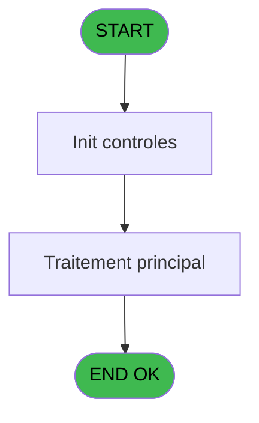
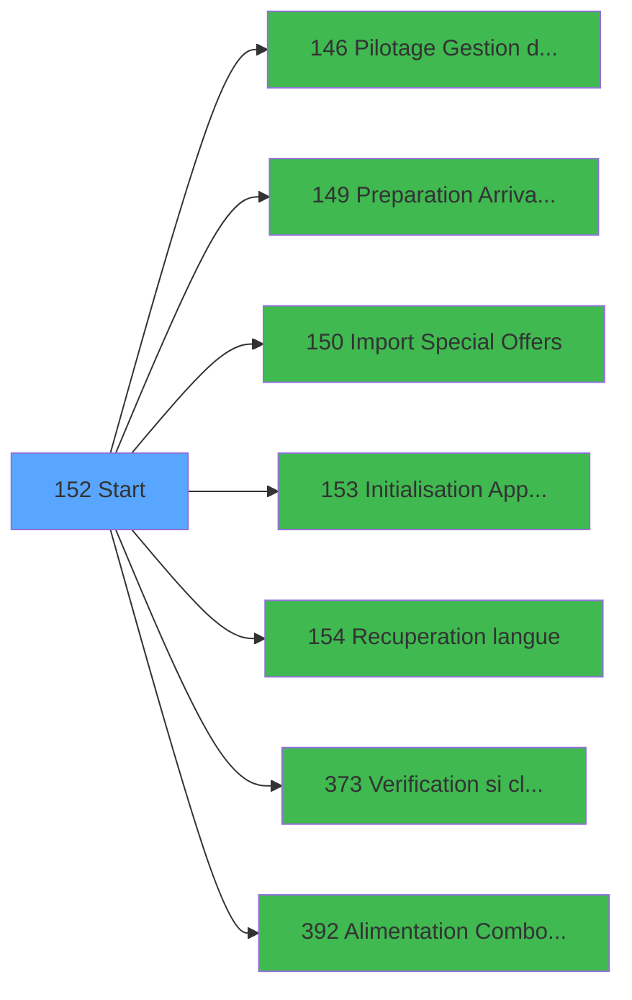

# PBP IDE 152 - Start

> **Analyse**: Phases 1-4 2026-02-03 15:30 -> 15:30 (11s) | Assemblage 15:30
> **Pipeline**: V7.2 Enrichi
> **Structure**: 4 onglets (Resume | Ecrans | Donnees | Connexions)

<!-- TAB:Resume -->

## 1. FICHE D'IDENTITE

| Attribut | Valeur |
|----------|--------|
| Projet | PBP |
| IDE Position | 152 |
| Nom Programme | Start |
| Fichier source | `Prg_152.xml` |
| Dossier IDE | Initialisation |
| Taches | 2 (0 ecrans visibles) |
| Tables modifiees | 0 |
| Programmes appeles | 7 |

## 2. DESCRIPTION FONCTIONNELLE

**Start** assure la gestion complete de ce processus, accessible depuis [Main Program (IDE 1)](PBP-IDE-1.md).

Le flux de traitement s'organise en **1 blocs fonctionnels** :

- **Traitement** (2 taches) : traitements metier divers

## 3. BLOCS FONCTIONNELS

### 3.1 Traitement (2 taches)

Traitements internes.

---

#### 152 - Start

**Role** : Traitement : Start.
**Delegue a** : [Pilotage Gestion de Crise (IDE 146)](PBP-IDE-146.md), [Preparation Arrivants/Presents (IDE 149)](PBP-IDE-149.md), [Import Special Offers (IDE 150)](PBP-IDE-150.md)

---

#### 152.1 - calc nb lieu sejour

**Role** : Traitement : calc nb lieu sejour.
**Delegue a** : [Pilotage Gestion de Crise (IDE 146)](PBP-IDE-146.md), [Preparation Arrivants/Presents (IDE 149)](PBP-IDE-149.md), [Import Special Offers (IDE 150)](PBP-IDE-150.md)

## 5. REGLES METIER

*(Aucune regle metier identifiee)*

## 6. CONTEXTE

- **Appele par**: [Main Program (IDE 1)](PBP-IDE-1.md)
- **Appelle**: 7 programmes | **Tables**: 4 (W:0 R:2 L:2) | **Taches**: 2 | **Expressions**: 17

<!-- TAB:Ecrans -->

## 8. ECRANS

*(Programme sans ecran visible)*

## 9. NAVIGATION

### 9.3 Structure hierarchique (2 taches)

| Position | Tache | Type | Dimensions | Bloc |
|----------|-------|------|------------|------|
| **152.1** | [**Start** (152)](#t1) | MDI | - | Traitement |
| 152.1.1 | [calc nb lieu sejour (152.1)](#t12) | - | - | |

### 9.4 Algorigramme

> **Legende**: Vert = START/END OK | Rouge = END KO | Bleu = Decisions
> *Algorigramme auto-genere. Utiliser `/algorigramme` pour une synthese metier detaillee.*

<!-- TAB:Donnees -->

## 10. TABLES

### Tables utilisees (4)

| ID | Nom | Description | Type | R | W | L | Usages |
|----|-----|-------------|------|---|---|---|--------|
| 69 | initialisation___ini |  | DB | R |   |   | 1 |
| 81 | societe__________soc |  | DB |   |   | L | 1 |
| 118 | tables_imports |  | DB | R |   |   | 1 |
| 728 | arc_cc_total |  | DB |   |   | L | 1 |

### Colonnes par table (0 / 2 tables avec colonnes identifiees)

Table 69 - initialisation___ini (R) - 1 usages

*Table utilisee uniquement en Link ou aucune colonne Real identifiee dans le DataView.*

Table 118 - tables_imports (R) - 1 usages

*Table utilisee uniquement en Link ou aucune colonne Real identifiee dans le DataView.*

## 11. VARIABLES

*(Programme sans variables locales mappees)*

## 12. EXPRESSIONS

**17 / 17 expressions decodees (100%)**

### 12.1 Repartition par type

| Type | Expressions | Regles |
|------|-------------|--------|
| CONCATENATION | 1 | 0 |
| CONSTANTE | 2 | 0 |
| DATE | 1 | 0 |
| CAST_LOGIQUE | 2 | 0 |
| OTHER | 6 | 0 |
| CONDITION | 3 | 0 |
| NEGATION | 1 | 0 |
| FORMAT | 1 | 0 |

### 12.2 Expressions cles par type

#### CONCATENATION (1 expressions)

| Type | IDE | Expression | Regle |
|------|-----|------------|-------|
| CONCATENATION | 6 | `'cmd /c mkdir '&Trim (INIGet ('[MAGIC_LOGICAL_NAMES]club_exportdata'))&'Trsft'` | - |

#### CONSTANTE (2 expressions)

| Type | IDE | Expression | Regle |
|------|-----|------------|-------|
| CONSTANTE | 9 | `23` | - |
| CONSTANTE | 1 | `'C'` | - |

#### DATE (1 expressions)

| Type | IDE | Expression | Regle |
|------|-----|------------|-------|
| DATE | 8 | `Date ()-1` | - |

#### CAST_LOGIQUE (2 expressions)

| Type | IDE | Expression | Regle |
|------|-----|------------|-------|
| CAST_LOGIQUE | 10 | `'TRUE'LOG` | - |
| CAST_LOGIQUE | 2 | `MnuShow ('GREEC','FALSE'LOG)` | - |

#### OTHER (6 expressions)

| Type | IDE | Expression | Regle |
|------|-----|------------|-------|
| OTHER | 13 | `SetParam ('VERIF_USERB','O')` | - |
| OTHER | 14 | `[I]` | - |
| OTHER | 16 | `DbDel ('{619,2}'DSOURCE,'')` | - |
| OTHER | 3 | `SetParam ('FISCALITEGREC',IF ([B],'O','N'))` | - |
| OTHER | 11 | `SetParam ('SOCIETE','C')` | - |
| ... | | *+1 autres* | |

#### CONDITION (3 expressions)

| Type | IDE | Expression | Regle |
|------|-----|------------|-------|
| CONDITION | 4 | `Trim (GetParam ('FISCALITEGREC'))='N'` | - |
| CONDITION | 17 | `[C]<>'N' AND [C]<>'G'` | - |
| CONDITION | 5 | `INIGet ('[MAGIC_LOGICAL_NAMES]RunMode')='B'` | - |

#### NEGATION (1 expressions)

| Type | IDE | Expression | Regle |
|------|-----|------------|-------|
| NEGATION | 7 | `NOT (FileExist (Trim (INIGet ('[MAGIC_LOGICAL_NAMES]club_exportdata'))&'Trsft'))` | - |

#### FORMAT (1 expressions)

| Type | IDE | Expression | Regle |
|------|-----|------------|-------|
| FORMAT | 15 | `'N###########'&IF([L]<>0,'.'&Trim(Str([L],'1')),'')&'CZ'` | - |

<!-- TAB:Connexions -->

## 13. GRAPHE D'APPELS

### 13.1 Chaine depuis Main (Callers)

Main -> ... -> [Main Program (IDE 1)](PBP-IDE-1.md) -> **Start (IDE 152)**

### 13.2 Callers

| IDE | Nom Programme | Nb Appels |
|-----|---------------|-----------|
| [1](PBP-IDE-1.md) | Main Program | 1 |

### 13.3 Callees (programmes appeles)

### 13.4 Detail Callees avec contexte

| IDE | Nom Programme | Appels | Contexte |
|-----|---------------|--------|----------|
| [146](PBP-IDE-146.md) | Pilotage Gestion de Crise | 1 | Gestion moyens paiement |
| [149](PBP-IDE-149.md) | Preparation Arrivants/Presents | 1 | Sous-programme |
| [150](PBP-IDE-150.md) | Import Special Offers | 1 | Sous-programme |
| [153](PBP-IDE-153.md) | Initialisation Application | 1 | Reinitialisation |
| [154](PBP-IDE-154.md) | Recuperation langue | 1 | Recuperation donnees |
| [373](PBP-IDE-373.md) | Verification si client/serveur | 1 | Controle/validation |
| [392](PBP-IDE-392.md) | Alimentation Combos LIEU SEJ | 1 | Sous-programme |

## 14. RECOMMANDATIONS MIGRATION

### 14.1 Profil du programme

| Metrique | Valeur | Impact migration |
|----------|--------|-----------------|
| Lignes de logique | 46 | Programme compact |
| Expressions | 17 | Peu de logique |
| Tables WRITE | 0 | Impact faible |
| Sous-programmes | 7 | Dependances moderees |
| Ecrans visibles | 0 | Ecran unique ou traitement batch |
| Code desactive | 4.3% (2 / 46) | Code sain |
| Regles metier | 0 | Pas de regle identifiee |

### 14.2 Plan de migration par bloc

#### Traitement (2 taches: 0 ecran, 2 traitements)

- **Strategie** : 2 service(s) backend injectable(s) (Domain Services).
- 7 sous-programme(s) a migrer ou a reutiliser depuis les services existants.
- Decomposer les taches en services unitaires testables.

### 14.3 Dependances critiques

| Dependance | Type | Appels | Impact |
|------------|------|--------|--------|
| [Recuperation langue (IDE 154)](PBP-IDE-154.md) | Sous-programme | 1x | Normale - Recuperation donnees |
| [Verification si client/serveur (IDE 373)](PBP-IDE-373.md) | Sous-programme | 1x | Normale - Controle/validation |
| [Alimentation Combos LIEU SEJ (IDE 392)](PBP-IDE-392.md) | Sous-programme | 1x | Normale - Sous-programme |
| [Initialisation Application (IDE 153)](PBP-IDE-153.md) | Sous-programme | 1x | Normale - Reinitialisation |
| [Pilotage Gestion de Crise (IDE 146)](PBP-IDE-146.md) | Sous-programme | 1x | Normale - Gestion moyens paiement |
| [Preparation Arrivants/Presents (IDE 149)](PBP-IDE-149.md) | Sous-programme | 1x | Normale - Sous-programme |
| [Import Special Offers (IDE 150)](PBP-IDE-150.md) | Sous-programme | 1x | Normale - Sous-programme |

---
*Spec DETAILED generee par Pipeline V7.2 - 2026-02-03 15:30*
