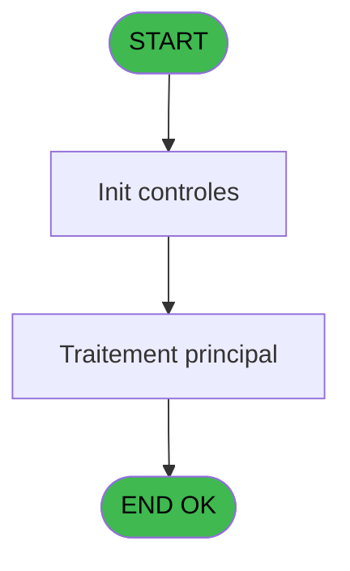
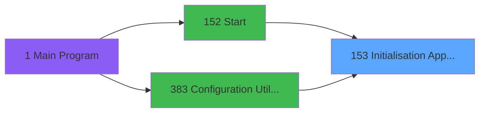

# PBP IDE 153 - Initialisation Application

> **Analyse**: Phases 1-4 2026-02-03 15:30 -> 15:31 (10s) | Assemblage 15:31
> **Pipeline**: V7.2 Enrichi
> **Structure**: 4 onglets (Resume | Ecrans | Donnees | Connexions)

<!-- TAB:Resume -->

## 1. FICHE D'IDENTITE

| Attribut | Valeur |
|----------|--------|
| Projet | PBP |
| IDE Position | 153 |
| Nom Programme | Initialisation Application |
| Fichier source | `Prg_153.xml` |
| Dossier IDE | Initialisation |
| Taches | 2 (0 ecrans visibles) |
| Tables modifiees | 0 |
| Programmes appeles | 0 |

## 2. DESCRIPTION FONCTIONNELLE

**Initialisation Application** assure la gestion complete de ce processus, accessible depuis [Start (IDE 152)](PBP-IDE-152.md), [Configuration Utilisateur (IDE 383)](PBP-IDE-383.md).

Le flux de traitement s'organise en **2 blocs fonctionnels** :

- **Traitement** (1 tache) : traitements metier divers
- **Initialisation** (1 tache) : reinitialisation d'etats et de variables de travail

Detail : phases du traitement

#### Phase 1 : Initialisation (1 tache)

- **153** - Initialisation Application

#### Phase 2 : Traitement (1 tache)

- **153.1** - cpt lieu sejour **[[ECRAN]](#ecran-t2)**

## 3. BLOCS FONCTIONNELS

### 3.1 Initialisation (1 tache)

Reinitialisation d'etats et variables de travail.

---

#### 153 - Initialisation Application

**Role** : Reinitialisation : Initialisation Application.

### 3.2 Traitement (1 tache)

Traitements internes.

---

#### 153.1 - cpt lieu sejour [[ECRAN]](#ecran-t2)

**Role** : Traitement : cpt lieu sejour.
**Ecran** : 450 x 0 DLU (MDI) | [Voir mockup](#ecran-t2)
**Variables liees** : B (W0 cpt lieu sejour), C (W0 code lieu sejour)

## 5. REGLES METIER

*(Aucune regle metier identifiee)*

## 6. CONTEXTE

- **Appele par**: [Start (IDE 152)](PBP-IDE-152.md), [Configuration Utilisateur (IDE 383)](PBP-IDE-383.md)
- **Appelle**: 0 programmes | **Tables**: 5 (W:0 R:2 L:3) | **Taches**: 2 | **Expressions**: 20

<!-- TAB:Ecrans -->

## 8. ECRANS

*(Programme sans ecran visible)*

## 9. NAVIGATION

### 9.3 Structure hierarchique (2 taches)

| Position | Tache | Type | Dimensions | Bloc |
|----------|-------|------|------------|------|
| **153.1** | [**Initialisation Application** (153)](#t1) | MDI | - | Initialisation |
| **153.2** | [**cpt lieu sejour** (153.1)](#t2) [mockup](#ecran-t2) | MDI | 450x0 | Traitement |

### 9.4 Algorigramme

> **Legende**: Vert = START/END OK | Rouge = END KO | Bleu = Decisions
> *Algorigramme auto-genere. Utiliser `/algorigramme` pour une synthese metier detaillee.*

<!-- TAB:Donnees -->

## 10. TABLES

### Tables utilisees (5)

| ID | Nom | Description | Type | R | W | L | Usages |
|----|-----|-------------|------|---|---|---|--------|
| 63 | parametres___par |  | DB | R |   |   | 1 |
| 69 | initialisation___ini |  | DB |   |   | L | 1 |
| 81 | societe__________soc |  | DB |   |   | L | 1 |
| 109 | table_utilisateurs |  | DB |   |   | L | 1 |
| 118 | tables_imports |  | DB | R |   |   | 1 |

### Colonnes par table (1 / 2 tables avec colonnes identifiees)

Table 63 - parametres___par (R) - 1 usages

| Lettre | Variable | Acces | Type |
|--------|----------|-------|------|
| A | W0 connection | R | Logical |
| B | W0 cpt lieu sejour | R | Numeric |
| C | W0 code lieu sejour | R | Alpha |

Table 118 - tables_imports (R) - 1 usages

*Table utilisee uniquement en Link ou aucune colonne Real identifiee dans le DataView.*

## 11. VARIABLES

### 11.1 Variables de travail (3)

Variables internes au programme.

| Lettre | Nom | Type | Usage dans |
|--------|-----|------|-----------|
| A | W0 connection | Logical | 2x calcul interne |
| B | W0 cpt lieu sejour | Numeric | - |
| C | W0 code lieu sejour | Alpha | [153.1](#t2) |

## 12. EXPRESSIONS

**20 / 20 expressions decodees (100%)**

### 12.1 Repartition par type

| Type | Expressions | Regles |
|------|-------------|--------|
| CONSTANTE | 2 | 0 |
| REFERENCE_VG | 1 | 0 |
| OTHER | 11 | 0 |
| CONDITION | 3 | 0 |
| NEGATION | 1 | 0 |
| CAST_LOGIQUE | 1 | 0 |
| FORMAT | 1 | 0 |

### 12.2 Expressions cles par type

#### CONSTANTE (2 expressions)

| Type | IDE | Expression | Regle |
|------|-----|------------|-------|
| CONSTANTE | 19 | `'PP'` | - |
| CONSTANTE | 3 | `39` | - |

#### REFERENCE_VG (1 expressions)

| Type | IDE | Expression | Regle |
|------|-----|------------|-------|
| REFERENCE_VG | 1 | `VG1` | - |

#### OTHER (11 expressions)

| Type | IDE | Expression | Regle |
|------|-----|------------|-------|
| OTHER | 12 | `[X]` | - |
| OTHER | 11 | `SetParam ('VILLAGE',[X])` | - |
| OTHER | 13 | `W0 connection [A]` | - |
| OTHER | 16 | `MnuShow('GM_Extraction',VG69 OR VG72)` | - |
| OTHER | 15 | `MnuShow ('PASSEPORT',VG47)` | - |
| ... | | *+6 autres* | |

#### CONDITION (3 expressions)

| Type | IDE | Expression | Regle |
|------|-----|------------|-------|
| CONDITION | 20 | `Trim([W])='O'` | - |
| CONDITION | 5 | `[H]<>1` | - |
| CONDITION | 4 | `[H]=1` | - |

#### NEGATION (1 expressions)

| Type | IDE | Expression | Regle |
|------|-----|------------|-------|
| NEGATION | 14 | `NOT (W0 connection [A])` | - |

#### CAST_LOGIQUE (1 expressions)

| Type | IDE | Expression | Regle |
|------|-----|------------|-------|
| CAST_LOGIQUE | 17 | `INIPut ('[MAGIC_LOGICAL_NAMES]club_user='&VG1,'FALSE'LOG)` | - |

#### FORMAT (1 expressions)

| Type | IDE | Expression | Regle |
|------|-----|------------|-------|
| FORMAT | 18 | `'N###########'&IF([T]<>0,'.'&Trim(Str([T],'1')),'')&'CZ'` | - |

<!-- TAB:Connexions -->

## 13. GRAPHE D'APPELS

### 13.1 Chaine depuis Main (Callers)

Main -> ... -> [Start (IDE 152)](PBP-IDE-152.md) -> **Initialisation Application (IDE 153)**

Main -> ... -> [Configuration Utilisateur (IDE 383)](PBP-IDE-383.md) -> **Initialisation Application (IDE 153)**

### 13.2 Callers

| IDE | Nom Programme | Nb Appels |
|-----|---------------|-----------|
| [152](PBP-IDE-152.md) | Start | 1 |
| [383](PBP-IDE-383.md) | Configuration Utilisateur | 1 |

### 13.3 Callees (programmes appeles)

### 13.4 Detail Callees avec contexte

| IDE | Nom Programme | Appels | Contexte |
|-----|---------------|--------|----------|
| - | (aucun) | - | - |

## 14. RECOMMANDATIONS MIGRATION

### 14.1 Profil du programme

| Metrique | Valeur | Impact migration |
|----------|--------|-----------------|
| Lignes de logique | 56 | Programme compact |
| Expressions | 20 | Peu de logique |
| Tables WRITE | 0 | Impact faible |
| Sous-programmes | 0 | Peu de dependances |
| Ecrans visibles | 0 | Ecran unique ou traitement batch |
| Code desactive | 0% (0 / 56) | Code sain |
| Regles metier | 0 | Pas de regle identifiee |

### 14.2 Plan de migration par bloc

#### Initialisation (1 tache: 0 ecran, 1 traitement)

- **Strategie** : Constructeur/methode `InitAsync()` dans l'orchestrateur.

#### Traitement (1 tache: 1 ecran, 0 traitement)

- **Strategie** : 1 composant(s) UI (Razor/React) avec formulaires et validation.
- Decomposer les taches en services unitaires testables.

### 14.3 Dependances critiques

| Dependance | Type | Appels | Impact |
|------------|------|--------|--------|

---
*Spec DETAILED generee par Pipeline V7.2 - 2026-02-03 15:31*
