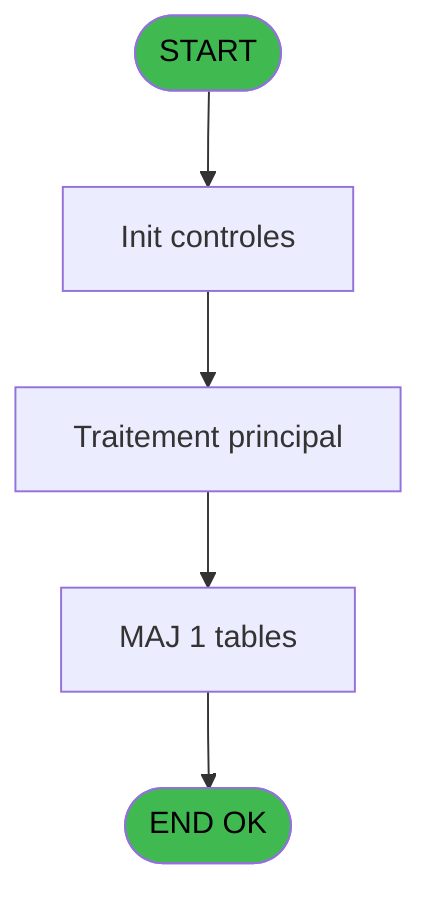
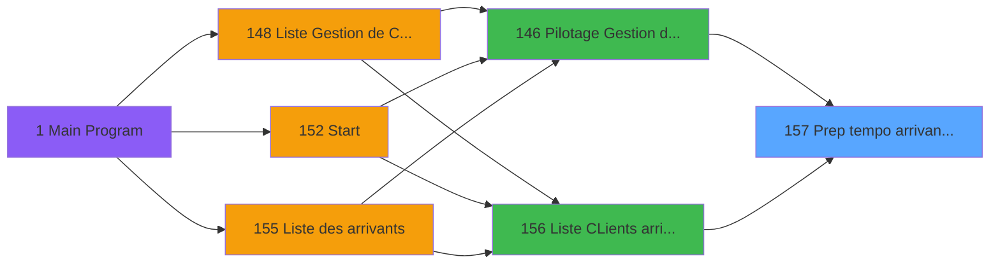
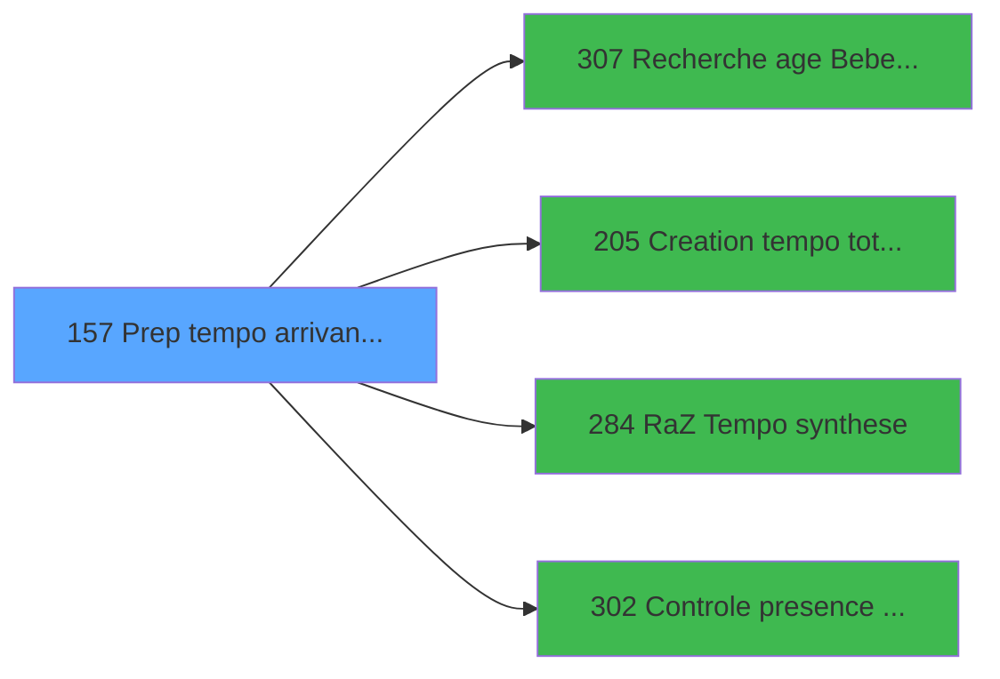

# PBP IDE 157 - Prep tempo arrivant planning

> **Analyse**: Phases 1-4 2026-02-03 15:32 -> 15:32 (11s) | Assemblage 15:32
> **Pipeline**: V7.2 Enrichi
> **Structure**: 4 onglets (Resume | Ecrans | Donnees | Connexions)

<!-- TAB:Resume -->

## 1. FICHE D'IDENTITE

| Attribut | Valeur |
|----------|--------|
| Projet | PBP |
| IDE Position | 157 |
| Nom Programme | Prep tempo arrivant planning |
| Fichier source | `Prg_157.xml` |
| Dossier IDE | Liste |
| Taches | 4 (1 ecrans visibles) |
| Tables modifiees | 1 |
| Programmes appeles | 4 |

## 2. DESCRIPTION FONCTIONNELLE

**Prep tempo arrivant planning** assure la gestion complete de ce processus, accessible depuis [  Liste CLients arrivant (IDE 156)](PBP-IDE-156.md), [Pilotage Gestion de Crise (IDE 146)](PBP-IDE-146.md).

Le flux de traitement s'organise en **2 blocs fonctionnels** :

- **Creation** (2 taches) : insertion d'enregistrements en base (mouvements, prestations)
- **Traitement** (2 taches) : traitements metier divers

**Donnees modifiees** : 1 tables en ecriture (tempo_mecano_dossier_grou).

**Logique metier** : 1 regles identifiees couvrant conditions metier.

Detail : phases du traitement

#### Phase 1 : Traitement (2 taches)

- **157** - Veuillez patienter ... **[[ECRAN]](#ecran-t1)**
- **157.1** - Veuillez patienter ... **[[ECRAN]](#ecran-t2)**

#### Phase 2 : Creation (2 taches)

- **157.1.1** - Creation Tempo gene
- **157.1.2** - Creation tempo bateaux police

Delegue a : [Creation tempo total qualite (IDE 205)](PBP-IDE-205.md)

#### Tables impactees

| Table | Operations | Role metier |
|-------|-----------|-------------|
| tempo_mecano_dossier_grou | **W**/L (2 usages) | Table temporaire ecran |

## 3. BLOCS FONCTIONNELS

### 3.1 Traitement (2 taches)

Traitements internes.

---

#### 157 - Veuillez patienter ... [[ECRAN]](#ecran-t1)

**Role** : Traitement : Veuillez patienter ....
**Ecran** : 426 x 58 DLU (MDI) | [Voir mockup](#ecran-t1)

---

#### 157.1 - Veuillez patienter ... [[ECRAN]](#ecran-t2)

**Role** : Traitement : Veuillez patienter ....
**Ecran** : 424 x 56 DLU (MDI) | [Voir mockup](#ecran-t2)

### 3.2 Creation (2 taches)

Insertion de nouveaux enregistrements en base.

---

#### 157.1.1 - Creation Tempo gene

**Role** : Creation d'enregistrement : Creation Tempo gene.
**Delegue a** : [Creation tempo total qualite (IDE 205)](PBP-IDE-205.md)

---

#### 157.1.2 - Creation tempo bateaux police

**Role** : Creation d'enregistrement : Creation tempo bateaux police.
**Delegue a** : [Creation tempo total qualite (IDE 205)](PBP-IDE-205.md)

## 5. REGLES METIER

1 regles identifiees:

### Autres (1 regles)

#### [RM-001] Condition toujours vraie (flag actif)

| Element | Detail |
|---------|--------|
| **Condition** | `P.i. OnlyTAI [X]` |
| **Si vrai** | [CB] |
| **Si faux** | 'TRUE'LOG) |
| **Variables** | X (P.i. OnlyTAI) |
| **Expression source** | Expression 23 : `IF (P.i. OnlyTAI [X],[CB],'TRUE'LOG)` |
| **Exemple** | Si P.i. OnlyTAI [X] → [CB]. Sinon → 'TRUE'LOG) |

## 6. CONTEXTE

- **Appele par**: [  Liste CLients arrivant (IDE 156)](PBP-IDE-156.md), [Pilotage Gestion de Crise (IDE 146)](PBP-IDE-146.md)
- **Appelle**: 4 programmes | **Tables**: 13 (W:1 R:3 L:11) | **Taches**: 4 | **Expressions**: 25

<!-- TAB:Ecrans -->

## 8. ECRANS

### 8.1 Forms visibles (1 / 4)

| # | Position | Tache | Nom | Type | Largeur | Hauteur | Bloc |
|---|----------|-------|-----|------|---------|---------|------|
| 1 | 157 | 157 | Veuillez patienter ... | MDI | 426 | 58 | Traitement |

### 8.2 Mockups Ecrans

---

#### 157 - Veuillez patienter ...
**Tache** : [157](#t1) | **Type** : MDI | **Dimensions** : 426 x 58 DLU
**Bloc** : Traitement | **Titre IDE** : Veuillez patienter ...

<!-- FORM-DATA:
{
    "width":  426,
    "vFactor":  8,
    "type":  "MDI",
    "hFactor":  8,
    "controls":  [
                     {
                         "x":  0,
                         "type":  "label",
                         "var":  "",
                         "y":  0,
                         "w":  423,
                         "fmt":  "",
                         "name":  "",
                         "h":  29,
                         "color":  "",
                         "text":  "",
                         "parent":  null
                     },
                     {
                         "x":  120,
                         "type":  "label",
                         "var":  "",
                         "y":  10,
                         "w":  221,
                         "fmt":  "",
                         "name":  "",
                         "h":  8,
                         "color":  "7",
                         "text":  "Traitement en cours ...",
                         "parent":  null
                     },
                     {
                         "x":  0,
                         "type":  "label",
                         "var":  "",
                         "y":  29,
                         "w":  423,
                         "fmt":  "",
                         "name":  "",
                         "h":  27,
                         "color":  "",
                         "text":  "",
                         "parent":  null
                     },
                     {
                         "x":  103,
                         "type":  "label",
                         "var":  "",
                         "y":  33,
                         "w":  114,
                         "fmt":  "",
                         "name":  "",
                         "h":  8,
                         "color":  "",
                         "text":  "Analyses :",
                         "parent":  4
                     },
                     {
                         "x":  103,
                         "type":  "label",
                         "var":  "",
                         "y":  44,
                         "w":  150,
                         "fmt":  "",
                         "name":  "",
                         "h":  8,
                         "color":  "",
                         "text":  "Selectionnes :",
                         "parent":  4
                     },
                     {
                         "x":  4,
                         "type":  "image",
                         "var":  "",
                         "y":  2,
                         "w":  72,
                         "fmt":  "",
                         "name":  "",
                         "h":  25,
                         "color":  "",
                         "text":  "",
                         "parent":  null
                     },
                     {
                         "x":  265,
                         "type":  "edit",
                         "var":  "",
                         "y":  31,
                         "w":  56,
                         "fmt":  "",
                         "name":  "",
                         "h":  9,
                         "color":  "",
                         "text":  "",
                         "parent":  4
                     },
                     {
                         "x":  265,
                         "type":  "edit",
                         "var":  "",
                         "y":  43,
                         "w":  53,
                         "fmt":  "",
                         "name":  "",
                         "h":  8,
                         "color":  "",
                         "text":  "",
                         "parent":  4
                     }
                 ],
    "taskId":  "157",
    "height":  58
}
-->

<strong>Champs : 2 champs</strong>

| Pos (x,y) | Nom | Variable | Type |
|-----------|-----|----------|------|
| 265,31 | (sans nom) | - | edit |
| 265,43 | (sans nom) | - | edit |

## 9. NAVIGATION

Ecran unique: **Veuillez patienter ...**

### 9.3 Structure hierarchique (4 taches)

| Position | Tache | Type | Dimensions | Bloc |
|----------|-------|------|------------|------|
| **157.1** | [**Veuillez patienter ...** (157)](#t1) [mockup](#ecran-t1) | MDI | 426x58 | Traitement |
| 157.1.1 | [Veuillez patienter ... (157.1)](#t2) [mockup](#ecran-t2) | MDI | 424x56 | |
| **157.2** | [**Creation Tempo gene** (157.1.1)](#t3) | MDI | - | Creation |
| 157.2.1 | [Creation tempo bateaux police (157.1.2)](#t4) | MDI | - | |

### 9.4 Algorigramme

> **Legende**: Vert = START/END OK | Rouge = END KO | Bleu = Decisions
> *Algorigramme auto-genere. Utiliser `/algorigramme` pour une synthese metier detaillee.*

<!-- TAB:Donnees -->

## 10. TABLES

### Tables utilisees (13)

| ID | Nom | Description | Type | R | W | L | Usages |
|----|-----|-------------|------|---|---|---|--------|
| 31 | gm-complet_______gmc |  | DB | R |   |   | 1 |
| 34 | hebergement______heb | Hebergement (chambres) | DB | R |   |   | 1 |
| 36 | client_gm |  | DB | R |   | L | 2 |
| 47 | compte_gm________cgm | Comptes GM (generaux) | DB |   |   | L | 1 |
| 104 | fichier_menage |  | DB |   |   | L | 1 |
| 119 | tables_pays_tel_ |  | DB |   |   | L | 1 |
| 168 | heb_circuit______hci | Hebergement (chambres) | DB |   |   | L | 1 |
| 171 | commentaire______com |  | DB |   |   | L | 1 |
| 463 | heure_de_passage |  | DB |   |   | L | 1 |
| 609 | tempo_mecano_dossier_grou | Table temporaire ecran | TMP |   | **W** | L | 2 |
| 619 | tempo_userlist | Table temporaire ecran | TMP |   |   | L | 2 |
| 637 | tempo_zone_secteur | Table temporaire ecran | DB |   |   | L | 2 |
| 806 | sale_channel |  | DB |   |   | L | 1 |

### Colonnes par table (6 / 4 tables avec colonnes identifiees)

Table 31 - gm-complet_______gmc (R) - 1 usages

| Lettre | Variable | Acces | Type |
|--------|----------|-------|------|
| A | P.i.Index | R | Numeric |
| B | P.i.DateCalcul | R | Date |
| C | P.i.HeureCalcul | R | Alpha |
| D | P.i.DateMinDebut | R | Date |
| E | P.i.DateMaxDebut | R | Date |
| F | P.i.DateMinFin | R | Date |
| G | P.i.DateMaxFin | R | Date |
| H | P.i.HeureMin | R | Numeric |
| I | P.i.HeureMax | R | Numeric |
| J | P.i.CodeListe | R | Alpha |
| K | P.i.Logement | R | Alpha |
| L | P.i.TypeHebergement | R | Alpha |
| M | P.i.TopListe | R | Alpha |
| N | P.i.CodeVol | R | Alpha |
| O | P.i.DateVillage | R | Date |
| P | P.i.HeureVillage | R | Alpha |
| Q | P.i.AgeMini | R | Numeric |
| R | P.i.AgeMaxi | R | Numeric |
| S | P.o.Total | R | Numeric |
| T | P.o.NbSelect | R | Numeric |
| U | P.i.TULCategorie | R | Alpha |
| V | P.i.TULNomTable | R | Alpha |
| W | P.i. sejour | R | Alpha |
| X | P.i. OnlyTAI | R | Logical |
| Y | P.i.Gestion de crise | R | Logical |
| Z | p.i Tri Nom / Filiation | R | Logical |
| BA | w0_RetCommentaire | R | Logical |
| BB | w0_NationSelect | R | Alpha |
| BC | Existe TAI | R | Logical |
| BD | w0_AgeBebe | R | Numeric |
| BE | w0_AgeEnfant | R | Numeric |

Table 34 - hebergement______heb (R) - 1 usages

| Lettre | Variable | Acces | Type |
|--------|----------|-------|------|
| A | w0_Age------------------------- | R | Alpha |
| B | w0_Arrivee--------------------- | R | Alpha |
| C | v.Code vol aller A | R | Unicode |
| D | w0_Depart---------------------- | R | Alpha |
| E | v.Code vol retour Z | R | Unicode |
| F | w0_RetSelect | R | Logical |
| G | w0_Circuit--------------------- | R | Logical |
| H | w0_DepCircuit------------------ | R | Logical |
| I | w0_RetCircuit------------------ | R | Logical |
| J | W0_PresenceAv------------------ | R | Logical |
| K | w0_RetHebPreced---------------- | R | Logical |
| L | w0_RetHebSuiv------------------ | R | Logical |
| M | w0_Type | R | Alpha |
| N | w0_DateMaxDebut | R | Date |
| O | w0_DateMaxFin | R | Date |
| P | w0_Total | R | Numeric |
| Q | w0_NbSelect | R | Numeric |
| R | w0_RetCtlHeb | R | Logical |
| S | w0_TelInt | R | Numeric |
| T | w0_TelExt_Commune | R | Alpha |
| U | w0_FaxVille | R | Alpha |
| V | w0_TypeEcran | R | Alpha |
| W | w0_NumAdherent | R | Alpha |
| X | w0_Age | R | Numeric |
| Y | w0_Cabine | R | Alpha |
| Z | W0_RetourCircuit | R | Alpha |
| BA | w0_CondArrivant | R | Logical |
| BB | w0_CondArrive | R | Logical |
| BC | W0_CondPresent | R | Logical |
| BD | w0_CondDepart | R | Logical |
| BE | w0_CondAbsent | R | Logical |
| BF | w0_CondPartant | R | Logical |

Table 36 - client_gm (R/L) - 2 usages

| Lettre | Variable | Acces | Type |
|--------|----------|-------|------|
| A | w1_RetCreat | R | Logical |
| B | ret link 36 | R | Logical |
| C | e.Reponse? | R | Logical |

Table 609 - tempo_mecano_dossier_grou (**W**/L) - 2 usages

*Table utilisee uniquement en Link ou aucune colonne Real identifiee dans le DataView.*

## 11. VARIABLES

### 11.1 Parametres entrants (26)

Variables recues du programme appelant ([  Liste CLients arrivant (IDE 156)](PBP-IDE-156.md)).

| Lettre | Nom | Type | Usage dans |
|--------|-----|------|-----------|
| A | P.i.Index | Numeric | 1x parametre entrant |
| B | P.i.DateCalcul | Date | - |
| C | P.i.HeureCalcul | Alpha | - |
| D | P.i.DateMinDebut | Date | 1x parametre entrant |
| E | P.i.DateMaxDebut | Date | 1x parametre entrant |
| F | P.i.DateMinFin | Date | 1x parametre entrant |
| G | P.i.DateMaxFin | Date | 1x parametre entrant |
| H | P.i.HeureMin | Numeric | - |
| I | P.i.HeureMax | Numeric | - |
| J | P.i.CodeListe | Alpha | - |
| K | P.i.Logement | Alpha | - |
| L | P.i.TypeHebergement | Alpha | - |
| M | P.i.TopListe | Alpha | 2x parametre entrant |
| N | P.i.CodeVol | Alpha | - |
| O | P.i.DateVillage | Date | - |
| P | P.i.HeureVillage | Alpha | - |
| Q | P.i.AgeMini | Numeric | - |
| R | P.i.AgeMaxi | Numeric | - |
| S | P.o.Total | Numeric | - |
| T | P.o.NbSelect | Numeric | - |
| U | P.i.TULCategorie | Alpha | - |
| V | P.i.TULNomTable | Alpha | - |
| W | P.i. sejour | Alpha | - |
| X | P.i. OnlyTAI | Logical | 1x parametre entrant |
| Y | P.i.Gestion de crise | Logical | 2x parametre entrant |
| Z | p.i Tri Nom / Filiation | Logical | - |

### 11.2 Autres (6)

Variables diverses.

| Lettre | Nom | Type | Usage dans |
|--------|-----|------|-----------|
| BA | w0_RetCommentaire | Logical | - |
| BB | w0_NationSelect | Alpha | - |
| BC | Existe TAI | Logical | - |
| BD | w0_AgeBebe | Numeric | - |
| BE | w0_AgeEnfant | Numeric | - |
| BF | w0_CondPartant | Logical | - |

Toutes les 32 variables (liste complete)

| Cat | Lettre | Nom Variable | Type |
|-----|--------|--------------|------|
| P0 | **A** | P.i.Index | Numeric |
| P0 | **B** | P.i.DateCalcul | Date |
| P0 | **C** | P.i.HeureCalcul | Alpha |
| P0 | **D** | P.i.DateMinDebut | Date |
| P0 | **E** | P.i.DateMaxDebut | Date |
| P0 | **F** | P.i.DateMinFin | Date |
| P0 | **G** | P.i.DateMaxFin | Date |
| P0 | **H** | P.i.HeureMin | Numeric |
| P0 | **I** | P.i.HeureMax | Numeric |
| P0 | **J** | P.i.CodeListe | Alpha |
| P0 | **K** | P.i.Logement | Alpha |
| P0 | **L** | P.i.TypeHebergement | Alpha |
| P0 | **M** | P.i.TopListe | Alpha |
| P0 | **N** | P.i.CodeVol | Alpha |
| P0 | **O** | P.i.DateVillage | Date |
| P0 | **P** | P.i.HeureVillage | Alpha |
| P0 | **Q** | P.i.AgeMini | Numeric |
| P0 | **R** | P.i.AgeMaxi | Numeric |
| P0 | **S** | P.o.Total | Numeric |
| P0 | **T** | P.o.NbSelect | Numeric |
| P0 | **U** | P.i.TULCategorie | Alpha |
| P0 | **V** | P.i.TULNomTable | Alpha |
| P0 | **W** | P.i. sejour | Alpha |
| P0 | **X** | P.i. OnlyTAI | Logical |
| P0 | **Y** | P.i.Gestion de crise | Logical |
| P0 | **Z** | p.i Tri Nom / Filiation | Logical |
| Autre | **BA** | w0_RetCommentaire | Logical |
| Autre | **BB** | w0_NationSelect | Alpha |
| Autre | **BC** | Existe TAI | Logical |
| Autre | **BD** | w0_AgeBebe | Numeric |
| Autre | **BE** | w0_AgeEnfant | Numeric |
| Autre | **BF** | w0_CondPartant | Logical |

## 12. EXPRESSIONS

**25 / 25 expressions decodees (100%)**

### 12.1 Repartition par type

| Type | Expressions | Regles |
|------|-------------|--------|
| CAST_LOGIQUE | 1 | 5 |
| CONSTANTE | 5 | 0 |
| OTHER | 12 | 0 |
| CONDITION | 6 | 0 |
| REFERENCE_VG | 1 | 0 |

### 12.2 Expressions cles par type

#### CAST_LOGIQUE (1 expressions)

| Type | IDE | Expression | Regle |
|------|-----|------------|-------|
| CAST_LOGIQUE | 23 | `IF (P.i. OnlyTAI [X],[CB],'TRUE'LOG)` | [RM-001](#rm-RM-001) |

#### CONSTANTE (5 expressions)

| Type | IDE | Expression | Regle |
|------|-----|------------|-------|
| CONSTANTE | 18 | `'TNATI'` | - |
| CONSTANTE | 19 | `0` | - |
| CONSTANTE | 17 | `'M'` | - |
| CONSTANTE | 2 | `'VBEBE'` | - |
| CONSTANTE | 3 | `'VENFA'` | - |

#### OTHER (12 expressions)

| Type | IDE | Expression | Regle |
|------|-----|------------|-------|
| OTHER | 15 | `[AN]` | - |
| OTHER | 14 | `[AS]` | - |
| OTHER | 13 | `GetParam ('LANGUE')` | - |
| OTHER | 22 | `[AO]` | - |
| OTHER | 21 | `[AN]` | - |
| ... | | *+7 autres* | |

#### CONDITION (6 expressions)

| Type | IDE | Expression | Regle |
|------|-----|------------|-------|
| CONDITION | 10 | `CndRange (P.i.DateMaxFin [G]>0,P.i.DateMaxFin [G])` | - |
| CONDITION | 24 | `P.i.TopListe [M]='CO'` | - |
| CONDITION | 25 | `P.i.TopListe [M]='ST'` | - |
| CONDITION | 7 | `CndRange (P.i.DateMinDebut [D]>0,P.i.DateMinDebut [D])` | - |
| CONDITION | 8 | `CndRange (P.i.DateMaxDebut [E]>0,P.i.DateMaxDebut [E])` | - |
| ... | | *+1 autres* | |

#### REFERENCE_VG (1 expressions)

| Type | IDE | Expression | Regle |
|------|-----|------------|-------|
| REFERENCE_VG | 16 | `VG1` | - |

### 12.3 Toutes les expressions (25)

Voir les 25 expressions

#### CAST_LOGIQUE (1)

| IDE | Expression Decodee |
|-----|-------------------|
| 23 | `IF (P.i. OnlyTAI [X],[CB],'TRUE'LOG)` |

#### CONSTANTE (5)

| IDE | Expression Decodee |
|-----|-------------------|
| 2 | `'VBEBE'` |
| 3 | `'VENFA'` |
| 17 | `'M'` |
| 18 | `'TNATI'` |
| 19 | `0` |

#### OTHER (12)

| IDE | Expression Decodee |
|-----|-------------------|
| 1 | `P.i.Index [A]` |
| 4 | `[AS]` |
| 5 | `GetParam('SOCIETE')` |
| 6 | `P.i.Gestion de crise [Y]` |
| 11 | `[AN]` |
| 12 | `[AO]` |
| 13 | `GetParam ('LANGUE')` |
| 14 | `[AS]` |
| 15 | `[AN]` |
| 20 | `P.i.Gestion de crise [Y]` |
| 21 | `[AN]` |
| 22 | `[AO]` |

#### CONDITION (6)

| IDE | Expression Decodee |
|-----|-------------------|
| 7 | `CndRange (P.i.DateMinDebut [D]>0,P.i.DateMinDebut [D])` |
| 8 | `CndRange (P.i.DateMaxDebut [E]>0,P.i.DateMaxDebut [E])` |
| 9 | `CndRange (P.i.DateMinFin [F]>0,P.i.DateMinFin [F])` |
| 10 | `CndRange (P.i.DateMaxFin [G]>0,P.i.DateMaxFin [G])` |
| 24 | `P.i.TopListe [M]='CO'` |
| 25 | `P.i.TopListe [M]='ST'` |

#### REFERENCE_VG (1)

| IDE | Expression Decodee |
|-----|-------------------|
| 16 | `VG1` |

<!-- TAB:Connexions -->

## 13. GRAPHE D'APPELS

### 13.1 Chaine depuis Main (Callers)

Main -> ... -> [  Liste CLients arrivant (IDE 156)](PBP-IDE-156.md) -> **Prep tempo arrivant planning (IDE 157)**

Main -> ... -> [Pilotage Gestion de Crise (IDE 146)](PBP-IDE-146.md) -> **Prep tempo arrivant planning (IDE 157)**

### 13.2 Callers

| IDE | Nom Programme | Nb Appels |
|-----|---------------|-----------|
| [156](PBP-IDE-156.md) |   Liste CLients arrivant | 2 |
| [146](PBP-IDE-146.md) | Pilotage Gestion de Crise | 1 |

### 13.3 Callees (programmes appeles)

### 13.4 Detail Callees avec contexte

| IDE | Nom Programme | Appels | Contexte |
|-----|---------------|--------|----------|
| [307](PBP-IDE-307.md) | Recherche age Bebe_Enfant | 2 | Sous-programme |
| [205](PBP-IDE-205.md) | Creation tempo total qualite | 1 | Sous-programme |
| [284](PBP-IDE-284.md) | RaZ Tempo synthese | 1 | Reinitialisation |
| [302](PBP-IDE-302.md) | Controle presence heberg | 1 | Controle/validation |

## 14. RECOMMANDATIONS MIGRATION

### 14.1 Profil du programme

| Metrique | Valeur | Impact migration |
|----------|--------|-----------------|
| Lignes de logique | 756 | Programme volumineux |
| Expressions | 25 | Peu de logique |
| Tables WRITE | 1 | Impact faible |
| Sous-programmes | 4 | Peu de dependances |
| Ecrans visibles | 1 | Ecran unique ou traitement batch |
| Code desactive | 0% (0 / 756) | Code sain |
| Regles metier | 1 | Quelques regles a preserver |

### 14.2 Plan de migration par bloc

#### Traitement (2 taches: 2 ecrans, 0 traitement)

- **Strategie** : 2 composant(s) UI (Razor/React) avec formulaires et validation.
- 4 sous-programme(s) a migrer ou a reutiliser depuis les services existants.
- Decomposer les taches en services unitaires testables.

#### Creation (2 taches: 0 ecran, 2 traitements)

- **Strategie** : Repository pattern avec Entity Framework Core.
- Insertion via `IRepository<T>.CreateAsync()`

### 14.3 Dependances critiques

| Dependance | Type | Appels | Impact |
|------------|------|--------|--------|
| tempo_mecano_dossier_grou | Table WRITE (Temp) | 1x | Schema + repository |
| [Recherche age Bebe_Enfant (IDE 307)](PBP-IDE-307.md) | Sous-programme | 2x | Haute - Sous-programme |
| [Controle presence heberg (IDE 302)](PBP-IDE-302.md) | Sous-programme | 1x | Normale - Controle/validation |
| [RaZ Tempo synthese (IDE 284)](PBP-IDE-284.md) | Sous-programme | 1x | Normale - Reinitialisation |
| [Creation tempo total qualite (IDE 205)](PBP-IDE-205.md) | Sous-programme | 1x | Normale - Sous-programme |

---
*Spec DETAILED generee par Pipeline V7.2 - 2026-02-03 15:32*
