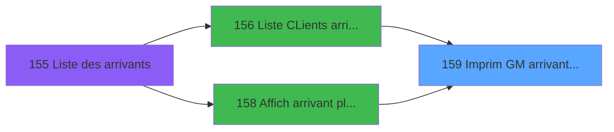

# PBP IDE 159 - Imprim GM arrivant planning

> **Analyse**: Phases 1-4 2026-02-03 15:32 -> 15:32 (10s) | Assemblage 15:32
> **Pipeline**: V7.2 Enrichi
> **Structure**: 4 onglets (Resume | Ecrans | Donnees | Connexions)

<!-- TAB:Resume -->

## 1. FICHE D'IDENTITE

| Attribut | Valeur |
|----------|--------|
| Projet | PBP |
| IDE Position | 159 |
| Nom Programme | Imprim GM arrivant planning |
| Fichier source | `Prg_159.xml` |
| Dossier IDE | Liste |
| Taches | 3 (1 ecrans visibles) |
| Tables modifiees | 0 |
| Programmes appeles | 0 |

## 2. DESCRIPTION FONCTIONNELLE

**Imprim GM arrivant planning** assure la gestion complete de ce processus, accessible depuis [  Liste CLients arrivant (IDE 156)](PBP-IDE-156.md), [  Affich arrivant planning GM (IDE 158)](PBP-IDE-158.md).

Le flux de traitement s'organise en **2 blocs fonctionnels** :

- **Traitement** (2 taches) : traitements metier divers
- **Calcul** (1 tache) : calculs de montants, stocks ou compteurs

**Logique metier** : 24 regles identifiees couvrant conditions metier, valeurs par defaut.

Detail : phases du traitement

#### Phase 1 : Traitement (2 taches)

- **159** - Veuillez patienter... **[[ECRAN]](#ecran-t1)**
- **159.2** - Ligne commentaire

#### Phase 2 : Calcul (1 tache)

- **159.1** - Calcul pied

## 3. BLOCS FONCTIONNELS

### 3.1 Traitement (2 taches)

Traitements internes.

---

#### 159 - Veuillez patienter... [[ECRAN]](#ecran-t1)

**Role** : Traitement : Veuillez patienter....
**Ecran** : 422 x 57 DLU (MDI) | [Voir mockup](#ecran-t1)

---

#### 159.2 - Ligne commentaire

**Role** : Traitement : Ligne commentaire.

### 3.2 Calcul (1 tache)

Calculs metier : montants, stocks, compteurs.

---

#### 159.1 - Calcul pied

**Role** : Calcul : Calcul pied.
**Variables liees** : A (>DateCalcul), X (w0_NomPied01), Y (w0_NbPied01), Z (w0_NomPied02), BA (w0_NbPied02)

## 5. REGLES METIER

24 regles identifiees:

### Autres (24 regles)

#### [RM-001] Si VG126 AND [DA] alors 'X' sinon '')

| Element | Detail |
|---------|--------|
| **Condition** | `VG126 AND [DA]` |
| **Si vrai** | 'X' |
| **Si faux** | '') |
| **Expression source** | Expression 4 : `IF(VG126 AND [DA],'X','')` |
| **Exemple** | Si VG126 AND [DA] → 'X'. Sinon → '') |

#### [RM-002] Si >TopListe [D]='AG' OR >TopListe [D]='BB' OR >TopListe [D]='EN' alors MlsTrans ('Naissance') sinon '')

| Element | Detail |
|---------|--------|
| **Condition** | `>TopListe [D]='AG' OR >TopListe [D]='BB' OR >TopListe [D]='EN'` |
| **Si vrai** | MlsTrans ('Naissance') |
| **Si faux** | '') |
| **Variables** | D (>TopListe) |
| **Expression source** | Expression 6 : `IF (>TopListe [D]='AG' OR >TopListe [D]='BB' OR >TopListe [D` |
| **Exemple** | Si >TopListe [D]='AG' OR >TopListe [D]='BB' OR >TopListe [D]='EN' → MlsTrans ('Naissance'). Sinon → '') |

#### [RM-003] Si >TopListe [D]='GR' alors MlsTrans ('GROUPE') sinon IF (>TopListe [D]='CA',MlsTrans ('DATE'),MlsTrans ('DATE / HEURE')))

| Element | Detail |
|---------|--------|
| **Condition** | `>TopListe [D]='GR'` |
| **Si vrai** | MlsTrans ('GROUPE') |
| **Si faux** | IF (>TopListe [D]='CA',MlsTrans ('DATE'),MlsTrans ('DATE / HEURE'))) |
| **Variables** | D (>TopListe) |
| **Expression source** | Expression 10 : `IF (>TopListe [D]='GR',MlsTrans ('GROUPE'),IF (>TopListe [D]` |
| **Exemple** | Si >TopListe [D]='GR' → MlsTrans ('GROUPE') |

#### [RM-004] Si >CodeListe [C]='A' alors MlsTrans ('arrivants') sinon IF (>CodeListe [C]='V',MlsTrans ('arrivees'),IF (>CodeListe [C]='P',MlsTrans ('presents'),IF (>CodeListe [C]='D',MlsTrans ('departs'),IF (>CodeListe [C]='R',MlsTrans ('partants'),MlsTrans ('absents'))))))

| Element | Detail |
|---------|--------|
| **Condition** | `>CodeListe [C]='A'` |
| **Si vrai** | MlsTrans ('arrivants') |
| **Si faux** | IF (>CodeListe [C]='V',MlsTrans ('arrivees'),IF (>CodeListe [C]='P',MlsTrans ('presents'),IF (>CodeListe [C]='D',MlsTrans ('departs'),IF (>CodeListe [C]='R',MlsTrans ('partants'),MlsTrans ('absents')))))) |
| **Variables** | C (>CodeListe) |
| **Expression source** | Expression 21 : `IF (>CodeListe [C]='A',MlsTrans ('arrivants'),IF (>CodeListe` |
| **Exemple** | Si >CodeListe [C]='A' → MlsTrans ('arrivants') |

#### [RM-005] Si >TopListe [D]='PL' alors 'planning' sinon '')

| Element | Detail |
|---------|--------|
| **Condition** | `>TopListe [D]='PL'` |
| **Si vrai** | 'planning' |
| **Si faux** | '') |
| **Variables** | D (>TopListe) |
| **Expression source** | Expression 22 : `IF (>TopListe [D]='PL','planning','')` |
| **Exemple** | Si >TopListe [D]='PL' → 'planning'. Sinon → '') |

#### [RM-006] Si >TopListe [D]='CA' alors MlsTrans ('caisse') sinon '')

| Element | Detail |
|---------|--------|
| **Condition** | `>TopListe [D]='CA'` |
| **Si vrai** | MlsTrans ('caisse') |
| **Si faux** | '') |
| **Variables** | D (>TopListe) |
| **Expression source** | Expression 24 : `IF (>TopListe [D]='CA',MlsTrans ('caisse'),'')` |
| **Exemple** | Si >TopListe [D]='CA' → MlsTrans ('caisse'). Sinon → '') |

#### [RM-007] Si >TopListe [D]='MI' alors MlsTrans ('millesias') sinon '')

| Element | Detail |
|---------|--------|
| **Condition** | `>TopListe [D]='MI'` |
| **Si vrai** | MlsTrans ('millesias') |
| **Si faux** | '') |
| **Variables** | D (>TopListe) |
| **Expression source** | Expression 25 : `IF (>TopListe [D]='MI',MlsTrans ('millesias'),'')` |
| **Exemple** | Si >TopListe [D]='MI' → MlsTrans ('millesias'). Sinon → '') |

#### [RM-008] Si >TopListe [D]='BB' alors MlsTrans ('bebe') sinon '')

| Element | Detail |
|---------|--------|
| **Condition** | `>TopListe [D]='BB'` |
| **Si vrai** | MlsTrans ('bebe') |
| **Si faux** | '') |
| **Variables** | D (>TopListe) |
| **Expression source** | Expression 26 : `IF (>TopListe [D]='BB',MlsTrans ('bebe'),'')` |
| **Exemple** | Si >TopListe [D]='BB' → MlsTrans ('bebe'). Sinon → '') |

#### [RM-009] Si >TopListe [D]='EN' alors MlsTrans ('enfant') sinon '')

| Element | Detail |
|---------|--------|
| **Condition** | `>TopListe [D]='EN'` |
| **Si vrai** | MlsTrans ('enfant') |
| **Si faux** | '') |
| **Variables** | D (>TopListe) |
| **Expression source** | Expression 27 : `IF (>TopListe [D]='EN',MlsTrans ('enfant'),'')` |
| **Exemple** | Si >TopListe [D]='EN' → MlsTrans ('enfant'). Sinon → '') |

#### [RM-010] Si >TopListe [D]='SI' alors 'single' sinon '')

| Element | Detail |
|---------|--------|
| **Condition** | `>TopListe [D]='SI'` |
| **Si vrai** | 'single' |
| **Si faux** | '') |
| **Variables** | D (>TopListe) |
| **Expression source** | Expression 28 : `IF (>TopListe [D]='SI','single','')` |
| **Exemple** | Si >TopListe [D]='SI' → 'single'. Sinon → '') |

#### [RM-011] Si >TopListe [D]='NS' alors 'non single' sinon '')

| Element | Detail |
|---------|--------|
| **Condition** | `>TopListe [D]='NS'` |
| **Si vrai** | 'non single' |
| **Si faux** | '') |
| **Variables** | D (>TopListe) |
| **Expression source** | Expression 29 : `IF (>TopListe [D]='NS','non single','')` |
| **Exemple** | Si >TopListe [D]='NS' → 'non single'. Sinon → '') |

#### [RM-012] Si >TopListe [D]='PY' alors MlsTrans ('pays') sinon '')

| Element | Detail |
|---------|--------|
| **Condition** | `>TopListe [D]='PY'` |
| **Si vrai** | MlsTrans ('pays') |
| **Si faux** | '') |
| **Variables** | D (>TopListe) |
| **Expression source** | Expression 30 : `IF (>TopListe [D]='PY',MlsTrans ('pays'),'')` |
| **Exemple** | Si >TopListe [D]='PY' → MlsTrans ('pays'). Sinon → '') |

#### [RM-013] Si >TopListe [D]='HM' alors 'honey moon' sinon '')

| Element | Detail |
|---------|--------|
| **Condition** | `>TopListe [D]='HM'` |
| **Si vrai** | 'honey moon' |
| **Si faux** | '') |
| **Variables** | D (>TopListe) |
| **Expression source** | Expression 31 : `IF (>TopListe [D]='HM','honey moon','')` |
| **Exemple** | Si >TopListe [D]='HM' → 'honey moon'. Sinon → '') |

#### [RM-014] Si >TopListe [D]='VV' alors 'Vil/Vil' sinon '')

| Element | Detail |
|---------|--------|
| **Condition** | `>TopListe [D]='VV'` |
| **Si vrai** | 'Vil/Vil' |
| **Si faux** | '') |
| **Variables** | D (>TopListe) |
| **Expression source** | Expression 32 : `IF (>TopListe [D]='VV','Vil/Vil','')` |
| **Exemple** | Si >TopListe [D]='VV' → 'Vil/Vil'. Sinon → '') |

#### [RM-015] Si >TopListe [D]='NV' alors 'non Vil/Vil' sinon '')

| Element | Detail |
|---------|--------|
| **Condition** | `>TopListe [D]='NV'` |
| **Si vrai** | 'non Vil/Vil' |
| **Si faux** | '') |
| **Variables** | D (>TopListe) |
| **Expression source** | Expression 33 : `IF (>TopListe [D]='NV','non Vil/Vil','')` |
| **Exemple** | Si >TopListe [D]='NV' → 'non Vil/Vil'. Sinon → '') |

#### [RM-016] Si >TopListe [D]='AG' alors MlsTrans ('age du')&' '&Str (>AgeMin [H] sinon '2')&' / '&Str (>AgeMax [I],'2')&' ans','')

| Element | Detail |
|---------|--------|
| **Condition** | `>TopListe [D]='AG'` |
| **Si vrai** | MlsTrans ('age du')&' '&Str (>AgeMin [H] |
| **Si faux** | '2')&' / '&Str (>AgeMax [I],'2')&' ans','') |
| **Variables** | D (>TopListe), H (>AgeMin), I (>AgeMax) |
| **Expression source** | Expression 34 : `IF (>TopListe [D]='AG',MlsTrans ('age du')&' '&Str (>AgeMin ` |
| **Exemple** | Si >TopListe [D]='AG' → MlsTrans ('age du')&' '&Str (>AgeMin [H]. Sinon → '2')&' / '&Str (>AgeMax [I],'2')&' ans','') |

#### [RM-017] Si >TopListe [D]='CO' alors MlsTrans ('commentaire') sinon '')

| Element | Detail |
|---------|--------|
| **Condition** | `>TopListe [D]='CO'` |
| **Si vrai** | MlsTrans ('commentaire') |
| **Si faux** | '') |
| **Variables** | D (>TopListe) |
| **Expression source** | Expression 35 : `IF (>TopListe [D]='CO',MlsTrans ('commentaire'),'')` |
| **Exemple** | Si >TopListe [D]='CO' → MlsTrans ('commentaire'). Sinon → '') |

#### [RM-018] Si >TopListe [D]='CP' alors MlsTrans ('comptage') sinon '')

| Element | Detail |
|---------|--------|
| **Condition** | `>TopListe [D]='CP'` |
| **Si vrai** | MlsTrans ('comptage') |
| **Si faux** | '') |
| **Variables** | D (>TopListe) |
| **Expression source** | Expression 36 : `IF (>TopListe [D]='CP',MlsTrans ('comptage'),'')` |
| **Exemple** | Si >TopListe [D]='CP' → MlsTrans ('comptage'). Sinon → '') |

#### [RM-019] Valeur par defaut si >CodeListe [C]<>'CP' AND >CodeListe [C]<>'GR','',IF (Trim(>CodeGroupe [J]) est vide

| Element | Detail |
|---------|--------|
| **Condition** | `>CodeListe [C]<>'CP' AND >CodeListe [C]<>'GR'` |
| **Si vrai** | '' |
| **Si faux** | IF (Trim(>CodeGroupe [J])='','Toutes categories',Trim(>CodeGroupe [J]))) |
| **Variables** | C (>CodeListe), J (>CodeGroupe) |
| **Expression source** | Expression 43 : `IF (>CodeListe [C]<>'CP' AND >CodeListe [C]<>'GR','',IF (Tri` |
| **Exemple** | Si >CodeListe [C]<>'CP' AND >CodeListe [C]<>'GR' → '' |

#### [RM-020] Si w0_TotalSelect [BH] OR [BN] OR [BT] OR [BZ] alors 'EA'&Trim([CF]) sinon IF(VG29,CASE([AV],'C','CRE','D','DEB','S','SET',''),Trim([CY])))

| Element | Detail |
|---------|--------|
| **Condition** | `w0_TotalSelect [BH] OR [BN] OR [BT] OR [BZ]` |
| **Si vrai** | 'EA'&Trim([CF]) |
| **Si faux** | IF(VG29,CASE([AV],'C','CRE','D','DEB','S','SET',''),Trim([CY]))) |
| **Variables** | BH (w0_TotalSelect) |
| **Expression source** | Expression 55 : `IF(w0_TotalSelect [BH] OR [BN] OR [BT] OR [BZ],'EA'&Trim([CF` |
| **Exemple** | Si w0_TotalSelect [BH] OR [BN] OR [BT] OR [BZ] → 'EA'&Trim([CF]) |

#### [RM-021] Traitement si Trim(ExpCalc('53'EXP)) est renseigne

| Element | Detail |
|---------|--------|
| **Condition** | `Trim(ExpCalc('53'EXP))<>'' AND VG114 AND Trim([CY])<>''` |
| **Si vrai** | Trim(ExpCalc('53'EXP))&'-'&Trim([CY]) |
| **Si faux** | ExpCalc('53'EXP)) |
| **Expression source** | Expression 56 : `IF(Trim(ExpCalc('53'EXP))<>'' AND VG114 AND Trim([CY])<>'',T` |
| **Exemple** | Si Trim(ExpCalc('53'EXP))<>'' AND VG114 AND Trim([CY])<>'' → Trim(ExpCalc('53'EXP))&'-'&Trim([CY]). Sinon → ExpCalc('53'EXP)) |

#### [RM-022] Si [BN] alors Trim(VG61) sinon '')&IF([BT],Trim(VG62),'')&IF([BZ],Trim(VG63),'')

| Element | Detail |
|---------|--------|
| **Condition** | `[BN]` |
| **Si vrai** | Trim(VG61) |
| **Si faux** | '')&IF([BT],Trim(VG62),'')&IF([BZ],Trim(VG63),'') |
| **Expression source** | Expression 60 : `IF([BN],Trim(VG61),'')&IF([BT],Trim(VG62),'')&IF([BZ],Trim(V` |
| **Exemple** | Si [BN] → Trim(VG61). Sinon → '')&IF([BT],Trim(VG62),'')&IF([BZ],Trim(VG63),'') |

#### [RM-023] Si [CR] alors [CS]&[CT]&Str([AJ] sinon '3P0'),V.Existe ECI ? [S]&Str([AJ],'3P0'))

| Element | Detail |
|---------|--------|
| **Condition** | `[CR]` |
| **Si vrai** | [CS]&[CT]&Str([AJ] |
| **Si faux** | '3P0'),V.Existe ECI ? [S]&Str([AJ],'3P0')) |
| **Variables** | S (V.Existe ECI ?) |
| **Expression source** | Expression 61 : `IF([CR],[CS]&[CT]&Str([AJ],'3P0'),V.Existe ECI ? [S]&Str([AJ` |
| **Exemple** | Si [CR] → [CS]&[CT]&Str([AJ]. Sinon → '3P0'),V.Existe ECI ? [S]&Str([AJ],'3P0')) |

#### [RM-024] Si VG88 AND [CX] alors TStr([CW] sinon 'HHhMMZ')&'h',[AD])

| Element | Detail |
|---------|--------|
| **Condition** | `VG88 AND [CX]` |
| **Si vrai** | TStr([CW] |
| **Si faux** | 'HHhMMZ')&'h',[AD]) |
| **Expression source** | Expression 64 : `IF(VG88 AND [CX],TStr([CW],'HHhMMZ')&'h',[AD])` |
| **Exemple** | Si VG88 AND [CX] → TStr([CW]. Sinon → 'HHhMMZ')&'h',[AD]) |

## 6. CONTEXTE

- **Appele par**: [  Liste CLients arrivant (IDE 156)](PBP-IDE-156.md), [  Affich arrivant planning GM (IDE 158)](PBP-IDE-158.md)
- **Appelle**: 0 programmes | **Tables**: 7 (W:0 R:3 L:4) | **Taches**: 3 | **Expressions**: 66

<!-- TAB:Ecrans -->

## 8. ECRANS

### 8.1 Forms visibles (1 / 3)

| # | Position | Tache | Nom | Type | Largeur | Hauteur | Bloc |
|---|----------|-------|-----|------|---------|---------|------|
| 1 | 159 | 159 | Veuillez patienter... | MDI | 422 | 57 | Traitement |

### 8.2 Mockups Ecrans

---

#### 159 - Veuillez patienter...
**Tache** : [159](#t1) | **Type** : MDI | **Dimensions** : 422 x 57 DLU
**Bloc** : Traitement | **Titre IDE** : Veuillez patienter...

<!-- FORM-DATA:
{
    "width":  422,
    "vFactor":  8,
    "type":  "MDI",
    "hFactor":  8,
    "controls":  [
                     {
                         "x":  0,
                         "type":  "label",
                         "var":  "",
                         "y":  0,
                         "w":  423,
                         "fmt":  "",
                         "name":  "",
                         "h":  29,
                         "color":  "",
                         "text":  "",
                         "parent":  null
                     },
                     {
                         "x":  120,
                         "type":  "label",
                         "var":  "",
                         "y":  10,
                         "w":  221,
                         "fmt":  "",
                         "name":  "",
                         "h":  8,
                         "color":  "7",
                         "text":  "Impression en cours ...",
                         "parent":  null
                     },
                     {
                         "x":  0,
                         "type":  "label",
                         "var":  "",
                         "y":  29,
                         "w":  423,
                         "fmt":  "",
                         "name":  "",
                         "h":  27,
                         "color":  "",
                         "text":  "",
                         "parent":  null
                     },
                     {
                         "x":  72,
                         "type":  "label",
                         "var":  "",
                         "y":  38,
                         "w":  280,
                         "fmt":  "",
                         "name":  "",
                         "h":  8,
                         "color":  "",
                         "text":  "Edition AVPBDR",
                         "parent":  null
                     },
                     {
                         "x":  4,
                         "type":  "image",
                         "var":  "",
                         "y":  2,
                         "w":  72,
                         "fmt":  "",
                         "name":  "",
                         "h":  25,
                         "color":  "",
                         "text":  "",
                         "parent":  null
                     }
                 ],
    "taskId":  "159",
    "height":  57
}
-->

## 9. NAVIGATION

Ecran unique: **Veuillez patienter...**

### 9.3 Structure hierarchique (3 taches)

| Position | Tache | Type | Dimensions | Bloc |
|----------|-------|------|------------|------|
| **159.1** | [**Veuillez patienter...** (159)](#t1) [mockup](#ecran-t1) | MDI | 422x57 | Traitement |
| 159.1.1 | [Ligne commentaire (159.2)](#t3) | MDI | - | |
| **159.2** | [**Calcul pied** (159.1)](#t2) | MDI | - | Calcul |

### 9.4 Algorigramme

> **Legende**: Vert = START/END OK | Rouge = END KO | Bleu = Decisions
> *Algorigramme auto-genere. Utiliser `/algorigramme` pour une synthese metier detaillee.*

<!-- TAB:Donnees -->

## 10. TABLES

### Tables utilisees (7)

| ID | Nom | Description | Type | R | W | L | Usages |
|----|-----|-------------|------|---|---|---|--------|
| 31 | gm-complet_______gmc |  | DB | R |   |   | 1 |
| 171 | commentaire______com |  | DB | R |   |   | 1 |
| 358 | import_mod |  | DB |   |   | L | 1 |
| 463 | heure_de_passage |  | DB |   |   | L | 1 |
| 598 | tempo_ecr_previsions | Table temporaire ecran | TMP | R |   |   | 1 |
| 619 | tempo_userlist | Table temporaire ecran | TMP |   |   | L | 1 |
| 804 | valeur_credit_bar_defaut |  | DB |   |   | L | 1 |

### Colonnes par table (3 / 3 tables avec colonnes identifiees)

Table 31 - gm-complet_______gmc (R) - 1 usages

| Lettre | Variable | Acces | Type |
|--------|----------|-------|------|
| A | >DateCalcul | R | Date |
| B | >HeurePresence | R | Alpha |
| C | >CodeListe | R | Alpha |
| D | >TopListe | R | Alpha |
| E | >NomLogement | R | Alpha |
| F | >Total | R | Numeric |
| G | >NbSelect | R | Numeric |
| H | >AgeMin | R | Numeric |
| I | >AgeMax | R | Numeric |
| J | >CodeGroupe | R | Alpha |
| K | >OnlyTAI | R | Logical |
| L | >Tri Nom / Filiation | R | Logical |
| M | P.I Départ Village | R | Logical |
| N | w0_LibelleEdition | R | Alpha |
| O | w0_f(CodeListe) | R | Alpha |
| P | w0_g(TopListe) | R | Alpha |
| Q | W0_Libelle Logement | R | Alpha |
| R | Existe TAI | R | Logical |
| S | V.Existe ECI ? | R | Logical |
| T | V.Existe ECI (Q60 Location) | R | Logical |
| U | V.Existe ECI (Q61 Cours) | R | Logical |
| V | V.Existe ECI (Q62 Enfant) | R | Logical |
| W | v Libelle affichage ECI | R | Alpha |
| X | w0_NomPied01 | R | Alpha |
| Y | w0_NbPied01 | R | Numeric |
| Z | w0_NomPied02 | R | Alpha |
| BA | w0_NbPied02 | R | Numeric |
| BB | w0_NomPied03 | R | Alpha |
| BC | w0_NbPied03 | R | Numeric |
| BD | w0_NomPied04 | R | Alpha |
| BE | w0_NbPied04 | R | Numeric |
| BF | w0_NomPied05 | R | Alpha |
| BG | w0_NbPied05 | R | Numeric |
| BH | w0_TotalSelect | R | Numeric |
| BI | w0_Ordre Tri | R | Alpha |
| BJ | w0_Dernier n° Compte | R | Numeric |

Table 171 - commentaire______com (R) - 1 usages

*Table utilisee uniquement en Link ou aucune colonne Real identifiee dans le DataView.*

Table 598 - tempo_ecr_previsions (R) - 1 usages

| Lettre | Variable | Acces | Type |
|--------|----------|-------|------|
| A | w1_Rupture | R | Numeric |
| B | w1_TotalSelect | R | Numeric |

## 11. VARIABLES

### 11.1 Parametres entrants (1)

Variables recues du programme appelant ([  Liste CLients arrivant (IDE 156)](PBP-IDE-156.md)).

| Lettre | Nom | Type | Usage dans |
|--------|-----|------|-----------|
| M | P.I Départ Village | Logical | 2x parametre entrant |

### 11.2 Variables de session (5)

Variables persistantes pendant toute la session.

| Lettre | Nom | Type | Usage dans |
|--------|-----|------|-----------|
| S | V.Existe ECI ? | Logical | 1x session |
| T | V.Existe ECI (Q60 Location) | Logical | - |
| U | V.Existe ECI (Q61 Cours) | Logical | - |
| V | V.Existe ECI (Q62 Enfant) | Logical | - |
| W | v Libelle affichage ECI | Alpha | - |

### 11.3 Autres (30)

Variables diverses.

| Lettre | Nom | Type | Usage dans |
|--------|-----|------|-----------|
| A | >DateCalcul | Date | 2x refs |
| B | >HeurePresence | Alpha | 2x refs |
| C | >CodeListe | Alpha | 5x refs |
| D | >TopListe | Alpha | 24x refs |
| E | >NomLogement | Alpha | - |
| F | >Total | Numeric | - |
| G | >NbSelect | Numeric | 1x refs |
| H | >AgeMin | Numeric | 1x refs |
| I | >AgeMax | Numeric | 1x refs |
| J | >CodeGroupe | Alpha | 3x refs |
| K | >OnlyTAI | Logical | 2x refs |
| L | >Tri Nom / Filiation | Logical | 1x refs |
| N | w0_LibelleEdition | Alpha | 3x refs |
| O | w0_f(CodeListe) | Alpha | - |
| P | w0_g(TopListe) | Alpha | 2x refs |
| Q | W0_Libelle Logement | Alpha | - |
| R | Existe TAI | Logical | - |
| X | w0_NomPied01 | Alpha | - |
| Y | w0_NbPied01 | Numeric | - |
| Z | w0_NomPied02 | Alpha | - |
| BA | w0_NbPied02 | Numeric | 1x refs |
| BB | w0_NomPied03 | Alpha | 1x refs |
| BC | w0_NbPied03 | Numeric | - |
| BD | w0_NomPied04 | Alpha | - |
| BE | w0_NbPied04 | Numeric | - |
| BF | w0_NomPied05 | Alpha | 1x refs |
| BG | w0_NbPied05 | Numeric | 1x refs |
| BH | w0_TotalSelect | Numeric | 1x refs |
| BI | w0_Ordre Tri | Alpha | - |
| BJ | w0_Dernier n° Compte | Numeric | - |

Toutes les 36 variables (liste complete)

| Cat | Lettre | Nom Variable | Type |
|-----|--------|--------------|------|
| P0 | **M** | P.I Départ Village | Logical |
| V. | **S** | V.Existe ECI ? | Logical |
| V. | **T** | V.Existe ECI (Q60 Location) | Logical |
| V. | **U** | V.Existe ECI (Q61 Cours) | Logical |
| V. | **V** | V.Existe ECI (Q62 Enfant) | Logical |
| V. | **W** | v Libelle affichage ECI | Alpha |
| Autre | **A** | >DateCalcul | Date |
| Autre | **B** | >HeurePresence | Alpha |
| Autre | **C** | >CodeListe | Alpha |
| Autre | **D** | >TopListe | Alpha |
| Autre | **E** | >NomLogement | Alpha |
| Autre | **F** | >Total | Numeric |
| Autre | **G** | >NbSelect | Numeric |
| Autre | **H** | >AgeMin | Numeric |
| Autre | **I** | >AgeMax | Numeric |
| Autre | **J** | >CodeGroupe | Alpha |
| Autre | **K** | >OnlyTAI | Logical |
| Autre | **L** | >Tri Nom / Filiation | Logical |
| Autre | **N** | w0_LibelleEdition | Alpha |
| Autre | **O** | w0_f(CodeListe) | Alpha |
| Autre | **P** | w0_g(TopListe) | Alpha |
| Autre | **Q** | W0_Libelle Logement | Alpha |
| Autre | **R** | Existe TAI | Logical |
| Autre | **X** | w0_NomPied01 | Alpha |
| Autre | **Y** | w0_NbPied01 | Numeric |
| Autre | **Z** | w0_NomPied02 | Alpha |
| Autre | **BA** | w0_NbPied02 | Numeric |
| Autre | **BB** | w0_NomPied03 | Alpha |
| Autre | **BC** | w0_NbPied03 | Numeric |
| Autre | **BD** | w0_NomPied04 | Alpha |
| Autre | **BE** | w0_NbPied04 | Numeric |
| Autre | **BF** | w0_NomPied05 | Alpha |
| Autre | **BG** | w0_NbPied05 | Numeric |
| Autre | **BH** | w0_TotalSelect | Numeric |
| Autre | **BI** | w0_Ordre Tri | Alpha |
| Autre | **BJ** | w0_Dernier n° Compte | Numeric |

## 12. EXPRESSIONS

**66 / 66 expressions decodees (100%)**

### 12.1 Repartition par type

| Type | Expressions | Regles |
|------|-------------|--------|
| CONCATENATION | 10 | 5 |
| CONDITION | 40 | 23 |
| CONSTANTE | 3 | 0 |
| REFERENCE_VG | 3 | 0 |
| OTHER | 10 | 0 |

### 12.2 Expressions cles par type

#### CONCATENATION (10 expressions)

| Type | IDE | Expression | Regle |
|------|-----|------------|-------|
| CONCATENATION | 34 | `IF (>TopListe [D]='AG',MlsTrans ('age du')&' '&Str (>AgeMin [H],'2')&' / '&Str (>AgeMax [I],'2')&' ans','')` | [RM-016](#rm-RM-016) |
| CONCATENATION | 65 | `MlsTrans('Heure de fin :')&' '&MlsTrans(IF(VG88 AND [CX], 'Libération logement','Départ Village'))` | - |
| CONCATENATION | 53 | `'TAI from '&DStr (w0_NomPied05 [BF],'DD/MM/YYYY')&' to '&DStr (w0_NbPied05 [BG],'DD/MM/YYYY')` | - |
| CONCATENATION | 48 | `Trim(w0_NbPied02 [BA])&IF(VG125 AND [CZ]='O','N','')` | - |
| CONCATENATION | 40 | `Trim (>Tri Nom / Filiation [L])&' '&IF (>CodeListe [C]='P',>HeurePresence [B]&' h','')` | - |
| ... | | *+5 autres* | |

#### CONDITION (40 expressions)

| Type | IDE | Expression | Regle |
|------|-----|------------|-------|
| CONDITION | 32 | `IF (>TopListe [D]='VV','Vil/Vil','')` | [RM-014](#rm-RM-014) |
| CONDITION | 33 | `IF (>TopListe [D]='NV','non Vil/Vil','')` | [RM-015](#rm-RM-015) |
| CONDITION | 35 | `IF (>TopListe [D]='CO',MlsTrans ('commentaire'),'')` | [RM-017](#rm-RM-017) |
| CONDITION | 29 | `IF (>TopListe [D]='NS','non single','')` | [RM-011](#rm-RM-011) |
| CONDITION | 30 | `IF (>TopListe [D]='PY',MlsTrans ('pays'),'')` | [RM-012](#rm-RM-012) |
| ... | | *+35 autres* | |

#### CONSTANTE (3 expressions)

| Type | IDE | Expression | Regle |
|------|-----|------------|-------|
| CONSTANTE | 59 | `62` | - |
| CONSTANTE | 58 | `61` | - |
| CONSTANTE | 57 | `60` | - |

#### REFERENCE_VG (3 expressions)

| Type | IDE | Expression | Regle |
|------|-----|------------|-------|
| REFERENCE_VG | 66 | `VG88` | - |
| REFERENCE_VG | 16 | `VG1` | - |
| REFERENCE_VG | 5 | `VG126` | - |

#### OTHER (10 expressions)

| Type | IDE | Expression | Regle |
|------|-----|------------|-------|
| OTHER | 49 | `w0_g(TopListe) [P]` | - |
| OTHER | 17 | `Counter (0)` | - |
| OTHER | 50 | `[AI]` | - |
| OTHER | 62 | `[AI]` | - |
| OTHER | 51 | `[AJ]` | - |
| ... | | *+5 autres* | |

### 12.3 Toutes les expressions (66)

Voir les 66 expressions

#### CONCATENATION (10)

| IDE | Expression Decodee |
|-----|-------------------|
| 44 | `'- '&Str (Page (0,1),'3P0Z0')&' -'` |
| 34 | `IF (>TopListe [D]='AG',MlsTrans ('age du')&' '&Str (>AgeMin [H],'2')&' / '&Str (>AgeMax [I],'2')&' ans','')` |
| 38 | `MlsTrans ('Liste des')&' '&' '&Trim (P.I Départ Village [M])&' '&Trim (w0_LibelleEdition [N])&IF (>TopListe [D]='CP' OR >TopListe [D]='GR',' '&Trim (>CodeGroupe [J])&' '&>HeurePresence [B]&' h','')&' '&MlsTrans ('le')&' '&DStr (>DateCalcul [A],'DD/MM/YYYY')` |
| 39 | `MlsTrans ('Liste des')&' '&' '&Trim (P.I Départ Village [M])&' '&Trim (w0_LibelleEdition [N])&IF (>TopListe [D]='CP' OR >TopListe [D]='GR',' '&Trim (>CodeGroupe [J]),'')&' '&MlsTrans ('le')&' '&DStr (>DateCalcul [A],'DD/MM/YYYY')` |
| 41 | `MlsTrans ('Edition du')&' '&DStr (Date (),'DD/MM/YYYY')&' '&MlsTrans ('à')&' '&TStr (Time (),'HH:MM:SS')` |
| 42 | `MlsTrans ('Depart le')&' '&DStr ([AA],'DD/MM/YYYY')&' '` |
| 53 | `'TAI from '&DStr (w0_NomPied05 [BF],'DD/MM/YYYY')&' to '&DStr (w0_NbPied05 [BG],'DD/MM/YYYY')` |
| 65 | `MlsTrans('Heure de fin :')&' '&MlsTrans(IF(VG88 AND [CX], 'Libération logement','Départ Village'))` |
| 40 | `Trim (>Tri Nom / Filiation [L])&' '&IF (>CodeListe [C]='P',>HeurePresence [B]&' h','')` |
| 48 | `Trim(w0_NbPied02 [BA])&IF(VG125 AND [CZ]='O','N','')` |

#### CONDITION (40)

| IDE | Expression Decodee |
|-----|-------------------|
| 4 | `IF(VG126 AND [DA],'X','')` |
| 6 | `IF (>TopListe [D]='AG' OR >TopListe [D]='BB' OR >TopListe [D]='EN',MlsTrans ('Naissance'),'')` |
| 10 | `IF (>TopListe [D]='GR',MlsTrans ('GROUPE'),IF (>TopListe [D]='CA',MlsTrans ('DATE'),MlsTrans ('DATE / HEURE')))` |
| 11 | `IF (>TopListe [D]='GR',MlsTrans ('DEPART'),IF (>TopListe [D]='CA',MlsTrans ('FERMETURE'),MlsTrans ('DEPART')))` |
| 12 | `IF (>TopListe [D]='GR',MlsTrans ('GROUPE'),IF (>TopListe [D]='CA',MlsTrans ('DATE'),MlsTrans ('DATE / HEURE')))` |
| 13 | `IF (>TopListe [D]='GR',MlsTrans ('ARRIVEE'),IF (>TopListe [D]='CA',MlsTrans ('OUVERTURE'),MlsTrans ('ARRIVEE')))` |
| 21 | `IF (>CodeListe [C]='A',MlsTrans ('arrivants'),IF (>CodeListe [C]='V',MlsTrans ('arrivees'),IF (>CodeListe [C]='P',MlsTrans ('presents'),IF (>CodeListe [C]='D',MlsTrans ('departs'),IF (>CodeListe [C]='R',MlsTrans ('partants'),MlsTrans ('absents'))))))` |
| 22 | `IF (>TopListe [D]='PL','planning','')` |
| 23 | `IF (>TopListe [D]='GR',MlsTrans ('vol'),'')` |
| 24 | `IF (>TopListe [D]='CA',MlsTrans ('caisse'),'')` |
| 25 | `IF (>TopListe [D]='MI',MlsTrans ('millesias'),'')` |
| 26 | `IF (>TopListe [D]='BB',MlsTrans ('bebe'),'')` |
| 27 | `IF (>TopListe [D]='EN',MlsTrans ('enfant'),'')` |
| 28 | `IF (>TopListe [D]='SI','single','')` |
| 29 | `IF (>TopListe [D]='NS','non single','')` |
| 30 | `IF (>TopListe [D]='PY',MlsTrans ('pays'),'')` |
| 31 | `IF (>TopListe [D]='HM','honey moon','')` |
| 32 | `IF (>TopListe [D]='VV','Vil/Vil','')` |
| 33 | `IF (>TopListe [D]='NV','non Vil/Vil','')` |
| 35 | `IF (>TopListe [D]='CO',MlsTrans ('commentaire'),'')` |
| 36 | `IF (>TopListe [D]='CP',MlsTrans ('comptage'),'')` |
| 43 | `IF (>CodeListe [C]<>'CP' AND >CodeListe [C]<>'GR','',IF (Trim(>CodeGroupe [J])='','Toutes categories',Trim(>CodeGroupe [J])))` |
| 55 | `IF(w0_TotalSelect [BH] OR [BN] OR [BT] OR [BZ],'EA'&Trim([CF]),IF(VG29,CASE([AV],'C','CRE','D','DEB','S','SET',''),Trim([CY])))` |
| 56 | `IF(Trim(ExpCalc('53'EXP))<>'' AND VG114 AND Trim([CY])<>'',Trim(ExpCalc('53'EXP))&'-'&Trim([CY]),ExpCalc('53'EXP))` |
| 60 | `IF([BN],Trim(VG61),'')&IF([BT],Trim(VG62),'')&IF([BZ],Trim(VG63),'')` |
| 61 | `IF([CR],[CS]&[CT]&Str([AJ],'3P0'),V.Existe ECI ? [S]&Str([AJ],'3P0'))` |
| 64 | `IF(VG88 AND [CX],TStr([CW],'HHhMMZ')&'h',[AD])` |
| 1 | `>CodeListe [C]='P'` |
| 2 | `>CodeListe [C]<>'P'` |
| 3 | `>TopListe [D]='AG' OR >TopListe [D]='BB' OR >TopListe [D]='EN'` |
| 18 | `[AN]=''` |
| 19 | `[AN]='' AND >TopListe [D]='CO'` |
| 20 | `[AN]='CIRCUIT'` |
| 37 | `w0_LibelleEdition [N]=''` |
| 45 | `INIGet ('[MAGIC_LOGICAL_NAMES]preview')='O'` |
| 46 | `>NbSelect [G]>0` |
| 47 | `[AH]<>'H'` |
| 52 | `>OnlyTAI [K]` |
| 54 | `w0_NomPied03 [BB] AND >OnlyTAI [K]` |
| 63 | `[CR] AND Counter(0)>1 AND [AI]<>[CV]` |

#### CONSTANTE (3)

| IDE | Expression Decodee |
|-----|-------------------|
| 57 | `60` |
| 58 | `61` |
| 59 | `62` |

#### REFERENCE_VG (3)

| IDE | Expression Decodee |
|-----|-------------------|
| 5 | `VG126` |
| 16 | `VG1` |
| 66 | `VG88` |

#### OTHER (10)

| IDE | Expression Decodee |
|-----|-------------------|
| 7 | `w0_g(TopListe) [P]` |
| 8 | `[AI]` |
| 9 | `[AJ]` |
| 14 | `GetParam ('SOCIETE')` |
| 15 | `'Village '&GetParam ('VILLAGE')` |
| 17 | `Counter (0)` |
| 49 | `w0_g(TopListe) [P]` |
| 50 | `[AI]` |
| 51 | `[AJ]` |
| 62 | `[AI]` |

<!-- TAB:Connexions -->

## 13. GRAPHE D'APPELS

### 13.1 Chaine depuis Main (Callers)

Main -> ... -> [  Liste CLients arrivant (IDE 156)](PBP-IDE-156.md) -> **Imprim GM arrivant planning (IDE 159)**

Main -> ... -> [  Affich arrivant planning GM (IDE 158)](PBP-IDE-158.md) -> **Imprim GM arrivant planning (IDE 159)**

### 13.2 Callers

| IDE | Nom Programme | Nb Appels |
|-----|---------------|-----------|
| [156](PBP-IDE-156.md) |   Liste CLients arrivant | 1 |
| [158](PBP-IDE-158.md) |   Affich arrivant planning GM | 1 |

### 13.3 Callees (programmes appeles)

### 13.4 Detail Callees avec contexte

| IDE | Nom Programme | Appels | Contexte |
|-----|---------------|--------|----------|
| - | (aucun) | - | - |

## 14. RECOMMANDATIONS MIGRATION

### 14.1 Profil du programme

| Metrique | Valeur | Impact migration |
|----------|--------|-----------------|
| Lignes de logique | 216 | Taille moyenne |
| Expressions | 66 | Logique moderee |
| Tables WRITE | 0 | Impact faible |
| Sous-programmes | 0 | Peu de dependances |
| Ecrans visibles | 1 | Ecran unique ou traitement batch |
| Code desactive | 0% (0 / 216) | Code sain |
| Regles metier | 24 | Logique metier riche |

### 14.2 Plan de migration par bloc

#### Traitement (2 taches: 1 ecran, 1 traitement)

- **Strategie** : Orchestrateur avec 1 ecrans (Razor/React) et 1 traitements backend (services).
- Les ecrans deviennent des composants UI, les traitements invisibles deviennent des services injectables.
- Decomposer les taches en services unitaires testables.

#### Calcul (1 tache: 0 ecran, 1 traitement)

- **Strategie** : Services de calcul purs (Domain Services).
- Migrer la logique de calcul (stock, compteurs, montants)

### 14.3 Dependances critiques

| Dependance | Type | Appels | Impact |
|------------|------|--------|--------|

---
*Spec DETAILED generee par Pipeline V7.2 - 2026-02-03 15:32*
