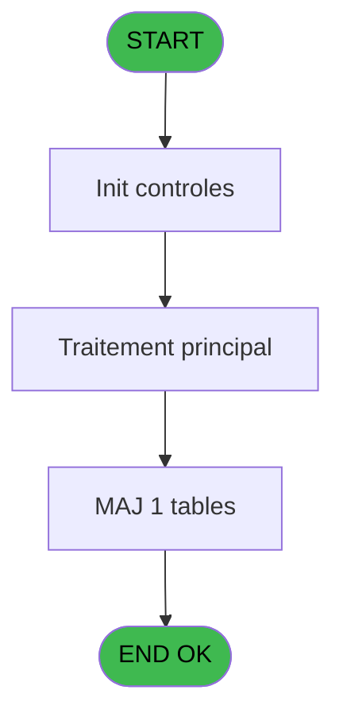
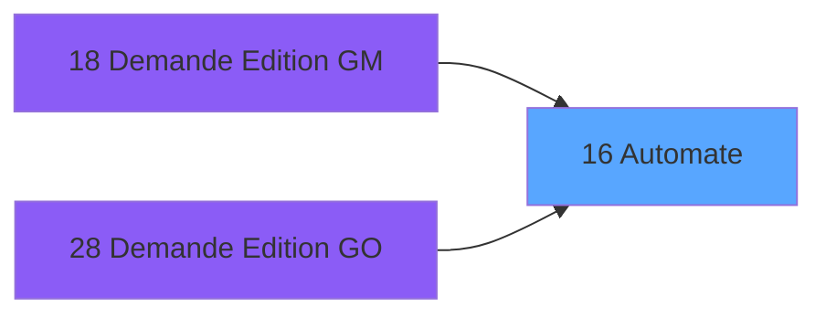

# PBP IDE 16 - Automate

> **Analyse**: Phases 1-4 2026-02-03 01:04 -> 01:04 (40s) | Assemblage 01:04
> **Pipeline**: V7.2 Enrichi
> **Structure**: 4 onglets (Resume | Ecrans | Donnees | Connexions)

<!-- TAB:Resume -->

## 1. FICHE D'IDENTITE

| Attribut | Valeur |
|----------|--------|
| Projet | PBP |
| IDE Position | 16 |
| Nom Programme | Automate |
| Fichier source | `Prg_16.xml` |
| Domaine metier | General |
| Taches | 1 (1 ecrans visibles) |
| Tables modifiees | 1 |
| Programmes appeles | 0 |

## 2. DESCRIPTION FONCTIONNELLE

**Automate** assure la gestion complete de ce processus, accessible depuis [Demande Edition GM (IDE 18)](PBP-IDE-18.md), [Demande Edition GO (IDE 28)](PBP-IDE-28.md).

Le flux de traitement s'organise en **1 blocs fonctionnels** :

- **Traitement** (1 tache) : traitements metier divers

**Donnees modifiees** : 1 tables en ecriture (automate_autorite).

**Logique metier** : 1 regles identifiees couvrant conditions metier.

## 3. BLOCS FONCTIONNELS

### 3.1 Traitement (1 tache)

Traitements internes.

---

#### 16 - Mise à Jour Automate [[ECRAN]](#ecran-t1)

**Role** : Traitement : Mise à Jour Automate.
**Ecran** : 826 x 289 DLU (MDI) | [Voir mockup](#ecran-t1)

## 5. REGLES METIER

1 regles identifiees:

### Autres (1 regles)

#### [RM-001] Si [D]='T' alors 143 sinon 110)

| Element | Detail |
|---------|--------|
| **Condition** | `[D]='T'` |
| **Si vrai** | 143 |
| **Si faux** | 110) |
| **Expression source** | Expression 8 : `IF ([D]='T',143,110)` |
| **Exemple** | Si [D]='T' → 143. Sinon → 110) |

## 6. CONTEXTE

- **Appele par**: [Demande Edition GM (IDE 18)](PBP-IDE-18.md), [Demande Edition GO (IDE 28)](PBP-IDE-28.md)
- **Appelle**: 0 programmes | **Tables**: 1 (W:1 R:0 L:0) | **Taches**: 1 | **Expressions**: 10

<!-- TAB:Ecrans -->

## 8. ECRANS

### 8.1 Forms visibles (1 / 1)

| # | Position | Tache | Nom | Type | Largeur | Hauteur | Bloc |
|---|----------|-------|-----|------|---------|---------|------|
| 1 | 16 | 16 | Mise à Jour Automate | MDI | 826 | 289 | Traitement |

### 8.2 Mockups Ecrans

---

#### 16 - Mise à Jour Automate
**Tache** : [16](#t1) | **Type** : MDI | **Dimensions** : 826 x 289 DLU
**Bloc** : Traitement | **Titre IDE** : Mise à Jour Automate

<!-- FORM-DATA:
{
    "width":  826,
    "vFactor":  8,
    "type":  "MDI",
    "hFactor":  8,
    "controls":  [
                     {
                         "x":  0,
                         "type":  "label",
                         "var":  "",
                         "y":  0,
                         "w":  822,
                         "fmt":  "",
                         "name":  "",
                         "h":  20,
                         "color":  "1",
                         "text":  "",
                         "parent":  null
                     },
                     {
                         "x":  11,
                         "type":  "table",
                         "var":  "",
                         "name":  "",
                         "titleH":  12,
                         "color":  "110",
                         "w":  802,
                         "y":  22,
                         "fmt":  "",
                         "parent":  null,
                         "text":  "",
                         "rowH":  14,
                         "h":  125,
                         "cols":  [
                                      {
                                          "title":  "Type",
                                          "layer":  1,
                                          "w":  141
                                      },
                                      {
                                          "title":  "Ordre",
                                          "layer":  2,
                                          "w":  131
                                      },
                                      {
                                          "title":  "Type édition",
                                          "layer":  3,
                                          "w":  118
                                      },
                                      {
                                          "title":  "Description",
                                          "layer":  4,
                                          "w":  256
                                      },
                                      {
                                          "title":  "Nombre Copies",
                                          "layer":  5,
                                          "w":  124
                                      }
                                  ],
                         "rows":  5
                     },
                     {
                         "x":  49,
                         "type":  "label",
                         "var":  "",
                         "y":  150,
                         "w":  333,
                         "fmt":  "",
                         "name":  "",
                         "h":  105,
                         "color":  "195",
                         "text":  "Crew",
                         "parent":  null
                     },
                     {
                         "x":  442,
                         "type":  "label",
                         "var":  "",
                         "y":  150,
                         "w":  333,
                         "fmt":  "",
                         "name":  "",
                         "h":  87,
                         "color":  "195",
                         "text":  "Pax",
                         "parent":  null
                     },
                     {
                         "x":  88,
                         "type":  "label",
                         "var":  "",
                         "y":  163,
                         "w":  230,
                         "fmt":  "",
                         "name":  "",
                         "h":  8,
                         "color":  "",
                         "text":  "C1E: Embarquants",
                         "parent":  15
                     },
                     {
                         "x":  485,
                         "type":  "label",
                         "var":  "",
                         "y":  163,
                         "w":  230,
                         "fmt":  "",
                         "name":  "",
                         "h":  8,
                         "color":  "",
                         "text":  "P1E: Embarquant",
                         "parent":  16
                     },
                     {
                         "x":  88,
                         "type":  "label",
                         "var":  "",
                         "y":  173,
                         "w":  210,
                         "fmt":  "",
                         "name":  "",
                         "h":  8,
                         "color":  "",
                         "text":  "C1D: Debarquants",
                         "parent":  15
                     },
                     {
                         "x":  485,
                         "type":  "label",
                         "var":  "",
                         "y":  173,
                         "w":  210,
                         "fmt":  "",
                         "name":  "",
                         "h":  8,
                         "color":  "",
                         "text":  "P1D: Debarquant",
                         "parent":  16
                     },
                     {
                         "x":  88,
                         "type":  "label",
                         "var":  "",
                         "y":  183,
                         "w":  96,
                         "fmt":  "",
                         "name":  "",
                         "h":  8,
                         "color":  "",
                         "text":  "C1T: Transit",
                         "parent":  15
                     },
                     {
                         "x":  485,
                         "type":  "label",
                         "var":  "",
                         "y":  183,
                         "w":  96,
                         "fmt":  "",
                         "name":  "",
                         "h":  8,
                         "color":  "",
                         "text":  "P1T: Transit",
                         "parent":  16
                     },
                     {
                         "x":  88,
                         "type":  "label",
                         "var":  "",
                         "y":  193,
                         "w":  219,
                         "fmt":  "",
                         "name":  "",
                         "h":  8,
                         "color":  "",
                         "text":  "C1L:  Embarquants + Transit",
                         "parent":  15
                     },
                     {
                         "x":  485,
                         "type":  "label",
                         "var":  "",
                         "y":  193,
                         "w":  227,
                         "fmt":  "",
                         "name":  "",
                         "h":  8,
                         "color":  "",
                         "text":  "P1L: Transits + Embarquants",
                         "parent":  16
                     },
                     {
                         "x":  88,
                         "type":  "label",
                         "var":  "",
                         "y":  203,
                         "w":  263,
                         "fmt":  "",
                         "name":  "",
                         "h":  8,
                         "color":  "",
                         "text":  "C1S: Transit triee par nationalite",
                         "parent":  15
                     },
                     {
                         "x":  485,
                         "type":  "label",
                         "var":  "",
                         "y":  203,
                         "w":  96,
                         "fmt":  "",
                         "name":  "",
                         "h":  8,
                         "color":  "",
                         "text":  "P2",
                         "parent":  16
                     },
                     {
                         "x":  88,
                         "type":  "label",
                         "var":  "",
                         "y":  213,
                         "w":  96,
                         "fmt":  "",
                         "name":  "",
                         "h":  8,
                         "color":  "",
                         "text":  "C2",
                         "parent":  15
                     },
                     {
                         "x":  485,
                         "type":  "label",
                         "var":  "",
                         "y":  213,
                         "w":  96,
                         "fmt":  "",
                         "name":  "",
                         "h":  8,
                         "color":  "",
                         "text":  "P3",
                         "parent":  16
                     },
                     {
                         "x":  88,
                         "type":  "label",
                         "var":  "",
                         "y":  223,
                         "w":  96,
                         "fmt":  "",
                         "name":  "",
                         "h":  8,
                         "color":  "",
                         "text":  "C3",
                         "parent":  15
                     },
                     {
                         "x":  485,
                         "type":  "label",
                         "var":  "",
                         "y":  223,
                         "w":  96,
                         "fmt":  "",
                         "name":  "",
                         "h":  8,
                         "color":  "",
                         "text":  "P6",
                         "parent":  16
                     },
                     {
                         "x":  88,
                         "type":  "label",
                         "var":  "",
                         "y":  233,
                         "w":  96,
                         "fmt":  "",
                         "name":  "",
                         "h":  8,
                         "color":  "",
                         "text":  "C4",
                         "parent":  15
                     },
                     {
                         "x":  442,
                         "type":  "label",
                         "var":  "",
                         "y":  240,
                         "w":  333,
                         "fmt":  "",
                         "name":  "",
                         "h":  19,
                         "color":  "",
                         "text":  "",
                         "parent":  null
                     },
                     {
                         "x":  88,
                         "type":  "label",
                         "var":  "",
                         "y":  243,
                         "w":  96,
                         "fmt":  "",
                         "name":  "",
                         "h":  8,
                         "color":  "",
                         "text":  "C5",
                         "parent":  15
                     },
                     {
                         "x":  451,
                         "type":  "label",
                         "var":  "",
                         "y":  245,
                         "w":  318,
                         "fmt":  "",
                         "name":  "",
                         "h":  8,
                         "color":  "",
                         "text":  "T: Description Groupe (Séparation édition)",
                         "parent":  null
                     },
                     {
                         "x":  0,
                         "type":  "label",
                         "var":  "",
                         "y":  262,
                         "w":  822,
                         "fmt":  "",
                         "name":  "",
                         "h":  24,
                         "color":  "1",
                         "text":  "",
                         "parent":  null
                     },
                     {
                         "x":  18,
                         "type":  "combobox",
                         "var":  "",
                         "y":  36,
                         "w":  85,
                         "fmt":  "",
                         "name":  "",
                         "h":  12,
                         "color":  "110",
                         "text":  "",
                         "parent":  5
                     },
                     {
                         "x":  171,
                         "type":  "edit",
                         "var":  "",
                         "y":  38,
                         "w":  67,
                         "fmt":  "",
                         "name":  "",
                         "h":  10,
                         "color":  "110",
                         "text":  "",
                         "parent":  5
                     },
                     {
                         "x":  315,
                         "type":  "edit",
                         "var":  "",
                         "y":  38,
                         "w":  67,
                         "fmt":  "",
                         "name":  "",
                         "h":  10,
                         "color":  "110",
                         "text":  "",
                         "parent":  5
                     },
                     {
                         "x":  702,
                         "type":  "edit",
                         "var":  "",
                         "y":  38,
                         "w":  67,
                         "fmt":  "",
                         "name":  "",
                         "h":  10,
                         "color":  "110",
                         "text":  "",
                         "parent":  5
                     },
                     {
                         "x":  411,
                         "type":  "edit",
                         "var":  "",
                         "y":  38,
                         "w":  365,
                         "fmt":  "",
                         "name":  "",
                         "h":  10,
                         "color":  "110",
                         "text":  "",
                         "parent":  5
                     },
                     {
                         "x":  591,
                         "type":  "edit",
                         "var":  "",
                         "y":  6,
                         "w":  221,
                         "fmt":  "WWW DD MMM YYYYT",
                         "name":  "",
                         "h":  8,
                         "color":  "",
                         "text":  "",
                         "parent":  1
                     },
                     {
                         "x":  6,
                         "type":  "edit",
                         "var":  "",
                         "y":  11,
                         "w":  325,
                         "fmt":  "30",
                         "name":  "",
                         "h":  8,
                         "color":  "",
                         "text":  "",
                         "parent":  1
                     },
                     {
                         "x":  8,
                         "type":  "button",
                         "var":  "",
                         "y":  265,
                         "w":  154,
                         "fmt":  "\u0026Quitter",
                         "name":  "",
                         "h":  18,
                         "color":  "",
                         "text":  "",
                         "parent":  null
                     },
                     {
                         "x":  173,
                         "type":  "button",
                         "var":  "",
                         "y":  265,
                         "w":  154,
                         "fmt":  "A\u0026bandonner",
                         "name":  "",
                         "h":  18,
                         "color":  "",
                         "text":  "",
                         "parent":  null
                     },
                     {
                         "x":  496,
                         "type":  "button",
                         "var":  "",
                         "y":  265,
                         "w":  154,
                         "fmt":  "\u0026Création",
                         "name":  "",
                         "h":  18,
                         "color":  "",
                         "text":  "",
                         "parent":  null
                     },
                     {
                         "x":  662,
                         "type":  "button",
                         "var":  "",
                         "y":  265,
                         "w":  154,
                         "fmt":  "\u0026Modifier",
                         "name":  "",
                         "h":  18,
                         "color":  "",
                         "text":  "",
                         "parent":  null
                     },
                     {
                         "x":  6,
                         "type":  "edit",
                         "var":  "",
                         "y":  2,
                         "w":  267,
                         "fmt":  "20",
                         "name":  "",
                         "h":  8,
                         "color":  "",
                         "text":  "",
                         "parent":  1
                     }
                 ],
    "taskId":  "16",
    "height":  289
}
-->

<strong>Champs : 8 champs</strong>

| Pos (x,y) | Nom | Variable | Type |
|-----------|-----|----------|------|
| 18,36 | (sans nom) | - | combobox |
| 171,38 | (sans nom) | - | edit |
| 315,38 | (sans nom) | - | edit |
| 702,38 | (sans nom) | - | edit |
| 411,38 | (sans nom) | - | edit |
| 591,6 | WWW DD MMM YYYYT | - | edit |
| 6,11 | 30 | - | edit |
| 6,2 | 20 | - | edit |

<strong>Boutons : 4 boutons</strong>

| Bouton | Pos (x,y) | Action |
|--------|-----------|--------|
| Quitter | 8,265 | Quitte le programme |
| Abandonner | 173,265 | Annule et retour au menu |
| Création | 496,265 | Bouton fonctionnel |
| Modifier | 662,265 | Modifie l'element |

## 9. NAVIGATION

Ecran unique: **Mise à Jour Automate**

### 9.3 Structure hierarchique (1 tache)

| Position | Tache | Type | Dimensions | Bloc |
|----------|-------|------|------------|------|
| **16.1** | [**Mise à Jour Automate** (16)](#t1) [mockup](#ecran-t1) | MDI | 826x289 | Traitement |

### 9.4 Algorigramme

> **Legende**: Vert = START/END OK | Rouge = END KO | Bleu = Decisions
> *Algorigramme auto-genere. Utiliser `/algorigramme` pour une synthese metier detaillee.*

<!-- TAB:Donnees -->

## 10. TABLES

### Tables utilisees (1)

| ID | Nom | Description | Type | R | W | L | Usages |
|----|-----|-------------|------|---|---|---|--------|
| 13 | automate_autorite |  | DB |   | **W** |   | 1 |

### Colonnes par table (1 / 1 tables avec colonnes identifiees)

Table 13 - automate_autorite (**W**) - 1 usages

| Lettre | Variable | Acces | Type |
|--------|----------|-------|------|
| A | > type | W | Alpha |
| B | b_Quitter | W | Alpha |

## 11. VARIABLES

### 11.1 Autres (2)

Variables diverses.

| Lettre | Nom | Type | Usage dans |
|--------|-----|------|-----------|
| A | > type | Alpha | 1x refs |
| B | b_Quitter | Alpha | - |

## 12. EXPRESSIONS

**10 / 10 expressions decodees (100%)**

### 12.1 Repartition par type

| Type | Expressions | Regles |
|------|-------------|--------|
| CONDITION | 5 | 5 |
| CONSTANTE | 2 | 0 |
| DATE | 1 | 0 |
| REFERENCE_VG | 1 | 0 |
| OTHER | 1 | 0 |

### 12.2 Expressions cles par type

#### CONDITION (5 expressions)

| Type | IDE | Expression | Regle |
|------|-----|------------|-------|
| CONDITION | 8 | `IF ([D]='T',143,110)` | [RM-001](#rm-RM-001) |
| CONDITION | 7 | `[D]='T'` | - |
| CONDITION | 10 | `[D]='T'` | - |
| CONDITION | 1 | `> type [A]` | - |
| CONDITION | 6 | `[D]<>'T'` | - |

#### CONSTANTE (2 expressions)

| Type | IDE | Expression | Regle |
|------|-----|------------|-------|
| CONSTANTE | 9 | `1` | - |
| CONSTANTE | 4 | `'&Imprimer'` | - |

#### DATE (1 expressions)

| Type | IDE | Expression | Regle |
|------|-----|------------|-------|
| DATE | 3 | `Date ()` | - |

#### REFERENCE_VG (1 expressions)

| Type | IDE | Expression | Regle |
|------|-----|------------|-------|
| REFERENCE_VG | 2 | `VG2` | - |

#### OTHER (1 expressions)

| Type | IDE | Expression | Regle |
|------|-----|------------|-------|
| OTHER | 5 | `GetParam ('VILLAGE')` | - |

<!-- TAB:Connexions -->

## 13. GRAPHE D'APPELS

### 13.1 Chaine depuis Main (Callers)

Main -> ... -> [Demande Edition GM (IDE 18)](PBP-IDE-18.md) -> **Automate (IDE 16)**

Main -> ... -> [Demande Edition GO (IDE 28)](PBP-IDE-28.md) -> **Automate (IDE 16)**

### 13.2 Callers

| IDE | Nom Programme | Nb Appels |
|-----|---------------|-----------|
| [18](PBP-IDE-18.md) | Demande Edition GM | 1 |
| [28](PBP-IDE-28.md) | Demande Edition GO | 1 |

### 13.3 Callees (programmes appeles)

### 13.4 Detail Callees avec contexte

| IDE | Nom Programme | Appels | Contexte |
|-----|---------------|--------|----------|
| - | (aucun) | - | - |

## 14. RECOMMANDATIONS MIGRATION

### 14.1 Profil du programme

| Metrique | Valeur | Impact migration |
|----------|--------|-----------------|
| Lignes de logique | 11 | Programme compact |
| Expressions | 10 | Peu de logique |
| Tables WRITE | 1 | Impact faible |
| Sous-programmes | 0 | Peu de dependances |
| Ecrans visibles | 1 | Ecran unique ou traitement batch |
| Code desactive | 0% (0 / 11) | Code sain |
| Regles metier | 1 | Quelques regles a preserver |

### 14.2 Plan de migration par bloc

#### Traitement (1 tache: 1 ecran, 0 traitement)

- **Strategie** : 1 composant(s) UI (Razor/React) avec formulaires et validation.
- Decomposer les taches en services unitaires testables.

### 14.3 Dependances critiques

| Dependance | Type | Appels | Impact |
|------------|------|--------|--------|
| automate_autorite | Table WRITE (Database) | 1x | Schema + repository |

---
*Spec DETAILED generee par Pipeline V7.2 - 2026-02-03 01:04*
