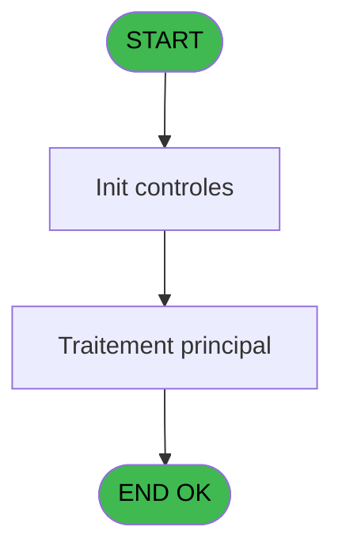
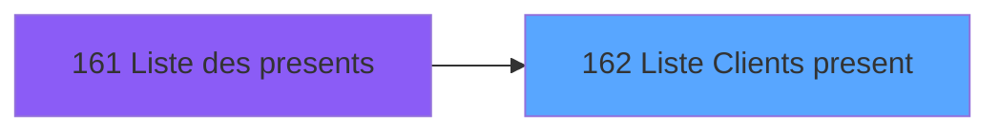
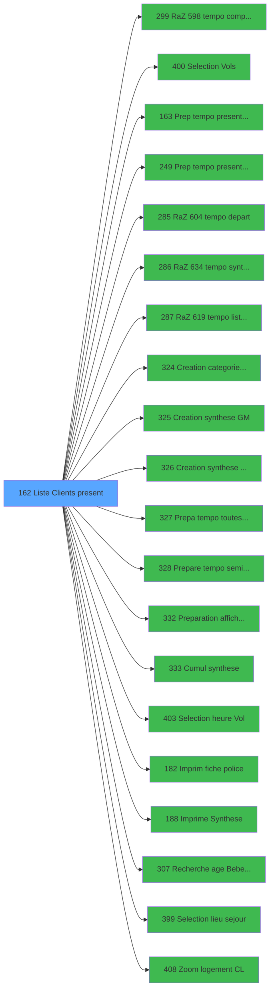

# PBP IDE 162 - Liste Clients present

> **Analyse**: Phases 1-4 2026-02-03 15:33 -> 15:33 (13s) | Assemblage 15:33
> **Pipeline**: V7.2 Enrichi
> **Structure**: 4 onglets (Resume | Ecrans | Donnees | Connexions)

<!-- TAB:Resume -->

## 1. FICHE D'IDENTITE

| Attribut | Valeur |
|----------|--------|
| Projet | PBP |
| IDE Position | 162 |
| Nom Programme | Liste Clients present |
| Fichier source | `Prg_162.xml` |
| Dossier IDE | Liste |
| Taches | 1 (1 ecrans visibles) |
| Tables modifiees | 0 |
| Programmes appeles | 20 |

## 2. DESCRIPTION FONCTIONNELLE

**Liste Clients present** assure la gestion complete de ce processus, accessible depuis [Liste des presents (IDE 161)](PBP-IDE-161.md).

Le flux de traitement s'organise en **1 blocs fonctionnels** :

- **Traitement** (1 tache) : traitements metier divers

**Logique metier** : 9 regles identifiees couvrant conditions metier.

## 3. BLOCS FONCTIONNELS

### 3.1 Traitement (1 tache)

Traitements internes.

---

#### 162 - Liste CLients ABPBDR [[ECRAN]](#ecran-t1)

**Role** : Traitement : Liste CLients ABPBDR.
**Ecran** : 1626 x 202 DLU (MDI) | [Voir mockup](#ecran-t1)
**Variables liees** : B (>CodeListe), F (>TypeListe), O (w0_TopListe), Q (w0_Liste), S (b_Liste)
**Delegue a** : [  Prep tempo present planning (IDE 163)](PBP-IDE-163.md), [Prep tempo present planning CL (IDE 249)](PBP-IDE-249.md), [Prepa tempo toutes GM CP SQL (IDE 327)](PBP-IDE-327.md)

## 5. REGLES METIER

9 regles identifiees:

### Autres (9 regles)

#### [RM-001] Si >CodeListe [B]='D' OR >CodeListe [B]='R' alors 'R' sinon 'A')

| Element | Detail |
|---------|--------|
| **Condition** | `>CodeListe [B]='D' OR >CodeListe [B]='R'` |
| **Si vrai** | 'R' |
| **Si faux** | 'A') |
| **Variables** | B (>CodeListe) |
| **Expression source** | Expression 4 : `IF (>CodeListe [B]='D' OR >CodeListe [B]='R','R','A')` |
| **Exemple** | Si >CodeListe [B]='D' OR >CodeListe [B]='R' → 'R'. Sinon → 'A') |
| **Impact** | [162 - Liste CLients ABPBDR](#t1) |

#### [RM-002] Traitement conditionnel si [AR] est a zero

| Element | Detail |
|---------|--------|
| **Condition** | `[AR]=0` |
| **Si vrai** | [AQ] |
| **Si faux** | [AR]) |
| **Expression source** | Expression 51 : `IF ([AR]=0,[AQ],[AR])` |
| **Exemple** | Si [AR]=0 → [AQ]. Sinon → [AR]) |

#### [RM-003] Si >CodeListe [B]='D' alors 'R' sinon 'A')

| Element | Detail |
|---------|--------|
| **Condition** | `>CodeListe [B]='D'` |
| **Si vrai** | 'R' |
| **Si faux** | 'A') |
| **Variables** | B (>CodeListe) |
| **Expression source** | Expression 60 : `IF (>CodeListe [B]='D','R','A')` |
| **Exemple** | Si >CodeListe [B]='D' → 'R'. Sinon → 'A') |
| **Impact** | [162 - Liste CLients ABPBDR](#t1) |

#### [RM-004] Si [AU]='VV1' alors 0 sinon IF ([AU]='VV2',13,IF ([AU]='VV3',20,[AV])))

| Element | Detail |
|---------|--------|
| **Condition** | `[AU]='VV1'` |
| **Si vrai** | 0 |
| **Si faux** | IF ([AU]='VV2',13,IF ([AU]='VV3',20,[AV]))) |
| **Expression source** | Expression 68 : `IF ([AU]='VV1',0,IF ([AU]='VV2',13,IF ([AU]='VV3',20,[AV])))` |
| **Exemple** | Si [AU]='VV1' → 0. Sinon → IF ([AU]='VV2',13,IF ([AU]='VV3',20,[AV]))) |

#### [RM-005] Traitement si Trim(w0_CategorieVol [V]) est renseigne

| Element | Detail |
|---------|--------|
| **Condition** | `Trim(w0_CategorieVol [V])<>''` |
| **Si vrai** | w0_HeureNum [M] |
| **Si faux** | 0) |
| **Variables** | M (w0_HeureNum), N (w0_Heure), V (w0_CategorieVol) |
| **Expression source** | Expression 71 : `IF (Trim(w0_CategorieVol [V])<>'',w0_HeureNum [M],0)` |
| **Exemple** | Si Trim(w0_CategorieVol [V])<>'' → w0_HeureNum [M]. Sinon → 0) |

#### [RM-006] Si InStr ('DRP' alors >CodeListe [B])>0 sinon 0,w0_Date [K])

| Element | Detail |
|---------|--------|
| **Condition** | `InStr ('DRP'` |
| **Si vrai** | >CodeListe [B])>0 |
| **Si faux** | 0,w0_Date [K]) |
| **Variables** | B (>CodeListe), K (w0_Date) |
| **Expression source** | Expression 77 : `IF (InStr ('DRP',>CodeListe [B])>0,0,w0_Date [K])` |
| **Exemple** | Si InStr ('DRP' → >CodeListe [B])>0. Sinon → 0,w0_Date [K]) |
| **Impact** | [162 - Liste CLients ABPBDR](#t1) |

#### [RM-007] Si InStr ('DR' alors >CodeListe [B])>0 sinon 0,w0_Date [K])

| Element | Detail |
|---------|--------|
| **Condition** | `InStr ('DR'` |
| **Si vrai** | >CodeListe [B])>0 |
| **Si faux** | 0,w0_Date [K]) |
| **Variables** | B (>CodeListe), K (w0_Date) |
| **Expression source** | Expression 78 : `IF (InStr ('DR',>CodeListe [B])>0,0,w0_Date [K])` |
| **Exemple** | Si InStr ('DR' → >CodeListe [B])>0. Sinon → 0,w0_Date [K]) |
| **Impact** | [162 - Liste CLients ABPBDR](#t1) |

#### [RM-008] Traitement conditionnel si [AV] est a zero

| Element | Detail |
|---------|--------|
| **Condition** | `[AV]=0` |
| **Si vrai** | 24 |
| **Si faux** | [AV]) |
| **Expression source** | Expression 135 : `IF ([AV]=0,24,[AV])` |
| **Exemple** | Si [AV]=0 → 24. Sinon → [AV]) |

#### [RM-009] Condition toujours vraie (flag actif)

| Element | Detail |
|---------|--------|
| **Condition** | `w0_TopListe [O]='CP'` |
| **Si vrai** | 'TRUE'LOG |
| **Si faux** | 'FALSE'LOG) |
| **Variables** | O (w0_TopListe) |
| **Expression source** | Expression 138 : `IF (w0_TopListe [O]='CP','TRUE'LOG,'FALSE'LOG)` |
| **Exemple** | Si w0_TopListe [O]='CP' → 'TRUE'LOG. Sinon → 'FALSE'LOG) |
| **Impact** | [162 - Liste CLients ABPBDR](#t1) |

## 6. CONTEXTE

- **Appele par**: [Liste des presents (IDE 161)](PBP-IDE-161.md)
- **Appelle**: 20 programmes | **Tables**: 4 (W:0 R:1 L:3) | **Taches**: 1 | **Expressions**: 149

<!-- TAB:Ecrans -->

## 8. ECRANS

### 8.1 Forms visibles (1 / 1)

| # | Position | Tache | Nom | Type | Largeur | Hauteur | Bloc |
|---|----------|-------|-----|------|---------|---------|------|
| 1 | 162 | 162 | Liste CLients ABPBDR | MDI | 1626 | 202 | Traitement |

### 8.2 Mockups Ecrans

---

#### 162 - Liste CLients ABPBDR
**Tache** : [162](#t1) | **Type** : MDI | **Dimensions** : 1626 x 202 DLU
**Bloc** : Traitement | **Titre IDE** : Liste CLients ABPBDR

<!-- FORM-DATA:
{
    "width":  1626,
    "vFactor":  8,
    "type":  "MDI",
    "hFactor":  8,
    "controls":  [
                     {
                         "x":  1,
                         "type":  "label",
                         "var":  "",
                         "y":  0,
                         "w":  1617,
                         "fmt":  "",
                         "name":  "",
                         "h":  20,
                         "color":  "1",
                         "text":  "",
                         "parent":  null
                     },
                     {
                         "x":  381,
                         "type":  "label",
                         "var":  "",
                         "y":  24,
                         "w":  393,
                         "fmt":  "",
                         "name":  "",
                         "h":  149,
                         "color":  "195",
                         "text":  "Paramètres",
                         "parent":  null
                     },
                     {
                         "x":  7,
                         "type":  "table",
                         "var":  "",
                         "name":  "",
                         "titleH":  12,
                         "color":  "110",
                         "w":  374,
                         "y":  26,
                         "fmt":  "",
                         "parent":  null,
                         "text":  "",
                         "rowH":  11,
                         "h":  145,
                         "cols":  [
                                      {
                                          "title":  "",
                                          "layer":  1,
                                          "w":  336
                                      }
                                  ],
                         "rows":  1
                     },
                     {
                         "x":  1168,
                         "type":  "label",
                         "var":  "",
                         "y":  27,
                         "w":  263,
                         "fmt":  "",
                         "name":  "",
                         "h":  146,
                         "color":  "",
                         "text":  "",
                         "parent":  null
                     },
                     {
                         "x":  1169,
                         "type":  "label",
                         "var":  "",
                         "y":  27,
                         "w":  263,
                         "fmt":  "",
                         "name":  "",
                         "h":  49,
                         "color":  "",
                         "text":  "",
                         "parent":  null
                     },
                     {
                         "x":  1170,
                         "type":  "label",
                         "var":  "",
                         "y":  33,
                         "w":  263,
                         "fmt":  "",
                         "name":  "",
                         "h":  49,
                         "color":  "",
                         "text":  "",
                         "parent":  null
                     },
                     {
                         "x":  1434,
                         "type":  "label",
                         "var":  "",
                         "y":  27,
                         "w":  178,
                         "fmt":  "",
                         "name":  "",
                         "h":  145,
                         "color":  "",
                         "text":  "",
                         "parent":  null
                     },
                     {
                         "x":  1180,
                         "type":  "label",
                         "var":  "",
                         "y":  33,
                         "w":  96,
                         "fmt":  "",
                         "name":  "",
                         "h":  8,
                         "color":  "",
                         "text":  "Port Arrivee",
                         "parent":  7
                     },
                     {
                         "x":  1182,
                         "type":  "label",
                         "var":  "",
                         "y":  34,
                         "w":  82,
                         "fmt":  "",
                         "name":  "",
                         "h":  8,
                         "color":  "",
                         "text":  "Seminaire",
                         "parent":  8
                     },
                     {
                         "x":  472,
                         "type":  "label",
                         "var":  "",
                         "y":  33,
                         "w":  215,
                         "fmt":  "",
                         "name":  "",
                         "h":  30,
                         "color":  "",
                         "text":  "",
                         "parent":  5
                     },
                     {
                         "x":  1199,
                         "type":  "label",
                         "var":  "",
                         "y":  46,
                         "w":  109,
                         "fmt":  "",
                         "name":  "",
                         "h":  8,
                         "color":  "",
                         "text":  "Age Minimum",
                         "parent":  9
                     },
                     {
                         "x":  502,
                         "type":  "label",
                         "var":  "",
                         "y":  39,
                         "w":  46,
                         "fmt":  "",
                         "name":  "",
                         "h":  9,
                         "color":  "",
                         "text":  "Total",
                         "parent":  14
                     },
                     {
                         "x":  1199,
                         "type":  "label",
                         "var":  "",
                         "y":  62,
                         "w":  114,
                         "fmt":  "",
                         "name":  "",
                         "h":  8,
                         "color":  "",
                         "text":  "Age Maximum",
                         "parent":  9
                     },
                     {
                         "x":  502,
                         "type":  "label",
                         "var":  "",
                         "y":  51,
                         "w":  78,
                         "fmt":  "",
                         "name":  "",
                         "h":  9,
                         "color":  "",
                         "text":  "Sélection",
                         "parent":  14
                     },
                     {
                         "x":  1182,
                         "type":  "label",
                         "var":  "",
                         "y":  59,
                         "w":  45,
                         "fmt":  "",
                         "name":  "",
                         "h":  8,
                         "color":  "",
                         "text":  "Date",
                         "parent":  7
                     },
                     {
                         "x":  1172,
                         "type":  "line",
                         "var":  "",
                         "y":  75,
                         "w":  256,
                         "fmt":  "",
                         "name":  "",
                         "h":  0,
                         "color":  "",
                         "text":  "",
                         "parent":  7
                     },
                     {
                         "x":  1182,
                         "type":  "label",
                         "var":  "",
                         "y":  87,
                         "w":  98,
                         "fmt":  "",
                         "name":  "",
                         "h":  8,
                         "color":  "",
                         "text":  "Dernier Port",
                         "parent":  7
                     },
                     {
                         "x":  393,
                         "type":  "label",
                         "var":  "",
                         "y":  66,
                         "w":  86,
                         "fmt":  "",
                         "name":  "",
                         "h":  9,
                         "color":  "",
                         "text":  "Date",
                         "parent":  5
                     },
                     {
                         "x":  393,
                         "type":  "label",
                         "var":  "",
                         "y":  80,
                         "w":  86,
                         "fmt":  "",
                         "name":  "",
                         "h":  8,
                         "color":  "",
                         "text":  "Heure",
                         "parent":  5
                     },
                     {
                         "x":  1182,
                         "type":  "label",
                         "var":  "",
                         "y":  110,
                         "w":  45,
                         "fmt":  "",
                         "name":  "",
                         "h":  8,
                         "color":  "",
                         "text":  "Date",
                         "parent":  7
                     },
                     {
                         "x":  393,
                         "type":  "label",
                         "var":  "",
                         "y":  92,
                         "w":  86,
                         "fmt":  "",
                         "name":  "",
                         "h":  9,
                         "color":  "",
                         "text":  "Liste",
                         "parent":  5
                     },
                     {
                         "x":  1172,
                         "type":  "line",
                         "var":  "",
                         "y":  125,
                         "w":  256,
                         "fmt":  "",
                         "name":  "",
                         "h":  0,
                         "color":  "",
                         "text":  "",
                         "parent":  7
                     },
                     {
                         "x":  1182,
                         "type":  "label",
                         "var":  "",
                         "y":  132,
                         "w":  110,
                         "fmt":  "",
                         "name":  "",
                         "h":  8,
                         "color":  "",
                         "text":  "Prochain Port",
                         "parent":  7
                     },
                     {
                         "x":  393,
                         "type":  "label",
                         "var":  "",
                         "y":  105,
                         "w":  86,
                         "fmt":  "",
                         "name":  "",
                         "h":  8,
                         "color":  "",
                         "text":  "Vol",
                         "parent":  5
                     },
                     {
                         "x":  393,
                         "type":  "label",
                         "var":  "",
                         "y":  121,
                         "w":  90,
                         "fmt":  "",
                         "name":  "",
                         "h":  9,
                         "color":  "",
                         "text":  "Lieu séjour",
                         "parent":  5
                     },
                     {
                         "x":  1182,
                         "type":  "label",
                         "var":  "",
                         "y":  156,
                         "w":  45,
                         "fmt":  "",
                         "name":  "",
                         "h":  8,
                         "color":  "",
                         "text":  "Date",
                         "parent":  7
                     },
                     {
                         "x":  393,
                         "type":  "label",
                         "var":  "",
                         "y":  133,
                         "w":  130,
                         "fmt":  "",
                         "name":  "",
                         "h":  9,
                         "color":  "",
                         "text":  "Code Logement",
                         "parent":  5
                     },
                     {
                         "x":  0,
                         "type":  "label",
                         "var":  "",
                         "y":  175,
                         "w":  1617,
                         "fmt":  "",
                         "name":  "",
                         "h":  24,
                         "color":  "1",
                         "text":  "",
                         "parent":  null
                     },
                     {
                         "x":  393,
                         "type":  "label",
                         "var":  "",
                         "y":  147,
                         "w":  157,
                         "fmt":  "",
                         "name":  "",
                         "h":  9,
                         "color":  "",
                         "text":  "Grouper par filiation",
                         "parent":  5
                     },
                     {
                         "x":  393,
                         "type":  "label",
                         "var":  "",
                         "y":  160,
                         "w":  157,
                         "fmt":  "",
                         "name":  "",
                         "h":  12,
                         "color":  "",
                         "text":  "Heure départ",
                         "parent":  48
                     },
                     {
                         "x":  487,
                         "type":  "edit",
                         "var":  "",
                         "y":  66,
                         "w":  126,
                         "fmt":  "",
                         "name":  "w0_Date",
                         "h":  10,
                         "color":  "6",
                         "text":  "",
                         "parent":  5
                     },
                     {
                         "x":  615,
                         "type":  "button",
                         "var":  "",
                         "y":  66,
                         "w":  25,
                         "fmt":  "...",
                         "name":  "b_Date",
                         "h":  10,
                         "color":  "",
                         "text":  "",
                         "parent":  5
                     },
                     {
                         "x":  487,
                         "type":  "edit",
                         "var":  "",
                         "y":  80,
                         "w":  37,
                         "fmt":  "2",
                         "name":  "w0_HeureNum",
                         "h":  10,
                         "color":  "6",
                         "text":  "",
                         "parent":  5
                     },
                     {
                         "x":  487,
                         "type":  "edit",
                         "var":  "",
                         "y":  92,
                         "w":  182,
                         "fmt":  "",
                         "name":  "w0_Liste",
                         "h":  10,
                         "color":  "6",
                         "text":  "",
                         "parent":  5
                     },
                     {
                         "x":  670,
                         "type":  "button",
                         "var":  "",
                         "y":  92,
                         "w":  25,
                         "fmt":  "...",
                         "name":  "b_Liste",
                         "h":  10,
                         "color":  "",
                         "text":  "",
                         "parent":  5
                     },
                     {
                         "x":  487,
                         "type":  "edit",
                         "var":  "",
                         "y":  120,
                         "w":  26,
                         "fmt":  "",
                         "name":  "w0_LieuSejour",
                         "h":  10,
                         "color":  "6",
                         "text":  "",
                         "parent":  5
                     },
                     {
                         "x":  550,
                         "type":  "edit",
                         "var":  "",
                         "y":  132,
                         "w":  103,
                         "fmt":  "",
                         "name":  "W0_CodeLogement",
                         "h":  10,
                         "color":  "6",
                         "text":  "",
                         "parent":  5
                     },
                     {
                         "x":  487,
                         "type":  "edit",
                         "var":  "",
                         "y":  105,
                         "w":  82,
                         "fmt":  "",
                         "name":  "w0_CategorieVol",
                         "h":  10,
                         "color":  "6",
                         "text":  "",
                         "parent":  5
                     },
                     {
                         "x":  1182,
                         "type":  "edit",
                         "var":  "",
                         "y":  45,
                         "w":  238,
                         "fmt":  "",
                         "name":  "w0_PortArrive",
                         "h":  10,
                         "color":  "6",
                         "text":  "",
                         "parent":  7
                     },
                     {
                         "x":  1259,
                         "type":  "edit",
                         "var":  "",
                         "y":  59,
                         "w":  126,
                         "fmt":  "DD/MM/YYYY",
                         "name":  "w0_DateArr",
                         "h":  10,
                         "color":  "6",
                         "text":  "",
                         "parent":  7
                     },
                     {
                         "x":  1392,
                         "type":  "button",
                         "var":  "",
                         "y":  59,
                         "w":  28,
                         "fmt":  "",
                         "name":  "b_DateArr",
                         "h":  10,
                         "color":  "",
                         "text":  "",
                         "parent":  7
                     },
                     {
                         "x":  1182,
                         "type":  "edit",
                         "var":  "",
                         "y":  98,
                         "w":  238,
                         "fmt":  "",
                         "name":  "w0_DernierPort",
                         "h":  10,
                         "color":  "6",
                         "text":  "",
                         "parent":  7
                     },
                     {
                         "x":  1259,
                         "type":  "edit",
                         "var":  "",
                         "y":  110,
                         "w":  126,
                         "fmt":  "DD/MM/YYYY",
                         "name":  "w0_DateDernier",
                         "h":  10,
                         "color":  "6",
                         "text":  "",
                         "parent":  7
                     },
                     {
                         "x":  1392,
                         "type":  "button",
                         "var":  "",
                         "y":  110,
                         "w":  28,
                         "fmt":  "",
                         "name":  "b_DateDern",
                         "h":  10,
                         "color":  "",
                         "text":  "",
                         "parent":  7
                     },
                     {
                         "x":  1182,
                         "type":  "edit",
                         "var":  "",
                         "y":  143,
                         "w":  238,
                         "fmt":  "",
                         "name":  "w0_ProchainPort",
                         "h":  10,
                         "color":  "6",
                         "text":  "",
                         "parent":  7
                     },
                     {
                         "x":  1259,
                         "type":  "edit",
                         "var":  "",
                         "y":  156,
                         "w":  126,
                         "fmt":  "DD/MM/YYYY",
                         "name":  "w0_DateProchain",
                         "h":  10,
                         "color":  "6",
                         "text":  "",
                         "parent":  7
                     },
                     {
                         "x":  1392,
                         "type":  "button",
                         "var":  "",
                         "y":  156,
                         "w":  28,
                         "fmt":  "",
                         "name":  "b_DateProchain",
                         "h":  10,
                         "color":  "",
                         "text":  "",
                         "parent":  7
                     },
                     {
                         "x":  1341,
                         "type":  "edit",
                         "var":  "",
                         "y":  46,
                         "w":  37,
                         "fmt":  "",
                         "name":  "w0_AgeMini",
                         "h":  10,
                         "color":  "6",
                         "text":  "",
                         "parent":  9
                     },
                     {
                         "x":  1341,
                         "type":  "edit",
                         "var":  "",
                         "y":  62,
                         "w":  37,
                         "fmt":  "",
                         "name":  "w0_AgeMaxi",
                         "h":  10,
                         "color":  "6",
                         "text":  "",
                         "parent":  9
                     },
                     {
                         "x":  546,
                         "type":  "edit",
                         "var":  "",
                         "y":  120,
                         "w":  221,
                         "fmt":  "19",
                         "name":  "",
                         "h":  10,
                         "color":  "142",
                         "text":  "",
                         "parent":  5
                     },
                     {
                         "x":  516,
                         "type":  "button",
                         "var":  "",
                         "y":  120,
                         "w":  25,
                         "fmt":  "...",
                         "name":  "b_LieuSejour",
                         "h":  10,
                         "color":  "",
                         "text":  "",
                         "parent":  5
                     },
                     {
                         "x":  660,
                         "type":  "button",
                         "var":  "",
                         "y":  132,
                         "w":  25,
                         "fmt":  "...",
                         "name":  "b_CodeLogement",
                         "h":  10,
                         "color":  "",
                         "text":  "",
                         "parent":  5
                     },
                     {
                         "x":  49,
                         "type":  "edit",
                         "var":  "",
                         "y":  28,
                         "w":  277,
                         "fmt":  "",
                         "name":  "QUA Libelle",
                         "h":  8,
                         "color":  "110",
                         "text":  "",
                         "parent":  6
                     },
                     {
                         "x":  13,
                         "type":  "checkbox",
                         "var":  "",
                         "y":  28,
                         "w":  30,
                         "fmt":  "",
                         "name":  "TUL MARQUEUR",
                         "h":  9,
                         "color":  "110",
                         "text":  "",
                         "parent":  6
                     },
                     {
                         "x":  603,
                         "type":  "edit",
                         "var":  "",
                         "y":  39,
                         "w":  56,
                         "fmt":  "",
                         "name":  "w0_Total",
                         "h":  9,
                         "color":  "",
                         "text":  "",
                         "parent":  14
                     },
                     {
                         "x":  603,
                         "type":  "edit",
                         "var":  "",
                         "y":  51,
                         "w":  56,
                         "fmt":  "",
                         "name":  "w0_Selection",
                         "h":  9,
                         "color":  "",
                         "text":  "",
                         "parent":  14
                     },
                     {
                         "x":  1444,
                         "type":  "button",
                         "var":  "",
                         "y":  105,
                         "w":  154,
                         "fmt":  "\u0026Ecran",
                         "name":  "b_Ecran",
                         "h":  18,
                         "color":  "",
                         "text":  "",
                         "parent":  10
                     },
                     {
                         "x":  1444,
                         "type":  "button",
                         "var":  "",
                         "y":  126,
                         "w":  154,
                         "fmt":  "\u0026Imprimer",
                         "name":  "b_Edition",
                         "h":  18,
                         "color":  "",
                         "text":  "",
                         "parent":  10
                     },
                     {
                         "x":  1444,
                         "type":  "button",
                         "var":  "",
                         "y":  147,
                         "w":  154,
                         "fmt":  "\u0026Excel",
                         "name":  "b_Excel",
                         "h":  18,
                         "color":  "",
                         "text":  "",
                         "parent":  10
                     },
                     {
                         "x":  6,
                         "type":  "edit",
                         "var":  "",
                         "y":  2,
                         "w":  267,
                         "fmt":  "20",
                         "name":  "",
                         "h":  8,
                         "color":  "",
                         "text":  "",
                         "parent":  1
                     },
                     {
                         "x":  1391,
                         "type":  "edit",
                         "var":  "",
                         "y":  6,
                         "w":  203,
                         "fmt":  "WWW DD MMM YYYYT",
                         "name":  "",
                         "h":  8,
                         "color":  "",
                         "text":  "",
                         "parent":  1
                     },
                     {
                         "x":  6,
                         "type":  "edit",
                         "var":  "",
                         "y":  11,
                         "w":  325,
                         "fmt":  "30",
                         "name":  "",
                         "h":  8,
                         "color":  "",
                         "text":  "",
                         "parent":  1
                     },
                     {
                         "x":  1443,
                         "type":  "image",
                         "var":  "",
                         "y":  55,
                         "w":  159,
                         "fmt":  "",
                         "name":  "",
                         "h":  53,
                         "color":  "",
                         "text":  "",
                         "parent":  10
                     },
                     {
                         "x":  8,
                         "type":  "button",
                         "var":  "",
                         "y":  178,
                         "w":  154,
                         "fmt":  "\u0026Quitter",
                         "name":  "",
                         "h":  18,
                         "color":  "",
                         "text":  "",
                         "parent":  53
                     },
                     {
                         "x":  786,
                         "type":  "subform",
                         "var":  "",
                         "y":  27,
                         "w":  376,
                         "fmt":  "",
                         "name":  "Sel Code Logements",
                         "h":  146,
                         "color":  "",
                         "text":  "",
                         "parent":  null
                     },
                     {
                         "x":  555,
                         "type":  "checkbox",
                         "var":  "",
                         "y":  147,
                         "w":  32,
                         "fmt":  "",
                         "name":  "w0_OnlyTai_0001",
                         "h":  9,
                         "color":  "",
                         "text":  "",
                         "parent":  5
                     },
                     {
                         "x":  555,
                         "type":  "combobox",
                         "var":  "",
                         "y":  159,
                         "w":  203,
                         "fmt":  "",
                         "name":  "w0_Heure depart Village",
                         "h":  12,
                         "color":  "",
                         "text":  "S,L",
                         "parent":  5
                     },
                     {
                         "x":  1182,
                         "type":  "combobox",
                         "var":  "",
                         "y":  45,
                         "w":  238,
                         "fmt":  "",
                         "name":  "w0_NomSeminaire_0001",
                         "h":  12,
                         "color":  "",
                         "text":  "",
                         "parent":  8
                     }
                 ],
    "taskId":  "162",
    "height":  202
}
-->

<strong>Champs : 25 champs</strong>

| Pos (x,y) | Nom | Variable | Type |
|-----------|-----|----------|------|
| 487,66 | w0_Date | - | edit |
| 487,80 | w0_HeureNum | - | edit |
| 487,92 | w0_Liste | - | edit |
| 487,120 | w0_LieuSejour | - | edit |
| 550,132 | W0_CodeLogement | - | edit |
| 487,105 | w0_CategorieVol | - | edit |
| 1182,45 | w0_PortArrive | - | edit |
| 1259,59 | w0_DateArr | - | edit |
| 1182,98 | w0_DernierPort | - | edit |
| 1259,110 | w0_DateDernier | - | edit |
| 1182,143 | w0_ProchainPort | - | edit |
| 1259,156 | w0_DateProchain | - | edit |
| 1341,46 | w0_AgeMini | - | edit |
| 1341,62 | w0_AgeMaxi | - | edit |
| 546,120 | 19 | - | edit |
| 49,28 | QUA Libelle | - | edit |
| 13,28 | TUL MARQUEUR | - | checkbox |
| 603,39 | w0_Total | - | edit |
| 603,51 | w0_Selection | - | edit |
| 6,2 | 20 | - | edit |
| 1391,6 | WWW DD MMM YYYYT | - | edit |
| 6,11 | 30 | - | edit |
| 555,147 | w0_OnlyTai_0001 | - | checkbox |
| 555,159 | w0_Heure depart Village | - | combobox |
| 1182,45 | w0_NomSeminaire_0001 | - | combobox |

<strong>Boutons : 11 boutons</strong>

| Bouton | Pos (x,y) | Action |
|--------|-----------|--------|
| ... | 615,66 | Bouton fonctionnel |
| ... | 670,92 | Bouton fonctionnel |
| b_DateArr | 1392,59 | Bouton fonctionnel |
| b_DateDern | 1392,110 | Bouton fonctionnel |
| b_DateProchain | 1392,156 | Bouton fonctionnel |
| ... | 516,120 | Bouton fonctionnel |
| ... | 660,132 | Bouton fonctionnel |
| Ecran | 1444,105 | Appel [RaZ 619 tempo liste ecran (IDE 287)](PBP-IDE-287.md) |
| Imprimer | 1444,126 | Appel [  Imprim  fiche police (IDE 182)](PBP-IDE-182.md) |
| Excel | 1444,147 | Bouton fonctionnel |
| Quitter | 8,178 | Quitte le programme |

## 9. NAVIGATION

Ecran unique: **Liste CLients ABPBDR**

### 9.3 Structure hierarchique (1 tache)

| Position | Tache | Type | Dimensions | Bloc |
|----------|-------|------|------------|------|
| **162.1** | [**Liste CLients ABPBDR** (162)](#t1) [mockup](#ecran-t1) | MDI | 1626x202 | Traitement |

### 9.4 Algorigramme

> **Legende**: Vert = START/END OK | Rouge = END KO | Bleu = Decisions
> *Algorigramme auto-genere. Utiliser `/algorigramme` pour une synthese metier detaillee.*

<!-- TAB:Donnees -->

## 10. TABLES

### Tables utilisees (4)

| ID | Nom | Description | Type | R | W | L | Usages |
|----|-----|-------------|------|---|---|---|--------|
| 81 | societe__________soc |  | DB | R |   |   | 1 |
| 118 | tables_imports |  | DB |   |   | L | 1 |
| 120 | tables_qualites__qua |  | DB |   |   | L | 1 |
| 637 | tempo_zone_secteur | Table temporaire ecran | DB |   |   | L | 1 |

### Colonnes par table (1 / 1 tables avec colonnes identifiees)

Table 81 - societe__________soc (R) - 1 usages

| Lettre | Variable | Acces | Type |
|--------|----------|-------|------|
| A | >CodeEcran | R | Numeric |
| B | >CodeListe | R | Alpha |
| C | >CodeSelect | R | Alpha |
| D | >Categorie | R | Alpha |
| E | >NomTable | R | Alpha |
| F | >TypeListe | R | Alpha |
| G | w0_CodeEcranFille | R | Numeric |
| H | w0_IndexGene | R | Numeric |
| I | w0_TypeVol | R | Alpha |
| J | w0_OkVol | R | Logical |
| K | w0_Date | R | Date |
| L | b_Date | R | Alpha |
| M | w0_HeureNum | R | Numeric |
| N | w0_Heure | R | Alpha |
| O | w0_TopListe | R | Alpha |
| P | w0_NbSelect | R | Numeric |
| Q | w0_Liste | R | Alpha |
| R | w0_Pays | R | Alpha |
| S | b_Liste | R | Alpha |
| T | w0_LieuSejour | R | Alpha |
| U | W0_CodeLogement | R | Alpha |
| V | w0_CategorieVol | R | Alpha |
| W | w0_Compagnie | R | Alpha |
| X | w0_DateVillageAV | R | Date |
| Y | b_DateVillageAV | R | Alpha |
| Z | w0_HeureVillageAV | R | Alpha |
| BA | w0_DateVillageDR | R | Date |
| BB | b_DateVillageDR | R | Alpha |
| BC | w0_HeureVillageDR | R | Alpha |
| BD | w0_Logement | R | Alpha |
| BE | w0_HeurePresent | R | Alpha |
| BF | w0_NomSeminaire | R | Alpha |
| BG | w0_PortArrive | R | Alpha |
| BH | w0_DateArr | R | Date |
| BI | b_DateArr | R | Alpha |
| BJ | w0_DernierPort | R | Alpha |
| BK | w0_DateDernier | R | Date |
| BL | b_DateDern | R | Alpha |
| BM | w0_ProchainPort | R | Alpha |
| BN | w0_DateProchain | R | Date |
| BO | b_DateProchain | R | Alpha |
| BP | w0_AgeMini | R | Numeric |
| BQ | w0_AgeMaxi | R | Numeric |
| BR | w0_CodeVol | R | Alpha |
| BS | w0_CodeVille | R | Alpha |
| BT | w0_CodeVV | R | Alpha |
| BU | w0_HeureMin | R | Numeric |
| BV | w0_HeureMax | R | Numeric |
| BW | w0_DateDebMin | R | Date |
| BX | w0_DateDebMax | R | Date |
| BY | w0_DateFinMin | R | Date |
| BZ | w0_DateFinMax | R | Date |
| CA | b_LieuSejour | R | Alpha |
| CB | b_CodeLogement | R | Alpha |
| CC | b_Sejour | R | Alpha |
| CD | w0_Grouper par filiation | R | Logical |
| CE | w0_Heure depart Village | R | Alpha |
| CF | w0_Total | R | Numeric |
| CG | w0_Selection | R | Numeric |
| CH | v. titre | R | Alpha |
| CI | W0 nom societe | R | Alpha |
| CJ | W0 date minimum | R | Date |
| CK | b_DateMini | R | Alpha |
| CL | w0_SejourMulti | R | Logical |
| CM | w0_AgeBebe | R | Numeric |
| CN | w0_AgeEnfant | R | Numeric |
| CO | b_Ecran | R | Alpha |
| CP | b_Edition | R | Alpha |
| CQ | b_Excel | R | Alpha |
| CR | w0_Fichier_Excel | R | Alpha |

## 11. VARIABLES

### 11.1 Variables de session (1)

Variables persistantes pendant toute la session.

| Lettre | Nom | Type | Usage dans |
|--------|-----|------|-----------|
| CH | v. titre | Alpha | - |

### 11.2 Variables de travail (2)

Variables internes au programme.

| Lettre | Nom | Type | Usage dans |
|--------|-----|------|-----------|
| CI | W0 nom societe | Alpha | - |
| CJ | W0 date minimum | Date | - |

### 11.3 Autres (67)

Variables diverses.

| Lettre | Nom | Type | Usage dans |
|--------|-----|------|-----------|
| A | >CodeEcran | Numeric | - |
| B | >CodeListe | Alpha | 14x refs |
| C | >CodeSelect | Alpha | - |
| D | >Categorie | Alpha | 1x refs |
| E | >NomTable | Alpha | 1x refs |
| F | >TypeListe | Alpha | - |
| G | w0_CodeEcranFille | Numeric | - |
| H | w0_IndexGene | Numeric | - |
| I | w0_TypeVol | Alpha | - |
| J | w0_OkVol | Logical | - |
| K | w0_Date | Date | 11x refs |
| L | b_Date | Alpha | 2x refs |
| M | w0_HeureNum | Numeric | 4x refs |
| N | w0_Heure | Alpha | 8x refs |
| O | w0_TopListe | Alpha | 39x refs |
| P | w0_NbSelect | Numeric | - |
| Q | w0_Liste | Alpha | 2x refs |
| R | w0_Pays | Alpha | - |
| S | b_Liste | Alpha | - |
| T | w0_LieuSejour | Alpha | 2x refs |
| U | W0_CodeLogement | Alpha | - |
| V | w0_CategorieVol | Alpha | 3x refs |
| W | w0_Compagnie | Alpha | 1x refs |
| X | w0_DateVillageAV | Date | - |
| Y | b_DateVillageAV | Alpha | 1x refs |
| Z | w0_HeureVillageAV | Alpha | 1x refs |
| BA | w0_DateVillageDR | Date | - |
| BB | b_DateVillageDR | Alpha | - |
| BC | w0_HeureVillageDR | Alpha | - |
| BD | w0_Logement | Alpha | - |
| BE | w0_HeurePresent | Alpha | - |
| BF | w0_NomSeminaire | Alpha | - |
| BG | w0_PortArrive | Alpha | - |
| BH | w0_DateArr | Date | - |
| BI | b_DateArr | Alpha | 1x refs |
| BJ | w0_DernierPort | Alpha | 1x refs |
| BK | w0_DateDernier | Date | - |
| BL | b_DateDern | Alpha | - |
| BM | w0_ProchainPort | Alpha | - |
| BN | w0_DateProchain | Date | - |
| BO | b_DateProchain | Alpha | - |
| BP | w0_AgeMini | Numeric | - |
| BQ | w0_AgeMaxi | Numeric | - |
| BR | w0_CodeVol | Alpha | - |
| BS | w0_CodeVille | Alpha | - |
| BT | w0_CodeVV | Alpha | - |
| BU | w0_HeureMin | Numeric | - |
| BV | w0_HeureMax | Numeric | 2x refs |
| BW | w0_DateDebMin | Date | 1x refs |
| BX | w0_DateDebMax | Date | - |
| BY | w0_DateFinMin | Date | - |
| BZ | w0_DateFinMax | Date | 1x refs |
| CA | b_LieuSejour | Alpha | 1x refs |
| CB | b_CodeLogement | Alpha | - |
| CC | b_Sejour | Alpha | 1x refs |
| CD | w0_Grouper par filiation | Logical | - |
| CE | w0_Heure depart Village | Alpha | - |
| CF | w0_Total | Numeric | - |
| CG | w0_Selection | Numeric | - |
| CK | b_DateMini | Alpha | - |
| CL | w0_SejourMulti | Logical | - |
| CM | w0_AgeBebe | Numeric | - |
| CN | w0_AgeEnfant | Numeric | - |
| CO | b_Ecran | Alpha | - |
| CP | b_Edition | Alpha | - |
| CQ | b_Excel | Alpha | - |
| CR | w0_Fichier_Excel | Alpha | - |

Toutes les 70 variables (liste complete)

| Cat | Lettre | Nom Variable | Type |
|-----|--------|--------------|------|
| W0 | **CI** | W0 nom societe | Alpha |
| W0 | **CJ** | W0 date minimum | Date |
| V. | **CH** | v. titre | Alpha |
| Autre | **A** | >CodeEcran | Numeric |
| Autre | **B** | >CodeListe | Alpha |
| Autre | **C** | >CodeSelect | Alpha |
| Autre | **D** | >Categorie | Alpha |
| Autre | **E** | >NomTable | Alpha |
| Autre | **F** | >TypeListe | Alpha |
| Autre | **G** | w0_CodeEcranFille | Numeric |
| Autre | **H** | w0_IndexGene | Numeric |
| Autre | **I** | w0_TypeVol | Alpha |
| Autre | **J** | w0_OkVol | Logical |
| Autre | **K** | w0_Date | Date |
| Autre | **L** | b_Date | Alpha |
| Autre | **M** | w0_HeureNum | Numeric |
| Autre | **N** | w0_Heure | Alpha |
| Autre | **O** | w0_TopListe | Alpha |
| Autre | **P** | w0_NbSelect | Numeric |
| Autre | **Q** | w0_Liste | Alpha |
| Autre | **R** | w0_Pays | Alpha |
| Autre | **S** | b_Liste | Alpha |
| Autre | **T** | w0_LieuSejour | Alpha |
| Autre | **U** | W0_CodeLogement | Alpha |
| Autre | **V** | w0_CategorieVol | Alpha |
| Autre | **W** | w0_Compagnie | Alpha |
| Autre | **X** | w0_DateVillageAV | Date |
| Autre | **Y** | b_DateVillageAV | Alpha |
| Autre | **Z** | w0_HeureVillageAV | Alpha |
| Autre | **BA** | w0_DateVillageDR | Date |
| Autre | **BB** | b_DateVillageDR | Alpha |
| Autre | **BC** | w0_HeureVillageDR | Alpha |
| Autre | **BD** | w0_Logement | Alpha |
| Autre | **BE** | w0_HeurePresent | Alpha |
| Autre | **BF** | w0_NomSeminaire | Alpha |
| Autre | **BG** | w0_PortArrive | Alpha |
| Autre | **BH** | w0_DateArr | Date |
| Autre | **BI** | b_DateArr | Alpha |
| Autre | **BJ** | w0_DernierPort | Alpha |
| Autre | **BK** | w0_DateDernier | Date |
| Autre | **BL** | b_DateDern | Alpha |
| Autre | **BM** | w0_ProchainPort | Alpha |
| Autre | **BN** | w0_DateProchain | Date |
| Autre | **BO** | b_DateProchain | Alpha |
| Autre | **BP** | w0_AgeMini | Numeric |
| Autre | **BQ** | w0_AgeMaxi | Numeric |
| Autre | **BR** | w0_CodeVol | Alpha |
| Autre | **BS** | w0_CodeVille | Alpha |
| Autre | **BT** | w0_CodeVV | Alpha |
| Autre | **BU** | w0_HeureMin | Numeric |
| Autre | **BV** | w0_HeureMax | Numeric |
| Autre | **BW** | w0_DateDebMin | Date |
| Autre | **BX** | w0_DateDebMax | Date |
| Autre | **BY** | w0_DateFinMin | Date |
| Autre | **BZ** | w0_DateFinMax | Date |
| Autre | **CA** | b_LieuSejour | Alpha |
| Autre | **CB** | b_CodeLogement | Alpha |
| Autre | **CC** | b_Sejour | Alpha |
| Autre | **CD** | w0_Grouper par filiation | Logical |
| Autre | **CE** | w0_Heure depart Village | Alpha |
| Autre | **CF** | w0_Total | Numeric |
| Autre | **CG** | w0_Selection | Numeric |
| Autre | **CK** | b_DateMini | Alpha |
| Autre | **CL** | w0_SejourMulti | Logical |
| Autre | **CM** | w0_AgeBebe | Numeric |
| Autre | **CN** | w0_AgeEnfant | Numeric |
| Autre | **CO** | b_Ecran | Alpha |
| Autre | **CP** | b_Edition | Alpha |
| Autre | **CQ** | b_Excel | Alpha |
| Autre | **CR** | w0_Fichier_Excel | Alpha |

## 12. EXPRESSIONS

**149 / 149 expressions decodees (100%)**

### 12.1 Repartition par type

| Type | Expressions | Regles |
|------|-------------|--------|
| CONDITION | 70 | 8 |
| CAST_LOGIQUE | 3 | 5 |
| CONSTANTE | 48 | 0 |
| DATE | 1 | 0 |
| FORMAT | 1 | 0 |
| OTHER | 16 | 0 |
| CONCATENATION | 2 | 0 |
| REFERENCE_VG | 3 | 0 |
| STRING | 5 | 0 |

### 12.2 Expressions cles par type

#### CONDITION (70 expressions)

| Type | IDE | Expression | Regle |
|------|-----|------------|-------|
| CONDITION | 71 | `IF (Trim(w0_CategorieVol [V])<>'',w0_HeureNum [M],0)` | [RM-005](#rm-RM-005) |
| CONDITION | 78 | `IF (InStr ('DR',>CodeListe [B])>0,0,w0_Date [K])` | [RM-007](#rm-RM-007) |
| CONDITION | 77 | `IF (InStr ('DRP',>CodeListe [B])>0,0,w0_Date [K])` | [RM-006](#rm-RM-006) |
| CONDITION | 135 | `IF ([AV]=0,24,[AV])` | [RM-008](#rm-RM-008) |
| CONDITION | 68 | `IF ([AU]='VV1',0,IF ([AU]='VV2',13,IF ([AU]='VV3',20,[AV])))` | [RM-004](#rm-RM-004) |
| ... | | *+65 autres* | |

#### CAST_LOGIQUE (3 expressions)

| Type | IDE | Expression | Regle |
|------|-----|------------|-------|
| CAST_LOGIQUE | 138 | `IF (w0_TopListe [O]='CP','TRUE'LOG,'FALSE'LOG)` | [RM-009](#rm-RM-009) |
| CAST_LOGIQUE | 145 | `'TRUE'LOG` | - |
| CAST_LOGIQUE | 55 | `'FALSE'LOG` | - |

#### CONSTANTE (48 expressions)

| Type | IDE | Expression | Regle |
|------|-----|------------|-------|
| CONSTANTE | 106 | `92` | - |
| CONSTANTE | 105 | `91` | - |
| CONSTANTE | 104 | `90` | - |
| CONSTANTE | 109 | `95` | - |
| CONSTANTE | 108 | `94` | - |
| ... | | *+43 autres* | |

#### DATE (1 expressions)

| Type | IDE | Expression | Regle |
|------|-----|------------|-------|
| DATE | 16 | `Date ()` | - |

#### FORMAT (1 expressions)

| Type | IDE | Expression | Regle |
|------|-----|------------|-------|
| FORMAT | 141 | `('%club_exportdata%')&Trim(GetParam('VILLAGE'))&'_PRES_'&Trim(w0_Liste [Q])&
'_'&DStr(w0_Date [K],'YYYYMMDD')&'_'& IF( [FS]='L','LIBCH','DEPVIL')&'.csv'` | - |

#### OTHER (16 expressions)

| Type | IDE | Expression | Regle |
|------|-----|------------|-------|
| OTHER | 83 | `SetCrsr (2)` | - |
| OTHER | 84 | `SetCrsr (1)` | - |
| OTHER | 70 | `[AV]` | - |
| OTHER | 73 | `w0_Date [K]` | - |
| OTHER | 139 | `w0_CategorieVol [V]` | - |
| ... | | *+11 autres* | |

#### CONCATENATION (2 expressions)

| Type | IDE | Expression | Regle |
|------|-----|------------|-------|
| CONCATENATION | 9 | `'C'&>CodeListe [B]&'C99'` | - |
| CONCATENATION | 8 | `'C'&>CodeListe [B]&'60'` | - |

#### REFERENCE_VG (3 expressions)

| Type | IDE | Expression | Regle |
|------|-----|------------|-------|
| REFERENCE_VG | 147 | `VG88` | - |
| REFERENCE_VG | 21 | `VG1` | - |
| REFERENCE_VG | 15 | `VG2` | - |

#### STRING (5 expressions)

| Type | IDE | Expression | Regle |
|------|-----|------------|-------|
| STRING | 75 | `Val (w0_Heure [N],'2')` | - |
| STRING | 142 | `Trim([FQ])` | - |
| STRING | 74 | `Val (b_DateVillageAV [Y],'2')` | - |
| STRING | 13 | `Str (w0_HeureNum [M],'2P0Z0')` | - |
| STRING | 14 | `Trim (w0_DateDebMin [BW])` | - |

### 12.3 Toutes les expressions (149)

Voir les 149 expressions

#### CONDITION (70)

| IDE | Expression Decodee |
|-----|-------------------|
| 4 | `IF (>CodeListe [B]='D' OR >CodeListe [B]='R','R','A')` |
| 5 | `IF (>CodeListe [B]='D' OR >CodeListe [B]='R',6,IF (InStr ('AVB',>CodeListe [B])>0,5,1))` |
| 51 | `IF ([AR]=0,[AQ],[AR])` |
| 60 | `IF (>CodeListe [B]='D','R','A')` |
| 68 | `IF ([AU]='VV1',0,IF ([AU]='VV2',13,IF ([AU]='VV3',20,[AV])))` |
| 69 | `IF ([AU]='VV1',13,IF ([AU]='VV2',20,IF ([AU]='VV3',24,[AV])))` |
| 71 | `IF (Trim(w0_CategorieVol [V])<>'',w0_HeureNum [M],0)` |
| 72 | `IF (Trim(w0_CategorieVol [V])<>'',w0_HeureNum [M],24)` |
| 77 | `IF (InStr ('DRP',>CodeListe [B])>0,0,w0_Date [K])` |
| 78 | `IF (InStr ('DR',>CodeListe [B])>0,0,w0_Date [K])` |
| 79 | `IF (InStr ('DRP',>CodeListe [B])>0,w0_Date [K],0)` |
| 80 | `IF (InStr ('DR',>CodeListe [B])>0,w0_Date [K],0)` |
| 135 | `IF ([AV]=0,24,[AV])` |
| 22 | `>Categorie [D]` |
| 23 | `>NomTable [E]` |
| 26 | `w0_TopListe [O]='PL'` |
| 27 | `w0_TopListe [O]='GR'` |
| 28 | `w0_TopListe [O]='GR' OR w0_TopListe [O]='CP'` |
| 29 | `w0_TopListe [O]='RE'` |
| 30 | `w0_TopListe [O]='CA'` |
| 31 | `w0_TopListe [O]='MI'` |
| 32 | `w0_TopListe [O]='BB'` |
| 33 | `w0_TopListe [O]='SI'` |
| 34 | `w0_TopListe [O]='NS'` |
| 35 | `w0_TopListe [O]='PY'` |
| 36 | `w0_TopListe [O]='HM'` |
| 37 | `w0_TopListe [O]='VV'` |
| 38 | `w0_TopListe [O]='NV'` |
| 39 | `w0_TopListe [O]='AG'` |
| 40 | `w0_TopListe [O]='CO'` |
| 41 | `w0_TopListe [O]='PO'` |
| 42 | `w0_TopListe [O]='BA'` |
| 43 | `w0_TopListe [O]='SM'` |
| 44 | `w0_TopListe [O]='ST'` |
| 45 | `w0_TopListe [O]='SE'` |
| 46 | `w0_TopListe [O]='AF'` |
| 47 | `w0_TopListe [O]='CP'` |
| 48 | `w0_TopListe [O]='RE'` |
| 49 | `w0_TopListe [O]<>'CP' AND w0_TopListe [O]<>'GR'` |
| 52 | `w0_TopListe [O]='AG' OR w0_TopListe [O]='SA'` |
| 56 | `>CodeListe [B]='A' OR >CodeListe [B]='V'` |
| 57 | `>CodeListe [B]='D' OR >CodeListe [B]='R'` |
| 82 | `>CodeListe [B]='P'` |
| 85 | `w0_TopListe [O]='SY' OR w0_TopListe [O]='SA'` |
| 86 | `w0_TopListe [O]='SY' AND >CodeListe [B]<>'P'` |
| 87 | `w0_TopListe [O]='SA' OR >CodeListe [B]='P' AND w0_TopListe [O]='SY'` |
| 88 | `w0_TopListe [O]<>'SY' AND w0_TopListe [O]<>'SA'` |
| 89 | `w0_TopListe [O]='PL'` |
| 90 | `w0_TopListe [O]='CL'` |
| 91 | `w0_TopListe [O]<>'PL' AND w0_TopListe [O]<>'ST' AND w0_TopListe [O]<>'SE' AND w0_TopListe [O]<>'PO' AND w0_TopListe [O]<>'BA' AND w0_TopListe [O]<>'AF' AND w0_TopListe [O]<>'CL'` |
| 92 | `w0_TopListe [O]<>'PL' AND w0_TopListe [O]<>'SM' AND w0_TopListe [O]<>'AF' AND w0_TopListe [O]<>'CL'` |
| 93 | `w0_TopListe [O]='BA' OR w0_TopListe [O]='PO'` |
| 119 | `w0_Liste [Q]=''` |
| 120 | `w0_Date [K]=0` |
| 121 | `w0_HeureNum [M]=0` |
| 122 | `w0_TopListe [O]=''` |
| 123 | `w0_Compagnie [W]=0` |
| 124 | `w0_HeureVillageAV [Z]=0` |
| 125 | `[AI]=0` |
| 126 | `[AL]=0` |
| 127 | `[AO]=0` |
| 129 | `w0_HeureMax [BV]>0` |
| 130 | `w0_HeureMax [BV]=0` |
| 131 | `b_LieuSejour [CA]>w0_Date [K]` |
| 133 | `[AW]=0` |
| 134 | `w0_LieuSejour [T]=''` |
| 136 | `w0_TopListe [O]='AF' OR w0_TopListe [O]='RE'` |
| 140 | `w0_TopListe [O]='CL'` |
| 144 | `NOT(w0_TopListe [O]='SY' OR w0_TopListe [O]='SA')` |
| 148 | `[FS]='L'` |

#### CAST_LOGIQUE (3)

| IDE | Expression Decodee |
|-----|-------------------|
| 138 | `IF (w0_TopListe [O]='CP','TRUE'LOG,'FALSE'LOG)` |
| 55 | `'FALSE'LOG` |
| 145 | `'TRUE'LOG` |

#### CONSTANTE (48)

| IDE | Expression Decodee |
|-----|-------------------|
| 2 | `'VBEBE'` |
| 3 | `'VENFA'` |
| 6 | `'PL'` |
| 10 | `'Se&jour'` |
| 12 | `'...'` |
| 18 | `'Planning'` |
| 20 | `'C'` |
| 53 | `'M'` |
| 54 | `'TNATI'` |
| 58 | `'A'` |
| 59 | `'R'` |
| 61 | `'VV1'` |
| 62 | `'VV2'` |
| 63 | `'VV3'` |
| 64 | `10` |
| 65 | `18` |
| 66 | `23` |
| 67 | `'23'` |
| 76 | `0` |
| 81 | `'GM'` |
| 94 | `80` |
| 95 | `81` |
| 96 | `82` |
| 97 | `83` |
| 98 | `84` |
| 99 | `85` |
| 100 | `86` |
| 101 | `87` |
| 102 | `88` |
| 103 | `89` |
| 104 | `90` |
| 105 | `91` |
| 106 | `92` |
| 107 | `93` |
| 108 | `94` |
| 109 | `95` |
| 110 | `96` |
| 111 | `97` |
| 112 | `98` |
| 113 | `99` |
| 114 | `100` |
| 116 | `'&Ecran'` |
| 117 | `'&Imprimer'` |
| 118 | `'&Excel'` |
| 132 | `24` |
| 137 | `'G'` |
| 146 | `'S'` |
| 149 | `'PRE'` |

#### DATE (1)

| IDE | Expression Decodee |
|-----|-------------------|
| 16 | `Date ()` |

#### FORMAT (1)

| IDE | Expression Decodee |
|-----|-------------------|
| 141 | `('%club_exportdata%')&Trim(GetParam('VILLAGE'))&'_PRES_'&Trim(w0_Liste [Q])&
'_'&DStr(w0_Date [K],'YYYYMMDD')&'_'& IF( [FS]='L','LIBCH','DEPVIL')&'.csv'` |

#### OTHER (16)

| IDE | Expression Decodee |
|-----|-------------------|
| 1 | `GetParam ('LIEU_SEJOUR')` |
| 7 | `w0_DateFinMax [BZ]` |
| 11 | `w0_LieuSejour [T]` |
| 17 | `UDF ('hotfudge.calendar',WinHWND (0),w0_Date [K])` |
| 19 | `GetParam ('SOCIETE')` |
| 24 | `b_DateArr [BI]` |
| 25 | `w0_DernierPort [BJ]` |
| 50 | `UDF ('hotfudge.calendar',WinHWND (0),[AL])` |
| 70 | `[AV]` |
| 73 | `w0_Date [K]` |
| 83 | `SetCrsr (2)` |
| 84 | `SetCrsr (1)` |
| 115 | `b_Sejour [CC]` |
| 128 | `GetParam ('VILLAGE')` |
| 139 | `w0_CategorieVol [V]` |
| 143 | `[FQ]` |

#### CONCATENATION (2)

| IDE | Expression Decodee |
|-----|-------------------|
| 8 | `'C'&>CodeListe [B]&'60'` |
| 9 | `'C'&>CodeListe [B]&'C99'` |

#### REFERENCE_VG (3)

| IDE | Expression Decodee |
|-----|-------------------|
| 15 | `VG2` |
| 21 | `VG1` |
| 147 | `VG88` |

#### STRING (5)

| IDE | Expression Decodee |
|-----|-------------------|
| 13 | `Str (w0_HeureNum [M],'2P0Z0')` |
| 14 | `Trim (w0_DateDebMin [BW])` |
| 74 | `Val (b_DateVillageAV [Y],'2')` |
| 75 | `Val (w0_Heure [N],'2')` |
| 142 | `Trim([FQ])` |

<!-- TAB:Connexions -->

## 13. GRAPHE D'APPELS

### 13.1 Chaine depuis Main (Callers)

Main -> ... -> [Liste des presents (IDE 161)](PBP-IDE-161.md) -> **Liste Clients present (IDE 162)**

### 13.2 Callers

| IDE | Nom Programme | Nb Appels |
|-----|---------------|-----------|
| [161](PBP-IDE-161.md) | Liste des presents | 1 |

### 13.3 Callees (programmes appeles)

### 13.4 Detail Callees avec contexte

| IDE | Nom Programme | Appels | Contexte |
|-----|---------------|--------|----------|
| [299](PBP-IDE-299.md) | RaZ 598 tempo comptage | 5 | Reinitialisation |
| [400](PBP-IDE-400.md) | Selection Vols | 4 | Selection/consultation |
| [163](PBP-IDE-163.md) |   Prep tempo present planning | 3 | Sous-programme |
| [249](PBP-IDE-249.md) | Prep tempo present planning CL | 3 | Sous-programme |
| [285](PBP-IDE-285.md) | RaZ 604 tempo depart | 3 | Reinitialisation |
| [286](PBP-IDE-286.md) | RaZ  634 tempo synthese | 3 | Reinitialisation |
| [287](PBP-IDE-287.md) | RaZ 619 tempo liste ecran | 3 | Reinitialisation |
| [324](PBP-IDE-324.md) | Creation categorie comptage | 3 | Sous-programme |
| [325](PBP-IDE-325.md) | Creation synthese GM | 3 | Sous-programme |
| [326](PBP-IDE-326.md) | Creation synthese present reel | 3 | Sous-programme |
| [327](PBP-IDE-327.md) | Prepa tempo toutes GM CP SQL | 3 | Sous-programme |
| [328](PBP-IDE-328.md) | Prepare tempo seminaire | 3 | Sous-programme |
| [332](PBP-IDE-332.md) | Preparation affichage depart | 3 | Affichage donnees |
| [333](PBP-IDE-333.md) | Cumul synthese | 3 | Sous-programme |
| [403](PBP-IDE-403.md) | Selection heure / Vol | 3 | Selection/consultation |
| [182](PBP-IDE-182.md) |   Imprim  fiche police | 2 | Impression ticket/document |
| [188](PBP-IDE-188.md) |   Imprime Synthese | 2 | Impression ticket/document |
| [307](PBP-IDE-307.md) | Recherche age Bebe_Enfant | 2 | Sous-programme |
| [399](PBP-IDE-399.md) | Selection lieu sejour | 2 | Selection/consultation |
| [408](PBP-IDE-408.md) | Zoom logement CL | 2 | Selection/consultation |

## 14. RECOMMANDATIONS MIGRATION

### 14.1 Profil du programme

| Metrique | Valeur | Impact migration |
|----------|--------|-----------------|
| Lignes de logique | 395 | Taille moyenne |
| Expressions | 149 | Logique moderee |
| Tables WRITE | 0 | Impact faible |
| Sous-programmes | 20 | Forte dependance |
| Ecrans visibles | 1 | Ecran unique ou traitement batch |
| Code desactive | 0% (0 / 395) | Code sain |
| Regles metier | 9 | Quelques regles a preserver |

### 14.2 Plan de migration par bloc

#### Traitement (1 tache: 1 ecran, 0 traitement)

- **Strategie** : 1 composant(s) UI (Razor/React) avec formulaires et validation.
- 20 sous-programme(s) a migrer ou a reutiliser depuis les services existants.
- Decomposer les taches en services unitaires testables.

### 14.3 Dependances critiques

| Dependance | Type | Appels | Impact |
|------------|------|--------|--------|
| [RaZ 598 tempo comptage (IDE 299)](PBP-IDE-299.md) | Sous-programme | 5x | **CRITIQUE** - Reinitialisation |
| [Selection Vols (IDE 400)](PBP-IDE-400.md) | Sous-programme | 4x | **CRITIQUE** - Selection/consultation |
| [Prepare tempo seminaire (IDE 328)](PBP-IDE-328.md) | Sous-programme | 3x | **CRITIQUE** - Sous-programme |
| [Prepa tempo toutes GM CP SQL (IDE 327)](PBP-IDE-327.md) | Sous-programme | 3x | **CRITIQUE** - Sous-programme |
| [Creation synthese present reel (IDE 326)](PBP-IDE-326.md) | Sous-programme | 3x | **CRITIQUE** - Sous-programme |
| [Selection heure / Vol (IDE 403)](PBP-IDE-403.md) | Sous-programme | 3x | **CRITIQUE** - Selection/consultation |
| [Cumul synthese (IDE 333)](PBP-IDE-333.md) | Sous-programme | 3x | **CRITIQUE** - Sous-programme |
| [Preparation affichage depart (IDE 332)](PBP-IDE-332.md) | Sous-programme | 3x | **CRITIQUE** - Affichage donnees |
| [Creation synthese GM (IDE 325)](PBP-IDE-325.md) | Sous-programme | 3x | **CRITIQUE** - Sous-programme |
| [RaZ 604 tempo depart (IDE 285)](PBP-IDE-285.md) | Sous-programme | 3x | **CRITIQUE** - Reinitialisation |

---
*Spec DETAILED generee par Pipeline V7.2 - 2026-02-03 15:33*
