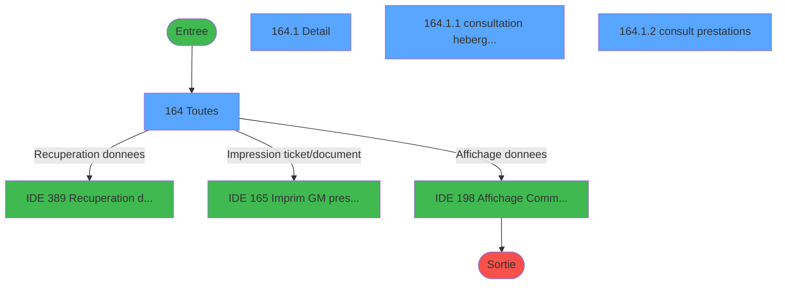
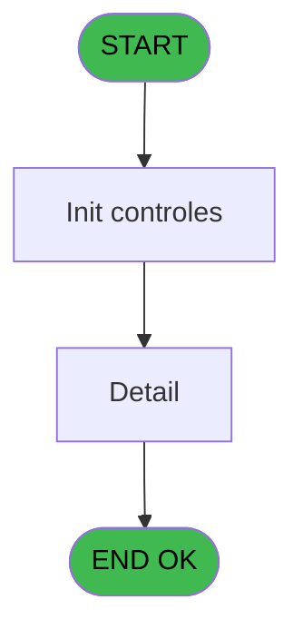
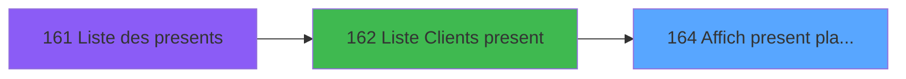
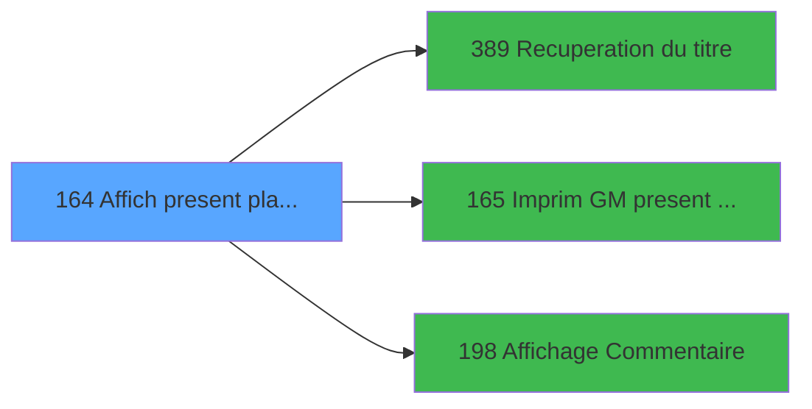

# PBP IDE 164 - Affich present planning GM

> **Analyse**: Phases 1-4 2026-02-03 15:34 -> 15:34 (17s) | Assemblage 15:34
> **Pipeline**: V7.2 Enrichi
> **Structure**: 4 onglets (Resume | Ecrans | Donnees | Connexions)

<!-- TAB:Resume -->

## 1. FICHE D'IDENTITE

| Attribut | Valeur |
|----------|--------|
| Projet | PBP |
| IDE Position | 164 |
| Nom Programme | Affich present planning GM |
| Fichier source | `Prg_164.xml` |
| Dossier IDE | Liste |
| Taches | 4 (4 ecrans visibles) |
| Tables modifiees | 0 |
| Programmes appeles | 3 |

## 2. DESCRIPTION FONCTIONNELLE

**Affich present planning GM** assure la gestion complete de ce processus, accessible depuis [  Liste Clients present (IDE 162)](PBP-IDE-162.md).

Le flux de traitement s'organise en **1 blocs fonctionnels** :

- **Traitement** (4 taches) : traitements metier divers

**Logique metier** : 2 regles identifiees couvrant conditions metier.

Detail : phases du traitement

#### Phase 1 : Traitement (4 taches)

- **164** - Toutes **[[ECRAN]](#ecran-t1)**
- **164.1** - Detail **[[ECRAN]](#ecran-t2)**
- **164.1.1** - consultation hebergement **[[ECRAN]](#ecran-t3)**
- **164.1.2** - consult prestations **[[ECRAN]](#ecran-t4)**

Delegue a : [Recuperation du titre (IDE 389)](PBP-IDE-389.md)

## 3. BLOCS FONCTIONNELS

### 3.1 Traitement (4 taches)

Traitements internes.

---

#### 164 - Toutes [[ECRAN]](#ecran-t1)

**Role** : Traitement : Toutes.
**Ecran** : 1237 x 226 DLU (MDI) | [Voir mockup](#ecran-t1)

3 sous-taches directes

| Tache | Nom | Bloc |
|-------|-----|------|
| [164.1](#t2) | Detail **[[ECRAN]](#ecran-t2)** | Traitement |
| [164.1.1](#t3) | consultation hebergement **[[ECRAN]](#ecran-t3)** | Traitement |
| [164.1.2](#t4) | consult prestations **[[ECRAN]](#ecran-t4)** | Traitement |

**Delegue a** : [Recuperation du titre (IDE 389)](PBP-IDE-389.md)

---

#### 164.1 - Detail [[ECRAN]](#ecran-t2)

**Role** : Traitement : Detail.
**Ecran** : 768 x 265 DLU (MDI) | [Voir mockup](#ecran-t2)
**Delegue a** : [Recuperation du titre (IDE 389)](PBP-IDE-389.md)

---

#### 164.1.1 - consultation hebergement [[ECRAN]](#ecran-t3)

**Role** : Consultation/chargement : consultation hebergement.
**Ecran** : 763 x 78 DLU (Modal) | [Voir mockup](#ecran-t3)
**Delegue a** : [Recuperation du titre (IDE 389)](PBP-IDE-389.md)

---

#### 164.1.2 - consult prestations [[ECRAN]](#ecran-t4)

**Role** : Traitement : consult prestations.
**Ecran** : 759 x 40 DLU (Modal) | [Voir mockup](#ecran-t4)
**Delegue a** : [Recuperation du titre (IDE 389)](PBP-IDE-389.md)

## 5. REGLES METIER

2 regles identifiees:

### Autres (2 regles)

#### [RM-001] Si [DO] alors [DM]&[DN]&Str([AH] sinon '3P0'),w0_Ordre tri [Q]&Str([AH],'3P0'))

| Element | Detail |
|---------|--------|
| **Condition** | `[DO]` |
| **Si vrai** | [DM]&[DN]&Str([AH] |
| **Si faux** | '3P0'),w0_Ordre tri [Q]&Str([AH],'3P0')) |
| **Variables** | Q (w0_Ordre tri) |
| **Expression source** | Expression 25 : `IF([DO],[DM]&[DN]&Str([AH],'3P0'),w0_Ordre tri [Q]&Str([AH],` |
| **Exemple** | Si [DO] → [DM]&[DN]&Str([AH]. Sinon → '3P0'),w0_Ordre tri [Q]&Str([AH],'3P0')) |

#### [RM-002] Si VG88 AND [DR] alors TStr([DQ] sinon 'HHhMMZ'),[AB])

| Element | Detail |
|---------|--------|
| **Condition** | `VG88 AND [DR]` |
| **Si vrai** | TStr([DQ] |
| **Si faux** | 'HHhMMZ'),[AB]) |
| **Expression source** | Expression 26 : `IF(VG88 AND [DR],TStr([DQ],'HHhMMZ'),[AB])` |
| **Exemple** | Si VG88 AND [DR] → TStr([DQ]. Sinon → 'HHhMMZ'),[AB]) |

## 6. CONTEXTE

- **Appele par**: [  Liste Clients present (IDE 162)](PBP-IDE-162.md)
- **Appelle**: 3 programmes | **Tables**: 9 (W:0 R:4 L:5) | **Taches**: 4 | **Expressions**: 27

<!-- TAB:Ecrans -->

## 8. ECRANS

### 8.1 Forms visibles (4 / 4)

| # | Position | Tache | Nom | Type | Largeur | Hauteur | Bloc |
|---|----------|-------|-----|------|---------|---------|------|
| 1 | 164 | 164 | Toutes | MDI | 1237 | 226 | Traitement |
| 2 | 164.1 | 164.1 | Detail | MDI | 768 | 265 | Traitement |
| 3 | 164.1.1 | 164.1.1 | consultation hebergement | Modal | 763 | 78 | Traitement |
| 4 | 164.1.2 | 164.1.2 | consult prestations | Modal | 759 | 40 | Traitement |

### 8.2 Mockups Ecrans

---

#### 164 - Toutes
**Tache** : [164](#t1) | **Type** : MDI | **Dimensions** : 1237 x 226 DLU
**Bloc** : Traitement | **Titre IDE** : Toutes

<!-- FORM-DATA:
{
    "width":  1237,
    "vFactor":  8,
    "type":  "MDI",
    "hFactor":  8,
    "controls":  [
                     {
                         "x":  0,
                         "type":  "label",
                         "var":  "",
                         "y":  0,
                         "w":  1234,
                         "fmt":  "",
                         "name":  "",
                         "h":  19,
                         "color":  "",
                         "text":  "",
                         "parent":  null
                     },
                     {
                         "x":  1,
                         "type":  "table",
                         "var":  "",
                         "name":  "",
                         "titleH":  12,
                         "color":  "110",
                         "w":  1046,
                         "y":  26,
                         "fmt":  "",
                         "parent":  null,
                         "text":  "",
                         "rowH":  14,
                         "h":  112,
                         "cols":  [
                                      {
                                          "title":  "Nom",
                                          "layer":  1,
                                          "w":  188
                                      },
                                      {
                                          "title":  "Prénom",
                                          "layer":  2,
                                          "w":  130
                                      },
                                      {
                                          "title":  "Sexe",
                                          "layer":  3,
                                          "w":  55
                                      },
                                      {
                                          "title":  "Qualité",
                                          "layer":  4,
                                          "w":  116
                                      },
                                      {
                                          "title":  "Age",
                                          "layer":  5,
                                          "w":  52
                                      },
                                      {
                                          "title":  "Logement",
                                          "layer":  6,
                                          "w":  183
                                      },
                                      {
                                          "title":  "Pays",
                                          "layer":  7,
                                          "w":  59
                                      },
                                      {
                                          "title":  "Numéro Adhérent",
                                          "layer":  8,
                                          "w":  230
                                      }
                                  ],
                         "rows":  8
                     },
                     {
                         "x":  1050,
                         "type":  "label",
                         "var":  "",
                         "y":  26,
                         "w":  175,
                         "fmt":  "",
                         "name":  "",
                         "h":  167,
                         "color":  "",
                         "text":  "",
                         "parent":  null
                     },
                     {
                         "x":  7,
                         "type":  "label",
                         "var":  "",
                         "y":  140,
                         "w":  1035,
                         "fmt":  "",
                         "name":  "",
                         "h":  53,
                         "color":  "",
                         "text":  "",
                         "parent":  null
                     },
                     {
                         "x":  18,
                         "type":  "label",
                         "var":  "",
                         "y":  146,
                         "w":  245,
                         "fmt":  "",
                         "name":  "",
                         "h":  42,
                         "color":  "195",
                         "text":  "Arrivée",
                         "parent":  25
                     },
                     {
                         "x":  275,
                         "type":  "label",
                         "var":  "",
                         "y":  146,
                         "w":  245,
                         "fmt":  "",
                         "name":  "",
                         "h":  42,
                         "color":  "195",
                         "text":  "Départ",
                         "parent":  25
                     },
                     {
                         "x":  529,
                         "type":  "label",
                         "var":  "",
                         "y":  150,
                         "w":  499,
                         "fmt":  "",
                         "name":  "",
                         "h":  38,
                         "color":  "",
                         "text":  "",
                         "parent":  null
                     },
                     {
                         "x":  29,
                         "type":  "label",
                         "var":  "",
                         "y":  158,
                         "w":  120,
                         "fmt":  "",
                         "name":  "",
                         "h":  8,
                         "color":  "",
                         "text":  "Date",
                         "parent":  26
                     },
                     {
                         "x":  158,
                         "type":  "label",
                         "var":  "",
                         "y":  158,
                         "w":  82,
                         "fmt":  "",
                         "name":  "",
                         "h":  8,
                         "color":  "",
                         "text":  "Heure",
                         "parent":  26
                     },
                     {
                         "x":  288,
                         "type":  "label",
                         "var":  "",
                         "y":  158,
                         "w":  120,
                         "fmt":  "",
                         "name":  "",
                         "h":  8,
                         "color":  "",
                         "text":  "Date",
                         "parent":  27
                     },
                     {
                         "x":  419,
                         "type":  "label",
                         "var":  "",
                         "y":  158,
                         "w":  82,
                         "fmt":  "",
                         "name":  "",
                         "h":  8,
                         "color":  "",
                         "text":  "Heure",
                         "parent":  27
                     },
                     {
                         "x":  0,
                         "type":  "label",
                         "var":  "",
                         "y":  199,
                         "w":  1234,
                         "fmt":  "",
                         "name":  "",
                         "h":  23,
                         "color":  "",
                         "text":  "",
                         "parent":  null
                     },
                     {
                         "x":  11,
                         "type":  "edit",
                         "var":  "",
                         "y":  41,
                         "w":  176,
                         "fmt":  "",
                         "name":  "TLE Nom",
                         "h":  8,
                         "color":  "110",
                         "text":  "",
                         "parent":  6
                     },
                     {
                         "x":  197,
                         "type":  "edit",
                         "var":  "",
                         "y":  41,
                         "w":  120,
                         "fmt":  "",
                         "name":  "TLE Prenom",
                         "h":  8,
                         "color":  "110",
                         "text":  "",
                         "parent":  6
                     },
                     {
                         "x":  326,
                         "type":  "edit",
                         "var":  "",
                         "y":  40,
                         "w":  37,
                         "fmt":  "",
                         "name":  "TLE Sexe",
                         "h":  10,
                         "color":  "110",
                         "text":  "",
                         "parent":  6
                     },
                     {
                         "x":  381,
                         "type":  "edit",
                         "var":  "",
                         "y":  40,
                         "w":  104,
                         "fmt":  "",
                         "name":  "TLE Qualite",
                         "h":  10,
                         "color":  "110",
                         "text":  "",
                         "parent":  6
                     },
                     {
                         "x":  498,
                         "type":  "edit",
                         "var":  "",
                         "y":  40,
                         "w":  37,
                         "fmt":  "",
                         "name":  "TLE Age",
                         "h":  10,
                         "color":  "110",
                         "text":  "",
                         "parent":  6
                     },
                     {
                         "x":  549,
                         "type":  "edit",
                         "var":  "",
                         "y":  40,
                         "w":  171,
                         "fmt":  "",
                         "name":  "TLE Logement",
                         "h":  10,
                         "color":  "110",
                         "text":  "",
                         "parent":  6
                     },
                     {
                         "x":  733,
                         "type":  "edit",
                         "var":  "",
                         "y":  40,
                         "w":  37,
                         "fmt":  "",
                         "name":  "TLE Pays",
                         "h":  10,
                         "color":  "110",
                         "text":  "",
                         "parent":  6
                     },
                     {
                         "x":  792,
                         "type":  "edit",
                         "var":  "",
                         "y":  40,
                         "w":  216,
                         "fmt":  "",
                         "name":  "TLE Numero Adherent",
                         "h":  10,
                         "color":  "110",
                         "text":  "",
                         "parent":  6
                     },
                     {
                         "x":  29,
                         "type":  "edit",
                         "var":  "",
                         "y":  172,
                         "w":  120,
                         "fmt":  "",
                         "name":  "",
                         "h":  10,
                         "color":  "",
                         "text":  "",
                         "parent":  26
                     },
                     {
                         "x":  158,
                         "type":  "edit",
                         "var":  "",
                         "y":  172,
                         "w":  82,
                         "fmt":  "",
                         "name":  "",
                         "h":  10,
                         "color":  "",
                         "text":  "",
                         "parent":  26
                     },
                     {
                         "x":  288,
                         "type":  "edit",
                         "var":  "",
                         "y":  172,
                         "w":  120,
                         "fmt":  "",
                         "name":  "",
                         "h":  10,
                         "color":  "",
                         "text":  "",
                         "parent":  27
                     },
                     {
                         "x":  419,
                         "type":  "edit",
                         "var":  "",
                         "y":  172,
                         "w":  82,
                         "fmt":  "6",
                         "name":  "",
                         "h":  10,
                         "color":  "",
                         "text":  "",
                         "parent":  27
                     },
                     {
                         "x":  947,
                         "type":  "edit",
                         "var":  "",
                         "y":  172,
                         "w":  56,
                         "fmt":  "",
                         "name":  "",
                         "h":  10,
                         "color":  "",
                         "text":  "",
                         "parent":  28
                     },
                     {
                         "x":  1059,
                         "type":  "button",
                         "var":  "",
                         "y":  114,
                         "w":  154,
                         "fmt":  "\u0026Commentaire",
                         "name":  "b_Commentaire",
                         "h":  18,
                         "color":  "",
                         "text":  "",
                         "parent":  null
                     },
                     {
                         "x":  1059,
                         "type":  "button",
                         "var":  "",
                         "y":  139,
                         "w":  154,
                         "fmt":  "\u0026Voir",
                         "name":  "b_Ecran",
                         "h":  18,
                         "color":  "",
                         "text":  "",
                         "parent":  null
                     },
                     {
                         "x":  1059,
                         "type":  "button",
                         "var":  "",
                         "y":  162,
                         "w":  154,
                         "fmt":  "\u0026Impression",
                         "name":  "b_Imprim",
                         "h":  18,
                         "color":  "",
                         "text":  "",
                         "parent":  null
                     },
                     {
                         "x":  8,
                         "type":  "edit",
                         "var":  "",
                         "y":  2,
                         "w":  395,
                         "fmt":  "30",
                         "name":  "",
                         "h":  8,
                         "color":  "",
                         "text":  "",
                         "parent":  1
                     },
                     {
                         "x":  472,
                         "type":  "edit",
                         "var":  "",
                         "y":  6,
                         "w":  288,
                         "fmt":  "25",
                         "name":  "",
                         "h":  8,
                         "color":  "",
                         "text":  "",
                         "parent":  1
                     },
                     {
                         "x":  915,
                         "type":  "edit",
                         "var":  "",
                         "y":  6,
                         "w":  310,
                         "fmt":  "WWW DD MMM YYYYT",
                         "name":  "",
                         "h":  8,
                         "color":  "",
                         "text":  "",
                         "parent":  null
                     },
                     {
                         "x":  8,
                         "type":  "edit",
                         "var":  "",
                         "y":  10,
                         "w":  154,
                         "fmt":  "30",
                         "name":  "",
                         "h":  8,
                         "color":  "",
                         "text":  "",
                         "parent":  1
                     },
                     {
                         "x":  1054,
                         "type":  "image",
                         "var":  "",
                         "y":  43,
                         "w":  165,
                         "fmt":  "",
                         "name":  "",
                         "h":  50,
                         "color":  "",
                         "text":  "",
                         "parent":  7
                     },
                     {
                         "x":  561,
                         "type":  "edit",
                         "var":  "",
                         "y":  156,
                         "w":  56,
                         "fmt":  "4",
                         "name":  "",
                         "h":  10,
                         "color":  "",
                         "text":  "",
                         "parent":  28
                     },
                     {
                         "x":  835,
                         "type":  "edit",
                         "var":  "",
                         "y":  156,
                         "w":  168,
                         "fmt":  "14",
                         "name":  "",
                         "h":  10,
                         "color":  "",
                         "text":  "",
                         "parent":  28
                     },
                     {
                         "x":  561,
                         "type":  "edit",
                         "var":  "",
                         "y":  172,
                         "w":  194,
                         "fmt":  "30",
                         "name":  "",
                         "h":  10,
                         "color":  "",
                         "text":  "",
                         "parent":  28
                     },
                     {
                         "x":  773,
                         "type":  "edit",
                         "var":  "",
                         "y":  172,
                         "w":  157,
                         "fmt":  "13",
                         "name":  "",
                         "h":  10,
                         "color":  "",
                         "text":  "",
                         "parent":  28
                     },
                     {
                         "x":  7,
                         "type":  "button",
                         "var":  "",
                         "y":  202,
                         "w":  154,
                         "fmt":  "\u0026Quitter",
                         "name":  "",
                         "h":  18,
                         "color":  "",
                         "text":  "",
                         "parent":  42
                     }
                 ],
    "taskId":  "164",
    "height":  226
}
-->

<strong>Champs : 21 champs</strong>

| Pos (x,y) | Nom | Variable | Type |
|-----------|-----|----------|------|
| 11,41 | TLE Nom | - | edit |
| 197,41 | TLE Prenom | - | edit |
| 326,40 | TLE Sexe | - | edit |
| 381,40 | TLE Qualite | - | edit |
| 498,40 | TLE Age | - | edit |
| 549,40 | TLE Logement | - | edit |
| 733,40 | TLE Pays | - | edit |
| 792,40 | TLE Numero Adherent | - | edit |
| 29,172 | (sans nom) | - | edit |
| 158,172 | (sans nom) | - | edit |
| 288,172 | (sans nom) | - | edit |
| 419,172 | 6 | - | edit |
| 947,172 | (sans nom) | - | edit |
| 8,2 | 30 | - | edit |
| 472,6 | 25 | - | edit |
| 915,6 | WWW DD MMM YYYYT | - | edit |
| 8,10 | 30 | - | edit |
| 561,156 | 4 | - | edit |
| 835,156 | 14 | - | edit |
| 561,172 | 30 | - | edit |
| 773,172 | 13 | - | edit |

<strong>Boutons : 4 boutons</strong>

| Bouton | Pos (x,y) | Action |
|--------|-----------|--------|
| Commentaire | 1059,114 | Appel [Affichage Commentaire (IDE 198)](PBP-IDE-198.md) |
| Voir | 1059,139 | Bouton fonctionnel |
| Impression | 1059,162 | Bouton fonctionnel |
| Quitter | 7,202 | Quitte le programme |

---

#### 164.1 - Detail
**Tache** : [164.1](#t2) | **Type** : MDI | **Dimensions** : 768 x 265 DLU
**Bloc** : Traitement | **Titre IDE** : Detail

<!-- FORM-DATA:
{
    "width":  768,
    "vFactor":  8,
    "type":  "MDI",
    "hFactor":  8,
    "controls":  [
                     {
                         "x":  3,
                         "type":  "label",
                         "var":  "",
                         "y":  17,
                         "w":  757,
                         "fmt":  "",
                         "name":  "",
                         "h":  96,
                         "color":  "",
                         "text":  "",
                         "parent":  null
                     },
                     {
                         "x":  11,
                         "type":  "label",
                         "var":  "",
                         "y":  23,
                         "w":  94,
                         "fmt":  "",
                         "name":  "",
                         "h":  8,
                         "color":  "",
                         "text":  "N° adhérent",
                         "parent":  3
                     },
                     {
                         "x":  5,
                         "type":  "line",
                         "var":  "",
                         "y":  34,
                         "w":  752,
                         "fmt":  "",
                         "name":  "",
                         "h":  0,
                         "color":  "",
                         "text":  "",
                         "parent":  3
                     },
                     {
                         "x":  11,
                         "type":  "label",
                         "var":  "",
                         "y":  39,
                         "w":  88,
                         "fmt":  "",
                         "name":  "",
                         "h":  8,
                         "color":  "",
                         "text":  "Naissance",
                         "parent":  3
                     },
                     {
                         "x":  5,
                         "type":  "line",
                         "var":  "",
                         "y":  51,
                         "w":  752,
                         "fmt":  "",
                         "name":  "",
                         "h":  0,
                         "color":  "",
                         "text":  "",
                         "parent":  3
                     },
                     {
                         "x":  11,
                         "type":  "label",
                         "var":  "",
                         "y":  57,
                         "w":  64,
                         "fmt":  "",
                         "name":  "",
                         "h":  8,
                         "color":  "",
                         "text":  "Identité",
                         "parent":  3
                     },
                     {
                         "x":  5,
                         "type":  "line",
                         "var":  "",
                         "y":  70,
                         "w":  752,
                         "fmt":  "",
                         "name":  "",
                         "h":  0,
                         "color":  "",
                         "text":  "",
                         "parent":  3
                     },
                     {
                         "x":  11,
                         "type":  "label",
                         "var":  "",
                         "y":  75,
                         "w":  69,
                         "fmt":  "",
                         "name":  "",
                         "h":  9,
                         "color":  "",
                         "text":  "Adresse",
                         "parent":  3
                     },
                     {
                         "x":  2,
                         "type":  "label",
                         "var":  "",
                         "y":  238,
                         "w":  762,
                         "fmt":  "",
                         "name":  "",
                         "h":  24,
                         "color":  "",
                         "text":  "",
                         "parent":  null
                     },
                     {
                         "x":  64,
                         "type":  "edit",
                         "var":  "",
                         "y":  5,
                         "w":  37,
                         "fmt":  "",
                         "name":  "GMC Titre",
                         "h":  10,
                         "color":  "",
                         "text":  "",
                         "parent":  null
                     },
                     {
                         "x":  125,
                         "type":  "edit",
                         "var":  "",
                         "y":  22,
                         "w":  26,
                         "fmt":  "",
                         "name":  "",
                         "h":  10,
                         "color":  "",
                         "text":  "",
                         "parent":  3
                     },
                     {
                         "x":  158,
                         "type":  "edit",
                         "var":  "",
                         "y":  23,
                         "w":  123,
                         "fmt":  "",
                         "name":  "",
                         "h":  9,
                         "color":  "",
                         "text":  "",
                         "parent":  3
                     },
                     {
                         "x":  290,
                         "type":  "edit",
                         "var":  "",
                         "y":  22,
                         "w":  26,
                         "fmt":  "",
                         "name":  "",
                         "h":  10,
                         "color":  "",
                         "text":  "",
                         "parent":  3
                     },
                     {
                         "x":  325,
                         "type":  "edit",
                         "var":  "",
                         "y":  22,
                         "w":  48,
                         "fmt":  "",
                         "name":  "",
                         "h":  10,
                         "color":  "",
                         "text":  "",
                         "parent":  3
                     },
                     {
                         "x":  109,
                         "type":  "edit",
                         "var":  "",
                         "y":  39,
                         "w":  132,
                         "fmt":  "DD/MM/YYYYZ",
                         "name":  "",
                         "h":  9,
                         "color":  "",
                         "text":  "",
                         "parent":  3
                     },
                     {
                         "x":  248,
                         "type":  "edit",
                         "var":  "",
                         "y":  39,
                         "w":  440,
                         "fmt":  "",
                         "name":  "",
                         "h":  9,
                         "color":  "",
                         "text":  "",
                         "parent":  3
                     },
                     {
                         "x":  694,
                         "type":  "edit",
                         "var":  "",
                         "y":  39,
                         "w":  45,
                         "fmt":  "",
                         "name":  "",
                         "h":  9,
                         "color":  "",
                         "text":  "",
                         "parent":  3
                     },
                     {
                         "x":  109,
                         "type":  "edit",
                         "var":  "",
                         "y":  57,
                         "w":  22,
                         "fmt":  "",
                         "name":  "",
                         "h":  9,
                         "color":  "",
                         "text":  "",
                         "parent":  3
                     },
                     {
                         "x":  136,
                         "type":  "edit",
                         "var":  "",
                         "y":  57,
                         "w":  347,
                         "fmt":  "",
                         "name":  "",
                         "h":  9,
                         "color":  "",
                         "text":  "",
                         "parent":  3
                     },
                     {
                         "x":  488,
                         "type":  "edit",
                         "var":  "",
                         "y":  57,
                         "w":  123,
                         "fmt":  "DD/MM/YYYYZ",
                         "name":  "",
                         "h":  9,
                         "color":  "",
                         "text":  "",
                         "parent":  3
                     },
                     {
                         "x":  618,
                         "type":  "edit",
                         "var":  "",
                         "y":  57,
                         "w":  123,
                         "fmt":  "DD/MM/YYYYZ",
                         "name":  "",
                         "h":  9,
                         "color":  "",
                         "text":  "",
                         "parent":  3
                     },
                     {
                         "x":  109,
                         "type":  "edit",
                         "var":  "",
                         "y":  86,
                         "w":  403,
                         "fmt":  "",
                         "name":  "",
                         "h":  9,
                         "color":  "",
                         "text":  "",
                         "parent":  3
                     },
                     {
                         "x":  109,
                         "type":  "edit",
                         "var":  "",
                         "y":  97,
                         "w":  123,
                         "fmt":  "",
                         "name":  "",
                         "h":  9,
                         "color":  "",
                         "text":  "",
                         "parent":  3
                     },
                     {
                         "x":  242,
                         "type":  "edit",
                         "var":  "",
                         "y":  97,
                         "w":  347,
                         "fmt":  "",
                         "name":  "",
                         "h":  9,
                         "color":  "",
                         "text":  "",
                         "parent":  3
                     },
                     {
                         "x":  109,
                         "type":  "edit",
                         "var":  "",
                         "y":  75,
                         "w":  123,
                         "fmt":  "",
                         "name":  "",
                         "h":  9,
                         "color":  "",
                         "text":  "",
                         "parent":  3
                     },
                     {
                         "x":  242,
                         "type":  "edit",
                         "var":  "",
                         "y":  75,
                         "w":  347,
                         "fmt":  "",
                         "name":  "",
                         "h":  9,
                         "color":  "",
                         "text":  "",
                         "parent":  3
                     },
                     {
                         "x":  101,
                         "type":  "edit",
                         "var":  "",
                         "y":  5,
                         "w":  597,
                         "fmt":  "55",
                         "name":  "",
                         "h":  10,
                         "color":  "7",
                         "text":  "",
                         "parent":  null
                     },
                     {
                         "x":  10,
                         "type":  "button",
                         "var":  "",
                         "y":  241,
                         "w":  154,
                         "fmt":  "\u0026Quitter",
                         "name":  "",
                         "h":  18,
                         "color":  "",
                         "text":  "",
                         "parent":  27
                     },
                     {
                         "x":  0,
                         "type":  "subform",
                         "var":  "",
                         "y":  114,
                         "w":  768,
                         "fmt":  "",
                         "name":  "consultation hebergement",
                         "h":  80,
                         "color":  "",
                         "text":  "",
                         "parent":  null
                     },
                     {
                         "x":  0,
                         "type":  "subform",
                         "var":  "",
                         "y":  194,
                         "w":  768,
                         "fmt":  "",
                         "name":  "consult prestations",
                         "h":  43,
                         "color":  "",
                         "text":  "",
                         "parent":  null
                     }
                 ],
    "taskId":  "164.1",
    "height":  265
}
-->

<strong>Champs : 18 champs</strong>

| Pos (x,y) | Nom | Variable | Type |
|-----------|-----|----------|------|
| 64,5 | GMC Titre | - | edit |
| 125,22 | (sans nom) | - | edit |
| 158,23 | (sans nom) | - | edit |
| 290,22 | (sans nom) | - | edit |
| 325,22 | (sans nom) | - | edit |
| 109,39 | DD/MM/YYYYZ | - | edit |
| 248,39 | (sans nom) | - | edit |
| 694,39 | (sans nom) | - | edit |
| 109,57 | (sans nom) | - | edit |
| 136,57 | (sans nom) | - | edit |
| 488,57 | DD/MM/YYYYZ | - | edit |
| 618,57 | DD/MM/YYYYZ | - | edit |
| 109,86 | (sans nom) | - | edit |
| 109,97 | (sans nom) | - | edit |
| 242,97 | (sans nom) | - | edit |
| 109,75 | (sans nom) | - | edit |
| 242,75 | (sans nom) | - | edit |
| 101,5 | 55 | - | edit |

<strong>Boutons : 1 boutons</strong>

| Bouton | Pos (x,y) | Action |
|--------|-----------|--------|
| Quitter | 10,241 | Quitte le programme |

---

#### 164.1.1 - consultation hebergement
**Tache** : [164.1.1](#t3) | **Type** : Modal | **Dimensions** : 763 x 78 DLU
**Bloc** : Traitement | **Titre IDE** : consultation hebergement

<!-- FORM-DATA:
{
    "width":  763,
    "vFactor":  8,
    "type":  "Modal",
    "hFactor":  8,
    "controls":  [
                     {
                         "x":  1,
                         "type":  "table",
                         "var":  "",
                         "name":  "",
                         "titleH":  12,
                         "color":  "110",
                         "w":  762,
                         "y":  0,
                         "fmt":  "",
                         "parent":  null,
                         "text":  "",
                         "rowH":  12,
                         "h":  74,
                         "cols":  [
                                      {
                                          "title":  "Type",
                                          "layer":  1,
                                          "w":  158
                                      },
                                      {
                                          "title":  "Début",
                                          "layer":  2,
                                          "w":  165
                                      },
                                      {
                                          "title":  "Fin",
                                          "layer":  3,
                                          "w":  163
                                      },
                                      {
                                          "title":  "Détail",
                                          "layer":  4,
                                          "w":  244
                                      }
                                  ],
                         "rows":  4
                     },
                     {
                         "x":  165,
                         "type":  "edit",
                         "var":  "",
                         "y":  14,
                         "w":  120,
                         "fmt":  "DD/MM/YYYYZ",
                         "name":  "",
                         "h":  8,
                         "color":  "110",
                         "text":  "",
                         "parent":  1
                     },
                     {
                         "x":  293,
                         "type":  "edit",
                         "var":  "",
                         "y":  14,
                         "w":  30,
                         "fmt":  "",
                         "name":  "",
                         "h":  8,
                         "color":  "110",
                         "text":  "",
                         "parent":  1
                     },
                     {
                         "x":  330,
                         "type":  "edit",
                         "var":  "",
                         "y":  14,
                         "w":  120,
                         "fmt":  "DD/MM/YYYYZ",
                         "name":  "",
                         "h":  8,
                         "color":  "110",
                         "text":  "",
                         "parent":  1
                     },
                     {
                         "x":  454,
                         "type":  "edit",
                         "var":  "",
                         "y":  14,
                         "w":  30,
                         "fmt":  "",
                         "name":  "",
                         "h":  8,
                         "color":  "110",
                         "text":  "",
                         "parent":  1
                     },
                     {
                         "x":  493,
                         "type":  "edit",
                         "var":  "",
                         "y":  14,
                         "w":  232,
                         "fmt":  "20",
                         "name":  "",
                         "h":  8,
                         "color":  "110",
                         "text":  "",
                         "parent":  1
                     },
                     {
                         "x":  6,
                         "type":  "edit",
                         "var":  "",
                         "y":  14,
                         "w":  142,
                         "fmt":  "12",
                         "name":  "",
                         "h":  8,
                         "color":  "110",
                         "text":  "",
                         "parent":  1
                     }
                 ],
    "taskId":  "164.1.1",
    "height":  78
}
-->

<strong>Champs : 6 champs</strong>

| Pos (x,y) | Nom | Variable | Type |
|-----------|-----|----------|------|
| 165,14 | DD/MM/YYYYZ | - | edit |
| 293,14 | (sans nom) | - | edit |
| 330,14 | DD/MM/YYYYZ | - | edit |
| 454,14 | (sans nom) | - | edit |
| 493,14 | 20 | - | edit |
| 6,14 | 12 | - | edit |

---

#### 164.1.2 - consult prestations
**Tache** : [164.1.2](#t4) | **Type** : Modal | **Dimensions** : 759 x 40 DLU
**Bloc** : Traitement | **Titre IDE** : consult prestations

<!-- FORM-DATA:
{
    "width":  759,
    "vFactor":  8,
    "type":  "Modal",
    "hFactor":  8,
    "controls":  [
                     {
                         "x":  187,
                         "type":  "table",
                         "var":  "",
                         "name":  "",
                         "titleH":  12,
                         "color":  "110",
                         "w":  392,
                         "y":  0,
                         "fmt":  "",
                         "parent":  null,
                         "text":  "",
                         "rowH":  11,
                         "h":  36,
                         "cols":  [
                                      {
                                          "title":  "Code circuit",
                                          "layer":  1,
                                          "w":  111
                                      },
                                      {
                                          "title":  "Libellé",
                                          "layer":  2,
                                          "w":  246
                                      }
                                  ],
                         "rows":  2
                     },
                     {
                         "x":  193,
                         "type":  "edit",
                         "var":  "",
                         "y":  14,
                         "w":  75,
                         "fmt":  "",
                         "name":  "",
                         "h":  8,
                         "color":  "110",
                         "text":  "",
                         "parent":  1
                     },
                     {
                         "x":  304,
                         "type":  "edit",
                         "var":  "",
                         "y":  14,
                         "w":  232,
                         "fmt":  "",
                         "name":  "",
                         "h":  8,
                         "color":  "110",
                         "text":  "",
                         "parent":  1
                     }
                 ],
    "taskId":  "164.1.2",
    "height":  40
}
-->

<strong>Champs : 2 champs</strong>

| Pos (x,y) | Nom | Variable | Type |
|-----------|-----|----------|------|
| 193,14 | (sans nom) | - | edit |
| 304,14 | (sans nom) | - | edit |

## 9. NAVIGATION

### 9.1 Enchainement des ecrans

**Detail par enchainement :**

| Depuis | Action | Vers | Retour |
|--------|--------|------|--------|
| Toutes | Recuperation donnees | [Recuperation du titre (IDE 389)](PBP-IDE-389.md) | Retour ecran |
| Toutes | Impression ticket/document | [  Imprim GM present planning (IDE 165)](PBP-IDE-165.md) | Retour ecran |
| Toutes | Affichage donnees | [Affichage Commentaire (IDE 198)](PBP-IDE-198.md) | Retour ecran |

### 9.3 Structure hierarchique (4 taches)

| Position | Tache | Type | Dimensions | Bloc |
|----------|-------|------|------------|------|
| **164.1** | [**Toutes** (164)](#t1) [mockup](#ecran-t1) | MDI | 1237x226 | Traitement |
| 164.1.1 | [Detail (164.1)](#t2) [mockup](#ecran-t2) | MDI | 768x265 | |
| 164.1.2 | [consultation hebergement (164.1.1)](#t3) [mockup](#ecran-t3) | Modal | 763x78 | |
| 164.1.3 | [consult prestations (164.1.2)](#t4) [mockup](#ecran-t4) | Modal | 759x40 | |

### 9.4 Algorigramme

> **Legende**: Vert = START/END OK | Rouge = END KO | Bleu = Decisions
> *Algorigramme auto-genere. Utiliser `/algorigramme` pour une synthese metier detaillee.*

<!-- TAB:Donnees -->

## 10. TABLES

### Tables utilisees (9)

| ID | Nom | Description | Type | R | W | L | Usages |
|----|-----|-------------|------|---|---|---|--------|
| 31 | gm-complet_______gmc |  | DB | R |   |   | 1 |
| 33 | prestations______pre | Prestations/services vendus | DB | R |   |   | 1 |
| 34 | hebergement______heb | Hebergement (chambres) | DB | R |   |   | 1 |
| 135 | libelle_prestation | Prestations/services vendus | DB |   |   | L | 1 |
| 171 | commentaire______com |  | DB | R |   |   | 1 |
| 358 | import_mod |  | DB |   |   | L | 1 |
| 619 | tempo_userlist | Table temporaire ecran | TMP |   |   | L | 1 |
| 738 | pv_selling_unit |  | DB |   |   | L | 1 |
| 845 | stat_vendeur_date |  | TMP |   |   | L | 1 |

### Colonnes par table (4 / 4 tables avec colonnes identifiees)

Table 31 - gm-complet_______gmc (R) - 1 usages

*Table utilisee uniquement en Link ou aucune colonne Real identifiee dans le DataView.*

Table 33 - prestations______pre (R) - 1 usages

| Lettre | Variable | Acces | Type |
|--------|----------|-------|------|
| A | P.Num compte | R | Numeric |
| B | P.Filiation | R | Numeric |

Table 34 - hebergement______heb (R) - 1 usages

| Lettre | Variable | Acces | Type |
|--------|----------|-------|------|
| A | P.Num compte | R | Numeric |
| B | P.Filiation | R | Numeric |

Table 171 - commentaire______com (R) - 1 usages

| Lettre | Variable | Acces | Type |
|--------|----------|-------|------|
| A | >CodeEcran | R | Numeric |
| B | >Date | R | Date |
| C | >Heure | R | Alpha |
| D | >CodeListe | R | Alpha |
| E | >TopListe | R | Alpha |
| F | >Logement | R | Alpha |
| G | >TitreMaman | R | Alpha |
| H | >Total | R | Numeric |
| I | >NbSelect | R | Numeric |
| J | >AgeMin | R | Numeric |
| K | >AgeMax | R | Numeric |
| L | >CodeGroupe | R | Alpha |
| M | >Tri Nom / Filiation | R | Logical |
| N | P.I Heure depart village | R | Logical |
| O | w0_TitreEcran | R | Alpha |
| P | w0_RetCommentaire | R | Logical |
| Q | w0_Ordre tri | R | Alpha |
| R | b_Commentaire | R | Alpha |
| S | b_Ecran | R | Alpha |
| T | b_Imprim | R | Alpha |

## 11. VARIABLES

### 11.1 Parametres entrants (1)

Variables recues du programme appelant ([  Liste Clients present (IDE 162)](PBP-IDE-162.md)).

| Lettre | Nom | Type | Usage dans |
|--------|-----|------|-----------|
| N | P.I Heure depart village | Logical | - |

### 11.2 Autres (19)

Variables diverses.

| Lettre | Nom | Type | Usage dans |
|--------|-----|------|-----------|
| A | >CodeEcran | Numeric | - |
| B | >Date | Date | - |
| C | >Heure | Alpha | - |
| D | >CodeListe | Alpha | - |
| E | >TopListe | Alpha | - |
| F | >Logement | Alpha | - |
| G | >TitreMaman | Alpha | 1x refs |
| H | >Total | Numeric | 1x refs |
| I | >NbSelect | Numeric | 1x refs |
| J | >AgeMin | Numeric | - |
| K | >AgeMax | Numeric | - |
| L | >CodeGroupe | Alpha | - |
| M | >Tri Nom / Filiation | Logical | 1x refs |
| O | w0_TitreEcran | Alpha | - |
| P | w0_RetCommentaire | Logical | - |
| Q | w0_Ordre tri | Alpha | 1x refs |
| R | b_Commentaire | Alpha | - |
| S | b_Ecran | Alpha | - |
| T | b_Imprim | Alpha | - |

Toutes les 20 variables (liste complete)

| Cat | Lettre | Nom Variable | Type |
|-----|--------|--------------|------|
| P0 | **N** | P.I Heure depart village | Logical |
| Autre | **A** | >CodeEcran | Numeric |
| Autre | **B** | >Date | Date |
| Autre | **C** | >Heure | Alpha |
| Autre | **D** | >CodeListe | Alpha |
| Autre | **E** | >TopListe | Alpha |
| Autre | **F** | >Logement | Alpha |
| Autre | **G** | >TitreMaman | Alpha |
| Autre | **H** | >Total | Numeric |
| Autre | **I** | >NbSelect | Numeric |
| Autre | **J** | >AgeMin | Numeric |
| Autre | **K** | >AgeMax | Numeric |
| Autre | **L** | >CodeGroupe | Alpha |
| Autre | **M** | >Tri Nom / Filiation | Logical |
| Autre | **O** | w0_TitreEcran | Alpha |
| Autre | **P** | w0_RetCommentaire | Logical |
| Autre | **Q** | w0_Ordre tri | Alpha |
| Autre | **R** | b_Commentaire | Alpha |
| Autre | **S** | b_Ecran | Alpha |
| Autre | **T** | b_Imprim | Alpha |

## 12. EXPRESSIONS

**27 / 27 expressions decodees (100%)**

### 12.1 Repartition par type

| Type | Expressions | Regles |
|------|-------------|--------|
| CONDITION | 7 | 2 |
| CONSTANTE | 3 | 0 |
| DATE | 1 | 0 |
| OTHER | 11 | 0 |
| REFERENCE_VG | 2 | 0 |
| CONCATENATION | 3 | 0 |

### 12.2 Expressions cles par type

#### CONDITION (7 expressions)

| Type | IDE | Expression | Regle |
|------|-----|------------|-------|
| CONDITION | 26 | `IF(VG88 AND [DR],TStr([DQ],'HHhMMZ'),[AB])` | [RM-002](#rm-RM-002) |
| CONDITION | 25 | `IF([DO],[DM]&[DN]&Str([AH],'3P0'),w0_Ordre tri [Q]&Str([AH],'3P0'))` | [RM-001](#rm-RM-001) |
| CONDITION | 15 | `[AD]<>''` | - |
| CONDITION | 17 | `[AE]<>''` | - |
| CONDITION | 13 | `[AF]='R'` | - |
| ... | | *+2 autres* | |

#### CONSTANTE (3 expressions)

| Type | IDE | Expression | Regle |
|------|-----|------------|-------|
| CONSTANTE | 20 | `'&Commentaire'` | - |
| CONSTANTE | 19 | `'&Imprimante'` | - |
| CONSTANTE | 18 | `'&Ecran'` | - |

#### DATE (1 expressions)

| Type | IDE | Expression | Regle |
|------|-----|------------|-------|
| DATE | 9 | `Date ()` | - |

#### OTHER (11 expressions)

| Type | IDE | Expression | Regle |
|------|-----|------------|-------|
| OTHER | 16 | `MlsTrans ('Liste Blanche')` | - |
| OTHER | 12 | `MlsTrans ('Retour Circuit')` | - |
| OTHER | 21 | `[AP]` | - |
| OTHER | 24 | `[DI]` | - |
| OTHER | 23 | `GetParam ('VILLAGE')` | - |
| ... | | *+6 autres* | |

#### REFERENCE_VG (2 expressions)

| Type | IDE | Expression | Regle |
|------|-----|------------|-------|
| REFERENCE_VG | 8 | `VG2` | - |
| REFERENCE_VG | 3 | `VG1` | - |

#### CONCATENATION (3 expressions)

| Type | IDE | Expression | Regle |
|------|-----|------------|-------|
| CONCATENATION | 22 | `Str (>NbSelect [I],'4')&' selectionne sur '&Str (>Total [H],'4')` | - |
| CONCATENATION | 14 | `Trim([DL])&IF(VG125 AND [DS]='O',' NGM','')` | - |
| CONCATENATION | 4 | `Trim (>TitreMaman [G])&' '&Trim (>Tri Nom / Filiation [M])` | - |

### 12.3 Toutes les expressions (27)

Voir les 27 expressions

#### CONDITION (7)

| IDE | Expression Decodee |
|-----|-------------------|
| 25 | `IF([DO],[DM]&[DN]&Str([AH],'3P0'),w0_Ordre tri [Q]&Str([AH],'3P0'))` |
| 26 | `IF(VG88 AND [DR],TStr([DQ],'HHhMMZ'),[AB])` |
| 27 | `IF(VG88 AND [DR],'Libération logement','Départ village')` |
| 11 | `[AC]='B'` |
| 13 | `[AF]='R'` |
| 15 | `[AD]<>''` |
| 17 | `[AE]<>''` |

#### CONSTANTE (3)

| IDE | Expression Decodee |
|-----|-------------------|
| 18 | `'&Ecran'` |
| 19 | `'&Imprimante'` |
| 20 | `'&Commentaire'` |

#### DATE (1)

| IDE | Expression Decodee |
|-----|-------------------|
| 9 | `Date ()` |

#### OTHER (11)

| IDE | Expression Decodee |
|-----|-------------------|
| 1 | `GetParam ('SOCIETE')` |
| 2 | `GetParam ('CODELANGUE')` |
| 5 | `[AG]` |
| 6 | `[AX]` |
| 7 | `[AH]` |
| 10 | `MlsTrans ('Bebe')` |
| 12 | `MlsTrans ('Retour Circuit')` |
| 16 | `MlsTrans ('Liste Blanche')` |
| 21 | `[AP]` |
| 23 | `GetParam ('VILLAGE')` |
| 24 | `[DI]` |

#### REFERENCE_VG (2)

| IDE | Expression Decodee |
|-----|-------------------|
| 3 | `VG1` |
| 8 | `VG2` |

#### CONCATENATION (3)

| IDE | Expression Decodee |
|-----|-------------------|
| 4 | `Trim (>TitreMaman [G])&' '&Trim (>Tri Nom / Filiation [M])` |
| 14 | `Trim([DL])&IF(VG125 AND [DS]='O',' NGM','')` |
| 22 | `Str (>NbSelect [I],'4')&' selectionne sur '&Str (>Total [H],'4')` |

<!-- TAB:Connexions -->

## 13. GRAPHE D'APPELS

### 13.1 Chaine depuis Main (Callers)

Main -> ... -> [  Liste Clients present (IDE 162)](PBP-IDE-162.md) -> **Affich present planning GM (IDE 164)**

### 13.2 Callers

| IDE | Nom Programme | Nb Appels |
|-----|---------------|-----------|
| [162](PBP-IDE-162.md) |   Liste Clients present | 1 |

### 13.3 Callees (programmes appeles)

### 13.4 Detail Callees avec contexte

| IDE | Nom Programme | Appels | Contexte |
|-----|---------------|--------|----------|
| [389](PBP-IDE-389.md) | Recuperation du titre | 2 | Recuperation donnees |
| [165](PBP-IDE-165.md) |   Imprim GM present planning | 1 | Impression ticket/document |
| [198](PBP-IDE-198.md) | Affichage Commentaire | 1 | Affichage donnees |

## 14. RECOMMANDATIONS MIGRATION

### 14.1 Profil du programme

| Metrique | Valeur | Impact migration |
|----------|--------|-----------------|
| Lignes de logique | 172 | Programme compact |
| Expressions | 27 | Peu de logique |
| Tables WRITE | 0 | Impact faible |
| Sous-programmes | 3 | Peu de dependances |
| Ecrans visibles | 4 | Quelques ecrans |
| Code desactive | 0% (0 / 172) | Code sain |
| Regles metier | 2 | Quelques regles a preserver |

### 14.2 Plan de migration par bloc

#### Traitement (4 taches: 4 ecrans, 0 traitement)

- **Strategie** : 4 composant(s) UI (Razor/React) avec formulaires et validation.
- 3 sous-programme(s) a migrer ou a reutiliser depuis les services existants.
- Decomposer les taches en services unitaires testables.

### 14.3 Dependances critiques

| Dependance | Type | Appels | Impact |
|------------|------|--------|--------|
| [Recuperation du titre (IDE 389)](PBP-IDE-389.md) | Sous-programme | 2x | Haute - Recuperation donnees |
| [Affichage Commentaire (IDE 198)](PBP-IDE-198.md) | Sous-programme | 1x | Normale - Affichage donnees |
| [  Imprim GM present planning (IDE 165)](PBP-IDE-165.md) | Sous-programme | 1x | Normale - Impression ticket/document |

---
*Spec DETAILED generee par Pipeline V7.2 - 2026-02-03 15:34*
