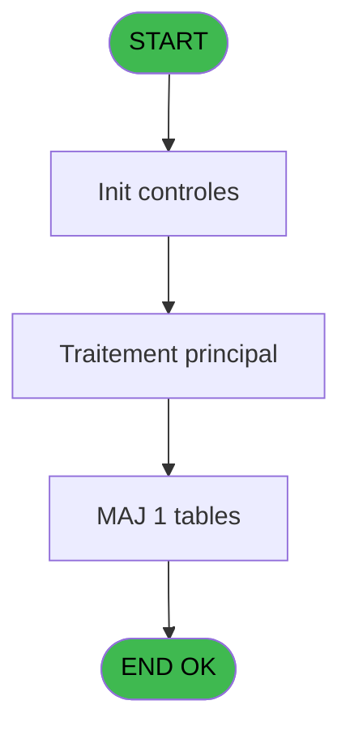
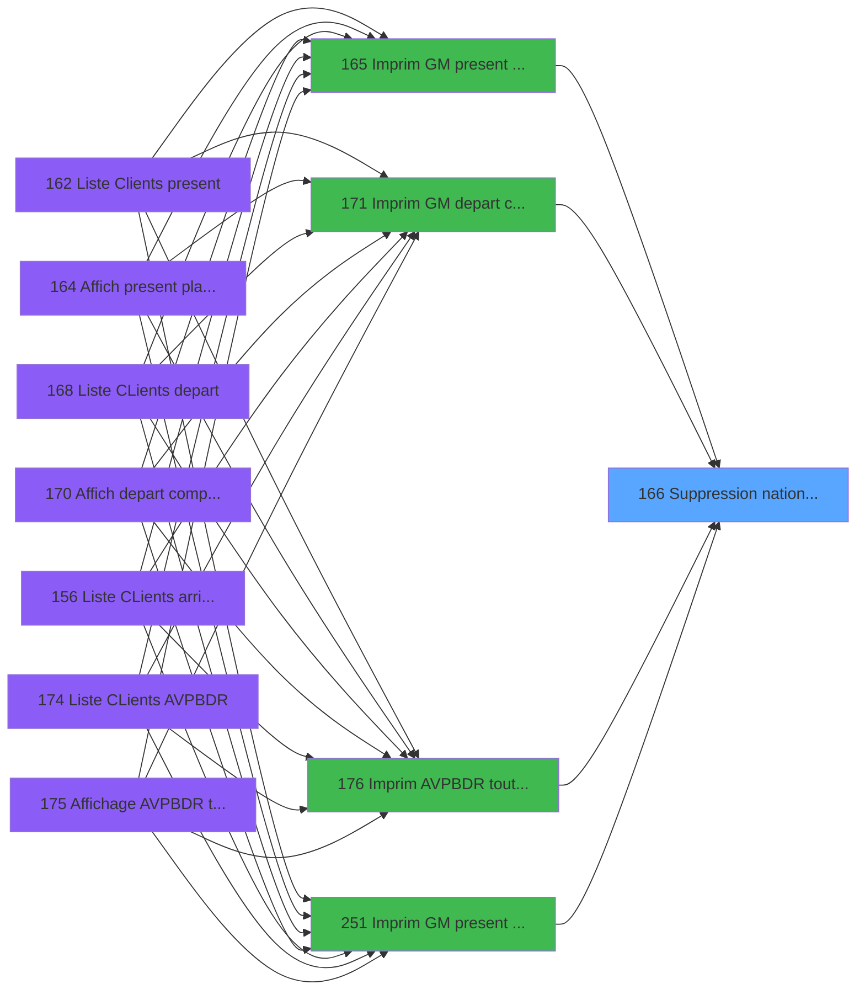

# PBP IDE 166 - Suppression nationalite

> **Analyse**: Phases 1-4 2026-02-03 15:34 -> 15:35 (14s) | Assemblage 15:35
> **Pipeline**: V7.2 Enrichi
> **Structure**: 4 onglets (Resume | Ecrans | Donnees | Connexions)

<!-- TAB:Resume -->

## 1. FICHE D'IDENTITE

| Attribut | Valeur |
|----------|--------|
| Projet | PBP |
| IDE Position | 166 |
| Nom Programme | Suppression nationalite |
| Fichier source | `Prg_166.xml` |
| Dossier IDE | Liste |
| Taches | 1 (0 ecrans visibles) |
| Tables modifiees | 1 |
| Programmes appeles | 0 |

## 2. DESCRIPTION FONCTIONNELLE

**Suppression nationalite** assure la gestion complete de ce processus, accessible depuis [  Imprim GM present planning (IDE 165)](PBP-IDE-165.md), [  Imprim GM depart comptage (IDE 171)](PBP-IDE-171.md), [  Imprim AVPBDR toutes GM (IDE 176)](PBP-IDE-176.md), [Imprim GM present planning CL (IDE 251)](PBP-IDE-251.md).

Le flux de traitement s'organise en **1 blocs fonctionnels** :

- **Traitement** (1 tache) : traitements metier divers

**Donnees modifiees** : 1 tables en ecriture (tempo_heures).

## 3. BLOCS FONCTIONNELS

### 3.1 Traitement (1 tache)

Traitements internes.

---

#### 166 - Suppression nationalite

**Role** : Traitement : Suppression nationalite.

## 5. REGLES METIER

*(Aucune regle metier identifiee)*

## 6. CONTEXTE

- **Appele par**: [  Imprim GM present planning (IDE 165)](PBP-IDE-165.md), [  Imprim GM depart comptage (IDE 171)](PBP-IDE-171.md), [  Imprim AVPBDR toutes GM (IDE 176)](PBP-IDE-176.md), [Imprim GM present planning CL (IDE 251)](PBP-IDE-251.md)
- **Appelle**: 0 programmes | **Tables**: 1 (W:1 R:0 L:0) | **Taches**: 1 | **Expressions**: 2

<!-- TAB:Ecrans -->

## 8. ECRANS

*(Programme sans ecran visible)*

## 9. NAVIGATION

### 9.3 Structure hierarchique (1 tache)

| Position | Tache | Type | Dimensions | Bloc |
|----------|-------|------|------------|------|
| **166.1** | [**Suppression nationalite** (166)](#t1) | MDI | - | Traitement |

### 9.4 Algorigramme

> **Legende**: Vert = START/END OK | Rouge = END KO | Bleu = Decisions
> *Algorigramme auto-genere. Utiliser `/algorigramme` pour une synthese metier detaillee.*

<!-- TAB:Donnees -->

## 10. TABLES

### Tables utilisees (1)

| ID | Nom | Description | Type | R | W | L | Usages |
|----|-----|-------------|------|---|---|---|--------|
| 600 | tempo_heures | Table temporaire ecran | TMP |   | **W** |   | 1 |

### Colonnes par table (0 / 1 tables avec colonnes identifiees)

Table 600 - tempo_heures (**W**) - 1 usages

*Table utilisee uniquement en Link ou aucune colonne Real identifiee dans le DataView.*

## 11. VARIABLES

*(Programme sans variables locales mappees)*

## 12. EXPRESSIONS

**2 / 2 expressions decodees (100%)**

### 12.1 Repartition par type

| Type | Expressions | Regles |
|------|-------------|--------|
| CONSTANTE | 1 | 0 |
| REFERENCE_VG | 1 | 0 |

### 12.2 Expressions cles par type

#### CONSTANTE (1 expressions)

| Type | IDE | Expression | Regle |
|------|-----|------------|-------|
| CONSTANTE | 2 | `'PNT'` | - |

#### REFERENCE_VG (1 expressions)

| Type | IDE | Expression | Regle |
|------|-----|------------|-------|
| REFERENCE_VG | 1 | `VG1` | - |

<!-- TAB:Connexions -->

## 13. GRAPHE D'APPELS

### 13.1 Chaine depuis Main (Callers)

Main -> ... -> [  Imprim GM present planning (IDE 165)](PBP-IDE-165.md) -> **Suppression nationalite (IDE 166)**

Main -> ... -> [  Imprim GM depart comptage (IDE 171)](PBP-IDE-171.md) -> **Suppression nationalite (IDE 166)**

Main -> ... -> [  Imprim AVPBDR toutes GM (IDE 176)](PBP-IDE-176.md) -> **Suppression nationalite (IDE 166)**

Main -> ... -> [Imprim GM present planning CL (IDE 251)](PBP-IDE-251.md) -> **Suppression nationalite (IDE 166)**

### 13.2 Callers

| IDE | Nom Programme | Nb Appels |
|-----|---------------|-----------|
| [165](PBP-IDE-165.md) |   Imprim GM present planning | 1 |
| [171](PBP-IDE-171.md) |   Imprim GM depart comptage | 1 |
| [176](PBP-IDE-176.md) |   Imprim AVPBDR toutes GM | 1 |
| [251](PBP-IDE-251.md) | Imprim GM present planning CL | 1 |

### 13.3 Callees (programmes appeles)

### 13.4 Detail Callees avec contexte

| IDE | Nom Programme | Appels | Contexte |
|-----|---------------|--------|----------|
| - | (aucun) | - | - |

## 14. RECOMMANDATIONS MIGRATION

### 14.1 Profil du programme

| Metrique | Valeur | Impact migration |
|----------|--------|-----------------|
| Lignes de logique | 3 | Programme compact |
| Expressions | 2 | Peu de logique |
| Tables WRITE | 1 | Impact faible |
| Sous-programmes | 0 | Peu de dependances |
| Ecrans visibles | 0 | Ecran unique ou traitement batch |
| Code desactive | 0% (0 / 3) | Code sain |
| Regles metier | 0 | Pas de regle identifiee |

### 14.2 Plan de migration par bloc

#### Traitement (1 tache: 0 ecran, 1 traitement)

- **Strategie** : 1 service(s) backend injectable(s) (Domain Services).
- Decomposer les taches en services unitaires testables.

### 14.3 Dependances critiques

| Dependance | Type | Appels | Impact |
|------------|------|--------|--------|
| tempo_heures | Table WRITE (Temp) | 1x | Schema + repository |

---
*Spec DETAILED generee par Pipeline V7.2 - 2026-02-03 15:35*
