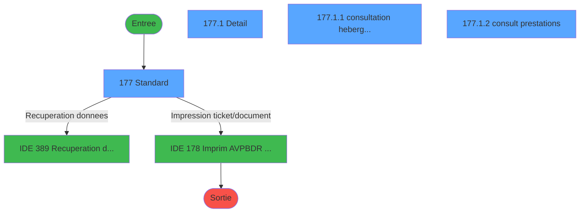
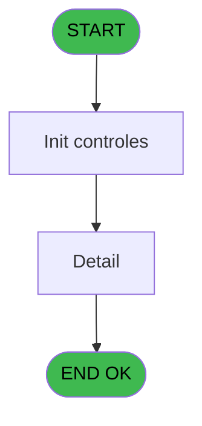
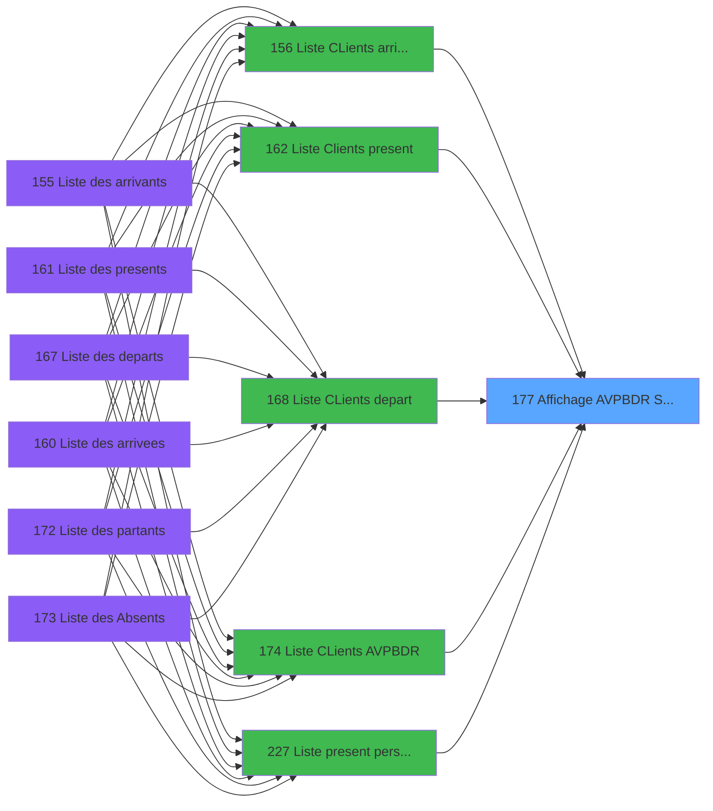
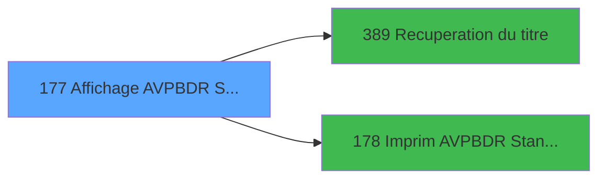

# PBP IDE 177 - Affichage AVPBDR Standard

> **Analyse**: Phases 1-4 2026-02-03 15:39 -> 15:39 (11s) | Assemblage 15:39
> **Pipeline**: V7.2 Enrichi
> **Structure**: 4 onglets (Resume | Ecrans | Donnees | Connexions)

<!-- TAB:Resume -->

## 1. FICHE D'IDENTITE

| Attribut | Valeur |
|----------|--------|
| Projet | PBP |
| IDE Position | 177 |
| Nom Programme | Affichage AVPBDR Standard |
| Fichier source | `Prg_177.xml` |
| Dossier IDE | Liste |
| Taches | 4 (4 ecrans visibles) |
| Tables modifiees | 0 |
| Programmes appeles | 2 |

## 2. DESCRIPTION FONCTIONNELLE

**Affichage AVPBDR Standard** assure la gestion complete de ce processus, accessible depuis [  Liste CLients arrivant (IDE 156)](PBP-IDE-156.md), [  Liste Clients present (IDE 162)](PBP-IDE-162.md), [  Liste CLients depart (IDE 168)](PBP-IDE-168.md), [Liste CLients AVPBDR (IDE 174)](PBP-IDE-174.md), [  Liste present personnel plan (IDE 227)](PBP-IDE-227.md), [  Liste personnels AVPBDR (IDE 234)](PBP-IDE-234.md).

Le flux de traitement s'organise en **1 blocs fonctionnels** :

- **Traitement** (4 taches) : traitements metier divers

**Logique metier** : 3 regles identifiees couvrant conditions metier.

Detail : phases du traitement

#### Phase 1 : Traitement (4 taches)

- **177** - Standard **[[ECRAN]](#ecran-t1)**
- **177.1** - Detail **[[ECRAN]](#ecran-t2)**
- **177.1.1** - consultation hebergement **[[ECRAN]](#ecran-t3)**
- **177.1.2** - consult prestations **[[ECRAN]](#ecran-t4)**

Delegue a : [Recuperation du titre (IDE 389)](PBP-IDE-389.md)

## 3. BLOCS FONCTIONNELS

### 3.1 Traitement (4 taches)

Traitements internes.

---

#### 177 - Standard [[ECRAN]](#ecran-t1)

**Role** : Traitement : Standard.
**Ecran** : 1250 x 241 DLU (MDI) | [Voir mockup](#ecran-t1)

3 sous-taches directes

| Tache | Nom | Bloc |
|-------|-----|------|
| [177.1](#t2) | Detail **[[ECRAN]](#ecran-t2)** | Traitement |
| [177.1.1](#t3) | consultation hebergement **[[ECRAN]](#ecran-t3)** | Traitement |
| [177.1.2](#t4) | consult prestations **[[ECRAN]](#ecran-t4)** | Traitement |

**Delegue a** : [Recuperation du titre (IDE 389)](PBP-IDE-389.md), [  Imprim AVPBDR Standard (IDE 178)](PBP-IDE-178.md)

---

#### 177.1 - Detail [[ECRAN]](#ecran-t2)

**Role** : Traitement : Detail.
**Ecran** : 779 x 256 DLU (MDI) | [Voir mockup](#ecran-t2)
**Delegue a** : [Recuperation du titre (IDE 389)](PBP-IDE-389.md)

---

#### 177.1.1 - consultation hebergement [[ECRAN]](#ecran-t3)

**Role** : Consultation/chargement : consultation hebergement.
**Ecran** : 775 x 78 DLU (Modal) | [Voir mockup](#ecran-t3)
**Delegue a** : [Recuperation du titre (IDE 389)](PBP-IDE-389.md)

---

#### 177.1.2 - consult prestations [[ECRAN]](#ecran-t4)

**Role** : Traitement : consult prestations.
**Ecran** : 759 x 37 DLU (Modal) | [Voir mockup](#ecran-t4)
**Delegue a** : [Recuperation du titre (IDE 389)](PBP-IDE-389.md)

## 5. REGLES METIER

3 regles identifiees:

### Autres (3 regles)

#### [RM-001] Si [CZ] alors [DA]&[DB]&Str([AE] sinon '3P0'),w0_TitreEcran [N]&Str([AE],'3P0'))

| Element | Detail |
|---------|--------|
| **Condition** | `[CZ]` |
| **Si vrai** | [DA]&[DB]&Str([AE] |
| **Si faux** | '3P0'),w0_TitreEcran [N]&Str([AE],'3P0')) |
| **Variables** | N (w0_TitreEcran) |
| **Expression source** | Expression 24 : `IF([CZ],[DA]&[DB]&Str([AE],'3P0'),w0_TitreEcran [N]&Str([AE]` |
| **Exemple** | Si [CZ] → [DA]&[DB]&Str([AE]. Sinon → '3P0'),w0_TitreEcran [N]&Str([AE],'3P0')) |

#### [RM-002] Si VG88 AND [DE] alors TStr([DD] sinon 'HHhMMZ'),[Y])

| Element | Detail |
|---------|--------|
| **Condition** | `VG88 AND [DE]` |
| **Si vrai** | TStr([DD] |
| **Si faux** | 'HHhMMZ'),[Y]) |
| **Expression source** | Expression 25 : `IF(VG88 AND [DE],TStr([DD],'HHhMMZ'),[Y])` |
| **Exemple** | Si VG88 AND [DE] → TStr([DD]. Sinon → 'HHhMMZ'),[Y]) |

#### [RM-003] Si [DG]<>'T' alors 29.75 sinon 25.75)

| Element | Detail |
|---------|--------|
| **Condition** | `[DG]<>'T'` |
| **Si vrai** | 29.75 |
| **Si faux** | 25.75) |
| **Expression source** | Expression 28 : `IF([DG]<>'T',29.75,25.75)` |
| **Exemple** | Si [DG]<>'T' → 29.75. Sinon → 25.75) |

## 6. CONTEXTE

- **Appele par**: [  Liste CLients arrivant (IDE 156)](PBP-IDE-156.md), [  Liste Clients present (IDE 162)](PBP-IDE-162.md), [  Liste CLients depart (IDE 168)](PBP-IDE-168.md), [Liste CLients AVPBDR (IDE 174)](PBP-IDE-174.md), [  Liste present personnel plan (IDE 227)](PBP-IDE-227.md), [  Liste personnels AVPBDR (IDE 234)](PBP-IDE-234.md)
- **Appelle**: 2 programmes | **Tables**: 8 (W:0 R:4 L:4) | **Taches**: 4 | **Expressions**: 29

<!-- TAB:Ecrans -->

## 8. ECRANS

### 8.1 Forms visibles (4 / 4)

| # | Position | Tache | Nom | Type | Largeur | Hauteur | Bloc |
|---|----------|-------|-----|------|---------|---------|------|
| 1 | 177 | 177 | Standard | MDI | 1250 | 241 | Traitement |
| 2 | 177.1 | 177.1 | Detail | MDI | 779 | 256 | Traitement |
| 3 | 177.1.1 | 177.1.1 | consultation hebergement | Modal | 775 | 78 | Traitement |
| 4 | 177.1.2 | 177.1.2 | consult prestations | Modal | 759 | 37 | Traitement |

### 8.2 Mockups Ecrans

---

#### 177 - Standard
**Tache** : [177](#t1) | **Type** : MDI | **Dimensions** : 1250 x 241 DLU
**Bloc** : Traitement | **Titre IDE** : Standard

<!-- FORM-DATA:
{
    "width":  1250,
    "vFactor":  8,
    "type":  "MDI",
    "hFactor":  8,
    "controls":  [
                     {
                         "x":  0,
                         "type":  "label",
                         "var":  "",
                         "y":  0,
                         "w":  1244,
                         "fmt":  "",
                         "name":  "",
                         "h":  19,
                         "color":  "",
                         "text":  "",
                         "parent":  null
                     },
                     {
                         "x":  1062,
                         "type":  "label",
                         "var":  "",
                         "y":  40,
                         "w":  176,
                         "fmt":  "",
                         "name":  "",
                         "h":  169,
                         "color":  "",
                         "text":  "",
                         "parent":  null
                     },
                     {
                         "x":  0,
                         "type":  "table",
                         "var":  "",
                         "name":  "",
                         "titleH":  12,
                         "color":  "110",
                         "w":  1093,
                         "y":  43,
                         "fmt":  "",
                         "parent":  null,
                         "text":  "",
                         "rowH":  15,
                         "h":  116,
                         "cols":  [
                                      {
                                          "title":  "Nom",
                                          "layer":  1,
                                          "w":  204
                                      },
                                      {
                                          "title":  "Prénom",
                                          "layer":  2,
                                          "w":  175
                                      },
                                      {
                                          "title":  "Sexe",
                                          "layer":  3,
                                          "w":  55
                                      },
                                      {
                                          "title":  "Age",
                                          "layer":  4,
                                          "w":  52
                                      },
                                      {
                                          "title":  "Pays",
                                          "layer":  5,
                                          "w":  68
                                      },
                                      {
                                          "title":  "Logement",
                                          "layer":  6,
                                          "w":  120
                                      },
                                      {
                                          "title":  "Tel Int",
                                          "layer":  7,
                                          "w":  104
                                      },
                                      {
                                          "title":  "Tel Extérieur",
                                          "layer":  8,
                                          "w":  249
                                      },
                                      {
                                          "title":  "S",
                                          "layer":  9,
                                          "w":  32
                                      }
                                  ],
                         "rows":  9
                     },
                     {
                         "x":  14,
                         "type":  "label",
                         "var":  "",
                         "y":  156,
                         "w":  1043,
                         "fmt":  "",
                         "name":  "",
                         "h":  53,
                         "color":  "",
                         "text":  "",
                         "parent":  null
                     },
                     {
                         "x":  24,
                         "type":  "label",
                         "var":  "",
                         "y":  162,
                         "w":  206,
                         "fmt":  "",
                         "name":  "",
                         "h":  42,
                         "color":  "195",
                         "text":  "Arrivée",
                         "parent":  25
                     },
                     {
                         "x":  237,
                         "type":  "label",
                         "var":  "",
                         "y":  162,
                         "w":  208,
                         "fmt":  "",
                         "name":  "",
                         "h":  42,
                         "color":  "195",
                         "text":  "Départ",
                         "parent":  25
                     },
                     {
                         "x":  454,
                         "type":  "label",
                         "var":  "",
                         "y":  162,
                         "w":  592,
                         "fmt":  "",
                         "name":  "",
                         "h":  42,
                         "color":  "195",
                         "text":  "",
                         "parent":  null
                     },
                     {
                         "x":  29,
                         "type":  "label",
                         "var":  "",
                         "y":  174,
                         "w":  45,
                         "fmt":  "",
                         "name":  "",
                         "h":  8,
                         "color":  "",
                         "text":  "Date",
                         "parent":  26
                     },
                     {
                         "x":  138,
                         "type":  "label",
                         "var":  "",
                         "y":  174,
                         "w":  82,
                         "fmt":  "",
                         "name":  "",
                         "h":  8,
                         "color":  "",
                         "text":  "Heure",
                         "parent":  26
                     },
                     {
                         "x":  242,
                         "type":  "label",
                         "var":  "",
                         "y":  174,
                         "w":  120,
                         "fmt":  "",
                         "name":  "",
                         "h":  8,
                         "color":  "",
                         "text":  "Date",
                         "parent":  27
                     },
                     {
                         "x":  362,
                         "type":  "label",
                         "var":  "",
                         "y":  174,
                         "w":  75,
                         "fmt":  "",
                         "name":  "",
                         "h":  8,
                         "color":  "",
                         "text":  "Heure",
                         "parent":  27
                     },
                     {
                         "x":  798,
                         "type":  "label",
                         "var":  "",
                         "y":  174,
                         "w":  35,
                         "fmt":  "",
                         "name":  "",
                         "h":  8,
                         "color":  "",
                         "text":  "Fax",
                         "parent":  28
                     },
                     {
                         "x":  0,
                         "type":  "label",
                         "var":  "",
                         "y":  214,
                         "w":  1244,
                         "fmt":  "",
                         "name":  "",
                         "h":  23,
                         "color":  "",
                         "text":  "",
                         "parent":  null
                     },
                     {
                         "x":  0,
                         "type":  "label",
                         "var":  "",
                         "y":  21,
                         "w":  1244,
                         "fmt":  "",
                         "name":  "",
                         "h":  19,
                         "color":  "",
                         "text":  "",
                         "parent":  null
                     },
                     {
                         "x":  8,
                         "type":  "label",
                         "var":  "",
                         "y":  25,
                         "w":  131,
                         "fmt":  "",
                         "name":  "",
                         "h":  10,
                         "color":  "",
                         "text":  "Lieu de séjour",
                         "parent":  null
                     },
                     {
                         "x":  8,
                         "type":  "edit",
                         "var":  "",
                         "y":  59,
                         "w":  176,
                         "fmt":  "",
                         "name":  "TLE Nom",
                         "h":  10,
                         "color":  "110",
                         "text":  "",
                         "parent":  7
                     },
                     {
                         "x":  210,
                         "type":  "edit",
                         "var":  "",
                         "y":  59,
                         "w":  120,
                         "fmt":  "",
                         "name":  "TLE Prenom",
                         "h":  10,
                         "color":  "110",
                         "text":  "",
                         "parent":  7
                     },
                     {
                         "x":  384,
                         "type":  "edit",
                         "var":  "",
                         "y":  59,
                         "w":  37,
                         "fmt":  "",
                         "name":  "TLE Sexe",
                         "h":  10,
                         "color":  "110",
                         "text":  "",
                         "parent":  7
                     },
                     {
                         "x":  440,
                         "type":  "edit",
                         "var":  "",
                         "y":  59,
                         "w":  37,
                         "fmt":  "",
                         "name":  "TLE Age",
                         "h":  10,
                         "color":  "110",
                         "text":  "",
                         "parent":  7
                     },
                     {
                         "x":  563,
                         "type":  "edit",
                         "var":  "",
                         "y":  59,
                         "w":  75,
                         "fmt":  "U6",
                         "name":  "TLE Logement",
                         "h":  10,
                         "color":  "110",
                         "text":  "",
                         "parent":  7
                     },
                     {
                         "x":  491,
                         "type":  "edit",
                         "var":  "",
                         "y":  59,
                         "w":  37,
                         "fmt":  "",
                         "name":  "TLE Pays",
                         "h":  10,
                         "color":  "110",
                         "text":  "",
                         "parent":  7
                     },
                     {
                         "x":  29,
                         "type":  "edit",
                         "var":  "",
                         "y":  188,
                         "w":  120,
                         "fmt":  "",
                         "name":  "TLE Date Arrivee",
                         "h":  10,
                         "color":  "",
                         "text":  "",
                         "parent":  26
                     },
                     {
                         "x":  138,
                         "type":  "edit",
                         "var":  "",
                         "y":  188,
                         "w":  82,
                         "fmt":  "",
                         "name":  "TLE Time Arrivee",
                         "h":  10,
                         "color":  "",
                         "text":  "",
                         "parent":  26
                     },
                     {
                         "x":  242,
                         "type":  "edit",
                         "var":  "",
                         "y":  188,
                         "w":  120,
                         "fmt":  "",
                         "name":  "TLE Date Depart",
                         "h":  10,
                         "color":  "",
                         "text":  "",
                         "parent":  27
                     },
                     {
                         "x":  362,
                         "type":  "edit",
                         "var":  "",
                         "y":  188,
                         "w":  75,
                         "fmt":  "6",
                         "name":  "TLE Time Depart",
                         "h":  10,
                         "color":  "",
                         "text":  "",
                         "parent":  27
                     },
                     {
                         "x":  562,
                         "type":  "edit",
                         "var":  "",
                         "y":  174,
                         "w":  56,
                         "fmt":  "",
                         "name":  "TLE Liste Blanche",
                         "h":  9,
                         "color":  "",
                         "text":  "",
                         "parent":  28
                     },
                     {
                         "x":  680,
                         "type":  "edit",
                         "var":  "",
                         "y":  59,
                         "w":  82,
                         "fmt":  "",
                         "name":  "TLE Telephone Int",
                         "h":  10,
                         "color":  "110",
                         "text":  "",
                         "parent":  7
                     },
                     {
                         "x":  784,
                         "type":  "edit",
                         "var":  "",
                         "y":  59,
                         "w":  238,
                         "fmt":  "",
                         "name":  "TLE TelExt / Commune",
                         "h":  10,
                         "color":  "110",
                         "text":  "",
                         "parent":  7
                     },
                     {
                         "x":  798,
                         "type":  "edit",
                         "var":  "",
                         "y":  188,
                         "w":  238,
                         "fmt":  "",
                         "name":  "TLE Fax    / BurPost",
                         "h":  10,
                         "color":  "",
                         "text":  "",
                         "parent":  28
                     },
                     {
                         "x":  1074,
                         "type":  "button",
                         "var":  "",
                         "y":  155,
                         "w":  154,
                         "fmt":  "\u0026Voir",
                         "name":  "b_Ecran",
                         "h":  18,
                         "color":  "",
                         "text":  "",
                         "parent":  null
                     },
                     {
                         "x":  1074,
                         "type":  "button",
                         "var":  "",
                         "y":  182,
                         "w":  154,
                         "fmt":  "\u0026Impression",
                         "name":  "b_Imprim",
                         "h":  18,
                         "color":  "",
                         "text":  "",
                         "parent":  null
                     },
                     {
                         "x":  8,
                         "type":  "edit",
                         "var":  "",
                         "y":  2,
                         "w":  395,
                         "fmt":  "30",
                         "name":  "",
                         "h":  8,
                         "color":  "",
                         "text":  "",
                         "parent":  1
                     },
                     {
                         "x":  267,
                         "type":  "edit",
                         "var":  "",
                         "y":  6,
                         "w":  614,
                         "fmt":  "100",
                         "name":  "",
                         "h":  8,
                         "color":  "",
                         "text":  "",
                         "parent":  1
                     },
                     {
                         "x":  937,
                         "type":  "edit",
                         "var":  "",
                         "y":  6,
                         "w":  299,
                         "fmt":  "WWW DD MMM YYYYT",
                         "name":  "",
                         "h":  8,
                         "color":  "",
                         "text":  "",
                         "parent":  1
                     },
                     {
                         "x":  8,
                         "type":  "edit",
                         "var":  "",
                         "y":  10,
                         "w":  395,
                         "fmt":  "30",
                         "name":  "",
                         "h":  8,
                         "color":  "",
                         "text":  "",
                         "parent":  null
                     },
                     {
                         "x":  1069,
                         "type":  "image",
                         "var":  "",
                         "y":  67,
                         "w":  165,
                         "fmt":  "",
                         "name":  "",
                         "h":  50,
                         "color":  "",
                         "text":  "",
                         "parent":  6
                     },
                     {
                         "x":  462,
                         "type":  "edit",
                         "var":  "",
                         "y":  174,
                         "w":  56,
                         "fmt":  "4",
                         "name":  "",
                         "h":  9,
                         "color":  "",
                         "text":  "",
                         "parent":  28
                     },
                     {
                         "x":  621,
                         "type":  "edit",
                         "var":  "",
                         "y":  174,
                         "w":  168,
                         "fmt":  "14",
                         "name":  "",
                         "h":  9,
                         "color":  "",
                         "text":  "",
                         "parent":  28
                     },
                     {
                         "x":  462,
                         "type":  "edit",
                         "var":  "",
                         "y":  188,
                         "w":  154,
                         "fmt":  "20",
                         "name":  "",
                         "h":  10,
                         "color":  "",
                         "text":  "",
                         "parent":  28
                     },
                     {
                         "x":  621,
                         "type":  "edit",
                         "var":  "",
                         "y":  188,
                         "w":  157,
                         "fmt":  "13",
                         "name":  "",
                         "h":  9,
                         "color":  "",
                         "text":  "",
                         "parent":  28
                     },
                     {
                         "x":  7,
                         "type":  "button",
                         "var":  "",
                         "y":  216,
                         "w":  154,
                         "fmt":  "\u0026Quitter",
                         "name":  "",
                         "h":  18,
                         "color":  "",
                         "text":  "",
                         "parent":  44
                     },
                     {
                         "x":  477,
                         "type":  "edit",
                         "var":  "",
                         "y":  25,
                         "w":  230,
                         "fmt":  "",
                         "name":  "code_lieu_de_sejour",
                         "h":  10,
                         "color":  "",
                         "text":  "",
                         "parent":  null
                     },
                     {
                         "x":  1033,
                         "type":  "edit",
                         "var":  "",
                         "y":  59,
                         "w":  18,
                         "fmt":  "",
                         "name":  "tle_compte_solde",
                         "h":  10,
                         "color":  "110",
                         "text":  "",
                         "parent":  7
                     }
                 ],
    "taskId":  "177",
    "height":  241
}
-->

<strong>Champs : 24 champs</strong>

| Pos (x,y) | Nom | Variable | Type |
|-----------|-----|----------|------|
| 8,59 | TLE Nom | - | edit |
| 210,59 | TLE Prenom | - | edit |
| 384,59 | TLE Sexe | - | edit |
| 440,59 | TLE Age | - | edit |
| 563,59 | TLE Logement | - | edit |
| 491,59 | TLE Pays | - | edit |
| 29,188 | TLE Date Arrivee | - | edit |
| 138,188 | TLE Time Arrivee | - | edit |
| 242,188 | TLE Date Depart | - | edit |
| 362,188 | TLE Time Depart | - | edit |
| 562,174 | TLE Liste Blanche | - | edit |
| 680,59 | TLE Telephone Int | - | edit |
| 784,59 | TLE TelExt / Commune | - | edit |
| 798,188 | TLE Fax    / BurPost | - | edit |
| 8,2 | 30 | - | edit |
| 267,6 | 100 | - | edit |
| 937,6 | WWW DD MMM YYYYT | - | edit |
| 8,10 | 30 | - | edit |
| 462,174 | 4 | - | edit |
| 621,174 | 14 | - | edit |
| 462,188 | 20 | - | edit |
| 621,188 | 13 | - | edit |
| 477,25 | code_lieu_de_sejour | - | edit |
| 1033,59 | tle_compte_solde | - | edit |

<strong>Boutons : 3 boutons</strong>

| Bouton | Pos (x,y) | Action |
|--------|-----------|--------|
| Voir | 1074,155 | Bouton fonctionnel |
| Impression | 1074,182 | Bouton fonctionnel |
| Quitter | 7,216 | Quitte le programme |

---

#### 177.1 - Detail
**Tache** : [177.1](#t2) | **Type** : MDI | **Dimensions** : 779 x 256 DLU
**Bloc** : Traitement | **Titre IDE** : Detail

<!-- FORM-DATA:
{
    "width":  779,
    "vFactor":  8,
    "type":  "MDI",
    "hFactor":  8,
    "controls":  [
                     {
                         "x":  10,
                         "type":  "label",
                         "var":  "",
                         "y":  16,
                         "w":  757,
                         "fmt":  "",
                         "name":  "",
                         "h":  95,
                         "color":  "",
                         "text":  "",
                         "parent":  null
                     },
                     {
                         "x":  18,
                         "type":  "label",
                         "var":  "",
                         "y":  22,
                         "w":  94,
                         "fmt":  "",
                         "name":  "",
                         "h":  8,
                         "color":  "",
                         "text":  "N° adhérent",
                         "parent":  3
                     },
                     {
                         "x":  11,
                         "type":  "line",
                         "var":  "",
                         "y":  33,
                         "w":  752,
                         "fmt":  "",
                         "name":  "",
                         "h":  0,
                         "color":  "",
                         "text":  "",
                         "parent":  3
                     },
                     {
                         "x":  18,
                         "type":  "label",
                         "var":  "",
                         "y":  38,
                         "w":  88,
                         "fmt":  "",
                         "name":  "",
                         "h":  8,
                         "color":  "",
                         "text":  "Naissance",
                         "parent":  3
                     },
                     {
                         "x":  18,
                         "type":  "label",
                         "var":  "",
                         "y":  56,
                         "w":  64,
                         "fmt":  "",
                         "name":  "",
                         "h":  8,
                         "color":  "",
                         "text":  "Identité",
                         "parent":  3
                     },
                     {
                         "x":  11,
                         "type":  "line",
                         "var":  "",
                         "y":  68,
                         "w":  752,
                         "fmt":  "",
                         "name":  "",
                         "h":  0,
                         "color":  "",
                         "text":  "",
                         "parent":  3
                     },
                     {
                         "x":  18,
                         "type":  "label",
                         "var":  "",
                         "y":  74,
                         "w":  69,
                         "fmt":  "",
                         "name":  "",
                         "h":  9,
                         "color":  "",
                         "text":  "Adresse",
                         "parent":  3
                     },
                     {
                         "x":  0,
                         "type":  "label",
                         "var":  "",
                         "y":  230,
                         "w":  774,
                         "fmt":  "",
                         "name":  "",
                         "h":  24,
                         "color":  "",
                         "text":  "",
                         "parent":  null
                     },
                     {
                         "x":  67,
                         "type":  "edit",
                         "var":  "",
                         "y":  3,
                         "w":  37,
                         "fmt":  "",
                         "name":  "GMC Titre",
                         "h":  10,
                         "color":  "",
                         "text":  "",
                         "parent":  null
                     },
                     {
                         "x":  130,
                         "type":  "edit",
                         "var":  "",
                         "y":  21,
                         "w":  26,
                         "fmt":  "",
                         "name":  "",
                         "h":  10,
                         "color":  "",
                         "text":  "",
                         "parent":  3
                     },
                     {
                         "x":  165,
                         "type":  "edit",
                         "var":  "",
                         "y":  22,
                         "w":  123,
                         "fmt":  "",
                         "name":  "",
                         "h":  9,
                         "color":  "",
                         "text":  "",
                         "parent":  3
                     },
                     {
                         "x":  296,
                         "type":  "edit",
                         "var":  "",
                         "y":  21,
                         "w":  26,
                         "fmt":  "",
                         "name":  "",
                         "h":  10,
                         "color":  "",
                         "text":  "",
                         "parent":  3
                     },
                     {
                         "x":  331,
                         "type":  "edit",
                         "var":  "",
                         "y":  21,
                         "w":  48,
                         "fmt":  "",
                         "name":  "",
                         "h":  10,
                         "color":  "",
                         "text":  "",
                         "parent":  3
                     },
                     {
                         "x":  115,
                         "type":  "edit",
                         "var":  "",
                         "y":  38,
                         "w":  132,
                         "fmt":  "DD/MM/YYYYZ",
                         "name":  "",
                         "h":  9,
                         "color":  "",
                         "text":  "",
                         "parent":  3
                     },
                     {
                         "x":  254,
                         "type":  "edit",
                         "var":  "",
                         "y":  38,
                         "w":  440,
                         "fmt":  "",
                         "name":  "",
                         "h":  9,
                         "color":  "",
                         "text":  "",
                         "parent":  3
                     },
                     {
                         "x":  701,
                         "type":  "edit",
                         "var":  "",
                         "y":  38,
                         "w":  45,
                         "fmt":  "",
                         "name":  "",
                         "h":  9,
                         "color":  "",
                         "text":  "",
                         "parent":  3
                     },
                     {
                         "x":  115,
                         "type":  "edit",
                         "var":  "",
                         "y":  56,
                         "w":  22,
                         "fmt":  "",
                         "name":  "",
                         "h":  9,
                         "color":  "",
                         "text":  "",
                         "parent":  3
                     },
                     {
                         "x":  142,
                         "type":  "edit",
                         "var":  "",
                         "y":  56,
                         "w":  347,
                         "fmt":  "",
                         "name":  "",
                         "h":  9,
                         "color":  "",
                         "text":  "",
                         "parent":  3
                     },
                     {
                         "x":  494,
                         "type":  "edit",
                         "var":  "",
                         "y":  56,
                         "w":  120,
                         "fmt":  "DD/MM/YYYYZ",
                         "name":  "",
                         "h":  8,
                         "color":  "",
                         "text":  "",
                         "parent":  3
                     },
                     {
                         "x":  622,
                         "type":  "edit",
                         "var":  "",
                         "y":  56,
                         "w":  120,
                         "fmt":  "",
                         "name":  "",
                         "h":  8,
                         "color":  "",
                         "text":  "",
                         "parent":  3
                     },
                     {
                         "x":  115,
                         "type":  "edit",
                         "var":  "",
                         "y":  85,
                         "w":  403,
                         "fmt":  "",
                         "name":  "",
                         "h":  9,
                         "color":  "",
                         "text":  "",
                         "parent":  3
                     },
                     {
                         "x":  115,
                         "type":  "edit",
                         "var":  "",
                         "y":  96,
                         "w":  123,
                         "fmt":  "",
                         "name":  "",
                         "h":  9,
                         "color":  "",
                         "text":  "",
                         "parent":  3
                     },
                     {
                         "x":  246,
                         "type":  "edit",
                         "var":  "",
                         "y":  96,
                         "w":  347,
                         "fmt":  "",
                         "name":  "",
                         "h":  9,
                         "color":  "",
                         "text":  "",
                         "parent":  3
                     },
                     {
                         "x":  115,
                         "type":  "edit",
                         "var":  "",
                         "y":  74,
                         "w":  123,
                         "fmt":  "",
                         "name":  "",
                         "h":  9,
                         "color":  "",
                         "text":  "",
                         "parent":  3
                     },
                     {
                         "x":  246,
                         "type":  "edit",
                         "var":  "",
                         "y":  74,
                         "w":  347,
                         "fmt":  "",
                         "name":  "",
                         "h":  9,
                         "color":  "",
                         "text":  "",
                         "parent":  3
                     },
                     {
                         "x":  104,
                         "type":  "edit",
                         "var":  "",
                         "y":  3,
                         "w":  597,
                         "fmt":  "55",
                         "name":  "",
                         "h":  10,
                         "color":  "7",
                         "text":  "",
                         "parent":  null
                     },
                     {
                         "x":  8,
                         "type":  "button",
                         "var":  "",
                         "y":  233,
                         "w":  154,
                         "fmt":  "\u0026Quitter",
                         "name":  "",
                         "h":  18,
                         "color":  "",
                         "text":  "",
                         "parent":  26
                     },
                     {
                         "x":  0,
                         "type":  "subform",
                         "var":  "",
                         "y":  111,
                         "w":  779,
                         "fmt":  "",
                         "name":  "consultation hebergement",
                         "h":  80,
                         "color":  "",
                         "text":  "",
                         "parent":  null
                     },
                     {
                         "x":  0,
                         "type":  "subform",
                         "var":  "",
                         "y":  191,
                         "w":  779,
                         "fmt":  "",
                         "name":  "consult prestations",
                         "h":  39,
                         "color":  "",
                         "text":  "",
                         "parent":  null
                     }
                 ],
    "taskId":  "177.1",
    "height":  256
}
-->

<strong>Champs : 18 champs</strong>

| Pos (x,y) | Nom | Variable | Type |
|-----------|-----|----------|------|
| 67,3 | GMC Titre | - | edit |
| 130,21 | (sans nom) | - | edit |
| 165,22 | (sans nom) | - | edit |
| 296,21 | (sans nom) | - | edit |
| 331,21 | (sans nom) | - | edit |
| 115,38 | DD/MM/YYYYZ | - | edit |
| 254,38 | (sans nom) | - | edit |
| 701,38 | (sans nom) | - | edit |
| 115,56 | (sans nom) | - | edit |
| 142,56 | (sans nom) | - | edit |
| 494,56 | DD/MM/YYYYZ | - | edit |
| 622,56 | (sans nom) | - | edit |
| 115,85 | (sans nom) | - | edit |
| 115,96 | (sans nom) | - | edit |
| 246,96 | (sans nom) | - | edit |
| 115,74 | (sans nom) | - | edit |
| 246,74 | (sans nom) | - | edit |
| 104,3 | 55 | - | edit |

<strong>Boutons : 1 boutons</strong>

| Bouton | Pos (x,y) | Action |
|--------|-----------|--------|
| Quitter | 8,233 | Quitte le programme |

---

#### 177.1.1 - consultation hebergement
**Tache** : [177.1.1](#t3) | **Type** : Modal | **Dimensions** : 775 x 78 DLU
**Bloc** : Traitement | **Titre IDE** : consultation hebergement

<!-- FORM-DATA:
{
    "width":  775,
    "vFactor":  8,
    "type":  "Modal",
    "hFactor":  8,
    "controls":  [
                     {
                         "x":  6,
                         "type":  "table",
                         "var":  "",
                         "name":  "",
                         "titleH":  12,
                         "color":  "110",
                         "w":  768,
                         "y":  3,
                         "fmt":  "",
                         "parent":  null,
                         "text":  "",
                         "rowH":  11,
                         "h":  67,
                         "cols":  [
                                      {
                                          "title":  "Type",
                                          "layer":  1,
                                          "w":  158
                                      },
                                      {
                                          "title":  "Début",
                                          "layer":  2,
                                          "w":  165
                                      },
                                      {
                                          "title":  "Fin",
                                          "layer":  3,
                                          "w":  163
                                      },
                                      {
                                          "title":  "Détail",
                                          "layer":  4,
                                          "w":  250
                                      }
                                  ],
                         "rows":  4
                     },
                     {
                         "x":  173,
                         "type":  "edit",
                         "var":  "",
                         "y":  19,
                         "w":  120,
                         "fmt":  "DD/MM/YYYYZ",
                         "name":  "",
                         "h":  8,
                         "color":  "110",
                         "text":  "",
                         "parent":  1
                     },
                     {
                         "x":  296,
                         "type":  "edit",
                         "var":  "",
                         "y":  19,
                         "w":  30,
                         "fmt":  "",
                         "name":  "",
                         "h":  8,
                         "color":  "110",
                         "text":  "",
                         "parent":  1
                     },
                     {
                         "x":  338,
                         "type":  "edit",
                         "var":  "",
                         "y":  19,
                         "w":  120,
                         "fmt":  "DD/MM/YYYYZ",
                         "name":  "",
                         "h":  8,
                         "color":  "110",
                         "text":  "",
                         "parent":  1
                     },
                     {
                         "x":  461,
                         "type":  "edit",
                         "var":  "",
                         "y":  19,
                         "w":  30,
                         "fmt":  "",
                         "name":  "",
                         "h":  8,
                         "color":  "110",
                         "text":  "",
                         "parent":  1
                     },
                     {
                         "x":  498,
                         "type":  "edit",
                         "var":  "",
                         "y":  19,
                         "w":  232,
                         "fmt":  "20",
                         "name":  "",
                         "h":  8,
                         "color":  "110",
                         "text":  "",
                         "parent":  1
                     },
                     {
                         "x":  14,
                         "type":  "edit",
                         "var":  "",
                         "y":  19,
                         "w":  142,
                         "fmt":  "12",
                         "name":  "",
                         "h":  8,
                         "color":  "110",
                         "text":  "",
                         "parent":  1
                     }
                 ],
    "taskId":  "177.1.1",
    "height":  78
}
-->

<strong>Champs : 6 champs</strong>

| Pos (x,y) | Nom | Variable | Type |
|-----------|-----|----------|------|
| 173,19 | DD/MM/YYYYZ | - | edit |
| 296,19 | (sans nom) | - | edit |
| 338,19 | DD/MM/YYYYZ | - | edit |
| 461,19 | (sans nom) | - | edit |
| 498,19 | 20 | - | edit |
| 14,19 | 12 | - | edit |

---

#### 177.1.2 - consult prestations
**Tache** : [177.1.2](#t4) | **Type** : Modal | **Dimensions** : 759 x 37 DLU
**Bloc** : Traitement | **Titre IDE** : consult prestations

<!-- FORM-DATA:
{
    "width":  759,
    "vFactor":  8,
    "type":  "Modal",
    "hFactor":  8,
    "controls":  [
                     {
                         "x":  166,
                         "type":  "table",
                         "var":  "",
                         "name":  "",
                         "titleH":  12,
                         "color":  "110",
                         "w":  388,
                         "y":  0,
                         "fmt":  "",
                         "parent":  null,
                         "text":  "",
                         "rowH":  10,
                         "h":  32,
                         "cols":  [
                                      {
                                          "title":  "Code circuit",
                                          "layer":  1,
                                          "w":  113
                                      },
                                      {
                                          "title":  "Libellé",
                                          "layer":  2,
                                          "w":  243
                                      }
                                  ],
                         "rows":  2
                     },
                     {
                         "x":  172,
                         "type":  "edit",
                         "var":  "",
                         "y":  14,
                         "w":  75,
                         "fmt":  "",
                         "name":  "",
                         "h":  8,
                         "color":  "110",
                         "text":  "",
                         "parent":  1
                     },
                     {
                         "x":  285,
                         "type":  "edit",
                         "var":  "",
                         "y":  14,
                         "w":  232,
                         "fmt":  "",
                         "name":  "",
                         "h":  8,
                         "color":  "110",
                         "text":  "",
                         "parent":  1
                     }
                 ],
    "taskId":  "177.1.2",
    "height":  37
}
-->

<strong>Champs : 2 champs</strong>

| Pos (x,y) | Nom | Variable | Type |
|-----------|-----|----------|------|
| 172,14 | (sans nom) | - | edit |
| 285,14 | (sans nom) | - | edit |

## 9. NAVIGATION

### 9.1 Enchainement des ecrans

**Detail par enchainement :**

| Depuis | Action | Vers | Retour |
|--------|--------|------|--------|
| Standard | Recuperation donnees | [Recuperation du titre (IDE 389)](PBP-IDE-389.md) | Retour ecran |
| Standard | Impression ticket/document | [  Imprim AVPBDR Standard (IDE 178)](PBP-IDE-178.md) | Retour ecran |

### 9.3 Structure hierarchique (4 taches)

| Position | Tache | Type | Dimensions | Bloc |
|----------|-------|------|------------|------|
| **177.1** | [**Standard** (177)](#t1) [mockup](#ecran-t1) | MDI | 1250x241 | Traitement |
| 177.1.1 | [Detail (177.1)](#t2) [mockup](#ecran-t2) | MDI | 779x256 | |
| 177.1.2 | [consultation hebergement (177.1.1)](#t3) [mockup](#ecran-t3) | Modal | 775x78 | |
| 177.1.3 | [consult prestations (177.1.2)](#t4) [mockup](#ecran-t4) | Modal | 759x37 | |

### 9.4 Algorigramme

> **Legende**: Vert = START/END OK | Rouge = END KO | Bleu = Decisions
> *Algorigramme auto-genere. Utiliser `/algorigramme` pour une synthese metier detaillee.*

<!-- TAB:Donnees -->

## 10. TABLES

### Tables utilisees (8)

| ID | Nom | Description | Type | R | W | L | Usages |
|----|-----|-------------|------|---|---|---|--------|
| 31 | gm-complet_______gmc |  | DB | R |   |   | 1 |
| 33 | prestations______pre | Prestations/services vendus | DB | R |   |   | 1 |
| 34 | hebergement______heb | Hebergement (chambres) | DB | R |   |   | 1 |
| 118 | tables_imports |  | DB | R |   |   | 1 |
| 135 | libelle_prestation | Prestations/services vendus | DB |   |   | L | 1 |
| 358 | import_mod |  | DB |   |   | L | 1 |
| 619 | tempo_userlist | Table temporaire ecran | TMP |   |   | L | 1 |
| 845 | stat_vendeur_date |  | TMP |   |   | L | 1 |

### Colonnes par table (4 / 4 tables avec colonnes identifiees)

Table 31 - gm-complet_______gmc (R) - 1 usages

*Table utilisee uniquement en Link ou aucune colonne Real identifiee dans le DataView.*

Table 33 - prestations______pre (R) - 1 usages

| Lettre | Variable | Acces | Type |
|--------|----------|-------|------|
| A | P.Num compte | R | Numeric |
| B | P.Filiation | R | Numeric |

Table 34 - hebergement______heb (R) - 1 usages

| Lettre | Variable | Acces | Type |
|--------|----------|-------|------|
| A | P.Num compte | R | Numeric |
| B | P.Filiation | R | Numeric |

Table 118 - tables_imports (R) - 1 usages

| Lettre | Variable | Acces | Type |
|--------|----------|-------|------|
| A | >CodeEcran | R | Numeric |
| B | >Date | R | Date |
| C | >Heure | R | Alpha |
| D | >CodeListe | R | Alpha |
| E | >TopListe | R | Alpha |
| F | >Logement | R | Alpha |
| G | >TitreMaman | R | Alpha |
| H | >Total | R | Numeric |
| I | >NbSelect | R | Numeric |
| J | >Libellé Sélection du Solde* | R | Unicode |
| K | >Soldé,Non_soldé,Tous | R | Unicode |
| L | >Tri Nom/Filiation | R | Logical |
| M | P.I Heure depart Village | R | Logical |
| N | w0_TitreEcran | R | Alpha |
| O | v.Ordre Tri | R | Alpha |
| P | b_Ecran | R | Alpha |
| Q | b_Imprim | R | Alpha |

## 11. VARIABLES

### 11.1 Parametres entrants (1)

Variables recues du programme appelant ([  Liste CLients arrivant (IDE 156)](PBP-IDE-156.md)).

| Lettre | Nom | Type | Usage dans |
|--------|-----|------|-----------|
| M | P.I Heure depart Village | Logical | - |

### 11.2 Variables de session (1)

Variables persistantes pendant toute la session.

| Lettre | Nom | Type | Usage dans |
|--------|-----|------|-----------|
| O | v.Ordre Tri | Alpha | - |

### 11.3 Autres (15)

Variables diverses.

| Lettre | Nom | Type | Usage dans |
|--------|-----|------|-----------|
| A | >CodeEcran | Numeric | - |
| B | >Date | Date | - |
| C | >Heure | Alpha | - |
| D | >CodeListe | Alpha | - |
| E | >TopListe | Alpha | - |
| F | >Logement | Alpha | - |
| G | >TitreMaman | Alpha | 1x refs |
| H | >Total | Numeric | 1x refs |
| I | >NbSelect | Numeric | 1x refs |
| J | >Libellé Sélection du Solde* | Unicode | - |
| K | >Soldé,Non_soldé,Tous | Unicode | - |
| L | >Tri Nom/Filiation | Logical | - |
| N | w0_TitreEcran | Alpha | 1x refs |
| P | b_Ecran | Alpha | - |
| Q | b_Imprim | Alpha | - |

Toutes les 17 variables (liste complete)

| Cat | Lettre | Nom Variable | Type |
|-----|--------|--------------|------|
| P0 | **M** | P.I Heure depart Village | Logical |
| V. | **O** | v.Ordre Tri | Alpha |
| Autre | **A** | >CodeEcran | Numeric |
| Autre | **B** | >Date | Date |
| Autre | **C** | >Heure | Alpha |
| Autre | **D** | >CodeListe | Alpha |
| Autre | **E** | >TopListe | Alpha |
| Autre | **F** | >Logement | Alpha |
| Autre | **G** | >TitreMaman | Alpha |
| Autre | **H** | >Total | Numeric |
| Autre | **I** | >NbSelect | Numeric |
| Autre | **J** | >Libellé Sélection du Solde* | Unicode |
| Autre | **K** | >Soldé,Non_soldé,Tous | Unicode |
| Autre | **L** | >Tri Nom/Filiation | Logical |
| Autre | **N** | w0_TitreEcran | Alpha |
| Autre | **P** | b_Ecran | Alpha |
| Autre | **Q** | b_Imprim | Alpha |

## 12. EXPRESSIONS

**29 / 29 expressions decodees (100%)**

### 12.1 Repartition par type

| Type | Expressions | Regles |
|------|-------------|--------|
| CONCATENATION | 3 | 0 |
| CONDITION | 11 | 3 |
| CONSTANTE | 2 | 0 |
| DATE | 1 | 0 |
| OTHER | 10 | 0 |
| REFERENCE_VG | 2 | 0 |

### 12.2 Expressions cles par type

#### CONCATENATION (3 expressions)

| Type | IDE | Expression | Regle |
|------|-----|------------|-------|
| CONCATENATION | 12 | `Trim([CT])&IF(VG125 AND [DF]='O',' NGM','')` | - |
| CONCATENATION | 5 | `Trim (>TitreMaman [G])&' '&Trim (>Libellé Sélection du ... [J])` | - |
| CONCATENATION | 19 | `Str (>NbSelect [I],'4')&' selectionne sur '&Str (>Total [H],'4')&' - '&Trim([DI])` | - |

#### CONDITION (11 expressions)

| Type | IDE | Expression | Regle |
|------|-----|------------|-------|
| CONDITION | 28 | `IF([DG]<>'T',29.75,25.75)` | [RM-003](#rm-RM-003) |
| CONDITION | 25 | `IF(VG88 AND [DE],TStr([DD],'HHhMMZ'),[Y])` | [RM-002](#rm-RM-002) |
| CONDITION | 24 | `IF([CZ],[DA]&[DB]&Str([AE],'3P0'),w0_TitreEcran [N]&Str([AE],'3P0'))` | [RM-001](#rm-RM-001) |
| CONDITION | 15 | `[AB]<>''` | - |
| CONDITION | 13 | `[AA]<>''` | - |
| ... | | *+6 autres* | |

#### CONSTANTE (2 expressions)

| Type | IDE | Expression | Regle |
|------|-----|------------|-------|
| CONSTANTE | 17 | `'&Imprimante'` | - |
| CONSTANTE | 16 | `'&Ecran'` | - |

#### DATE (1 expressions)

| Type | IDE | Expression | Regle |
|------|-----|------------|-------|
| DATE | 7 | `Date ()` | - |

#### OTHER (10 expressions)

| Type | IDE | Expression | Regle |
|------|-----|------------|-------|
| OTHER | 20 | `[AD]` | - |
| OTHER | 18 | `GetParam ('VILLAGE')` | - |
| OTHER | 21 | `[AE]` | - |
| OTHER | 23 | `[CU]` | - |
| OTHER | 22 | `[CQ]` | - |
| ... | | *+5 autres* | |

#### REFERENCE_VG (2 expressions)

| Type | IDE | Expression | Regle |
|------|-----|------------|-------|
| REFERENCE_VG | 6 | `VG2` | - |
| REFERENCE_VG | 4 | `VG1` | - |

### 12.3 Toutes les expressions (29)

Voir les 29 expressions

#### CONCATENATION (3)

| IDE | Expression Decodee |
|-----|-------------------|
| 19 | `Str (>NbSelect [I],'4')&' selectionne sur '&Str (>Total [H],'4')&' - '&Trim([DI])` |
| 5 | `Trim (>TitreMaman [G])&' '&Trim (>Libellé Sélection du ... [J])` |
| 12 | `Trim([CT])&IF(VG125 AND [DF]='O',' NGM','')` |

#### CONDITION (11)

| IDE | Expression Decodee |
|-----|-------------------|
| 24 | `IF([CZ],[DA]&[DB]&Str([AE],'3P0'),w0_TitreEcran [N]&Str([AE],'3P0'))` |
| 25 | `IF(VG88 AND [DE],TStr([DD],'HHhMMZ'),[Y])` |
| 26 | `IF(VG88 AND [DE],'Libération logement','Départ village')` |
| 28 | `IF([DG]<>'T',29.75,25.75)` |
| 1 | `VG44>1` |
| 9 | `[Z]='B'` |
| 11 | `[AC]='R'` |
| 13 | `[AA]<>''` |
| 15 | `[AB]<>''` |
| 29 | `[DG]='T'` |
| 27 | `CndRange(Trim([DI])<>'' AND [DG]<>'T',IF([DG]='N','X',''))` |

#### CONSTANTE (2)

| IDE | Expression Decodee |
|-----|-------------------|
| 16 | `'&Ecran'` |
| 17 | `'&Imprimante'` |

#### DATE (1)

| IDE | Expression Decodee |
|-----|-------------------|
| 7 | `Date ()` |

#### OTHER (10)

| IDE | Expression Decodee |
|-----|-------------------|
| 2 | `GetParam ('SOCIETE')` |
| 3 | `GetParam ('CODELANGUE')` |
| 8 | `MlsTrans ('Bebe')` |
| 10 | `MlsTrans ('Retour Circuit')` |
| 14 | `MlsTrans ('Liste Blanche')` |
| 18 | `GetParam ('VILLAGE')` |
| 20 | `[AD]` |
| 21 | `[AE]` |
| 22 | `[CQ]` |
| 23 | `[CU]` |

#### REFERENCE_VG (2)

| IDE | Expression Decodee |
|-----|-------------------|
| 4 | `VG1` |
| 6 | `VG2` |

<!-- TAB:Connexions -->

## 13. GRAPHE D'APPELS

### 13.1 Chaine depuis Main (Callers)

Main -> ... -> [  Liste CLients arrivant (IDE 156)](PBP-IDE-156.md) -> **Affichage AVPBDR Standard (IDE 177)**

Main -> ... -> [  Liste Clients present (IDE 162)](PBP-IDE-162.md) -> **Affichage AVPBDR Standard (IDE 177)**

Main -> ... -> [  Liste CLients depart (IDE 168)](PBP-IDE-168.md) -> **Affichage AVPBDR Standard (IDE 177)**

Main -> ... -> [Liste CLients AVPBDR (IDE 174)](PBP-IDE-174.md) -> **Affichage AVPBDR Standard (IDE 177)**

Main -> ... -> [  Liste present personnel plan (IDE 227)](PBP-IDE-227.md) -> **Affichage AVPBDR Standard (IDE 177)**

Main -> ... -> [  Liste personnels AVPBDR (IDE 234)](PBP-IDE-234.md) -> **Affichage AVPBDR Standard (IDE 177)**

### 13.2 Callers

| IDE | Nom Programme | Nb Appels |
|-----|---------------|-----------|
| [156](PBP-IDE-156.md) |   Liste CLients arrivant | 1 |
| [162](PBP-IDE-162.md) |   Liste Clients present | 1 |
| [168](PBP-IDE-168.md) |   Liste CLients depart | 1 |
| [174](PBP-IDE-174.md) | Liste CLients AVPBDR | 1 |
| [227](PBP-IDE-227.md) |   Liste present personnel plan | 1 |
| [234](PBP-IDE-234.md) |   Liste personnels AVPBDR | 1 |

### 13.3 Callees (programmes appeles)

### 13.4 Detail Callees avec contexte

| IDE | Nom Programme | Appels | Contexte |
|-----|---------------|--------|----------|
| [389](PBP-IDE-389.md) | Recuperation du titre | 2 | Recuperation donnees |
| [178](PBP-IDE-178.md) |   Imprim AVPBDR Standard | 1 | Impression ticket/document |

## 14. RECOMMANDATIONS MIGRATION

### 14.1 Profil du programme

| Metrique | Valeur | Impact migration |
|----------|--------|-----------------|
| Lignes de logique | 159 | Programme compact |
| Expressions | 29 | Peu de logique |
| Tables WRITE | 0 | Impact faible |
| Sous-programmes | 2 | Peu de dependances |
| Ecrans visibles | 4 | Quelques ecrans |
| Code desactive | 0% (0 / 159) | Code sain |
| Regles metier | 3 | Quelques regles a preserver |

### 14.2 Plan de migration par bloc

#### Traitement (4 taches: 4 ecrans, 0 traitement)

- **Strategie** : 4 composant(s) UI (Razor/React) avec formulaires et validation.
- 2 sous-programme(s) a migrer ou a reutiliser depuis les services existants.
- Decomposer les taches en services unitaires testables.

### 14.3 Dependances critiques

| Dependance | Type | Appels | Impact |
|------------|------|--------|--------|
| [Recuperation du titre (IDE 389)](PBP-IDE-389.md) | Sous-programme | 2x | Haute - Recuperation donnees |
| [  Imprim AVPBDR Standard (IDE 178)](PBP-IDE-178.md) | Sous-programme | 1x | Normale - Impression ticket/document |

---
*Spec DETAILED generee par Pipeline V7.2 - 2026-02-03 15:39*
