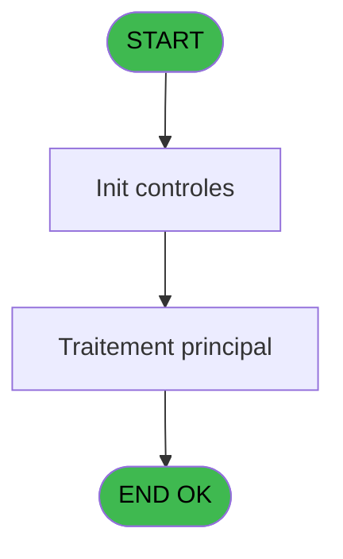
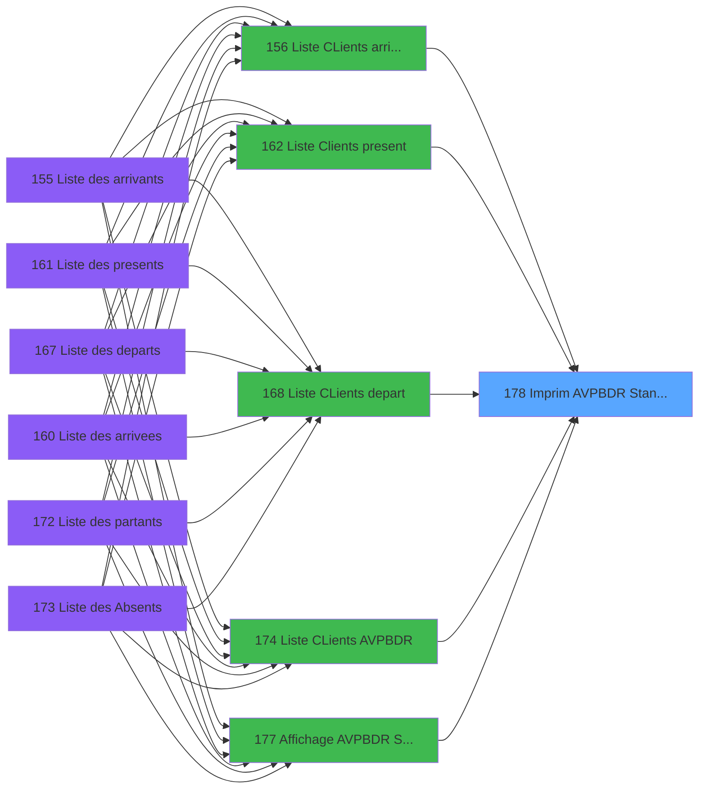

# PBP IDE 178 - Imprim AVPBDR Standard

> **Analyse**: Phases 1-4 2026-02-03 15:39 -> 15:39 (12s) | Assemblage 15:39
> **Pipeline**: V7.2 Enrichi
> **Structure**: 4 onglets (Resume | Ecrans | Donnees | Connexions)

<!-- TAB:Resume -->

## 1. FICHE D'IDENTITE

| Attribut | Valeur |
|----------|--------|
| Projet | PBP |
| IDE Position | 178 |
| Nom Programme | Imprim AVPBDR Standard |
| Fichier source | `Prg_178.xml` |
| Dossier IDE | Liste |
| Taches | 2 (0 ecrans visibles) |
| Tables modifiees | 0 |
| Programmes appeles | 0 |

## 2. DESCRIPTION FONCTIONNELLE

**Imprim AVPBDR Standard** assure la gestion complete de ce processus, accessible depuis [  Liste present personnel plan (IDE 227)](PBP-IDE-227.md), [  Liste personnels AVPBDR (IDE 234)](PBP-IDE-234.md), [  Liste CLients arrivant (IDE 156)](PBP-IDE-156.md), [  Liste Clients present (IDE 162)](PBP-IDE-162.md), [  Liste CLients depart (IDE 168)](PBP-IDE-168.md), [Liste CLients AVPBDR (IDE 174)](PBP-IDE-174.md), [  Affichage AVPBDR Standard (IDE 177)](PBP-IDE-177.md).

Le flux de traitement s'organise en **2 blocs fonctionnels** :

- **Calcul** (1 tache) : calculs de montants, stocks ou compteurs
- **Traitement** (1 tache) : traitements metier divers

**Logique metier** : 5 regles identifiees couvrant conditions metier.

Detail : phases du traitement

#### Phase 1 : Traitement (1 tache)

- **178** - Veuillez patienter... **[[ECRAN]](#ecran-t1)**

#### Phase 2 : Calcul (1 tache)

- **178.1** - Calcul pied

## 3. BLOCS FONCTIONNELS

### 3.1 Traitement (1 tache)

Traitements internes.

---

#### 178 - Veuillez patienter... [[ECRAN]](#ecran-t1)

**Role** : Traitement : Veuillez patienter....
**Ecran** : 424 x 57 DLU (MDI) | [Voir mockup](#ecran-t1)

### 3.2 Calcul (1 tache)

Calculs metier : montants, stocks, compteurs.

---

#### 178.1 - Calcul pied

**Role** : Calcul : Calcul pied.
**Variables liees** : A (>DateCalcul), W (w0_NomPied01), X (w0_NbPied01), Y (w0_NomPied02), Z (w0_NbPied02)

## 5. REGLES METIER

5 regles identifiees:

### Autres (5 regles)

#### [RM-001] Si >CodeListe [B]='A' alors MlsTrans ('arrivants') sinon IF (>CodeListe [B]='V',MlsTrans ('arrivees'),IF (>CodeListe [B]='P',MlsTrans ('presents'),IF (>CodeListe [B]='D',MlsTrans ('departs'),IF (>CodeListe [B]='R',MlsTrans ('partants'),MlsTrans ('absents'))))))

| Element | Detail |
|---------|--------|
| **Condition** | `>CodeListe [B]='A'` |
| **Si vrai** | MlsTrans ('arrivants') |
| **Si faux** | IF (>CodeListe [B]='V',MlsTrans ('arrivees'),IF (>CodeListe [B]='P',MlsTrans ('presents'),IF (>CodeListe [B]='D',MlsTrans ('departs'),IF (>CodeListe [B]='R',MlsTrans ('partants'),MlsTrans ('absents')))))) |
| **Variables** | B (>CodeListe) |
| **Expression source** | Expression 14 : `IF (>CodeListe [B]='A',MlsTrans ('arrivants'),IF (>CodeListe` |
| **Exemple** | Si >CodeListe [B]='A' → MlsTrans ('arrivants') |

#### [RM-002] Si >TopListe [C]='ST' alors 'standard' sinon '')

| Element | Detail |
|---------|--------|
| **Condition** | `>TopListe [C]='ST'` |
| **Si vrai** | 'standard' |
| **Si faux** | '') |
| **Variables** | C (>TopListe) |
| **Expression source** | Expression 15 : `IF (>TopListe [C]='ST','standard','')` |
| **Exemple** | Si >TopListe [C]='ST' → 'standard'. Sinon → '') |

#### [RM-003] Si [DB] alors Trim(VG61) sinon '')&IF([DK],Trim(VG62),'')&IF([DQ],Trim(VG63),'')

| Element | Detail |
|---------|--------|
| **Condition** | `[DB]` |
| **Si vrai** | Trim(VG61) |
| **Si faux** | '')&IF([DK],Trim(VG62),'')&IF([DQ],Trim(VG63),'') |
| **Expression source** | Expression 31 : `IF([DB],Trim(VG61),'')&IF([DK],Trim(VG62),'')&IF([DQ],Trim(V` |
| **Exemple** | Si [DB] → Trim(VG61). Sinon → '')&IF([DK],Trim(VG62),'')&IF([DQ],Trim(VG63),'') |

#### [RM-004] Si [DB] OR [DK] OR [DQ] alors 'EA'&Trim([DW]) sinon '')

| Element | Detail |
|---------|--------|
| **Condition** | `[DB] OR [DK] OR [DQ]` |
| **Si vrai** | 'EA'&Trim([DW]) |
| **Si faux** | '') |
| **Expression source** | Expression 33 : `IF([DB] OR [DK] OR [DQ],'EA'&Trim([DW]),'')` |
| **Exemple** | Si [DB] OR [DK] OR [DQ] → 'EA'&Trim([DW]). Sinon → '') |

#### [RM-005] Si [EB] alors [EC]&[ED]&Str([AF] sinon '3P0'),Str(w0_f(CodeListe) [N],'4P0')&w0_g(TopListe) [O]&w0_LibelleEdition [P]&W0_Libelle Logement [Q])

| Element | Detail |
|---------|--------|
| **Condition** | `[EB]` |
| **Si vrai** | [EC]&[ED]&Str([AF] |
| **Si faux** | '3P0'),Str(w0_f(CodeListe) [N],'4P0')&w0_g(TopListe) [O]&w0_LibelleEdition [P]&W0_Libelle Logement [Q]) |
| **Variables** | N (w0_f(CodeListe)), O (w0_g(TopListe)), P (w0_LibelleEdition), Q (W0_Libelle Logement) |
| **Expression source** | Expression 36 : `IF([EB],[EC]&[ED]&Str([AF],'3P0'),Str(w0_f(CodeListe) [N],'4` |
| **Exemple** | Si [EB] → [EC]&[ED]&Str([AF] |

## 6. CONTEXTE

- **Appele par**: [  Liste present personnel plan (IDE 227)](PBP-IDE-227.md), [  Liste personnels AVPBDR (IDE 234)](PBP-IDE-234.md), [  Liste CLients arrivant (IDE 156)](PBP-IDE-156.md), [  Liste Clients present (IDE 162)](PBP-IDE-162.md), [  Liste CLients depart (IDE 168)](PBP-IDE-168.md), [Liste CLients AVPBDR (IDE 174)](PBP-IDE-174.md), [  Affichage AVPBDR Standard (IDE 177)](PBP-IDE-177.md)
- **Appelle**: 0 programmes | **Tables**: 4 (W:0 R:2 L:2) | **Taches**: 2 | **Expressions**: 43

<!-- TAB:Ecrans -->

## 8. ECRANS

*(Programme sans ecran visible)*

## 9. NAVIGATION

### 9.3 Structure hierarchique (2 taches)

| Position | Tache | Type | Dimensions | Bloc |
|----------|-------|------|------------|------|
| **178.1** | [**Veuillez patienter...** (178)](#t1) [mockup](#ecran-t1) | MDI | 424x57 | Traitement |
| **178.2** | [**Calcul pied** (178.1)](#t2) | MDI | - | Calcul |

### 9.4 Algorigramme

> **Legende**: Vert = START/END OK | Rouge = END KO | Bleu = Decisions
> *Algorigramme auto-genere. Utiliser `/algorigramme` pour une synthese metier detaillee.*

<!-- TAB:Donnees -->

## 10. TABLES

### Tables utilisees (4)

| ID | Nom | Description | Type | R | W | L | Usages |
|----|-----|-------------|------|---|---|---|--------|
| 118 | tables_imports |  | DB | R |   |   | 1 |
| 598 | tempo_ecr_previsions | Table temporaire ecran | TMP | R |   |   | 1 |
| 619 | tempo_userlist | Table temporaire ecran | TMP |   |   | L | 1 |
| 804 | valeur_credit_bar_defaut |  | DB |   |   | L | 1 |

### Colonnes par table (2 / 2 tables avec colonnes identifiees)

Table 118 - tables_imports (R) - 1 usages

| Lettre | Variable | Acces | Type |
|--------|----------|-------|------|
| A | >DateCalcul | R | Date |
| B | >CodeListe | R | Alpha |
| C | >TopListe | R | Alpha |
| D | >HeurePresence | R | Alpha |
| E | >NomLogement | R | Alpha |
| F | >Total | R | Numeric |
| G | >NbSelect | R | Numeric |
| H | >Excel | R | Logical |
| I | >NomFicExcel | R | Alpha |
| J | >Libellé Sélection du Solde* | R | Unicode |
| K | >Soldé,Non_soldé,Tous | R | Unicode |
| L | >Tri Nom/Filiation | R | Logical |
| M | P.I Depart Village | R | Logical |
| N | w0_f(CodeListe) | R | Alpha |
| O | w0_g(TopListe) | R | Alpha |
| P | w0_LibelleEdition | R | Alpha |
| Q | W0_Libelle Logement | R | Alpha |
| R | v.LigneExcel | R | Alpha |
| S | V.Existe ECI (Q60 Location) | R | Logical |
| T | V.Existe ECI (Q61 Cours) | R | Logical |
| U | V.Existe ECI (Q62 Enfant) | R | Logical |
| V | v Libelle affichage ECI | R | Alpha |
| W | w0_NomPied01 | R | Alpha |
| X | w0_NbPied01 | R | Numeric |
| Y | w0_NomPied02 | R | Alpha |
| Z | w0_NbPied02 | R | Numeric |
| BA | w0_NomPied03 | R | Alpha |
| BB | w0_NbPied03 | R | Numeric |
| BC | w0_NomPied04 | R | Alpha |
| BD | w0_NbPied04 | R | Numeric |
| BE | w0_NomPied05 | R | Alpha |
| BF | w0_NbPied05 | R | Numeric |
| BG | w0_TotalSelect | R | Numeric |
| BH | w0.Ordre tri | R | Alpha |
| BI | w0.dernier n° Cpte | R | Numeric |

Table 598 - tempo_ecr_previsions (R) - 1 usages

| Lettre | Variable | Acces | Type |
|--------|----------|-------|------|
| A | w1_Rupture | R | Numeric |
| B | w1_TotalSelect | R | Numeric |

## 11. VARIABLES

### 11.1 Parametres entrants (1)

Variables recues du programme appelant ([  Liste present personnel plan (IDE 227)](PBP-IDE-227.md)).

| Lettre | Nom | Type | Usage dans |
|--------|-----|------|-----------|
| M | P.I Depart Village | Logical | - |

### 11.2 Variables de session (5)

Variables persistantes pendant toute la session.

| Lettre | Nom | Type | Usage dans |
|--------|-----|------|-----------|
| R | v.LigneExcel | Alpha | - |
| S | V.Existe ECI (Q60 Location) | Logical | - |
| T | V.Existe ECI (Q61 Cours) | Logical | 2x session |
| U | V.Existe ECI (Q62 Enfant) | Logical | 2x session |
| V | v Libelle affichage ECI | Alpha | - |

### 11.3 Variables de travail (2)

Variables internes au programme.

| Lettre | Nom | Type | Usage dans |
|--------|-----|------|-----------|
| BH | w0.Ordre tri | Alpha | - |
| BI | w0.dernier n° Cpte | Numeric | - |

### 11.4 Autres (27)

Variables diverses.

| Lettre | Nom | Type | Usage dans |
|--------|-----|------|-----------|
| A | >DateCalcul | Date | 1x refs |
| B | >CodeListe | Alpha | 2x refs |
| C | >TopListe | Alpha | 1x refs |
| D | >HeurePresence | Alpha | 1x refs |
| E | >NomLogement | Alpha | - |
| F | >Total | Numeric | - |
| G | >NbSelect | Numeric | - |
| H | >Excel | Logical | 1x refs |
| I | >NomFicExcel | Alpha | 1x refs |
| J | >Libellé Sélection du Solde* | Unicode | - |
| K | >Soldé,Non_soldé,Tous | Unicode | - |
| L | >Tri Nom/Filiation | Logical | 1x refs |
| N | w0_f(CodeListe) | Alpha | 1x refs |
| O | w0_g(TopListe) | Alpha | 3x refs |
| P | w0_LibelleEdition | Alpha | 3x refs |
| Q | W0_Libelle Logement | Alpha | 1x refs |
| W | w0_NomPied01 | Alpha | 3x refs |
| X | w0_NbPied01 | Numeric | 3x refs |
| Y | w0_NomPied02 | Alpha | 3x refs |
| Z | w0_NbPied02 | Numeric | 2x refs |
| BA | w0_NomPied03 | Alpha | - |
| BB | w0_NbPied03 | Numeric | - |
| BC | w0_NomPied04 | Alpha | - |
| BD | w0_NbPied04 | Numeric | - |
| BE | w0_NomPied05 | Alpha | - |
| BF | w0_NbPied05 | Numeric | - |
| BG | w0_TotalSelect | Numeric | - |

Toutes les 35 variables (liste complete)

| Cat | Lettre | Nom Variable | Type |
|-----|--------|--------------|------|
| P0 | **M** | P.I Depart Village | Logical |
| W0 | **BH** | w0.Ordre tri | Alpha |
| W0 | **BI** | w0.dernier n° Cpte | Numeric |
| V. | **R** | v.LigneExcel | Alpha |
| V. | **S** | V.Existe ECI (Q60 Location) | Logical |
| V. | **T** | V.Existe ECI (Q61 Cours) | Logical |
| V. | **U** | V.Existe ECI (Q62 Enfant) | Logical |
| V. | **V** | v Libelle affichage ECI | Alpha |
| Autre | **A** | >DateCalcul | Date |
| Autre | **B** | >CodeListe | Alpha |
| Autre | **C** | >TopListe | Alpha |
| Autre | **D** | >HeurePresence | Alpha |
| Autre | **E** | >NomLogement | Alpha |
| Autre | **F** | >Total | Numeric |
| Autre | **G** | >NbSelect | Numeric |
| Autre | **H** | >Excel | Logical |
| Autre | **I** | >NomFicExcel | Alpha |
| Autre | **J** | >Libellé Sélection du Solde* | Unicode |
| Autre | **K** | >Soldé,Non_soldé,Tous | Unicode |
| Autre | **L** | >Tri Nom/Filiation | Logical |
| Autre | **N** | w0_f(CodeListe) | Alpha |
| Autre | **O** | w0_g(TopListe) | Alpha |
| Autre | **P** | w0_LibelleEdition | Alpha |
| Autre | **Q** | W0_Libelle Logement | Alpha |
| Autre | **W** | w0_NomPied01 | Alpha |
| Autre | **X** | w0_NbPied01 | Numeric |
| Autre | **Y** | w0_NomPied02 | Alpha |
| Autre | **Z** | w0_NbPied02 | Numeric |
| Autre | **BA** | w0_NomPied03 | Alpha |
| Autre | **BB** | w0_NbPied03 | Numeric |
| Autre | **BC** | w0_NomPied04 | Alpha |
| Autre | **BD** | w0_NbPied04 | Numeric |
| Autre | **BE** | w0_NomPied05 | Alpha |
| Autre | **BF** | w0_NbPied05 | Numeric |
| Autre | **BG** | w0_TotalSelect | Numeric |

## 12. EXPRESSIONS

**43 / 43 expressions decodees (100%)**

### 12.1 Repartition par type

| Type | Expressions | Regles |
|------|-------------|--------|
| CONCATENATION | 6 | 0 |
| CONDITION | 14 | 5 |
| CONSTANTE | 4 | 0 |
| FORMAT | 4 | 0 |
| OTHER | 10 | 0 |
| REFERENCE_VG | 4 | 0 |
| STRING | 1 | 0 |

### 12.2 Expressions cles par type

#### CONCATENATION (6 expressions)

| Type | IDE | Expression | Regle |
|------|-----|------------|-------|
| CONCATENATION | 9 | `'Nom'&VG36&'Prénom'&VG36&'Age'&VG36&'Pays'&VG36&'Logement'&VG36&'Tel Int'&VG36&'Tel Direct'&VG36&'Fax'&VG36&'Arrivée'&VG36&'Départ'&VG36&'LIB ECI'` | - |
| CONCATENATION | 40 | `MlsTrans('Heure de fin :')&' '&MlsTrans(IF(VG88 AND [EH], 'Libération logement','Départ Village'))` | - |
| CONCATENATION | 17 | `Trim (>Libellé Sélection du ... [J])&' '&>HeurePresence [D]&IF (>HeurePresence [D]='','',' h')` | - |
| CONCATENATION | 21 | `'- '&Str (Page (0,1),'3P0Z0')&' -'` | - |
| CONCATENATION | 16 | `MlsTrans ('Liste des')&' '&Trim (>Excel [H])&' '&Trim (>NomFicExcel [I])&' '&MlsTrans ('le')&' '&DStr (>DateCalcul [A],'DD/MM/YYYY')` | - |
| ... | | *+1 autres* | |

#### CONDITION (14 expressions)

| Type | IDE | Expression | Regle |
|------|-----|------------|-------|
| CONDITION | 33 | `IF([DB] OR [DK] OR [DQ],'EA'&Trim([DW]),'')` | [RM-004](#rm-RM-004) |
| CONDITION | 36 | `IF([EB],[EC]&[ED]&Str([AF],'3P0'),Str(w0_f(CodeListe) [N],'4P0')&w0_g(TopListe) [O]&w0_LibelleEdition [P]&W0_Libelle Logement [Q])` | [RM-005](#rm-RM-005) |
| CONDITION | 31 | `IF([DB],Trim(VG61),'')&IF([DK],Trim(VG62),'')&IF([DQ],Trim(VG63),'')` | [RM-003](#rm-RM-003) |
| CONDITION | 14 | `IF (>CodeListe [B]='A',MlsTrans ('arrivants'),IF (>CodeListe [B]='V',MlsTrans ('arrivees'),IF (>CodeListe [B]='P',MlsTrans ('presents'),IF (>CodeListe [B]='D',MlsTrans ('departs'),IF (>CodeListe [B]='R',MlsTrans ('partants'),MlsTrans ('absents'))))))` | [RM-001](#rm-RM-001) |
| CONDITION | 15 | `IF (>TopListe [C]='ST','standard','')` | [RM-002](#rm-RM-002) |
| ... | | *+9 autres* | |

#### CONSTANTE (4 expressions)

| Type | IDE | Expression | Regle |
|------|-----|------------|-------|
| CONSTANTE | 29 | `61` | - |
| CONSTANTE | 30 | `62` | - |
| CONSTANTE | 20 | `''` | - |
| CONSTANTE | 28 | `60` | - |

#### FORMAT (4 expressions)

| Type | IDE | Expression | Regle |
|------|-----|------------|-------|
| FORMAT | 34 | `DStr(w0_NomPied01 [W],'DD/MM/YY') &' '&w0_NbPied01 [X]` | - |
| FORMAT | 35 | `DStr(w0_NomPied02 [Y],'DD/MM/YY') &' '& IF(VG88 AND [EH],TStr([EG],'HHhMMZ'), w0_NbPied02 [Z])` | - |
| FORMAT | 10 | `Trim(w0_g(TopListe) [O])&VG36&Trim(w0_LibelleEdition [P])&VG36&Str(V.Existe ECI (Q60 Loca... [S],'###')&VG36&Trim(V.Existe ECI (Q62 Enfant) [U])&VG36&Trim(V.Existe ECI (Q61 Cours) [T])&
VG36&Str([AG],'#6L')&VG36&Trim([AH])&VG36&Trim([AI])&VG36&DStr(w0_NomPied01 [W],'DD/MM/YY') &
' '&w0_NbPied01 [X]&VG36&DStr(w0_NomPied02 [Y],'DD/MM/YY') &' '&w0_NbPied02 [Z]&VG36&
IF([DB] OR [DK] OR [DQ],'EA'&Trim([DW]),'')` | - |
| FORMAT | 11 | `Trim(w0_g(TopListe) [O])&VG36&Trim(w0_LibelleEdition [P])&VG36&Str(V.Existe ECI (Q60 Loca... [S],'###')&VG36&Trim(V.Existe ECI (Q62 Enfant) [U])&VG36&Trim(V.Existe ECI (Q61 Cours) [T])&
VG36&Str([AG],'#6L')&VG36&Trim([AH])&VG36&Trim([AI])&VG36&DStr(w0_NomPied01 [W],'DD/MM/YY') &
' '&w0_NbPied01 [X]&VG36&DStr(w0_NomPied02 [Y],'DD/MM/YY') &' '&
TStr([EG],'HHhMMZ')&VG36&
IF([DB] OR [DK] OR [DQ],'EA'&Trim([DW]),'')` | - |

#### OTHER (10 expressions)

| Type | IDE | Expression | Regle |
|------|-----|------------|-------|
| OTHER | 24 | `[AE]` | - |
| OTHER | 8 | `IsFirstRecordCycle (0)` | - |
| OTHER | 25 | `[AF]` | - |
| OTHER | 37 | `[AE]` | - |
| OTHER | 26 | `[DC]` | - |
| ... | | *+5 autres* | |

#### REFERENCE_VG (4 expressions)

| Type | IDE | Expression | Regle |
|------|-----|------------|-------|
| REFERENCE_VG | 39 | `VG88` | - |
| REFERENCE_VG | 41 | `VG88` | - |
| REFERENCE_VG | 3 | `VG1` | - |
| REFERENCE_VG | 32 | `VG5` | - |

#### STRING (1 expressions)

| Type | IDE | Expression | Regle |
|------|-----|------------|-------|
| STRING | 12 | `Trim([DY])` | - |

### 12.3 Toutes les expressions (43)

Voir les 43 expressions

#### CONCATENATION (6)

| IDE | Expression Decodee |
|-----|-------------------|
| 21 | `'- '&Str (Page (0,1),'3P0Z0')&' -'` |
| 16 | `MlsTrans ('Liste des')&' '&Trim (>Excel [H])&' '&Trim (>NomFicExcel [I])&' '&MlsTrans ('le')&' '&DStr (>DateCalcul [A],'DD/MM/YYYY')` |
| 19 | `MlsTrans ('Edition du')&' '&DStr (Date (),'DD/MM/YYYY')&' '&MlsTrans ('à')&' '&TStr (Time (),'HH:MM:SS')` |
| 9 | `'Nom'&VG36&'Prénom'&VG36&'Age'&VG36&'Pays'&VG36&'Logement'&VG36&'Tel Int'&VG36&'Tel Direct'&VG36&'Fax'&VG36&'Arrivée'&VG36&'Départ'&VG36&'LIB ECI'` |
| 40 | `MlsTrans('Heure de fin :')&' '&MlsTrans(IF(VG88 AND [EH], 'Libération logement','Départ Village'))` |
| 17 | `Trim (>Libellé Sélection du ... [J])&' '&>HeurePresence [D]&IF (>HeurePresence [D]='','',' h')` |

#### CONDITION (14)

| IDE | Expression Decodee |
|-----|-------------------|
| 14 | `IF (>CodeListe [B]='A',MlsTrans ('arrivants'),IF (>CodeListe [B]='V',MlsTrans ('arrivees'),IF (>CodeListe [B]='P',MlsTrans ('presents'),IF (>CodeListe [B]='D',MlsTrans ('departs'),IF (>CodeListe [B]='R',MlsTrans ('partants'),MlsTrans ('absents'))))))` |
| 15 | `IF (>TopListe [C]='ST','standard','')` |
| 31 | `IF([DB],Trim(VG61),'')&IF([DK],Trim(VG62),'')&IF([DQ],Trim(VG63),'')` |
| 33 | `IF([DB] OR [DK] OR [DQ],'EA'&Trim([DW]),'')` |
| 36 | `IF([EB],[EC]&[ED]&Str([AF],'3P0'),Str(w0_f(CodeListe) [N],'4P0')&w0_g(TopListe) [O]&w0_LibelleEdition [P]&W0_Libelle Logement [Q])` |
| 13 | `[AJ]=''` |
| 18 | `>CodeListe [B]='P'` |
| 22 | `INIGet ('[MAGIC_LOGICAL_NAMES]preview')='O'` |
| 23 | `>Tri Nom/Filiation [L]` |
| 27 | `VG44>1` |
| 38 | `[EB] AND Counter(0)>1 AND [AE]<>[EF]` |
| 43 | `[EJ]='T'` |
| 6 | `Trim(>Libellé Sélection du ... [J])` |
| 42 | `CndRange(Trim([EI])<>'' AND [EJ]<>'T',IF([EJ]='N','X',''))` |

#### CONSTANTE (4)

| IDE | Expression Decodee |
|-----|-------------------|
| 20 | `''` |
| 28 | `60` |
| 29 | `61` |
| 30 | `62` |

#### FORMAT (4)

| IDE | Expression Decodee |
|-----|-------------------|
| 10 | `Trim(w0_g(TopListe) [O])&VG36&Trim(w0_LibelleEdition [P])&VG36&Str(V.Existe ECI (Q60 Loca... [S],'###')&VG36&Trim(V.Existe ECI (Q62 Enfant) [U])&VG36&Trim(V.Existe ECI (Q61 Cours) [T])&
VG36&Str([AG],'#6L')&VG36&Trim([AH])&VG36&Trim([AI])&VG36&DStr(w0_NomPied01 [W],'DD/MM/YY') &
' '&w0_NbPied01 [X]&VG36&DStr(w0_NomPied02 [Y],'DD/MM/YY') &' '&w0_NbPied02 [Z]&VG36&
IF([DB] OR [DK] OR [DQ],'EA'&Trim([DW]),'')` |
| 11 | `Trim(w0_g(TopListe) [O])&VG36&Trim(w0_LibelleEdition [P])&VG36&Str(V.Existe ECI (Q60 Loca... [S],'###')&VG36&Trim(V.Existe ECI (Q62 Enfant) [U])&VG36&Trim(V.Existe ECI (Q61 Cours) [T])&
VG36&Str([AG],'#6L')&VG36&Trim([AH])&VG36&Trim([AI])&VG36&DStr(w0_NomPied01 [W],'DD/MM/YY') &
' '&w0_NbPied01 [X]&VG36&DStr(w0_NomPied02 [Y],'DD/MM/YY') &' '&
TStr([EG],'HHhMMZ')&VG36&
IF([DB] OR [DK] OR [DQ],'EA'&Trim([DW]),'')` |
| 34 | `DStr(w0_NomPied01 [W],'DD/MM/YY') &' '&w0_NbPied01 [X]` |
| 35 | `DStr(w0_NomPied02 [Y],'DD/MM/YY') &' '& IF(VG88 AND [EH],TStr([EG],'HHhMMZ'), w0_NbPied02 [Z])` |

#### OTHER (10)

| IDE | Expression Decodee |
|-----|-------------------|
| 1 | `GetParam ('SOCIETE')` |
| 2 | `'Village '&GetParam ('VILLAGE')` |
| 4 | `NOT([DX])` |
| 5 | `[DX]` |
| 7 | `Counter (0)` |
| 8 | `IsFirstRecordCycle (0)` |
| 24 | `[AE]` |
| 25 | `[AF]` |
| 26 | `[DC]` |
| 37 | `[AE]` |

#### REFERENCE_VG (4)

| IDE | Expression Decodee |
|-----|-------------------|
| 3 | `VG1` |
| 32 | `VG5` |
| 39 | `VG88` |
| 41 | `VG88` |

#### STRING (1)

| IDE | Expression Decodee |
|-----|-------------------|
| 12 | `Trim([DY])` |

<!-- TAB:Connexions -->

## 13. GRAPHE D'APPELS

### 13.1 Chaine depuis Main (Callers)

Main -> ... -> [  Liste present personnel plan (IDE 227)](PBP-IDE-227.md) -> **Imprim AVPBDR Standard (IDE 178)**

Main -> ... -> [  Liste personnels AVPBDR (IDE 234)](PBP-IDE-234.md) -> **Imprim AVPBDR Standard (IDE 178)**

Main -> ... -> [  Liste CLients arrivant (IDE 156)](PBP-IDE-156.md) -> **Imprim AVPBDR Standard (IDE 178)**

Main -> ... -> [  Liste Clients present (IDE 162)](PBP-IDE-162.md) -> **Imprim AVPBDR Standard (IDE 178)**

Main -> ... -> [  Liste CLients depart (IDE 168)](PBP-IDE-168.md) -> **Imprim AVPBDR Standard (IDE 178)**

Main -> ... -> [Liste CLients AVPBDR (IDE 174)](PBP-IDE-174.md) -> **Imprim AVPBDR Standard (IDE 178)**

Main -> ... -> [  Affichage AVPBDR Standard (IDE 177)](PBP-IDE-177.md) -> **Imprim AVPBDR Standard (IDE 178)**

### 13.2 Callers

| IDE | Nom Programme | Nb Appels |
|-----|---------------|-----------|
| [227](PBP-IDE-227.md) |   Liste present personnel plan | 2 |
| [234](PBP-IDE-234.md) |   Liste personnels AVPBDR | 2 |
| [156](PBP-IDE-156.md) |   Liste CLients arrivant | 1 |
| [162](PBP-IDE-162.md) |   Liste Clients present | 1 |
| [168](PBP-IDE-168.md) |   Liste CLients depart | 1 |
| [174](PBP-IDE-174.md) | Liste CLients AVPBDR | 1 |
| [177](PBP-IDE-177.md) |   Affichage AVPBDR Standard | 1 |

### 13.3 Callees (programmes appeles)

### 13.4 Detail Callees avec contexte

| IDE | Nom Programme | Appels | Contexte |
|-----|---------------|--------|----------|
| - | (aucun) | - | - |

## 14. RECOMMANDATIONS MIGRATION

### 14.1 Profil du programme

| Metrique | Valeur | Impact migration |
|----------|--------|-----------------|
| Lignes de logique | 170 | Programme compact |
| Expressions | 43 | Peu de logique |
| Tables WRITE | 0 | Impact faible |
| Sous-programmes | 0 | Peu de dependances |
| Ecrans visibles | 0 | Ecran unique ou traitement batch |
| Code desactive | 0% (0 / 170) | Code sain |
| Regles metier | 5 | Quelques regles a preserver |

### 14.2 Plan de migration par bloc

#### Traitement (1 tache: 1 ecran, 0 traitement)

- **Strategie** : 1 composant(s) UI (Razor/React) avec formulaires et validation.
- Decomposer les taches en services unitaires testables.

#### Calcul (1 tache: 0 ecran, 1 traitement)

- **Strategie** : Services de calcul purs (Domain Services).
- Migrer la logique de calcul (stock, compteurs, montants)

### 14.3 Dependances critiques

| Dependance | Type | Appels | Impact |
|------------|------|--------|--------|

---
*Spec DETAILED generee par Pipeline V7.2 - 2026-02-03 15:39*
