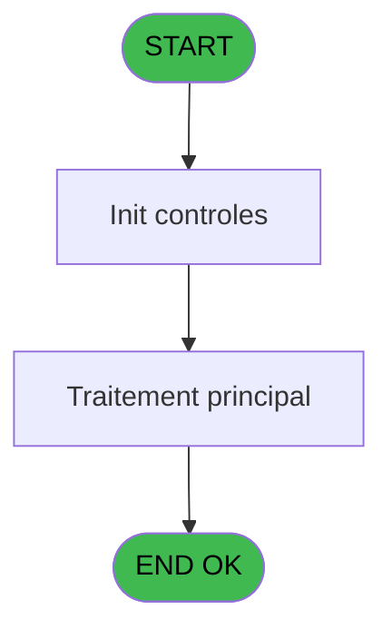
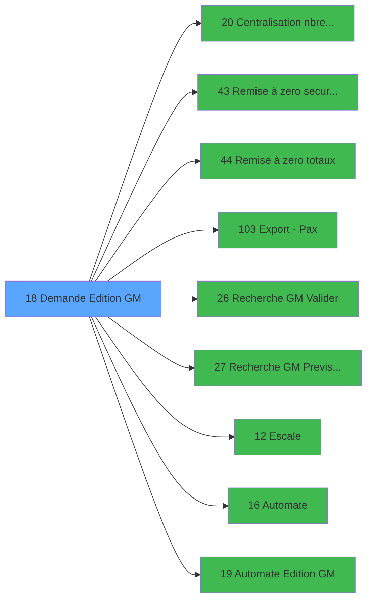

# PBP IDE 18 - Demande Edition GM

> **Analyse**: Phases 1-4 2026-02-03 01:06 -> 01:06 (36s) | Assemblage 01:06
> **Pipeline**: V7.2 Enrichi
> **Structure**: 4 onglets (Resume | Ecrans | Donnees | Connexions)

<!-- TAB:Resume -->

## 1. FICHE D'IDENTITE

| Attribut | Valeur |
|----------|--------|
| Projet | PBP |
| IDE Position | 18 |
| Nom Programme | Demande Edition GM |
| Fichier source | `Prg_18.xml` |
| Domaine metier | Impression |
| Taches | 2 (1 ecrans visibles) |
| Tables modifiees | 0 |
| Programmes appeles | 9 |
| :warning: Statut | **ORPHELIN_POTENTIEL** |

## 2. DESCRIPTION FONCTIONNELLE

**Demande Edition GM** assure la gestion complete de ce processus.

Le flux de traitement s'organise en **2 blocs fonctionnels** :

- **Consultation** (1 tache) : ecrans de recherche, selection et consultation
- **Traitement** (1 tache) : traitements metier divers

Detail : phases du traitement

#### Phase 1 : Traitement (1 tache)

- **18** - Passeport Client **[[ECRAN]](#ecran-t1)**

Delegue a : [   Remise à zero securite equi (IDE 43)](PBP-IDE-43.md), [   Remise à zero totaux (IDE 44)](PBP-IDE-44.md), [Export - Pax (IDE 103)](PBP-IDE-103.md), [Escale (IDE 12)](PBP-IDE-12.md), [Automate (IDE 16)](PBP-IDE-16.md)

#### Phase 2 : Consultation (1 tache)

- **18.1** - Recherche du commandant

Delegue a : [   Recherche GM Previsionnel (IDE 27)](PBP-IDE-27.md)

## 3. BLOCS FONCTIONNELS

### 3.1 Traitement (1 tache)

Traitements internes.

---

#### 18 - Passeport Client [[ECRAN]](#ecran-t1)

**Role** : Traitement : Passeport Client.
**Ecran** : 1022 x 226 DLU (MDI) | [Voir mockup](#ecran-t1)
**Delegue a** : [   Remise à zero securite equi (IDE 43)](PBP-IDE-43.md), [   Remise à zero totaux (IDE 44)](PBP-IDE-44.md), [Export - Pax (IDE 103)](PBP-IDE-103.md)

### 3.2 Consultation (1 tache)

Ecrans de recherche et consultation.

---

#### 18.1 - Recherche du commandant

**Role** : Traitement : Recherche du commandant.
**Variables liees** : A (v. commandant)
**Delegue a** : [   Recherche GM Valider (IDE 26)](PBP-IDE-26.md), [   Recherche GM Previsionnel (IDE 27)](PBP-IDE-27.md)

## 5. REGLES METIER

*(Aucune regle metier identifiee)*

## 6. CONTEXTE

- **Appele par**: (aucun)
- **Appelle**: 9 programmes | **Tables**: 3 (W:0 R:2 L:1) | **Taches**: 2 | **Expressions**: 48

<!-- TAB:Ecrans -->

## 8. ECRANS

### 8.1 Forms visibles (1 / 2)

| # | Position | Tache | Nom | Type | Largeur | Hauteur | Bloc |
|---|----------|-------|-----|------|---------|---------|------|
| 1 | 18 | 18 | Passeport Client | MDI | 1022 | 226 | Traitement |

### 8.2 Mockups Ecrans

---

#### 18 - Passeport Client
**Tache** : [18](#t1) | **Type** : MDI | **Dimensions** : 1022 x 226 DLU
**Bloc** : Traitement | **Titre IDE** : Passeport Client

<!-- FORM-DATA:
{
    "width":  1022,
    "vFactor":  8,
    "type":  "MDI",
    "hFactor":  8,
    "controls":  [
                     {
                         "x":  0,
                         "type":  "label",
                         "var":  "",
                         "y":  1,
                         "w":  1022,
                         "fmt":  "",
                         "name":  "",
                         "h":  19,
                         "color":  "1",
                         "text":  "",
                         "parent":  null
                     },
                     {
                         "x":  24,
                         "type":  "label",
                         "var":  "",
                         "y":  24,
                         "w":  772,
                         "fmt":  "",
                         "name":  "",
                         "h":  22,
                         "color":  "",
                         "text":  "",
                         "parent":  null
                     },
                     {
                         "x":  844,
                         "type":  "label",
                         "var":  "",
                         "y":  24,
                         "w":  178,
                         "fmt":  "",
                         "name":  "",
                         "h":  169,
                         "color":  "",
                         "text":  "",
                         "parent":  null
                     },
                     {
                         "x":  43,
                         "type":  "label",
                         "var":  "",
                         "y":  31,
                         "w":  128,
                         "fmt":  "",
                         "name":  "",
                         "h":  8,
                         "color":  "7",
                         "text":  "Commandant :",
                         "parent":  5
                     },
                     {
                         "x":  27,
                         "type":  "label",
                         "var":  "",
                         "y":  53,
                         "w":  772,
                         "fmt":  "",
                         "name":  "",
                         "h":  142,
                         "color":  "195",
                         "text":  "Paramètres",
                         "parent":  null
                     },
                     {
                         "x":  360,
                         "type":  "label",
                         "var":  "",
                         "y":  53,
                         "w":  439,
                         "fmt":  "",
                         "name":  "",
                         "h":  110,
                         "color":  "",
                         "text":  "",
                         "parent":  null
                     },
                     {
                         "x":  360,
                         "type":  "label",
                         "var":  "",
                         "y":  53,
                         "w":  439,
                         "fmt":  "",
                         "name":  "",
                         "h":  27,
                         "color":  "",
                         "text":  "",
                         "parent":  null
                     },
                     {
                         "x":  382,
                         "type":  "label",
                         "var":  "",
                         "y":  63,
                         "w":  45,
                         "fmt":  "",
                         "name":  "",
                         "h":  9,
                         "color":  "",
                         "text":  "Date",
                         "parent":  12
                     },
                     {
                         "x":  38,
                         "type":  "label",
                         "var":  "",
                         "y":  69,
                         "w":  230,
                         "fmt":  "",
                         "name":  "",
                         "h":  8,
                         "color":  "",
                         "text":  "P1 Embarquant",
                         "parent":  10
                     },
                     {
                         "x":  38,
                         "type":  "label",
                         "var":  "",
                         "y":  85,
                         "w":  210,
                         "fmt":  "",
                         "name":  "",
                         "h":  8,
                         "color":  "",
                         "text":  "P1 Débarquant",
                         "parent":  10
                     },
                     {
                         "x":  382,
                         "type":  "label",
                         "var":  "",
                         "y":  87,
                         "w":  74,
                         "fmt":  "",
                         "name":  "",
                         "h":  8,
                         "color":  "",
                         "text":  "Escale",
                         "parent":  11
                     },
                     {
                         "x":  38,
                         "type":  "label",
                         "var":  "",
                         "y":  103,
                         "w":  96,
                         "fmt":  "",
                         "name":  "",
                         "h":  8,
                         "color":  "",
                         "text":  "P1 Transit",
                         "parent":  10
                     },
                     {
                         "x":  382,
                         "type":  "label",
                         "var":  "",
                         "y":  103,
                         "w":  128,
                         "fmt":  "",
                         "name":  "",
                         "h":  8,
                         "color":  "",
                         "text":  "Heure d\u0027arrivée",
                         "parent":  11
                     },
                     {
                         "x":  849,
                         "type":  "line",
                         "var":  "",
                         "y":  103,
                         "w":  170,
                         "fmt":  "",
                         "name":  "",
                         "h":  0,
                         "color":  "",
                         "text":  "",
                         "parent":  6
                     },
                     {
                         "x":  382,
                         "type":  "label",
                         "var":  "",
                         "y":  119,
                         "w":  133,
                         "fmt":  "",
                         "name":  "",
                         "h":  8,
                         "color":  "",
                         "text":  "Heure de départ",
                         "parent":  11
                     },
                     {
                         "x":  38,
                         "type":  "label",
                         "var":  "",
                         "y":  120,
                         "w":  227,
                         "fmt":  "",
                         "name":  "",
                         "h":  8,
                         "color":  "",
                         "text":  "P1 Transits + Embarquants",
                         "parent":  10
                     },
                     {
                         "x":  382,
                         "type":  "label",
                         "var":  "",
                         "y":  134,
                         "w":  112,
                         "fmt":  "",
                         "name":  "",
                         "h":  8,
                         "color":  "",
                         "text":  "Num. Croisière",
                         "parent":  11
                     },
                     {
                         "x":  38,
                         "type":  "label",
                         "var":  "",
                         "y":  136,
                         "w":  96,
                         "fmt":  "",
                         "name":  "",
                         "h":  8,
                         "color":  "",
                         "text":  "P2",
                         "parent":  10
                     },
                     {
                         "x":  382,
                         "type":  "label",
                         "var":  "",
                         "y":  148,
                         "w":  67,
                         "fmt":  "",
                         "name":  "",
                         "h":  8,
                         "color":  "",
                         "text":  "Notes",
                         "parent":  11
                     },
                     {
                         "x":  38,
                         "type":  "label",
                         "var":  "",
                         "y":  154,
                         "w":  96,
                         "fmt":  "",
                         "name":  "",
                         "h":  8,
                         "color":  "",
                         "text":  "P3",
                         "parent":  10
                     },
                     {
                         "x":  360,
                         "type":  "label",
                         "var":  "",
                         "y":  158,
                         "w":  439,
                         "fmt":  "",
                         "name":  "",
                         "h":  37,
                         "color":  "",
                         "text":  "",
                         "parent":  null
                     },
                     {
                         "x":  38,
                         "type":  "label",
                         "var":  "",
                         "y":  171,
                         "w":  96,
                         "fmt":  "",
                         "name":  "",
                         "h":  8,
                         "color":  "",
                         "text":  "P6",
                         "parent":  10
                     },
                     {
                         "x":  382,
                         "type":  "label",
                         "var":  "",
                         "y":  178,
                         "w":  96,
                         "fmt":  "",
                         "name":  "",
                         "h":  8,
                         "color":  "",
                         "text":  "Preview",
                         "parent":  38
                     },
                     {
                         "x":  0,
                         "type":  "label",
                         "var":  "",
                         "y":  202,
                         "w":  1022,
                         "fmt":  "",
                         "name":  "",
                         "h":  24,
                         "color":  "1",
                         "text":  "",
                         "parent":  null
                     },
                     {
                         "x":  189,
                         "type":  "edit",
                         "var":  "",
                         "y":  31,
                         "w":  568,
                         "fmt":  "",
                         "name":  "",
                         "h":  8,
                         "color":  "7",
                         "text":  "",
                         "parent":  5
                     },
                     {
                         "x":  267,
                         "type":  "checkbox",
                         "var":  "",
                         "y":  67,
                         "w":  32,
                         "fmt":  "",
                         "name":  "v. edit P1 embarquant",
                         "h":  12,
                         "color":  "",
                         "text":  "",
                         "parent":  null
                     },
                     {
                         "x":  306,
                         "type":  "edit",
                         "var":  "",
                         "y":  68,
                         "w":  37,
                         "fmt":  "",
                         "name":  "v. nbre P1 embarquant",
                         "h":  10,
                         "color":  "110",
                         "text":  "",
                         "parent":  10
                     },
                     {
                         "x":  267,
                         "type":  "checkbox",
                         "var":  "",
                         "y":  83,
                         "w":  32,
                         "fmt":  "",
                         "name":  "v. edit P1 Debarquant",
                         "h":  12,
                         "color":  "",
                         "text":  "",
                         "parent":  null
                     },
                     {
                         "x":  306,
                         "type":  "edit",
                         "var":  "",
                         "y":  84,
                         "w":  37,
                         "fmt":  "",
                         "name":  "v. nbre P1 Debarquant",
                         "h":  10,
                         "color":  "110",
                         "text":  "",
                         "parent":  10
                     },
                     {
                         "x":  267,
                         "type":  "checkbox",
                         "var":  "",
                         "y":  101,
                         "w":  32,
                         "fmt":  "",
                         "name":  "v. edit P1 Transit",
                         "h":  12,
                         "color":  "",
                         "text":  "",
                         "parent":  null
                     },
                     {
                         "x":  306,
                         "type":  "edit",
                         "var":  "",
                         "y":  102,
                         "w":  37,
                         "fmt":  "",
                         "name":  "v. nbre P1 Transit",
                         "h":  10,
                         "color":  "110",
                         "text":  "",
                         "parent":  10
                     },
                     {
                         "x":  267,
                         "type":  "checkbox",
                         "var":  "",
                         "y":  118,
                         "w":  32,
                         "fmt":  "",
                         "name":  "v. edit P1 List",
                         "h":  12,
                         "color":  "",
                         "text":  "",
                         "parent":  null
                     },
                     {
                         "x":  306,
                         "type":  "edit",
                         "var":  "",
                         "y":  119,
                         "w":  37,
                         "fmt":  "",
                         "name":  "v. nbre P1 List",
                         "h":  10,
                         "color":  "110",
                         "text":  "",
                         "parent":  10
                     },
                     {
                         "x":  267,
                         "type":  "checkbox",
                         "var":  "",
                         "y":  134,
                         "w":  32,
                         "fmt":  "",
                         "name":  "v. edit C2",
                         "h":  12,
                         "color":  "",
                         "text":  "",
                         "parent":  null
                     },
                     {
                         "x":  306,
                         "type":  "edit",
                         "var":  "",
                         "y":  135,
                         "w":  37,
                         "fmt":  "",
                         "name":  "v. nbre C2",
                         "h":  10,
                         "color":  "110",
                         "text":  "",
                         "parent":  10
                     },
                     {
                         "x":  267,
                         "type":  "checkbox",
                         "var":  "",
                         "y":  152,
                         "w":  32,
                         "fmt":  "",
                         "name":  "v. edit C4",
                         "h":  12,
                         "color":  "",
                         "text":  "",
                         "parent":  null
                     },
                     {
                         "x":  306,
                         "type":  "edit",
                         "var":  "",
                         "y":  153,
                         "w":  37,
                         "fmt":  "",
                         "name":  "v. nbre C4",
                         "h":  10,
                         "color":  "110",
                         "text":  "",
                         "parent":  10
                     },
                     {
                         "x":  267,
                         "type":  "checkbox",
                         "var":  "",
                         "y":  169,
                         "w":  32,
                         "fmt":  "",
                         "name":  "v. edit C6",
                         "h":  12,
                         "color":  "",
                         "text":  "",
                         "parent":  null
                     },
                     {
                         "x":  306,
                         "type":  "edit",
                         "var":  "",
                         "y":  170,
                         "w":  37,
                         "fmt":  "",
                         "name":  "v. nbre C6",
                         "h":  10,
                         "color":  "110",
                         "text":  "",
                         "parent":  10
                     },
                     {
                         "x":  522,
                         "type":  "edit",
                         "var":  "",
                         "y":  63,
                         "w":  126,
                         "fmt":  "",
                         "name":  "w0_Date",
                         "h":  10,
                         "color":  "110",
                         "text":  "",
                         "parent":  12
                     },
                     {
                         "x":  652,
                         "type":  "button",
                         "var":  "",
                         "y":  63,
                         "w":  25,
                         "fmt":  "...",
                         "name":  "b_Date",
                         "h":  8,
                         "color":  "",
                         "text":  "",
                         "parent":  12
                     },
                     {
                         "x":  477,
                         "type":  "checkbox",
                         "var":  "",
                         "y":  176,
                         "w":  32,
                         "fmt":  "",
                         "name":  "v. preview",
                         "h":  12,
                         "color":  "",
                         "text":  "",
                         "parent":  null
                     },
                     {
                         "x":  584,
                         "type":  "radio",
                         "var":  "",
                         "y":  163,
                         "w":  208,
                         "fmt":  "",
                         "name":  "v. imprimante",
                         "h":  28,
                         "color":  "",
                         "text":  "",
                         "parent":  38
                     },
                     {
                         "x":  522,
                         "type":  "edit",
                         "var":  "",
                         "y":  88,
                         "w":  238,
                         "fmt":  "",
                         "name":  "",
                         "h":  10,
                         "color":  "",
                         "text":  "",
                         "parent":  11
                     },
                     {
                         "x":  522,
                         "type":  "edit",
                         "var":  "",
                         "y":  103,
                         "w":  104,
                         "fmt":  "",
                         "name":  "",
                         "h":  10,
                         "color":  "",
                         "text":  "",
                         "parent":  11
                     },
                     {
                         "x":  522,
                         "type":  "edit",
                         "var":  "",
                         "y":  119,
                         "w":  104,
                         "fmt":  "",
                         "name":  "",
                         "h":  10,
                         "color":  "",
                         "text":  "",
                         "parent":  11
                     },
                     {
                         "x":  522,
                         "type":  "edit",
                         "var":  "",
                         "y":  134,
                         "w":  126,
                         "fmt":  "",
                         "name":  "",
                         "h":  10,
                         "color":  "",
                         "text":  "",
                         "parent":  11
                     },
                     {
                         "x":  522,
                         "type":  "edit",
                         "var":  "",
                         "y":  148,
                         "w":  238,
                         "fmt":  "",
                         "name":  "",
                         "h":  10,
                         "color":  "",
                         "text":  "",
                         "parent":  11
                     },
                     {
                         "x":  859,
                         "type":  "button",
                         "var":  "",
                         "y":  106,
                         "w":  154,
                         "fmt":  "\u0026Imprimer",
                         "name":  "b_Edition",
                         "h":  18,
                         "color":  "",
                         "text":  "",
                         "parent":  null
                     },
                     {
                         "x":  859,
                         "type":  "button",
                         "var":  "",
                         "y":  128,
                         "w":  154,
                         "fmt":  "\u0026Prévisionnel",
                         "name":  "b_Edition Previsonnel",
                         "h":  18,
                         "color":  "",
                         "text":  "",
                         "parent":  null
                     },
                     {
                         "x":  859,
                         "type":  "button",
                         "var":  "",
                         "y":  150,
                         "w":  154,
                         "fmt":  "\u0026Automate",
                         "name":  "b_Edition Automate",
                         "h":  18,
                         "color":  "",
                         "text":  "",
                         "parent":  null
                     },
                     {
                         "x":  859,
                         "type":  "button",
                         "var":  "",
                         "y":  172,
                         "w":  154,
                         "fmt":  "\u0026Export",
                         "name":  "b_Export PAX",
                         "h":  18,
                         "color":  "",
                         "text":  "",
                         "parent":  null
                     },
                     {
                         "x":  6,
                         "type":  "edit",
                         "var":  "",
                         "y":  2,
                         "w":  267,
                         "fmt":  "20",
                         "name":  "",
                         "h":  8,
                         "color":  "",
                         "text":  "",
                         "parent":  1
                     },
                     {
                         "x":  809,
                         "type":  "edit",
                         "var":  "",
                         "y":  7,
                         "w":  203,
                         "fmt":  "WWW DD MMM YYYYT",
                         "name":  "",
                         "h":  8,
                         "color":  "",
                         "text":  "",
                         "parent":  1
                     },
                     {
                         "x":  6,
                         "type":  "edit",
                         "var":  "",
                         "y":  11,
                         "w":  325,
                         "fmt":  "30",
                         "name":  "",
                         "h":  8,
                         "color":  "",
                         "text":  "",
                         "parent":  1
                     },
                     {
                         "x":  854,
                         "type":  "image",
                         "var":  "",
                         "y":  28,
                         "w":  159,
                         "fmt":  "",
                         "name":  "",
                         "h":  53,
                         "color":  "",
                         "text":  "",
                         "parent":  6
                     },
                     {
                         "x":  859,
                         "type":  "button",
                         "var":  "",
                         "y":  81,
                         "w":  154,
                         "fmt":  "\u0026Escales",
                         "name":  "",
                         "h":  18,
                         "color":  "",
                         "text":  "",
                         "parent":  null
                     },
                     {
                         "x":  8,
                         "type":  "button",
                         "var":  "",
                         "y":  205,
                         "w":  154,
                         "fmt":  "\u0026Quitter",
                         "name":  "",
                         "h":  18,
                         "color":  "",
                         "text":  "",
                         "parent":  42
                     },
                     {
                         "x":  859,
                         "type":  "button",
                         "var":  "",
                         "y":  205,
                         "w":  154,
                         "fmt":  "\u0026Màj Automate",
                         "name":  "",
                         "h":  18,
                         "color":  "",
                         "text":  "",
                         "parent":  null
                     }
                 ],
    "taskId":  "18",
    "height":  226
}
-->

<strong>Champs : 25 champs</strong>

| Pos (x,y) | Nom | Variable | Type |
|-----------|-----|----------|------|
| 189,31 | (sans nom) | - | edit |
| 267,67 | v. edit P1 embarquant | - | checkbox |
| 306,68 | v. nbre P1 embarquant | - | edit |
| 267,83 | v. edit P1 Debarquant | - | checkbox |
| 306,84 | v. nbre P1 Debarquant | - | edit |
| 267,101 | v. edit P1 Transit | - | checkbox |
| 306,102 | v. nbre P1 Transit | - | edit |
| 267,118 | v. edit P1 List | - | checkbox |
| 306,119 | v. nbre P1 List | - | edit |
| 267,134 | v. edit C2 | - | checkbox |
| 306,135 | v. nbre C2 | - | edit |
| 267,152 | v. edit C4 | - | checkbox |
| 306,153 | v. nbre C4 | - | edit |
| 267,169 | v. edit C6 | - | checkbox |
| 306,170 | v. nbre C6 | - | edit |
| 522,63 | w0_Date | - | edit |
| 477,176 | v. preview | - | checkbox |
| 522,88 | (sans nom) | - | edit |
| 522,103 | (sans nom) | - | edit |
| 522,119 | (sans nom) | - | edit |
| 522,134 | (sans nom) | - | edit |
| 522,148 | (sans nom) | - | edit |
| 6,2 | 20 | - | edit |
| 809,7 | WWW DD MMM YYYYT | - | edit |
| 6,11 | 30 | - | edit |

<strong>Boutons : 8 boutons</strong>

| Bouton | Pos (x,y) | Action |
|--------|-----------|--------|
| ... | 652,63 | Bouton fonctionnel |
| Imprimer | 859,106 | Lance l'impression |
| Prévisionnel | 859,128 | Bouton fonctionnel |
| Automate | 859,150 | Appel [Automate (IDE 16)](PBP-IDE-16.md) |
| Export | 859,172 | Appel [Export - Pax (IDE 103)](PBP-IDE-103.md) |
| Escales | 859,81 | Appel [Escale (IDE 12)](PBP-IDE-12.md) |
| Quitter | 8,205 | Quitte le programme |
| Màj Automate | 859,205 | Bouton fonctionnel |

## 9. NAVIGATION

Ecran unique: **Passeport Client**

### 9.3 Structure hierarchique (2 taches)

| Position | Tache | Type | Dimensions | Bloc |
|----------|-------|------|------------|------|
| **18.1** | [**Passeport Client** (18)](#t1) [mockup](#ecran-t1) | MDI | 1022x226 | Traitement |
| **18.2** | [**Recherche du commandant** (18.1)](#t2) | MDI | - | Consultation |

### 9.4 Algorigramme

> **Legende**: Vert = START/END OK | Rouge = END KO | Bleu = Decisions
> *Algorigramme auto-genere. Utiliser `/algorigramme` pour une synthese metier detaillee.*

<!-- TAB:Donnees -->

## 10. TABLES

### Tables utilisees (3)

| ID | Nom | Description | Type | R | W | L | Usages |
|----|-----|-------------|------|---|---|---|--------|
| 35 | personnel_go______go |  | DB | R |   |   | 1 |
| 281 | crew |  | DB |   |   | L | 1 |
| 289 | escale |  | DB | R |   |   | 1 |

### Colonnes par table (1 / 2 tables avec colonnes identifiees)

Table 35 - personnel_go______go (R) - 1 usages

*Table utilisee uniquement en Link ou aucune colonne Real identifiee dans le DataView.*

Table 289 - escale (R) - 1 usages

| Lettre | Variable | Acces | Type |
|--------|----------|-------|------|
| A | v. commandant | R | Alpha |
| B | v. edit P1 embarquant | R | Logical |
| C | v. nbre P1 embarquant | R | Numeric |
| D | v. edit P1 Debarquant | R | Logical |
| E | v. nbre P1 Debarquant | R | Numeric |
| F | v. edit P1 Transit | R | Logical |
| G | v. nbre P1 Transit | R | Numeric |
| H | v. edit P1 List | R | Logical |
| I | v. nbre P1 List | R | Numeric |
| J | v. edit C2 | R | Logical |
| K | v. nbre C2 | R | Numeric |
| L | v. edit C4 | R | Logical |
| M | v. nbre C4 | R | Numeric |
| N | v. edit C5 | R | Logical |
| O | v. nbre C5 | R | Numeric |
| P | v. edit C6 | R | Logical |
| Q | v. nbre C6 | R | Numeric |
| R | w0_Date | R | Date |
| S | b_Date | R | Alpha |
| T | v. preview | R | Logical |
| U | v. imprimante | R | Alpha |
| V | b_Edition | R | Alpha |
| W | b_Edition Previsonnel | R | Alpha |
| X | b_Edition Automate | R | Alpha |
| Y | b_Export PAX | R | Alpha |

## 11. VARIABLES

### 11.1 Variables de session (19)

Variables persistantes pendant toute la session.

| Lettre | Nom | Type | Usage dans |
|--------|-----|------|-----------|
| A | v. commandant | Alpha | - |
| B | v. edit P1 embarquant | Logical | 2x session |
| C | v. nbre P1 embarquant | Numeric | 4x session |
| D | v. edit P1 Debarquant | Logical | 2x session |
| E | v. nbre P1 Debarquant | Numeric | - |
| F | v. edit P1 Transit | Logical | 2x session |
| G | v. nbre P1 Transit | Numeric | - |
| H | v. edit P1 List | Logical | 2x session |
| I | v. nbre P1 List | Numeric | - |
| J | v. edit C2 | Logical | 1x session |
| K | v. nbre C2 | Numeric | 1x session |
| L | v. edit C4 | Logical | 1x session |
| M | v. nbre C4 | Numeric | 1x session |
| N | v. edit C5 | Logical | - |
| O | v. nbre C5 | Numeric | 1x session |
| P | v. edit C6 | Logical | 1x session |
| Q | v. nbre C6 | Numeric | 1x session |
| T | v. preview | Logical | 1x session |
| U | v. imprimante | Alpha | - |

### 11.2 Autres (6)

Variables diverses.

| Lettre | Nom | Type | Usage dans |
|--------|-----|------|-----------|
| R | w0_Date | Date | 1x refs |
| S | b_Date | Alpha | - |
| V | b_Edition | Alpha | - |
| W | b_Edition Previsonnel | Alpha | - |
| X | b_Edition Automate | Alpha | - |
| Y | b_Export PAX | Alpha | - |

Toutes les 25 variables (liste complete)

| Cat | Lettre | Nom Variable | Type |
|-----|--------|--------------|------|
| V. | **A** | v. commandant | Alpha |
| V. | **B** | v. edit P1 embarquant | Logical |
| V. | **C** | v. nbre P1 embarquant | Numeric |
| V. | **D** | v. edit P1 Debarquant | Logical |
| V. | **E** | v. nbre P1 Debarquant | Numeric |
| V. | **F** | v. edit P1 Transit | Logical |
| V. | **G** | v. nbre P1 Transit | Numeric |
| V. | **H** | v. edit P1 List | Logical |
| V. | **I** | v. nbre P1 List | Numeric |
| V. | **J** | v. edit C2 | Logical |
| V. | **K** | v. nbre C2 | Numeric |
| V. | **L** | v. edit C4 | Logical |
| V. | **M** | v. nbre C4 | Numeric |
| V. | **N** | v. edit C5 | Logical |
| V. | **O** | v. nbre C5 | Numeric |
| V. | **P** | v. edit C6 | Logical |
| V. | **Q** | v. nbre C6 | Numeric |
| V. | **T** | v. preview | Logical |
| V. | **U** | v. imprimante | Alpha |
| Autre | **R** | w0_Date | Date |
| Autre | **S** | b_Date | Alpha |
| Autre | **V** | b_Edition | Alpha |
| Autre | **W** | b_Edition Previsonnel | Alpha |
| Autre | **X** | b_Edition Automate | Alpha |
| Autre | **Y** | b_Export PAX | Alpha |

## 12. EXPRESSIONS

**48 / 48 expressions decodees (100%)**

### 12.1 Repartition par type

| Type | Expressions | Regles |
|------|-------------|--------|
| CONSTANTE | 13 | 0 |
| DATE | 1 | 0 |
| REFERENCE_VG | 1 | 0 |
| OTHER | 13 | 0 |
| CAST_LOGIQUE | 12 | 0 |
| STRING | 8 | 0 |

### 12.2 Expressions cles par type

#### CONSTANTE (13 expressions)

| Type | IDE | Expression | Regle |
|------|-----|------------|-------|
| CONSTANTE | 32 | `'P2'` | - |
| CONSTANTE | 31 | `'P1L'` | - |
| CONSTANTE | 30 | `'P1P'` | - |
| CONSTANTE | 45 | `'P'` | - |
| CONSTANTE | 34 | `'P6'` | - |
| ... | | *+8 autres* | |

#### DATE (1 expressions)

| Type | IDE | Expression | Regle |
|------|-----|------------|-------|
| DATE | 3 | `Date ()` | - |

#### REFERENCE_VG (1 expressions)

| Type | IDE | Expression | Regle |
|------|-----|------------|-------|
| REFERENCE_VG | 2 | `VG2` | - |

#### OTHER (13 expressions)

| Type | IDE | Expression | Regle |
|------|-----|------------|-------|
| OTHER | 41 | `v. edit C6 [P]` | - |
| OTHER | 40 | `v. edit C4 [L]` | - |
| OTHER | 39 | `v. edit C2 [J]` | - |
| OTHER | 48 | `GetParam ('SOCIETE')` | - |
| OTHER | 46 | `v. edit P1 embarquant [B] OR v. edit P1 Debarquant [D] OR v. edit P1 Transit [F] OR v. edit P1 List [H]` | - |
| ... | | *+8 autres* | |

#### CAST_LOGIQUE (12 expressions)

| Type | IDE | Expression | Regle |
|------|-----|------------|-------|
| CAST_LOGIQUE | 23 | `INIPut ('[BATEAU]EdtP5='&Str (v. nbre C5 [O],'2'),'FALSE'LOG)` | - |
| CAST_LOGIQUE | 21 | `INIPut ('[BATEAU]EdtP4='&Str (v. nbre C4 [M],'2'),'FALSE'LOG)` | - |
| CAST_LOGIQUE | 19 | `INIPut ('[BATEAU]EdtP2='&Str (v. nbre C2 [K],'2'),'FALSE'LOG)` | - |
| CAST_LOGIQUE | 44 | `INIPut ('[PREVIEW]'&Trim (Str (VG85,'4'))&'pview=N','FALSE'LOG)` | - |
| CAST_LOGIQUE | 43 | `INIPut ('[PREVIEW]'&Trim (Str (VG85,'4'))&'pview='&IF (v. preview [T],'O','N'),'FALSE'LOG)` | - |
| ... | | *+7 autres* | |

#### STRING (8 expressions)

| Type | IDE | Expression | Regle |
|------|-----|------------|-------|
| STRING | 20 | `Val (INIGet ('[BATEAU]EdtP4'),'2')` | - |
| STRING | 18 | `Val (INIGet ('[BATEAU]EdtP2'),'2')` | - |
| STRING | 24 | `Val (INIGet ('[BATEAU]EdtP6'),'2')` | - |
| STRING | 22 | `Val (INIGet ('[BATEAU]EdtP5'),'2')` | - |
| STRING | 11 | `Val (INIGet ('[BATEAU]EdtDP1'),'2')` | - |
| ... | | *+3 autres* | |

### 12.3 Toutes les expressions (48)

Voir les 48 expressions

#### CONSTANTE (13)

| IDE | Expression Decodee |
|-----|-------------------|
| 1 | `'...'` |
| 4 | `'&Imprimer'` |
| 5 | `'&Automate'` |
| 6 | `'&Export'` |
| 27 | `'P1E'` |
| 28 | `'P1D'` |
| 29 | `'P1T'` |
| 30 | `'P1P'` |
| 31 | `'P1L'` |
| 32 | `'P2'` |
| 33 | `'P3'` |
| 34 | `'P6'` |
| 45 | `'P'` |

#### DATE (1)

| IDE | Expression Decodee |
|-----|-------------------|
| 3 | `Date ()` |

#### REFERENCE_VG (1)

| IDE | Expression Decodee |
|-----|-------------------|
| 2 | `VG2` |

#### OTHER (13)

| IDE | Expression Decodee |
|-----|-------------------|
| 7 | `GetParam ('VILLAGE')` |
| 8 | `SetCrsr (2)` |
| 9 | `SetCrsr (1)` |
| 35 | `v. edit P1 embarquant [B]` |
| 36 | `v. edit P1 Debarquant [D]` |
| 37 | `v. edit P1 Transit [F]` |
| 38 | `v. edit P1 List [H]` |
| 39 | `v. edit C2 [J]` |
| 40 | `v. edit C4 [L]` |
| 41 | `v. edit C6 [P]` |
| 42 | `w0_Date [R]` |
| 46 | `v. edit P1 embarquant [B] OR v. edit P1 Debarquant [D] OR v. edit P1 Transit [F] OR v. edit P1 List [H]` |
| 48 | `GetParam ('SOCIETE')` |

#### CAST_LOGIQUE (12)

| IDE | Expression Decodee |
|-----|-------------------|
| 26 | `'TRUE'LOG` |
| 47 | `'FALSE'LOG` |
| 14 | `INIPut ('[BATEAU]EdtEP1='&Str (v. nbre P1 embarquant [C],'2'),'FALSE'LOG)` |
| 15 | `INIPut ('[BATEAU]EdtDP1='&Str (v. nbre P1 embarquant [C],'2'),'FALSE'LOG)` |
| 16 | `INIPut ('[BATEAU]EdtTP1='&Str (v. nbre P1 embarquant [C],'2'),'FALSE'LOG)` |
| 17 | `INIPut ('[BATEAU]EdtLP1='&Str (v. nbre P1 embarquant [C],'2'),'FALSE'LOG)` |
| 19 | `INIPut ('[BATEAU]EdtP2='&Str (v. nbre C2 [K],'2'),'FALSE'LOG)` |
| 21 | `INIPut ('[BATEAU]EdtP4='&Str (v. nbre C4 [M],'2'),'FALSE'LOG)` |
| 23 | `INIPut ('[BATEAU]EdtP5='&Str (v. nbre C5 [O],'2'),'FALSE'LOG)` |
| 25 | `INIPut ('[BATEAU]EdtP6='&Str (v. nbre C6 [Q],'2'),'FALSE'LOG)` |
| 43 | `INIPut ('[PREVIEW]'&Trim (Str (VG85,'4'))&'pview='&IF (v. preview [T],'O','N'),'FALSE'LOG)` |
| 44 | `INIPut ('[PREVIEW]'&Trim (Str (VG85,'4'))&'pview=N','FALSE'LOG)` |

#### STRING (8)

| IDE | Expression Decodee |
|-----|-------------------|
| 10 | `Val (INIGet ('[BATEAU]EdtEP1'),'2')` |
| 11 | `Val (INIGet ('[BATEAU]EdtDP1'),'2')` |
| 12 | `Val (INIGet ('[BATEAU]EdtTP1'),'2')` |
| 13 | `Val (INIGet ('[BATEAU]EdtLP1'),'2')` |
| 18 | `Val (INIGet ('[BATEAU]EdtP2'),'2')` |
| 20 | `Val (INIGet ('[BATEAU]EdtP4'),'2')` |
| 22 | `Val (INIGet ('[BATEAU]EdtP5'),'2')` |
| 24 | `Val (INIGet ('[BATEAU]EdtP6'),'2')` |

<!-- TAB:Connexions -->

## 13. GRAPHE D'APPELS

### 13.1 Chaine depuis Main (Callers)

**Chemin**: (pas de callers directs)

### 13.2 Callers

| IDE | Nom Programme | Nb Appels |
|-----|---------------|-----------|
| - | (aucun) | - |

### 13.3 Callees (programmes appeles)

### 13.4 Detail Callees avec contexte

| IDE | Nom Programme | Appels | Contexte |
|-----|---------------|--------|----------|
| [20](PBP-IDE-20.md) | Centralisation nbre edition | 8 | Impression ticket/document |
| [43](PBP-IDE-43.md) |    Remise à zero securite equi | 4 | Programme fidelite |
| [44](PBP-IDE-44.md) |    Remise à zero totaux | 4 | Programme fidelite |
| [103](PBP-IDE-103.md) | Export - Pax | 3 | Sous-programme |
| [26](PBP-IDE-26.md) |    Recherche GM Valider | 2 | Sous-programme |
| [27](PBP-IDE-27.md) |    Recherche GM Previsionnel | 2 | Sous-programme |
| [12](PBP-IDE-12.md) | Escale | 1 | Sous-programme |
| [16](PBP-IDE-16.md) | Automate | 1 | Sous-programme |
| [19](PBP-IDE-19.md) |    Automate Edition GM | 1 | Impression ticket/document |

## 14. RECOMMANDATIONS MIGRATION

### 14.1 Profil du programme

| Metrique | Valeur | Impact migration |
|----------|--------|-----------------|
| Lignes de logique | 129 | Programme compact |
| Expressions | 48 | Peu de logique |
| Tables WRITE | 0 | Impact faible |
| Sous-programmes | 9 | Dependances moderees |
| Ecrans visibles | 1 | Ecran unique ou traitement batch |
| Code desactive | 0% (0 / 129) | Code sain |
| Regles metier | 0 | Pas de regle identifiee |

### 14.2 Plan de migration par bloc

#### Traitement (1 tache: 1 ecran, 0 traitement)

- **Strategie** : 1 composant(s) UI (Razor/React) avec formulaires et validation.
- 9 sous-programme(s) a migrer ou a reutiliser depuis les services existants.
- Decomposer les taches en services unitaires testables.

#### Consultation (1 tache: 0 ecran, 1 traitement)

- **Strategie** : Composants de recherche/selection en modales.

### 14.3 Dependances critiques

| Dependance | Type | Appels | Impact |
|------------|------|--------|--------|
| [Centralisation nbre edition (IDE 20)](PBP-IDE-20.md) | Sous-programme | 8x | **CRITIQUE** - Impression ticket/document |
| [   Remise à zero totaux (IDE 44)](PBP-IDE-44.md) | Sous-programme | 4x | **CRITIQUE** - Programme fidelite |
| [   Remise à zero securite equi (IDE 43)](PBP-IDE-43.md) | Sous-programme | 4x | **CRITIQUE** - Programme fidelite |
| [Export - Pax (IDE 103)](PBP-IDE-103.md) | Sous-programme | 3x | **CRITIQUE** - Sous-programme |
| [   Recherche GM Previsionnel (IDE 27)](PBP-IDE-27.md) | Sous-programme | 2x | Haute - Sous-programme |
| [   Recherche GM Valider (IDE 26)](PBP-IDE-26.md) | Sous-programme | 2x | Haute - Sous-programme |
| [   Automate Edition GM (IDE 19)](PBP-IDE-19.md) | Sous-programme | 1x | Normale - Impression ticket/document |
| [Automate (IDE 16)](PBP-IDE-16.md) | Sous-programme | 1x | Normale - Sous-programme |
| [Escale (IDE 12)](PBP-IDE-12.md) | Sous-programme | 1x | Normale - Sous-programme |

---
*Spec DETAILED generee par Pipeline V7.2 - 2026-02-03 01:06*
