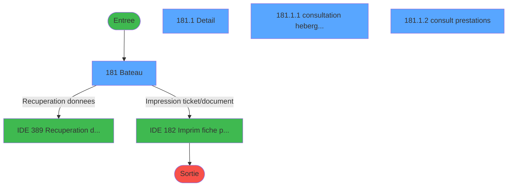
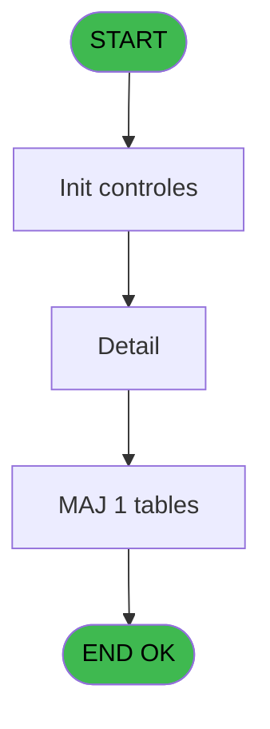
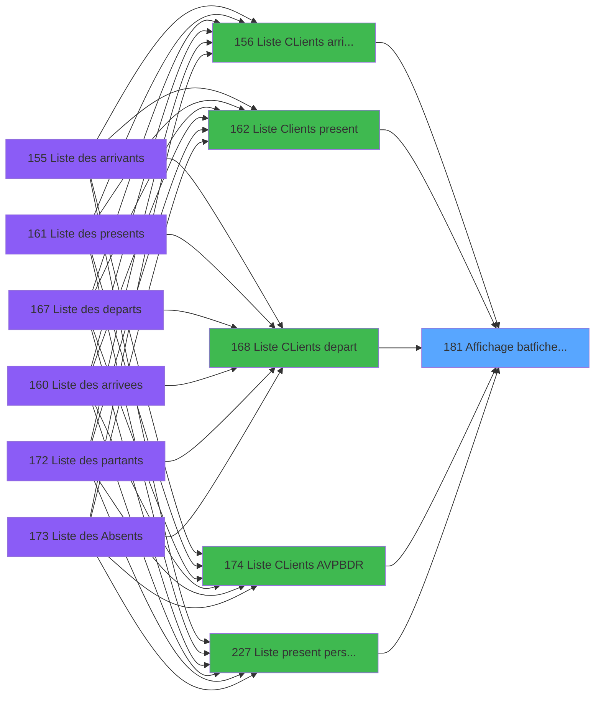
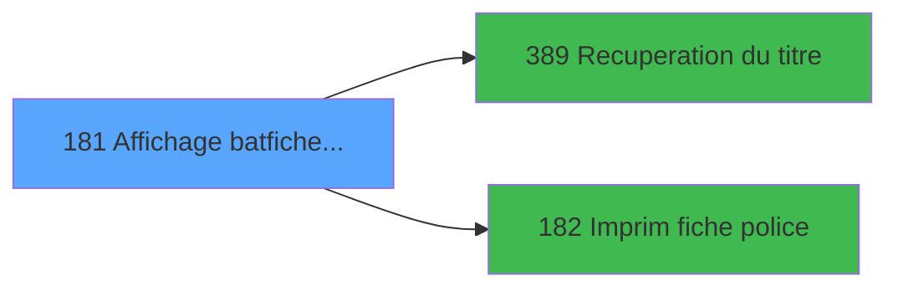

# PBP IDE 181 - Affichage bat/fiche police

> **Analyse**: Phases 1-4 2026-02-03 15:40 -> 15:40 (11s) | Assemblage 15:40
> **Pipeline**: V7.2 Enrichi
> **Structure**: 4 onglets (Resume | Ecrans | Donnees | Connexions)

<!-- TAB:Resume -->

## 1. FICHE D'IDENTITE

| Attribut | Valeur |
|----------|--------|
| Projet | PBP |
| IDE Position | 181 |
| Nom Programme | Affichage bat/fiche police |
| Fichier source | `Prg_181.xml` |
| Dossier IDE | Liste |
| Taches | 4 (4 ecrans visibles) |
| Tables modifiees | 1 |
| Programmes appeles | 2 |

## 2. DESCRIPTION FONCTIONNELLE

**Affichage bat/fiche police** assure la gestion complete de ce processus, accessible depuis [  Liste CLients arrivant (IDE 156)](PBP-IDE-156.md), [  Liste Clients present (IDE 162)](PBP-IDE-162.md), [  Liste CLients depart (IDE 168)](PBP-IDE-168.md), [Liste CLients AVPBDR (IDE 174)](PBP-IDE-174.md), [  Liste present personnel plan (IDE 227)](PBP-IDE-227.md), [  Liste personnels AVPBDR (IDE 234)](PBP-IDE-234.md).

Le flux de traitement s'organise en **1 blocs fonctionnels** :

- **Traitement** (4 taches) : traitements metier divers

**Donnees modifiees** : 1 tables en ecriture (tempo_mecano_dossier_grou).

**Logique metier** : 2 regles identifiees couvrant conditions metier.

Detail : phases du traitement

#### Phase 1 : Traitement (4 taches)

- **181** - Bateau **[[ECRAN]](#ecran-t1)**
- **181.1** - Detail **[[ECRAN]](#ecran-t2)**
- **181.1.1** - consultation hebergement **[[ECRAN]](#ecran-t3)**
- **181.1.2** - consult prestations **[[ECRAN]](#ecran-t4)**

Delegue a : [Recuperation du titre (IDE 389)](PBP-IDE-389.md)

#### Tables impactees

| Table | Operations | Role metier |
|-------|-----------|-------------|
| tempo_mecano_dossier_grou | **W** (1 usages) | Table temporaire ecran |

## 3. BLOCS FONCTIONNELS

### 3.1 Traitement (4 taches)

Traitements internes.

---

#### 181 - Bateau [[ECRAN]](#ecran-t1)

**Role** : Traitement : Bateau.
**Ecran** : 1221 x 214 DLU (MDI) | [Voir mockup](#ecran-t1)

3 sous-taches directes

| Tache | Nom | Bloc |
|-------|-----|------|
| [181.1](#t2) | Detail **[[ECRAN]](#ecran-t2)** | Traitement |
| [181.1.1](#t3) | consultation hebergement **[[ECRAN]](#ecran-t3)** | Traitement |
| [181.1.2](#t4) | consult prestations **[[ECRAN]](#ecran-t4)** | Traitement |

**Delegue a** : [Recuperation du titre (IDE 389)](PBP-IDE-389.md)

---

#### 181.1 - Detail [[ECRAN]](#ecran-t2)

**Role** : Traitement : Detail.
**Ecran** : 768 x 264 DLU (MDI) | [Voir mockup](#ecran-t2)
**Delegue a** : [Recuperation du titre (IDE 389)](PBP-IDE-389.md)

---

#### 181.1.1 - consultation hebergement [[ECRAN]](#ecran-t3)

**Role** : Consultation/chargement : consultation hebergement.
**Ecran** : 767 x 78 DLU (Modal) | [Voir mockup](#ecran-t3)
**Delegue a** : [Recuperation du titre (IDE 389)](PBP-IDE-389.md)

---

#### 181.1.2 - consult prestations [[ECRAN]](#ecran-t4)

**Role** : Traitement : consult prestations.
**Ecran** : 759 x 39 DLU (Modal) | [Voir mockup](#ecran-t4)
**Delegue a** : [Recuperation du titre (IDE 389)](PBP-IDE-389.md)

## 5. REGLES METIER

2 regles identifiees:

### Autres (2 regles)

#### [RM-001] Si VG96 alors '>Heure [C]'FORM sinon '>Date [B]'FORM)

| Element | Detail |
|---------|--------|
| **Condition** | `VG96` |
| **Si vrai** | '>Heure [C]'FORM |
| **Si faux** | '>Date [B]'FORM) |
| **Variables** | B (>Date), C (>Heure) |
| **Expression source** | Expression 12 : `IF(VG96, '>Heure [C]'FORM, '>Date [B]'FORM)` |
| **Exemple** | Si VG96 → '>Heure [C]'FORM. Sinon → '>Date [B]'FORM) |

#### [RM-002] Si [BM]<>'T' alors 31 sinon 29.5)

| Element | Detail |
|---------|--------|
| **Condition** | `[BM]<>'T'` |
| **Si vrai** | 31 |
| **Si faux** | 29.5) |
| **Expression source** | Expression 14 : `IF([BM]<>'T',31,29.5)` |
| **Exemple** | Si [BM]<>'T' → 31. Sinon → 29.5) |

## 6. CONTEXTE

- **Appele par**: [  Liste CLients arrivant (IDE 156)](PBP-IDE-156.md), [  Liste Clients present (IDE 162)](PBP-IDE-162.md), [  Liste CLients depart (IDE 168)](PBP-IDE-168.md), [Liste CLients AVPBDR (IDE 174)](PBP-IDE-174.md), [  Liste present personnel plan (IDE 227)](PBP-IDE-227.md), [  Liste personnels AVPBDR (IDE 234)](PBP-IDE-234.md)
- **Appelle**: 2 programmes | **Tables**: 5 (W:1 R:3 L:1) | **Taches**: 4 | **Expressions**: 14

<!-- TAB:Ecrans -->

## 8. ECRANS

### 8.1 Forms visibles (4 / 4)

| # | Position | Tache | Nom | Type | Largeur | Hauteur | Bloc |
|---|----------|-------|-----|------|---------|---------|------|
| 1 | 181 | 181 | Bateau | MDI | 1221 | 214 | Traitement |
| 2 | 181.1 | 181.1 | Detail | MDI | 768 | 264 | Traitement |
| 3 | 181.1.1 | 181.1.1 | consultation hebergement | Modal | 767 | 78 | Traitement |
| 4 | 181.1.2 | 181.1.2 | consult prestations | Modal | 759 | 39 | Traitement |

### 8.2 Mockups Ecrans

---

#### 181 - Bateau
**Tache** : [181](#t1) | **Type** : MDI | **Dimensions** : 1221 x 214 DLU
**Bloc** : Traitement | **Titre IDE** : Bateau

<!-- FORM-DATA:
{
    "width":  1221,
    "vFactor":  8,
    "type":  "MDI",
    "hFactor":  8,
    "controls":  [
                     {
                         "x":  0,
                         "type":  "label",
                         "var":  "",
                         "y":  0,
                         "w":  1215,
                         "fmt":  "",
                         "name":  "",
                         "h":  19,
                         "color":  "",
                         "text":  "",
                         "parent":  null
                     },
                     {
                         "x":  1035,
                         "type":  "label",
                         "var":  "",
                         "y":  26,
                         "w":  175,
                         "fmt":  "",
                         "name":  "",
                         "h":  156,
                         "color":  "",
                         "text":  "",
                         "parent":  null
                     },
                     {
                         "x":  5,
                         "type":  "table",
                         "var":  "",
                         "name":  "",
                         "titleH":  12,
                         "color":  "110",
                         "w":  1026,
                         "y":  29,
                         "fmt":  "",
                         "parent":  null,
                         "text":  "",
                         "rowH":  14,
                         "h":  111,
                         "cols":  [
                                      {
                                          "title":  "Nom",
                                          "layer":  1,
                                          "w":  188
                                      },
                                      {
                                          "title":  "Prénom",
                                          "layer":  2,
                                          "w":  130
                                      },
                                      {
                                          "title":  "Sexe",
                                          "layer":  3,
                                          "w":  55
                                      },
                                      {
                                          "title":  "Naissance",
                                          "layer":  4,
                                          "w":  120
                                      },
                                      {
                                          "title":  "Pays",
                                          "layer":  5,
                                          "w":  236
                                      },
                                      {
                                          "title":  "Profession",
                                          "layer":  6,
                                          "w":  236
                                      },
                                      {
                                          "title":  "S",
                                          "layer":  7,
                                          "w":  24
                                      }
                                  ],
                         "rows":  7
                     },
                     {
                         "x":  6,
                         "type":  "label",
                         "var":  "",
                         "y":  144,
                         "w":  1018,
                         "fmt":  "",
                         "name":  "",
                         "h":  38,
                         "color":  "",
                         "text":  "",
                         "parent":  null
                     },
                     {
                         "x":  21,
                         "type":  "label",
                         "var":  "",
                         "y":  150,
                         "w":  83,
                         "fmt":  "",
                         "name":  "",
                         "h":  8,
                         "color":  "",
                         "text":  "Passeport",
                         "parent":  21
                     },
                     {
                         "x":  250,
                         "type":  "label",
                         "var":  "",
                         "y":  150,
                         "w":  104,
                         "fmt":  "",
                         "name":  "",
                         "h":  8,
                         "color":  "",
                         "text":  "Délivrance",
                         "parent":  21
                     },
                     {
                         "x":  373,
                         "type":  "label",
                         "var":  "",
                         "y":  150,
                         "w":  202,
                         "fmt":  "",
                         "name":  "",
                         "h":  8,
                         "color":  "",
                         "text":  "Ville",
                         "parent":  21
                     },
                     {
                         "x":  885,
                         "type":  "label",
                         "var":  "",
                         "y":  150,
                         "w":  82,
                         "fmt":  "",
                         "name":  "",
                         "h":  8,
                         "color":  "",
                         "text":  "Cabine",
                         "parent":  21
                     },
                     {
                         "x":  0,
                         "type":  "label",
                         "var":  "",
                         "y":  188,
                         "w":  1215,
                         "fmt":  "",
                         "name":  "",
                         "h":  23,
                         "color":  "",
                         "text":  "",
                         "parent":  null
                     },
                     {
                         "x":  14,
                         "type":  "edit",
                         "var":  "",
                         "y":  43,
                         "w":  176,
                         "fmt":  "",
                         "name":  "TMP Nom",
                         "h":  10,
                         "color":  "110",
                         "text":  "",
                         "parent":  7
                     },
                     {
                         "x":  198,
                         "type":  "edit",
                         "var":  "",
                         "y":  43,
                         "w":  120,
                         "fmt":  "",
                         "name":  "TMP Prenom",
                         "h":  10,
                         "color":  "110",
                         "text":  "",
                         "parent":  7
                     },
                     {
                         "x":  330,
                         "type":  "edit",
                         "var":  "",
                         "y":  43,
                         "w":  37,
                         "fmt":  "",
                         "name":  "TMP Sexe",
                         "h":  10,
                         "color":  "110",
                         "text":  "",
                         "parent":  7
                     },
                     {
                         "x":  384,
                         "type":  "edit",
                         "var":  "",
                         "y":  43,
                         "w":  109,
                         "fmt":  "",
                         "name":  "TMP Date Naissance",
                         "h":  10,
                         "color":  "110",
                         "text":  "",
                         "parent":  7
                     },
                     {
                         "x":  504,
                         "type":  "edit",
                         "var":  "",
                         "y":  43,
                         "w":  232,
                         "fmt":  "U20",
                         "name":  "TMP Pays",
                         "h":  10,
                         "color":  "110",
                         "text":  "",
                         "parent":  7
                     },
                     {
                         "x":  738,
                         "type":  "edit",
                         "var":  "",
                         "y":  43,
                         "w":  232,
                         "fmt":  "",
                         "name":  "TMP Profession",
                         "h":  10,
                         "color":  "110",
                         "text":  "",
                         "parent":  7
                     },
                     {
                         "x":  21,
                         "type":  "edit",
                         "var":  "",
                         "y":  165,
                         "w":  213,
                         "fmt":  "U18",
                         "name":  "TMP Passeport",
                         "h":  9,
                         "color":  "",
                         "text":  "",
                         "parent":  21
                     },
                     {
                         "x":  250,
                         "type":  "edit",
                         "var":  "",
                         "y":  165,
                         "w":  104,
                         "fmt":  "DD/MM/YYYYZ",
                         "name":  "TMP Date Delivrance",
                         "h":  10,
                         "color":  "",
                         "text":  "",
                         "parent":  21
                     },
                     {
                         "x":  373,
                         "type":  "edit",
                         "var":  "",
                         "y":  165,
                         "w":  202,
                         "fmt":  "U17",
                         "name":  "TMP Ville",
                         "h":  9,
                         "color":  "",
                         "text":  "",
                         "parent":  21
                     },
                     {
                         "x":  885,
                         "type":  "edit",
                         "var":  "",
                         "y":  164,
                         "w":  82,
                         "fmt":  "",
                         "name":  "",
                         "h":  10,
                         "color":  "",
                         "text":  "",
                         "parent":  21
                     },
                     {
                         "x":  1046,
                         "type":  "button",
                         "var":  "",
                         "y":  131,
                         "w":  154,
                         "fmt":  "\u0026Voir",
                         "name":  "b_Ecran",
                         "h":  18,
                         "color":  "",
                         "text":  "",
                         "parent":  6
                     },
                     {
                         "x":  1046,
                         "type":  "button",
                         "var":  "",
                         "y":  158,
                         "w":  154,
                         "fmt":  "\u0026Impression",
                         "name":  "b_Imprim",
                         "h":  18,
                         "color":  "",
                         "text":  "",
                         "parent":  6
                     },
                     {
                         "x":  8,
                         "type":  "edit",
                         "var":  "",
                         "y":  2,
                         "w":  328,
                         "fmt":  "25",
                         "name":  "",
                         "h":  8,
                         "color":  "",
                         "text":  "",
                         "parent":  1
                     },
                     {
                         "x":  319,
                         "type":  "edit",
                         "var":  "",
                         "y":  6,
                         "w":  638,
                         "fmt":  "200",
                         "name":  "",
                         "h":  8,
                         "color":  "",
                         "text":  "",
                         "parent":  1
                     },
                     {
                         "x":  957,
                         "type":  "edit",
                         "var":  "",
                         "y":  6,
                         "w":  253,
                         "fmt":  "WWW DD MMM YYYYT",
                         "name":  "",
                         "h":  8,
                         "color":  "",
                         "text":  "",
                         "parent":  1
                     },
                     {
                         "x":  8,
                         "type":  "edit",
                         "var":  "",
                         "y":  11,
                         "w":  328,
                         "fmt":  "25",
                         "name":  "",
                         "h":  7,
                         "color":  "",
                         "text":  "",
                         "parent":  1
                     },
                     {
                         "x":  1043,
                         "type":  "image",
                         "var":  "",
                         "y":  38,
                         "w":  155,
                         "fmt":  "",
                         "name":  "",
                         "h":  68,
                         "color":  "",
                         "text":  "",
                         "parent":  6
                     },
                     {
                         "x":  7,
                         "type":  "button",
                         "var":  "",
                         "y":  191,
                         "w":  154,
                         "fmt":  "\u0026Quitter",
                         "name":  "",
                         "h":  18,
                         "color":  "",
                         "text":  "",
                         "parent":  30
                     },
                     {
                         "x":  978,
                         "type":  "edit",
                         "var":  "",
                         "y":  43,
                         "w":  16,
                         "fmt":  "",
                         "name":  "tmp_compte_solde_0001",
                         "h":  10,
                         "color":  "110",
                         "text":  "",
                         "parent":  7
                     }
                 ],
    "taskId":  "181",
    "height":  214
}
-->

<strong>Champs : 15 champs</strong>

| Pos (x,y) | Nom | Variable | Type |
|-----------|-----|----------|------|
| 14,43 | TMP Nom | - | edit |
| 198,43 | TMP Prenom | - | edit |
| 330,43 | TMP Sexe | - | edit |
| 384,43 | TMP Date Naissance | - | edit |
| 504,43 | TMP Pays | - | edit |
| 738,43 | TMP Profession | - | edit |
| 21,165 | TMP Passeport | - | edit |
| 250,165 | TMP Date Delivrance | - | edit |
| 373,165 | TMP Ville | - | edit |
| 885,164 | (sans nom) | - | edit |
| 8,2 | 25 | - | edit |
| 319,6 | 200 | - | edit |
| 957,6 | WWW DD MMM YYYYT | - | edit |
| 8,11 | 25 | - | edit |
| 978,43 | tmp_compte_solde_0001 | - | edit |

<strong>Boutons : 3 boutons</strong>

| Bouton | Pos (x,y) | Action |
|--------|-----------|--------|
| Voir | 1046,131 | Bouton fonctionnel |
| Impression | 1046,158 | Bouton fonctionnel |
| Quitter | 7,191 | Quitte le programme |

---

#### 181.1 - Detail
**Tache** : [181.1](#t2) | **Type** : MDI | **Dimensions** : 768 x 264 DLU
**Bloc** : Traitement | **Titre IDE** : Detail

<!-- FORM-DATA:
{
    "width":  768,
    "vFactor":  8,
    "type":  "MDI",
    "hFactor":  8,
    "controls":  [
                     {
                         "x":  6,
                         "type":  "label",
                         "var":  "",
                         "y":  21,
                         "w":  757,
                         "fmt":  "",
                         "name":  "",
                         "h":  95,
                         "color":  "",
                         "text":  "",
                         "parent":  null
                     },
                     {
                         "x":  14,
                         "type":  "label",
                         "var":  "",
                         "y":  28,
                         "w":  94,
                         "fmt":  "",
                         "name":  "",
                         "h":  8,
                         "color":  "",
                         "text":  "N° adhérent",
                         "parent":  3
                     },
                     {
                         "x":  10,
                         "type":  "line",
                         "var":  "",
                         "y":  38,
                         "w":  752,
                         "fmt":  "",
                         "name":  "",
                         "h":  0,
                         "color":  "",
                         "text":  "",
                         "parent":  3
                     },
                     {
                         "x":  14,
                         "type":  "label",
                         "var":  "",
                         "y":  44,
                         "w":  88,
                         "fmt":  "",
                         "name":  "",
                         "h":  8,
                         "color":  "",
                         "text":  "Naissance",
                         "parent":  3
                     },
                     {
                         "x":  14,
                         "type":  "label",
                         "var":  "",
                         "y":  62,
                         "w":  64,
                         "fmt":  "",
                         "name":  "",
                         "h":  8,
                         "color":  "",
                         "text":  "Identité",
                         "parent":  3
                     },
                     {
                         "x":  10,
                         "type":  "line",
                         "var":  "",
                         "y":  73,
                         "w":  752,
                         "fmt":  "",
                         "name":  "",
                         "h":  0,
                         "color":  "",
                         "text":  "",
                         "parent":  3
                     },
                     {
                         "x":  14,
                         "type":  "label",
                         "var":  "",
                         "y":  80,
                         "w":  69,
                         "fmt":  "",
                         "name":  "",
                         "h":  9,
                         "color":  "",
                         "text":  "Adresse",
                         "parent":  3
                     },
                     {
                         "x":  0,
                         "type":  "label",
                         "var":  "",
                         "y":  236,
                         "w":  761,
                         "fmt":  "",
                         "name":  "",
                         "h":  24,
                         "color":  "",
                         "text":  "",
                         "parent":  null
                     },
                     {
                         "x":  90,
                         "type":  "edit",
                         "var":  "",
                         "y":  7,
                         "w":  37,
                         "fmt":  "",
                         "name":  "GMC Titre",
                         "h":  10,
                         "color":  "",
                         "text":  "",
                         "parent":  null
                     },
                     {
                         "x":  126,
                         "type":  "edit",
                         "var":  "",
                         "y":  27,
                         "w":  26,
                         "fmt":  "",
                         "name":  "",
                         "h":  10,
                         "color":  "",
                         "text":  "",
                         "parent":  3
                     },
                     {
                         "x":  162,
                         "type":  "edit",
                         "var":  "",
                         "y":  28,
                         "w":  123,
                         "fmt":  "",
                         "name":  "",
                         "h":  9,
                         "color":  "",
                         "text":  "",
                         "parent":  3
                     },
                     {
                         "x":  293,
                         "type":  "edit",
                         "var":  "",
                         "y":  27,
                         "w":  26,
                         "fmt":  "",
                         "name":  "",
                         "h":  10,
                         "color":  "",
                         "text":  "",
                         "parent":  3
                     },
                     {
                         "x":  328,
                         "type":  "edit",
                         "var":  "",
                         "y":  27,
                         "w":  48,
                         "fmt":  "",
                         "name":  "",
                         "h":  10,
                         "color":  "",
                         "text":  "",
                         "parent":  3
                     },
                     {
                         "x":  112,
                         "type":  "edit",
                         "var":  "",
                         "y":  44,
                         "w":  132,
                         "fmt":  "DD/MM/YYYYZ",
                         "name":  "",
                         "h":  9,
                         "color":  "",
                         "text":  "",
                         "parent":  3
                     },
                     {
                         "x":  251,
                         "type":  "edit",
                         "var":  "",
                         "y":  44,
                         "w":  440,
                         "fmt":  "",
                         "name":  "",
                         "h":  9,
                         "color":  "",
                         "text":  "",
                         "parent":  3
                     },
                     {
                         "x":  698,
                         "type":  "edit",
                         "var":  "",
                         "y":  44,
                         "w":  45,
                         "fmt":  "",
                         "name":  "",
                         "h":  9,
                         "color":  "",
                         "text":  "",
                         "parent":  3
                     },
                     {
                         "x":  112,
                         "type":  "edit",
                         "var":  "",
                         "y":  62,
                         "w":  22,
                         "fmt":  "",
                         "name":  "",
                         "h":  9,
                         "color":  "",
                         "text":  "",
                         "parent":  3
                     },
                     {
                         "x":  139,
                         "type":  "edit",
                         "var":  "",
                         "y":  62,
                         "w":  347,
                         "fmt":  "",
                         "name":  "",
                         "h":  9,
                         "color":  "",
                         "text":  "",
                         "parent":  3
                     },
                     {
                         "x":  491,
                         "type":  "edit",
                         "var":  "",
                         "y":  62,
                         "w":  123,
                         "fmt":  "DD/MM/YYYYZ",
                         "name":  "",
                         "h":  9,
                         "color":  "",
                         "text":  "",
                         "parent":  3
                     },
                     {
                         "x":  621,
                         "type":  "edit",
                         "var":  "",
                         "y":  62,
                         "w":  120,
                         "fmt":  "DD/MM/YYYYZ",
                         "name":  "",
                         "h":  8,
                         "color":  "",
                         "text":  "",
                         "parent":  3
                     },
                     {
                         "x":  112,
                         "type":  "edit",
                         "var":  "",
                         "y":  91,
                         "w":  403,
                         "fmt":  "",
                         "name":  "",
                         "h":  9,
                         "color":  "",
                         "text":  "",
                         "parent":  3
                     },
                     {
                         "x":  112,
                         "type":  "edit",
                         "var":  "",
                         "y":  102,
                         "w":  123,
                         "fmt":  "",
                         "name":  "",
                         "h":  9,
                         "color":  "",
                         "text":  "",
                         "parent":  3
                     },
                     {
                         "x":  245,
                         "type":  "edit",
                         "var":  "",
                         "y":  102,
                         "w":  347,
                         "fmt":  "",
                         "name":  "",
                         "h":  9,
                         "color":  "",
                         "text":  "",
                         "parent":  3
                     },
                     {
                         "x":  112,
                         "type":  "edit",
                         "var":  "",
                         "y":  80,
                         "w":  123,
                         "fmt":  "",
                         "name":  "",
                         "h":  9,
                         "color":  "",
                         "text":  "",
                         "parent":  3
                     },
                     {
                         "x":  245,
                         "type":  "edit",
                         "var":  "",
                         "y":  80,
                         "w":  347,
                         "fmt":  "",
                         "name":  "",
                         "h":  9,
                         "color":  "",
                         "text":  "",
                         "parent":  3
                     },
                     {
                         "x":  127,
                         "type":  "edit",
                         "var":  "",
                         "y":  7,
                         "w":  597,
                         "fmt":  "55",
                         "name":  "",
                         "h":  10,
                         "color":  "7",
                         "text":  "",
                         "parent":  null
                     },
                     {
                         "x":  8,
                         "type":  "button",
                         "var":  "",
                         "y":  239,
                         "w":  154,
                         "fmt":  "\u0026Quitter",
                         "name":  "",
                         "h":  18,
                         "color":  "",
                         "text":  "",
                         "parent":  26
                     },
                     {
                         "x":  0,
                         "type":  "subform",
                         "var":  "",
                         "y":  116,
                         "w":  768,
                         "fmt":  "",
                         "name":  "consultation hebergement",
                         "h":  80,
                         "color":  "",
                         "text":  "",
                         "parent":  null
                     },
                     {
                         "x":  0,
                         "type":  "subform",
                         "var":  "",
                         "y":  196,
                         "w":  768,
                         "fmt":  "",
                         "name":  "consult prestations",
                         "h":  40,
                         "color":  "",
                         "text":  "",
                         "parent":  null
                     }
                 ],
    "taskId":  "181.1",
    "height":  264
}
-->

<strong>Champs : 18 champs</strong>

| Pos (x,y) | Nom | Variable | Type |
|-----------|-----|----------|------|
| 90,7 | GMC Titre | - | edit |
| 126,27 | (sans nom) | - | edit |
| 162,28 | (sans nom) | - | edit |
| 293,27 | (sans nom) | - | edit |
| 328,27 | (sans nom) | - | edit |
| 112,44 | DD/MM/YYYYZ | - | edit |
| 251,44 | (sans nom) | - | edit |
| 698,44 | (sans nom) | - | edit |
| 112,62 | (sans nom) | - | edit |
| 139,62 | (sans nom) | - | edit |
| 491,62 | DD/MM/YYYYZ | - | edit |
| 621,62 | DD/MM/YYYYZ | - | edit |
| 112,91 | (sans nom) | - | edit |
| 112,102 | (sans nom) | - | edit |
| 245,102 | (sans nom) | - | edit |
| 112,80 | (sans nom) | - | edit |
| 245,80 | (sans nom) | - | edit |
| 127,7 | 55 | - | edit |

<strong>Boutons : 1 boutons</strong>

| Bouton | Pos (x,y) | Action |
|--------|-----------|--------|
| Quitter | 8,239 | Quitte le programme |

---

#### 181.1.1 - consultation hebergement
**Tache** : [181.1.1](#t3) | **Type** : Modal | **Dimensions** : 767 x 78 DLU
**Bloc** : Traitement | **Titre IDE** : consultation hebergement

<!-- FORM-DATA:
{
    "width":  767,
    "vFactor":  8,
    "type":  "Modal",
    "hFactor":  8,
    "controls":  [
                     {
                         "x":  0,
                         "type":  "table",
                         "var":  "",
                         "name":  "",
                         "titleH":  12,
                         "color":  "110",
                         "w":  765,
                         "y":  1,
                         "fmt":  "",
                         "parent":  null,
                         "text":  "",
                         "rowH":  12,
                         "h":  75,
                         "cols":  [
                                      {
                                          "title":  "Type",
                                          "layer":  1,
                                          "w":  158
                                      },
                                      {
                                          "title":  "Début",
                                          "layer":  2,
                                          "w":  165
                                      },
                                      {
                                          "title":  "Fin",
                                          "layer":  3,
                                          "w":  163
                                      },
                                      {
                                          "title":  "Détail",
                                          "layer":  4,
                                          "w":  244
                                      }
                                  ],
                         "rows":  4
                     },
                     {
                         "x":  163,
                         "type":  "edit",
                         "var":  "",
                         "y":  15,
                         "w":  120,
                         "fmt":  "DD/MM/YYYYZ",
                         "name":  "",
                         "h":  8,
                         "color":  "110",
                         "text":  "",
                         "parent":  1
                     },
                     {
                         "x":  291,
                         "type":  "edit",
                         "var":  "",
                         "y":  15,
                         "w":  30,
                         "fmt":  "",
                         "name":  "",
                         "h":  8,
                         "color":  "110",
                         "text":  "",
                         "parent":  1
                     },
                     {
                         "x":  328,
                         "type":  "edit",
                         "var":  "",
                         "y":  15,
                         "w":  120,
                         "fmt":  "DD/MM/YYYYZ",
                         "name":  "",
                         "h":  8,
                         "color":  "110",
                         "text":  "",
                         "parent":  1
                     },
                     {
                         "x":  453,
                         "type":  "edit",
                         "var":  "",
                         "y":  15,
                         "w":  30,
                         "fmt":  "",
                         "name":  "",
                         "h":  8,
                         "color":  "110",
                         "text":  "",
                         "parent":  1
                     },
                     {
                         "x":  491,
                         "type":  "edit",
                         "var":  "",
                         "y":  15,
                         "w":  232,
                         "fmt":  "20",
                         "name":  "",
                         "h":  8,
                         "color":  "110",
                         "text":  "",
                         "parent":  1
                     },
                     {
                         "x":  6,
                         "type":  "edit",
                         "var":  "",
                         "y":  15,
                         "w":  142,
                         "fmt":  "12",
                         "name":  "",
                         "h":  8,
                         "color":  "110",
                         "text":  "",
                         "parent":  1
                     }
                 ],
    "taskId":  "181.1.1",
    "height":  78
}
-->

<strong>Champs : 6 champs</strong>

| Pos (x,y) | Nom | Variable | Type |
|-----------|-----|----------|------|
| 163,15 | DD/MM/YYYYZ | - | edit |
| 291,15 | (sans nom) | - | edit |
| 328,15 | DD/MM/YYYYZ | - | edit |
| 453,15 | (sans nom) | - | edit |
| 491,15 | 20 | - | edit |
| 6,15 | 12 | - | edit |

---

#### 181.1.2 - consult prestations
**Tache** : [181.1.2](#t4) | **Type** : Modal | **Dimensions** : 759 x 39 DLU
**Bloc** : Traitement | **Titre IDE** : consult prestations

<!-- FORM-DATA:
{
    "width":  759,
    "vFactor":  8,
    "type":  "Modal",
    "hFactor":  8,
    "controls":  [
                     {
                         "x":  194,
                         "type":  "table",
                         "var":  "",
                         "name":  "",
                         "titleH":  12,
                         "color":  "110",
                         "w":  378,
                         "y":  0,
                         "fmt":  "",
                         "parent":  null,
                         "text":  "",
                         "rowH":  11,
                         "h":  35,
                         "cols":  [
                                      {
                                          "title":  "Code circuit",
                                          "layer":  1,
                                          "w":  100
                                      },
                                      {
                                          "title":  "Libellé",
                                          "layer":  2,
                                          "w":  243
                                      }
                                  ],
                         "rows":  2
                     },
                     {
                         "x":  200,
                         "type":  "edit",
                         "var":  "",
                         "y":  14,
                         "w":  75,
                         "fmt":  "",
                         "name":  "",
                         "h":  8,
                         "color":  "110",
                         "text":  "",
                         "parent":  1
                     },
                     {
                         "x":  300,
                         "type":  "edit",
                         "var":  "",
                         "y":  14,
                         "w":  232,
                         "fmt":  "",
                         "name":  "",
                         "h":  8,
                         "color":  "110",
                         "text":  "",
                         "parent":  1
                     }
                 ],
    "taskId":  "181.1.2",
    "height":  39
}
-->

<strong>Champs : 2 champs</strong>

| Pos (x,y) | Nom | Variable | Type |
|-----------|-----|----------|------|
| 200,14 | (sans nom) | - | edit |
| 300,14 | (sans nom) | - | edit |

## 9. NAVIGATION

### 9.1 Enchainement des ecrans

**Detail par enchainement :**

| Depuis | Action | Vers | Retour |
|--------|--------|------|--------|
| Bateau | Recuperation donnees | [Recuperation du titre (IDE 389)](PBP-IDE-389.md) | Retour ecran |
| Bateau | Impression ticket/document | [  Imprim  fiche police (IDE 182)](PBP-IDE-182.md) | Retour ecran |

### 9.3 Structure hierarchique (4 taches)

| Position | Tache | Type | Dimensions | Bloc |
|----------|-------|------|------------|------|
| **181.1** | [**Bateau** (181)](#t1) [mockup](#ecran-t1) | MDI | 1221x214 | Traitement |
| 181.1.1 | [Detail (181.1)](#t2) [mockup](#ecran-t2) | MDI | 768x264 | |
| 181.1.2 | [consultation hebergement (181.1.1)](#t3) [mockup](#ecran-t3) | Modal | 767x78 | |
| 181.1.3 | [consult prestations (181.1.2)](#t4) [mockup](#ecran-t4) | Modal | 759x39 | |

### 9.4 Algorigramme

> **Legende**: Vert = START/END OK | Rouge = END KO | Bleu = Decisions
> *Algorigramme auto-genere. Utiliser `/algorigramme` pour une synthese metier detaillee.*

<!-- TAB:Donnees -->

## 10. TABLES

### Tables utilisees (5)

| ID | Nom | Description | Type | R | W | L | Usages |
|----|-----|-------------|------|---|---|---|--------|
| 31 | gm-complet_______gmc |  | DB | R |   |   | 1 |
| 33 | prestations______pre | Prestations/services vendus | DB | R |   |   | 1 |
| 34 | hebergement______heb | Hebergement (chambres) | DB | R |   |   | 1 |
| 135 | libelle_prestation | Prestations/services vendus | DB |   |   | L | 1 |
| 609 | tempo_mecano_dossier_grou | Table temporaire ecran | TMP |   | **W** |   | 1 |

### Colonnes par table (3 / 4 tables avec colonnes identifiees)

Table 31 - gm-complet_______gmc (R) - 1 usages

*Table utilisee uniquement en Link ou aucune colonne Real identifiee dans le DataView.*

Table 33 - prestations______pre (R) - 1 usages

| Lettre | Variable | Acces | Type |
|--------|----------|-------|------|
| A | P.Num compte | R | Numeric |
| B | P.Filiation | R | Numeric |

Table 34 - hebergement______heb (R) - 1 usages

| Lettre | Variable | Acces | Type |
|--------|----------|-------|------|
| A | P.Num compte | R | Numeric |
| B | P.Filiation | R | Numeric |

Table 609 - tempo_mecano_dossier_grou (**W**) - 1 usages

| Lettre | Variable | Acces | Type |
|--------|----------|-------|------|
| A | >CodeEcran | W | Numeric |
| B | >Date | W | Date |
| C | >Heure | W | Alpha |
| D | >CodeListe | W | Alpha |
| E | >TopListe | W | Alpha |
| F | >HeurePresence | W | Alpha |
| G | >Logement | W | Alpha |
| H | >TitreMaman | W | Alpha |
| I | >Total | W | Numeric |
| J | >NbSelect | W | Numeric |
| K | >Libellé Sélection du Solde | W | Unicode |
| L | >Soldé,Non_soldé,Tous | W | Unicode |
| M | w0_TitreEcran | W | Alpha |
| N | b_Ecran | W | Alpha |
| O | b_Imprim | W | Alpha |

## 11. VARIABLES

### 11.1 Autres (15)

Variables diverses.

| Lettre | Nom | Type | Usage dans |
|--------|-----|------|-----------|
| A | >CodeEcran | Numeric | - |
| B | >Date | Date | 1x refs |
| C | >Heure | Alpha | 1x refs |
| D | >CodeListe | Alpha | 1x refs |
| E | >TopListe | Alpha | - |
| F | >HeurePresence | Alpha | - |
| G | >Logement | Alpha | - |
| H | >TitreMaman | Alpha | 1x refs |
| I | >Total | Numeric | 2x refs |
| J | >NbSelect | Numeric | 2x refs |
| K | >Libellé Sélection du Solde | Unicode | - |
| L | >Soldé,Non_soldé,Tous | Unicode | - |
| M | w0_TitreEcran | Alpha | - |
| N | b_Ecran | Alpha | - |
| O | b_Imprim | Alpha | - |

## 12. EXPRESSIONS

**14 / 14 expressions decodees (100%)**

### 12.1 Repartition par type

| Type | Expressions | Regles |
|------|-------------|--------|
| CONCATENATION | 3 | 0 |
| CONDITION | 4 | 2 |
| CONSTANTE | 2 | 0 |
| DATE | 1 | 0 |
| OTHER | 2 | 0 |
| REFERENCE_VG | 2 | 0 |

### 12.2 Expressions cles par type

#### CONCATENATION (3 expressions)

| Type | IDE | Expression | Regle |
|------|-----|------------|-------|
| CONCATENATION | 10 | `Str (>NbSelect [J],'4')&' selectionnes sur '&Str (>Total [I],'4')` | - |
| CONCATENATION | 3 | `Trim (>TitreMaman [H])&' '&Trim (>Libellé Sélection du ... [K])` | - |
| CONCATENATION | 11 | `Str (>NbSelect [J],'4')&' selectionnes sur '&Str (>Total [I],'4')&IF(Trim([BO])<>'',' - '&Trim([BO]),'')` | - |

#### CONDITION (4 expressions)

| Type | IDE | Expression | Regle |
|------|-----|------------|-------|
| CONDITION | 14 | `IF([BM]<>'T',31,29.5)` | [RM-002](#rm-RM-002) |
| CONDITION | 12 | `IF(VG96, '>Heure [C]'FORM, '>Date [B]'FORM)` | [RM-001](#rm-RM-001) |
| CONDITION | 13 | `[BM]='T'` | - |
| CONDITION | 6 | `>CodeListe [D]='K'` | - |

#### CONSTANTE (2 expressions)

| Type | IDE | Expression | Regle |
|------|-----|------------|-------|
| CONSTANTE | 8 | `'&Imprimante'` | - |
| CONSTANTE | 7 | `'&Ecran'` | - |

#### DATE (1 expressions)

| Type | IDE | Expression | Regle |
|------|-----|------------|-------|
| DATE | 5 | `Date ()` | - |

#### OTHER (2 expressions)

| Type | IDE | Expression | Regle |
|------|-----|------------|-------|
| OTHER | 9 | `GetParam ('VILLAGE')` | - |
| OTHER | 1 | `GetParam ('SOCIETE')` | - |

#### REFERENCE_VG (2 expressions)

| Type | IDE | Expression | Regle |
|------|-----|------------|-------|
| REFERENCE_VG | 4 | `VG2` | - |
| REFERENCE_VG | 2 | `VG1` | - |

<!-- TAB:Connexions -->

## 13. GRAPHE D'APPELS

### 13.1 Chaine depuis Main (Callers)

Main -> ... -> [  Liste CLients arrivant (IDE 156)](PBP-IDE-156.md) -> **Affichage bat/fiche police (IDE 181)**

Main -> ... -> [  Liste Clients present (IDE 162)](PBP-IDE-162.md) -> **Affichage bat/fiche police (IDE 181)**

Main -> ... -> [  Liste CLients depart (IDE 168)](PBP-IDE-168.md) -> **Affichage bat/fiche police (IDE 181)**

Main -> ... -> [Liste CLients AVPBDR (IDE 174)](PBP-IDE-174.md) -> **Affichage bat/fiche police (IDE 181)**

Main -> ... -> [  Liste present personnel plan (IDE 227)](PBP-IDE-227.md) -> **Affichage bat/fiche police (IDE 181)**

Main -> ... -> [  Liste personnels AVPBDR (IDE 234)](PBP-IDE-234.md) -> **Affichage bat/fiche police (IDE 181)**

### 13.2 Callers

| IDE | Nom Programme | Nb Appels |
|-----|---------------|-----------|
| [156](PBP-IDE-156.md) |   Liste CLients arrivant | 1 |
| [162](PBP-IDE-162.md) |   Liste Clients present | 1 |
| [168](PBP-IDE-168.md) |   Liste CLients depart | 1 |
| [174](PBP-IDE-174.md) | Liste CLients AVPBDR | 1 |
| [227](PBP-IDE-227.md) |   Liste present personnel plan | 1 |
| [234](PBP-IDE-234.md) |   Liste personnels AVPBDR | 1 |

### 13.3 Callees (programmes appeles)

### 13.4 Detail Callees avec contexte

| IDE | Nom Programme | Appels | Contexte |
|-----|---------------|--------|----------|
| [389](PBP-IDE-389.md) | Recuperation du titre | 2 | Recuperation donnees |
| [182](PBP-IDE-182.md) |   Imprim  fiche police | 1 | Impression ticket/document |

## 14. RECOMMANDATIONS MIGRATION

### 14.1 Profil du programme

| Metrique | Valeur | Impact migration |
|----------|--------|-----------------|
| Lignes de logique | 128 | Programme compact |
| Expressions | 14 | Peu de logique |
| Tables WRITE | 1 | Impact faible |
| Sous-programmes | 2 | Peu de dependances |
| Ecrans visibles | 4 | Quelques ecrans |
| Code desactive | 0% (0 / 128) | Code sain |
| Regles metier | 2 | Quelques regles a preserver |

### 14.2 Plan de migration par bloc

#### Traitement (4 taches: 4 ecrans, 0 traitement)

- **Strategie** : 4 composant(s) UI (Razor/React) avec formulaires et validation.
- 2 sous-programme(s) a migrer ou a reutiliser depuis les services existants.
- Decomposer les taches en services unitaires testables.

### 14.3 Dependances critiques

| Dependance | Type | Appels | Impact |
|------------|------|--------|--------|
| tempo_mecano_dossier_grou | Table WRITE (Temp) | 1x | Schema + repository |
| [Recuperation du titre (IDE 389)](PBP-IDE-389.md) | Sous-programme | 2x | Haute - Recuperation donnees |
| [  Imprim  fiche police (IDE 182)](PBP-IDE-182.md) | Sous-programme | 1x | Normale - Impression ticket/document |

---
*Spec DETAILED generee par Pipeline V7.2 - 2026-02-03 15:40*
