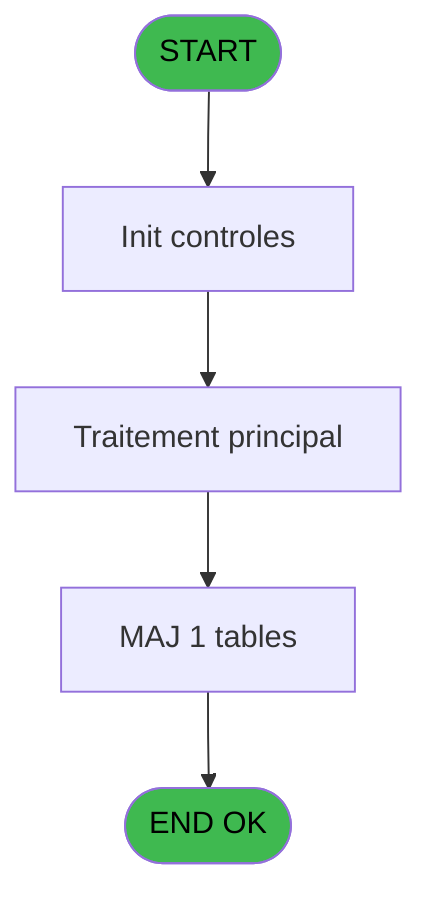
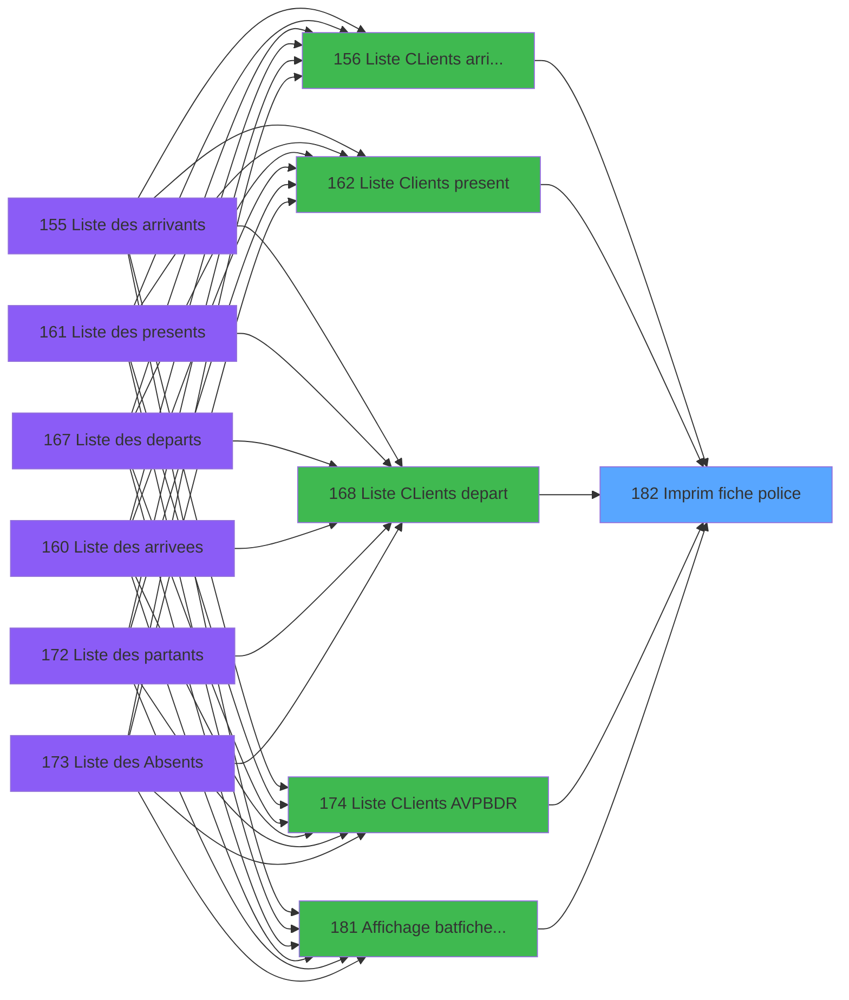

# PBP IDE 182 - Imprim  fiche police

> **Analyse**: Phases 1-4 2026-02-03 15:40 -> 15:40 (11s) | Assemblage 15:40
> **Pipeline**: V7.2 Enrichi
> **Structure**: 4 onglets (Resume | Ecrans | Donnees | Connexions)

<!-- TAB:Resume -->

## 1. FICHE D'IDENTITE

| Attribut | Valeur |
|----------|--------|
| Projet | PBP |
| IDE Position | 182 |
| Nom Programme | Imprim  fiche police |
| Fichier source | `Prg_182.xml` |
| Dossier IDE | Liste |
| Taches | 2 (0 ecrans visibles) |
| Tables modifiees | 1 |
| Programmes appeles | 0 |

## 2. DESCRIPTION FONCTIONNELLE

**Imprim  fiche police** assure la gestion complete de ce processus, accessible depuis [  Liste CLients arrivant (IDE 156)](PBP-IDE-156.md), [  Liste Clients present (IDE 162)](PBP-IDE-162.md), [  Liste CLients depart (IDE 168)](PBP-IDE-168.md), [Liste CLients AVPBDR (IDE 174)](PBP-IDE-174.md), [  Liste present personnel plan (IDE 227)](PBP-IDE-227.md), [  Liste personnels AVPBDR (IDE 234)](PBP-IDE-234.md), [  Affichage bat/fiche police (IDE 181)](PBP-IDE-181.md).

Le flux de traitement s'organise en **2 blocs fonctionnels** :

- **Calcul** (1 tache) : calculs de montants, stocks ou compteurs
- **Traitement** (1 tache) : traitements metier divers

**Donnees modifiees** : 1 tables en ecriture (tempo_mecano_dossier_grou).

**Logique metier** : 1 regles identifiees couvrant conditions metier.

Detail : phases du traitement

#### Phase 1 : Traitement (1 tache)

- **182** - Veuillez patientez... **[[ECRAN]](#ecran-t1)**

#### Phase 2 : Calcul (1 tache)

- **182.1** - Calcul pied

#### Tables impactees

| Table | Operations | Role metier |
|-------|-----------|-------------|
| tempo_mecano_dossier_grou | **W** (1 usages) | Table temporaire ecran |

## 3. BLOCS FONCTIONNELS

### 3.1 Traitement (1 tache)

Traitements internes.

---

#### 182 - Veuillez patientez... [[ECRAN]](#ecran-t1)

**Role** : Traitement : Veuillez patientez....
**Ecran** : 424 x 56 DLU (MDI) | [Voir mockup](#ecran-t1)

### 3.2 Calcul (1 tache)

Calculs metier : montants, stocks, compteurs.

---

#### 182.1 - Calcul pied

**Role** : Calcul : Calcul pied.
**Variables liees** : A (>DateCalcul), B (>HeureCalcul), Q (w0_NomPied01), R (w0_NbPied01), S (w0_NomPied02)

## 5. REGLES METIER

1 regles identifiees:

### Autres (1 regles)

#### [RM-001] Si >CodeListe [C]='A' alors MlsTrans ('arrivants') sinon IF (>CodeListe [C]='V',MlsTrans ('arrivees'),IF (>CodeListe [C]='P',MlsTrans ('presents'),IF (>CodeListe [C]='D',MlsTrans ('departs'),IF (>CodeListe [C]='R',MlsTrans ('partants'),MlsTrans ('absents'))))))

| Element | Detail |
|---------|--------|
| **Condition** | `>CodeListe [C]='A'` |
| **Si vrai** | MlsTrans ('arrivants') |
| **Si faux** | IF (>CodeListe [C]='V',MlsTrans ('arrivees'),IF (>CodeListe [C]='P',MlsTrans ('presents'),IF (>CodeListe [C]='D',MlsTrans ('departs'),IF (>CodeListe [C]='R',MlsTrans ('partants'),MlsTrans ('absents')))))) |
| **Variables** | C (>CodeListe) |
| **Expression source** | Expression 5 : `IF (>CodeListe [C]='A',MlsTrans ('arrivants'),IF (>CodeListe` |
| **Exemple** | Si >CodeListe [C]='A' → MlsTrans ('arrivants') |

## 6. CONTEXTE

- **Appele par**: [  Liste CLients arrivant (IDE 156)](PBP-IDE-156.md), [  Liste Clients present (IDE 162)](PBP-IDE-162.md), [  Liste CLients depart (IDE 168)](PBP-IDE-168.md), [Liste CLients AVPBDR (IDE 174)](PBP-IDE-174.md), [  Liste present personnel plan (IDE 227)](PBP-IDE-227.md), [  Liste personnels AVPBDR (IDE 234)](PBP-IDE-234.md), [  Affichage bat/fiche police (IDE 181)](PBP-IDE-181.md)
- **Appelle**: 0 programmes | **Tables**: 2 (W:1 R:1 L:0) | **Taches**: 2 | **Expressions**: 31

<!-- TAB:Ecrans -->

## 8. ECRANS

*(Programme sans ecran visible)*

## 9. NAVIGATION

### 9.3 Structure hierarchique (2 taches)

| Position | Tache | Type | Dimensions | Bloc |
|----------|-------|------|------------|------|
| **182.1** | [**Veuillez patientez...** (182)](#t1) [mockup](#ecran-t1) | MDI | 424x56 | Traitement |
| **182.2** | [**Calcul pied** (182.1)](#t2) | MDI | - | Calcul |

### 9.4 Algorigramme

> **Legende**: Vert = START/END OK | Rouge = END KO | Bleu = Decisions
> *Algorigramme auto-genere. Utiliser `/algorigramme` pour une synthese metier detaillee.*

<!-- TAB:Donnees -->

## 10. TABLES

### Tables utilisees (2)

| ID | Nom | Description | Type | R | W | L | Usages |
|----|-----|-------------|------|---|---|---|--------|
| 598 | tempo_ecr_previsions | Table temporaire ecran | TMP | R |   |   | 1 |
| 609 | tempo_mecano_dossier_grou | Table temporaire ecran | TMP |   | **W** |   | 1 |

### Colonnes par table (2 / 2 tables avec colonnes identifiees)

Table 598 - tempo_ecr_previsions (R) - 1 usages

| Lettre | Variable | Acces | Type |
|--------|----------|-------|------|
| A | w1_Rupture | R | Numeric |
| B | w1_TotalSelect | R | Numeric |

Table 609 - tempo_mecano_dossier_grou (**W**) - 1 usages

| Lettre | Variable | Acces | Type |
|--------|----------|-------|------|
| A | >DateCalcul | W | Date |
| B | >HeureCalcul | W | Alpha |
| C | >CodeListe | W | Alpha |
| D | >TopListe | W | Alpha |
| E | >HeurePresence | W | Alpha |
| F | >NomLogement | W | Alpha |
| G | >Total | W | Numeric |
| H | >NbSelect | W | Numeric |
| I | >Edition Excel | W | Logical |
| J | >Nom Fichier Excel | W | Alpha |
| K | >Libellé Sélection du Solde | W | Unicode |
| L | >Soldé,Non_soldé,Tous | W | Unicode |
| M | w0_f(CodeListe) | W | Alpha |
| N | w0_g(TopListe) | W | Alpha |
| O | w0_LibelleEdition | W | Alpha |
| P | W0_Libelle Logement | W | Alpha |
| Q | w0_NomPied01 | W | Alpha |
| R | w0_NbPied01 | W | Numeric |
| S | w0_NomPied02 | W | Alpha |
| T | w0_NbPied02 | W | Numeric |
| U | w0_NomPied03 | W | Alpha |
| V | w0_NbPied03 | W | Numeric |
| W | w0_NomPied04 | W | Alpha |
| X | w0_NbPied04 | W | Numeric |
| Y | w0_NomPied05 | W | Alpha |
| Z | w0_NbPied05 | W | Numeric |
| BA | w0_TotalSelect | W | Numeric |
| BB | w0_Ligne csv | W | Alpha |
| BC | w0_Separateur; | W | Alpha |

## 11. VARIABLES

### 11.1 Autres (29)

Variables diverses.

| Lettre | Nom | Type | Usage dans |
|--------|-----|------|-----------|
| A | >DateCalcul | Date | 1x refs |
| B | >HeureCalcul | Alpha | - |
| C | >CodeListe | Alpha | 3x refs |
| D | >TopListe | Alpha | 6x refs |
| E | >HeurePresence | Alpha | 2x refs |
| F | >NomLogement | Alpha | - |
| G | >Total | Numeric | - |
| H | >NbSelect | Numeric | 1x refs |
| I | >Edition Excel | Logical | 2x refs |
| J | >Nom Fichier Excel | Alpha | 1x refs |
| K | >Libellé Sélection du Solde | Unicode | - |
| L | >Soldé,Non_soldé,Tous | Unicode | - |
| M | w0_f(CodeListe) | Alpha | - |
| N | w0_g(TopListe) | Alpha | - |
| O | w0_LibelleEdition | Alpha | 4x refs |
| P | W0_Libelle Logement | Alpha | 4x refs |
| Q | w0_NomPied01 | Alpha | 2x refs |
| R | w0_NbPied01 | Numeric | 3x refs |
| S | w0_NomPied02 | Alpha | 2x refs |
| T | w0_NbPied02 | Numeric | 2x refs |
| U | w0_NomPied03 | Alpha | 3x refs |
| V | w0_NbPied03 | Numeric | 2x refs |
| W | w0_NomPied04 | Alpha | 2x refs |
| X | w0_NbPied04 | Numeric | 2x refs |
| Y | w0_NomPied05 | Alpha | - |
| Z | w0_NbPied05 | Numeric | - |
| BA | w0_TotalSelect | Numeric | - |
| BB | w0_Ligne csv | Alpha | - |
| BC | w0_Separateur; | Alpha | - |

Toutes les 29 variables (liste complete)

| Cat | Lettre | Nom Variable | Type |
|-----|--------|--------------|------|
| Autre | **A** | >DateCalcul | Date |
| Autre | **B** | >HeureCalcul | Alpha |
| Autre | **C** | >CodeListe | Alpha |
| Autre | **D** | >TopListe | Alpha |
| Autre | **E** | >HeurePresence | Alpha |
| Autre | **F** | >NomLogement | Alpha |
| Autre | **G** | >Total | Numeric |
| Autre | **H** | >NbSelect | Numeric |
| Autre | **I** | >Edition Excel | Logical |
| Autre | **J** | >Nom Fichier Excel | Alpha |
| Autre | **K** | >Libellé Sélection du Solde | Unicode |
| Autre | **L** | >Soldé,Non_soldé,Tous | Unicode |
| Autre | **M** | w0_f(CodeListe) | Alpha |
| Autre | **N** | w0_g(TopListe) | Alpha |
| Autre | **O** | w0_LibelleEdition | Alpha |
| Autre | **P** | W0_Libelle Logement | Alpha |
| Autre | **Q** | w0_NomPied01 | Alpha |
| Autre | **R** | w0_NbPied01 | Numeric |
| Autre | **S** | w0_NomPied02 | Alpha |
| Autre | **T** | w0_NbPied02 | Numeric |
| Autre | **U** | w0_NomPied03 | Alpha |
| Autre | **V** | w0_NbPied03 | Numeric |
| Autre | **W** | w0_NomPied04 | Alpha |
| Autre | **X** | w0_NbPied04 | Numeric |
| Autre | **Y** | w0_NomPied05 | Alpha |
| Autre | **Z** | w0_NbPied05 | Numeric |
| Autre | **BA** | w0_TotalSelect | Numeric |
| Autre | **BB** | w0_Ligne csv | Alpha |
| Autre | **BC** | w0_Separateur; | Alpha |

## 12. EXPRESSIONS

**31 / 31 expressions decodees (100%)**

### 12.1 Repartition par type

| Type | Expressions | Regles |
|------|-------------|--------|
| CONCATENATION | 8 | 0 |
| CONDITION | 11 | 5 |
| CONSTANTE | 1 | 0 |
| FORMAT | 3 | 0 |
| OTHER | 4 | 0 |
| REFERENCE_VG | 2 | 0 |
| NEGATION | 1 | 0 |
| STRING | 1 | 0 |

### 12.2 Expressions cles par type

#### CONCATENATION (8 expressions)

| Type | IDE | Expression | Regle |
|------|-----|------------|-------|
| CONCATENATION | 23 | `'TC KimlikNo'&[BZ]&'GecerliBelge(Yabancilar Uyruklular Için)'&[BZ]&'Adi'&[BZ]&'Soyadi'&[BZ]&'Cinsiyet'&[BZ]&'Ana Adi'&[BZ]&'Baba Adi'&[BZ]&'Dogum Yeri'&[BZ]&'Dogum Tarihi'&[BZ]&'Arac Plaka'&[BZ]&'VerilenOda'&[BZ]&'Uyrugu'&[BZ]&'Giris tarihi'&[BZ]&'Cikis tarihi'` | - |
| CONCATENATION | 22 | `'Nom'&[BZ]&'Prenom'&[BZ]&'Sexe'&[BZ]&'Date de Naissance'&[BZ]&'Pays'&[BZ]&'Profession'&[BZ]&'Passeport'&[BZ]&'Date de delivrance'&[BZ]&'Ville'` | - |
| CONCATENATION | 8 | `Trim (>Edition Excel [I])&' '&IF (>CodeListe [C]='P',>HeurePresence [E]&' h','')` | - |
| CONCATENATION | 24 | `'N°ID turc'&[BZ]&'N Document'&[BZ]&'Nom'&[BZ]&'Prénom'&[BZ]&'Sexe'&[BZ]&'Prenom de la mere'&[BZ]&'Prenom du pere'&[BZ]&'Lieu de Naissance'&[BZ]&'Date Naissance'&[BZ]&'N°Immatriculation'&[BZ]&'N° Chambre'&[BZ]&'Nationalité'&[BZ]&'Date Entrée'&[BZ]&'Date de Sortie'` | - |
| CONCATENATION | 7 | `MlsTrans ('Liste des')&' '&Trim (>Edition Excel [I])&' '&Trim (>Nom Fichier Excel [J])&Trim (>Libellé Sélection du ... [K])&' '&MlsTrans ('le')&' '&DStr (>DateCalcul [A],'DD/MM/YYYY')&IF (>CodeListe [C]='P',>HeurePresence [E]&'h','')` | - |
| ... | | *+3 autres* | |

#### CONDITION (11 expressions)

| Type | IDE | Expression | Regle |
|------|-----|------------|-------|
| CONDITION | 5 | `IF (>CodeListe [C]='A',MlsTrans ('arrivants'),IF (>CodeListe [C]='V',MlsTrans ('arrivees'),IF (>CodeListe [C]='P',MlsTrans ('presents'),IF (>CodeListe [C]='D',MlsTrans ('departs'),IF (>CodeListe [C]='R',MlsTrans ('partants'),MlsTrans ('absents'))))))` | [RM-001](#rm-RM-001) |
| CONDITION | 17 | `>NbSelect [H]>0` | - |
| CONDITION | 16 | `>TopListe [D]='PT' AND Translate('%DEV%')='O'` | - |
| CONDITION | 19 | `>Libellé Sélection du ... [K]` | - |
| CONDITION | 31 | `[CL]='T'` | - |
| ... | | *+6 autres* | |

#### CONSTANTE (1 expressions)

| Type | IDE | Expression | Regle |
|------|-----|------------|-------|
| CONSTANTE | 10 | `''` | - |

#### FORMAT (3 expressions)

| Type | IDE | Expression | Regle |
|------|-----|------------|-------|
| FORMAT | 27 | `Trim([CD])&[BZ]&Trim(w0_NomPied03 [U])&[BZ]&Trim(w0_LibelleEdition [O]) & [BZ] & Trim(W0_Libelle Logement [P]) & [BZ] & Trim([CF]) & [BZ] & '' & [BZ] & '' & [BZ] & Trim([CC]) & [BZ] & DStr(w0_NbPied01 [R], 'DD.MM.YYYY') & [BZ] & Trim([CE]) & [BZ] & Trim(w0_NbPied04 [X]) & [BZ] & Str([CH], '3') & [BZ] & DStr([CG], 'DD.MM.YYYY')& [BZ] & ''` | - |
| FORMAT | 26 | `Trim(w0_LibelleEdition [O])&[BZ]&Trim(W0_Libelle Logement [P])&[BZ]&Trim(w0_NomPied01 [Q])&[BZ]&DStr(w0_NbPied01 [R],'DD/MM/YYYY')&[BZ]&Trim(w0_NomPied02 [S])&[BZ]&Trim(w0_NbPied02 [T])&[BZ]&Trim(w0_NomPied03 [U])&[BZ]&DStr(w0_NbPied03 [V],'DD/MM/YYYY')&[BZ]&Trim(w0_NomPied04 [W])` | - |
| FORMAT | 25 | `Trim(w0_NbPied04 [X])&[BZ]&Trim(w0_LibelleEdition [O])&[BZ]&Trim(W0_Libelle Logement [P])&[BZ]&Trim(w0_NomPied01 [Q])&[BZ]&Trim(w0_NbPied02 [T])&[BZ]&DStr(w0_NbPied01 [R],'DD/MM/YYYY')&[BZ]&Trim(w0_NomPied02 [S])&[BZ]&Trim(w0_NomPied03 [U])&[BZ]&DStr(w0_NbPied03 [V],'DD/MM/YYYY')&[BZ]&Trim(w0_NomPied04 [W])` | - |

#### OTHER (4 expressions)

| Type | IDE | Expression | Regle |
|------|-----|------------|-------|
| OTHER | 4 | `Counter (0)` | - |
| OTHER | 29 | `StrBuild('@1@ @2@', w0_LibelleEdition [O], W0_Libelle Logement [P])` | - |
| OTHER | 1 | `GetParam ('SOCIETE')` | - |
| OTHER | 2 | `'Village '&GetParam ('VILLAGE')` | - |

#### REFERENCE_VG (2 expressions)

| Type | IDE | Expression | Regle |
|------|-----|------------|-------|
| REFERENCE_VG | 28 | `VG36` | - |
| REFERENCE_VG | 3 | `VG1` | - |

#### NEGATION (1 expressions)

| Type | IDE | Expression | Regle |
|------|-----|------------|-------|
| NEGATION | 18 | `NOT [BW]` | - |

#### STRING (1 expressions)

| Type | IDE | Expression | Regle |
|------|-----|------------|-------|
| STRING | 20 | `Trim([BX])` | - |

### 12.3 Toutes les expressions (31)

Voir les 31 expressions

#### CONCATENATION (8)

| IDE | Expression Decodee |
|-----|-------------------|
| 11 | `'- '&Str (Page (0,1),'3P0Z0')&' -'` |
| 7 | `MlsTrans ('Liste des')&' '&Trim (>Edition Excel [I])&' '&Trim (>Nom Fichier Excel [J])&Trim (>Libellé Sélection du ... [K])&' '&MlsTrans ('le')&' '&DStr (>DateCalcul [A],'DD/MM/YYYY')&IF (>CodeListe [C]='P',>HeurePresence [E]&'h','')` |
| 9 | `MlsTrans ('Edition du')&' '&DStr (Date (),'DD/MM/YYYY')&' '&MlsTrans ('à')&' '&TStr (Time (),'HH:MM:SS')` |
| 21 | `'Cabine'&[BZ]&'Nom'&[BZ]&'Prenom'&[BZ]&'Sexe'&[BZ]&'Profession'&[BZ]&'Date de Naissance'&[BZ]&'Pays'&[BZ]&'Passeport'&[BZ]&'Date de delivrance'&[BZ]&'Ville'` |
| 22 | `'Nom'&[BZ]&'Prenom'&[BZ]&'Sexe'&[BZ]&'Date de Naissance'&[BZ]&'Pays'&[BZ]&'Profession'&[BZ]&'Passeport'&[BZ]&'Date de delivrance'&[BZ]&'Ville'` |
| 23 | `'TC KimlikNo'&[BZ]&'GecerliBelge(Yabancilar Uyruklular Için)'&[BZ]&'Adi'&[BZ]&'Soyadi'&[BZ]&'Cinsiyet'&[BZ]&'Ana Adi'&[BZ]&'Baba Adi'&[BZ]&'Dogum Yeri'&[BZ]&'Dogum Tarihi'&[BZ]&'Arac Plaka'&[BZ]&'VerilenOda'&[BZ]&'Uyrugu'&[BZ]&'Giris tarihi'&[BZ]&'Cikis tarihi'` |
| 24 | `'N°ID turc'&[BZ]&'N Document'&[BZ]&'Nom'&[BZ]&'Prénom'&[BZ]&'Sexe'&[BZ]&'Prenom de la mere'&[BZ]&'Prenom du pere'&[BZ]&'Lieu de Naissance'&[BZ]&'Date Naissance'&[BZ]&'N°Immatriculation'&[BZ]&'N° Chambre'&[BZ]&'Nationalité'&[BZ]&'Date Entrée'&[BZ]&'Date de Sortie'` |
| 8 | `Trim (>Edition Excel [I])&' '&IF (>CodeListe [C]='P',>HeurePresence [E]&' h','')` |

#### CONDITION (11)

| IDE | Expression Decodee |
|-----|-------------------|
| 5 | `IF (>CodeListe [C]='A',MlsTrans ('arrivants'),IF (>CodeListe [C]='V',MlsTrans ('arrivees'),IF (>CodeListe [C]='P',MlsTrans ('presents'),IF (>CodeListe [C]='D',MlsTrans ('departs'),IF (>CodeListe [C]='R',MlsTrans ('partants'),MlsTrans ('absents'))))))` |
| 6 | `CASE(>TopListe [D],'PO',MlsTrans ('police'),'BA', MlsTrans ('bateau'), MlsTrans('police (turquie)'))` |
| 12 | `INIGet ('[MAGIC_LOGICAL_NAMES]preview')='O'` |
| 13 | `>TopListe [D]='BA'` |
| 14 | `>TopListe [D]='PO'` |
| 15 | `>TopListe [D]='PT'` |
| 16 | `>TopListe [D]='PT' AND Translate('%DEV%')='O'` |
| 17 | `>NbSelect [H]>0` |
| 19 | `>Libellé Sélection du ... [K]` |
| 30 | `>TopListe [D]<>'PT'` |
| 31 | `[CL]='T'` |

#### CONSTANTE (1)

| IDE | Expression Decodee |
|-----|-------------------|
| 10 | `''` |

#### FORMAT (3)

| IDE | Expression Decodee |
|-----|-------------------|
| 25 | `Trim(w0_NbPied04 [X])&[BZ]&Trim(w0_LibelleEdition [O])&[BZ]&Trim(W0_Libelle Logement [P])&[BZ]&Trim(w0_NomPied01 [Q])&[BZ]&Trim(w0_NbPied02 [T])&[BZ]&DStr(w0_NbPied01 [R],'DD/MM/YYYY')&[BZ]&Trim(w0_NomPied02 [S])&[BZ]&Trim(w0_NomPied03 [U])&[BZ]&DStr(w0_NbPied03 [V],'DD/MM/YYYY')&[BZ]&Trim(w0_NomPied04 [W])` |
| 26 | `Trim(w0_LibelleEdition [O])&[BZ]&Trim(W0_Libelle Logement [P])&[BZ]&Trim(w0_NomPied01 [Q])&[BZ]&DStr(w0_NbPied01 [R],'DD/MM/YYYY')&[BZ]&Trim(w0_NomPied02 [S])&[BZ]&Trim(w0_NbPied02 [T])&[BZ]&Trim(w0_NomPied03 [U])&[BZ]&DStr(w0_NbPied03 [V],'DD/MM/YYYY')&[BZ]&Trim(w0_NomPied04 [W])` |
| 27 | `Trim([CD])&[BZ]&Trim(w0_NomPied03 [U])&[BZ]&Trim(w0_LibelleEdition [O]) & [BZ] & Trim(W0_Libelle Logement [P]) & [BZ] & Trim([CF]) & [BZ] & '' & [BZ] & '' & [BZ] & Trim([CC]) & [BZ] & DStr(w0_NbPied01 [R], 'DD.MM.YYYY') & [BZ] & Trim([CE]) & [BZ] & Trim(w0_NbPied04 [X]) & [BZ] & Str([CH], '3') & [BZ] & DStr([CG], 'DD.MM.YYYY')& [BZ] & ''` |

#### OTHER (4)

| IDE | Expression Decodee |
|-----|-------------------|
| 1 | `GetParam ('SOCIETE')` |
| 2 | `'Village '&GetParam ('VILLAGE')` |
| 4 | `Counter (0)` |
| 29 | `StrBuild('@1@ @2@', w0_LibelleEdition [O], W0_Libelle Logement [P])` |

#### REFERENCE_VG (2)

| IDE | Expression Decodee |
|-----|-------------------|
| 3 | `VG1` |
| 28 | `VG36` |

#### NEGATION (1)

| IDE | Expression Decodee |
|-----|-------------------|
| 18 | `NOT [BW]` |

#### STRING (1)

| IDE | Expression Decodee |
|-----|-------------------|
| 20 | `Trim([BX])` |

<!-- TAB:Connexions -->

## 13. GRAPHE D'APPELS

### 13.1 Chaine depuis Main (Callers)

Main -> ... -> [  Liste CLients arrivant (IDE 156)](PBP-IDE-156.md) -> **Imprim  fiche police (IDE 182)**

Main -> ... -> [  Liste Clients present (IDE 162)](PBP-IDE-162.md) -> **Imprim  fiche police (IDE 182)**

Main -> ... -> [  Liste CLients depart (IDE 168)](PBP-IDE-168.md) -> **Imprim  fiche police (IDE 182)**

Main -> ... -> [Liste CLients AVPBDR (IDE 174)](PBP-IDE-174.md) -> **Imprim  fiche police (IDE 182)**

Main -> ... -> [  Liste present personnel plan (IDE 227)](PBP-IDE-227.md) -> **Imprim  fiche police (IDE 182)**

Main -> ... -> [  Liste personnels AVPBDR (IDE 234)](PBP-IDE-234.md) -> **Imprim  fiche police (IDE 182)**

Main -> ... -> [  Affichage bat/fiche police (IDE 181)](PBP-IDE-181.md) -> **Imprim  fiche police (IDE 182)**

### 13.2 Callers

| IDE | Nom Programme | Nb Appels |
|-----|---------------|-----------|
| [156](PBP-IDE-156.md) |   Liste CLients arrivant | 2 |
| [162](PBP-IDE-162.md) |   Liste Clients present | 2 |
| [168](PBP-IDE-168.md) |   Liste CLients depart | 2 |
| [174](PBP-IDE-174.md) | Liste CLients AVPBDR | 2 |
| [227](PBP-IDE-227.md) |   Liste present personnel plan | 2 |
| [234](PBP-IDE-234.md) |   Liste personnels AVPBDR | 2 |
| [181](PBP-IDE-181.md) |   Affichage bat/fiche police | 1 |

### 13.3 Callees (programmes appeles)

### 13.4 Detail Callees avec contexte

| IDE | Nom Programme | Appels | Contexte |
|-----|---------------|--------|----------|
| - | (aucun) | - | - |

## 14. RECOMMANDATIONS MIGRATION

### 14.1 Profil du programme

| Metrique | Valeur | Impact migration |
|----------|--------|-----------------|
| Lignes de logique | 134 | Programme compact |
| Expressions | 31 | Peu de logique |
| Tables WRITE | 1 | Impact faible |
| Sous-programmes | 0 | Peu de dependances |
| Ecrans visibles | 0 | Ecran unique ou traitement batch |
| Code desactive | 0% (0 / 134) | Code sain |
| Regles metier | 1 | Quelques regles a preserver |

### 14.2 Plan de migration par bloc

#### Traitement (1 tache: 1 ecran, 0 traitement)

- **Strategie** : 1 composant(s) UI (Razor/React) avec formulaires et validation.
- Decomposer les taches en services unitaires testables.

#### Calcul (1 tache: 0 ecran, 1 traitement)

- **Strategie** : Services de calcul purs (Domain Services).
- Migrer la logique de calcul (stock, compteurs, montants)

### 14.3 Dependances critiques

| Dependance | Type | Appels | Impact |
|------------|------|--------|--------|
| tempo_mecano_dossier_grou | Table WRITE (Temp) | 1x | Schema + repository |

---
*Spec DETAILED generee par Pipeline V7.2 - 2026-02-03 15:40*
