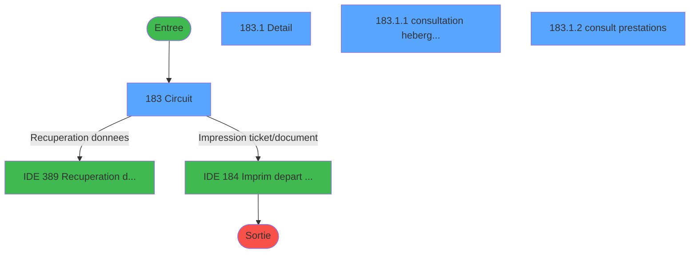
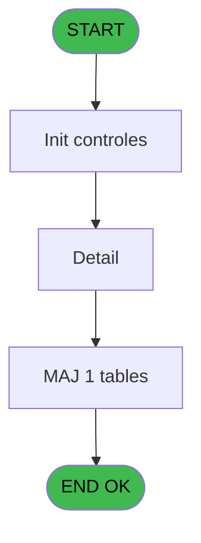
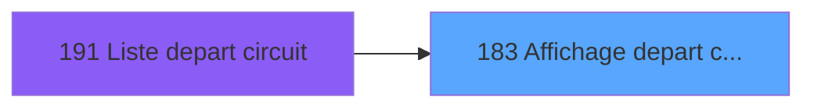
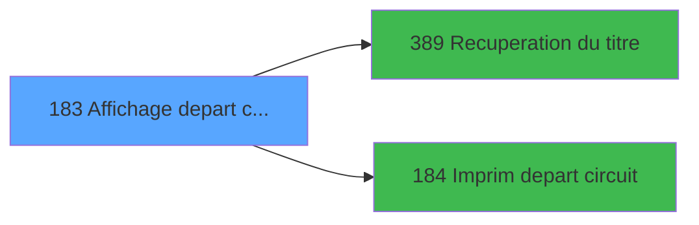

# PBP IDE 183 - Affichage depart circuit

> **Analyse**: Phases 1-4 2026-02-03 15:40 -> 15:41 (12s) | Assemblage 15:41
> **Pipeline**: V7.2 Enrichi
> **Structure**: 4 onglets (Resume | Ecrans | Donnees | Connexions)

<!-- TAB:Resume -->

## 1. FICHE D'IDENTITE

| Attribut | Valeur |
|----------|--------|
| Projet | PBP |
| IDE Position | 183 |
| Nom Programme | Affichage depart circuit |
| Fichier source | `Prg_183.xml` |
| Dossier IDE | Liste |
| Taches | 4 (4 ecrans visibles) |
| Tables modifiees | 1 |
| Programmes appeles | 2 |

## 2. DESCRIPTION FONCTIONNELLE

**Affichage depart circuit** assure la gestion complete de ce processus, accessible depuis [Liste depart circuit (IDE 191)](PBP-IDE-191.md).

Le flux de traitement s'organise en **1 blocs fonctionnels** :

- **Traitement** (4 taches) : traitements metier divers

**Donnees modifiees** : 1 tables en ecriture (tempo_nombres).

**Logique metier** : 2 regles identifiees couvrant conditions metier.

Detail : phases du traitement

#### Phase 1 : Traitement (4 taches)

- **183** - Circuit **[[ECRAN]](#ecran-t1)**
- **183.1** - Detail **[[ECRAN]](#ecran-t2)**
- **183.1.1** - consultation hebergement **[[ECRAN]](#ecran-t3)**
- **183.1.2** - consult prestations **[[ECRAN]](#ecran-t4)**

Delegue a : [Recuperation du titre (IDE 389)](PBP-IDE-389.md)

#### Tables impactees

| Table | Operations | Role metier |
|-------|-----------|-------------|
| tempo_nombres | **W** (1 usages) | Table temporaire ecran |

## 3. BLOCS FONCTIONNELS

### 3.1 Traitement (4 taches)

Traitements internes.

---

#### 183 - Circuit [[ECRAN]](#ecran-t1)

**Role** : Traitement : Circuit.
**Ecran** : 1246 x 226 DLU (MDI) | [Voir mockup](#ecran-t1)

3 sous-taches directes

| Tache | Nom | Bloc |
|-------|-----|------|
| [183.1](#t2) | Detail **[[ECRAN]](#ecran-t2)** | Traitement |
| [183.1.1](#t3) | consultation hebergement **[[ECRAN]](#ecran-t3)** | Traitement |
| [183.1.2](#t4) | consult prestations **[[ECRAN]](#ecran-t4)** | Traitement |

**Variables liees** : C (>Circuit)
**Delegue a** : [Recuperation du titre (IDE 389)](PBP-IDE-389.md), [  Imprim depart circuit (IDE 184)](PBP-IDE-184.md)

---

#### 183.1 - Detail [[ECRAN]](#ecran-t2)

**Role** : Traitement : Detail.
**Ecran** : 773 x 263 DLU (MDI) | [Voir mockup](#ecran-t2)
**Delegue a** : [Recuperation du titre (IDE 389)](PBP-IDE-389.md)

---

#### 183.1.1 - consultation hebergement [[ECRAN]](#ecran-t3)

**Role** : Consultation/chargement : consultation hebergement.
**Ecran** : 770 x 78 DLU (Modal) | [Voir mockup](#ecran-t3)
**Delegue a** : [Recuperation du titre (IDE 389)](PBP-IDE-389.md)

---

#### 183.1.2 - consult prestations [[ECRAN]](#ecran-t4)

**Role** : Traitement : consult prestations.
**Ecran** : 759 x 38 DLU (Modal) | [Voir mockup](#ecran-t4)
**Delegue a** : [Recuperation du titre (IDE 389)](PBP-IDE-389.md)

## 5. REGLES METIER

2 regles identifiees:

### Autres (2 regles)

#### [RM-001] Traitement si VG42,IF ([CE] est renseigne

| Element | Detail |
|---------|--------|
| **Condition** | `VG42` |
| **Si vrai** | IF ([CE]<>'' |
| **Si faux** | [CH],MlsTrans ('Millesia')),IF ([AJ]<>'',[AM],MlsTrans ('Millesia'))) |
| **Expression source** | Expression 10 : `IF(VG42,IF ([CE]<>'',[CH],MlsTrans ('Millesia')),IF ([AJ]<>'` |
| **Exemple** | Si VG42 → IF ([CE]<>'' |

#### [RM-002] Si VG88 AND [CJ] alors TStr([CI] sinon 'HHhMMZ'),[U])

| Element | Detail |
|---------|--------|
| **Condition** | `VG88 AND [CJ]` |
| **Si vrai** | TStr([CI] |
| **Si faux** | 'HHhMMZ'),[U]) |
| **Expression source** | Expression 23 : `IF(VG88 AND [CJ],TStr([CI],'HHhMMZ'),[U])` |
| **Exemple** | Si VG88 AND [CJ] → TStr([CI]. Sinon → 'HHhMMZ'),[U]) |

## 6. CONTEXTE

- **Appele par**: [Liste depart circuit (IDE 191)](PBP-IDE-191.md)
- **Appelle**: 2 programmes | **Tables**: 8 (W:1 R:3 L:4) | **Taches**: 4 | **Expressions**: 24

<!-- TAB:Ecrans -->

## 8. ECRANS

### 8.1 Forms visibles (4 / 4)

| # | Position | Tache | Nom | Type | Largeur | Hauteur | Bloc |
|---|----------|-------|-----|------|---------|---------|------|
| 1 | 183 | 183 | Circuit | MDI | 1246 | 226 | Traitement |
| 2 | 183.1 | 183.1 | Detail | MDI | 773 | 263 | Traitement |
| 3 | 183.1.1 | 183.1.1 | consultation hebergement | Modal | 770 | 78 | Traitement |
| 4 | 183.1.2 | 183.1.2 | consult prestations | Modal | 759 | 38 | Traitement |

### 8.2 Mockups Ecrans

---

#### 183 - Circuit
**Tache** : [183](#t1) | **Type** : MDI | **Dimensions** : 1246 x 226 DLU
**Bloc** : Traitement | **Titre IDE** : Circuit

<!-- FORM-DATA:
{
    "width":  1246,
    "vFactor":  8,
    "type":  "MDI",
    "hFactor":  8,
    "controls":  [
                     {
                         "x":  0,
                         "type":  "label",
                         "var":  "",
                         "y":  0,
                         "w":  1242,
                         "fmt":  "",
                         "name":  "",
                         "h":  19,
                         "color":  "",
                         "text":  "",
                         "parent":  null
                     },
                     {
                         "x":  1062,
                         "type":  "label",
                         "var":  "",
                         "y":  26,
                         "w":  172,
                         "fmt":  "",
                         "name":  "",
                         "h":  168,
                         "color":  "",
                         "text":  "",
                         "parent":  null
                     },
                     {
                         "x":  8,
                         "type":  "table",
                         "var":  "",
                         "name":  "",
                         "titleH":  12,
                         "color":  "110",
                         "w":  1050,
                         "y":  29,
                         "fmt":  "",
                         "parent":  null,
                         "text":  "",
                         "rowH":  14,
                         "h":  110,
                         "cols":  [
                                      {
                                          "title":  "Nom",
                                          "layer":  1,
                                          "w":  188
                                      },
                                      {
                                          "title":  "Prénom",
                                          "layer":  2,
                                          "w":  130
                                      },
                                      {
                                          "title":  "Sexe",
                                          "layer":  3,
                                          "w":  55
                                      },
                                      {
                                          "title":  "Qualité",
                                          "layer":  4,
                                          "w":  116
                                      },
                                      {
                                          "title":  "Age",
                                          "layer":  5,
                                          "w":  52
                                      },
                                      {
                                          "title":  "Logement",
                                          "layer":  6,
                                          "w":  183
                                      },
                                      {
                                          "title":  "Pays",
                                          "layer":  7,
                                          "w":  67
                                      },
                                      {
                                          "title":  "Numéro Adhérent",
                                          "layer":  8,
                                          "w":  227
                                      }
                                  ],
                         "rows":  8
                     },
                     {
                         "x":  14,
                         "type":  "label",
                         "var":  "",
                         "y":  141,
                         "w":  1039,
                         "fmt":  "",
                         "name":  "",
                         "h":  53,
                         "color":  "",
                         "text":  "",
                         "parent":  null
                     },
                     {
                         "x":  28,
                         "type":  "label",
                         "var":  "",
                         "y":  147,
                         "w":  243,
                         "fmt":  "",
                         "name":  "",
                         "h":  42,
                         "color":  "195",
                         "text":  "Arrivée",
                         "parent":  null
                     },
                     {
                         "x":  284,
                         "type":  "label",
                         "var":  "",
                         "y":  147,
                         "w":  245,
                         "fmt":  "",
                         "name":  "",
                         "h":  42,
                         "color":  "195",
                         "text":  "Départ",
                         "parent":  null
                     },
                     {
                         "x":  544,
                         "type":  "label",
                         "var":  "",
                         "y":  147,
                         "w":  495,
                         "fmt":  "",
                         "name":  "",
                         "h":  42,
                         "color":  "",
                         "text":  "",
                         "parent":  null
                     },
                     {
                         "x":  46,
                         "type":  "label",
                         "var":  "",
                         "y":  157,
                         "w":  45,
                         "fmt":  "",
                         "name":  "",
                         "h":  8,
                         "color":  "",
                         "text":  "Date",
                         "parent":  26
                     },
                     {
                         "x":  167,
                         "type":  "label",
                         "var":  "",
                         "y":  157,
                         "w":  54,
                         "fmt":  "",
                         "name":  "",
                         "h":  8,
                         "color":  "",
                         "text":  "Heure",
                         "parent":  26
                     },
                     {
                         "x":  302,
                         "type":  "label",
                         "var":  "",
                         "y":  157,
                         "w":  45,
                         "fmt":  "",
                         "name":  "",
                         "h":  8,
                         "color":  "",
                         "text":  "Date",
                         "parent":  27
                     },
                     {
                         "x":  425,
                         "type":  "label",
                         "var":  "",
                         "y":  157,
                         "w":  54,
                         "fmt":  "",
                         "name":  "",
                         "h":  8,
                         "color":  "",
                         "text":  "Heure",
                         "parent":  27
                     },
                     {
                         "x":  0,
                         "type":  "label",
                         "var":  "",
                         "y":  199,
                         "w":  1242,
                         "fmt":  "",
                         "name":  "",
                         "h":  23,
                         "color":  "",
                         "text":  "",
                         "parent":  null
                     },
                     {
                         "x":  18,
                         "type":  "edit",
                         "var":  "",
                         "y":  44,
                         "w":  176,
                         "fmt":  "",
                         "name":  "TLE Nom",
                         "h":  8,
                         "color":  "110",
                         "text":  "",
                         "parent":  7
                     },
                     {
                         "x":  202,
                         "type":  "edit",
                         "var":  "",
                         "y":  44,
                         "w":  120,
                         "fmt":  "",
                         "name":  "TLE Prenom",
                         "h":  8,
                         "color":  "110",
                         "text":  "",
                         "parent":  7
                     },
                     {
                         "x":  333,
                         "type":  "edit",
                         "var":  "",
                         "y":  43,
                         "w":  37,
                         "fmt":  "",
                         "name":  "TLE Sexe",
                         "h":  10,
                         "color":  "110",
                         "text":  "",
                         "parent":  7
                     },
                     {
                         "x":  387,
                         "type":  "edit",
                         "var":  "",
                         "y":  43,
                         "w":  104,
                         "fmt":  "",
                         "name":  "TLE Qualite",
                         "h":  10,
                         "color":  "110",
                         "text":  "",
                         "parent":  7
                     },
                     {
                         "x":  502,
                         "type":  "edit",
                         "var":  "",
                         "y":  43,
                         "w":  37,
                         "fmt":  "",
                         "name":  "TLE Age",
                         "h":  10,
                         "color":  "110",
                         "text":  "",
                         "parent":  7
                     },
                     {
                         "x":  555,
                         "type":  "edit",
                         "var":  "",
                         "y":  43,
                         "w":  171,
                         "fmt":  "",
                         "name":  "TLE Logement",
                         "h":  10,
                         "color":  "110",
                         "text":  "",
                         "parent":  7
                     },
                     {
                         "x":  738,
                         "type":  "edit",
                         "var":  "",
                         "y":  43,
                         "w":  37,
                         "fmt":  "",
                         "name":  "TLE Pays",
                         "h":  10,
                         "color":  "110",
                         "text":  "",
                         "parent":  7
                     },
                     {
                         "x":  805,
                         "type":  "edit",
                         "var":  "",
                         "y":  43,
                         "w":  216,
                         "fmt":  "",
                         "name":  "TLE Numero Adherent",
                         "h":  10,
                         "color":  "110",
                         "text":  "",
                         "parent":  7
                     },
                     {
                         "x":  43,
                         "type":  "edit",
                         "var":  "",
                         "y":  171,
                         "w":  120,
                         "fmt":  "",
                         "name":  "",
                         "h":  10,
                         "color":  "",
                         "text":  "",
                         "parent":  26
                     },
                     {
                         "x":  167,
                         "type":  "edit",
                         "var":  "",
                         "y":  171,
                         "w":  82,
                         "fmt":  "",
                         "name":  "",
                         "h":  10,
                         "color":  "",
                         "text":  "",
                         "parent":  26
                     },
                     {
                         "x":  299,
                         "type":  "edit",
                         "var":  "",
                         "y":  171,
                         "w":  120,
                         "fmt":  "",
                         "name":  "",
                         "h":  10,
                         "color":  "",
                         "text":  "",
                         "parent":  27
                     },
                     {
                         "x":  425,
                         "type":  "edit",
                         "var":  "",
                         "y":  171,
                         "w":  82,
                         "fmt":  "6",
                         "name":  "",
                         "h":  10,
                         "color":  "",
                         "text":  "",
                         "parent":  27
                     },
                     {
                         "x":  957,
                         "type":  "edit",
                         "var":  "",
                         "y":  165,
                         "w":  56,
                         "fmt":  "",
                         "name":  "",
                         "h":  9,
                         "color":  "",
                         "text":  "",
                         "parent":  28
                     },
                     {
                         "x":  570,
                         "type":  "edit",
                         "var":  "",
                         "y":  178,
                         "w":  78,
                         "fmt":  "",
                         "name":  "",
                         "h":  9,
                         "color":  "",
                         "text":  "",
                         "parent":  28
                     },
                     {
                         "x":  778,
                         "type":  "edit",
                         "var":  "",
                         "y":  178,
                         "w":  235,
                         "fmt":  "",
                         "name":  "",
                         "h":  9,
                         "color":  "",
                         "text":  "",
                         "parent":  28
                     },
                     {
                         "x":  1070,
                         "type":  "button",
                         "var":  "",
                         "y":  130,
                         "w":  154,
                         "fmt":  "\u0026Voir",
                         "name":  "b_Ecran",
                         "h":  18,
                         "color":  "",
                         "text":  "",
                         "parent":  24
                     },
                     {
                         "x":  1070,
                         "type":  "button",
                         "var":  "",
                         "y":  157,
                         "w":  154,
                         "fmt":  "\u0026Impression",
                         "name":  "b_Imprim",
                         "h":  18,
                         "color":  "",
                         "text":  "",
                         "parent":  24
                     },
                     {
                         "x":  8,
                         "type":  "edit",
                         "var":  "",
                         "y":  2,
                         "w":  395,
                         "fmt":  "30",
                         "name":  "",
                         "h":  8,
                         "color":  "",
                         "text":  "",
                         "parent":  1
                     },
                     {
                         "x":  476,
                         "type":  "edit",
                         "var":  "",
                         "y":  6,
                         "w":  344,
                         "fmt":  "30",
                         "name":  "",
                         "h":  8,
                         "color":  "",
                         "text":  "",
                         "parent":  1
                     },
                     {
                         "x":  1030,
                         "type":  "edit",
                         "var":  "",
                         "y":  6,
                         "w":  203,
                         "fmt":  "WWW DD MMM YYYYT",
                         "name":  "",
                         "h":  8,
                         "color":  "",
                         "text":  "",
                         "parent":  1
                     },
                     {
                         "x":  8,
                         "type":  "edit",
                         "var":  "",
                         "y":  10,
                         "w":  395,
                         "fmt":  "30",
                         "name":  "",
                         "h":  8,
                         "color":  "",
                         "text":  "",
                         "parent":  1
                     },
                     {
                         "x":  1068,
                         "type":  "image",
                         "var":  "",
                         "y":  49,
                         "w":  154,
                         "fmt":  "",
                         "name":  "",
                         "h":  68,
                         "color":  "",
                         "text":  "",
                         "parent":  6
                     },
                     {
                         "x":  570,
                         "type":  "edit",
                         "var":  "",
                         "y":  153,
                         "w":  56,
                         "fmt":  "4",
                         "name":  "",
                         "h":  9,
                         "color":  "",
                         "text":  "",
                         "parent":  28
                     },
                     {
                         "x":  782,
                         "type":  "edit",
                         "var":  "",
                         "y":  153,
                         "w":  168,
                         "fmt":  "14",
                         "name":  "",
                         "h":  9,
                         "color":  "",
                         "text":  "",
                         "parent":  28
                     },
                     {
                         "x":  570,
                         "type":  "edit",
                         "var":  "",
                         "y":  165,
                         "w":  204,
                         "fmt":  "20",
                         "name":  "",
                         "h":  10,
                         "color":  "",
                         "text":  "",
                         "parent":  28
                     },
                     {
                         "x":  782,
                         "type":  "edit",
                         "var":  "",
                         "y":  165,
                         "w":  157,
                         "fmt":  "13",
                         "name":  "",
                         "h":  9,
                         "color":  "",
                         "text":  "",
                         "parent":  28
                     },
                     {
                         "x":  7,
                         "type":  "button",
                         "var":  "",
                         "y":  202,
                         "w":  154,
                         "fmt":  "\u0026Quitter",
                         "name":  "",
                         "h":  18,
                         "color":  "",
                         "text":  "",
                         "parent":  44
                     }
                 ],
    "taskId":  "183",
    "height":  226
}
-->

<strong>Champs : 23 champs</strong>

| Pos (x,y) | Nom | Variable | Type |
|-----------|-----|----------|------|
| 18,44 | TLE Nom | - | edit |
| 202,44 | TLE Prenom | - | edit |
| 333,43 | TLE Sexe | - | edit |
| 387,43 | TLE Qualite | - | edit |
| 502,43 | TLE Age | - | edit |
| 555,43 | TLE Logement | - | edit |
| 738,43 | TLE Pays | - | edit |
| 805,43 | TLE Numero Adherent | - | edit |
| 43,171 | (sans nom) | - | edit |
| 167,171 | (sans nom) | - | edit |
| 299,171 | (sans nom) | - | edit |
| 425,171 | 6 | - | edit |
| 957,165 | (sans nom) | - | edit |
| 570,178 | (sans nom) | - | edit |
| 778,178 | (sans nom) | - | edit |
| 8,2 | 30 | - | edit |
| 476,6 | 30 | - | edit |
| 1030,6 | WWW DD MMM YYYYT | - | edit |
| 8,10 | 30 | - | edit |
| 570,153 | 4 | - | edit |
| 782,153 | 14 | - | edit |
| 570,165 | 20 | - | edit |
| 782,165 | 13 | - | edit |

<strong>Boutons : 3 boutons</strong>

| Bouton | Pos (x,y) | Action |
|--------|-----------|--------|
| Voir | 1070,130 | Bouton fonctionnel |
| Impression | 1070,157 | Bouton fonctionnel |
| Quitter | 7,202 | Quitte le programme |

---

#### 183.1 - Detail
**Tache** : [183.1](#t2) | **Type** : MDI | **Dimensions** : 773 x 263 DLU
**Bloc** : Traitement | **Titre IDE** : Detail

<!-- FORM-DATA:
{
    "width":  773,
    "vFactor":  8,
    "type":  "MDI",
    "hFactor":  8,
    "controls":  [
                     {
                         "x":  7,
                         "type":  "label",
                         "var":  "",
                         "y":  21,
                         "w":  757,
                         "fmt":  "",
                         "name":  "",
                         "h":  95,
                         "color":  "",
                         "text":  "",
                         "parent":  null
                     },
                     {
                         "x":  14,
                         "type":  "label",
                         "var":  "",
                         "y":  27,
                         "w":  94,
                         "fmt":  "",
                         "name":  "",
                         "h":  8,
                         "color":  "",
                         "text":  "N° adhérent",
                         "parent":  3
                     },
                     {
                         "x":  10,
                         "type":  "line",
                         "var":  "",
                         "y":  38,
                         "w":  752,
                         "fmt":  "",
                         "name":  "",
                         "h":  0,
                         "color":  "",
                         "text":  "",
                         "parent":  3
                     },
                     {
                         "x":  14,
                         "type":  "label",
                         "var":  "",
                         "y":  43,
                         "w":  88,
                         "fmt":  "",
                         "name":  "",
                         "h":  8,
                         "color":  "",
                         "text":  "Naissance",
                         "parent":  3
                     },
                     {
                         "x":  14,
                         "type":  "label",
                         "var":  "",
                         "y":  61,
                         "w":  64,
                         "fmt":  "",
                         "name":  "",
                         "h":  8,
                         "color":  "",
                         "text":  "Identité",
                         "parent":  3
                     },
                     {
                         "x":  10,
                         "type":  "line",
                         "var":  "",
                         "y":  73,
                         "w":  752,
                         "fmt":  "",
                         "name":  "",
                         "h":  0,
                         "color":  "",
                         "text":  "",
                         "parent":  3
                     },
                     {
                         "x":  14,
                         "type":  "label",
                         "var":  "",
                         "y":  79,
                         "w":  69,
                         "fmt":  "",
                         "name":  "",
                         "h":  9,
                         "color":  "",
                         "text":  "Adresse",
                         "parent":  3
                     },
                     {
                         "x":  0,
                         "type":  "label",
                         "var":  "",
                         "y":  236,
                         "w":  771,
                         "fmt":  "",
                         "name":  "",
                         "h":  24,
                         "color":  "",
                         "text":  "",
                         "parent":  null
                     },
                     {
                         "x":  68,
                         "type":  "edit",
                         "var":  "",
                         "y":  7,
                         "w":  37,
                         "fmt":  "",
                         "name":  "GMC Titre",
                         "h":  10,
                         "color":  "",
                         "text":  "",
                         "parent":  null
                     },
                     {
                         "x":  114,
                         "type":  "edit",
                         "var":  "",
                         "y":  26,
                         "w":  26,
                         "fmt":  "",
                         "name":  "",
                         "h":  10,
                         "color":  "",
                         "text":  "",
                         "parent":  3
                     },
                     {
                         "x":  147,
                         "type":  "edit",
                         "var":  "",
                         "y":  27,
                         "w":  123,
                         "fmt":  "",
                         "name":  "",
                         "h":  9,
                         "color":  "",
                         "text":  "",
                         "parent":  3
                     },
                     {
                         "x":  278,
                         "type":  "edit",
                         "var":  "",
                         "y":  26,
                         "w":  26,
                         "fmt":  "",
                         "name":  "",
                         "h":  10,
                         "color":  "",
                         "text":  "",
                         "parent":  3
                     },
                     {
                         "x":  314,
                         "type":  "edit",
                         "var":  "",
                         "y":  26,
                         "w":  48,
                         "fmt":  "",
                         "name":  "",
                         "h":  10,
                         "color":  "",
                         "text":  "",
                         "parent":  3
                     },
                     {
                         "x":  114,
                         "type":  "edit",
                         "var":  "",
                         "y":  43,
                         "w":  132,
                         "fmt":  "DD/MM/YYYYZ",
                         "name":  "",
                         "h":  9,
                         "color":  "",
                         "text":  "",
                         "parent":  3
                     },
                     {
                         "x":  253,
                         "type":  "edit",
                         "var":  "",
                         "y":  43,
                         "w":  440,
                         "fmt":  "",
                         "name":  "",
                         "h":  9,
                         "color":  "",
                         "text":  "",
                         "parent":  3
                     },
                     {
                         "x":  698,
                         "type":  "edit",
                         "var":  "",
                         "y":  43,
                         "w":  45,
                         "fmt":  "",
                         "name":  "",
                         "h":  9,
                         "color":  "",
                         "text":  "",
                         "parent":  3
                     },
                     {
                         "x":  114,
                         "type":  "edit",
                         "var":  "",
                         "y":  61,
                         "w":  22,
                         "fmt":  "",
                         "name":  "",
                         "h":  9,
                         "color":  "",
                         "text":  "",
                         "parent":  3
                     },
                     {
                         "x":  141,
                         "type":  "edit",
                         "var":  "",
                         "y":  61,
                         "w":  347,
                         "fmt":  "",
                         "name":  "",
                         "h":  9,
                         "color":  "",
                         "text":  "",
                         "parent":  3
                     },
                     {
                         "x":  493,
                         "type":  "edit",
                         "var":  "",
                         "y":  61,
                         "w":  123,
                         "fmt":  "DD/MM/YYYYZ",
                         "name":  "",
                         "h":  9,
                         "color":  "",
                         "text":  "",
                         "parent":  3
                     },
                     {
                         "x":  621,
                         "type":  "edit",
                         "var":  "",
                         "y":  61,
                         "w":  120,
                         "fmt":  "DD/MM/YYYYZ",
                         "name":  "",
                         "h":  8,
                         "color":  "",
                         "text":  "",
                         "parent":  3
                     },
                     {
                         "x":  114,
                         "type":  "edit",
                         "var":  "",
                         "y":  90,
                         "w":  403,
                         "fmt":  "",
                         "name":  "",
                         "h":  9,
                         "color":  "",
                         "text":  "",
                         "parent":  3
                     },
                     {
                         "x":  114,
                         "type":  "edit",
                         "var":  "",
                         "y":  101,
                         "w":  123,
                         "fmt":  "",
                         "name":  "",
                         "h":  9,
                         "color":  "",
                         "text":  "",
                         "parent":  3
                     },
                     {
                         "x":  245,
                         "type":  "edit",
                         "var":  "",
                         "y":  101,
                         "w":  347,
                         "fmt":  "",
                         "name":  "",
                         "h":  9,
                         "color":  "",
                         "text":  "",
                         "parent":  3
                     },
                     {
                         "x":  114,
                         "type":  "edit",
                         "var":  "",
                         "y":  79,
                         "w":  123,
                         "fmt":  "",
                         "name":  "",
                         "h":  9,
                         "color":  "",
                         "text":  "",
                         "parent":  3
                     },
                     {
                         "x":  245,
                         "type":  "edit",
                         "var":  "",
                         "y":  79,
                         "w":  347,
                         "fmt":  "",
                         "name":  "",
                         "h":  9,
                         "color":  "",
                         "text":  "",
                         "parent":  3
                     },
                     {
                         "x":  105,
                         "type":  "edit",
                         "var":  "",
                         "y":  7,
                         "w":  597,
                         "fmt":  "55",
                         "name":  "",
                         "h":  10,
                         "color":  "7",
                         "text":  "",
                         "parent":  null
                     },
                     {
                         "x":  8,
                         "type":  "button",
                         "var":  "",
                         "y":  239,
                         "w":  154,
                         "fmt":  "\u0026Quitter",
                         "name":  "",
                         "h":  18,
                         "color":  "",
                         "text":  "",
                         "parent":  26
                     },
                     {
                         "x":  0,
                         "type":  "subform",
                         "var":  "",
                         "y":  116,
                         "w":  773,
                         "fmt":  "",
                         "name":  "consultation hebergement",
                         "h":  80,
                         "color":  "",
                         "text":  "",
                         "parent":  null
                     },
                     {
                         "x":  0,
                         "type":  "subform",
                         "var":  "",
                         "y":  196,
                         "w":  773,
                         "fmt":  "",
                         "name":  "consult prestations",
                         "h":  40,
                         "color":  "",
                         "text":  "",
                         "parent":  null
                     }
                 ],
    "taskId":  "183.1",
    "height":  263
}
-->

<strong>Champs : 18 champs</strong>

| Pos (x,y) | Nom | Variable | Type |
|-----------|-----|----------|------|
| 68,7 | GMC Titre | - | edit |
| 114,26 | (sans nom) | - | edit |
| 147,27 | (sans nom) | - | edit |
| 278,26 | (sans nom) | - | edit |
| 314,26 | (sans nom) | - | edit |
| 114,43 | DD/MM/YYYYZ | - | edit |
| 253,43 | (sans nom) | - | edit |
| 698,43 | (sans nom) | - | edit |
| 114,61 | (sans nom) | - | edit |
| 141,61 | (sans nom) | - | edit |
| 493,61 | DD/MM/YYYYZ | - | edit |
| 621,61 | DD/MM/YYYYZ | - | edit |
| 114,90 | (sans nom) | - | edit |
| 114,101 | (sans nom) | - | edit |
| 245,101 | (sans nom) | - | edit |
| 114,79 | (sans nom) | - | edit |
| 245,79 | (sans nom) | - | edit |
| 105,7 | 55 | - | edit |

<strong>Boutons : 1 boutons</strong>

| Bouton | Pos (x,y) | Action |
|--------|-----------|--------|
| Quitter | 8,239 | Quitte le programme |

---

#### 183.1.1 - consultation hebergement
**Tache** : [183.1.1](#t3) | **Type** : Modal | **Dimensions** : 770 x 78 DLU
**Bloc** : Traitement | **Titre IDE** : consultation hebergement

<!-- FORM-DATA:
{
    "width":  770,
    "vFactor":  8,
    "type":  "Modal",
    "hFactor":  8,
    "controls":  [
                     {
                         "x":  1,
                         "type":  "table",
                         "var":  "",
                         "name":  "",
                         "titleH":  12,
                         "color":  "110",
                         "w":  765,
                         "y":  3,
                         "fmt":  "",
                         "parent":  null,
                         "text":  "",
                         "rowH":  12,
                         "h":  72,
                         "cols":  [
                                      {
                                          "title":  "Type",
                                          "layer":  1,
                                          "w":  158
                                      },
                                      {
                                          "title":  "Début",
                                          "layer":  2,
                                          "w":  165
                                      },
                                      {
                                          "title":  "Fin",
                                          "layer":  3,
                                          "w":  163
                                      },
                                      {
                                          "title":  "Détail",
                                          "layer":  4,
                                          "w":  244
                                      }
                                  ],
                         "rows":  4
                     },
                     {
                         "x":  168,
                         "type":  "edit",
                         "var":  "",
                         "y":  17,
                         "w":  120,
                         "fmt":  "DD/MM/YYYYZ",
                         "name":  "",
                         "h":  8,
                         "color":  "110",
                         "text":  "",
                         "parent":  1
                     },
                     {
                         "x":  294,
                         "type":  "edit",
                         "var":  "",
                         "y":  17,
                         "w":  30,
                         "fmt":  "",
                         "name":  "",
                         "h":  8,
                         "color":  "110",
                         "text":  "",
                         "parent":  1
                     },
                     {
                         "x":  333,
                         "type":  "edit",
                         "var":  "",
                         "y":  17,
                         "w":  120,
                         "fmt":  "DD/MM/YYYYZ",
                         "name":  "",
                         "h":  8,
                         "color":  "110",
                         "text":  "",
                         "parent":  1
                     },
                     {
                         "x":  458,
                         "type":  "edit",
                         "var":  "",
                         "y":  17,
                         "w":  30,
                         "fmt":  "",
                         "name":  "",
                         "h":  8,
                         "color":  "110",
                         "text":  "",
                         "parent":  1
                     },
                     {
                         "x":  493,
                         "type":  "edit",
                         "var":  "",
                         "y":  17,
                         "w":  232,
                         "fmt":  "20",
                         "name":  "",
                         "h":  8,
                         "color":  "110",
                         "text":  "",
                         "parent":  1
                     },
                     {
                         "x":  10,
                         "type":  "edit",
                         "var":  "",
                         "y":  17,
                         "w":  142,
                         "fmt":  "12",
                         "name":  "",
                         "h":  8,
                         "color":  "110",
                         "text":  "",
                         "parent":  1
                     }
                 ],
    "taskId":  "183.1.1",
    "height":  78
}
-->

<strong>Champs : 6 champs</strong>

| Pos (x,y) | Nom | Variable | Type |
|-----------|-----|----------|------|
| 168,17 | DD/MM/YYYYZ | - | edit |
| 294,17 | (sans nom) | - | edit |
| 333,17 | DD/MM/YYYYZ | - | edit |
| 458,17 | (sans nom) | - | edit |
| 493,17 | 20 | - | edit |
| 10,17 | 12 | - | edit |

---

#### 183.1.2 - consult prestations
**Tache** : [183.1.2](#t4) | **Type** : Modal | **Dimensions** : 759 x 38 DLU
**Bloc** : Traitement | **Titre IDE** : consult prestations

<!-- FORM-DATA:
{
    "width":  759,
    "vFactor":  8,
    "type":  "Modal",
    "hFactor":  8,
    "controls":  [
                     {
                         "x":  190,
                         "type":  "table",
                         "var":  "",
                         "name":  "",
                         "titleH":  12,
                         "color":  "110",
                         "w":  386,
                         "y":  0,
                         "fmt":  "",
                         "parent":  null,
                         "text":  "",
                         "rowH":  10,
                         "h":  32,
                         "cols":  [
                                      {
                                          "title":  "Code circuit",
                                          "layer":  1,
                                          "w":  109
                                      },
                                      {
                                          "title":  "Libellé",
                                          "layer":  2,
                                          "w":  243
                                      }
                                  ],
                         "rows":  2
                     },
                     {
                         "x":  196,
                         "type":  "edit",
                         "var":  "",
                         "y":  14,
                         "w":  75,
                         "fmt":  "",
                         "name":  "",
                         "h":  8,
                         "color":  "110",
                         "text":  "",
                         "parent":  1
                     },
                     {
                         "x":  305,
                         "type":  "edit",
                         "var":  "",
                         "y":  14,
                         "w":  232,
                         "fmt":  "",
                         "name":  "",
                         "h":  8,
                         "color":  "110",
                         "text":  "",
                         "parent":  1
                     }
                 ],
    "taskId":  "183.1.2",
    "height":  38
}
-->

<strong>Champs : 2 champs</strong>

| Pos (x,y) | Nom | Variable | Type |
|-----------|-----|----------|------|
| 196,14 | (sans nom) | - | edit |
| 305,14 | (sans nom) | - | edit |

## 9. NAVIGATION

### 9.1 Enchainement des ecrans

**Detail par enchainement :**

| Depuis | Action | Vers | Retour |
|--------|--------|------|--------|
| Circuit | Recuperation donnees | [Recuperation du titre (IDE 389)](PBP-IDE-389.md) | Retour ecran |
| Circuit | Impression ticket/document | [  Imprim depart circuit (IDE 184)](PBP-IDE-184.md) | Retour ecran |

### 9.3 Structure hierarchique (4 taches)

| Position | Tache | Type | Dimensions | Bloc |
|----------|-------|------|------------|------|
| **183.1** | [**Circuit** (183)](#t1) [mockup](#ecran-t1) | MDI | 1246x226 | Traitement |
| 183.1.1 | [Detail (183.1)](#t2) [mockup](#ecran-t2) | MDI | 773x263 | |
| 183.1.2 | [consultation hebergement (183.1.1)](#t3) [mockup](#ecran-t3) | Modal | 770x78 | |
| 183.1.3 | [consult prestations (183.1.2)](#t4) [mockup](#ecran-t4) | Modal | 759x38 | |

### 9.4 Algorigramme

> **Legende**: Vert = START/END OK | Rouge = END KO | Bleu = Decisions
> *Algorigramme auto-genere. Utiliser `/algorigramme` pour une synthese metier detaillee.*

<!-- TAB:Donnees -->

## 10. TABLES

### Tables utilisees (8)

| ID | Nom | Description | Type | R | W | L | Usages |
|----|-----|-------------|------|---|---|---|--------|
| 31 | gm-complet_______gmc |  | DB | R |   |   | 1 |
| 33 | prestations______pre | Prestations/services vendus | DB | R |   |   | 1 |
| 34 | hebergement______heb | Hebergement (chambres) | DB | R |   |   | 1 |
| 135 | libelle_prestation | Prestations/services vendus | DB |   |   | L | 1 |
| 358 | import_mod |  | DB |   |   | L | 1 |
| 610 | tempo_nombres | Table temporaire ecran | TMP |   | **W** |   | 1 |
| 738 | pv_selling_unit |  | DB |   |   | L | 1 |
| 845 | stat_vendeur_date |  | TMP |   |   | L | 1 |

### Colonnes par table (4 / 4 tables avec colonnes identifiees)

Table 31 - gm-complet_______gmc (R) - 1 usages

*Table utilisee uniquement en Link ou aucune colonne Real identifiee dans le DataView.*

Table 33 - prestations______pre (R) - 1 usages

| Lettre | Variable | Acces | Type |
|--------|----------|-------|------|
| A | P.Num compte | R | Numeric |
| B | P.Filiation | R | Numeric |

Table 34 - hebergement______heb (R) - 1 usages

| Lettre | Variable | Acces | Type |
|--------|----------|-------|------|
| A | P.Num compte | R | Numeric |
| B | P.Filiation | R | Numeric |

Table 610 - tempo_nombres (**W**) - 1 usages

| Lettre | Variable | Acces | Type |
|--------|----------|-------|------|
| A | >CodeEcran | W | Numeric |
| B | >Date | W | Date |
| C | >Circuit | W | Alpha |
| D | >Total | W | Numeric |
| E | >NbSelect | W | Numeric |
| F | P.I. Heure depart village | W | Logical |
| G | w0_TitreEcran | W | Alpha |
| H | b_Ecran | W | Alpha |
| I | b_Imprim | W | Alpha |

## 11. VARIABLES

### 11.1 Parametres entrants (1)

Variables recues du programme appelant ([Liste depart circuit (IDE 191)](PBP-IDE-191.md)).

| Lettre | Nom | Type | Usage dans |
|--------|-----|------|-----------|
| F | P.I. Heure depart village | Logical | 1x parametre entrant |

### 11.2 Autres (8)

Variables diverses.

| Lettre | Nom | Type | Usage dans |
|--------|-----|------|-----------|
| A | >CodeEcran | Numeric | - |
| B | >Date | Date | - |
| C | >Circuit | Alpha | - |
| D | >Total | Numeric | 1x refs |
| E | >NbSelect | Numeric | 1x refs |
| G | w0_TitreEcran | Alpha | - |
| H | b_Ecran | Alpha | - |
| I | b_Imprim | Alpha | - |

## 12. EXPRESSIONS

**24 / 24 expressions decodees (100%)**

### 12.1 Repartition par type

| Type | Expressions | Regles |
|------|-------------|--------|
| CONDITION | 7 | 2 |
| CONSTANTE | 2 | 0 |
| DATE | 1 | 0 |
| OTHER | 10 | 0 |
| REFERENCE_VG | 2 | 0 |
| STRING | 1 | 0 |
| CONCATENATION | 1 | 0 |

### 12.2 Expressions cles par type

#### CONDITION (7 expressions)

| Type | IDE | Expression | Regle |
|------|-----|------------|-------|
| CONDITION | 23 | `IF(VG88 AND [CJ],TStr([CI],'HHhMMZ'),[U])` | [RM-002](#rm-RM-002) |
| CONDITION | 10 | `IF(VG42,IF ([CE]<>'',[CH],MlsTrans ('Millesia')),IF ([AJ]<>'',[AM],MlsTrans ('Millesia')))` | [RM-001](#rm-RM-001) |
| CONDITION | 11 | `[W]<>''` | - |
| CONDITION | 13 | `[X]<>''` | - |
| CONDITION | 9 | `[Y]='R'` | - |
| ... | | *+2 autres* | |

#### CONSTANTE (2 expressions)

| Type | IDE | Expression | Regle |
|------|-----|------------|-------|
| CONSTANTE | 16 | `'&Imprimante'` | - |
| CONSTANTE | 15 | `'&Ecran'` | - |

#### DATE (1 expressions)

| Type | IDE | Expression | Regle |
|------|-----|------------|-------|
| DATE | 5 | `Date ()` | - |

#### OTHER (10 expressions)

| Type | IDE | Expression | Regle |
|------|-----|------------|-------|
| OTHER | 19 | `[Z]` | - |
| OTHER | 17 | `GetParam ('VILLAGE')` | - |
| OTHER | 20 | `[AA]` | - |
| OTHER | 22 | `[CE]` | - |
| OTHER | 21 | `[AJ]` | - |
| ... | | *+5 autres* | |

#### REFERENCE_VG (2 expressions)

| Type | IDE | Expression | Regle |
|------|-----|------------|-------|
| REFERENCE_VG | 4 | `VG2` | - |
| REFERENCE_VG | 3 | `VG1` | - |

#### STRING (1 expressions)

| Type | IDE | Expression | Regle |
|------|-----|------------|-------|
| STRING | 14 | `Trim (P.I. Heure depart village [F])` | - |

#### CONCATENATION (1 expressions)

| Type | IDE | Expression | Regle |
|------|-----|------------|-------|
| CONCATENATION | 18 | `Str (>NbSelect [E],'4')&' selectionnes sur '&Str (>Total [D],'4')` | - |

### 12.3 Toutes les expressions (24)

Voir les 24 expressions

#### CONDITION (7)

| IDE | Expression Decodee |
|-----|-------------------|
| 10 | `IF(VG42,IF ([CE]<>'',[CH],MlsTrans ('Millesia')),IF ([AJ]<>'',[AM],MlsTrans ('Millesia')))` |
| 23 | `IF(VG88 AND [CJ],TStr([CI],'HHhMMZ'),[U])` |
| 24 | `IF(VG88 AND [CJ],'Libération logement','Départ Village')` |
| 7 | `[V]='B'` |
| 9 | `[Y]='R'` |
| 11 | `[W]<>''` |
| 13 | `[X]<>''` |

#### CONSTANTE (2)

| IDE | Expression Decodee |
|-----|-------------------|
| 15 | `'&Ecran'` |
| 16 | `'&Imprimante'` |

#### DATE (1)

| IDE | Expression Decodee |
|-----|-------------------|
| 5 | `Date ()` |

#### OTHER (10)

| IDE | Expression Decodee |
|-----|-------------------|
| 1 | `GetParam ('SOCIETE')` |
| 2 | `GetParam ('CODELANGUE')` |
| 6 | `MlsTrans ('Bebe')` |
| 8 | `MlsTrans ('Retour Circuit')` |
| 12 | `MlsTrans ('Liste Blanche')` |
| 17 | `GetParam ('VILLAGE')` |
| 19 | `[Z]` |
| 20 | `[AA]` |
| 21 | `[AJ]` |
| 22 | `[CE]` |

#### REFERENCE_VG (2)

| IDE | Expression Decodee |
|-----|-------------------|
| 3 | `VG1` |
| 4 | `VG2` |

#### STRING (1)

| IDE | Expression Decodee |
|-----|-------------------|
| 14 | `Trim (P.I. Heure depart village [F])` |

#### CONCATENATION (1)

| IDE | Expression Decodee |
|-----|-------------------|
| 18 | `Str (>NbSelect [E],'4')&' selectionnes sur '&Str (>Total [D],'4')` |

<!-- TAB:Connexions -->

## 13. GRAPHE D'APPELS

### 13.1 Chaine depuis Main (Callers)

Main -> ... -> [Liste depart circuit (IDE 191)](PBP-IDE-191.md) -> **Affichage depart circuit (IDE 183)**

### 13.2 Callers

| IDE | Nom Programme | Nb Appels |
|-----|---------------|-----------|
| [191](PBP-IDE-191.md) | Liste depart circuit | 1 |

### 13.3 Callees (programmes appeles)

### 13.4 Detail Callees avec contexte

| IDE | Nom Programme | Appels | Contexte |
|-----|---------------|--------|----------|
| [389](PBP-IDE-389.md) | Recuperation du titre | 2 | Recuperation donnees |
| [184](PBP-IDE-184.md) |   Imprim depart circuit | 1 | Impression ticket/document |

## 14. RECOMMANDATIONS MIGRATION

### 14.1 Profil du programme

| Metrique | Valeur | Impact migration |
|----------|--------|-----------------|
| Lignes de logique | 144 | Programme compact |
| Expressions | 24 | Peu de logique |
| Tables WRITE | 1 | Impact faible |
| Sous-programmes | 2 | Peu de dependances |
| Ecrans visibles | 4 | Quelques ecrans |
| Code desactive | 0% (0 / 144) | Code sain |
| Regles metier | 2 | Quelques regles a preserver |

### 14.2 Plan de migration par bloc

#### Traitement (4 taches: 4 ecrans, 0 traitement)

- **Strategie** : 4 composant(s) UI (Razor/React) avec formulaires et validation.
- 2 sous-programme(s) a migrer ou a reutiliser depuis les services existants.
- Decomposer les taches en services unitaires testables.

### 14.3 Dependances critiques

| Dependance | Type | Appels | Impact |
|------------|------|--------|--------|
| tempo_nombres | Table WRITE (Temp) | 1x | Schema + repository |
| [Recuperation du titre (IDE 389)](PBP-IDE-389.md) | Sous-programme | 2x | Haute - Recuperation donnees |
| [  Imprim depart circuit (IDE 184)](PBP-IDE-184.md) | Sous-programme | 1x | Normale - Impression ticket/document |

---
*Spec DETAILED generee par Pipeline V7.2 - 2026-02-03 15:41*
