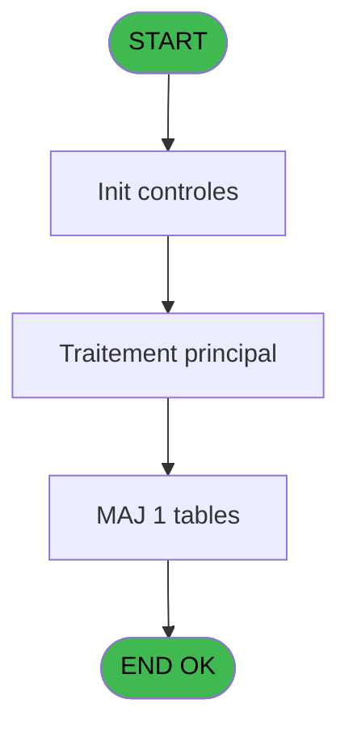
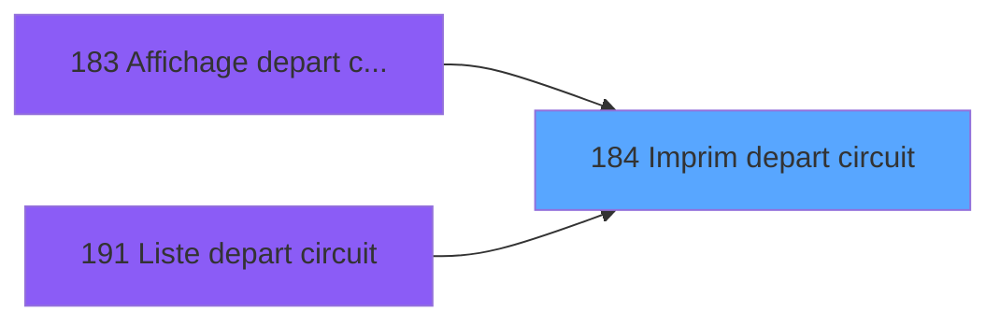

# PBP IDE 184 - Imprim depart circuit

> **Analyse**: Phases 1-4 2026-02-03 15:41 -> 15:41 (14s) | Assemblage 15:41
> **Pipeline**: V7.2 Enrichi
> **Structure**: 4 onglets (Resume | Ecrans | Donnees | Connexions)

<!-- TAB:Resume -->

## 1. FICHE D'IDENTITE

| Attribut | Valeur |
|----------|--------|
| Projet | PBP |
| IDE Position | 184 |
| Nom Programme | Imprim depart circuit |
| Fichier source | `Prg_184.xml` |
| Dossier IDE | Liste |
| Taches | 2 (0 ecrans visibles) |
| Tables modifiees | 1 |
| Programmes appeles | 0 |

## 2. DESCRIPTION FONCTIONNELLE

**Imprim depart circuit** assure la gestion complete de ce processus, accessible depuis [  Affichage depart circuit (IDE 183)](PBP-IDE-183.md), [Liste depart circuit (IDE 191)](PBP-IDE-191.md).

Le flux de traitement s'organise en **2 blocs fonctionnels** :

- **Calcul** (1 tache) : calculs de montants, stocks ou compteurs
- **Traitement** (1 tache) : traitements metier divers

**Donnees modifiees** : 1 tables en ecriture (tempo_nombres).

**Logique metier** : 3 regles identifiees couvrant conditions metier.

Detail : phases du traitement

#### Phase 1 : Traitement (1 tache)

- **184** - Veuillez patienter ... **[[ECRAN]](#ecran-t1)**

#### Phase 2 : Calcul (1 tache)

- **184.1** - Calcul pied

#### Tables impactees

| Table | Operations | Role metier |
|-------|-----------|-------------|
| tempo_nombres | **W** (1 usages) | Table temporaire ecran |

## 3. BLOCS FONCTIONNELS

### 3.1 Traitement (1 tache)

Traitements internes.

---

#### 184 - Veuillez patienter ... [[ECRAN]](#ecran-t1)

**Role** : Traitement : Veuillez patienter ....
**Ecran** : 426 x 59 DLU (MDI) | [Voir mockup](#ecran-t1)

### 3.2 Calcul (1 tache)

Calculs metier : montants, stocks, compteurs.

---

#### 184.1 - Calcul pied

**Role** : Calcul : Calcul pied.
**Variables liees** : A (>DateCalcul), G (w0_NomPied01), H (w0_NbPied01), I (w0_NomPied02), J (w0_NbPied02)

## 5. REGLES METIER

3 regles identifiees:

### Autres (3 regles)

#### [RM-001] Si VG88 AND [CR] alors TStr([CQ] sinon 'HHhMMZ'),Trim([T])&'h00')

| Element | Detail |
|---------|--------|
| **Condition** | `VG88 AND [CR]` |
| **Si vrai** | TStr([CQ] |
| **Si faux** | 'HHhMMZ'),Trim([T])&'h00') |
| **Expression source** | Expression 1 : `IF(VG88 AND [CR],TStr([CQ],'HHhMMZ'),Trim([T])&'h00')` |
| **Exemple** | Si VG88 AND [CR] → TStr([CQ]. Sinon → 'HHhMMZ'),Trim([T])&'h00') |

#### [RM-002] Traitement si [R] est renseigne

| Element | Detail |
|---------|--------|
| **Condition** | `[R]<>''` |
| **Si vrai** | Trim ([R])&' h' |
| **Si faux** | '') |
| **Expression source** | Expression 2 : `IF ([R]<>'',Trim ([R])&' h','')` |
| **Exemple** | Si [R]<>'' → Trim ([R])&' h'. Sinon → '') |

#### [RM-003] Traitement si VG42,IF ([CO] est renseigne

| Element | Detail |
|---------|--------|
| **Condition** | `VG42` |
| **Si vrai** | IF ([CO]<>'' |
| **Si faux** | [CO],[V]),IF ([AI]<>'',[AI],[V])) |
| **Expression source** | Expression 21 : `IF(VG42,IF ([CO]<>'',[CO],[V]),IF ([AI]<>'',[AI],[V]))` |
| **Exemple** | Si VG42 → IF ([CO]<>''. Sinon → [CO],[V]),IF ([AI]<>'',[AI],[V])) |

## 6. CONTEXTE

- **Appele par**: [  Affichage depart circuit (IDE 183)](PBP-IDE-183.md), [Liste depart circuit (IDE 191)](PBP-IDE-191.md)
- **Appelle**: 0 programmes | **Tables**: 3 (W:1 R:1 L:1) | **Taches**: 2 | **Expressions**: 23

<!-- TAB:Ecrans -->

## 8. ECRANS

*(Programme sans ecran visible)*

## 9. NAVIGATION

### 9.3 Structure hierarchique (2 taches)

| Position | Tache | Type | Dimensions | Bloc |
|----------|-------|------|------------|------|
| **184.1** | [**Veuillez patienter ...** (184)](#t1) [mockup](#ecran-t1) | MDI | 426x59 | Traitement |
| **184.2** | [**Calcul pied** (184.1)](#t2) | MDI | - | Calcul |

### 9.4 Algorigramme

> **Legende**: Vert = START/END OK | Rouge = END KO | Bleu = Decisions
> *Algorigramme auto-genere. Utiliser `/algorigramme` pour une synthese metier detaillee.*

<!-- TAB:Donnees -->

## 10. TABLES

### Tables utilisees (3)

| ID | Nom | Description | Type | R | W | L | Usages |
|----|-----|-------------|------|---|---|---|--------|
| 358 | import_mod |  | DB |   |   | L | 1 |
| 598 | tempo_ecr_previsions | Table temporaire ecran | TMP | R |   |   | 1 |
| 610 | tempo_nombres | Table temporaire ecran | TMP |   | **W** |   | 1 |

### Colonnes par table (2 / 2 tables avec colonnes identifiees)

Table 598 - tempo_ecr_previsions (R) - 1 usages

| Lettre | Variable | Acces | Type |
|--------|----------|-------|------|
| A | w1_Rupture | R | Numeric |
| B | w1_TotalSelect | R | Numeric |

Table 610 - tempo_nombres (**W**) - 1 usages

| Lettre | Variable | Acces | Type |
|--------|----------|-------|------|
| A | >DateCalcul | W | Date |
| B | >Circuit | W | Alpha |
| C | >Total | W | Numeric |
| D | >NbSelect | W | Numeric |
| E | P.I Heure depart village | W | Logical |
| F | w0_LibelleEdition | W | Alpha |
| G | w0_NomPied01 | W | Alpha |
| H | w0_NbPied01 | W | Numeric |
| I | w0_NomPied02 | W | Alpha |
| J | w0_NbPied02 | W | Numeric |
| K | w0_NomPied03 | W | Alpha |
| L | w0_NbPied03 | W | Numeric |
| M | w0_NomPied04 | W | Alpha |
| N | w0_NbPied04 | W | Numeric |
| O | w0_NomPied05 | W | Alpha |
| P | w0_NbPied05 | W | Numeric |
| Q | w0_TotalSelect | W | Numeric |

## 11. VARIABLES

### 11.1 Parametres entrants (1)

Variables recues du programme appelant ([  Affichage depart circuit (IDE 183)](PBP-IDE-183.md)).

| Lettre | Nom | Type | Usage dans |
|--------|-----|------|-----------|
| E | P.I Heure depart village | Logical | - |

### 11.2 Autres (16)

Variables diverses.

| Lettre | Nom | Type | Usage dans |
|--------|-----|------|-----------|
| A | >DateCalcul | Date | 3x refs |
| B | >Circuit | Alpha | 1x refs |
| C | >Total | Numeric | - |
| D | >NbSelect | Numeric | - |
| F | w0_LibelleEdition | Alpha | 1x refs |
| G | w0_NomPied01 | Alpha | - |
| H | w0_NbPied01 | Numeric | - |
| I | w0_NomPied02 | Alpha | - |
| J | w0_NbPied02 | Numeric | - |
| K | w0_NomPied03 | Alpha | - |
| L | w0_NbPied03 | Numeric | - |
| M | w0_NomPied04 | Alpha | - |
| N | w0_NbPied04 | Numeric | - |
| O | w0_NomPied05 | Alpha | - |
| P | w0_NbPied05 | Numeric | - |
| Q | w0_TotalSelect | Numeric | 1x refs |

Toutes les 17 variables (liste complete)

| Cat | Lettre | Nom Variable | Type |
|-----|--------|--------------|------|
| P0 | **E** | P.I Heure depart village | Logical |
| Autre | **A** | >DateCalcul | Date |
| Autre | **B** | >Circuit | Alpha |
| Autre | **C** | >Total | Numeric |
| Autre | **D** | >NbSelect | Numeric |
| Autre | **F** | w0_LibelleEdition | Alpha |
| Autre | **G** | w0_NomPied01 | Alpha |
| Autre | **H** | w0_NbPied01 | Numeric |
| Autre | **I** | w0_NomPied02 | Alpha |
| Autre | **J** | w0_NbPied02 | Numeric |
| Autre | **K** | w0_NomPied03 | Alpha |
| Autre | **L** | w0_NbPied03 | Numeric |
| Autre | **M** | w0_NomPied04 | Alpha |
| Autre | **N** | w0_NbPied04 | Numeric |
| Autre | **O** | w0_NomPied05 | Alpha |
| Autre | **P** | w0_NbPied05 | Numeric |
| Autre | **Q** | w0_TotalSelect | Numeric |

## 12. EXPRESSIONS

**23 / 23 expressions decodees (100%)**

### 12.1 Repartition par type

| Type | Expressions | Regles |
|------|-------------|--------|
| CONCATENATION | 7 | 0 |
| CONDITION | 8 | 3 |
| OTHER | 6 | 0 |
| REFERENCE_VG | 2 | 0 |

### 12.2 Expressions cles par type

#### CONCATENATION (7 expressions)

| Type | IDE | Expression | Regle |
|------|-----|------------|-------|
| CONCATENATION | 12 | `MlsTrans ('Depart le')&' '&DStr ([S],'DD/MM/YYYY')&' '&MlsTrans ('à')&' '&Trim ([T])&' h'&'  '&MlsTrans ('Retour le')&'  '&DStr (w0_TotalSelect [Q],'DD/MM/YYYY')&' '&MlsTrans ('à')&' '&Trim ([R])&' h'` | - |
| CONCATENATION | 16 | `MlsTrans ('AUCUNE SELECTION CORRESPONDANTE AU')&' '&DStr (>DateCalcul [A],'DD/MM/YYYY')&' !!'` | - |
| CONCATENATION | 22 | `MlsTrans('Heure de fin :')&' '&MlsTrans(IF(VG88 AND [CR], 'Libération logement','Départ Village'))` | - |
| CONCATENATION | 11 | `MlsTrans ('Edition du')&' '&DStr (Date (),'DD/MM/YYYY')&' '&MlsTrans ('à')&' '&TStr (Time (),'HH:MM:SS')` | - |
| CONCATENATION | 13 | `'- '&Str (Page (0,1),'3P0Z0')&' -'` | - |
| ... | | *+2 autres* | |

#### CONDITION (8 expressions)

| Type | IDE | Expression | Regle |
|------|-----|------------|-------|
| CONDITION | 21 | `IF(VG42,IF ([CO]<>'',[CO],[V]),IF ([AI]<>'',[AI],[V]))` | [RM-003](#rm-RM-003) |
| CONDITION | 2 | `IF ([R]<>'',Trim ([R])&' h','')` | [RM-002](#rm-RM-002) |
| CONDITION | 1 | `IF(VG88 AND [CR],TStr([CQ],'HHhMMZ'),Trim([T])&'h00')` | [RM-001](#rm-RM-001) |
| CONDITION | 15 | `[AT]>0` | - |
| CONDITION | 17 | `[AT]=0` | - |
| ... | | *+3 autres* | |

#### OTHER (6 expressions)

| Type | IDE | Expression | Regle |
|------|-----|------------|-------|
| OTHER | 18 | `w0_LibelleEdition [F]` | - |
| OTHER | 19 | `[Y]` | - |
| OTHER | 20 | `[Z]` | - |
| OTHER | 3 | `GetParam ('SOCIETE')` | - |
| OTHER | 4 | `'Village '&GetParam ('VILLAGE')` | - |
| ... | | *+1 autres* | |

#### REFERENCE_VG (2 expressions)

| Type | IDE | Expression | Regle |
|------|-----|------------|-------|
| REFERENCE_VG | 23 | `VG88` | - |
| REFERENCE_VG | 5 | `VG1` | - |

### 12.3 Toutes les expressions (23)

Voir les 23 expressions

#### CONCATENATION (7)

| IDE | Expression Decodee |
|-----|-------------------|
| 13 | `'- '&Str (Page (0,1),'3P0Z0')&' -'` |
| 9 | `MlsTrans ('Liste des departs circuits')&' '&IF (>Circuit [B]='',MlsTrans ('Tous circuits'),>Circuit [B]&' '&MlsTrans ('le')&' '&DStr (>DateCalcul [A],'DD/MM/YYYY'))` |
| 10 | `MlsTrans ('Liste des departs circuits du')&' '&DStr (>DateCalcul [A],'DD/MM/YYYY')` |
| 11 | `MlsTrans ('Edition du')&' '&DStr (Date (),'DD/MM/YYYY')&' '&MlsTrans ('à')&' '&TStr (Time (),'HH:MM:SS')` |
| 12 | `MlsTrans ('Depart le')&' '&DStr ([S],'DD/MM/YYYY')&' '&MlsTrans ('à')&' '&Trim ([T])&' h'&'  '&MlsTrans ('Retour le')&'  '&DStr (w0_TotalSelect [Q],'DD/MM/YYYY')&' '&MlsTrans ('à')&' '&Trim ([R])&' h'` |
| 16 | `MlsTrans ('AUCUNE SELECTION CORRESPONDANTE AU')&' '&DStr (>DateCalcul [A],'DD/MM/YYYY')&' !!'` |
| 22 | `MlsTrans('Heure de fin :')&' '&MlsTrans(IF(VG88 AND [CR], 'Libération logement','Départ Village'))` |

#### CONDITION (8)

| IDE | Expression Decodee |
|-----|-------------------|
| 1 | `IF(VG88 AND [CR],TStr([CQ],'HHhMMZ'),Trim([T])&'h00')` |
| 2 | `IF ([R]<>'',Trim ([R])&' h','')` |
| 21 | `IF(VG42,IF ([CO]<>'',[CO],[V]),IF ([AI]<>'',[AI],[V]))` |
| 7 | `[AE]=''` |
| 8 | `[AD]='CIRCUIT'` |
| 14 | `INIGet ('[MAGIC_LOGICAL_NAMES]preview')='O'` |
| 15 | `[AT]>0` |
| 17 | `[AT]=0` |

#### OTHER (6)

| IDE | Expression Decodee |
|-----|-------------------|
| 3 | `GetParam ('SOCIETE')` |
| 4 | `'Village '&GetParam ('VILLAGE')` |
| 6 | `Counter (0)` |
| 18 | `w0_LibelleEdition [F]` |
| 19 | `[Y]` |
| 20 | `[Z]` |

#### REFERENCE_VG (2)

| IDE | Expression Decodee |
|-----|-------------------|
| 5 | `VG1` |
| 23 | `VG88` |

<!-- TAB:Connexions -->

## 13. GRAPHE D'APPELS

### 13.1 Chaine depuis Main (Callers)

Main -> ... -> [  Affichage depart circuit (IDE 183)](PBP-IDE-183.md) -> **Imprim depart circuit (IDE 184)**

Main -> ... -> [Liste depart circuit (IDE 191)](PBP-IDE-191.md) -> **Imprim depart circuit (IDE 184)**

### 13.2 Callers

| IDE | Nom Programme | Nb Appels |
|-----|---------------|-----------|
| [183](PBP-IDE-183.md) |   Affichage depart circuit | 1 |
| [191](PBP-IDE-191.md) | Liste depart circuit | 1 |

### 13.3 Callees (programmes appeles)

### 13.4 Detail Callees avec contexte

| IDE | Nom Programme | Appels | Contexte |
|-----|---------------|--------|----------|
| - | (aucun) | - | - |

## 14. RECOMMANDATIONS MIGRATION

### 14.1 Profil du programme

| Metrique | Valeur | Impact migration |
|----------|--------|-----------------|
| Lignes de logique | 103 | Programme compact |
| Expressions | 23 | Peu de logique |
| Tables WRITE | 1 | Impact faible |
| Sous-programmes | 0 | Peu de dependances |
| Ecrans visibles | 0 | Ecran unique ou traitement batch |
| Code desactive | 0% (0 / 103) | Code sain |
| Regles metier | 3 | Quelques regles a preserver |

### 14.2 Plan de migration par bloc

#### Traitement (1 tache: 1 ecran, 0 traitement)

- **Strategie** : 1 composant(s) UI (Razor/React) avec formulaires et validation.
- Decomposer les taches en services unitaires testables.

#### Calcul (1 tache: 0 ecran, 1 traitement)

- **Strategie** : Services de calcul purs (Domain Services).
- Migrer la logique de calcul (stock, compteurs, montants)

### 14.3 Dependances critiques

| Dependance | Type | Appels | Impact |
|------------|------|--------|--------|
| tempo_nombres | Table WRITE (Temp) | 1x | Schema + repository |

---
*Spec DETAILED generee par Pipeline V7.2 - 2026-02-03 15:41*
