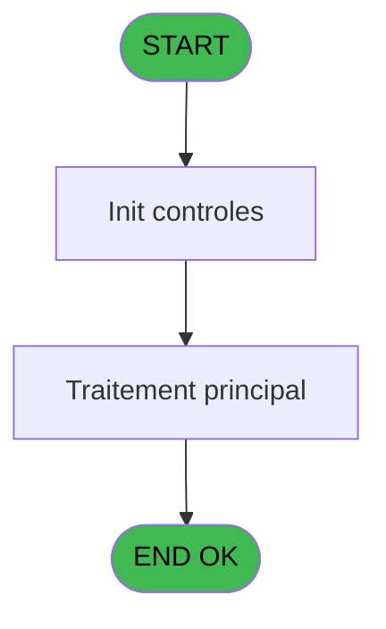
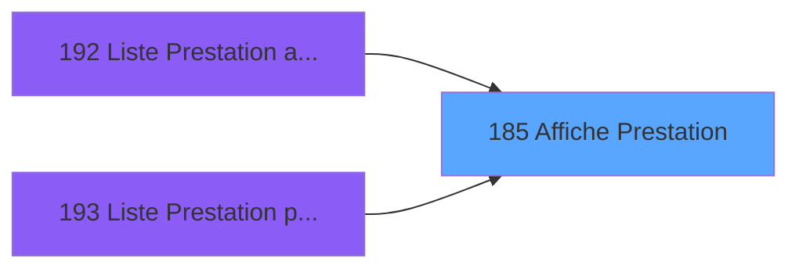
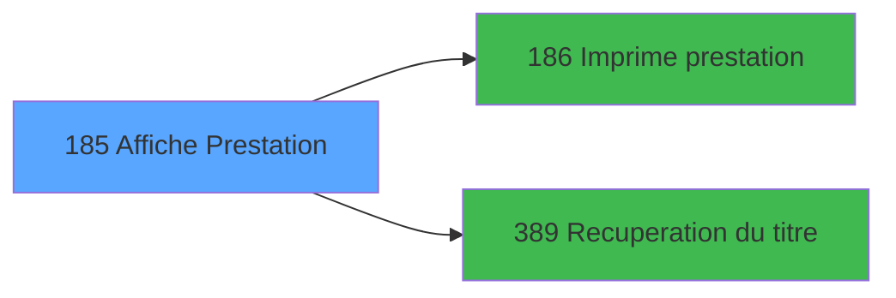

# PBP IDE 185 - Affiche Prestation

> **Analyse**: Phases 1-4 2026-02-03 15:41 -> 15:41 (17s) | Assemblage 15:41
> **Pipeline**: V7.2 Enrichi
> **Structure**: 4 onglets (Resume | Ecrans | Donnees | Connexions)

<!-- TAB:Resume -->

## 1. FICHE D'IDENTITE

| Attribut | Valeur |
|----------|--------|
| Projet | PBP |
| IDE Position | 185 |
| Nom Programme | Affiche Prestation |
| Fichier source | `Prg_185.xml` |
| Dossier IDE | Liste |
| Taches | 1 (1 ecrans visibles) |
| Tables modifiees | 0 |
| Programmes appeles | 2 |

## 2. DESCRIPTION FONCTIONNELLE

**Affiche Prestation** assure la gestion complete de ce processus, accessible depuis [Liste Prestation arrivants (IDE 192)](PBP-IDE-192.md), [Liste Prestation presents (IDE 193)](PBP-IDE-193.md).

Le flux de traitement s'organise en **1 blocs fonctionnels** :

- **Consultation** (1 tache) : ecrans de recherche, selection et consultation

**Logique metier** : 1 regles identifiees couvrant conditions metier.

## 3. BLOCS FONCTIONNELS

### 3.1 Consultation (1 tache)

Ecrans de recherche et consultation.

---

#### 185 - Affiche Prestation [[ECRAN]](#ecran-t1)

**Role** : Reinitialisation : Affiche Prestation.
**Ecran** : 1205 x 201 DLU (MDI) | [Voir mockup](#ecran-t1)
**Variables liees** : A (>TypePrestation)

## 5. REGLES METIER

1 regles identifiees:

### Autres (1 regles)

#### [RM-001] Si >TypePrestation [A]<>'P' alors 'Prestation' sinon 'Logement')

| Element | Detail |
|---------|--------|
| **Condition** | `>TypePrestation [A]<>'P'` |
| **Si vrai** | 'Prestation' |
| **Si faux** | 'Logement') |
| **Variables** | A (>TypePrestation) |
| **Expression source** | Expression 12 : `IF(>TypePrestation [A]<>'P','Prestation','Logement')` |
| **Exemple** | Si >TypePrestation [A]<>'P' → 'Prestation'. Sinon → 'Logement') |

## 6. CONTEXTE

- **Appele par**: [Liste Prestation arrivants (IDE 192)](PBP-IDE-192.md), [Liste Prestation presents (IDE 193)](PBP-IDE-193.md)
- **Appelle**: 2 programmes | **Tables**: 1 (W:0 R:1 L:0) | **Taches**: 1 | **Expressions**: 12

<!-- TAB:Ecrans -->

## 8. ECRANS

### 8.1 Forms visibles (1 / 1)

| # | Position | Tache | Nom | Type | Largeur | Hauteur | Bloc |
|---|----------|-------|-----|------|---------|---------|------|
| 1 | 185 | 185 | Affiche Prestation | MDI | 1205 | 201 | Consultation |

### 8.2 Mockups Ecrans

---

#### 185 - Affiche Prestation
**Tache** : [185](#t1) | **Type** : MDI | **Dimensions** : 1205 x 201 DLU
**Bloc** : Consultation | **Titre IDE** : Affiche Prestation

<!-- FORM-DATA:
{
    "width":  1205,
    "vFactor":  8,
    "type":  "MDI",
    "hFactor":  8,
    "controls":  [
                     {
                         "x":  0,
                         "type":  "label",
                         "var":  "",
                         "y":  0,
                         "w":  1202,
                         "fmt":  "",
                         "name":  "",
                         "h":  19,
                         "color":  "",
                         "text":  "",
                         "parent":  null
                     },
                     {
                         "x":  3,
                         "type":  "table",
                         "var":  "",
                         "name":  "",
                         "titleH":  12,
                         "color":  "110",
                         "w":  997,
                         "y":  29,
                         "fmt":  "",
                         "parent":  null,
                         "text":  "",
                         "rowH":  15,
                         "h":  143,
                         "cols":  [
                                      {
                                          "title":  "Titre",
                                          "layer":  1,
                                          "w":  52
                                      },
                                      {
                                          "title":  "Nom",
                                          "layer":  2,
                                          "w":  188
                                      },
                                      {
                                          "title":  "Prénom",
                                          "layer":  3,
                                          "w":  130
                                      },
                                      {
                                          "title":  "Prest. Début",
                                          "layer":  4,
                                          "w":  116
                                      },
                                      {
                                          "title":  "Prest. Fin",
                                          "layer":  5,
                                          "w":  119
                                      },
                                      {
                                          "title":  "Séjour début",
                                          "layer":  6,
                                          "w":  138
                                      },
                                      {
                                          "title":  "Séjour fin",
                                          "layer":  7,
                                          "w":  119
                                      },
                                      {
                                          "title":  "Prestation",
                                          "layer":  8,
                                          "w":  99
                                      }
                                  ],
                         "rows":  8
                     },
                     {
                         "x":  1002,
                         "type":  "label",
                         "var":  "",
                         "y":  27,
                         "w":  188,
                         "fmt":  "",
                         "name":  "",
                         "h":  142,
                         "color":  "",
                         "text":  "",
                         "parent":  null
                     },
                     {
                         "x":  0,
                         "type":  "label",
                         "var":  "",
                         "y":  176,
                         "w":  1202,
                         "fmt":  "",
                         "name":  "",
                         "h":  23,
                         "color":  "",
                         "text":  "",
                         "parent":  null
                     },
                     {
                         "x":  872,
                         "type":  "edit",
                         "var":  "",
                         "y":  44,
                         "w":  82,
                         "fmt":  "",
                         "name":  "INP Code Prestation",
                         "h":  10,
                         "color":  "110",
                         "text":  "",
                         "parent":  6
                     },
                     {
                         "x":  64,
                         "type":  "edit",
                         "var":  "",
                         "y":  44,
                         "w":  176,
                         "fmt":  "",
                         "name":  "INP nom",
                         "h":  10,
                         "color":  "110",
                         "text":  "",
                         "parent":  6
                     },
                     {
                         "x":  250,
                         "type":  "edit",
                         "var":  "",
                         "y":  44,
                         "w":  120,
                         "fmt":  "",
                         "name":  "INP prenom",
                         "h":  10,
                         "color":  "110",
                         "text":  "",
                         "parent":  6
                     },
                     {
                         "x":  8,
                         "type":  "edit",
                         "var":  "",
                         "y":  44,
                         "w":  30,
                         "fmt":  "",
                         "name":  "INP titre",
                         "h":  10,
                         "color":  "110",
                         "text":  "",
                         "parent":  6
                     },
                     {
                         "x":  379,
                         "type":  "edit",
                         "var":  "",
                         "y":  44,
                         "w":  98,
                         "fmt":  "DD/MM/YY",
                         "name":  "INP date prest. debu",
                         "h":  10,
                         "color":  "110",
                         "text":  "",
                         "parent":  6
                     },
                     {
                         "x":  496,
                         "type":  "edit",
                         "var":  "",
                         "y":  44,
                         "w":  104,
                         "fmt":  "DD/MM/YY",
                         "name":  "INP date prest. fin",
                         "h":  10,
                         "color":  "110",
                         "text":  "",
                         "parent":  6
                     },
                     {
                         "x":  614,
                         "type":  "edit",
                         "var":  "",
                         "y":  44,
                         "w":  104,
                         "fmt":  "DD/MM/YY",
                         "name":  "INP date sejour debu",
                         "h":  10,
                         "color":  "110",
                         "text":  "",
                         "parent":  6
                     },
                     {
                         "x":  752,
                         "type":  "edit",
                         "var":  "",
                         "y":  44,
                         "w":  104,
                         "fmt":  "DD/MM/YY",
                         "name":  "INP date sejour fin",
                         "h":  10,
                         "color":  "110",
                         "text":  "",
                         "parent":  6
                     },
                     {
                         "x":  872,
                         "type":  "edit",
                         "var":  "",
                         "y":  44,
                         "w":  82,
                         "fmt":  "",
                         "name":  "INP Logement",
                         "h":  10,
                         "color":  "110",
                         "text":  "",
                         "parent":  6
                     },
                     {
                         "x":  1019,
                         "type":  "button",
                         "var":  "",
                         "y":  140,
                         "w":  154,
                         "fmt":  "\u0026Impression",
                         "name":  "b_Imprimer",
                         "h":  18,
                         "color":  "",
                         "text":  "",
                         "parent":  7
                     },
                     {
                         "x":  6,
                         "type":  "edit",
                         "var":  "",
                         "y":  2,
                         "w":  267,
                         "fmt":  "30",
                         "name":  "",
                         "h":  8,
                         "color":  "",
                         "text":  "",
                         "parent":  1
                     },
                     {
                         "x":  456,
                         "type":  "edit",
                         "var":  "",
                         "y":  6,
                         "w":  344,
                         "fmt":  "30",
                         "name":  "",
                         "h":  8,
                         "color":  "",
                         "text":  "",
                         "parent":  1
                     },
                     {
                         "x":  928,
                         "type":  "edit",
                         "var":  "",
                         "y":  6,
                         "w":  267,
                         "fmt":  "WWW DD MMM YYYYT",
                         "name":  "",
                         "h":  8,
                         "color":  "",
                         "text":  "",
                         "parent":  1
                     },
                     {
                         "x":  6,
                         "type":  "edit",
                         "var":  "",
                         "y":  10,
                         "w":  267,
                         "fmt":  "30",
                         "name":  "",
                         "h":  8,
                         "color":  "",
                         "text":  "",
                         "parent":  1
                     },
                     {
                         "x":  1014,
                         "type":  "image",
                         "var":  "",
                         "y":  50,
                         "w":  165,
                         "fmt":  "",
                         "name":  "",
                         "h":  50,
                         "color":  "",
                         "text":  "",
                         "parent":  7
                     },
                     {
                         "x":  7,
                         "type":  "button",
                         "var":  "",
                         "y":  179,
                         "w":  154,
                         "fmt":  "\u0026Quitter",
                         "name":  "",
                         "h":  18,
                         "color":  "",
                         "text":  "",
                         "parent":  27
                     }
                 ],
    "taskId":  "185",
    "height":  201
}
-->

<strong>Champs : 13 champs</strong>

| Pos (x,y) | Nom | Variable | Type |
|-----------|-----|----------|------|
| 872,44 | INP Code Prestation | - | edit |
| 64,44 | INP nom | - | edit |
| 250,44 | INP prenom | - | edit |
| 8,44 | INP titre | - | edit |
| 379,44 | INP date prest. debu | - | edit |
| 496,44 | INP date prest. fin | - | edit |
| 614,44 | INP date sejour debu | - | edit |
| 752,44 | INP date sejour fin | - | edit |
| 872,44 | INP Logement | - | edit |
| 6,2 | 30 | - | edit |
| 456,6 | 30 | - | edit |
| 928,6 | WWW DD MMM YYYYT | - | edit |
| 6,10 | 30 | - | edit |

<strong>Boutons : 2 boutons</strong>

| Bouton | Pos (x,y) | Action |
|--------|-----------|--------|
| Impression | 1019,140 | Bouton fonctionnel |
| Quitter | 7,179 | Quitte le programme |

## 9. NAVIGATION

Ecran unique: **Affiche Prestation**

### 9.3 Structure hierarchique (1 tache)

| Position | Tache | Type | Dimensions | Bloc |
|----------|-------|------|------------|------|
| **185.1** | [**Affiche Prestation** (185)](#t1) [mockup](#ecran-t1) | MDI | 1205x201 | Consultation |

### 9.4 Algorigramme

> **Legende**: Vert = START/END OK | Rouge = END KO | Bleu = Decisions
> *Algorigramme auto-genere. Utiliser `/algorigramme` pour une synthese metier detaillee.*

<!-- TAB:Donnees -->

## 10. TABLES

### Tables utilisees (1)

| ID | Nom | Description | Type | R | W | L | Usages |
|----|-----|-------------|------|---|---|---|--------|
| 589 | tempo_chambre_client | Table temporaire ecran | TMP | R |   |   | 1 |

### Colonnes par table (1 / 1 tables avec colonnes identifiees)

Table 589 - tempo_chambre_client (R) - 1 usages

| Lettre | Variable | Acces | Type |
|--------|----------|-------|------|
| A | >TypePrestation | R | Alpha |
| B | >CodeSelection | R | Alpha |
| C | >DateMin | R | Date |
| D | >DateMax | R | Date |
| E | >NbSelect | R | Numeric |
| F | >CodeEcran | R | Numeric |
| G | >Total | R | Numeric |
| H | >NbSelect | R | Numeric |
| I | w0_TitreEcran | R | Alpha |
| J | b_Imprimer | R | Alpha |

## 11. VARIABLES

### 11.1 Autres (10)

Variables diverses.

| Lettre | Nom | Type | Usage dans |
|--------|-----|------|-----------|
| A | >TypePrestation | Alpha | 3x refs |
| B | >CodeSelection | Alpha | - |
| C | >DateMin | Date | - |
| D | >DateMax | Date | - |
| E | >NbSelect | Numeric | 1x refs |
| F | >CodeEcran | Numeric | - |
| G | >Total | Numeric | 1x refs |
| H | >NbSelect | Numeric | 1x refs |
| I | w0_TitreEcran | Alpha | 1x refs |
| J | b_Imprimer | Alpha | - |

## 12. EXPRESSIONS

**12 / 12 expressions decodees (100%)**

### 12.1 Repartition par type

| Type | Expressions | Regles |
|------|-------------|--------|
| CONDITION | 3 | 5 |
| CONSTANTE | 1 | 0 |
| DATE | 1 | 0 |
| REFERENCE_VG | 2 | 0 |
| OTHER | 3 | 0 |
| STRING | 1 | 0 |
| CONCATENATION | 1 | 0 |

### 12.2 Expressions cles par type

#### CONDITION (3 expressions)

| Type | IDE | Expression | Regle |
|------|-----|------------|-------|
| CONDITION | 12 | `IF(>TypePrestation [A]<>'P','Prestation','Logement')` | [RM-001](#rm-RM-001) |
| CONDITION | 4 | `>TypePrestation [A]<>'P'` | - |
| CONDITION | 3 | `>TypePrestation [A]='P'` | - |

#### CONSTANTE (1 expressions)

| Type | IDE | Expression | Regle |
|------|-----|------------|-------|
| CONSTANTE | 8 | `'&Imprimer'` | - |

#### DATE (1 expressions)

| Type | IDE | Expression | Regle |
|------|-----|------------|-------|
| DATE | 5 | `Date ()` | - |

#### REFERENCE_VG (2 expressions)

| Type | IDE | Expression | Regle |
|------|-----|------------|-------|
| REFERENCE_VG | 2 | `VG2` | - |
| REFERENCE_VG | 1 | `VG1` | - |

#### OTHER (3 expressions)

| Type | IDE | Expression | Regle |
|------|-----|------------|-------|
| OTHER | 10 | `GetParam ('VILLAGE')` | - |
| OTHER | 7 | `SetCrsr (1)` | - |
| OTHER | 6 | `SetCrsr (2)` | - |

#### STRING (1 expressions)

| Type | IDE | Expression | Regle |
|------|-----|------------|-------|
| STRING | 9 | `Trim (w0_TitreEcran [I])` | - |

#### CONCATENATION (1 expressions)

| Type | IDE | Expression | Regle |
|------|-----|------------|-------|
| CONCATENATION | 11 | `Str (>NbSelect [E],'4')&' selectionnes sur '&Str (>Total [G],'4')` | - |

<!-- TAB:Connexions -->

## 13. GRAPHE D'APPELS

### 13.1 Chaine depuis Main (Callers)

Main -> ... -> [Liste Prestation arrivants (IDE 192)](PBP-IDE-192.md) -> **Affiche Prestation (IDE 185)**

Main -> ... -> [Liste Prestation presents (IDE 193)](PBP-IDE-193.md) -> **Affiche Prestation (IDE 185)**

### 13.2 Callers

| IDE | Nom Programme | Nb Appels |
|-----|---------------|-----------|
| [192](PBP-IDE-192.md) | Liste Prestation arrivants | 1 |
| [193](PBP-IDE-193.md) | Liste Prestation presents | 1 |

### 13.3 Callees (programmes appeles)

### 13.4 Detail Callees avec contexte

| IDE | Nom Programme | Appels | Contexte |
|-----|---------------|--------|----------|
| [186](PBP-IDE-186.md) |   Imprime prestation | 1 | Impression ticket/document |
| [389](PBP-IDE-389.md) | Recuperation du titre | 1 | Recuperation donnees |

## 14. RECOMMANDATIONS MIGRATION

### 14.1 Profil du programme

| Metrique | Valeur | Impact migration |
|----------|--------|-----------------|
| Lignes de logique | 28 | Programme compact |
| Expressions | 12 | Peu de logique |
| Tables WRITE | 0 | Impact faible |
| Sous-programmes | 2 | Peu de dependances |
| Ecrans visibles | 1 | Ecran unique ou traitement batch |
| Code desactive | 0% (0 / 28) | Code sain |
| Regles metier | 1 | Quelques regles a preserver |

### 14.2 Plan de migration par bloc

#### Consultation (1 tache: 1 ecran, 0 traitement)

- **Strategie** : Composants de recherche/selection en modales.
- 1 ecran : Affiche Prestation

### 14.3 Dependances critiques

| Dependance | Type | Appels | Impact |
|------------|------|--------|--------|
| [Recuperation du titre (IDE 389)](PBP-IDE-389.md) | Sous-programme | 1x | Normale - Recuperation donnees |
| [  Imprime prestation (IDE 186)](PBP-IDE-186.md) | Sous-programme | 1x | Normale - Impression ticket/document |

---
*Spec DETAILED generee par Pipeline V7.2 - 2026-02-03 15:41*
