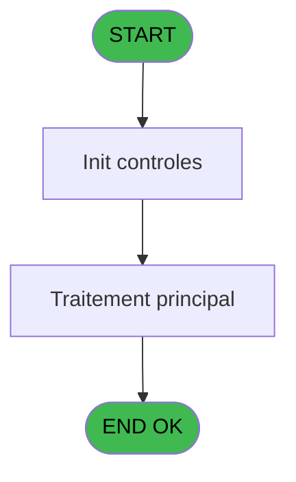
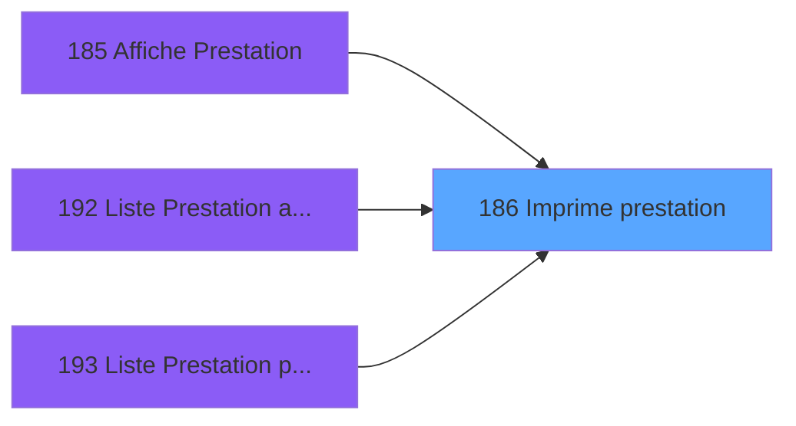

# PBP IDE 186 - Imprime prestation

> **Analyse**: Phases 1-4 2026-02-03 15:42 -> 15:42 (16s) | Assemblage 15:42
> **Pipeline**: V7.2 Enrichi
> **Structure**: 4 onglets (Resume | Ecrans | Donnees | Connexions)

<!-- TAB:Resume -->

## 1. FICHE D'IDENTITE

| Attribut | Valeur |
|----------|--------|
| Projet | PBP |
| IDE Position | 186 |
| Nom Programme | Imprime prestation |
| Fichier source | `Prg_186.xml` |
| Dossier IDE | Liste |
| Taches | 1 (1 ecrans visibles) |
| Tables modifiees | 0 |
| Programmes appeles | 0 |

## 2. DESCRIPTION FONCTIONNELLE

**Imprime prestation** assure la gestion complete de ce processus, accessible depuis [  Affiche Prestation (IDE 185)](PBP-IDE-185.md), [Liste Prestation arrivants (IDE 192)](PBP-IDE-192.md), [Liste Prestation presents (IDE 193)](PBP-IDE-193.md).

Le flux de traitement s'organise en **1 blocs fonctionnels** :

- **Traitement** (1 tache) : traitements metier divers

**Logique metier** : 2 regles identifiees couvrant conditions metier, valeurs par defaut.

## 3. BLOCS FONCTIONNELS

### 3.1 Traitement (1 tache)

Traitements internes.

---

#### 186 - Veuillez patienter ... [[ECRAN]](#ecran-t1)

**Role** : Traitement : Veuillez patienter ....
**Ecran** : 429 x 59 DLU (MDI) | [Voir mockup](#ecran-t1)

## 5. REGLES METIER

2 regles identifiees:

### Autres (2 regles)

#### [RM-001] Valeur par defaut si >CodePrestation [B] est vide

| Element | Detail |
|---------|--------|
| **Condition** | `>CodePrestation [B]=''` |
| **Si vrai** | MlsTrans ('Toutes les prestations') |
| **Si faux** | MlsTrans ('La prestation')&' '&>CodePrestation [B])&' '&MlsTrans ('du')&' '&DStr (>DateMin [C],'DD/MM/YYYY')&' '&MlsTrans ('au')&' '&DStr (>DateMax [D],'DD/MM/YYYY') |
| **Variables** | B (>CodePrestation), C (>DateMin), D (>DateMax) |
| **Expression source** | Expression 10 : `IF (>CodePrestation [B]='',MlsTrans ('Toutes les prestations` |
| **Exemple** | Si >CodePrestation [B]='' → MlsTrans ('Toutes les prestations') |

#### [RM-002] Si >TypePrestation [A]='P' alors 17 sinon 20.45)

| Element | Detail |
|---------|--------|
| **Condition** | `>TypePrestation [A]='P'` |
| **Si vrai** | 17 |
| **Si faux** | 20.45) |
| **Variables** | A (>TypePrestation) |
| **Expression source** | Expression 13 : `IF (>TypePrestation [A]='P',17,20.45)` |
| **Exemple** | Si >TypePrestation [A]='P' → 17. Sinon → 20.45) |

## 6. CONTEXTE

- **Appele par**: [  Affiche Prestation (IDE 185)](PBP-IDE-185.md), [Liste Prestation arrivants (IDE 192)](PBP-IDE-192.md), [Liste Prestation presents (IDE 193)](PBP-IDE-193.md)
- **Appelle**: 0 programmes | **Tables**: 2 (W:0 R:1 L:1) | **Taches**: 1 | **Expressions**: 13

<!-- TAB:Ecrans -->

## 8. ECRANS

### 8.1 Forms visibles (1 / 1)

| # | Position | Tache | Nom | Type | Largeur | Hauteur | Bloc |
|---|----------|-------|-----|------|---------|---------|------|
| 1 | 186 | 186 | Veuillez patienter ... | MDI | 429 | 59 | Traitement |

### 8.2 Mockups Ecrans

---

#### 186 - Veuillez patienter ...
**Tache** : [186](#t1) | **Type** : MDI | **Dimensions** : 429 x 59 DLU
**Bloc** : Traitement | **Titre IDE** : Veuillez patienter ...

<!-- FORM-DATA:
{
    "width":  429,
    "vFactor":  8,
    "type":  "MDI",
    "hFactor":  8,
    "controls":  [
                     {
                         "x":  0,
                         "type":  "label",
                         "var":  "",
                         "y":  0,
                         "w":  423,
                         "fmt":  "",
                         "name":  "",
                         "h":  29,
                         "color":  "",
                         "text":  "",
                         "parent":  null
                     },
                     {
                         "x":  120,
                         "type":  "label",
                         "var":  "",
                         "y":  10,
                         "w":  221,
                         "fmt":  "",
                         "name":  "",
                         "h":  8,
                         "color":  "7",
                         "text":  "Impression en cours ...",
                         "parent":  null
                     },
                     {
                         "x":  0,
                         "type":  "label",
                         "var":  "",
                         "y":  29,
                         "w":  423,
                         "fmt":  "",
                         "name":  "",
                         "h":  27,
                         "color":  "",
                         "text":  "",
                         "parent":  null
                     },
                     {
                         "x":  79,
                         "type":  "label",
                         "var":  "",
                         "y":  38,
                         "w":  266,
                         "fmt":  "",
                         "name":  "",
                         "h":  8,
                         "color":  "",
                         "text":  "Liste prestations",
                         "parent":  null
                     },
                     {
                         "x":  4,
                         "type":  "image",
                         "var":  "",
                         "y":  2,
                         "w":  72,
                         "fmt":  "",
                         "name":  "",
                         "h":  25,
                         "color":  "",
                         "text":  "",
                         "parent":  null
                     }
                 ],
    "taskId":  "186",
    "height":  59
}
-->

## 9. NAVIGATION

Ecran unique: **Veuillez patienter ...**

### 9.3 Structure hierarchique (1 tache)

| Position | Tache | Type | Dimensions | Bloc |
|----------|-------|------|------------|------|
| **186.1** | [**Veuillez patienter ...** (186)](#t1) [mockup](#ecran-t1) | MDI | 429x59 | Traitement |

### 9.4 Algorigramme

> **Legende**: Vert = START/END OK | Rouge = END KO | Bleu = Decisions
> *Algorigramme auto-genere. Utiliser `/algorigramme` pour une synthese metier detaillee.*

<!-- TAB:Donnees -->

## 10. TABLES

### Tables utilisees (2)

| ID | Nom | Description | Type | R | W | L | Usages |
|----|-----|-------------|------|---|---|---|--------|
| 135 | libelle_prestation | Prestations/services vendus | DB | R |   |   | 1 |
| 589 | tempo_chambre_client | Table temporaire ecran | TMP |   |   | L | 1 |

### Colonnes par table (1 / 1 tables avec colonnes identifiees)

Table 135 - libelle_prestation (R) - 1 usages

| Lettre | Variable | Acces | Type |
|--------|----------|-------|------|
| A | >TypePrestation | R | Alpha |
| B | >CodePrestation | R | Alpha |
| C | >DateMin | R | Date |
| D | >DateMax | R | Date |
| E | >NbSelect | R | Numeric |
| F | >Total | R | Numeric |
| G | >Excel | R | Logical |
| H | >FichierExcel | R | Alpha |
| I | w0_TitreEdition | R | Alpha |

## 11. VARIABLES

### 11.1 Autres (9)

Variables diverses.

| Lettre | Nom | Type | Usage dans |
|--------|-----|------|-----------|
| A | >TypePrestation | Alpha | 3x refs |
| B | >CodePrestation | Alpha | 2x refs |
| C | >DateMin | Date | 2x refs |
| D | >DateMax | Date | 1x refs |
| E | >NbSelect | Numeric | - |
| F | >Total | Numeric | - |
| G | >Excel | Logical | - |
| H | >FichierExcel | Alpha | - |
| I | w0_TitreEdition | Alpha | 1x refs |

## 12. EXPRESSIONS

**13 / 13 expressions decodees (100%)**

### 12.1 Repartition par type

| Type | Expressions | Regles |
|------|-------------|--------|
| CONCATENATION | 4 | 5 |
| CONDITION | 5 | 5 |
| REFERENCE_VG | 1 | 0 |
| OTHER | 3 | 0 |

### 12.2 Expressions cles par type

#### CONCATENATION (4 expressions)

| Type | IDE | Expression | Regle |
|------|-----|------------|-------|
| CONCATENATION | 10 | `IF (>CodePrestation [B]='',MlsTrans ('Toutes les prestations'),MlsTrans ('La prestation')&' '&>CodePrestation [B])&' '&MlsTrans ('du')&' '&DStr (>DateMin [C],'DD/MM/YYYY')&' '&MlsTrans ('au')&' '&DStr (>DateMax [D],'DD/MM/YYYY')` | [RM-001](#rm-RM-001) |
| CONCATENATION | 9 | `MlsTrans ('Presents Prestation(s)')&' '&>CodePrestation [B]&IF (>CodePrestation [B]='',MlsTrans ('Toutes')&' ',Trim ([T]))&' '&MlsTrans ('du')&' '&DStr (>DateMin [C],'DD/MM/YYYY')` | - |
| CONCATENATION | 5 | `MlsTrans ('Edition du')&' '&DStr (Date (),'DD/MM/YYYY')&' '&MlsTrans ('à')&' '&TStr (Time (),'HH:MM:SS')` | - |
| CONCATENATION | 8 | `'- '&Str (Page (0,1),'3P0Z0')&' -'` | - |

#### CONDITION (5 expressions)

| Type | IDE | Expression | Regle |
|------|-----|------------|-------|
| CONDITION | 13 | `IF (>TypePrestation [A]='P',17,20.45)` | [RM-002](#rm-RM-002) |
| CONDITION | 11 | `Counter (0)>1` | - |
| CONDITION | 12 | `INIGet ('[MAGIC_LOGICAL_NAMES]preview')='O'` | - |
| CONDITION | 6 | `>TypePrestation [A]='P'` | - |
| CONDITION | 7 | `>TypePrestation [A]<>'P'` | - |

#### REFERENCE_VG (1 expressions)

| Type | IDE | Expression | Regle |
|------|-----|------------|-------|
| REFERENCE_VG | 1 | `VG1` | - |

#### OTHER (3 expressions)

| Type | IDE | Expression | Regle |
|------|-----|------------|-------|
| OTHER | 4 | `'Village '&GetParam ('VILLAGE')` | - |
| OTHER | 3 | `w0_TitreEdition [I]` | - |
| OTHER | 2 | `GetParam ('SOCIETE')` | - |

<!-- TAB:Connexions -->

## 13. GRAPHE D'APPELS

### 13.1 Chaine depuis Main (Callers)

Main -> ... -> [  Affiche Prestation (IDE 185)](PBP-IDE-185.md) -> **Imprime prestation (IDE 186)**

Main -> ... -> [Liste Prestation arrivants (IDE 192)](PBP-IDE-192.md) -> **Imprime prestation (IDE 186)**

Main -> ... -> [Liste Prestation presents (IDE 193)](PBP-IDE-193.md) -> **Imprime prestation (IDE 186)**

### 13.2 Callers

| IDE | Nom Programme | Nb Appels |
|-----|---------------|-----------|
| [185](PBP-IDE-185.md) |   Affiche Prestation | 1 |
| [192](PBP-IDE-192.md) | Liste Prestation arrivants | 1 |
| [193](PBP-IDE-193.md) | Liste Prestation presents | 1 |

### 13.3 Callees (programmes appeles)

### 13.4 Detail Callees avec contexte

| IDE | Nom Programme | Appels | Contexte |
|-----|---------------|--------|----------|
| - | (aucun) | - | - |

## 14. RECOMMANDATIONS MIGRATION

### 14.1 Profil du programme

| Metrique | Valeur | Impact migration |
|----------|--------|-----------------|
| Lignes de logique | 41 | Programme compact |
| Expressions | 13 | Peu de logique |
| Tables WRITE | 0 | Impact faible |
| Sous-programmes | 0 | Peu de dependances |
| Ecrans visibles | 1 | Ecran unique ou traitement batch |
| Code desactive | 0% (0 / 41) | Code sain |
| Regles metier | 2 | Quelques regles a preserver |

### 14.2 Plan de migration par bloc

#### Traitement (1 tache: 1 ecran, 0 traitement)

- **Strategie** : 1 composant(s) UI (Razor/React) avec formulaires et validation.
- Decomposer les taches en services unitaires testables.

### 14.3 Dependances critiques

| Dependance | Type | Appels | Impact |
|------------|------|--------|--------|

---
*Spec DETAILED generee par Pipeline V7.2 - 2026-02-03 15:42*
