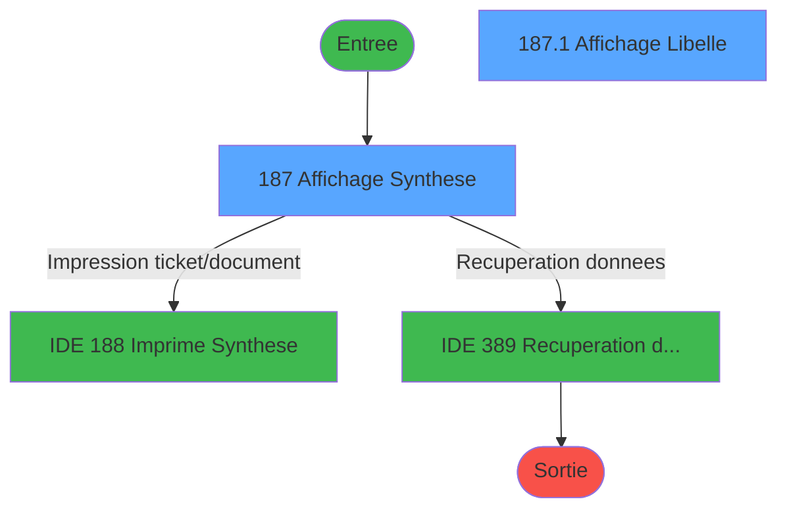
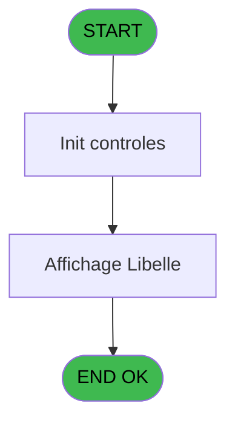
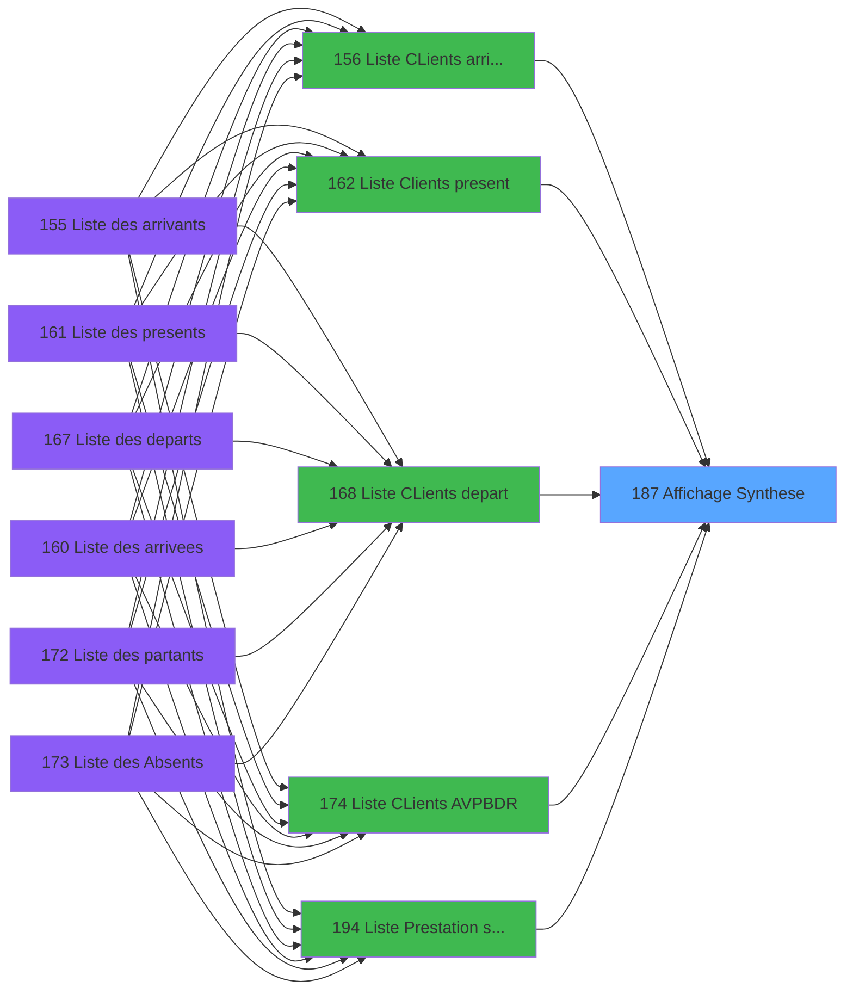
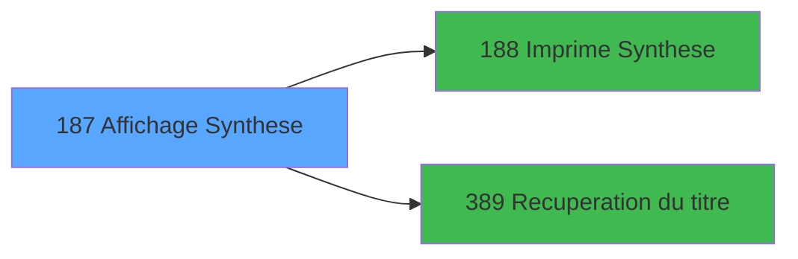

# PBP IDE 187 - Affichage Synthese

> **Analyse**: Phases 1-4 2026-02-03 15:42 -> 15:42 (13s) | Assemblage 15:42
> **Pipeline**: V7.2 Enrichi
> **Structure**: 4 onglets (Resume | Ecrans | Donnees | Connexions)

<!-- TAB:Resume -->

## 1. FICHE D'IDENTITE

| Attribut | Valeur |
|----------|--------|
| Projet | PBP |
| IDE Position | 187 |
| Nom Programme | Affichage Synthese |
| Fichier source | `Prg_187.xml` |
| Dossier IDE | Liste |
| Taches | 2 (2 ecrans visibles) |
| Tables modifiees | 0 |
| Programmes appeles | 2 |

## 2. DESCRIPTION FONCTIONNELLE

**Affichage Synthese** assure la gestion complete de ce processus, accessible depuis [  Liste CLients arrivant (IDE 156)](PBP-IDE-156.md), [  Liste Clients present (IDE 162)](PBP-IDE-162.md), [  Liste CLients depart (IDE 168)](PBP-IDE-168.md), [Liste CLients AVPBDR (IDE 174)](PBP-IDE-174.md), [Liste Prestation stock (IDE 194)](PBP-IDE-194.md), [  Liste present personnel plan (IDE 227)](PBP-IDE-227.md), [  Liste personnels AVPBDR (IDE 234)](PBP-IDE-234.md).

Le flux de traitement s'organise en **1 blocs fonctionnels** :

- **Consultation** (2 taches) : ecrans de recherche, selection et consultation

## 3. BLOCS FONCTIONNELS

### 3.1 Consultation (2 taches)

Ecrans de recherche et consultation.

---

#### 187 - Affichage Synthese [[ECRAN]](#ecran-t1)

**Role** : Reinitialisation : Affichage Synthese.
**Ecran** : 1203 x 247 DLU (MDI) | [Voir mockup](#ecran-t1)

---

#### 187.1 - Affichage Libelle [[ECRAN]](#ecran-t2)

**Role** : Reinitialisation : Affichage Libelle.
**Ecran** : 1181 x 69 DLU (Modal) | [Voir mockup](#ecran-t2)

## 5. REGLES METIER

*(Aucune regle metier identifiee)*

## 6. CONTEXTE

- **Appele par**: [  Liste CLients arrivant (IDE 156)](PBP-IDE-156.md), [  Liste Clients present (IDE 162)](PBP-IDE-162.md), [  Liste CLients depart (IDE 168)](PBP-IDE-168.md), [Liste CLients AVPBDR (IDE 174)](PBP-IDE-174.md), [Liste Prestation stock (IDE 194)](PBP-IDE-194.md), [  Liste present personnel plan (IDE 227)](PBP-IDE-227.md), [  Liste personnels AVPBDR (IDE 234)](PBP-IDE-234.md)
- **Appelle**: 2 programmes | **Tables**: 2 (W:0 R:2 L:1) | **Taches**: 2 | **Expressions**: 27

<!-- TAB:Ecrans -->

## 8. ECRANS

### 8.1 Forms visibles (2 / 2)

| # | Position | Tache | Nom | Type | Largeur | Hauteur | Bloc |
|---|----------|-------|-----|------|---------|---------|------|
| 1 | 187 | 187 | Affichage Synthese | MDI | 1203 | 247 | Consultation |
| 2 | 187.1 | 187.1 | Affichage Libelle | Modal | 1181 | 69 | Consultation |

### 8.2 Mockups Ecrans

---

#### 187 - Affichage Synthese
**Tache** : [187](#t1) | **Type** : MDI | **Dimensions** : 1203 x 247 DLU
**Bloc** : Consultation | **Titre IDE** : Affichage Synthese

<!-- FORM-DATA:
{
    "width":  1203,
    "vFactor":  8,
    "type":  "MDI",
    "hFactor":  8,
    "controls":  [
                     {
                         "x":  0,
                         "type":  "label",
                         "var":  "",
                         "y":  2,
                         "w":  1198,
                         "fmt":  "",
                         "name":  "",
                         "h":  18,
                         "color":  "",
                         "text":  "",
                         "parent":  null
                     },
                     {
                         "x":  0,
                         "type":  "table",
                         "var":  "",
                         "name":  "",
                         "titleH":  12,
                         "color":  "110",
                         "w":  1200,
                         "y":  24,
                         "fmt":  "",
                         "parent":  null,
                         "text":  "",
                         "rowH":  12,
                         "h":  124,
                         "cols":  [
                                      {
                                          "title":  "DD/MM",
                                          "layer":  1,
                                          "w":  78
                                      },
                                      {
                                          "title":  "DD/MM",
                                          "layer":  2,
                                          "w":  79
                                      },
                                      {
                                          "title":  "DD/MM",
                                          "layer":  3,
                                          "w":  78
                                      },
                                      {
                                          "title":  "DD/MM",
                                          "layer":  4,
                                          "w":  76
                                      },
                                      {
                                          "title":  "DD/MM",
                                          "layer":  5,
                                          "w":  81
                                      },
                                      {
                                          "title":  "DD/MM",
                                          "layer":  6,
                                          "w":  79
                                      },
                                      {
                                          "title":  "DD/MM",
                                          "layer":  7,
                                          "w":  76
                                      },
                                      {
                                          "title":  "DD/MM",
                                          "layer":  8,
                                          "w":  78
                                      },
                                      {
                                          "title":  "DD/MM",
                                          "layer":  9,
                                          "w":  78
                                      },
                                      {
                                          "title":  "DD/MM",
                                          "layer":  10,
                                          "w":  76
                                      },
                                      {
                                          "title":  "DD/MM",
                                          "layer":  11,
                                          "w":  78
                                      },
                                      {
                                          "title":  "DD/MM",
                                          "layer":  12,
                                          "w":  78
                                      },
                                      {
                                          "title":  "DD/MM",
                                          "layer":  13,
                                          "w":  79
                                      },
                                      {
                                          "title":  "DD/MM",
                                          "layer":  14,
                                          "w":  76
                                      },
                                      {
                                          "title":  "DD/MM",
                                          "layer":  15,
                                          "w":  76
                                      }
                                  ],
                         "rows":  15
                     },
                     {
                         "x":  0,
                         "type":  "label",
                         "var":  "",
                         "y":  222,
                         "w":  1198,
                         "fmt":  "",
                         "name":  "",
                         "h":  24,
                         "color":  "",
                         "text":  "",
                         "parent":  null
                     },
                     {
                         "x":  8,
                         "type":  "edit",
                         "var":  "",
                         "y":  40,
                         "w":  64,
                         "fmt":  "",
                         "name":  "SYN Jour 1",
                         "h":  8,
                         "color":  "110",
                         "text":  "",
                         "parent":  6
                     },
                     {
                         "x":  86,
                         "type":  "edit",
                         "var":  "",
                         "y":  40,
                         "w":  64,
                         "fmt":  "",
                         "name":  "SYN Jour 2",
                         "h":  8,
                         "color":  "110",
                         "text":  "",
                         "parent":  6
                     },
                     {
                         "x":  165,
                         "type":  "edit",
                         "var":  "",
                         "y":  40,
                         "w":  64,
                         "fmt":  "",
                         "name":  "SYN Jour 3",
                         "h":  8,
                         "color":  "110",
                         "text":  "",
                         "parent":  6
                     },
                     {
                         "x":  242,
                         "type":  "edit",
                         "var":  "",
                         "y":  40,
                         "w":  64,
                         "fmt":  "",
                         "name":  "SYN Jour 4",
                         "h":  8,
                         "color":  "110",
                         "text":  "",
                         "parent":  6
                     },
                     {
                         "x":  318,
                         "type":  "edit",
                         "var":  "",
                         "y":  40,
                         "w":  64,
                         "fmt":  "",
                         "name":  "SYN Jour 5",
                         "h":  8,
                         "color":  "110",
                         "text":  "",
                         "parent":  6
                     },
                     {
                         "x":  402,
                         "type":  "edit",
                         "var":  "",
                         "y":  40,
                         "w":  64,
                         "fmt":  "",
                         "name":  "SYN Jour 6",
                         "h":  8,
                         "color":  "110",
                         "text":  "",
                         "parent":  6
                     },
                     {
                         "x":  477,
                         "type":  "edit",
                         "var":  "",
                         "y":  40,
                         "w":  64,
                         "fmt":  "",
                         "name":  "SYN Jour 7",
                         "h":  8,
                         "color":  "110",
                         "text":  "",
                         "parent":  6
                     },
                     {
                         "x":  555,
                         "type":  "edit",
                         "var":  "",
                         "y":  40,
                         "w":  64,
                         "fmt":  "",
                         "name":  "SYN Jour 8",
                         "h":  8,
                         "color":  "110",
                         "text":  "",
                         "parent":  6
                     },
                     {
                         "x":  634,
                         "type":  "edit",
                         "var":  "",
                         "y":  40,
                         "w":  64,
                         "fmt":  "",
                         "name":  "SYN Jour 9",
                         "h":  8,
                         "color":  "110",
                         "text":  "",
                         "parent":  6
                     },
                     {
                         "x":  709,
                         "type":  "edit",
                         "var":  "",
                         "y":  40,
                         "w":  64,
                         "fmt":  "",
                         "name":  "SYN Jour 10",
                         "h":  8,
                         "color":  "110",
                         "text":  "",
                         "parent":  6
                     },
                     {
                         "x":  787,
                         "type":  "edit",
                         "var":  "",
                         "y":  40,
                         "w":  64,
                         "fmt":  "",
                         "name":  "SYN Jour 11",
                         "h":  8,
                         "color":  "110",
                         "text":  "",
                         "parent":  6
                     },
                     {
                         "x":  866,
                         "type":  "edit",
                         "var":  "",
                         "y":  40,
                         "w":  64,
                         "fmt":  "",
                         "name":  "SYN Jour 12",
                         "h":  8,
                         "color":  "110",
                         "text":  "",
                         "parent":  6
                     },
                     {
                         "x":  944,
                         "type":  "edit",
                         "var":  "",
                         "y":  40,
                         "w":  64,
                         "fmt":  "",
                         "name":  "SYN Jour 13",
                         "h":  8,
                         "color":  "110",
                         "text":  "",
                         "parent":  6
                     },
                     {
                         "x":  1021,
                         "type":  "edit",
                         "var":  "",
                         "y":  40,
                         "w":  64,
                         "fmt":  "",
                         "name":  "SYN Jour 14",
                         "h":  8,
                         "color":  "110",
                         "text":  "",
                         "parent":  6
                     },
                     {
                         "x":  1098,
                         "type":  "edit",
                         "var":  "",
                         "y":  40,
                         "w":  64,
                         "fmt":  "",
                         "name":  "SYN Jour 15",
                         "h":  8,
                         "color":  "110",
                         "text":  "",
                         "parent":  6
                     },
                     {
                         "x":  1033,
                         "type":  "button",
                         "var":  "",
                         "y":  225,
                         "w":  154,
                         "fmt":  "\u0026Impression",
                         "name":  "b_Imprimer",
                         "h":  18,
                         "color":  "",
                         "text":  "",
                         "parent":  37
                     },
                     {
                         "x":  11,
                         "type":  "button",
                         "var":  "",
                         "y":  225,
                         "w":  154,
                         "fmt":  "\u0026Quitter",
                         "name":  "b_Quitter",
                         "h":  18,
                         "color":  "",
                         "text":  "",
                         "parent":  37
                     },
                     {
                         "x":  5,
                         "type":  "edit",
                         "var":  "",
                         "y":  3,
                         "w":  344,
                         "fmt":  "30",
                         "name":  "",
                         "h":  8,
                         "color":  "",
                         "text":  "",
                         "parent":  1
                     },
                     {
                         "x":  524,
                         "type":  "edit",
                         "var":  "",
                         "y":  8,
                         "w":  154,
                         "fmt":  "13",
                         "name":  "",
                         "h":  8,
                         "color":  "",
                         "text":  "",
                         "parent":  1
                     },
                     {
                         "x":  986,
                         "type":  "edit",
                         "var":  "",
                         "y":  8,
                         "w":  203,
                         "fmt":  "WWW DD MMM YYYYT",
                         "name":  "",
                         "h":  8,
                         "color":  "",
                         "text":  "",
                         "parent":  1
                     },
                     {
                         "x":  5,
                         "type":  "edit",
                         "var":  "",
                         "y":  12,
                         "w":  344,
                         "fmt":  "30",
                         "name":  "",
                         "h":  7,
                         "color":  "",
                         "text":  "",
                         "parent":  1
                     },
                     {
                         "x":  0,
                         "type":  "subform",
                         "var":  "",
                         "y":  153,
                         "w":  1198,
                         "fmt":  "",
                         "name":  "Affichage Libelle",
                         "h":  70,
                         "color":  "",
                         "text":  "",
                         "parent":  null
                     }
                 ],
    "taskId":  "187",
    "height":  247
}
-->

<strong>Champs : 19 champs</strong>

| Pos (x,y) | Nom | Variable | Type |
|-----------|-----|----------|------|
| 8,40 | SYN Jour 1 | - | edit |
| 86,40 | SYN Jour 2 | - | edit |
| 165,40 | SYN Jour 3 | - | edit |
| 242,40 | SYN Jour 4 | - | edit |
| 318,40 | SYN Jour 5 | - | edit |
| 402,40 | SYN Jour 6 | - | edit |
| 477,40 | SYN Jour 7 | - | edit |
| 555,40 | SYN Jour 8 | - | edit |
| 634,40 | SYN Jour 9 | - | edit |
| 709,40 | SYN Jour 10 | - | edit |
| 787,40 | SYN Jour 11 | - | edit |
| 866,40 | SYN Jour 12 | - | edit |
| 944,40 | SYN Jour 13 | - | edit |
| 1021,40 | SYN Jour 14 | - | edit |
| 1098,40 | SYN Jour 15 | - | edit |
| 5,3 | 30 | - | edit |
| 524,8 | 13 | - | edit |
| 986,8 | WWW DD MMM YYYYT | - | edit |
| 5,12 | 30 | - | edit |

<strong>Boutons : 2 boutons</strong>

| Bouton | Pos (x,y) | Action |
|--------|-----------|--------|
| Impression | 1033,225 | Bouton fonctionnel |
| Quitter | 11,225 | Quitte le programme |

---

#### 187.1 - Affichage Libelle
**Tache** : [187.1](#t2) | **Type** : Modal | **Dimensions** : 1181 x 69 DLU
**Bloc** : Consultation | **Titre IDE** : Affichage Libelle

<!-- FORM-DATA:
{
    "width":  1181,
    "vFactor":  8,
    "type":  "Modal",
    "hFactor":  8,
    "controls":  [
                     {
                         "x":  413,
                         "type":  "table",
                         "var":  "",
                         "name":  "",
                         "titleH":  12,
                         "color":  "110",
                         "w":  365,
                         "y":  2,
                         "fmt":  "",
                         "parent":  null,
                         "text":  "",
                         "rowH":  12,
                         "h":  64,
                         "cols":  [
                                      {
                                          "title":  "",
                                          "layer":  1,
                                          "w":  171
                                      },
                                      {
                                          "title":  "",
                                          "layer":  2,
                                          "w":  80
                                      },
                                      {
                                          "title":  "",
                                          "layer":  3,
                                          "w":  76
                                      }
                                  ],
                         "rows":  3
                     },
                     {
                         "x":  597,
                         "type":  "edit",
                         "var":  "",
                         "y":  4,
                         "w":  64,
                         "fmt":  "",
                         "name":  "",
                         "h":  8,
                         "color":  "110",
                         "text":  "",
                         "parent":  1
                     },
                     {
                         "x":  679,
                         "type":  "edit",
                         "var":  "",
                         "y":  4,
                         "w":  53,
                         "fmt":  "4",
                         "name":  "",
                         "h":  8,
                         "color":  "110",
                         "text":  "",
                         "parent":  1
                     },
                     {
                         "x":  419,
                         "type":  "edit",
                         "var":  "",
                         "y":  4,
                         "w":  165,
                         "fmt":  "14",
                         "name":  "",
                         "h":  8,
                         "color":  "110",
                         "text":  "",
                         "parent":  1
                     }
                 ],
    "taskId":  "187.1",
    "height":  69
}
-->

<strong>Champs : 3 champs</strong>

| Pos (x,y) | Nom | Variable | Type |
|-----------|-----|----------|------|
| 597,4 | (sans nom) | - | edit |
| 679,4 | 4 | - | edit |
| 419,4 | 14 | - | edit |

## 9. NAVIGATION

### 9.1 Enchainement des ecrans

**Detail par enchainement :**

| Depuis | Action | Vers | Retour |
|--------|--------|------|--------|
| Affichage Synthese | Impression ticket/document | [  Imprime Synthese (IDE 188)](PBP-IDE-188.md) | Retour ecran |
| Affichage Synthese | Recuperation donnees | [Recuperation du titre (IDE 389)](PBP-IDE-389.md) | Retour ecran |

### 9.3 Structure hierarchique (2 taches)

| Position | Tache | Type | Dimensions | Bloc |
|----------|-------|------|------------|------|
| **187.1** | [**Affichage Synthese** (187)](#t1) [mockup](#ecran-t1) | MDI | 1203x247 | Consultation |
| 187.1.1 | [Affichage Libelle (187.1)](#t2) [mockup](#ecran-t2) | Modal | 1181x69 | |

### 9.4 Algorigramme

> **Legende**: Vert = START/END OK | Rouge = END KO | Bleu = Decisions
> *Algorigramme auto-genere. Utiliser `/algorigramme` pour une synthese metier detaillee.*

<!-- TAB:Donnees -->

## 10. TABLES

### Tables utilisees (2)

| ID | Nom | Description | Type | R | W | L | Usages |
|----|-----|-------------|------|---|---|---|--------|
| 118 | tables_imports |  | DB | R |   |   | 1 |
| 634 | tempo_users | Table temporaire ecran | DB | R |   | L | 2 |

### Colonnes par table (1 / 2 tables avec colonnes identifiees)

Table 118 - tables_imports (R) - 1 usages

| Lettre | Variable | Acces | Type |
|--------|----------|-------|------|
| A | >CodeListe | R | Alpha |
| B | >TopListe | R | Alpha |
| C | >DateCalcul | R | Date |
| D | >Total | R | Numeric |
| E | >NbSelect | R | Numeric |
| F | >AgeMin | R | Numeric |
| G | >AgeMax | R | Numeric |
| H | >DateMax | R | Date |
| I | >Lieu de sejour | R | Alpha |
| J | W0_TitreEcran | R | Alpha |
| K | b_Imprimer | R | Alpha |
| L | b_Quitter | R | Alpha |

Table 634 - tempo_users (R/L) - 2 usages

*Table utilisee uniquement en Link ou aucune colonne Real identifiee dans le DataView.*

## 11. VARIABLES

### 11.1 Autres (12)

Variables diverses.

| Lettre | Nom | Type | Usage dans |
|--------|-----|------|-----------|
| A | >CodeListe | Alpha | 1x refs |
| B | >TopListe | Alpha | - |
| C | >DateCalcul | Date | - |
| D | >Total | Numeric | 1x refs |
| E | >NbSelect | Numeric | 1x refs |
| F | >AgeMin | Numeric | - |
| G | >AgeMax | Numeric | - |
| H | >DateMax | Date | - |
| I | >Lieu de sejour | Alpha | 2x refs |
| J | W0_TitreEcran | Alpha | - |
| K | b_Imprimer | Alpha | - |
| L | b_Quitter | Alpha | - |

## 12. EXPRESSIONS

**27 / 27 expressions decodees (100%)**

### 12.1 Repartition par type

| Type | Expressions | Regles |
|------|-------------|--------|
| CONSTANTE | 3 | 0 |
| FORMAT | 15 | 0 |
| DATE | 1 | 0 |
| OTHER | 3 | 0 |
| REFERENCE_VG | 2 | 0 |
| CONDITION | 2 | 0 |
| CONCATENATION | 1 | 0 |

### 12.2 Expressions cles par type

#### CONSTANTE (3 expressions)

| Type | IDE | Expression | Regle |
|------|-----|------------|-------|
| CONSTANTE | 23 | `'&Quitter'` | - |
| CONSTANTE | 22 | `'&Imprimer'` | - |
| CONSTANTE | 17 | `155` | - |

#### FORMAT (15 expressions)

| Type | IDE | Expression | Regle |
|------|-----|------------|-------|
| FORMAT | 13 | `DStr([M]+11,'DD/MM')` | - |
| FORMAT | 12 | `DStr([M]+10,'DD/MM')` | - |
| FORMAT | 11 | `DStr([M]+9,'DD/MM')` | - |
| FORMAT | 14 | `DStr([M]+12,'DD/MM')` | - |
| FORMAT | 26 | `DStr([M],'DD/MM')` | - |
| ... | | *+10 autres* | |

#### DATE (1 expressions)

| Type | IDE | Expression | Regle |
|------|-----|------------|-------|
| DATE | 21 | `Date ()` | - |

#### OTHER (3 expressions)

| Type | IDE | Expression | Regle |
|------|-----|------------|-------|
| OTHER | 27 | `[BK]` | - |
| OTHER | 25 | `GetParam ('VILLAGE')` | - |
| OTHER | 1 | `GetParam ('SOCIETE')` | - |

#### REFERENCE_VG (2 expressions)

| Type | IDE | Expression | Regle |
|------|-----|------------|-------|
| REFERENCE_VG | 20 | `VG2` | - |
| REFERENCE_VG | 2 | `VG1` | - |

#### CONDITION (2 expressions)

| Type | IDE | Expression | Regle |
|------|-----|------------|-------|
| CONDITION | 19 | `Trim (>Lieu de sejour [I])` | - |
| CONDITION | 18 | `Trim (>Lieu de sejour [I])&IF (>CodeListe [A]='A',MlsTrans ('arrivants'),IF (>CodeListe [A]='V',MlsTrans ('arrivees'),IF (>CodeListe [A]='P',MlsTrans ('presents'),IF (>CodeListe [A]='D',MlsTrans ('departs'),IF (>CodeListe [A]='R',MlsTrans ('partants'),IF (>CodeListe [A]='B',MlsTrans ('absents'),MlsTrans ('stock prestation')))))))` | - |

#### CONCATENATION (1 expressions)

| Type | IDE | Expression | Regle |
|------|-----|------------|-------|
| CONCATENATION | 24 | `Str (>NbSelect [E],'4')&' sur '&Str (>Total [D],'4')` | - |

### 12.3 Toutes les expressions (27)

Voir les 27 expressions

#### CONSTANTE (3)

| IDE | Expression Decodee |
|-----|-------------------|
| 17 | `155` |
| 22 | `'&Imprimer'` |
| 23 | `'&Quitter'` |

#### FORMAT (15)

| IDE | Expression Decodee |
|-----|-------------------|
| 3 | `DStr([M]+1,'DD/MM')` |
| 4 | `DStr([M]+2,'DD/MM')` |
| 5 | `DStr([M]+3,'DD/MM')` |
| 6 | `DStr([M]+4,'DD/MM')` |
| 7 | `DStr([M]+5,'DD/MM')` |
| 8 | `DStr([M]+6,'DD/MM')` |
| 9 | `DStr([M]+7,'DD/MM')` |
| 10 | `DStr([M]+8,'DD/MM')` |
| 11 | `DStr([M]+9,'DD/MM')` |
| 12 | `DStr([M]+10,'DD/MM')` |
| 13 | `DStr([M]+11,'DD/MM')` |
| 14 | `DStr([M]+12,'DD/MM')` |
| 15 | `DStr([M]+13,'DD/MM')` |
| 16 | `DStr([M]+14,'DD/MM')` |
| 26 | `DStr([M],'DD/MM')` |

#### DATE (1)

| IDE | Expression Decodee |
|-----|-------------------|
| 21 | `Date ()` |

#### OTHER (3)

| IDE | Expression Decodee |
|-----|-------------------|
| 1 | `GetParam ('SOCIETE')` |
| 25 | `GetParam ('VILLAGE')` |
| 27 | `[BK]` |

#### REFERENCE_VG (2)

| IDE | Expression Decodee |
|-----|-------------------|
| 2 | `VG1` |
| 20 | `VG2` |

#### CONDITION (2)

| IDE | Expression Decodee |
|-----|-------------------|
| 18 | `Trim (>Lieu de sejour [I])&IF (>CodeListe [A]='A',MlsTrans ('arrivants'),IF (>CodeListe [A]='V',MlsTrans ('arrivees'),IF (>CodeListe [A]='P',MlsTrans ('presents'),IF (>CodeListe [A]='D',MlsTrans ('departs'),IF (>CodeListe [A]='R',MlsTrans ('partants'),IF (>CodeListe [A]='B',MlsTrans ('absents'),MlsTrans ('stock prestation')))))))` |
| 19 | `Trim (>Lieu de sejour [I])` |

#### CONCATENATION (1)

| IDE | Expression Decodee |
|-----|-------------------|
| 24 | `Str (>NbSelect [E],'4')&' sur '&Str (>Total [D],'4')` |

<!-- TAB:Connexions -->

## 13. GRAPHE D'APPELS

### 13.1 Chaine depuis Main (Callers)

Main -> ... -> [  Liste CLients arrivant (IDE 156)](PBP-IDE-156.md) -> **Affichage Synthese (IDE 187)**

Main -> ... -> [  Liste Clients present (IDE 162)](PBP-IDE-162.md) -> **Affichage Synthese (IDE 187)**

Main -> ... -> [  Liste CLients depart (IDE 168)](PBP-IDE-168.md) -> **Affichage Synthese (IDE 187)**

Main -> ... -> [Liste CLients AVPBDR (IDE 174)](PBP-IDE-174.md) -> **Affichage Synthese (IDE 187)**

Main -> ... -> [Liste Prestation stock (IDE 194)](PBP-IDE-194.md) -> **Affichage Synthese (IDE 187)**

Main -> ... -> [  Liste present personnel plan (IDE 227)](PBP-IDE-227.md) -> **Affichage Synthese (IDE 187)**

Main -> ... -> [  Liste personnels AVPBDR (IDE 234)](PBP-IDE-234.md) -> **Affichage Synthese (IDE 187)**

### 13.2 Callers

| IDE | Nom Programme | Nb Appels |
|-----|---------------|-----------|
| [156](PBP-IDE-156.md) |   Liste CLients arrivant | 1 |
| [162](PBP-IDE-162.md) |   Liste Clients present | 1 |
| [168](PBP-IDE-168.md) |   Liste CLients depart | 1 |
| [174](PBP-IDE-174.md) | Liste CLients AVPBDR | 1 |
| [194](PBP-IDE-194.md) | Liste Prestation stock | 1 |
| [227](PBP-IDE-227.md) |   Liste present personnel plan | 1 |
| [234](PBP-IDE-234.md) |   Liste personnels AVPBDR | 1 |

### 13.3 Callees (programmes appeles)

### 13.4 Detail Callees avec contexte

| IDE | Nom Programme | Appels | Contexte |
|-----|---------------|--------|----------|
| [188](PBP-IDE-188.md) |   Imprime Synthese | 1 | Impression ticket/document |
| [389](PBP-IDE-389.md) | Recuperation du titre | 1 | Recuperation donnees |

## 14. RECOMMANDATIONS MIGRATION

### 14.1 Profil du programme

| Metrique | Valeur | Impact migration |
|----------|--------|-----------------|
| Lignes de logique | 50 | Programme compact |
| Expressions | 27 | Peu de logique |
| Tables WRITE | 0 | Impact faible |
| Sous-programmes | 2 | Peu de dependances |
| Ecrans visibles | 2 | Quelques ecrans |
| Code desactive | 0% (0 / 50) | Code sain |
| Regles metier | 0 | Pas de regle identifiee |

### 14.2 Plan de migration par bloc

#### Consultation (2 taches: 2 ecrans, 0 traitement)

- **Strategie** : Composants de recherche/selection en modales.
- 2 ecrans : Affichage Synthese, Affichage Libelle

### 14.3 Dependances critiques

| Dependance | Type | Appels | Impact |
|------------|------|--------|--------|
| [Recuperation du titre (IDE 389)](PBP-IDE-389.md) | Sous-programme | 1x | Normale - Recuperation donnees |
| [  Imprime Synthese (IDE 188)](PBP-IDE-188.md) | Sous-programme | 1x | Normale - Impression ticket/document |

---
*Spec DETAILED generee par Pipeline V7.2 - 2026-02-03 15:42*
