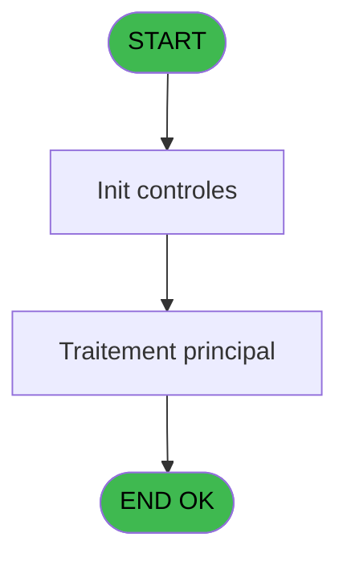
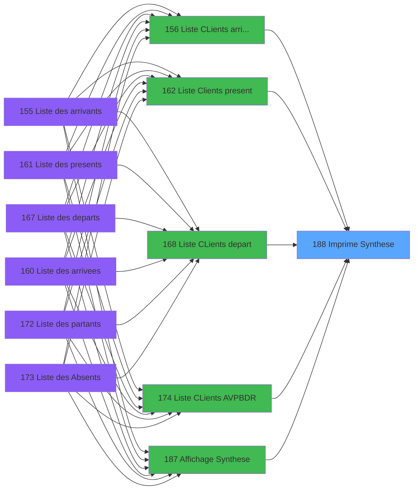

# PBP IDE 188 - Imprime Synthese

> **Analyse**: Phases 1-4 2026-02-03 15:42 -> 15:43 (15s) | Assemblage 15:43
> **Pipeline**: V7.2 Enrichi
> **Structure**: 4 onglets (Resume | Ecrans | Donnees | Connexions)

<!-- TAB:Resume -->

## 1. FICHE D'IDENTITE

| Attribut | Valeur |
|----------|--------|
| Projet | PBP |
| IDE Position | 188 |
| Nom Programme | Imprime Synthese |
| Fichier source | `Prg_188.xml` |
| Dossier IDE | Liste |
| Taches | 1 (0 ecrans visibles) |
| Tables modifiees | 0 |
| Programmes appeles | 0 |

## 2. DESCRIPTION FONCTIONNELLE

**Imprime Synthese** assure la gestion complete de ce processus, accessible depuis [  Liste CLients arrivant (IDE 156)](PBP-IDE-156.md), [  Liste Clients present (IDE 162)](PBP-IDE-162.md), [  Liste CLients depart (IDE 168)](PBP-IDE-168.md), [Liste CLients AVPBDR (IDE 174)](PBP-IDE-174.md), [  Liste present personnel plan (IDE 227)](PBP-IDE-227.md), [  Liste personnels AVPBDR (IDE 234)](PBP-IDE-234.md), [  Affichage Synthese (IDE 187)](PBP-IDE-187.md), [Liste Prestation stock (IDE 194)](PBP-IDE-194.md).

Le flux de traitement s'organise en **1 blocs fonctionnels** :

- **Traitement** (1 tache) : traitements metier divers

**Logique metier** : 2 regles identifiees couvrant conditions metier.

## 3. BLOCS FONCTIONNELS

### 3.1 Traitement (1 tache)

Traitements internes.

---

#### 188 - Veuillez patienter ... [[ECRAN]](#ecran-t1)

**Role** : Traitement : Veuillez patienter ....
**Ecran** : 434 x 61 DLU (MDI) | [Voir mockup](#ecran-t1)

## 5. REGLES METIER

2 regles identifiees:

### Autres (2 regles)

#### [RM-001] Si Left (w0_TitreEdition [L] alors 1)='P' sinon MlsTrans ('Nationalites'),MlsTrans ('Codes Logement'))

| Element | Detail |
|---------|--------|
| **Condition** | `Left (w0_TitreEdition [L]` |
| **Si vrai** | 1)='P' |
| **Si faux** | MlsTrans ('Nationalites'),MlsTrans ('Codes Logement')) |
| **Variables** | L (w0_TitreEdition) |
| **Expression source** | Expression 23 : `IF (Left (w0_TitreEdition [L],1)='P',MlsTrans ('Nationalites` |
| **Exemple** | Si Left (w0_TitreEdition [L] → 1)='P'. Sinon → MlsTrans ('Nationalites'),MlsTrans ('Codes Logement')) |

#### [RM-002] Si [BO] alors MlsTrans('Generation Excel en cours') sinon MlsTrans('Impression en cours'))

| Element | Detail |
|---------|--------|
| **Condition** | `[BO]` |
| **Si vrai** | MlsTrans('Generation Excel en cours') |
| **Si faux** | MlsTrans('Impression en cours')) |
| **Expression source** | Expression 40 : `IF([BO],MlsTrans('Generation Excel en cours'),MlsTrans('Impr` |
| **Exemple** | Si [BO] → MlsTrans('Generation Excel en cours'). Sinon → MlsTrans('Impression en cours')) |

## 6. CONTEXTE

- **Appele par**: [  Liste CLients arrivant (IDE 156)](PBP-IDE-156.md), [  Liste Clients present (IDE 162)](PBP-IDE-162.md), [  Liste CLients depart (IDE 168)](PBP-IDE-168.md), [Liste CLients AVPBDR (IDE 174)](PBP-IDE-174.md), [  Liste present personnel plan (IDE 227)](PBP-IDE-227.md), [  Liste personnels AVPBDR (IDE 234)](PBP-IDE-234.md), [  Affichage Synthese (IDE 187)](PBP-IDE-187.md), [Liste Prestation stock (IDE 194)](PBP-IDE-194.md)
- **Appelle**: 0 programmes | **Tables**: 2 (W:0 R:1 L:1) | **Taches**: 1 | **Expressions**: 40

<!-- TAB:Ecrans -->

## 8. ECRANS

*(Programme sans ecran visible)*

## 9. NAVIGATION

### 9.3 Structure hierarchique (1 tache)

| Position | Tache | Type | Dimensions | Bloc |
|----------|-------|------|------------|------|
| **188.1** | [**Veuillez patienter ...** (188)](#t1) [mockup](#ecran-t1) | MDI | 434x61 | Traitement |

### 9.4 Algorigramme

> **Legende**: Vert = START/END OK | Rouge = END KO | Bleu = Decisions
> *Algorigramme auto-genere. Utiliser `/algorigramme` pour une synthese metier detaillee.*

<!-- TAB:Donnees -->

## 10. TABLES

### Tables utilisees (2)

| ID | Nom | Description | Type | R | W | L | Usages |
|----|-----|-------------|------|---|---|---|--------|
| 118 | tables_imports |  | DB | R |   |   | 1 |
| 634 | tempo_users | Table temporaire ecran | DB |   |   | L | 1 |

### Colonnes par table (1 / 1 tables avec colonnes identifiees)

Table 118 - tables_imports (R) - 1 usages

| Lettre | Variable | Acces | Type |
|--------|----------|-------|------|
| A | >Code Liste | R | Alpha |
| B | >Top Liste | R | Alpha |
| C | >DateCalcul | R | Date |
| D | >Total | R | Numeric |
| E | >NbSelect | R | Numeric |
| F | >Age Min | R | Numeric |
| G | >Age Max | R | Numeric |
| H | >DateMax | R | Date |
| I | > Lieu de sejour | R | Alpha |
| J | > Genere Excel | R | Logical |
| K | > Nom Fichier Excel | R | Alpha |
| L | w0_TitreEdition | R | Alpha |
| M | w0_Rupture | R | Alpha |
| N | v Ligne Export | R | Alpha |
| O | v separator ; | R | Alpha |

## 11. VARIABLES

### 11.1 Variables de session (2)

Variables persistantes pendant toute la session.

| Lettre | Nom | Type | Usage dans |
|--------|-----|------|-----------|
| N | v Ligne Export | Alpha | 1x session |
| O | v separator ; | Alpha | 1x session |

### 11.2 Autres (13)

Variables diverses.

| Lettre | Nom | Type | Usage dans |
|--------|-----|------|-----------|
| A | >Code Liste | Alpha | 1x refs |
| B | >Top Liste | Alpha | 1x refs |
| C | >DateCalcul | Date | 1x refs |
| D | >Total | Numeric | - |
| E | >NbSelect | Numeric | - |
| F | >Age Min | Numeric | 1x refs |
| G | >Age Max | Numeric | 1x refs |
| H | >DateMax | Date | - |
| I | > Lieu de sejour | Alpha | 3x refs |
| J | > Genere Excel | Logical | - |
| K | > Nom Fichier Excel | Alpha | - |
| L | w0_TitreEdition | Alpha | 7x refs |
| M | w0_Rupture | Alpha | 15x refs |

## 12. EXPRESSIONS

**40 / 40 expressions decodees (100%)**

### 12.1 Repartition par type

| Type | Expressions | Regles |
|------|-------------|--------|
| CALCULATION | 14 | 0 |
| CONCATENATION | 6 | 0 |
| CONDITION | 8 | 2 |
| FORMAT | 2 | 0 |
| OTHER | 6 | 0 |
| REFERENCE_VG | 2 | 0 |
| NEGATION | 1 | 0 |
| STRING | 1 | 0 |

### 12.2 Expressions cles par type

#### CALCULATION (14 expressions)

| Type | IDE | Expression | Regle |
|------|-----|------------|-------|
| CALCULATION | 18 | `w0_Rupture [M]+10` | - |
| CALCULATION | 17 | `w0_Rupture [M]+9` | - |
| CALCULATION | 16 | `w0_Rupture [M]+8` | - |
| CALCULATION | 19 | `w0_Rupture [M]+11` | - |
| CALCULATION | 22 | `w0_Rupture [M]+14` | - |
| ... | | *+9 autres* | |

#### CONCATENATION (6 expressions)

| Type | IDE | Expression | Regle |
|------|-----|------------|-------|
| CONCATENATION | 35 | `MlsTrans ('Edition du')&' '&DStr (Date (),'DD/MM/YYYY')&' '&MlsTrans ('à')&' '&TStr (Time (),'HH:MM:SS')&[BQ]&Trim(> Lieu de sejour [I])` | - |
| CONCATENATION | 4 | `MlsTrans ('Synthèse des')&' '&IF (>Code Liste [A]='A',MlsTrans ('arrivants'),IF (>Code Liste [A]='V',MlsTrans ('arrivees'),IF (>Code Liste [A]='P',MlsTrans ('presents'),IF (>Code Liste [A]='D',MlsTrans ('departs'),IF (>Code Liste [A]='R',MlsTrans ('partants'),IF (>Code Liste [A]='B',MlsTrans ('absents'),MlsTrans ('stock prestation')))))))` | - |
| CONCATENATION | 5 | `Trim (> Lieu de sejour [I])&IF (>Top Liste [B]='SA',' age de '&Str (>Age Min [F],'##')&' à '&Str (>Age Max [G],'##'),'')` | - |
| CONCATENATION | 25 | `'- '&Str (Page (0,1),'3P0Z0')&' -'` | - |
| CONCATENATION | 6 | `Trim (> Lieu de sejour [I])&' '&MlsTrans ('du')&' '&DStr (>DateCalcul [C],'DD/MM/YYYY')&' '&MlsTrans ('au')&' '&DStr (>DateCalcul [C]+14,'DD/MM/YYYY')` | - |
| ... | | *+1 autres* | |

#### CONDITION (8 expressions)

| Type | IDE | Expression | Regle |
|------|-----|------------|-------|
| CONDITION | 40 | `IF([BO],MlsTrans('Generation Excel en cours'),MlsTrans('Impression en cours'))` | [RM-002](#rm-RM-002) |
| CONDITION | 23 | `IF (Left (w0_TitreEdition [L],1)='P',MlsTrans ('Nationalites'),MlsTrans ('Codes Logement'))` | [RM-001](#rm-RM-001) |
| CONDITION | 31 | `VG44>1` | - |
| CONDITION | 37 | `[BO] AND Counter(0)=1` | - |
| CONDITION | 39 | `Left (w0_TitreEdition [L],1)='P' OR Left (w0_TitreEdition [L],1)='T' AND [BO]` | - |
| ... | | *+3 autres* | |

#### FORMAT (2 expressions)

| Type | IDE | Expression | Regle |
|------|-----|------------|-------|
| FORMAT | 28 | `Right (w0_TitreEdition [L],14)&[BQ]&Str(v Ligne Export [N],'5Z')&[BQ]&Str(v separator ; [O],'5Z')&[BQ]&Str([P],'5Z')&[BQ]&Str([Q],'5Z')&[BQ]&Str([R],'5Z')&[BQ]&Str([S],'5Z')&[BQ]&Str([T],'5Z')&[BQ]&Str([U],'5Z')&[BQ]&Str([V],'5Z')&[BQ]&Str([W],'5Z')&[BQ]&Str([X],'5Z')&[BQ]&Str([Y],'5Z')&[BQ]&Str([Z],'5Z')&[BQ]&Str([AA],'5Z')&[BQ]&Str([AB],'5Z')&[BQ]&Str([AC],'5Z')` | - |
| FORMAT | 29 | `'Date'&[BQ]&DStr(w0_Rupture [M],'DD/MM')&[BQ]&DStr(w0_Rupture [M]+1,'DD/MM')&[BQ]&DStr(w0_Rupture [M]+2,'DD/MM')&[BQ]&DStr(w0_Rupture [M]+3,'DD/MM')&[BQ]&DStr(w0_Rupture [M]+4,'DD/MM')&[BQ]&DStr(w0_Rupture [M]+5,'DD/MM')&[BQ]&DStr(w0_Rupture [M]+6,'DD/MM')&[BQ]&DStr(w0_Rupture [M]+7,'DD/MM')&[BQ]&DStr(w0_Rupture [M]+8,'DD/MM')&[BQ]&DStr(w0_Rupture [M]+9,'DD/MM')&[BQ]&DStr(w0_Rupture [M]+10,'DD/MM')&[BQ]&DStr(w0_Rupture [M]+11,'DD/MM')&[BQ]&DStr(w0_Rupture [M]+12,'DD/MM')&[BQ]&DStr(w0_Rupture [M]+13,'DD/MM')&[BQ]&DStr(w0_Rupture [M]+14,'DD/MM')&[BQ]&Translate('Quinzaine')` | - |

#### OTHER (6 expressions)

| Type | IDE | Expression | Regle |
|------|-----|------------|-------|
| OTHER | 27 | `Right (w0_TitreEdition [L],14)` | - |
| OTHER | 30 | `[BI]` | - |
| OTHER | 36 | `[BO]` | - |
| OTHER | 1 | `GetParam ('SOCIETE')` | - |
| OTHER | 7 | `'Village '&GetParam ('VILLAGE')` | - |
| ... | | *+1 autres* | |

#### REFERENCE_VG (2 expressions)

| Type | IDE | Expression | Regle |
|------|-----|------------|-------|
| REFERENCE_VG | 33 | `VG36` | - |
| REFERENCE_VG | 2 | `VG1` | - |

#### NEGATION (1 expressions)

| Type | IDE | Expression | Regle |
|------|-----|------------|-------|
| NEGATION | 34 | `NOT [BO]` | - |

#### STRING (1 expressions)

| Type | IDE | Expression | Regle |
|------|-----|------------|-------|
| STRING | 32 | `Trim([BN])` | - |

### 12.3 Toutes les expressions (40)

Voir les 40 expressions

#### CALCULATION (14)

| IDE | Expression Decodee |
|-----|-------------------|
| 9 | `w0_Rupture [M]+1` |
| 10 | `w0_Rupture [M]+2` |
| 11 | `w0_Rupture [M]+3` |
| 12 | `w0_Rupture [M]+4` |
| 13 | `w0_Rupture [M]+5` |
| 14 | `w0_Rupture [M]+6` |
| 15 | `w0_Rupture [M]+7` |
| 16 | `w0_Rupture [M]+8` |
| 17 | `w0_Rupture [M]+9` |
| 18 | `w0_Rupture [M]+10` |
| 19 | `w0_Rupture [M]+11` |
| 20 | `w0_Rupture [M]+12` |
| 21 | `w0_Rupture [M]+13` |
| 22 | `w0_Rupture [M]+14` |

#### CONCATENATION (6)

| IDE | Expression Decodee |
|-----|-------------------|
| 25 | `'- '&Str (Page (0,1),'3P0Z0')&' -'` |
| 6 | `Trim (> Lieu de sejour [I])&' '&MlsTrans ('du')&' '&DStr (>DateCalcul [C],'DD/MM/YYYY')&' '&MlsTrans ('au')&' '&DStr (>DateCalcul [C]+14,'DD/MM/YYYY')` |
| 8 | `MlsTrans ('Edition du')&' '&DStr (Date (),'DD/MM/YYYY')&' '&MlsTrans ('à')&' '&TStr (Time (),'HH:MM:SS')` |
| 35 | `MlsTrans ('Edition du')&' '&DStr (Date (),'DD/MM/YYYY')&' '&MlsTrans ('à')&' '&TStr (Time (),'HH:MM:SS')&[BQ]&Trim(> Lieu de sejour [I])` |
| 4 | `MlsTrans ('Synthèse des')&' '&IF (>Code Liste [A]='A',MlsTrans ('arrivants'),IF (>Code Liste [A]='V',MlsTrans ('arrivees'),IF (>Code Liste [A]='P',MlsTrans ('presents'),IF (>Code Liste [A]='D',MlsTrans ('departs'),IF (>Code Liste [A]='R',MlsTrans ('partants'),IF (>Code Liste [A]='B',MlsTrans ('absents'),MlsTrans ('stock prestation')))))))` |
| 5 | `Trim (> Lieu de sejour [I])&IF (>Top Liste [B]='SA',' age de '&Str (>Age Min [F],'##')&' à '&Str (>Age Max [G],'##'),'')` |

#### CONDITION (8)

| IDE | Expression Decodee |
|-----|-------------------|
| 23 | `IF (Left (w0_TitreEdition [L],1)='P',MlsTrans ('Nationalites'),MlsTrans ('Codes Logement'))` |
| 38 | `IF (Left (w0_TitreEdition [L],1)='P',MlsTrans ('Nationalites'),MlsTrans ('Codes Logement'))` |
| 40 | `IF([BO],MlsTrans('Generation Excel en cours'),MlsTrans('Impression en cours'))` |
| 3 | `INIGet ('[MAGIC_LOGICAL_NAMES]preview')='O' AND [BO]` |
| 24 | `Left (w0_TitreEdition [L],1)='P' OR Left (w0_TitreEdition [L],1)='T' AND NOT [BO]` |
| 31 | `VG44>1` |
| 37 | `[BO] AND Counter(0)=1` |
| 39 | `Left (w0_TitreEdition [L],1)='P' OR Left (w0_TitreEdition [L],1)='T' AND [BO]` |

#### FORMAT (2)

| IDE | Expression Decodee |
|-----|-------------------|
| 29 | `'Date'&[BQ]&DStr(w0_Rupture [M],'DD/MM')&[BQ]&DStr(w0_Rupture [M]+1,'DD/MM')&[BQ]&DStr(w0_Rupture [M]+2,'DD/MM')&[BQ]&DStr(w0_Rupture [M]+3,'DD/MM')&[BQ]&DStr(w0_Rupture [M]+4,'DD/MM')&[BQ]&DStr(w0_Rupture [M]+5,'DD/MM')&[BQ]&DStr(w0_Rupture [M]+6,'DD/MM')&[BQ]&DStr(w0_Rupture [M]+7,'DD/MM')&[BQ]&DStr(w0_Rupture [M]+8,'DD/MM')&[BQ]&DStr(w0_Rupture [M]+9,'DD/MM')&[BQ]&DStr(w0_Rupture [M]+10,'DD/MM')&[BQ]&DStr(w0_Rupture [M]+11,'DD/MM')&[BQ]&DStr(w0_Rupture [M]+12,'DD/MM')&[BQ]&DStr(w0_Rupture [M]+13,'DD/MM')&[BQ]&DStr(w0_Rupture [M]+14,'DD/MM')&[BQ]&Translate('Quinzaine')` |
| 28 | `Right (w0_TitreEdition [L],14)&[BQ]&Str(v Ligne Export [N],'5Z')&[BQ]&Str(v separator ; [O],'5Z')&[BQ]&Str([P],'5Z')&[BQ]&Str([Q],'5Z')&[BQ]&Str([R],'5Z')&[BQ]&Str([S],'5Z')&[BQ]&Str([T],'5Z')&[BQ]&Str([U],'5Z')&[BQ]&Str([V],'5Z')&[BQ]&Str([W],'5Z')&[BQ]&Str([X],'5Z')&[BQ]&Str([Y],'5Z')&[BQ]&Str([Z],'5Z')&[BQ]&Str([AA],'5Z')&[BQ]&Str([AB],'5Z')&[BQ]&Str([AC],'5Z')` |

#### OTHER (6)

| IDE | Expression Decodee |
|-----|-------------------|
| 1 | `GetParam ('SOCIETE')` |
| 7 | `'Village '&GetParam ('VILLAGE')` |
| 26 | `w0_TitreEdition [L]` |
| 27 | `Right (w0_TitreEdition [L],14)` |
| 30 | `[BI]` |
| 36 | `[BO]` |

#### REFERENCE_VG (2)

| IDE | Expression Decodee |
|-----|-------------------|
| 2 | `VG1` |
| 33 | `VG36` |

#### NEGATION (1)

| IDE | Expression Decodee |
|-----|-------------------|
| 34 | `NOT [BO]` |

#### STRING (1)

| IDE | Expression Decodee |
|-----|-------------------|
| 32 | `Trim([BN])` |

<!-- TAB:Connexions -->

## 13. GRAPHE D'APPELS

### 13.1 Chaine depuis Main (Callers)

Main -> ... -> [  Liste CLients arrivant (IDE 156)](PBP-IDE-156.md) -> **Imprime Synthese (IDE 188)**

Main -> ... -> [  Liste Clients present (IDE 162)](PBP-IDE-162.md) -> **Imprime Synthese (IDE 188)**

Main -> ... -> [  Liste CLients depart (IDE 168)](PBP-IDE-168.md) -> **Imprime Synthese (IDE 188)**

Main -> ... -> [Liste CLients AVPBDR (IDE 174)](PBP-IDE-174.md) -> **Imprime Synthese (IDE 188)**

Main -> ... -> [  Liste present personnel plan (IDE 227)](PBP-IDE-227.md) -> **Imprime Synthese (IDE 188)**

Main -> ... -> [  Liste personnels AVPBDR (IDE 234)](PBP-IDE-234.md) -> **Imprime Synthese (IDE 188)**

Main -> ... -> [  Affichage Synthese (IDE 187)](PBP-IDE-187.md) -> **Imprime Synthese (IDE 188)**

Main -> ... -> [Liste Prestation stock (IDE 194)](PBP-IDE-194.md) -> **Imprime Synthese (IDE 188)**

### 13.2 Callers

| IDE | Nom Programme | Nb Appels |
|-----|---------------|-----------|
| [156](PBP-IDE-156.md) |   Liste CLients arrivant | 2 |
| [162](PBP-IDE-162.md) |   Liste Clients present | 2 |
| [168](PBP-IDE-168.md) |   Liste CLients depart | 2 |
| [174](PBP-IDE-174.md) | Liste CLients AVPBDR | 2 |
| [227](PBP-IDE-227.md) |   Liste present personnel plan | 2 |
| [234](PBP-IDE-234.md) |   Liste personnels AVPBDR | 2 |
| [187](PBP-IDE-187.md) |   Affichage Synthese | 1 |
| [194](PBP-IDE-194.md) | Liste Prestation stock | 1 |

### 13.3 Callees (programmes appeles)

### 13.4 Detail Callees avec contexte

| IDE | Nom Programme | Appels | Contexte |
|-----|---------------|--------|----------|
| - | (aucun) | - | - |

## 14. RECOMMANDATIONS MIGRATION

### 14.1 Profil du programme

| Metrique | Valeur | Impact migration |
|----------|--------|-----------------|
| Lignes de logique | 74 | Programme compact |
| Expressions | 40 | Peu de logique |
| Tables WRITE | 0 | Impact faible |
| Sous-programmes | 0 | Peu de dependances |
| Ecrans visibles | 0 | Ecran unique ou traitement batch |
| Code desactive | 6.8% (5 / 74) | A verifier |
| Regles metier | 2 | Quelques regles a preserver |

### 14.2 Plan de migration par bloc

#### Traitement (1 tache: 1 ecran, 0 traitement)

- **Strategie** : 1 composant(s) UI (Razor/React) avec formulaires et validation.
- Decomposer les taches en services unitaires testables.

### 14.3 Dependances critiques

| Dependance | Type | Appels | Impact |
|------------|------|--------|--------|

---
*Spec DETAILED generee par Pipeline V7.2 - 2026-02-03 15:43*
